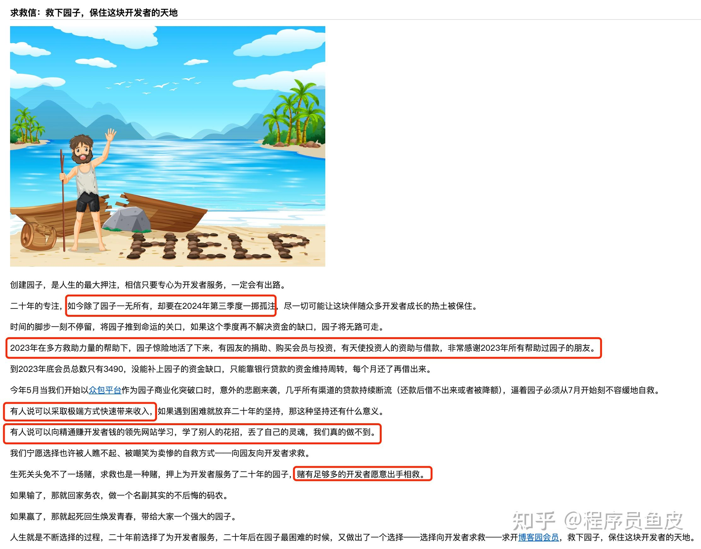
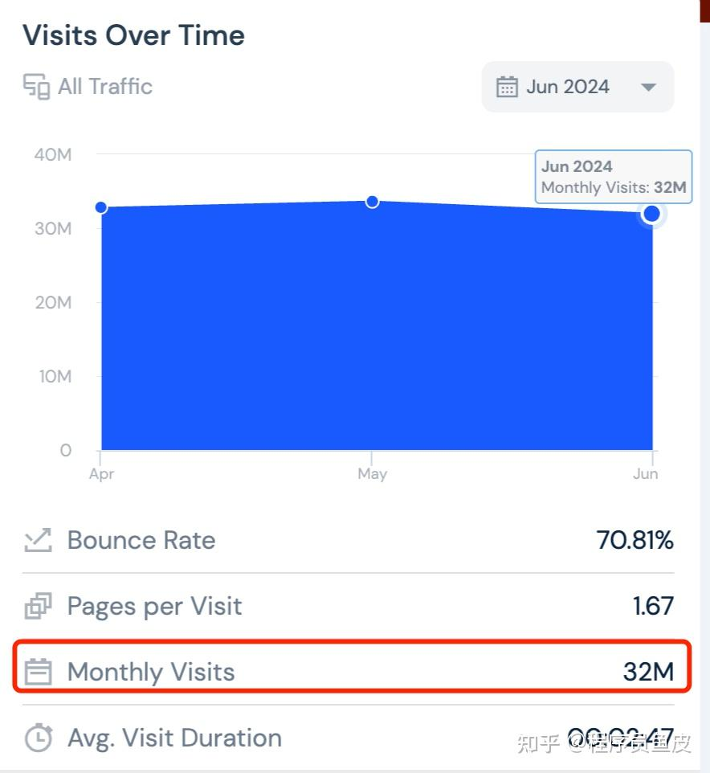
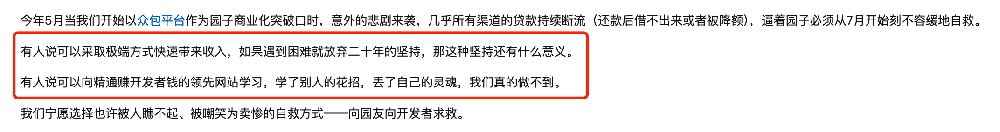

7 月 15 日，知名的经典博客站点 —— 博客园再次发布了求救信，大概的意思是说现在园子又到了生死攸关的时候，需要开发者开通会员来相救。我用红圈给大家标注了一些重点：

可以看出园子现在真的是很难了。。。不管怎么样，作为在博客园多年的作者，我先开通会员支持了一波，希望园子能挺过去。

但同样作为站长，说实在的，我有点懵逼。接下来的内容是我自己的一些思考，随便聊聊。

首先，网站运营需要成本，服务器、流量都需要大量成本，而且园子的运营一直是很用心的，所以需要资金是完全可以理解的。

只不过我认为园子的商业模式和运营策略是存在严重问题的！换句话说，从这几年来看，我基本上没有发现变化。。

别的不说，先看一组数据，我使用一些工具分析，博客园每月的访问量稳定在 **3200 万** ！

而且搜索引擎的总收录量 **超过 1 个亿** ！

这是什么概念？也不过是 10 个牛客、几十个编程导航、几百个鱼皮而已。

说实在的，你很难想象流量这么大的站点会落魄到找用户开会员求助。。。打个也许不太恰当的比喻，感觉就像是一个地主来找农民求粮食，换一身破烂衣裳，就让别人忘记了自己背后的资源和财富。

很多网友也给园子出了不少建议，比如加点广告、做一些商业化合作、以平台的视角组织大会和活动等等，这些都是不错的选择。

比如接入 Google Ads 广告，以园子目前的流量和体量，动动手指，每月入账上百万不是问题。我自己之前的小破站也接过 Google Ads，效果还不错，这算是有流量网站变现最轻松有效的方式了。

可园子没有选择这么做，他选择坚持给开发者一篇净土。

老实说，我表示绝对的 respect。如果不是多次发求救帖子的话，如果所谓的 “自救” 就是找开发者要钱的话。

园子的广告的确少、的确纯净，但并不是完全没有广告，还是有一些精心筛选的广告，下图只是其中的一部分：

其中，有一个版位是留给园子自己的会员的，其实这非常合理，只不过目前园子会员的性价比确实不高。。。主要都是一些展示权益，而且很多对创作者有利的功能是其他平台本来就免费的，没有一些优质的内容或教程来学习。

如果我不是园子的创作者，不是因为情怀，单论性价比，我肯定是不会买会员的，反而希望园子多加一些广告。而且现在的广告都是根据用户的属性智能推送的，适当加一些回回血，也并不会太影响大家的阅读体验。

园子想保持自己的初心，不愿意赚开发者的钱，但是又不得不给自己那性价比并不高的会员打广告，求着大家去买性价比不高的会员，又怎能算得上体面？情怀老用户再付费买一波 VIP，即使又临时帮你们渡过了一次难关，有什么用呢？过几个月后，还会再来发求救信么？如果真到了那个时候，我不得不怀疑，这是一场精心策划的营销活动。

而且说实在的，找开发者要钱难于上青天！我也在园子的评论区下看到了不少用户，口口声声说支持平台，结果连登录都不愿意。。这年头想要用户付费是越来越难，真不如转换个思路，从广告主那争取利益。

这些年，时代在风云变化，各种社交媒体侵占了用户的时间，传统的博客网站确实越来越难满足用户定制化的学习诉求了。在我看来，园子陷入困境的根本原因就是 “不愿改变”，抓不住创作者、抓不住广告主、抓不住合作方、抓不住用户，跟不上时代，注定会被时代淘汰的。

当然，换个角度，这可能也是老用户们喜欢园子、选择园子的理由吧。那新用户呢？还有多少新开发者选择园子？如何保证老用户体验的同时，给新用户更多元和优质的内容？想明白了这一点，园子才会越来越好。当然，这也是我一直在思考的问题哈哈。

上次园子发帖自救时，我以为他们想明白了。但后面看到园子去做了众包，还出了资金问题，我就更担心了。园子啊，真别做众包平台，这行风险太大啦！

最后，我知道自己作为 KOL，说这些话可能并不中听，但这就是我（一位付费园友）真实的想法。下次求救的时候，如果 **有一个明确的改进计划或者方案** ，我相信也会有更多人感受到你们的诚意，付费是为你们 “投资” 而不是 “可怜”。毕竟我们支持你是因为情怀，是希望你能渡过难关，期待的结果是园子能重新崛起，而不是过几个月又发一封求救信。

加油吧！衷心祝愿园子渡过难关！

  

## 更多

编程学习交流：[编程导航 - 程序员一站式编程学习交流社区，做您编程学习路上的导航员](https://link.zhihu.com/?target=https%3A//www.code-nav.cn/)

简历快速制作：[老鱼简历 - 写简历从未如此简单](https://link.zhihu.com/?target=https%3A//laoyujianli.com/)

✏️ 面试刷题神器：[面试鸭](https://link.zhihu.com/?target=https%3A//mianshiya.com/)