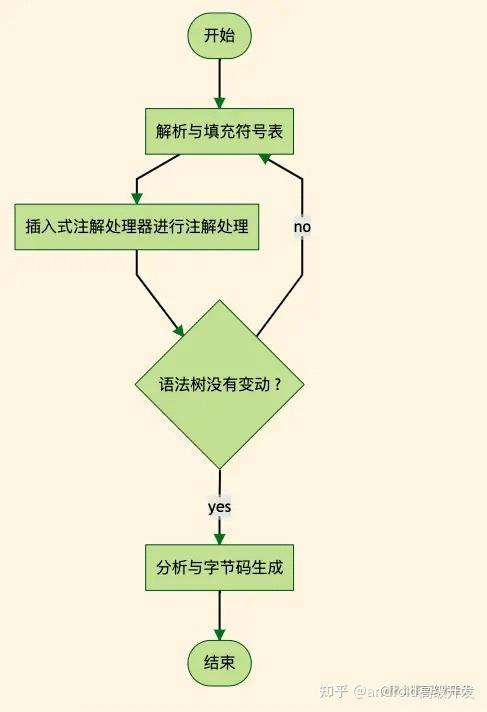
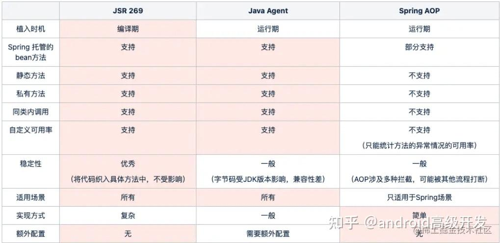
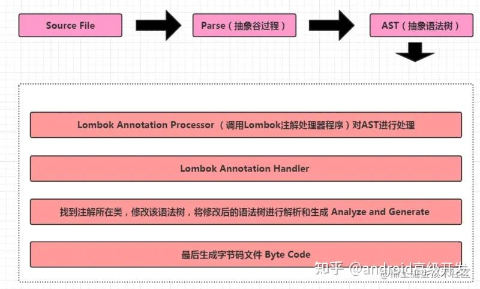

## APT 注解处理器如何实现Lombok的常用注解功能？带你完整解析

在开发中我们常常会用到类似 **lombok 、mapstruct 或者 mybatisplus** 的框架，只要加入几个注解即可生成对应的方法，既然被很多框架使用，了解其中的原理还是非常有必要的。

## **2 生成字节码原理**

### **2.1 APT(Annotation Processing Tool )注解处理器**

基于 JSR 269（Pluggable Annotation Processing API）规范，提供插入式注解处理接口，Java 6 开始支持，它的主要功能是在 Java 编译期对源码进行处理, 通过这些规范插件，可以读取、修改、添加抽象语法树中的任意元素。



如上图 Javac 在编器期间，如果使用注解处理器对语法树进行了修改，编译器将回到解析及填充符号表的过程重新处理，直至处理完成，再对语法树进行修改。

### **2.2 AbstractProcessor 注解处理器的使用**

创建一个注解处理器分为如下几步：

-   创建注解类 ： 比如 @Data 类
-   创建 AbstractProcessor 的继承类， APT 的核心类
-   修改生成字节码
-   SPI配置: 在 META-INF\\services创建名为 javax.annotation.processing.Processor 配置文件添加 SPI 实现

### **2.3 APT 、 AOP、 JavaAgent 优缺点**



在我们日常开发中，如果需要做一些埋点，AOP 并非唯一选择，APT 在有些场景下也可以使用的，支持静态方法和私有方法，同时稳定性也比较好，覆盖的场景比较全。

### **2.4 lombok 原理**

> 1 APT(Annotation Processing Tool )注解处理器 2 javac api处理AST(抽象语法树)

大致原理如下图所示：



如想具体分析 lombok 的实现，可以从 Processor 和AnnotationProcessor 这两个类的 process 方法入手，通过 lombok.javac.JavacAnnotationHandler 处理器找到对应的注解实现。

## **3 自己实现Lombok**

### **3.1 创建Data注解**

```text
@Documented
@Retention(RetentionPolicy.SOURCE)
@Target({ElementType.TYPE})
public @interface Data {
}
```

该 Data 注解只能在编译期的时候获取到，在运行期是无法获取到的。

### **3.2 自定义注解处理器**

通过实现Processor 接口可以自定义注解处理器，这里我们采用更简单的方法通过继承AbstractProcessor 类实现自定义注解处理器, 实现抽象方法 process 处理我们想要的功能。

### **3.2.1 APT简单介绍**

```text
@SupportedAnnotationTypes({"com.nicky.lombok.annotation.Data"})
@SupportedSourceVersion(SourceVersion.RELEASE_8)
public class DataProcessor extends AbstractProcessor {
   @Override
    public synchronized void init(ProcessingEnvironment processingEnv) {
    }
    @Override
    public boolean process(Set<? extends TypeElement> annotations, RoundEnvironment roundEnv) {
    }
}
```

@SupportedAnnotationTypes 注解表示哪些注解需要注解处理器处理，可以多个注解校验 @SupportedSourceVersion 注解 用于指定jdk使用版本

如果不使用注解也可以在重写父类方法

```text
Set<String> getSupportedAnnotationTypes() 
SourceVersion getSupportedSourceVersion
...
```

-   init 方法

> 主要是用于初始化上下文等信息

-   process方法

> 具体处理注解的业务方法

### **3.2.2 具体实现**

-   1 **重写init方法**

```text
/**
   * 抽象语法树
   */
  private JavacTrees trees;
  /**
   * AST
   */
  private TreeMaker treeMaker;
  /**
   * 标识符
   */
  private Names names;
  /**
   * 日志处理
   */
  private Messager messager;
  private Filer filer;
  public synchronized void init(ProcessingEnvironment processingEnvironment) {
      super.init(processingEnvironment);
      this.trees = JavacTrees.instance(processingEnv);
      Context context = ((JavacProcessingEnvironment)processingEnv).getContext();
      this.treeMaker = TreeMaker.instance(context);
      messager = processingEnvironment.getMessager();
      this.names = Names.instance(context);
      filer = processingEnvironment.getFiler();
  }
```

基本成员变量说明：

-   1 JavacTrees 这个是当前的java语法树变量
-   2 TreeMaker 这个是创建或修改方法的AST变量
-   3 Names 这个是获取变量用的
-   4 Messager 这个是打印日志的变量
-   5 Filer 做一些过滤使用的

**注:** 使用AST语法需要使用本地包 tools.jar 包

```text
<dependency>
        <groupId>com.sun</groupId>
        <artifactId>tools</artifactId>
        <version>1.8</version>
        <scope>system</scope>
        <systemPath>${java.home}/../lib/tools.jar</systemPath>
    </dependency>
```

-   2 **重写process方法**

```text
@Override
   public boolean process(Set<? extends TypeElement> annotations, RoundEnvironment roundEnv) {
       Set<? extends Element> annotation = roundEnv.getElementsAnnotatedWith(Data.class);
       annotation.stream().map(element -> trees.getTree(element)).forEach(tree -> tree.accept(new TreeTranslator() {
           @Override
           public void visitClassDef(JCClassDecl jcClass) {
               //过滤属性
               Map<Name, JCVariableDecl> treeMap =
                   jcClass.defs.stream().filter(k -> k.getKind().equals(Tree.Kind.VARIABLE))
                       .map(tree -> (JCVariableDecl)tree)
                       .collect(Collectors.toMap(JCVariableDecl::getName, Function.identity()));
               //处理变量
               treeMap.forEach((k, jcVariable) -> {
                   messager.printMessage(Diagnostic.Kind.NOTE, String.format("fields:%s", k));
                   try {
                       //增加get方法
                       jcClass.defs = jcClass.defs.prepend(generateGetterMethod(jcVariable));
                       //增加set方法
                       jcClass.defs = jcClass.defs.prepend(generateSetterMethod(jcVariable));
                   } catch (Exception e) {
                       messager.printMessage(Diagnostic.Kind.ERROR, Throwables.getStackTraceAsString(e));
                   }
               });
               //增加toString方法
               jcClass.defs = jcClass.defs.prepend(generateToStringBuilderMethod());
               super.visitClassDef(jcClass);
           }
           @Override
           public void visitMethodDef(JCMethodDecl jcMethod) {
               //打印所有方法
               messager.printMessage(Diagnostic.Kind.NOTE, jcMethod.toString());
               //修改方法
               if ("getTest".equals(jcMethod.getName().toString())) {
                   result = treeMaker
                       .MethodDef(jcMethod.getModifiers(), getNameFromString("testMethod"), jcMethod.restype,
                           jcMethod.getTypeParameters(), jcMethod.getParameters(), jcMethod.getThrows(),
                           jcMethod.getBody(), jcMethod.defaultValue);
               }
               super.visitMethodDef(jcMethod);
           }
       }));
       return true;
   }
```

上面逻辑分别实现了getter方法 setter方法 toString方法

大致逻辑:

1 过滤包含Data的 Element 变量 2 根据 Element 获取AST语法树 3 创建语法翻译器重写 visitClassDef 和 visitMethodDef 方法 4 过滤变量生成 get方法 set方法 和 toString方法

-   3 **get方法实现**

```text
private JCMethodDecl generateGetterMethod(JCVariableDecl jcVariable) {
      //修改方法级别
      JCModifiers jcModifiers = treeMaker.Modifiers(Flags.PUBLIC);
      //添加方法名称
      Name methodName = handleMethodSignature(jcVariable.getName(), "get");
      //添加方法内容
      ListBuffer<JCStatement> jcStatements = new ListBuffer<>();
      jcStatements.append(
          treeMaker.Return(treeMaker.Select(treeMaker.Ident(getNameFromString("this")), jcVariable.getName())));
      JCBlock jcBlock = treeMaker.Block(0, jcStatements.toList());
      //添加返回值类型
      JCExpression returnType = jcVariable.vartype;
      //参数类型
      List<JCTypeParameter> typeParameters = List.nil();
      //参数变量
      List<JCVariableDecl> parameters = List.nil();
      //声明异常
      List<JCExpression> throwsClauses = List.nil();
      //构建方法
      return treeMaker
          .MethodDef(jcModifiers, methodName, returnType, typeParameters, parameters, throwsClauses, jcBlock, null);
  }
```

-   4 **set方法实现**

```text
private JCMethodDecl generateSetterMethod(JCVariableDecl jcVariable) throws ReflectiveOperationException {
    //修改方法级别
    JCModifiers modifiers = treeMaker.Modifiers(Flags.PUBLIC);
    //添加方法名称
    Name variableName = jcVariable.getName();
    Name methodName = handleMethodSignature(variableName, "set");
    //设置方法体
    ListBuffer<JCStatement> jcStatements = new ListBuffer<>();
    jcStatements.append(treeMaker.Exec(treeMaker
        .Assign(treeMaker.Select(treeMaker.Ident(getNameFromString("this")), variableName),
            treeMaker.Ident(variableName))));
    //定义方法体
    JCBlock jcBlock = treeMaker.Block(0, jcStatements.toList());
    //添加返回值类型
    JCExpression returnType =
        treeMaker.Type((Type)(Class.forName("com.sun.tools.javac.code.Type$JCVoidType").newInstance()));
    List<JCTypeParameter> typeParameters = List.nil();
    //定义参数
    JCVariableDecl variableDecl = treeMaker
        .VarDef(treeMaker.Modifiers(Flags.PARAMETER, List.nil()), jcVariable.name, jcVariable.vartype, null);
    List<JCVariableDecl> parameters = List.of(variableDecl);
    //声明异常
    List<JCExpression> throwsClauses = List.nil();
    return treeMaker
        .MethodDef(modifiers, methodName, returnType, typeParameters, parameters, throwsClauses, jcBlock, null);
}
```

-   5 **toString方法实现**

```text
private JCMethodDecl generateToStringBuilderMethod() {
       //修改方法级别
       JCModifiers modifiers = treeMaker.Modifiers(Flags.PUBLIC);
       //添加方法名称
       Name methodName = getNameFromString("toString");
       //设置调用方法函数类型和调用函数
       JCExpressionStatement statement = treeMaker.Exec(treeMaker.Apply(List.of(memberAccess("java.lang.Object")),
           memberAccess("com.nicky.lombok.adapter.AdapterFactory.builderStyleAdapter"),
           List.of(treeMaker.Ident(getNameFromString("this")))));
       ListBuffer<JCStatement> jcStatements = new ListBuffer<>();
       jcStatements.append(treeMaker.Return(statement.getExpression()));
       //设置方法体
       JCBlock jcBlock = treeMaker.Block(0, jcStatements.toList());
       //添加返回值类型
       JCExpression returnType = memberAccess("java.lang.String");
       //参数类型
       List<JCTypeParameter> typeParameters = List.nil();
       //参数变量
       List<JCVariableDecl> parameters = List.nil();
       //声明异常
       List<JCExpression> throwsClauses = List.nil();
       return treeMaker
           .MethodDef(modifiers, methodName, returnType, typeParameters, parameters, throwsClauses, jcBlock, null);
   }
private JCExpression memberAccess(String components) {
       String[] componentArray = components.split("\\.");
       JCExpression expr = treeMaker.Ident(getNameFromString(componentArray[0]));
       for (int i = 1; i < componentArray.length; i++) {
           expr = treeMaker.Select(expr, getNameFromString(componentArray[i]));
       }
       return expr;
   }
   private Name handleMethodSignature(Name name, String prefix) {
       return names.fromString(prefix + CaseFormat.LOWER_CAMEL.to(CaseFormat.UPPER_CAMEL, name.toString()));
   }
   private Name getNameFromString(String s) {
       return names.fromString(s);
   }
```

最后是通过 SPI 的方式加载注解处理器，spi 可以用 java 自带的方式，具体用法可以参考我的文章：[框架基础之SPI机制](https://link.zhihu.com/?target=https%3A//www.jb51.net/article/263152.htm) , 这里我们使用 google 封装的 **auto-service** 框架来实现。

在pom文件中引入

```text
<dependency>
    <groupId>com.google.auto.service</groupId>
    <artifactId>auto-service</artifactId>
    <version>1.0-rc4</version>
    <optional>true</optional>
</dependency>
<dependency>
    <groupId>com.google.auto</groupId>
    <artifactId>auto-common</artifactId>
    <version>0.10</version>
    <optional>true</optional>
</dependency>
```

然后在添加AutoService注解

```text
@SupportedAnnotationTypes({"com.nicky.lombok.annotation.Data"})
@SupportedSourceVersion(SourceVersion.RELEASE_8)
@AutoService(Processor.class)
public class DataProcessor extends AbstractProcessor {
}
```

最后就是 mvn clean install打包到本地仓库作为一个公共包

```text
[INFO] Installing /Users/chenxing/Documents/sourcecode/id-generator-spring-boot-starter/lombok-enchance/target/java-feature.jar to /Users/chenxing/m2repository/com/nicky/lombok-enchance/1.0.4/lombok-enchance-1.0.4.jar
[INFO] Installing /Users/chenxing/Documents/sourcecode/id-generator-spring-boot-starter/lombok-enchance/pom.xml to /Users/chenxing/m2repository/com/nicky/lombok-enchance/1.0.4/lombok-enchance-1.0.4.pom
[INFO] ------------------------------------------------------------------------
[INFO] BUILD SUCCESS
[INFO] ------------------------------------------------------------------------
[INFO] Total time: 2.372 s
[INFO] Finished at: 2022-09-03T10:44:27+08:00
[INFO] ------------------------------------------------------------------------
➜  lombok-enchance git:(master) ✗ 
```

我们测试下，我们的注解处理器是否按所想的那样，实现了相应功能。

在项目中引入本地依赖 例如我的仓库依赖坐标：

```text
<dependency>
    <groupId>com.nicky</groupId>
    <artifactId>lombok-enchance</artifactId>
    <version>1.0.4</version>
</dependency>
```

给LombokTest 类添加 @Data 注解

```text
@Data
public class LombokTest {
    private String name;
    private int age;
    public LombokTest(String name) {
        this.name = name;
    }
    public static void main(String[] args) {
        LombokTest lombokTest = new LombokTest("nicky");
        lombokTest.age = 18;
        System.out.println(lombokTest.toString());
    }
}
```

我们编译上面的类，查看 class文件是否生成了getField() setField() toString()方法

```text
public class LombokTest {
    private java.lang.String name;
    private int age;
    public java.lang.String toString() { /* compiled code */ }
    public void setName(java.lang.String name) { /* compiled code */ }
    public java.lang.String getName() { /* compiled code */ }
    public void setAge(int age) { /* compiled code */ }
    public int getAge() { /* compiled code */ }
    public LombokTest(java.lang.String name) { /* compiled code */ }
    public static void main(java.lang.String[] args) { /* compiled code */ }
}
```

成功啦

最后测试下main方法

打印结果如下:

> {"name":"清水","age":18}

说明toString方法生效了。

当然对于 get 和 set 方法 直接在IDE工具里还是无法调用的，需要编写 IDE 的 Lombok 插件,这里就不去扩展了。

Reference

-   在编译期修改语法树
-   tools.jar注释文档
-   JSR-269


以上就是APT 注解处理器实现 Lombok 常用注解功能详解的详细内容，更多关于APT 实现Lombok注解功能的资料请点击获取**[《Android核心技术笔记》](https://link.zhihu.com/?target=https%3A//docs.qq.com/doc/DUkNRVFFzTG96VHNi)**或查看主页其它相关文章！

[Android核心技术进阶手册、实战笔记、面试题纲资料](https://link.zhihu.com/?target=https%3A//docs.qq.com/doc/DUkNRVFFzTG96VHNi)

## **文末**

spi全称为 (Service Provider Interface)，是JDK内置的一种服务提供发现机制。SPI是一种动态替换发现的机制，一种解耦非常优秀的思想。

```text
spi的工作原理： 就是ClassPath路径下的META-INF/services文件夹中， 以接口的全限定名来命名文件名，
文件里面写该接口的实现。然后再资源加载的方式，读取文件的内容(接口实现的全限定名)， 然后再去加载类。
```

spi可以很灵活的让接口和实现分离， 让api提供者只提供接口， 第三方来实现。