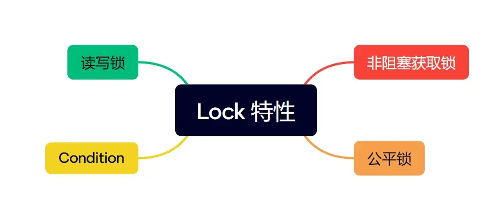
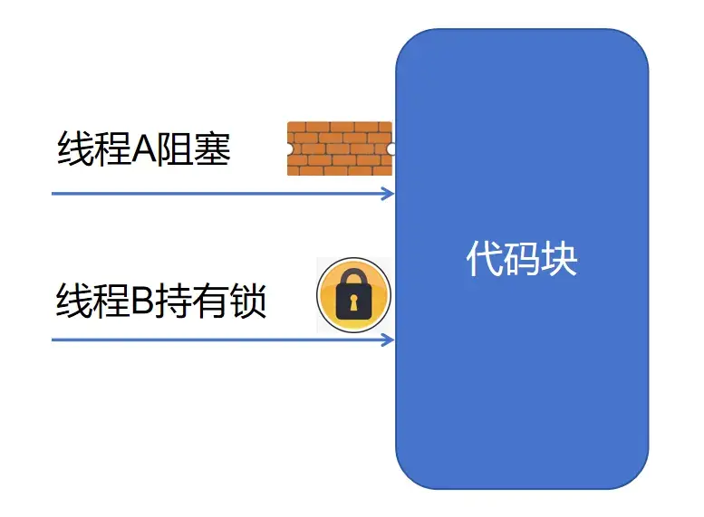
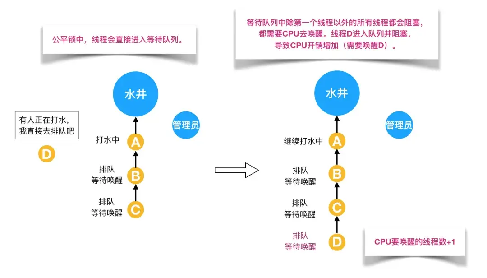

多年以前 JDK 主流版本还是1.5的时候，选择 synchronized 还是 Lock，这个问题还是非常好回答的，因为那时通过 synchronized 关键字加锁是一个重量级操作，可能加锁操作的时间比执行业务代码逻辑的时间还要长。

但到了 JDK 1.6 版本以后，JVM 团队对 synchronized 做了很多优化，包括：锁消除、锁粗化、自适应自旋、轻量级锁、偏向锁等，两者的性能差距已经相差无几了，也不需要手动释放锁，且官方也表示优先使用 synchronized 关键字。

那问题来了，既然在 Java 中已经有了synchronized，那为什么还需要 Lock 呢？或者换句话说，Lock 还存在哪些 synchronized 不具备的特性呢？

先分享一套我自己逐字写的、深入浅出、细致易懂的高频面试题详解，旨在以**一站式刷题 + 解惑**的方式帮你提升学习效率，需要的请自取。

[大厂Java高频面试题详解](https://link.zhihu.com/?target=https%3A//mp.weixin.qq.com/s%3F__biz%3DMzkxMDUxNzM2Nw%3D%3D%26mid%3D2247484894%26idx%3D1%26sn%3D920715e633964de11dfa47bff3b6b12c%26chksm%3Dc12b70c6f65cf9d0feb54b096976ee6b986195fa1584c183a67c327a0fe6df8ecaccb12d51e5%26token%3D1790900296%26lang%3Dzh_CN%23rd)

强烈建议近期有求职诉求的Javaer好好看看。



本文我们就从几个方面来讲一讲。  

### **非阻塞获取锁**

我们都知道，如果 A 线程试图通过 synchronized 获取锁来执行对应的代码逻辑时，若此时该锁已经被 B 线程获取到，则 A 线程只能进入阻塞状态，等待 B 线程将代码执行完释放锁。

也就是说，如果 B 线程执行十分钟才释放锁，那 A 线程只能在那眼巴巴地被阻塞十分钟，别无选择。  

这本来就是不合理的，举个生活中的例子，我去健身房发现靠窗的跑步机被人占了，那我还不能去找个其他闲置的跑步机，只能眼巴巴地等着这个人跑完吗？

如下图所示：  

  



  

而这个 synchronized 无解的场景下，Lock 却提供了对应的解决方案，而且一提供就是三种。

**（1）boolean tryLock();**

这是一种比较潇洒的做法，通过该方法尝试获取锁，返回值 true false代表成功或失败，该方法不会阻塞等待。

代码实例如下：

```java
import java.util.concurrent.TimeUnit;
import java.util.concurrent.locks.ReentrantLock;
 
public class LockExample {
    private final ReentrantLock lock = new ReentrantLock();
 
    public void execute() {
        // 尝试获取锁一次
        if (lock.tryLock()) {
            try {
                // 在此处执行获取锁后的业务代码逻辑
                System.out.println("Lock acquired, work performed here.");
            } catch (Exception e) {
                // 处理异常
                e.printStackTrace();
            } finally {
                // 确保释放锁
                lock.unlock();
            }
        } else {
            // 在此处执行没有获取锁的业务代码逻辑
            System.out.println("Could not acquire lock, work performed here.");
        }
    }
 
    public static void main(String[] args) {
        LockExample example = new LockExample();
        example.execute();
    }
}
```

**（2）boolean tryLock(long time, TimeUnit unit);**

这是一种比较睿智的做法，通过该方法在一段时间内尝试获取锁，获取成功返回 true，超时未获取锁则返回 false。

代码实例如下：

```java
import java.util.concurrent.TimeUnit;
import java.util.concurrent.locks.ReentrantLock;
 
public class LockExample {
    private final ReentrantLock lock = new ReentrantLock();
 
    public void execute() {
        // 尝试获取锁，最多等待100毫秒
        if (lock.tryLock(100, TimeUnit.MILLISECONDS)) {
            try {
                // 在此处执行获取锁后的业务代码逻辑
                System.out.println("Lock acquired, work performed here.");
            } catch (Exception e) {
                // 处理异常
                e.printStackTrace();
            } finally {
                // 确保释放锁
                lock.unlock();
            }
        } else {
            // 在此处执行没有获取锁的业务代码逻辑
            System.out.println("Could not acquire lock, work performed here.");
        }
    }
 
    public static void main(String[] args) {
        LockExample example = new LockExample();
        example.execute();
    }
}
```

  
**（3）void lockInterruptibly();**

这是一种比较听人劝的做法，当使用该方法获取锁并处于阻塞状态下，是可以响应中断的。

代码实例如下：

```java
import java.util.concurrent.TimeUnit;
import java.util.concurrent.locks.Lock;
import java.util.concurrent.locks.ReentrantLock;


public class TestLockInterruptibly {

    final Lock lock = new ReentrantLock();

    public static void main(String[] args) throws Exception {
        TestLockInterruptibly testLockInterruptibly = new TestLockInterruptibly();
        Thread lockThread = new Thread(
                () -> testLockInterruptibly.lock()
        );
        Thread interruptiblyThread = new Thread(
                () -> testLockInterruptibly.lockInterruptibly()
        );
        lockThread.start();
        interruptiblyThread.start();

        TimeUnit.SECONDS.sleep(2);
        interruptiblyThread.interrupt();
    }

    public void lockInterruptibly() {
        try {
            TimeUnit.SECONDS.sleep(1);
            lock.lockInterruptibly();
            System.out.println("通过lockInterruptibly方法获取锁");
        } catch (InterruptedException e) {
            System.out.println("捕捉InterruptedException异常");
        }finally {
            lock.unlock();
            System.out.println("l通过lockInterruptibly方法释放锁");
        }
    }

    public void lock() {
        try {
            lock.lock();
            System.out.println("通过lock方法获取锁");
            TimeUnit.SECONDS.sleep(5);
        }catch (InterruptedException e) {
            System.out.println("捕捉InterruptedException异常");
        }finally {
            lock.unlock();
            System.out.println("通过lock方法释放锁");
        }
    }

}
```

输出日志为：

```text
通过lock方法获取锁
捕捉InterruptedException异常
Exception in thread "Thread-1" java.lang.IllegalMonitorStateException
  at java.base/java.util.concurrent.locks.ReentrantLock$Sync.tryRelease(ReentrantLock.java:175)
  at java.base/java.util.concurrent.locks.AbstractQueuedSynchronizer.release(AbstractQueuedSynchronizer.java:1059)
  at java.base/java.util.concurrent.locks.ReentrantLock.unlock(ReentrantLock.java:494)
  at TestLockInterruptibly.lockInterruptibly(TestLockInterruptibly.java:33)
  at TestLockInterruptibly.lambda$main$1(TestLockInterruptibly.java:16)
  at java.base/java.lang.Thread.run(Thread.java:1570)
通过lock方法释放锁
```

由此可见，与 synchronized 的获取锁不成只能傻傻阻塞等待不同，Lock 则具备了在该场景下的非阻塞方式，其中包括尝试获取一次、尝试一段时间内获取和获取时响应中断。  

### **公平锁**

我们都知道 synchronized 是一种非公平锁，而 Lock 则同时支持公平锁和公平锁两种模式。

公平锁需要维护一个等待队列（AQS），且其休眠和唤醒操作需要涉及到操作系统用户态和内核态的切换，因此其吞吐量比非公平锁低很多。

公平锁实现方式，如下图：

  



非公平锁实现方式，如下图：


  

但公平锁会严格按照请求的顺序来分配锁并执行代码逻辑，这样可以防止牟星线程的长时间锁等待，避免了线程饥饿的问题，这点在一些高并发场景非常重要。

代码实例如下：

```java
import java.util.concurrent.TimeUnit;
import java.util.concurrent.locks.ReentrantLock;

public class FairLockExample {
    private static ReentrantLock fairLock = new ReentrantLock(true);

    public static void main(String[] args) {
        Runnable fairTask = new FairTask();
        Thread thread1 = new Thread(fairTask, "Thread-1");
        Thread thread2 = new Thread(fairTask, "Thread-2");
        Thread thread3 = new Thread(fairTask, "Thread-3");
        thread1.start();
        thread2.start();
        thread3.start();
    }

    static class FairTask implements Runnable {
        @Override
        public void run() {
            while (true) {
                try {
                    fairLock.lock();
                    System.out.println(Thread.currentThread().getName() + " 获得锁");
                    TimeUnit.SECONDS.sleep(1);
                } catch (InterruptedException e) {
                    e.printStackTrace();
                } finally {
                    System.out.println(Thread.currentThread().getName() + " 释放锁");
                    fairLock.unlock();
                }
            }
        }
    }
}
```

输出日志为：

```text
Thread-1 获得锁
Thread-1 释放锁
Thread-2 获得锁
Thread-2 释放锁
Thread-3 获得锁
Thread-3 释放锁
Thread-1 获得锁
Thread-1 释放锁
Thread-2 获得锁
Thread-2 释放锁
Thread-3 获得锁
Thread-3 释放锁
```

### **读写锁**

读写锁（ReentrantReadWriteLock ）也是 Lock 的一种实现方式，其允许多个读线程同时访问，但仅允许一个写线程访问，当写线程访问时会阻塞所有的读写线程，跟MySQL 数据库中的共享锁和独占锁的策略异曲同工。

这种设计方式在读操作远多于写操作的时候，可能获得吞吐量的大幅提升。

代码实例如下：

```java
import java.util.concurrent.TimeUnit;
import java.util.concurrent.locks.Lock;
import java.util.concurrent.locks.ReentrantReadWriteLock;

public class ReadWriteLockExample {
    private ReentrantReadWriteLock lock = new ReentrantReadWriteLock();
    private Lock readLock = lock.readLock();
    private Lock writeLock = lock.writeLock();


    public void readData() {
        try {
            readLock.lock();
            System.out.println(Thread.currentThread().getName() + " 获得读锁");
            TimeUnit.SECONDS.sleep(1);
        } catch (InterruptedException e) {
            e.printStackTrace();
        } finally {
            System.out.println(Thread.currentThread().getName() + " 释放读锁");
            readLock.unlock();
        }
    }

    public void writeData() {
        try {
            writeLock.lock();
            System.out.println(Thread.currentThread().getName() + " 获得写锁");
            TimeUnit.SECONDS.sleep(1);
        } catch (InterruptedException e) {
            e.printStackTrace();
        } finally {
            System.out.println(Thread.currentThread().getName() + " 释放写锁");
            writeLock.unlock();
        }
    }

    public static void main(String[] args) {
        ReadWriteLockExample example = new ReadWriteLockExample();

        // 多个读操作可以同时进行
        for (int i = 0; i < 10; i++) {
            new Thread(() -> example.readData()).start();
        }

        // 写操作将阻塞所有的读写操作
        new Thread(() -> example.writeData()).start();
    }
}
```

输出日志为：

```text
Thread-2 获得读锁
Thread-7 获得读锁
Thread-9 获得读锁
Thread-1 获得读锁
Thread-0 获得读锁
Thread-3 获得读锁
Thread-6 获得读锁
Thread-5 获得读锁
Thread-4 获得读锁
Thread-8 获得读锁
Thread-4 释放读锁
Thread-0 释放读锁
Thread-2 释放读锁
Thread-3 释放读锁
Thread-1 释放读锁
Thread-5 释放读锁
Thread-8 释放读锁
Thread-7 释放读锁
Thread-6 释放读锁
Thread-9 释放读锁
Thread-10 获得写锁
Thread-10 释放写锁
```

### **Condition**

与 Lock 配合使用的 Condition 类，它的 await()和signal()、signalAll() 方法的功能，与 synchronized 中的wait()、notify()、notifyAll() 差不多，但在一个Lock对象里可以创建多个Condition，从而可以有选择的进行线程通知，在线程调度上更加灵活。

代码实例如下：

```java
import java.util.concurrent.TimeUnit;
import java.util.concurrent.locks.Condition;
import java.util.concurrent.locks.ReentrantLock;

public class ConditionExample {

    private ReentrantLock lock = new ReentrantLock();
    public Condition conditionA = lock.newCondition();
    public Condition conditionB = lock.newCondition();

    public void awaitA() {
        try {
            lock.lock();
            System.out.println(Thread.currentThread().getName() + "进入了awaitA方法");
            conditionA.await();
            System.out.println(Thread.currentThread().getName()+"被唤醒");
        } catch (InterruptedException e) {
            e.printStackTrace();
        } finally {
            lock.unlock();
        }
    }

    public void awaitB() {
        try {
            lock.lock();
            System.out.println(Thread.currentThread().getName() + "进入了awaitB方法");
            conditionB.await();
            System.out.println(Thread.currentThread().getName()+"被唤醒");
        } catch (InterruptedException e) {
            e.printStackTrace();
        } finally {
            lock.unlock();
        }
    }

    public void signallA() {
        try {
            lock.lock();
            System.out.println("执行唤醒程序A的操作");
            conditionA.signalAll();
        } finally {
            lock.unlock();
        }
    }

    public void signallB() {
        try {
            lock.lock();
            System.out.println("执行唤醒程序A的操作");
            conditionB.signalAll();
        } finally {
            lock.unlock();
        }
    }

    public static void main(String[] args) throws InterruptedException {

        ConditionExample condition = new ConditionExample();

        new Thread(() -> condition.awaitA()).start();
        new Thread(() -> condition.awaitB()).start();

        TimeUnit.SECONDS.sleep(1);

        condition.signallA();
        condition.signallB();
    }
}
```

  
输出日志为：

```text
Thread-0进入了awaitA方法
Thread-1进入了awaitB方法
执行唤醒程序A的操作
执行唤醒程序A的操作
Thread-0被唤醒
Thread-1被唤醒
```

所以，我对“既然有了 synchronized，为什么还需要 Lock”这个问题的回答是五个字 —— 存在即合理。

分享一套我自己逐字写的、深入浅出、细致易懂的高频面试题详解，旨在以**一站式刷题 + 解惑**的方式帮你提升学习效率，需要的请自取。

[大厂Java高频面试题详解](https://link.zhihu.com/?target=https%3A//mp.weixin.qq.com/s%3F__biz%3DMzkxMDUxNzM2Nw%3D%3D%26mid%3D2247484894%26idx%3D1%26sn%3D920715e633964de11dfa47bff3b6b12c%26chksm%3Dc12b70c6f65cf9d0feb54b096976ee6b986195fa1584c183a67c327a0fe6df8ecaccb12d51e5%26token%3D1790900296%26lang%3Dzh_CN%23rd)

强烈建议近期有求职诉求的Javaer好好看看。