作者 | 朱仕智  
编辑 | 贾亚宁

> 本文由极客时间整理自去哪儿旅行基础架构部高级技术总监朱仕智在 QCon+ 案例研习社的演讲《去哪儿旅行微服务架构实践》。

你好，我是朱仕智，在去哪儿网负责基础架构，主要包含后端架构、大前端架构、质量保障、基础云平台等工作，近期主要在公司落地云原生和数字化管理。

  
今天我带来的主题是去哪儿旅行微服务架构实践。我将从以下几个方面进行介绍：  

1.  背景介绍
2.  微服务架构模式的最佳实践
3.  微服务开发效率的提升实践
4.  微服务治理的实践
5.  ServiceMesh 尝试

## 一、背景介绍

首先介绍一下去哪儿网的业务。去哪儿网是一个典型的在线旅游平台，它上面的业务繁多，有机票、酒店、度假、火车票、汽车票等等。

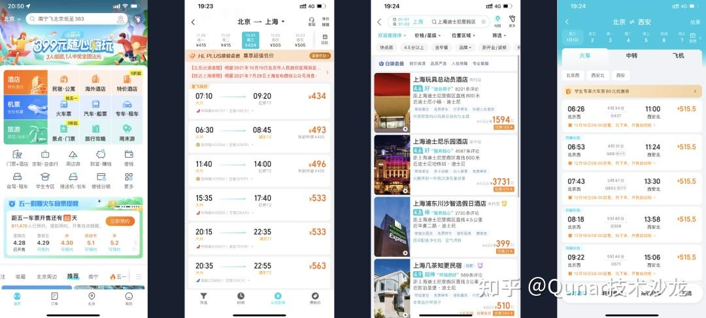

这些业务都有不同的业务流程，其中机票的标准化和线上化是最高的，但是像酒店这样的业务，在线化和标准化就比较低，同样的名字可能是不一样的酒店。这些业务在从商品、库存到整个交易过程其实都是不一样的，所以这些业务从背后来看还是相对比较复杂的。

  
我们为什么要选择微服务，其实有以下几个方面的原因。第一个就是业务逐渐复杂，最早去哪儿网其实只有机票的比价，而且是一个搜索比价，是没有交易环节的。后来业务扩展就慢慢地发展出来了包含机票、酒店、火车票、度假、汽车票等等其他的业务。

所以业务是逐渐复杂的一个过程，那按照康威定律大家都知道，业务变化了之后，组织结构要进行相应的调整，组织架构其实也会跟着相应的膨胀，膨胀也会带来协作上和分工上的一定损耗，这也是我们要选择微服务的原因之一。

  
第三个就是开发效率的低下，我们之前开发的时候大部分都是以最早的模式，也就是通过 HTTP 协议，加上 JSON 这样的数据结构，然后使用 Nginx 作为网关，把服务治理的这些动作全部耦合在业务代码里面，比如重试的逻辑等等。这样的话就会导致我们每一个服务做对应开发的时候，都需要重复性地去考虑这些问题，开发效率相对就会比较低下。

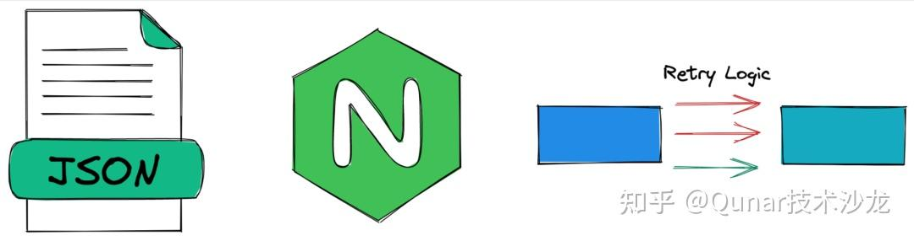

第四个就是服务质量是比较失控的，因为这些服务质量很难能在统一的一个地方去得到比较有效、及时地处理，就像刚才说的治理的逻辑其实是放在了业务代码里面，有一些治理逻辑可能会放在 Nginx 里面，但是 Nginx 是一个大统一的网关，这就意味着当我们想要去对它进行修改的时候，其实是需要非常谨慎的，这就面临了一个运维和开发诉求不对等的问题。使用微服务我们认为是可以比较有效地解决这些问题的。

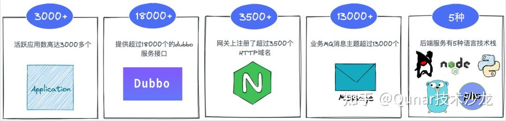

接着介绍一下我们去哪儿网的在线数据。我们现在的应用数据是这样的：活跃的、在线跑着的应用大概有 3000 多个；提供了 18,000 多个 Dubbo 的 RPC 服务接口；有超过 3500 个 HTTP 域名；13,000 多个 MQ 的主题；公司内部大概有 5 种语言的技术栈，当然主要是以 Java 和 Node 为主。

## 二、微服务架构模式的最佳实践

  

接下来介绍一下架构模式，架构模式里面有几个方面不同的范畴。

### 1\. 服务发现模式

  

第一个就是服务发现的模式，服务发现里面其实有三种模式，这三种模式对应不同的适用场景会有不同的效果。

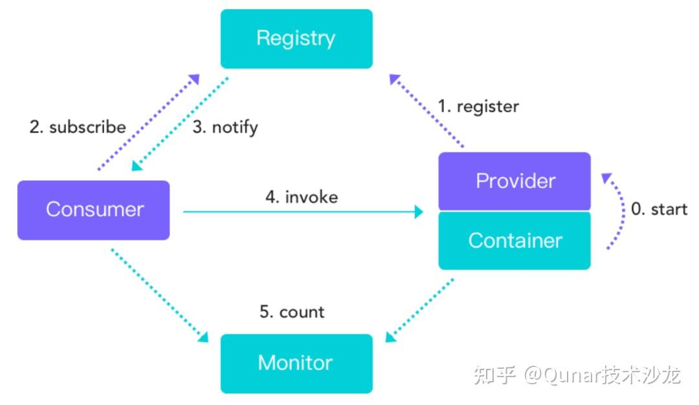

直联模式，客户端从注册中心发现服务端的列表并缓存在本地，这种模式适合于语言统一的这种内网通信，为什么呢？因为直连模式里面大部分 RPC 采用的这样的模式，主要是比较简单、高效，而且在统一语言的内网通信里面，这种服务端的实例的变更通知是比较简单的。

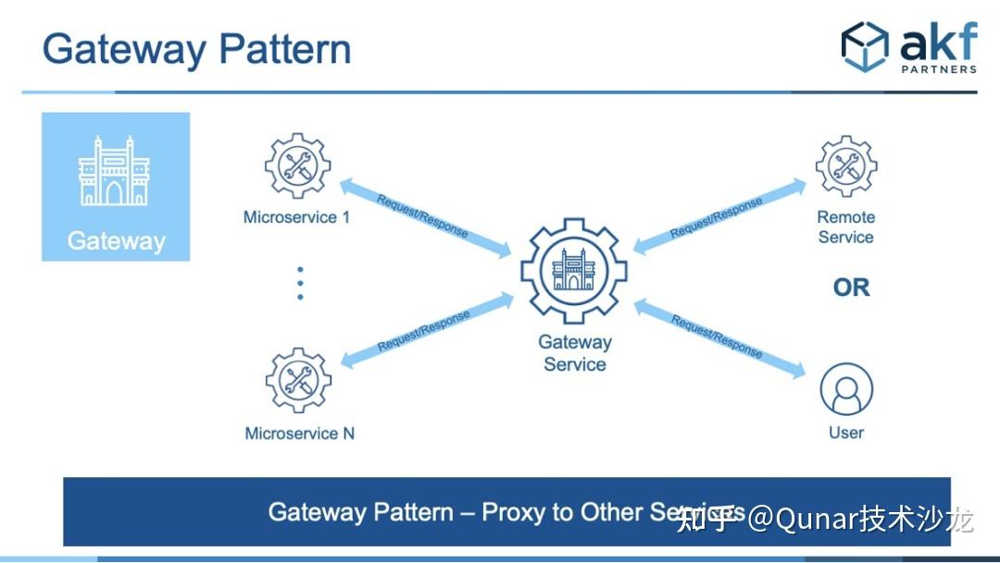

  
代理模式，服务端注册到网关上，客户端对一个服务端其实是无感知的，这种模式比较适合于外网服务，为什么呢？是因为当你的服务端变更的时候，客户端其实是不需要去感知，也不需要对此进行任何变更，这样对外网来说，其实用户侧的设备是不需要去关注信息的，这样通知起来就比较简单。但是它也会面临一个问题，它会多一跳的通信，从性能或者效率上来说，肯定是不如直连模式的。

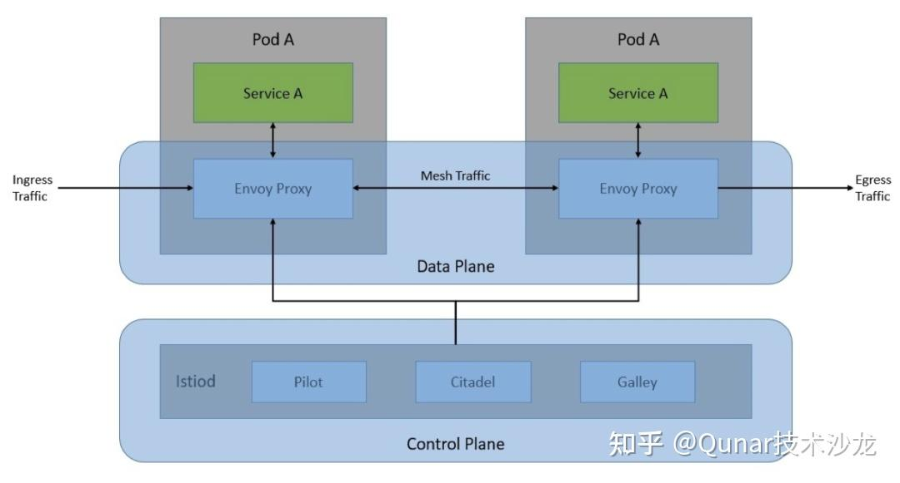

最后一个就是边车模式，Sidecar 去负责注册和发现，应用程序是无感知的，这种比较适合于多语言、多协议的这种内网通信，它其实跟直连模式相对来说是比较相似的，但是它其实是由边车的模式替代了业务程序里面混入的这种基础功能，所以简单来看其实就是直连模式里面把公共的基础设施的逻辑下沉到了边车里面。这样的话边车就可以统一地配合我们的灰度发布或者是其他的热更新的机制，能够做到比较容易地去对这些边车进行升级。

### 2\. 服务通信模式

  

接下来我们说一下服务通信的模式，服务通信模式里面主要有两种，大家其实日常里面比较经常会碰到就是同步的编程模式，这种模式比较简单易懂，非常符合人类的思考习惯，它比较适用于时间比较敏感的、吞吐量也比较小的这种场景。但是这种通信的方式在吞吐量比较大、QPS 比较高的场景里面就会有一系列的问题，比如说可能会把你的资源耗尽，但其实这些资源都处于等待中。比如我们在 Java 里面可能会有线程池的资源，使用起来其实是比较低效的。然后在异步的这种场景里面，它其实比较适用于高吞吐、削峰填谷的作用。

  
其实这里面会有几种，从我们的实践上来看的话，比如说搜索系统它其实是一个非常高并发的场景，其实对于这种高吞吐的场景下是必须要用异步的，不然的话其实资源的损耗是非常高的，我们在某些系统上做过改造，由原来的同步改为异步的话，基本上可以节省掉 80% 左右的机器的资源。除此之外，交易系统的事件驱动也是比较适合异步的一个场景，因为交易系统的事件其实是非常关键的，但是它又不能每个人都去通知，因为很多人都需要关注这个事件，这个时候利用 MQ 等方式去做这种事件的驱动是比较合适的。

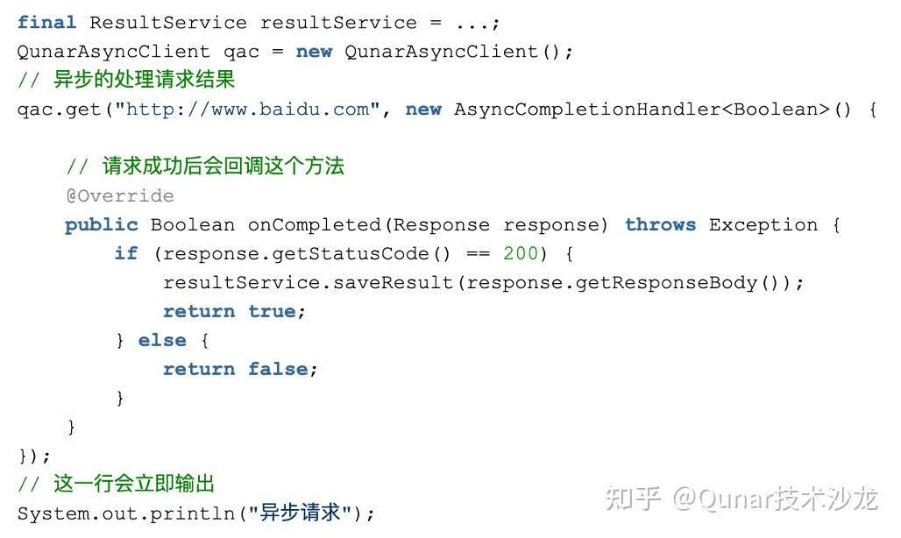

然后在异步的这个场景里面，去哪儿网其实做了一些自己内部的一些支持，比如说我们封装了异步的 HttpClient，把公司内部其他的组件类似于 QTrace，还有一些其他基础的监控、日志等等之类的组件都做了统一的封装埋点。

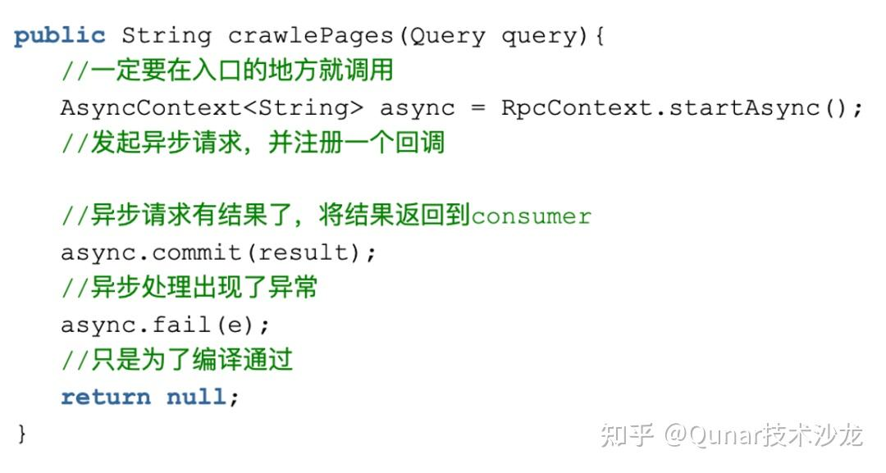

第二个我们对 Dubbo 的异步通信进行了改善，Dubbo 里面原有的几种通信方式，其实是调用端和被调用端，是会存在一定的耦合逻辑的。比如说像参数回调这样的方式，其实是调用端需要进行异步，但是被调用端不得不配合这个方式进行改造，所以在这种背景下，我们对 Dubbo 的异步通信进行了魔改，其实现在的最新版的 Dubbo 的模式里面，跟这个是比较相似的。  

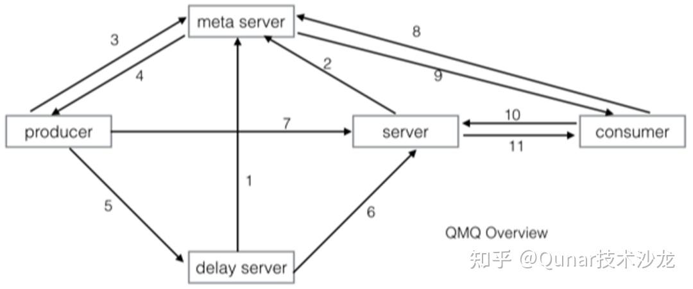

第三个就是我们其实内部做了一个自研的消息队列叫 QMQ，它其实支持可靠的事务消息，广泛地应用在我们去哪儿网的交易系统里面。

### 3\. 协议

第三个主要提一下协议这部分，我们在公司里面主要有三种协议。第一种私有协议，主要负责 App 和外网网关之间的通信协议；第二个 HTTP 协议，主要是外网网关到 Node、Node 到 Java 之间，甚至有一些 Java 到 Java 之间也会有自己使用的这种 HTTP 协议，不过这种量其实是比较少的；第三个 Dubbo 协议，后端的 Java 服务之间的通信基本上都是用 Dubbo 为主，只有少量的使用 HTTP。

### 4\. 设计模式

  

从设计模式上来说的话，我们其实可以知道在互联网的架构里面，特别是在高并发的模式里面，我们有很多折中，这些折中里面其实会有不同的模式和它的沉淀。比如说像 BASE 这样的模式，它其实不追求强一致性，它是有这种基本的可用和软状态这样的优点，进而去避免因为强一致导致的其他的不可用性。

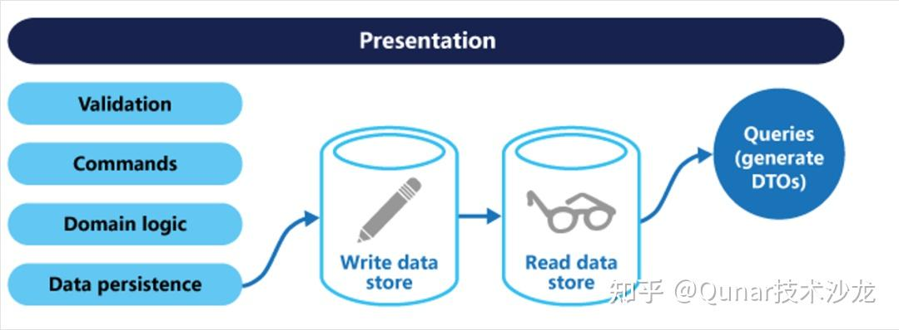

第二个就是 CQRS，这个模式其实非常有用，至少我发现很多场景是能够用上它的，换句话说其实只要是数据异构的这种场景，都是比较适合去使用它的，当然这取决于你的查询模式。大家都知道查询模式其实有很多种的，比如说像 KV 的查询模式、复杂条件的 Query，除此之外，还有 Scan 这种扫描形式，不同的查询形式会对应着不同的存储结构是比较合适的。但是我们在对这些数据进行操作的时候，其实它的数据载体是唯一的，那这个数据载体怎么样才能支持多种的查询模式呢？其实这里面就需要对这些数据进行异构，比如说像我们的订单、配置等等这些方式都需要去进行一定的异构。

  
比如说像去哪儿网内部的话，代理商在去哪儿网上就可以进行一定的调价，调价的配置其实就是一个比较适合去做数据异构的场景。代理商去录入的时候是比较复杂的，但其实是从航空公司拿到的一个配置，当它放到平台上来的时候，也是用同样的方式去放，但是对于检索来说的话，用户其实关心的是这个城市，到这个城市的时候，你的调价规则是什么样子，他并不需要一个大一统的调价规则。所以这里面就会面临一个数据异构的过程，我们在这个过程里面其实也使用了 CQRS 这个模式来解决问题。

## 三、微服务开发效率提升实践

  

然后我来说一下效率提升的这部分，大家都知道业界 Spring Cloud 在近期或者是近几年来说是一个最佳实践，特别是在微服务比较火之后，大家亟需一套成型的解决方案。这个里面包含不同的功能，比如说像分布式的配置、服务的注册、发现、通信，还有服务的熔断、服务调用、负载均衡、分布式消息等等。其实大家可以看到官方的一个实现，当然实现基本上都是来源于 Netflix 的，这里面会有不同的这些组件，但这些组件其实很多时候可能有一些已经不再维护了。

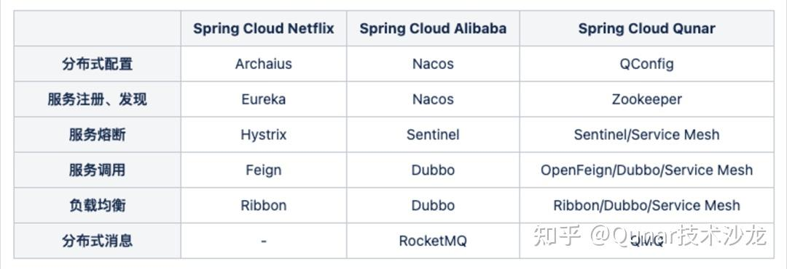

对应地可以看到 Spring Cloud Alibaba 也有自己的实现，像 Nacos、Sentinel、Dubbo、RocketMQ 等等。我们其实就在思考着去哪儿网自己有这么多自研的组件，是否能够适配 Spring Cloud 这样的一套标准，进而去达到开发提效、互相串通组件的目的？

### 1.Spring Cloud Qunar

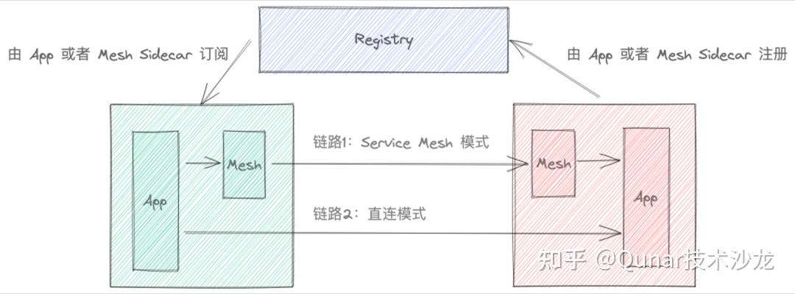

我们做了一个尝试，基于 Spring Cloud 做了配置中心、注册中心、服务治理等等之类的组件的串通，这样的话能够做到比较好的开发模式。然后值得一提的是我们在 Spring Cloud Qunar 里面，其实提供了两种通信的模式，一种是前面提到的直联模式，就是由应用本身包含的 SDK 来负责注册、发现和通信。除此之外，我们还有一个模式是基于 Sidecar 的这种 Mesh 模式，我们也可以由 Mesh 的 Sidecar 去负责注册、发现和通信，这两者之间的开启其实是比较简单的，只需要有一些特定的注解就可以开启 Mesh 模式。

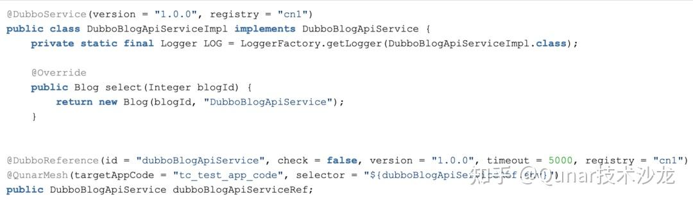

大家可以看到这里面，比如上面的代码，有 Dubbo Service 这样的一个服务的提供，下面就会有 Dubbo Reference 这样的一个服务的引用，并且在注解里大家可以看到 Qunar Mesh 这样的一个注解，这个注解就是用于开启我们的 Mesh 功能的，是对于 Dubbo 这个协议的。对于 HTTP 协议的话，其实跟官方的也是非常类似，我们也是使用了 OpenFeign 这样的一个组件来进行通信，下面也同样会有 Qunar Mesh 组件进行 Mesh 化。

### 2\. 开发插件

  

下面说一下开发插件，我们为什么要做开发插件，以及开发插件为什么能够做到效率上的提升呢？其实这里面的话，我们分析了大量的业务研发的开发模式，能够发现存在一些重复性或者是低效的环节，比如说像手动编写很多的调用代码，甚至可能会出现要手写这些反序列化类等等。

  
第二个就是在交互的过程中大量地去使用类似于文档，或者是内部的 IM，甚至比如说大家做的比较好的场景下是有 apiDoc 这样的方式去沟通这些接口的语义和细节。

  
第三个就是服务上线之后才去考虑治理，这个里面就会面临开发和运维的不对等。你的服务上线了后，它不出问题时，其实你是很少会去考虑治理的，只有在你开发的时候可能会有一定的考虑，但是这个考虑其实不是基于真实数据的。比如说你设置一个超时时间，大家经常能够在代码里面看到 1 秒、30 秒、60 秒等等之类的数字，这些数据真的有意义吗？不一定，只是大家习惯性地这么写，然后还有成百上千个 HttpClient Wrapper，就是自己不停地去实现这些 HttpClient，这些都是一些开发比较低效的场景，我们怎么解决这个问题呢？

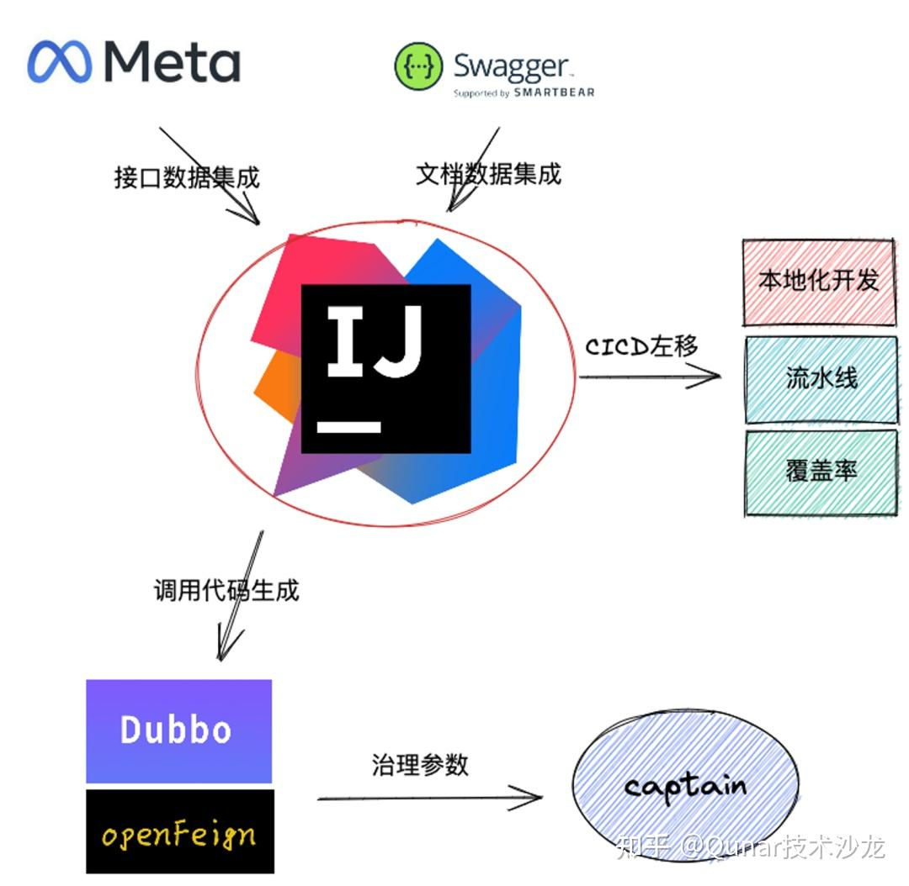

我们其实做了一个基于 idea 的 IDE 的开发插件。开发插件它可以满足以下的几个功能，比如像服务调用的代码自动生成，这个是一个什么样的场景？是说当你在 IDE 里面打开我这个插件，你就可以选择对方的应用、对方提供的服务，直接就一键生成调用的代码，甚至包括一些其他 jar 包的引入，比如如果它是 Dubbo 协议的，它会自动引入这些 Dubbo 的 SDK 和对方提供的这些 API 的 jar 包等等。

  
第二它可以快速地发现这些应用接口方法，集成对应的文档服务，这个就是刚才提到的我们其实打开了这个插件，就能快速地去检索它对应的应用和提供的服务，是比个人沟通要高效很多的。

  
第三它打通了服务治理。在编码生成的过程中，你需要去配置这些治理的参数，然后这些治理的参数通过上报的方式，把它统一地注册到我们的服务治理平台，然后跟 Mesh 的模式去进行打通。这样的话有一个非常有效的方式，在你去生成这些调用代码的时候，你就可以参考一些对应的指标、参数，比如对方提供的接口的监控是什么样子的，以及其他人设置的指标是什么样的，做一定的智能化推荐，这样能够保证我们的这些指标相对来说是配置的比较合理的。

  
第四个就是代码规范的最佳实践是能够比较好去落地的。我们都知道，很多时候这些代码规范是需要靠文档，比如我们出一个什么样的规范，什么样的标准去保障，或者是类似利用这些代码检查工具，比如 Sonar 等等之类的方式去保证我们的代码规范的落地。但是其实通过这种生成代码的方式，我们直接就可以把最佳实践嵌入到生成的过程里面，来保证它生成的代码一定是符合最佳实践的。

  
除了上面这四个方面之外，我们其实还在插件上做了大量的工作，比如说像 CI/CD 的左移，这个左移包含了我们可以在本地去跟远程的环境打通，以及它还提供了对应的 CI/CD 流水线的功能，还有代码覆盖率的功能等等。通过这样的一个开发插件，我们可以把日常的一些重复性的、低效性的工作就可以被完成掉，是一个比较好的提效方式，推荐大家去使用。

## 四、服务治理实践

  

然后在服务治理这里面，我们其实也做了一些自己的思考。首先我们来看一下，常规的这些服务治理的四板斧是什么样子。

### 1\. 常规四板斧

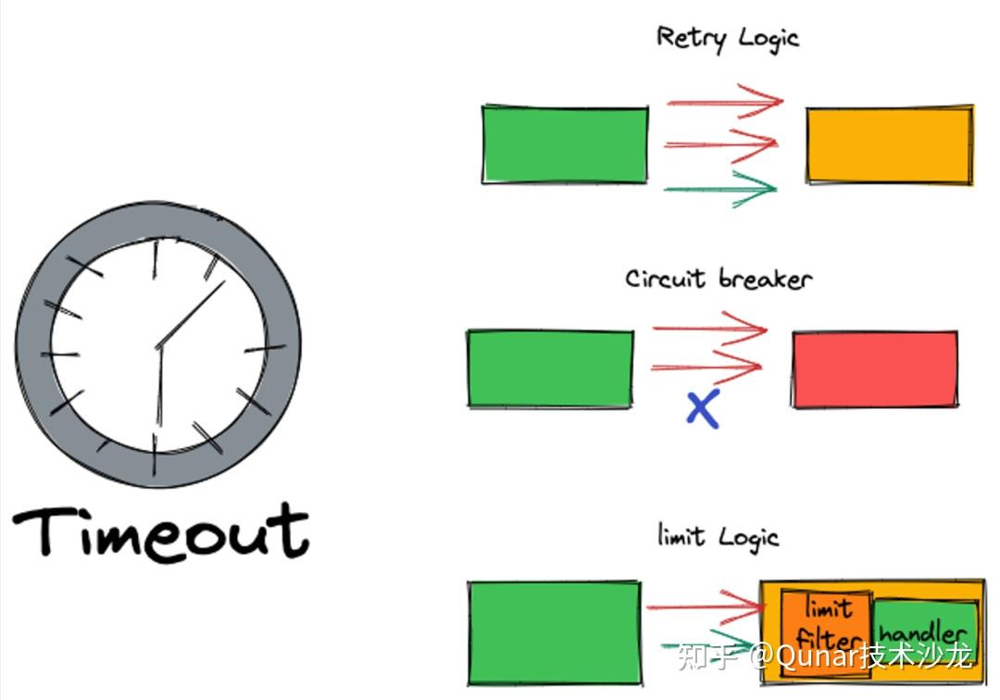

不可避免地，第一，我们一定要设置超时；第二，要在一些场景里面去考虑重试的逻辑；第三，考虑熔断的逻辑，不要被下游拖死；第四，一定要有限流的逻辑，不要被上游打死。

### 2\. 最终目标

  

这些都是非常普遍，也是非常有效的一些措施，但是有效建立在于你的配置，或者是你的这个动作是有效的场景，但实际上我们很大程度上其实是在滥用这四种技术。我认为服务治理的一个最终的目标就是稳定可用、可观测、防腐化，这是什么意思呢？

稳定可用指的就是我们通过各类的防控手段去达到在可用的容量场景下，提供有效的服务，这样才能叫稳定可用。第二个可观测，就是我们从多个维度，比如说像关系、性能、异常、资源等维度对它进行度量并且分析。第三个防腐化，我们的代码和架构其实不可避免地都是在腐化的一个过程之中，我们不停地往里面去添加东西的过程中，其实也会缺乏一定的治理。我们服务治理的目标，其中一点就是要做到如何去对它进行防腐，这个里面有一些考虑的维度，比如服务的层级，你的服务并不是越微越好，也不是层级越多越好，所以服务的层级一定要有所控制。

## 3\. 保护机制

  

第二就是链路的分析，链路里面上下游的超时、串行、并行的调用等等之类的这些东西在编码的过程中可能会被忽略掉的，这些我们其实可以通过偏后置一点的方式对它进行一个分析和预警，这里面提一下我们在保护机制上做的一些工作，我们都知道在 RPC 的框架里面，其实特别是在直连的模式下，调用端 Consumer 端和 Provider 端其实是直连通信的。

  
对于注册中心来说，它只负责一个注册和变更通知的作用，但是在有一些特定的场景里面并不是这样子的。举个例子来说，当一个注册中心因为自身的原因处于一个半死不活的状态，它一会儿能服务、一会儿不能服务的时候，就会发生一个比较恐怖的事情，Provider 端因为它要跟注册中心去保持心跳判活的状态，所以需要和注册中心保持长期有效的连接。如果是失效的情况，作业中心就会判断这个 Provider 是不存活了。不存活的时候，注册中心就会把这个消息通知给 Consumer 端，Consumer 端只要接收过一次下线通知，Consumer 就会从它的列表里面把这个 Provider 从本地的缓存里面去移除掉。

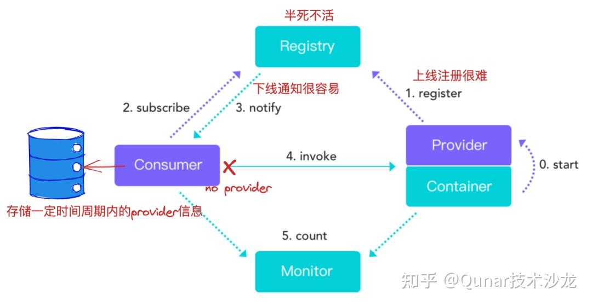

如果注册中心处于一个半死不活的状态，最后会处于一个什么状态呢？Consumer 端慢慢地会把所有的 Provider 都移除掉，这样就会导致我们的 Consumer 端到 Provider 端其实是不可通信的。对于这个问题，我们其实基于 Dubbo 做了一定的改造，做了一个保护机制。这个保护机制就是当 Provider，特别是注册中心上的 Provider 数少于一定的阈值的时候，我们的保护机制就会自动地启用，它的生效是在 Consumer 端的，也就意味着 Consumer 端需要缓存这段时间内所有历史的 Provider 的列表。

  
大家可能在这里会有一点担心，你缓存的 Provider 如果失效了怎么办？它是真的失效了，比如说它被下线了，或者是它本身经过迁移，像我们在容器场景里面，经过了一定的发布，其实它对应的信息都变化了，这个时候你再去通信不就有问题吗？其实我们在保护机制里面也考虑了这个问题，我们在通信之前还是会做一个直连的检查，Consumer 到 Provider 的连接存活是否是真正存在，如果不存在，我们会把这一个连接给扔掉，保证通信的时候使用的是一个可用的连接。

  
当这个信息机制启用了之后，注册中心恢复到一定的状态的，这个 Provider 又能重新注册到注册中心里面了，接着我们又会把保护机制自动关闭掉，这样的话 Consumer 就只会调用注册中心上存活的这些 Provider，就可以避免掉因为注册中心半死不活，导致所有的这些分布式的应用里面的 RPC 调用是不可用的。

  
这其实是一个比较有效的方式，因为如果出现了这种场景，其实你内网里面的大部分应用通信其实是处于一个不可用的状态，甚至你想让它恢复都是非常困难的事情。比如你想启动的时候，其实 Consumer 发现 Provider 都不存活了，这也会导致启动失败等等各方面的问题。

### 4\. 动态限流

  

接着我来介绍一下限流里面我们做的一些工作，这里面我们做的模式我把它叫做动态限流。普通的一个限流里面，通常来说是这样的一个方式，我们有 A、B、C 的服务都对 X 这个服务进行了调用，它的来源可能是不一样的，X 为了保护自身的状态是可用的，它不可避免就要对上游 A、B、C 的这些访问分配固定的一些配额，谁超过了配额就不可用了。

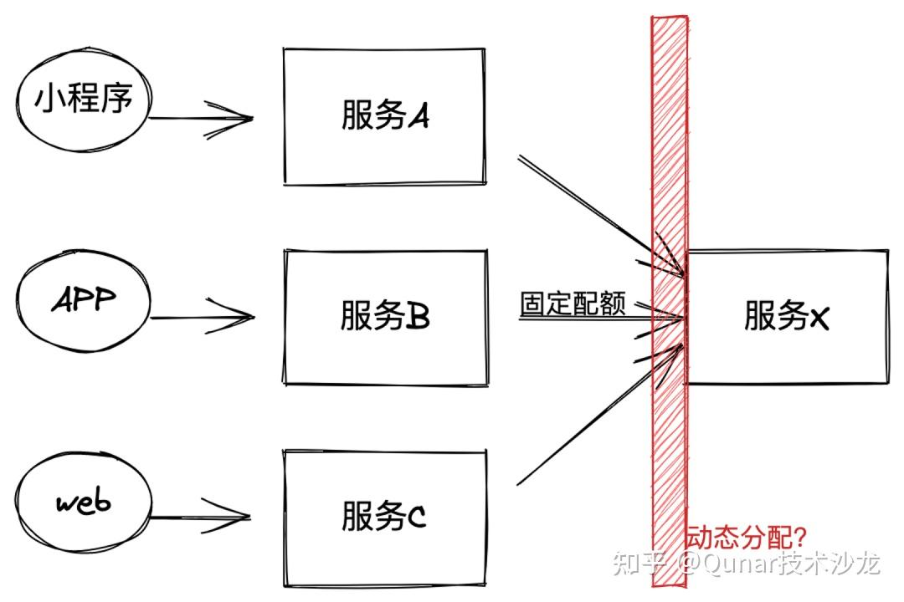

比如说像 A 分配了 100、B 也分配 100、C 分配给了 50。当 A 超过了 100 的时候，其实它的一些请求是会被拒绝掉的，这个是基于容量的考虑，X 不可能具备无限的容量，这时它需要一定的保护措施。但是这地方就会有一个问题，假如 A、B、C 里面，比如说 B 服务，它其实是从 App 过来的，它的价值不可避免来说的话，要更高一点。比如说第三个服务 C，它是从 Web 里面来，它的价值相对来说比较低一点。这个价值是基于你的业务形态来的，比如说你的 App 的成单、转化更高，那就意味着它的请求更珍贵。

  
这个里面就会出现一个问题，服务 B 和服务 C 自己都得到了一定数量的配额，但是假如 App 的流量上涨了，Web 的流量没有上涨，这时就会面临一个问题，服务 C 的配额没用完，但是服务 B 的配额又不够用，这个场景下怎么解决呢？就需要靠人工来不停地去调整它，而且这个调整需要相当实时才可以，我们有没有办法能够相对统一地解决这个问题呢，其实我们做了一个探索，这个探索从实践结果来看的话是比较有效的。

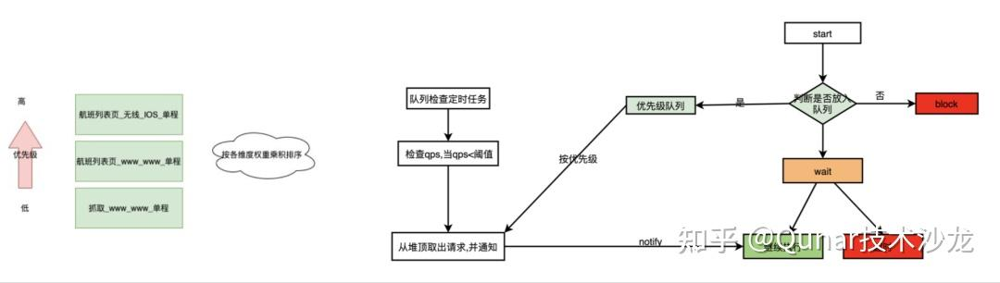

我们对这些服务进行配额分配的时候，其实不是一个固定的配额，而是一个动态的分配。动态的分配意思就是，我只有一个总的容量，并不给每一个服务进行分配，总的容量我分配给所有人。但是我要对所有的调用方进行一个排序，也就是说谁的价值高谁就排在前面，这样的话就能得到一个比较有效的结果。你的限流模型是基于你的业务逻辑来的，也是基于你的业务价值来的，当你发生限流的时候，优先丢掉的一定是最没有价值的那部分的业务请求。

  
当然这里面也会有一个前提，你的请求来源是需要有差异化的。还有第二个点，你的这些 trace 连通性一定要高，也就意味着，你的这些标志要能够一路畅通地携带下去，如果只是基于某一层去做限流逻辑，其实是没有意义的。

### 5\. 防腐化

  

接着就是防腐化，这里面其实我们需要对架构、应用的分布、应用的关系去做大量的分析，得出改进的措施，我们在这上面改进的措施其实有很多。比如我们会分析哪些应用是频繁修改的，这些频繁修改的意思是不是所有的需求，这些应用都相关地需要去做修改，那就意味着说它的业务域是一样的。如果这些业务域一样的情况下，你把它的微服务划分得很细，实际上它是一一绑定的话，其实并不符合微服务化的原则。

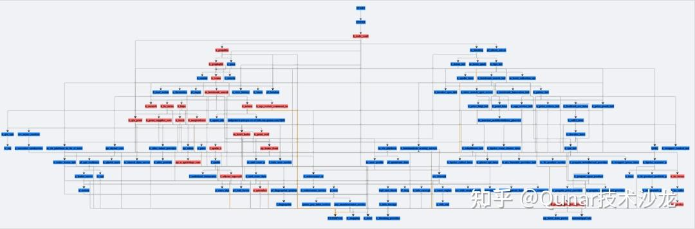

  
第二个是否存在重复的调用，这条链路里面，这些重复的调用是否能够去缓存化，或者是避免它重复调用。

  
第三个大量的串行调用是不是能够把它异步化，比如常见的，从数据库里面拿出一批记录，这一批记录通过循环的方式，挨个去对它发起远程调用，这些过程里面其实比较有效的方式就是通过异步化、并行化的方式去把速度给提上来。

  
第四个异步的整个链路的这些超时配置里面，其实会有一定的相关的关系。比如上游的超时是不应该比下游短的，如果下游的超时比上游的还长，那意味着说下游还在计算，上游可能已经超时了，这个计算的结果其实有可能返回不了上游，这些就是无用的配置。除了这之外其实整个链路里面大量的超时可能是不合理的，比如刚才提到的大量重复的调用，这些重复的调用或者循环的调用，再乘以同样的超时时间，可能就会比整个终端的操作时间要长很多，这些都需要去做一定的分析和考虑，才能达到它防腐化的目的。

## 五、ServiceMesh

  

尝试最后一个介绍一下我们在 ServiceMesh 上的尝试。

### 1\. 背景

  

先简单介绍一下背景，我们公司内部其实还是存在多语言、多协议的这样一个场景。

  
第二个它在多语言、多协议的场景里面不可避免地就会出现治理平台比较分散，比如像 Dubbo 的话，我们其实会有一个 RPC 的服务治理平台；HTTP 的话我们其实有类似于网关 Nginx 或者是 OpenResty 去对它进行治理；其他的也会相应的治理，甚至可能是在配置中心去对它进行治理等等。

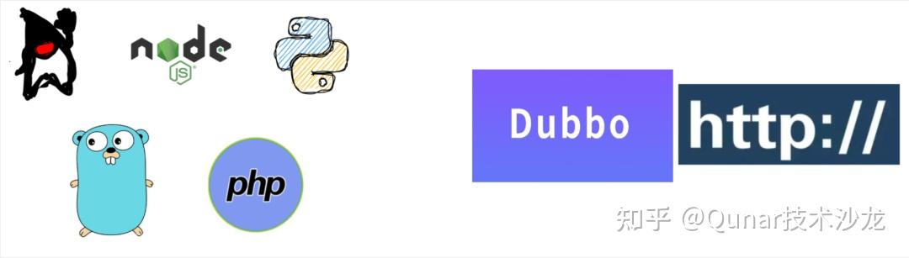

第三个组件的新功能迭代是相对比较慢的，因为这些组件都是嵌入在应用代码里面，因此它的迭代就需要跟随着业务代码去迭代，才能够去比较好地迭代，而且这些迭代里面其实需要付出一定的人工成本，其实业务的开发是不太愿意去主动地做这种组件的迭代的，在 ServiceMesh 的选型里面，我们也考量了一下当时业界里的选择。

### 2\. 技术选型

  

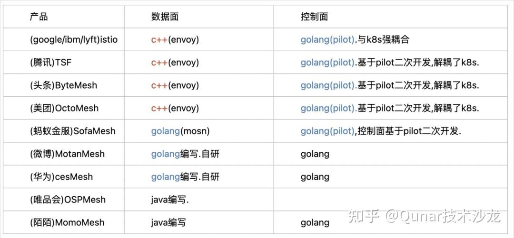

其实从数据面上来看，envoy 还是占大头的，但是我们最终其实没有选择 envoy，主要是因为我们在 C++ 技术栈里面储备的人才是不够多的。第二个在控制面上，大家基本上都是基于 Istio 模式去做的，当然也大部分都做了二次的开源，我们最终也是选择这样的一个模式。

### 3\. 整体架构

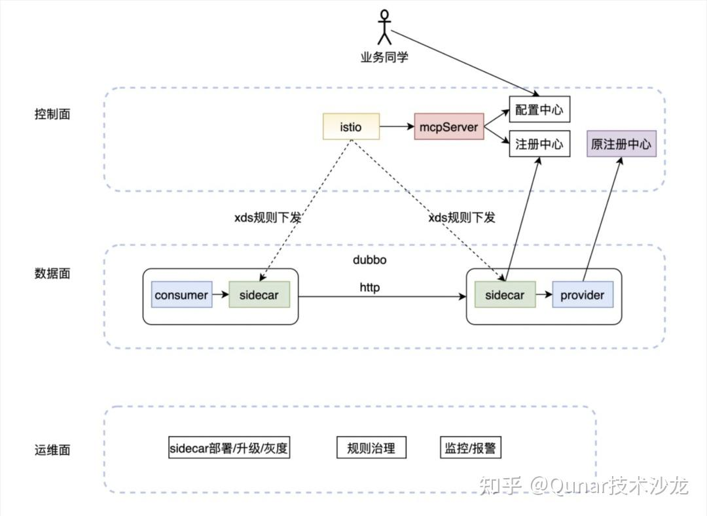

我们最终的选择是，数据面上我们选择了 MOSN，而不是 envoy，MOSN 是基于 Go 开发的一个阿里巴巴官方出品的组件，这个组件其实是一个偏网关代理型的一个组件，但是在上面去实现 Mesh 的逻辑，其实是比较方便的，特别是针对基于 Dubbo 这个协议的 Mesh，MOSN 支持得是比较好的；在控制面上，我们也是基于 Istio 去做了二次开发，也有一定的自研组件，比如说 mcpServer、配置中心、注册中心这些都是我们自研的。在运维面的话，我们也是自研了一套运维相关的组件，比如 Sidecar 的部署、灰度的升级等等，还有一些规则治理、监控报警等。

### 4\. 注册模型:

  

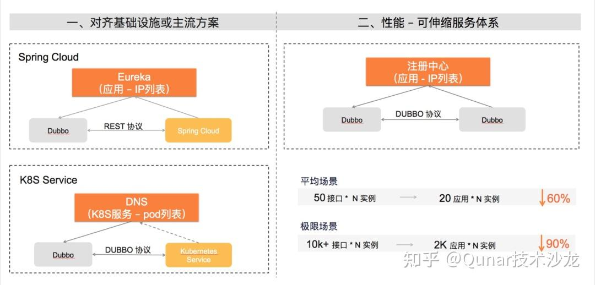

ServiceMesh 里面我主要介绍一下几个关键点：第一个就是注册模型，因为它是一个多协议、多语言的方式，其实比如 Dubbo 或者 HTTP，它在服务层面其实是不统一的，在注册中心我们想要以一个统一的注册中心去服务发现的时候，不可避免地就需要把它的维度统一掉，我们是怎么做到的呢？我们其实是参考了业界现在比较火的，或者基本上应该是事实上的标准，通过服务 - 实例这样的维度去抹除掉了类似 RPC 这种 Dubbo，这种接口的维度，与原来的注册中心去进行双写，来保证 Mesh 化的和非 Mesh 化的都能支持。

### 5\. 配置模型

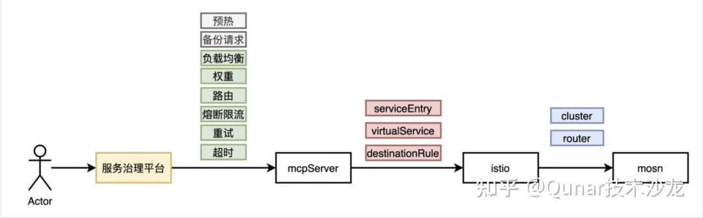

然后第二个就是配置的模型，这里面就是服务治理平台，我们其实自定义了一些存储的格式，然后通过 MCP 的方式，Server 的组件去转换 Istio 需要的数据格式。Istio 拿到了之后，通过标准的 XDS 的数据格式下发到 MOSN 里面，这一段我们基本上就是依赖原有的一个功能，主要是在左侧这部分，我们自定义的这部分组件的数据格式是比较关键的。

### 6\. 路由模型

  

第三个说一下路由的模型，路由模型里面，大家其实见过非常多，但是我对这些治理的功能或者路由的功能，其实偏保守一点的观点。因为在我看来越灵活越可能会用错，这里面就需要我们去抽象一定的业务模式，把业务模式落地到或者固化到组件里面来。通过这个方式，我们其实发现只需要以应用和环境集群为主体，并且在这个场景上支持 trace 匹配的控制，就可以保证满足我们绝大部分的业务场景。

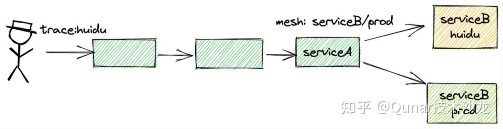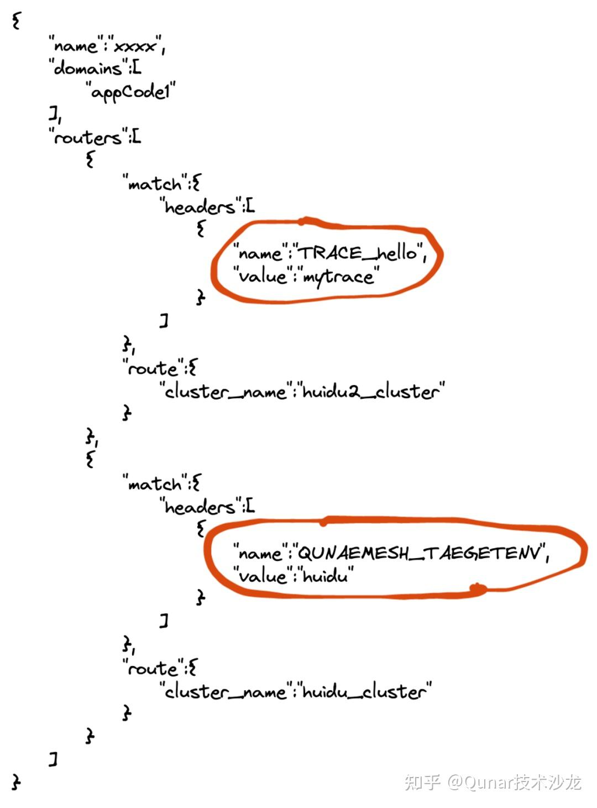

因为我们线上经常会出现应用不同的环境集群，其实是为了不同的诉求去用的，比如像搜索集群和交易集群，它们需要进行物理隔离，然后比如上线的时候，可能需要做一定的灰度验证等等。这样的话我们就可以基于 trace 的参数匹配去控制它，只要以这样两种方式作为路由模型的支持，是满足绝大部分的业务诉求的。

### 7\. 控制面和运维面

  

在控制面与运维面上，我们做了什么样的方式呢？其实我们当时也并不想要在这上面做自研，而我们参考了业界很多的解决方案，其实发现在配置中心和 MCP 的 Server 里面，是缺少开源方案的，特别是配置中心，我们发现基本上很少有可用的配置，基本上就是一个查看可观测的方式而已，但其实你想要对它进行一些服务的治理是不够用的。

  
第二个 Sidecar 运维，这里面无损的升级和切换非常关键，会涉及到不同组件之间的依赖关系和它的检测，比如 Consumer 对 MOSN Sidecar 的检测，和 MOSN 逆过来对 Consumer 的检测，这些逻辑都是不一样的，而且细节会比较多，有兴趣的话大家可以线下沟通一下。

  
第三个就是可观测性，参考了非 Mesh 化需要的一些指标，我们可以比较好地去把 Mesh 化的过程里面大量的可观性指标都内置地埋点进去。但是在 trace 链路里面，最好把 Mesh 的 Sidecar 的 span 给精简掉，不然你会发现所有的节点都比原来多了两跳，这样无疑会把 trace 因为中间件的逻辑，把它复杂化掉了。

  
第四个就是健康检查，这里面刚才提到的 Consumer 对 Sidecar 的可用性的检查，其实是一个非常关键的重点，因为取决于它需要怎么降级以及它能不能降级。

### 8\. 性能优化

  

最后一个就是性能的优化，这里面主要有两点，在业界大部分的方案里面其实都会面临一个问题，因为这些调用关系是动态化的，就意味着运行时才能知道我需要调用哪一些服务，它对应的规则是什么，也就是说我需要把所有的服务信息都下发到 Sidecar 里面，这不可避免就会占用大量的内存，它的匹配效率都是非常低的，我们在这上面怎么去做优化呢？

  
其实配合前面 Spring Cloud Qunar 能够做到比较友好的方式，当它做了 Spring Cloud Qunar 这样的 Qunar Mesh 注解之后，我们其实可以把这部分在编译期就采集上来，或者在启动的时候去把这些信息都给它上报上来，这样我们就只需要订阅我们需要的一些部分数据就好了，能够做到大量的数据减少。

  
第二个就是在服务通信里面，因为多了 Sidecar 的两跳，那就意味着说 Sidecar 的通信是带来一定时间、效率和性能损耗的，这里面的关键点就在于应用程序和 Sidecar 的通信是否能够存在优化空间。我们经过实验发现，使用 UDS 的通信来替代原有的这种要经过网卡的通信其实要高效不少的，把它在这两跳上带来的损耗降到足够低。

## 六、总结

  

总结来看的话，整个微服务的过程里面，我们最佳的实践其实存在好几个方面。

第一个是在发现模式、通信模式上的，我们需要去因地制宜做一定的最佳实践；在架构模式里面，比如说像 BASE 模式和 CQRS 模式，我们都可以在合适的场景里面放心大胆，或是尽可能去启用它们的。

  
开发效率先行，微服务的初衷其实是提效，那问题复杂化了以后，就需要有这些有力的配套，比如开发插件等来解决我们开发的问题，否则微服务可能只会带来一地的鸡毛。

  
第三个就是有效的服务治理，简单的管控手段意义是不大的，它的手段虽然有效，但真实业务的意义是不大的，类似于动态限流这样的模式才能真正解决业务问题。

  
第四，ServiceMesh 不可避免地，或者说现在基本上已经成为事实上的下一代微服务通信的架构模式，这个里面模型的设计和性能优化就非常关键。

  
**最后对于微服务里面的一些要点再进行一下简单的总结**。

业务的拆分就是借鉴业界成熟的模型，本地化为最适合公司现状的业务结构。比如刚才提到的去哪儿网，它其实也是一个线上的电商系统结构，但是它又有旅游、民航或者酒店领域的特殊性，就不可避免地要本地化。

  
还有就是架构模式里面，不同场景下的架构模式的支持是不一样的，交易系统的事件驱动，异构数据的 CQRS 都是比较有效的方式。然后开发模式、开发支撑里面需要对微服务进行完善的工具支持。

  
在服务度量里面，我们关系、性能、异常、资源，还有刚才提到的防腐都需要比较有效。第五个就是治理的管控，限流、熔断这种方式需要实时生效，最好是把它统一化而且进行业务有效化。最后一个就是演进式，架构的演进需要平滑有序，避免大量的应用改造。

  
最后送给你一句话：**架构演进，以提升效率为目标。**

## 作者介绍

  

**朱仕智 去哪儿旅行 基础架构部高级技术总监**  
去哪儿网高级总监。负责过公共业务、国际机票、基础技术等团队，擅长复杂实时业务的高并发、高可用、高性能的系统设计和落地。目前负责基础架构团队，包含后端架构、大前端架构、质量保障、基础云平台等领域。近期主要投入在公司整体技术演进和数字化技术运营方向。