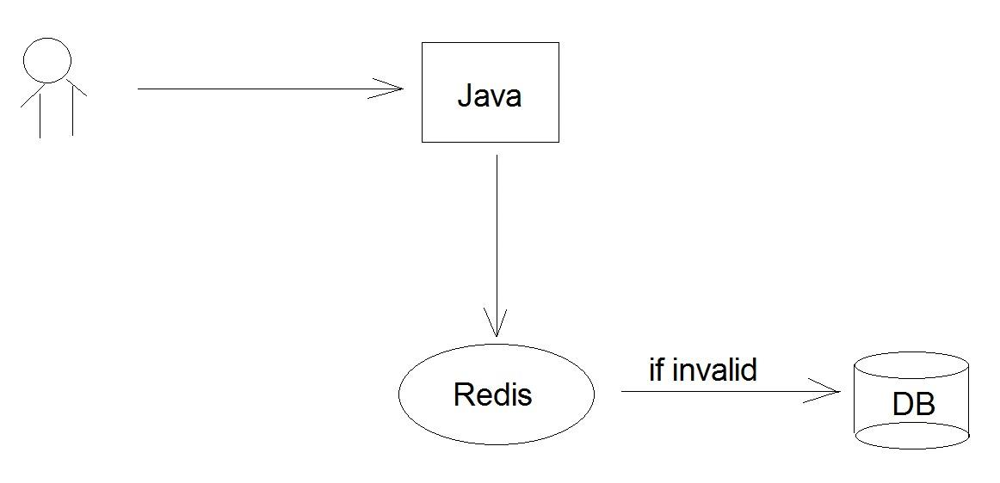
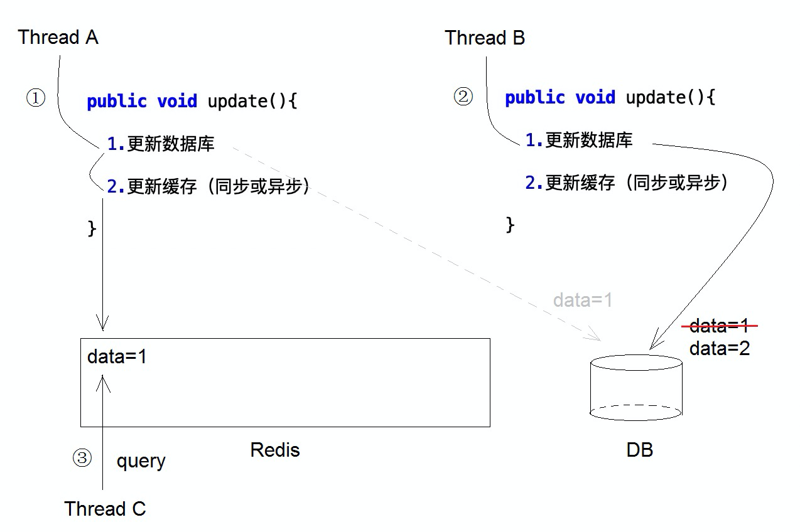
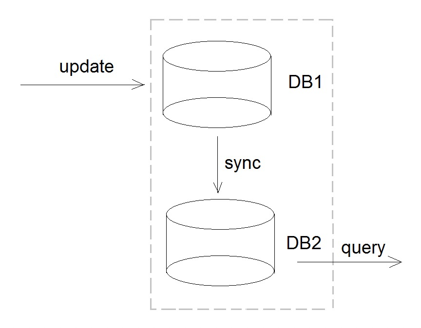

进入电商公司以后，缓存用的实在太多了。特别是最近做的项目，整个数据都是直接从其他电商平台拉取的，全部放在Redis中。

想起了去年跳槽时众多面试的一场，面试官问我如何避免缓存脏读问题：

> 假设某个数据缓存在Redis中，当我在后台更新了数据后，如何保证客户端读取的是最新的数据呢？

## 问题描述：什么是缓存脏读

首先搞懂这个问题是什么意思。



由于设置了缓存失效时间（比如1小时），那么在这一小时内，如果有人更新了DB的数据，只要缓存不失效，Redis就不会主动读取DB并更新数据，那么用户看到的其实都是旧的数据，与DB不一致，此谓缓存脏读。

## 我的解决方案

我当时的回答是：找到更新数据的入口，每次更新DB都同步或异步更新缓存。比如

```java
public void update(){
  1.更新数据库
  2.更新缓存（同步或异步）
}
```

面试官紧接着问我，如果A线程刚更新完缓存，B线程又来更新数据库，且尚未更新缓存，此时C线程从缓存中读到的就是旧的数据了。



我当时也是年轻啊，直接说：加锁，把1和2设置为原子操作。

实际上，加锁也是解决不了问题的，因为Redis和DB又不是同一个连接，不在一个事务里…

## 面试官的建议

当然，我是不服气的，于是我承认自己不知道，并问面试官有什么高见。面试官慢悠悠地说道：

```java
public void update(){
  0.更新缓存（同步或异步）
  1.更新数据库
  2.更新缓存（同步或异步）
}
```

## 反思：缓存脏读无法避免，也没必要避免

面试官推荐的写法这确实能在一定程度上保证“缓存里的一定是最新数据”，但反过来却无法保证“DB是最新的数据”...而且万一DB更新那一步挂了呢，岂不是缓存是最新的，DB却是旧的？

> 哎，有时候面试就是要自信点，不能被面试官唬住，有些问题确实就是没有十全十美的解决方案，总是要舍弃一些，获取一些。

评论区有好多知友留言讨论，很有启发。关于到底缓存和DB能不能做强一致，我也抛一个自己的观点，然后大家在提出自己的见解前，看看能不能解决我的问题。

先不谈论缓存和DB的强一致，我们先看多个DB如何保持强一致。根据CAP理论，一致性、可用性和分区容错性至多只能满足两个，通常是CP或者AP。对于CP来说，为了强一致性，一般牺牲部分可用性。比如对于多个DB节点，要想保证数据强一致，那么在数据同步完毕之前，应该阻塞所有的读（效率大打折扣，实际开发往往追求最终一致性即可）。



同样的，把DB2换成Redis，要想保证数据强一致，就要做到“DB更新时，阻塞缓存读”，这会强行把Redis的效率拉低到和DB一个水平，而这个就违背了使用Redis的初衷。

至于评论区提到的，把更新缓存改为删除缓存，这样有线程访问缓存时，如果发现无数据就会去读最新的DB数据，似乎挺合理的，但本质上和更新的做法一样，无法避免缓存脏读，而且还要考虑缓存击穿问题，会让问题复杂化。

其实啊，你会发现这个问题一直扯皮下去是没有意义的。**我前脚刚读取数据，后脚就被人改了，这个本来就是合理的呀。**即使是单DB，你也不能保证此刻读完数据，下一刻这个数据不会被修改吧？再退一步，如果用户读取完数据，一直停留在页面上没操作，半小时后才点提交，此时数据肯定和数据库不一致呀，这个又怎么解决呢？没法解决啊...它就是正常的一个操作而已，做好数据校验和幂等，提示用户操作失败即可。

**所以，缓存脏读问题本质是展示不一致的问题。**

缓存脏读只要不是特别严重（一小时都没更新，影响数据展示），都是可接受的，没太大必要考虑什么强一致。比如更新DB时同步/异步刷新缓存，既简单又经济，几乎是毫秒级别，足够了。

你看看，知乎的点赞数据，文章列表看到的点赞数和文章详情的点赞数往往是不一致的，但也无伤大雅…**是我们把不一致看得太重要，甚至害怕不一致。**

**不过，最最重要的还是一定要给缓存设置过期时间，保证至少还有缓存失效来兜底刷新**（不设置过期时间不仅影响展示，还有个很严重的问题是，随着时间推移，有些数据很久不再被访问，却死赖在缓存里，占着茅坑不拉屎）。

所以，结论是：

> 缓存脏读是无法避免的，或者避免的代价太高了，本身“避免缓存脏读”就是一个伪命题，要求强一致的就不该放在缓存里。建议在此觉悟上，采取更新DB时刷新缓存的策略，保证毫秒级别的更新即可。

博主历时半年写成的Java进阶小册已经上线 ，欢迎大家加入小册一起学习~

[中级Java程序员如何进阶（小册）](https://zhuanlan.zhihu.com/p/212191791)