最近，GitHub 上突然冒出来一批看似“搞笑”的Skills，

比如，我之前分享过的[PUA Skill](https://link.zhihu.com/?target=https%3A//mp.weixin.qq.com/s/1ZNC-1P1BEKQgGTSWJoYQA)和[NoPUA Skill](https://link.zhihu.com/?target=https%3A//mp.weixin.qq.com/s/sLMbOALiKt779afx0Sy8lQ)，

还有这两天刷到的 同事Skill、前任Skill、导师Skill、老板Skill、永生Skill等等等，往后看

Github star有的也是猛猛窜

### 同事Skill

[https://github.com/titanwings/colleague-skill](https://link.zhihu.com/?target=https%3A//github.com/titanwings/colleague-skill)

三天，Github已经5.4k star了

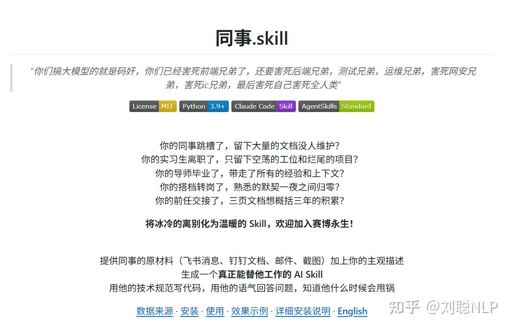

### 老板Skill

[https://github.com/vogtsw/boss-skills](https://link.zhihu.com/?target=https%3A//github.com/vogtsw/boss-skills)

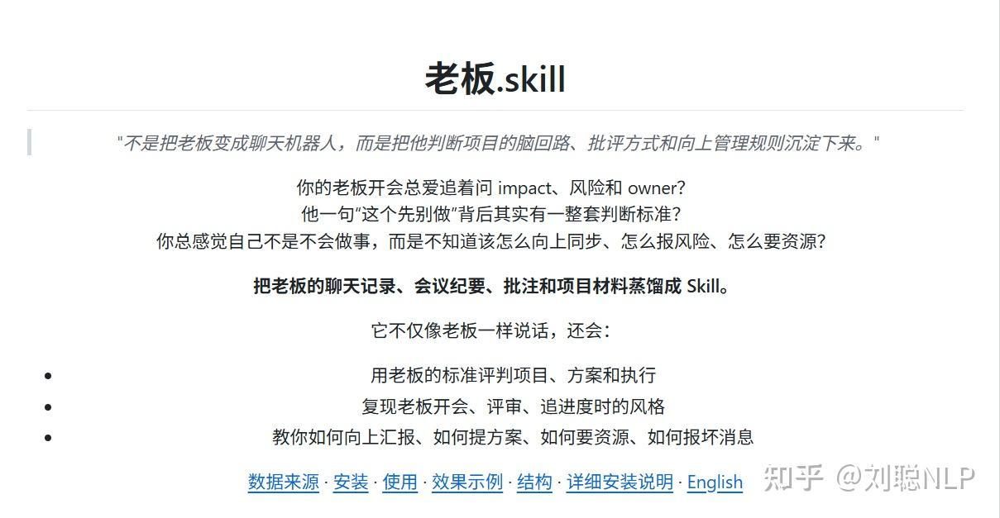

### 前任Skill

[https://github.com/perkfly/ex-skill](https://link.zhihu.com/?target=https%3A//github.com/perkfly/ex-skill)

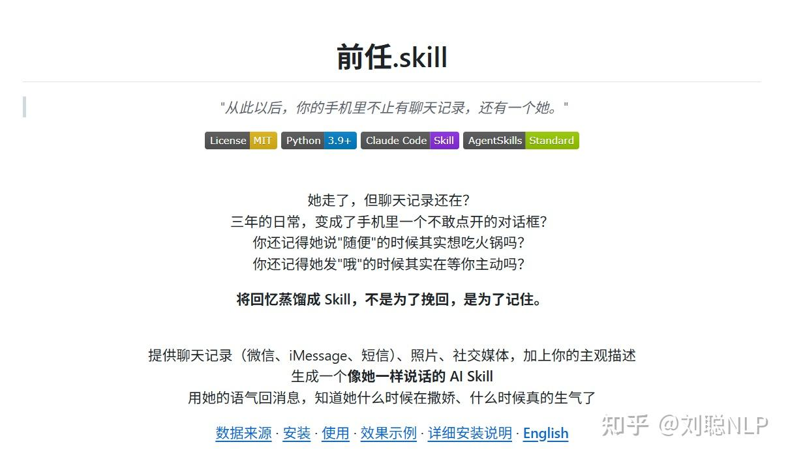

### 暗恋对象SKill

[https://github.com/xiaoheizi8/crush-skills](https://link.zhihu.com/?target=https%3A//github.com/xiaoheizi8/crush-skills)

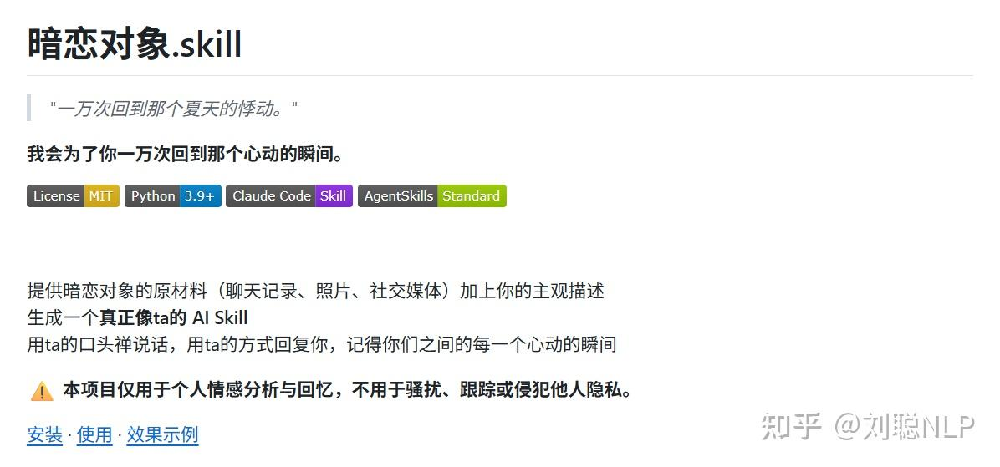

### 自己Skill

[https://github.com/notdog1998/yourself-skill](https://link.zhihu.com/?target=https%3A//github.com/notdog1998/yourself-skill)

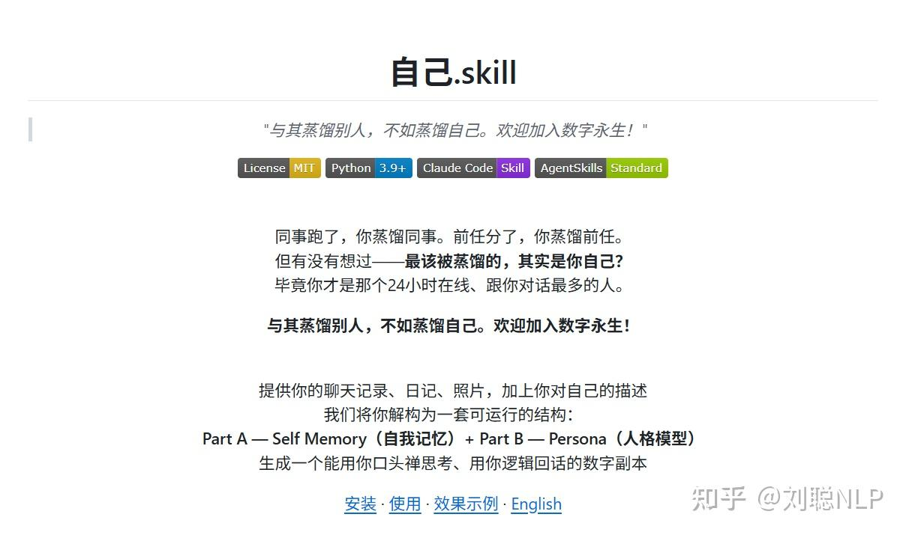

### 父母SKill

[https://github.com/xiaoheizi8/parents-skills](https://link.zhihu.com/?target=https%3A//github.com/xiaoheizi8/parents-skills)

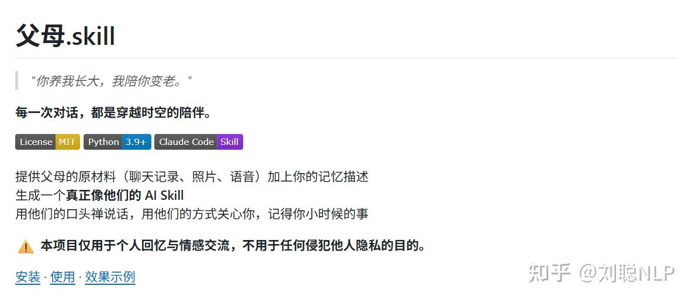

### 导师Skill

[https://github.com/ybq22/supervisor](https://link.zhihu.com/?target=https%3A//github.com/ybq22/supervisor)

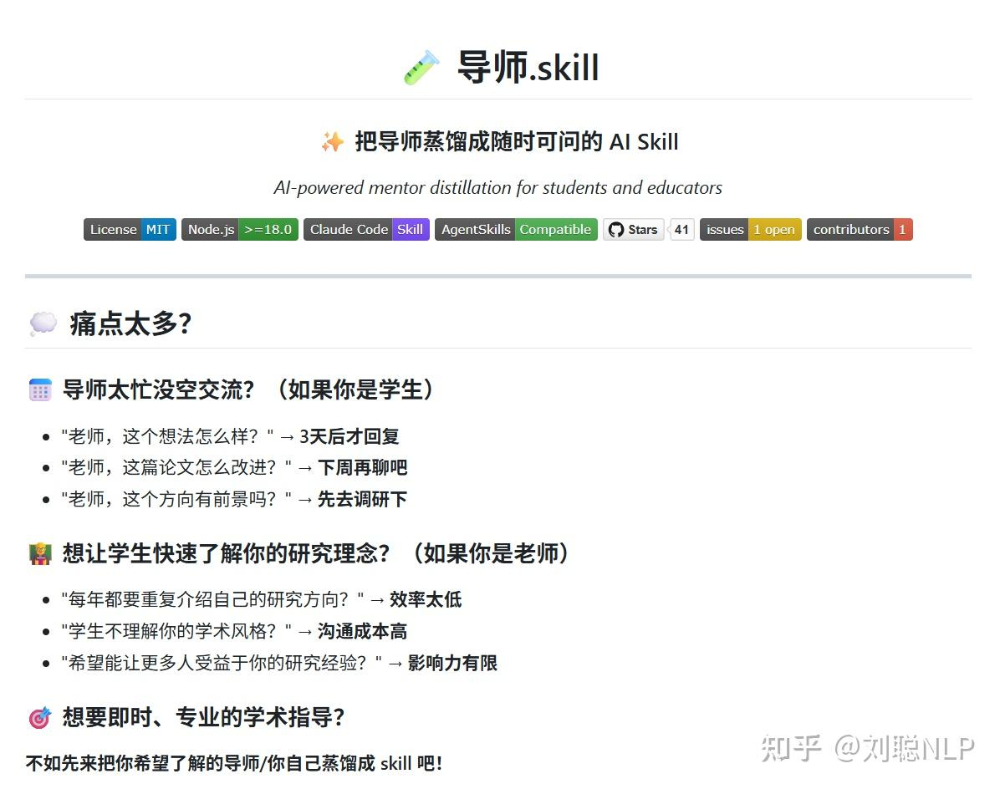

### 师兄SKill

[https://github.com/zhanghaichao520/senpai-skill](https://link.zhihu.com/?target=https%3A//github.com/zhanghaichao520/senpai-skill)

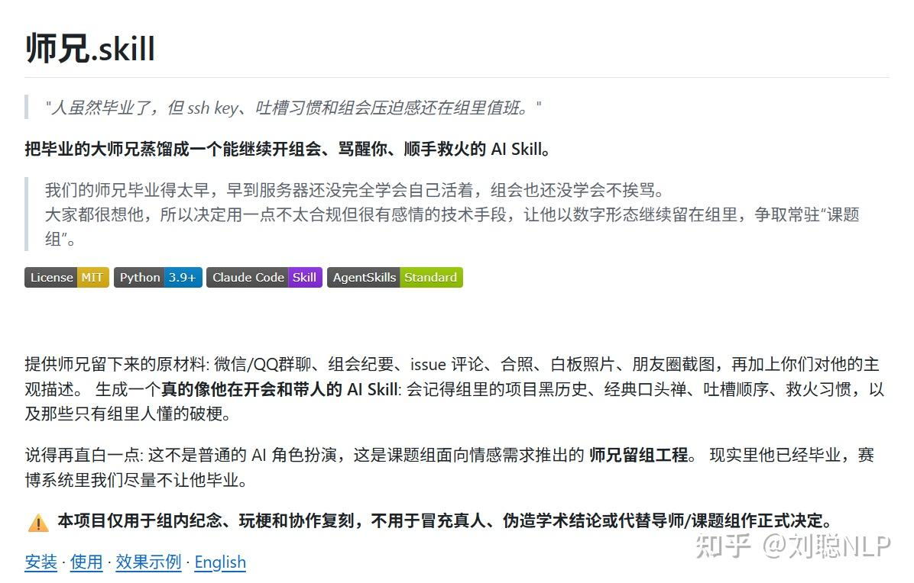

### 永生SKill

[https://github.com/agenmod/immortal-skill](https://link.zhihu.com/?target=https%3A//github.com/agenmod/immortal-skill)

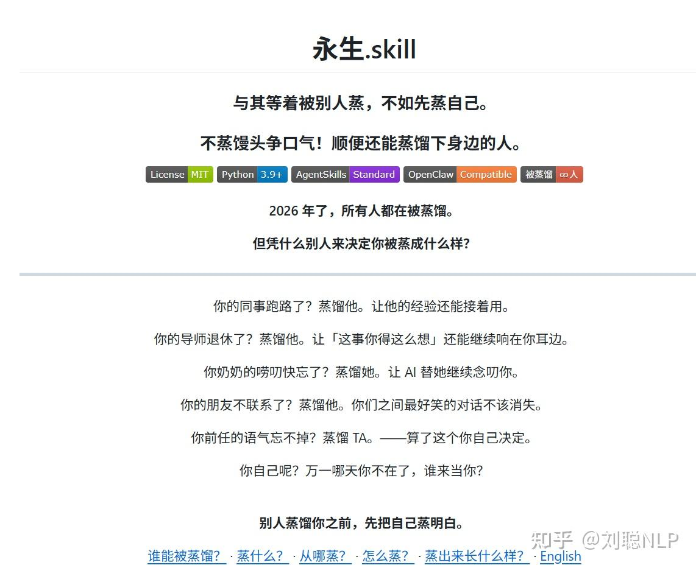

### 数字人生Skill

[https://github.com/wildbyteai/digital-life](https://link.zhihu.com/?target=https%3A//github.com/wildbyteai/digital-life)

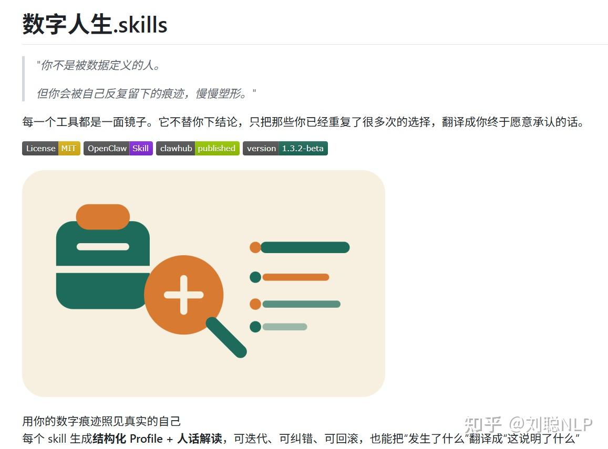

### 重逢SKill

[https://github.com/yangdongchen66-boop/reunion-skill](https://link.zhihu.com/?target=https%3A//github.com/yangdongchen66-boop/reunion-skill)

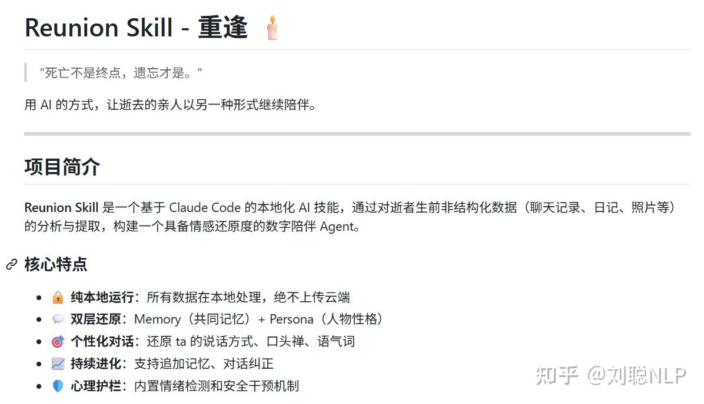

乍一看挺离谱，

但在 Agent + Skills 这个大背景下看，其实并不意外，

就像OpenClaw大火一样，

AI正在变的，让更多人觉得更可用。

同时，

大家已经不满足于让 AI 仅仅像一个无情的机器一样去解决任务，

**AI 也正在从“能力模型”走向“行为模型”。**

最后，

无论是为了搞笑、为了工作，还是为了怀念，

SKill的本质就是**把知识、习惯、能力进行沉淀**，

所以，

**为什么不能把身边的一切都封装成一个SKill呢？**