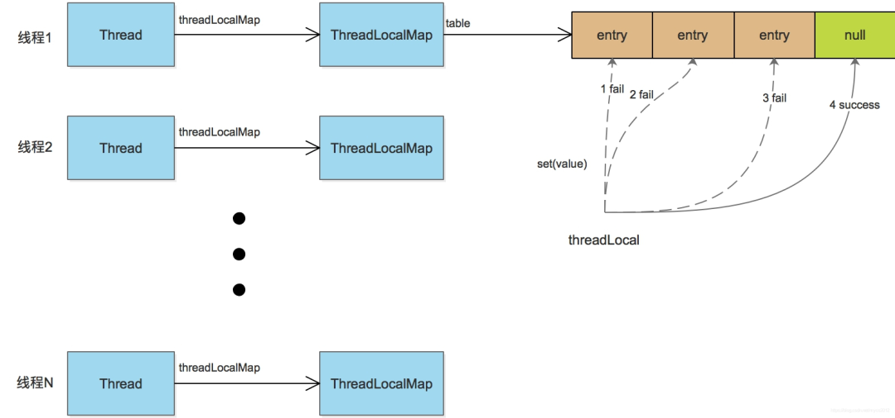
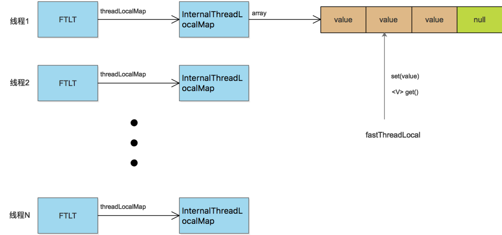
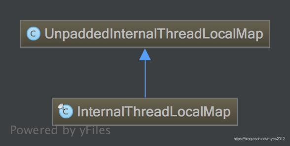
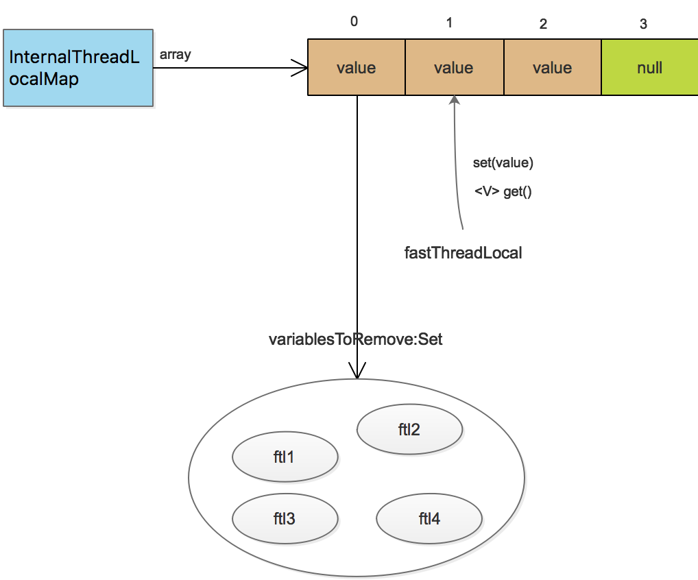
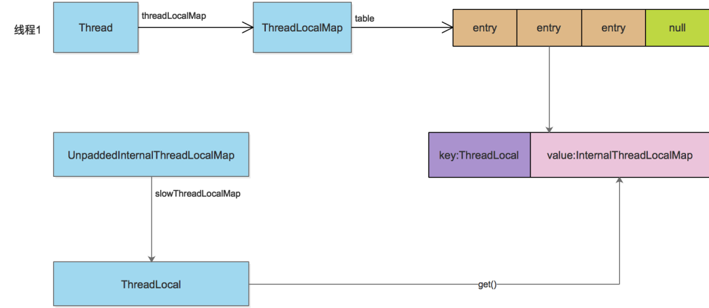

## **1 FastThreadLocal的引入背景和原理简介**

既然jdk已经有ThreadLocal，为何netty还要自己造个FastThreadLocal？FastThreadLocal快在哪里？

这需要从jdk ThreadLocal的本身说起。如下图：



在java线程中，每个线程都有一个ThreadLocalMap实例变量（如果不使用ThreadLocal，不会创建这个Map，一个线程第一次访问某个ThreadLocal变量时，才会创建）。

该Map是使用线性探测的方式解决hash冲突的问题，如果没有找到空闲的slot，就不断往后尝试，直到找到一个空闲的位置，插入entry，这种方式在经常遇到hash冲突时，影响效率。

FastThreadLocal(下文简称ftl)直接使用数组避免了hash冲突的发生，具体做法是：每一个FastThreadLocal实例创建时，分配一个下标index；分配index使用AtomicInteger实现，每个FastThreadLocal都能获取到一个不重复的下标。

当调用`ftl.get()`方法获取值时，直接从数组获取返回，如`return array[index]`，如下图：



## **2 实现源码分析**

根据上文图示可知，ftl的实现，涉及到InternalThreadLocalMap、FastThreadLocalThread和FastThreadLocal几个类，自底向上，我们先从InternalThreadLocalMap开始分析。

InternalThreadLocalMap类的继承关系图如下：



### **2.1 UnpaddedInternalThreadLocalMap的主要属性**

```java
static final ThreadLocal<InternalThreadLocalMap> slowThreadLocalMap = new ThreadLocal<InternalThreadLocalMap>();
static final AtomicInteger nextIndex = new AtomicInteger();
Object[] indexedVariables;
```

数组indexedVariables就是用来存储ftl的value的，使用下标的方式直接访问。nextIndex在ftl实例创建时用来给每个ftl实例分配一个下标，slowThreadLocalMap在线程不是ftlt时使用到。

### **2.2 InternalThreadLocalMap分析**

InternalThreadLocalMap的主要属性：

```java
// 用于标识数组的槽位还未使用
public static final Object UNSET = new Object();
/**
 * 用于标识ftl变量是否注册了cleaner
 * BitSet简要原理：
 * BitSet默认底层数据结构是一个long[]数组，开始时长度为1，即只有long[0],而一个long有64bit。
 * 当BitSet.set(1)的时候，表示将long[0]的第二位设置为true，即0000 0000 ... 0010（64bit）,则long[0]==2
 * 当BitSet.get(1)的时候，第二位为1，则表示true；如果是0，则表示false
 * 当BitSet.set(64)的时候，表示设置第65位，此时long[0]已经不够用了，扩容处long[1]来，进行存储
 *
 * 存储类似 {index:boolean} 键值对，用于防止一个FastThreadLocal多次启动清理线程
 * 将index位置的bit设为true，表示该InternalThreadLocalMap中对该FastThreadLocal已经启动了清理线程
 */
private BitSet cleanerFlags; 

private InternalThreadLocalMap() {
        super(newIndexedVariableTable());
}

private static Object[] newIndexedVariableTable() {
        Object[] array = new Object[32];
        Arrays.fill(array, UNSET);
        return array;
}
```

比较简单，`newIndexedVariableTable()`方法创建长度为32的数组，然后初始化为UNSET，然后传给父类。之后ftl的值就保存到这个数组里面。

> 注意，这里保存的直接是变量值，不是entry，这是和jdk ThreadLocal不同的。InternalThreadLocalMap就先分析到这，其他方法在后面分析ftl再具体说。

### **2.3 ftlt的实现分析**

要发挥ftl的性能优势，必须和ftlt结合使用，否则就会退化到jdk的ThreadLocal。ftlt比较简单，关键代码如下：

```java
public class FastThreadLocalThread extends Thread {
  // This will be set to true if we have a chance to wrap the Runnable.
  private final boolean cleanupFastThreadLocals;
  
  private InternalThreadLocalMap threadLocalMap;
  
  public final InternalThreadLocalMap threadLocalMap() {
        return threadLocalMap;
  }
  public final void setThreadLocalMap(InternalThreadLocalMap threadLocalMap) {
        this.threadLocalMap = threadLocalMap;
  }
}  
```

ftlt的诀窍就在threadLocalMap属性，它继承java Thread，然后聚合了自己的[InternalThreadLocalMap](https://link.zhihu.com/?target=http%3A//mp.weixin.qq.com/s%3F__biz%3DMzI4Njc5NjM1NQ%3D%3D%26mid%3D2247510859%26idx%3D1%26sn%3Dd288f271be40fac33d495abd3995e0e0%26chksm%3Debd59467dca21d7120e3267e7e088525d312f92fac23270592f5d4d1f8b9f02f038b0037e2c1%26scene%3D21%23wechat_redirect)。后面访问ftl变量，对于ftlt线程，都直接从InternalThreadLocalMap获取变量值。

### **2.4 ftl实现分析**

ftl实现分析基于netty-4.1.34版本，特别地声明了版本，是因为在清除的地方，该版本的源码已经注释掉了ObjectCleaner的调用，和之前的版本有所不同。

### **2.4.1 ftl的属性和实例化**

```java
private final int index;

public FastThreadLocal() {
    index = InternalThreadLocalMap.nextVariableIndex();
}
```

非常简单，就是给属性index赋值，赋值的静态方法在InternalThreadLocalMap：

```java
public static int nextVariableIndex() {
        int index = nextIndex.getAndIncrement();
        if (index < 0) {
            nextIndex.decrementAndGet();
            throw new IllegalStateException("too many thread-local indexed variables");
        }
        return index;
  }
```

可见，每个ftl实例以步长为1的递增序列，获取index值，这保证了InternalThreadLocalMap中数组的长度不会突增。

### **2.4.2 get()方法实现分析**

```java
public final V get() {
    InternalThreadLocalMap threadLocalMap = InternalThreadLocalMap.get(); // 1
    Object v = threadLocalMap.indexedVariable(index); // 2
    if (v != InternalThreadLocalMap.UNSET) {
        return (V) v;
    }

    V value = initialize(threadLocalMap); // 3
    registerCleaner(threadLocalMap);  // 4
    return value;
}
```

**1.先来看看`InternalThreadLocalMap.get()`方法如何获取threadLocalMap：**

```java
=======================InternalThreadLocalMap=======================  
  public static InternalThreadLocalMap get() {
        Thread thread = Thread.currentThread();
        if (thread instanceof FastThreadLocalThread) {
            return fastGet((FastThreadLocalThread) thread);
        } else {
            return slowGet();
        }
    }
    
  private static InternalThreadLocalMap fastGet(FastThreadLocalThread thread) {
        InternalThreadLocalMap threadLocalMap = thread.threadLocalMap();
        if (threadLocalMap == null) {
            thread.setThreadLocalMap(threadLocalMap = new InternalThreadLocalMap());
        }
        return threadLocalMap;
    }    
```

因为结合FastThreadLocalThread使用才能发挥FastThreadLocal的性能优势，所以主要看fastGet方法。该方法直接从ftlt线程获取threadLocalMap，还没有则创建一个InternalThreadLocalMap实例并设置进去，然后返回。学习资料：[Java进阶视频资源](https://link.zhihu.com/?target=http%3A//mp.weixin.qq.com/s%3F__biz%3DMzU2MTI4MjI0MQ%3D%3D%26mid%3D2247506972%26idx%3D2%26sn%3D790959d9ee2b74e0d0c8a0a5395bc665%26chksm%3Dfc79b1b2cb0e38a498933a034926df45b51524b044762583488d498ae2112c06cf35d412fb3b%26scene%3D21%23wechat_redirect)

**2.`threadLocalMap.indexedVariable(index)`就简单了，直接从数组获取值，然后返回：**

```java
public Object indexedVariable(int index) {
        Object[] lookup = indexedVariables;
        return index < lookup.length? lookup[index] : UNSET;
    }
```

**3.如果获取到的值不是UNSET，那么是个有效的值，直接返回。如果是UNSET，则初始化。**

`initialize(threadLocalMap)`方法：

```java
private V initialize(InternalThreadLocalMap threadLocalMap) {
        V v = null;
        try {
            v = initialValue();
        } catch (Exception e) {
            PlatformDependent.throwException(e);
        }

        threadLocalMap.setIndexedVariable(index, v); // 3-1
        addToVariablesToRemove(threadLocalMap, this); // 3-2
        return v;
    }
```

3.1.获取ftl的初始值，然后保存到ftl里的数组，如果数组长度不够则扩充数组长度，然后保存，不展开。

3.2.`addToVariablesToRemove(threadLocalMap, this)`的实现，是将ftl实例保存在threadLocalMap内部数组第0个元素的Set集合中。

此处不贴代码，用图示如下：



**4.`registerCleaner(threadLocalMap)`的实现，netty-4.1.34版本中的源码：**

```java
private void registerCleaner(final InternalThreadLocalMap threadLocalMap) {
        Thread current = Thread.currentThread();
        if (FastThreadLocalThread.willCleanupFastThreadLocals(current) || threadLocalMap.isCleanerFlagSet(index)) {
            return;
        }

        threadLocalMap.setCleanerFlag(index);

        // TODO: We need to find a better way to handle this.
        /*
        // We will need to ensure we will trigger remove(InternalThreadLocalMap) so everything will be released
        // and FastThreadLocal.onRemoval(...) will be called.
        ObjectCleaner.register(current, new Runnable() {
            @Override
            public void run() {
                remove(threadLocalMap);

                // It's fine to not call InternalThreadLocalMap.remove() here as this will only be triggered once
                // the Thread is collected by GC. In this case the ThreadLocal will be gone away already.
            }
        });
        */
}
```

由于ObjectCleaner.register这段代码在该版本已经注释掉，而余下逻辑比较简单，因此不再做分析。

### **2.5 普通线程使用ftl的性能退化**

随着`get()`方法分析完毕，`set(value)`方法原理也呼之欲出，限于篇幅，不再单独分析。

前文说过，ftl要结合ftlt才能最大地发挥其性能，如果是其他的普通线程，就会退化到jdk的ThreadLocal的情况，因为普通线程没有包含InternalThreadLocalMap这样的数据结构，接下来我们看如何退化。学习资料：[Java进阶视频资源](https://link.zhihu.com/?target=http%3A//mp.weixin.qq.com/s%3F__biz%3DMzU2MTI4MjI0MQ%3D%3D%26mid%3D2247506972%26idx%3D2%26sn%3D790959d9ee2b74e0d0c8a0a5395bc665%26chksm%3Dfc79b1b2cb0e38a498933a034926df45b51524b044762583488d498ae2112c06cf35d412fb3b%26scene%3D21%23wechat_redirect)

从InternalThreadLocalMap的`get()`方法看起：

```java
=======================InternalThreadLocalMap=======================  
  public static InternalThreadLocalMap get() {
        Thread thread = Thread.currentThread();
        if (thread instanceof FastThreadLocalThread) {
            return fastGet((FastThreadLocalThread) thread);
        } else {
            return slowGet();
        }
    }

  private static InternalThreadLocalMap slowGet() {
       // 父类的类型为jdk ThreadLocald的静态属性，从该threadLocal获取InternalThreadLocalMap
        ThreadLocal<InternalThreadLocalMap> slowThreadLocalMap = UnpaddedInternalThreadLocalMap.slowThreadLocalMap;
        InternalThreadLocalMap ret = slowThreadLocalMap.get();
        if (ret == null) {
            ret = new InternalThreadLocalMap();
            slowThreadLocalMap.set(ret);
        }
        return ret;
    }
```

从ftl看，退化操作的整个流程是：从一个jdk的ThreadLocal变量中获取InternalThreadLocalMap，然后再从InternalThreadLocalMap获取指定数组下标的值，对象关系示意图：



## **3 ftl的资源回收机制**

在netty中对于ftl提供了三种回收机制：

**自动：** 使用ftlt执行一个被FastThreadLocalRunnable wrap的Runnable任务，在任务执行完毕后会自动进行ftl的清理。

**手动：** ftl和InternalThreadLocalMap都提供了remove方法，在合适的时候用户可以（有的时候也是必须，例如普通线程的线程池使用ftl）手动进行调用，进行显示删除。

**自动：** 为当前线程的每一个ftl注册一个Cleaner，当线程对象不强可达的时候，该Cleaner线程会将当前线程的当前ftl进行回收。（netty推荐如果可以用其他两种方式，就不要再用这种方式，因为需要另起线程，耗费资源，而且多线程就会造成一些资源竞争，在netty-4.1.34版本中，已经注释掉了调用ObjectCleaner的代码。）

## **4 ftl在netty中的使用**

ftl在netty中最重要的使用，就是分配ByteBuf。基本做法是：每个线程都分配一块内存(PoolArena)，当需要分配ByteBuf时，线程先从自己持有的PoolArena分配，如果自己无法分配，再采用全局分配。

但是由于内存资源有限，所以还是会有多个线程持有同一块PoolArena的情况。不过这种方式已经最大限度地减轻了多线程的资源竞争，提高程序效率。

具体的代码在**PoolByteBufAllocator的内部类PoolThreadLocalCache中：**

```java
final class PoolThreadLocalCache extends FastThreadLocal<PoolThreadCache> {

    @Override
        protected synchronized PoolThreadCache initialValue() {
            final PoolArena<byte[]> heapArena = leastUsedArena(heapArenas);
            final PoolArena<ByteBuffer> directArena = leastUsedArena(directArenas);

            Thread current = Thread.currentThread();
            if (useCacheForAllThreads || current instanceof FastThreadLocalThread) {
              // PoolThreadCache即为各个线程持有的内存块的封装  
              return new PoolThreadCache(
                        heapArena, directArena, tinyCacheSize, smallCacheSize, normalCacheSize,
                        DEFAULT_MAX_CACHED_BUFFER_CAPACITY, DEFAULT_CACHE_TRIM_INTERVAL);
            }
            // No caching so just use 0 as sizes.
            return new PoolThreadCache(heapArena, directArena, 0, 0, 0, 0, 0);
        }
    }   
```

**参考资料**

-   Netty源码分析3 - FastThreadLocal 框架的设计
-   Netty进阶：自顶向下解析FastThreadLocal

> 作者：Joel.Wang老王  
> *来源：[http://blog.csdn.net/mycs2012/article/details/90898128](https://link.zhihu.com/?target=http%3A//blog.csdn.net/mycs2012/article/details/90898128)*