> 之前操作Docker的时候，一直使用的是命令行的形式。命令行虽说看起来挺炫酷，但有时候还是挺麻烦的。今天给大家推荐一个Docker图形化工具Portainer，轻量级又好用，希望对大家有所帮助！  

SpringBoot实战电商项目mall（40k+star）地址：[https://github.com/macrozheng/mall](https://link.zhihu.com/?target=https%3A//github.com/macrozheng/mall)

## 简介

Portainer 是一款轻量级的应用，它提供了图形化界面，用于方便地管理Docker环境，包括单机环境和集群环境。

## 安装

> 直接使用Docker来安装Portainer是非常方便的，仅需要两步即可完成。  

-   首先下载Portainer的Docker镜像；

```bash
docker pull portainer/portainer
```

-   然后再使用如下命令运行Portainer容器；

```bash
docker run -p 9000:9000 -p 8000:8000 --name portainer \
--restart=always \
-v /var/run/docker.sock:/var/run/docker.sock \
-v /mydata/portainer/data:/data \
-d portainer/portainer
```

-   第一次登录的时候需要创建管理员账号，访问地址：[http://192.168.5.78:9000/](https://link.zhihu.com/?target=http%3A//192.168.5.78%3A9000/)

  

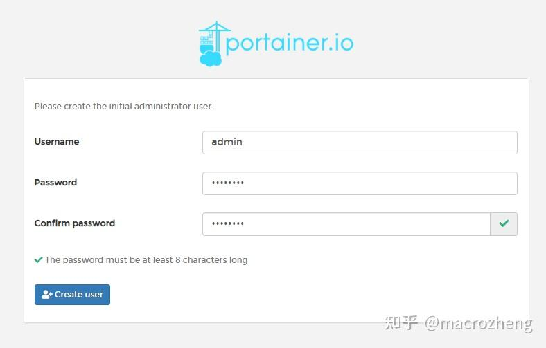

  

-   之后我们选择连接到本地的Docker环境，连接完成后我们就可以愉快地使用Portainer进行可视化管理了！

  

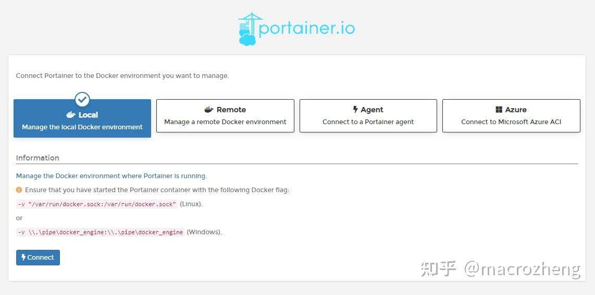

  

## 使用

-   登录成功后，可以发现有一个本地的Docker环境；

  

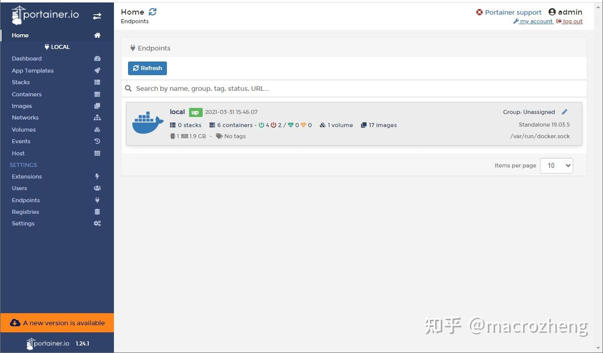

  

-   打开Dashboard菜单可以看到Docker环境的概览信息，比如运行了几个容器，有多少个镜像等；

  

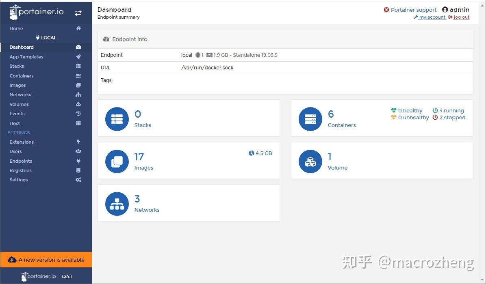

  

-   打开App Templates菜单可以看到很多创建容器的模板，通过模板设置下即可轻松创建容器，支持的应用还是挺多的；

  

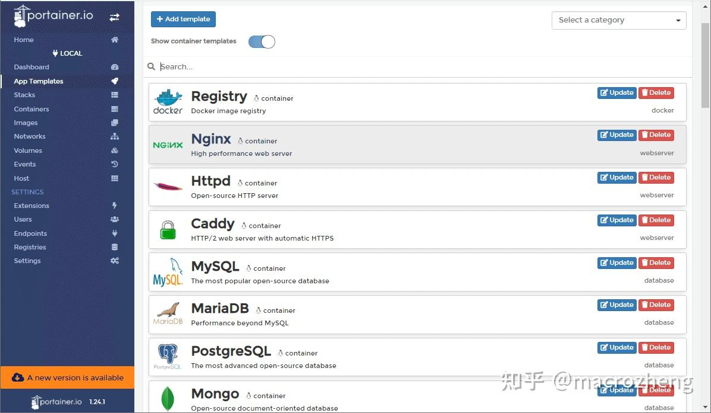

  

-   打开Containers菜单，可以看到当前创建的容器，我们可以对容器进行运行、暂停、删除等操作；

  

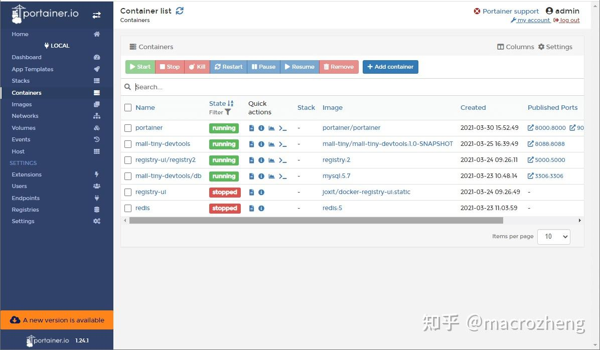

  

-   选择一个容器，点击Logs按钮，可以直接查看容器运行日志，可以和`docker logs`命令说再见了；

  

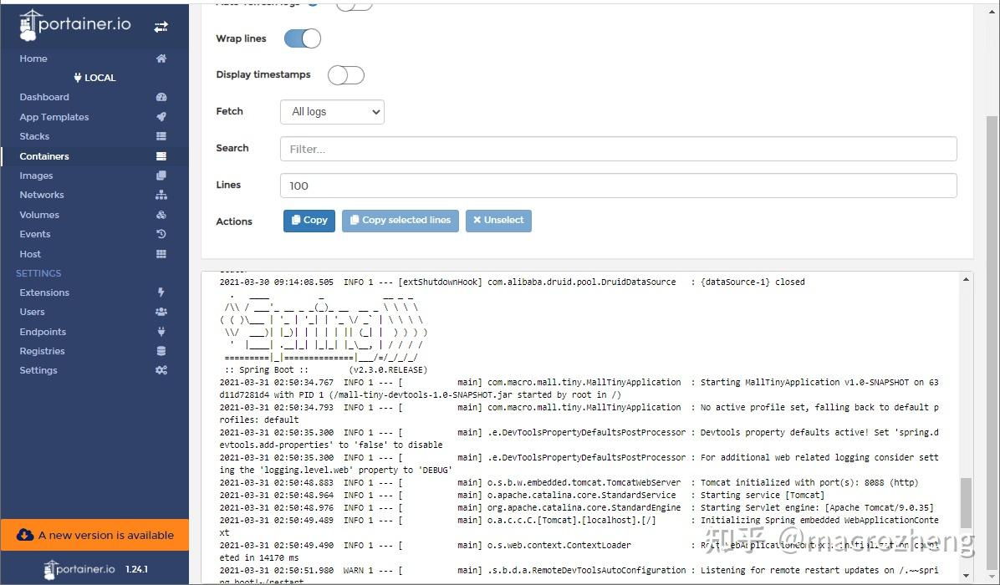

  

-   点击Inspect按钮，可以查看容器信息，比如看看容器运行的IP地址；

  

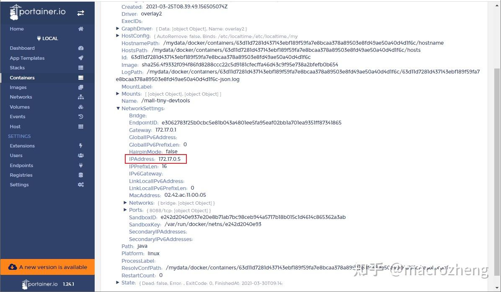

  

-   点击Stats按钮，可以查看容器的内存、CPU及网络的使用情况，性能分析不愁了；

  

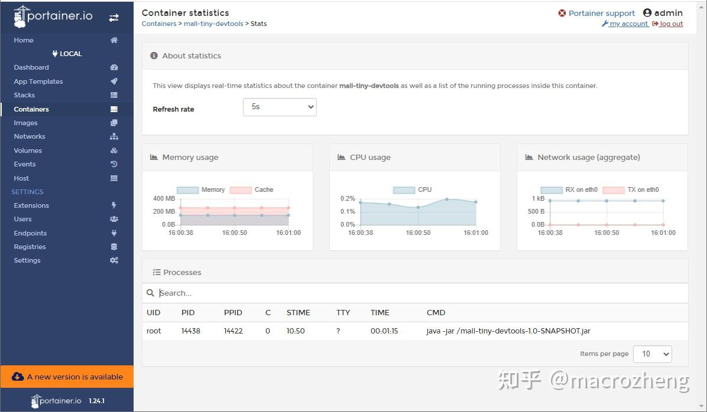

  

-   点击Console按钮，可以进入到容器中去执行命令，比如我们可以进入到MySQL容器中去执行登录命令；

  

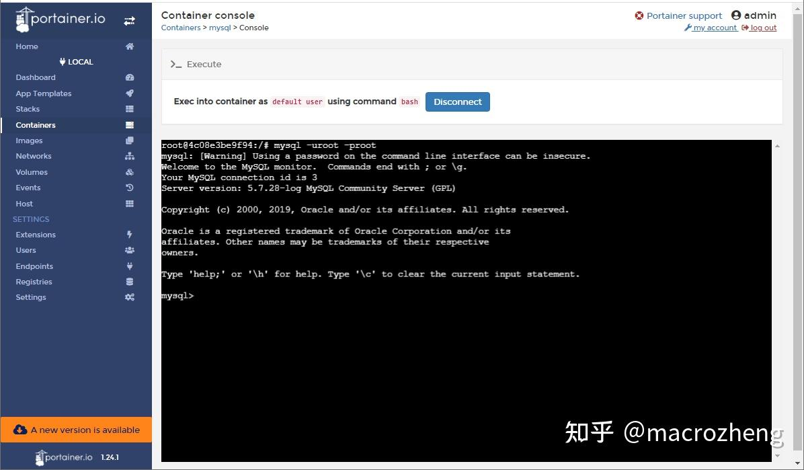

  

-   打开Images菜单，我们可以查看所有的本地镜像，对镜像进行管理；

  

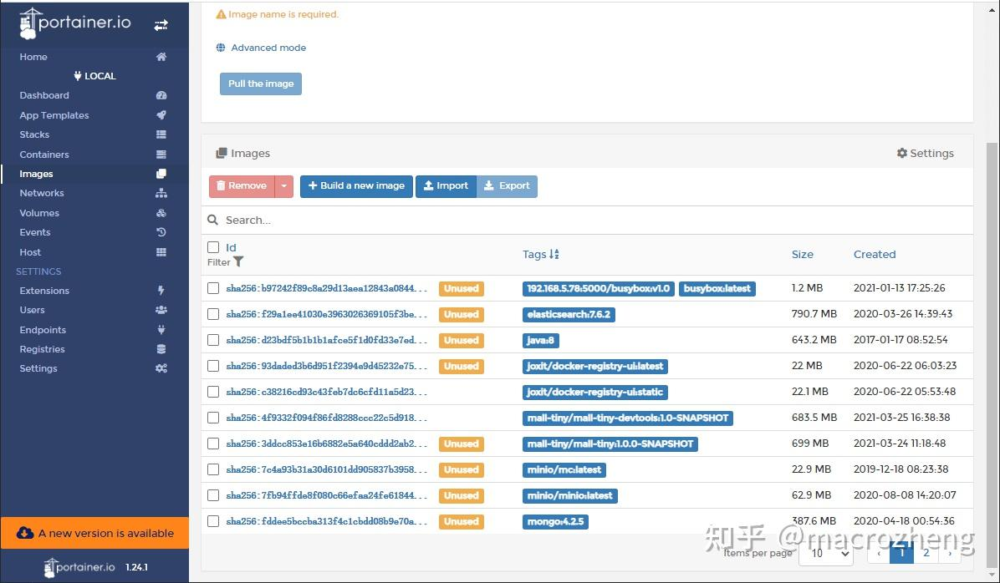

  

-   打开Networks菜单，可以查看Docker环境中的网络情况；

  

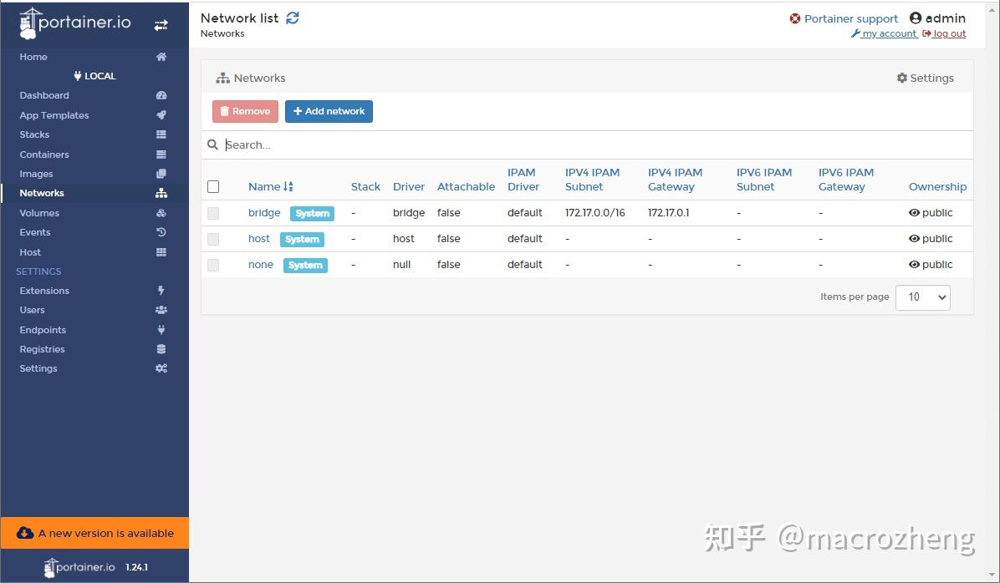

  

-   打开Users菜单，我们可以创建Portainer的用户，并给他们赋予相应的角色；

  

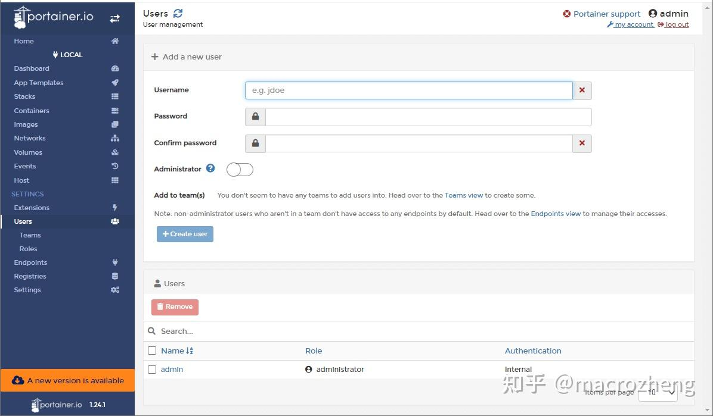

  

-   打开Registries菜单，我们可以配置自己的镜像仓库，这样在拉取镜像的时候，就可以选择从自己的镜像仓库拉取了。

  

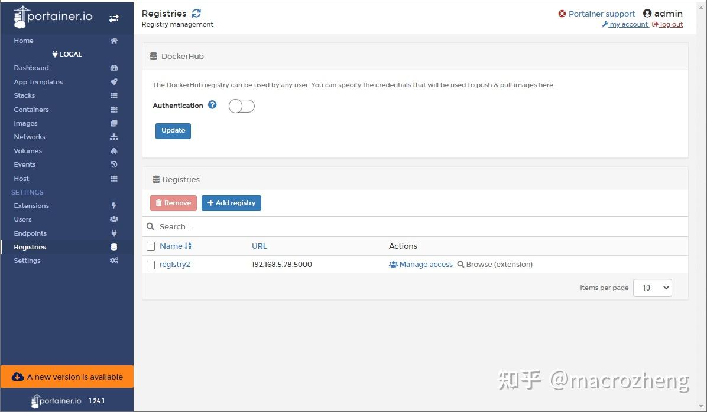

  

## 总结

Portainer作为一款轻量级Docker图形化管理工具，功能强大且实用，要是有个私有镜像仓库管理功能就更好了，这样我们就不用安装重量级的镜像仓库Harbor了。

## 官网地址

[https://github.com/portainer/portainer](https://link.zhihu.com/?target=https%3A//github.com/portainer/portainer)

> 本文 GitHub [https://github.com/macrozheng/mall-learning](https://link.zhihu.com/?target=https%3A//github.com/macrozheng/mall-learning) 已经收录，欢迎大家Star！