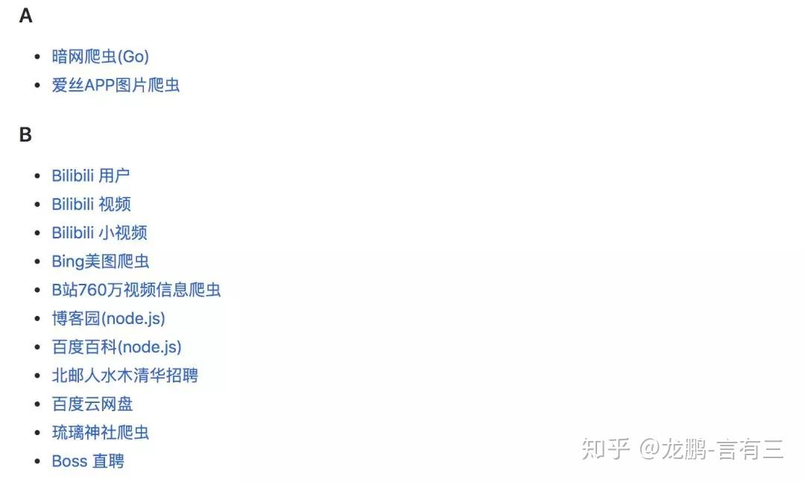
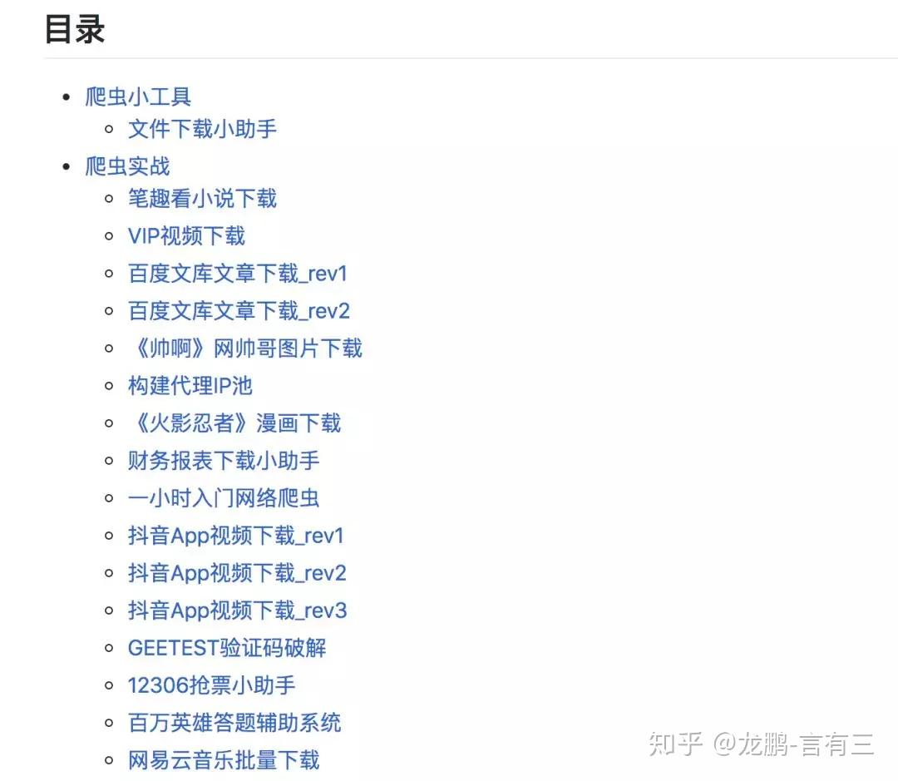
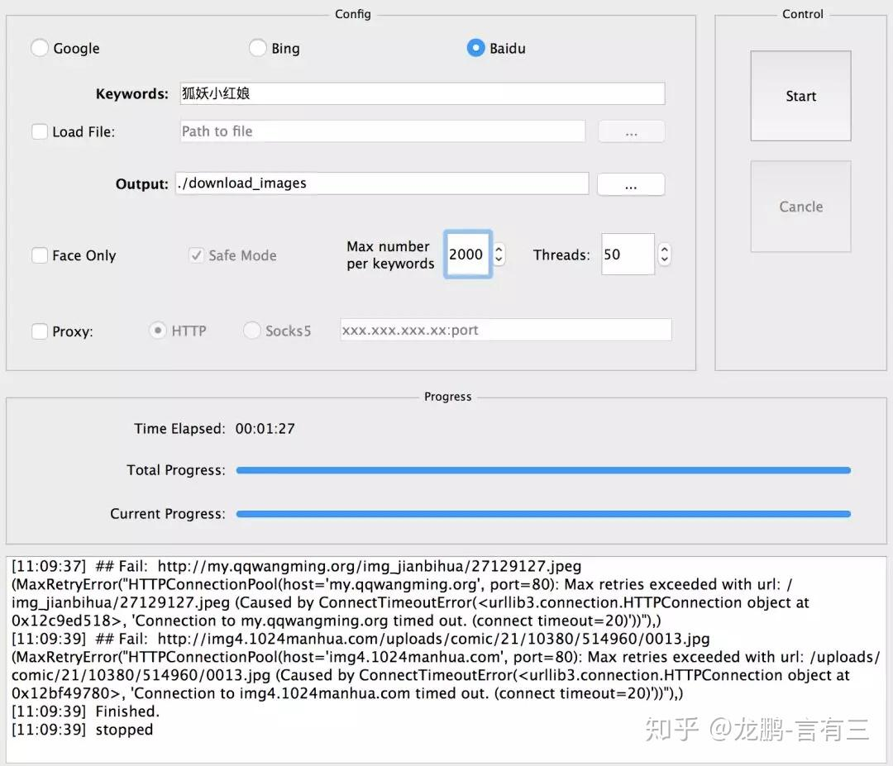
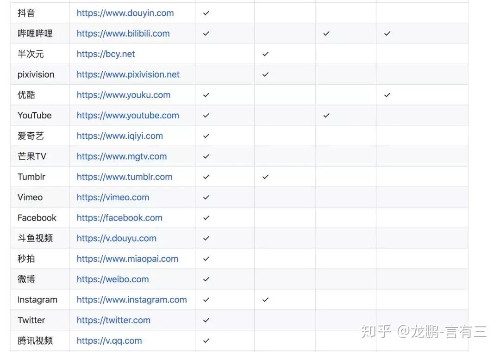
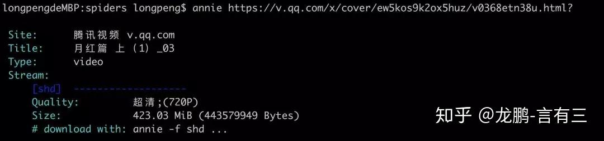
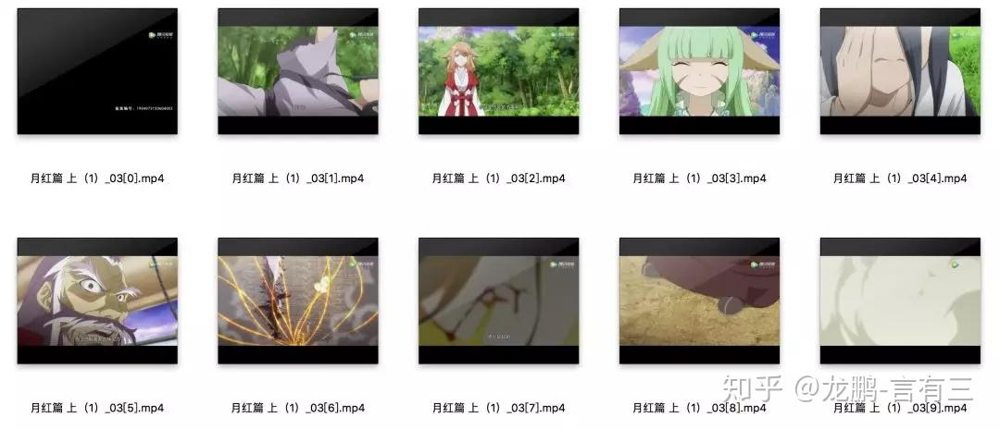

这个综述项目想必都知道吧。

```text
https://github.com/vinta/awesome-python
```

## 推荐一波爬虫库供玩耍吧，参考

[龙鹏-言有三：【杂谈】GitHub上有哪些好用的爬虫(从Google百度，腾讯视频抖音，豆瓣知乎到不可描述)](https://zhuanlan.zhihu.com/p/61289585)

## **1、awesome-spider**

```text
地址：https://github.com/facert/awesome-spider
```

这是ID为facert的一个知乎工程师开源的，star6000+，内容如下：



这一款爬虫，里面搜集了**几乎所有可以爬取的中文网址，从知乎豆瓣到知网，抖音微博到QQ**，还有很多的不可描述的网站，你懂的。

## **2、Nyspider**

```text
地址：https://github.com/Nyloner/Nyspider
```

这是ID为Nyloner的一个今日头条的工程师弄的，star1000+，风格与上面的项目大有不同。


可以看出，都是各类网址。这很头条，跟这位小哥哥的工作内容估计有关系。

## **3、awesome-python-login-model**

```text
地址：https://github.com/CriseLYJ/awesome-python-login-model
```

这是ID为CriseLYJ(职业不详)的用户，这个项目用于模拟各种网址登陆，也包含一些简单的爬虫，star6000+。


先从这个项目开始分析各大网站的登录方式，非常有用，可谓摸清对手再动手。

## **4、python-spider**

```text
地址：https://github.com/Jack-Cherish/python-spider
```

这是ID为Jack-Cherish的东北大学的一个学生整理的学习python爬虫的资料，star6000+，包含不少的实战项目，非常适合想学习的朋友。



其他还有一些项目，不再一一介绍。

```text
https://github.com/jhao104/proxy_pool
https://github.com/Ehco1996/Python-crawler
```

\--------------------------------------此处是分割线--------------------------------------

如果你是做图像的，我再推荐两个**功能强大，简单好用的图片和视频爬虫。**工具亲测长期有效，省去了很多找爬虫工具的时间，早用早好。

## **1、Google，Baidu，Bing三大搜素引擎图片爬虫**

```text
地址：https://github.com/sczhengyabin/Image-Downloader
```

这个爬虫由ID为sczhengyabin的用户整理，可以按要求爬取百度、Bing、Google上的图片，我已经用了几年了，提供了非常人性化的GUI方便操作，使用方法如下：

使用python image\_downloader\_gui.py调用GUI界面，配置好参数(关键词，路径，爬取数目等)，关键词可以直接在这里输入也可以选择从txt文件中选择。

可以配置需要爬取的样本数目，这里一次爬了2000张，妥妥的3分钟搞定。



这个爬虫足够满足小型项目初始数据集的积累**(爬几千张高质量图片妥妥的)**，结果命名也非常整齐规范，**最大的优势就是稳定啊**，不会三天两天不能用了。

## **2、各大视频网站爬虫**

```text
地址：https://github.com/iawia002/annie
```

由ID为iawia002的用户整理，Annie是一款以go语言编码的视频下载工具，使用便捷并**支持youtube，腾讯视频，抖音等多个网站视频和图像的下载**，收录站点如下，可以说是该有的都有的：



虽然这个项目可以下载图片，但是我们还是来用它下载视频吧，使用方法很简单：

```text
annie ［可选参数］http://…  (视频网址)
```



视频会下载到当前目录，至于那些可选参数，赶紧去摸索吧。

