## 这些工具堪称神器！

**ag：**比grep、ack更快的递归搜索文件内容。

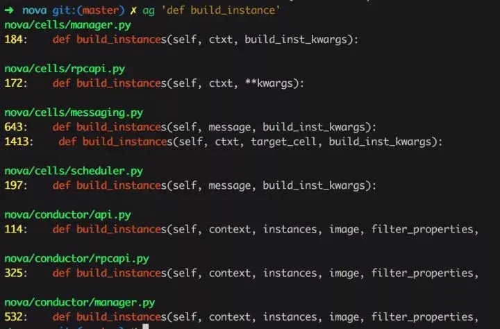

**tig：**字符模式下交互查看git项目，可以替代git命令。

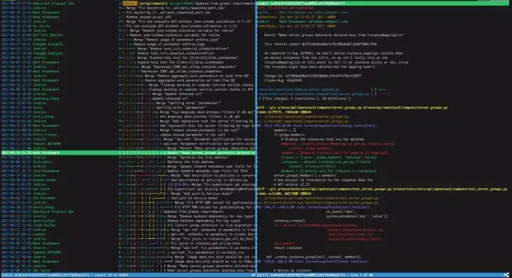

**mycli：**mysql客户端，支持语法高亮和命令补全，效果类似ipython，可以替代mysql命令。

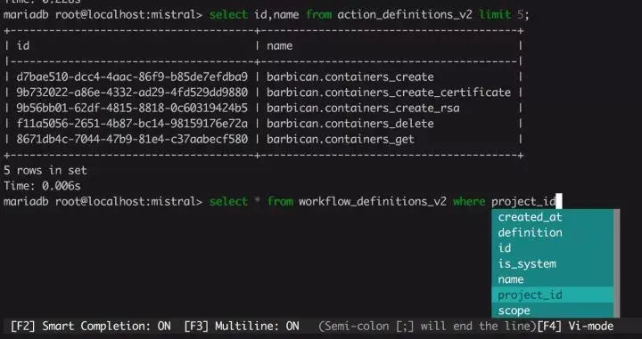

**jq:** json文件处理以及格式化显示，支持高亮，可以替换python -m json.tool。

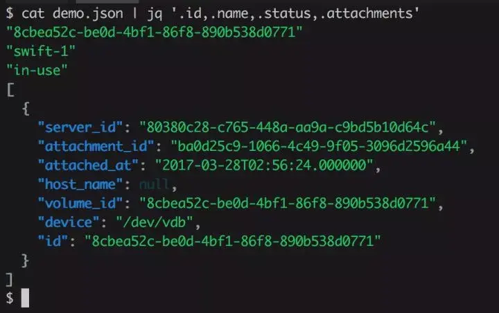

**shellcheck：**shell脚本静态检查工具，能够识别语法错误以及不规范的写法。

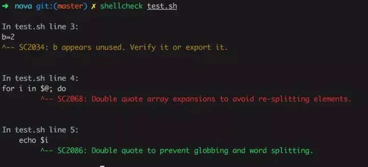

**fzf：**命令行下模糊搜索工具，能够交互式智能搜索并选取文件或者内容，配合终端ctrl-r历史命令搜索简直完美。

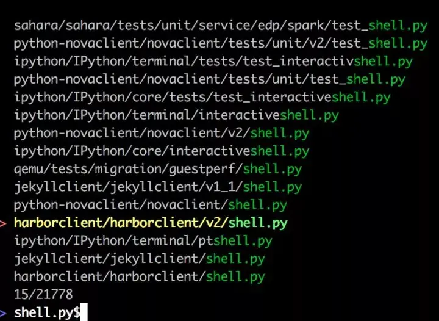

**PathPicker(fpp):** 在命令行输出中自动识别目录和文件，支持交互式，配合git非常有用。

运行以下命令：

```text
git diff HEAD~8 --stat | fpp
```

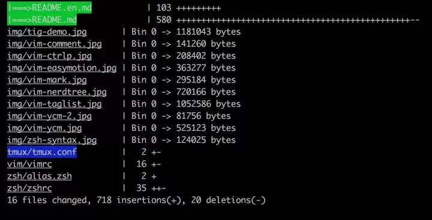

**htop:** 提供更美观、更方便的进程监控工具，**替代top命令。**

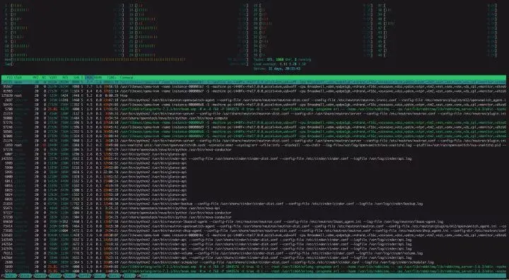

**glances：**更强大的 htop / top 代替者。

htop 代替 top，glances 代替 htop：

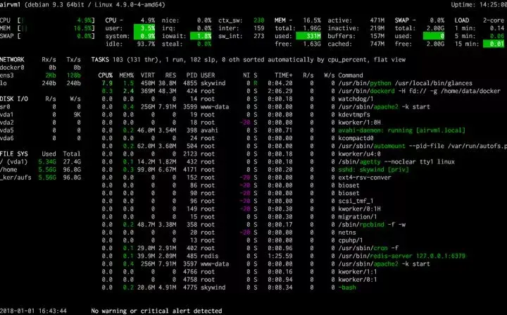

信息比 htop 丰富了不少，更全了，对吧？除了命令行查看外，glances 还提供页面服务，让你从页面上随时查看某服务器的状态。

**axel：**多线程下载工具，下载文件时可以替代curl、wget。

```text
axel -n 20 http://centos.ustc.edu.cn/centos/7/isos/x86_64/CentOS-7-x86_64-Minimal-1511.iso

```

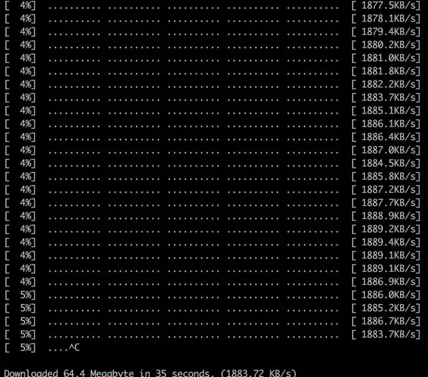

**sz/rz：**交互式文件传输，在多重跳板机下传输文件非常好用，不用一级一级传输。

**cloc：**代码统计工具，能够统计代码的空行数、注释行、编程语言。

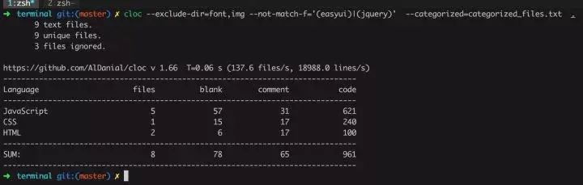

**tmux：**终端复用工具，替代screen、nohup。

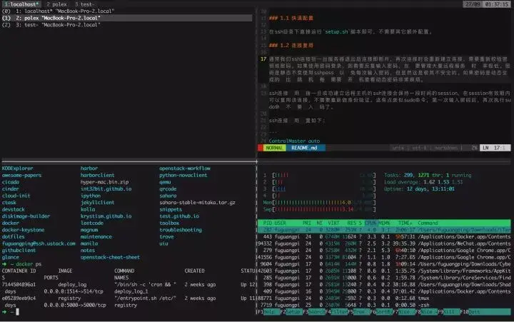

**script/scriptreplay:** 终端会话录制。

```text
# 录制
script -t 2>time.txt session.typescript
# your commands
# 录制结束
exit
# 回放
scriptreplay -t time.txt session.typescript

```

**multitail：**多重 tail。

通常你不止一个日志文件要监控，怎么办？终端软件里开多个 tab 太占地方，可以试试这个工具：

  

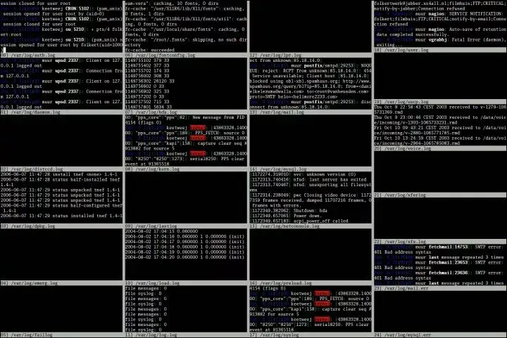

> 来源：[有哪些命令行的软件堪称神器？](https://www.zhihu.com/question/59227720/answer/163594782)

大佬，你用过哪个工具？

[民工哥：358 页，11.5 W字！120 个《 Linux 系统常用命令 》 肝完了！完整版 PDF 开源](https://zhuanlan.zhihu.com/p/367068110)