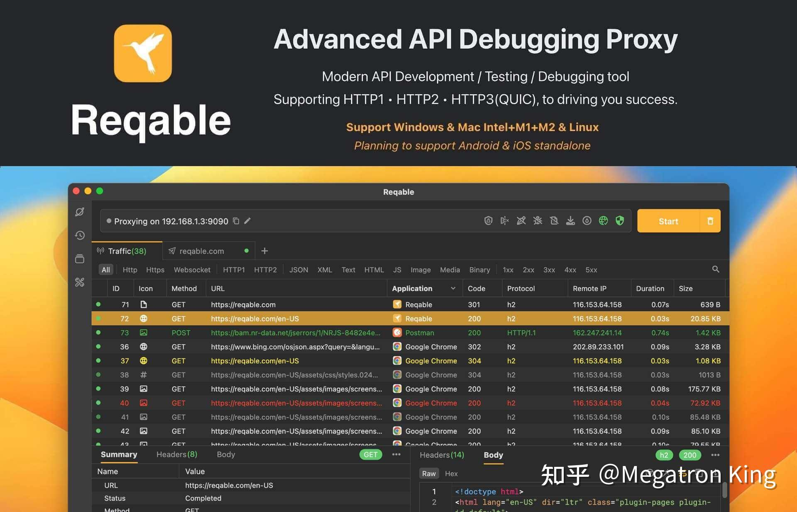

我从自己目前的创业经历和体验，来谈下我对这个问题的个人看法。

我的创业项目是Reqable，理想也是做出类似JetBrains全家桶这一类优秀的工程软件。但是，理想是美好的，现实是艰难的。

Reqable的产品定位是Fiddler/Charles + Postman，简单说就是把API抓包调试和API请求测试结合到一起，打通中间的壁垒，两个工具能够完成的事情现在只需要一个工具就可以了。我相信很多程序员，除了JetBrains全家桶外，API类软件也是都经常用的，而我要做的就是国产化。

软件我独自一个人就做出来了，说明做出一款优秀的软件完全不是技术问题，因为我相信国内技术上比我好的太多了。

那是产品不够优秀的问题吗？也不是，从目前用户的口碑来看，比Fiddler、Charles、Postman这些除了功能丰富程度上有待补全外，体验上要更加丝滑和顺畅。

那么是定价太高了吗？也不是，Fiddler Everywhere一年订阅费用是120-144刀，Reqable一年只要59.9-79.9rmb，价格真的只有1/10不到。Fiddler Everywhere在国外能卖，而Reqable在国内卖不动。

核心问题是什么？**付费意愿**。在国内，无论是个人还是公司，包括大公司，对软件的付费意愿都非常非常低，大家宁愿去找破解版、开源软件、免费版白嫖，即使软件很优秀，也不愿意为软件付费，引申开来就是市场问题。JetBrains也好MathWorks也罢，软件公司的存活的条件就是将软件卖出去，没有这个市场，就没有公司，换句话说市场就是企业生长的土壤，好的市场可以才能生长出优秀的企业。而国内的工程软件公司，在萌芽的时候只能在国内的市场土壤下生长，能成长起来吗？真的很难。而无论是自己创业还是风险投资，也很难相信有人在了解这个市场的情况下还愿意投入真金白银，市场上卖不出去，资本上拉不到投资，公司怎么活呢？

工程类软件的付费客户是基本都是企业，这个问题深入展开下去就是要探究为什么企业的付费意愿这么低，从我个人的观点来看，可能有下面几个方面的原因：

第一，企业管理者版权意识淡漠。有权决定是否需要采购软件的是企业管理者，优秀的企业会在员工入职前就会准备好工作所必需的工程软件，而不是让员工自行准备或者坐视其使用盗版。非必需的软件也应该有一套完善的采购报销流程。很多商业软件在中国大陆的收入来源可能都是靠发律师函，比如Reqable的竞品Fiddler Everywhere。

第二，项目管理缺乏效率意识。大多数的商业软件都是有替代或者部分替代，比如开源软件，我并不是说开源软件就一定不如商业软件，但是在工程或者项目管理领域内绝大多数的商业软件无论是功能丰富度、专业程度、易用性、流程体系还是配套服务都比开源软件要强。很多企业或者项目管理者听说软件要付费，就让工程实施人员去找替代品，不管盗版的开源的，反正只要能用把活儿干了的就行。至于寻找替代品会要花多久，开源或盗版的好不好用，用起来损失多少效率那就完全不管了，属于典型的看得见可见成本看不见隐形成本。想起前阵子被大家骂的Unity，我曾经用免费版好像是三天就要手动来激活一次，付费后就没这个糟心又降效的事情了。项目管理不做效率管理可能是国内大多数企业的通病，包括大公司，眼睛总盯着员工的打卡时长，加班时长，工作效率完全不管。诚然，管时长确实比管效率要容易得多，这方面说多了又是另一个话题了，暂且打住。我从商汤离职去创业搞Reqable的一大因素也是受不了这一点。

第三，一线工程人员没有发言权。在企业里，不是所有的管理者都具备专业的知识度，可能无法评估采购软件的必要性，但是商业软件好不好用，值不值得付费，一线工程人员是最清楚的，但是大家并没有发言权。我在某论坛发了一个帖子，大概意思就是问员工自行购买了工作软件企业会不会给报销，网友们一致的回答是不会。除了报销流程繁琐等因素外，很多都是说，提了没用，老爷们不会批。

我在离职去做Reqable的时候没有去仔细思考过这些问题，即使思考过肯定也没有现在理解这么深刻。但是，我是个理想主义者，如果没有困难就没有这个问题也就是没有我的机会，总要试一试。我成立了公司，但是公司只有我一个人，我可以将成本降到最低，那么企业成长所需要的土壤要求也就没那么苛刻了。

最后，结合最近河北的时事。除了市场需要引导和规范，还需要就是对技术人才的重视。像我这种苦哈哈的理想主义者毕竟是少数，我相信当很多技术人员财富自由或者生活无忧后肯定是有能力创办出比JetBrains, MathWorks更优秀的公司。

* * *

`Reqable`产品的理念是**先进API生产力**，欢迎大家访问`Reqable`的官网并支持：[https://reqable.com](https://link.zhihu.com/?target=https%3A//reqable.com/)