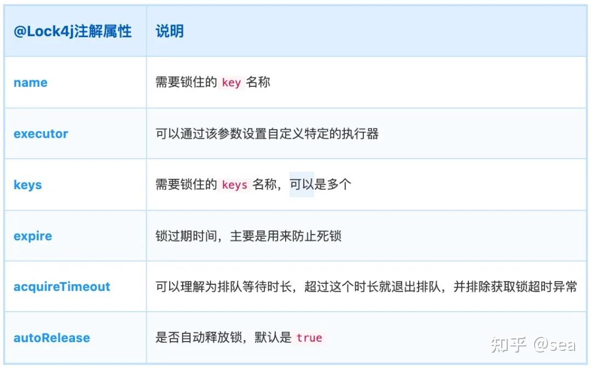

## **一、简介**

Lock4j是一个分布式锁组件，它提供了多种不同的支持以满足不同性能和环境的需求，基于Spring AOP的声明式和编程式分布式锁，支持RedisTemplate、Redisson、Zookeeper。

## **二、特性**

-   • 简单易用，功能强大，扩展性强。
-   • 支持redission, redisTemplate, zookeeper，可混用，支持扩展。

开源地址：

*[https://gitee.com/baomidou/lock4j](https://link.zhihu.com/?target=https%3A//gitee.com/baomidou/lock4j)*

## **三、使用前准备**

### **3.1 引入依赖**

```text
<!-- Lock4j -->
<!-- 若使用redisTemplate作为分布式锁底层，则需要引入 -->
<dependency>
<groupId>com.baomidou</groupId>
<artifactId>lock4j-redis-template-spring-boot-starter</artifactId>
<version>2.2.4</version>
</dependency>
<!-- 若使用redisson作为分布式锁底层，则需要引入 -->
<dependency>
<groupId>com.baomidou</groupId>
<artifactId>lock4j-redisson-spring-boot-starter</artifactId>
<version>2.2.4</version>
</dependency>
```

### **3.2 添加redis配置**

```text
spring:
  redis:
database:0
# Redis服务器地址 写你的ip
host:127.0.0.1
# Redis服务器连接端口
port:6379
# Redis服务器连接密码（默认为空）
password:
# 连接池最大连接数（使用负值表示没有限制  类似于mysql的连接池
jedis:
pool:
max-active:200
# 连接池最大阻塞等待时间（使用负值表示没有限制） 表示连接池的链接拿完了 现在去申请需要等待的时间
max-wait:-1
# 连接池中的最大空闲连接
max-idle:10
# 连接池中的最小空闲连接
min-idle:0
# 连接超时时间（毫秒） 去链接redis服务端
timeout: 6000
```

## **四、注解属性介绍**

```text
package com.baomidou.lock.annotation;

@Target({ElementType.METHOD})
@Retention(RetentionPolicy.RUNTIME)
@Inherited
@Documented
public@interfaceLock4j{
Stringname()default"";

Class<?extendsLockExecutor> executor()defaultLockExecutor.class;

String[] keys()default{""};

longexpire()default-1L;

longacquireTimeout()default-1L;

booleanautoRelease()defaulttrue;
}
```

  



  

## **五、简单使用**

```text
@RestController
@RequestMapping("/mock")
publicclassMockController{

@GetMapping("/lockMethod")
@Lock4j(keys = {"#key"}, acquireTimeout = 1000, expire = 10000)
publicResultlockMethod(@RequestParam String key){
ThreadUtil.sleep(5000);
returnResult.OK(key);
}
}
```

打开浏览器窗口，重复刷新访问：

`http://localhost:8080/mock/lockMethod?key=123`

成功获得锁访问结果：

```text
{
    "success":true,
"message":"操作成功！",
"code":200,
"result":"123",
"timestamp":1678866083211
}
```

抢占不到锁，Lock4j会抛出

`com.baomidou.lock.exception.LockFailureException: request failed,please retry it.`

异常，通过全局异常处理返回如下结果：

```text
{
    "success":false,
"message":"操作失败，request failed,please retry it.",
"code":500,
"result":null,
"timestamp":1678866034929
}
```

## **六、高级使用**

### **6.1 自定义执行器Exector**

```text
/**
 * 自定义分布式锁执行器
 *
 * @author: austin
 * @since: 2023/3/15 15:45
 */
@Component
publicclassCustomRedissonLockExecutorextendsAbstractLockExecutor{

@Override
publicObjectacquire(String lockKey, String lockValue, long expire, long acquireTimeout){
returnnull;
}

@Override
publicbooleanreleaseLock(String key, String value, Object lockInstance){
returnfalse;
}
}
```

在注解上直接指定特定的执行器：

`@Lock4j(executor = CustomRedissonLockExecutor.class)`。

### **6.2 自定义分布式锁key生成器**

```text
/**
 * 自定义分布式锁key生成器
 *
 * @author: austin
 * @since: 2023/3/15 15:46
 */
@Component
publicclassCustomKeyBuilderextendsDefaultLockKeyBuilder{

publicCustomKeyBuilder(BeanFactory beanFactory){
super(beanFactory);
}
}
```

### **6.3 自定义抢占锁失败执行策略**

```text
/**
 * 自定义抢占锁失败执行策略
 *
 * @author: austin
 * @since: 2023/3/15 15:49
 */
@Component
publicclassGrabLockFailureStrategyimplementsLockFailureStrategy{

@Override
publicvoidonLockFailure(String key, Method method, Object[] arguments){

}
}
```

默认的锁获取失败策略为

`com.baomidou.lock.DefaultLockFailureStrategy`.

### **6.4 手动加锁释放锁**

```text
@Service
publicclassLockServiceImplimplementsLockService{

@Autowired
privateLockTemplate lockTemplate;

@Override
publicvoidlock(String resourceKey){

LockInfolock= lockTemplate.lock(resourceKey,10000L,2000L,CustomRedissonLockExecutor.class);
if(lock ==null){
// 获取不到锁
thrownewFrameworkException("业务处理中，请稍后再试...");
}
// 获取锁成功，处理业务
try{
            doBusiness();
}catch(Exception e){
thrownewRuntimeException(e);
}finally{
            lockTemplate.releaseLock(lock);
}
}

privatevoiddoBusiness(){
// TODO 业务执行逻辑
}
}
```