Agent = tool + LLM + loop；目前AI dev方向主要还是从harness角度对这agent进行着优化，我们看到的越来越powerful的agent，例如openclaw，**[easy-claw](https://zhuanlan.zhihu.com/p/2029191881351787466)**等，都是沿着设施harness周边进行了优化，充分提升激发llm的能力。但是，对于这种llm调用tool推理的原生能力到底怎么来，目前开源界讨论却很少。因此本文从这个底层能力学习角度，对agentic post-training进行了深入的剖析。

这其中，如何有效调用tool形成有效推理链，是一个非常重要的方向，也即 Tool-Integrated-Reasoning (TIR)。而为了强化其性能，在一个harness良好的env下，做强化学习(RL)成了提升TIR性能的关键和核心手段。因此本文将主要从TIRL方向进行深度探讨，列举发展研究现状。

  

## TIR发展现状

工具集成强化学习（TIRL）作为大语言模型能力扩展的新兴范式，通过将外部工具调用与强化学习相结合，为解决复杂推理任务提供了革命性的解决方案。

该领域经历了从基础范式建立到技术突破再到规模化应用的演进历程，在方法创新上实现了三大跨越：

-   从监督微调向自主探索
-   从单一工具向多工具协同
-   从固定策略向自适应策略

在应用场景方面，TIRL已成功拓展至数学推理、代码生成、科学问答、医疗验证等多个领域，展现出强大的泛化能力。从2023年基础强化学习扩展规律研究，到2024年工具增强奖励建模，再到2025年针对多轮LLM智能体的系统级优化和算法创新。这一演进过程反映了研究从单智能体小规模实验向**多智能体、多模态、长时序复杂任务**的拓展，以及从单纯算法优化向系统与算法协同优化的转变。

  

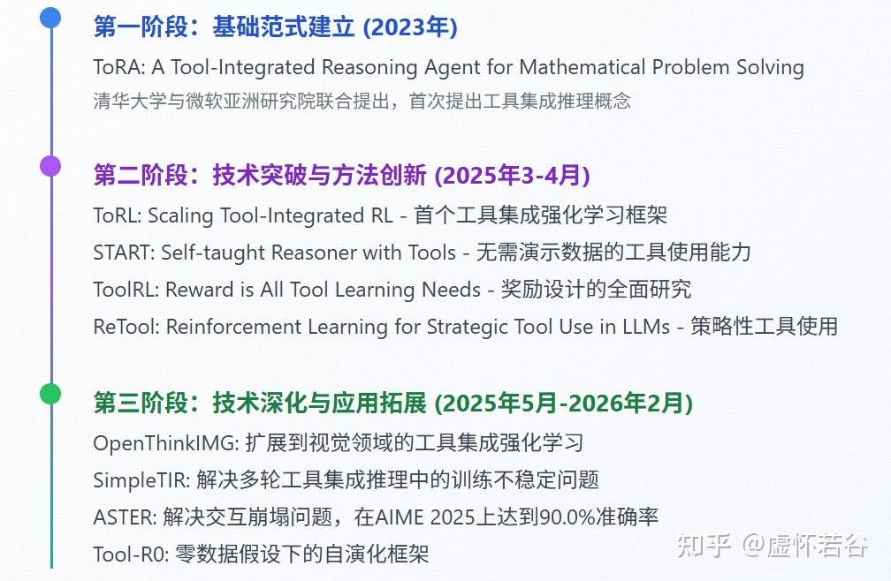

## Papaer List

### Important Categories

强化学习算法创新

-   | 关键LLM-TIR研究方向 | 关键论文列表 |
    | ----- | ----- |
    | 强化学习算法创新 | Group-in-Group Policy Optimization for LLM Agent TrainingARPO：Agentic Reinforced Policy OptimizationSPA-RL: Reinforcing LLM Agents via Stepwise Progress Attribution |
    | 工具集成训练方法对比 | TORL:Scaling Tool-Integrated RLSkyRLRAGEN:Understanding Self-Evolution in LLM Agents via Multi-Turn Reinforcement LearningAgent RL Scaling Law: Spontaneous Code Execution for Mathematical Problem Solving |
    | 奖励模型与设计 | RAGEN-2 Reasoning Collapse in Agentic RLZEROSEARCH: Incentivize the Search Capability of LLMs without SearchingOTC: Optimal Tool Calls via Reinforcement LearningToolRL: Reward is All Tool Learning NeedsGroup-in-Group Policy Optimization for LLM Agent TrainingNemotron-Research-Tool-N1: Tool-Using Language Models with Reinforced Reasoning |
    | 最新进展 | OPENTHINKIMG:Learning to Think with Images via Visual Tool Reinforcement LearningSimpleTIR: End-to-End Reinforcement Learning for Multi-Turn Tool-Integrated ReasoningASTER: Agentic Scaling with Tool-integrated Extended ReasoningTool-R0: Self-Evolving LLM Agents for Tool-Learning from Zero Data |
    
-   | 关键LLM-TIR研究方向 | 关键论文列表 |
    | ----- | ----- |
    | 强化学习算法创新 | Group-in-Group Policy Optimization for LLM Agent TrainingARPO：Agentic Reinforced Policy OptimizationSPA-RL: Reinforcing LLM Agents via Stepwise Progress Attribution |
    | 工具集成训练方法对比 | TORL:Scaling Tool-Integrated RLSkyRLRAGEN:Understanding Self-Evolution in LLM Agents via Multi-Turn Reinforcement LearningAgent RL Scaling Law: Spontaneous Code Execution for Mathematical Problem Solving |
    | 奖励模型与设计 | RAGEN-2 Reasoning Collapse in Agentic RLZEROSEARCH: Incentivize the Search Capability of LLMs without SearchingOTC: Optimal Tool Calls via Reinforcement LearningToolRL: Reward is All Tool Learning NeedsGroup-in-Group Policy Optimization for LLM Agent TrainingNemotron-Research-Tool-N1: Tool-Using Language Models with Reinforced Reasoning |
    | 最新进展 | OPENTHINKIMG:Learning to Think with Images via Visual Tool Reinforcement LearningSimpleTIR: End-to-End Reinforcement Learning for Multi-Turn Tool-Integrated ReasoningASTER: Agentic Scaling with Tool-integrated Extended ReasoningTool-R0: Self-Evolving LLM Agents for Tool-Learning from Zero Data |
    
-   | 关键LLM-TIR研究方向 | 关键论文列表 |
    | ----- | ----- |
    | 强化学习算法创新 | Group-in-Group Policy Optimization for LLM Agent TrainingARPO：Agentic Reinforced Policy OptimizationSPA-RL: Reinforcing LLM Agents via Stepwise Progress Attribution |
    | 工具集成训练方法对比 | TORL:Scaling Tool-Integrated RLSkyRLRAGEN:Understanding Self-Evolution in LLM Agents via Multi-Turn Reinforcement LearningAgent RL Scaling Law: Spontaneous Code Execution for Mathematical Problem Solving |
    | 奖励模型与设计 | RAGEN-2 Reasoning Collapse in Agentic RLZEROSEARCH: Incentivize the Search Capability of LLMs without SearchingOTC: Optimal Tool Calls via Reinforcement LearningToolRL: Reward is All Tool Learning NeedsGroup-in-Group Policy Optimization for LLM Agent TrainingNemotron-Research-Tool-N1: Tool-Using Language Models with Reinforced Reasoning |
    | 最新进展 | OPENTHINKIMG:Learning to Think with Images via Visual Tool Reinforcement LearningSimpleTIR: End-to-End Reinforcement Learning for Multi-Turn Tool-Integrated ReasoningASTER: Agentic Scaling with Tool-integrated Extended ReasoningTool-R0: Self-Evolving LLM Agents for Tool-Learning from Zero Data |
    

| 关键LLM-TIR研究方向 | 关键论文列表 |
| ----- | ----- |
| 强化学习算法创新 | Group-in-Group Policy Optimization for LLM Agent TrainingARPO：Agentic Reinforced Policy OptimizationSPA-RL: Reinforcing LLM Agents via Stepwise Progress Attribution |
| 工具集成训练方法对比 | TORL:Scaling Tool-Integrated RLSkyRLRAGEN:Understanding Self-Evolution in LLM Agents via Multi-Turn Reinforcement LearningAgent RL Scaling Law: Spontaneous Code Execution for Mathematical Problem Solving |
| 奖励模型与设计 | RAGEN-2 Reasoning Collapse in Agentic RLZEROSEARCH: Incentivize the Search Capability of LLMs without SearchingOTC: Optimal Tool Calls via Reinforcement LearningToolRL: Reward is All Tool Learning NeedsGroup-in-Group Policy Optimization for LLM Agent TrainingNemotron-Research-Tool-N1: Tool-Using Language Models with Reinforced Reasoning |
| 最新进展 | OPENTHINKIMG:Learning to Think with Images via Visual Tool Reinforcement LearningSimpleTIR: End-to-End Reinforcement Learning for Multi-Turn Tool-Integrated ReasoningASTER: Agentic Scaling with Tool-integrated Extended ReasoningTool-R0: Self-Evolving LLM Agents for Tool-Learning from Zero Data |

-   | 关键LLM-TIR研究方向 | 关键论文列表 |
    | ----- | ----- |
    | 强化学习算法创新 | Group-in-Group Policy Optimization for LLM Agent TrainingARPO：Agentic Reinforced Policy OptimizationSPA-RL: Reinforcing LLM Agents via Stepwise Progress Attribution |
    | 工具集成训练方法对比 | TORL:Scaling Tool-Integrated RLSkyRLRAGEN:Understanding Self-Evolution in LLM Agents via Multi-Turn Reinforcement LearningAgent RL Scaling Law: Spontaneous Code Execution for Mathematical Problem Solving |
    | 奖励模型与设计 | RAGEN-2 Reasoning Collapse in Agentic RLZEROSEARCH: Incentivize the Search Capability of LLMs without SearchingOTC: Optimal Tool Calls via Reinforcement LearningToolRL: Reward is All Tool Learning NeedsGroup-in-Group Policy Optimization for LLM Agent TrainingNemotron-Research-Tool-N1: Tool-Using Language Models with Reinforced Reasoning |
    | 最新进展 | OPENTHINKIMG:Learning to Think with Images via Visual Tool Reinforcement LearningSimpleTIR: End-to-End Reinforcement Learning for Multi-Turn Tool-Integrated ReasoningASTER: Agentic Scaling with Tool-integrated Extended ReasoningTool-R0: Self-Evolving LLM Agents for Tool-Learning from Zero Data |
    
-   | 关键LLM-TIR研究方向 | 关键论文列表 |
    | ----- | ----- |
    | 强化学习算法创新 | Group-in-Group Policy Optimization for LLM Agent TrainingARPO：Agentic Reinforced Policy OptimizationSPA-RL: Reinforcing LLM Agents via Stepwise Progress Attribution |
    | 工具集成训练方法对比 | TORL:Scaling Tool-Integrated RLSkyRLRAGEN:Understanding Self-Evolution in LLM Agents via Multi-Turn Reinforcement LearningAgent RL Scaling Law: Spontaneous Code Execution for Mathematical Problem Solving |
    | 奖励模型与设计 | RAGEN-2 Reasoning Collapse in Agentic RLZEROSEARCH: Incentivize the Search Capability of LLMs without SearchingOTC: Optimal Tool Calls via Reinforcement LearningToolRL: Reward is All Tool Learning NeedsGroup-in-Group Policy Optimization for LLM Agent TrainingNemotron-Research-Tool-N1: Tool-Using Language Models with Reinforced Reasoning |
    | 最新进展 | OPENTHINKIMG:Learning to Think with Images via Visual Tool Reinforcement LearningSimpleTIR: End-to-End Reinforcement Learning for Multi-Turn Tool-Integrated ReasoningASTER: Agentic Scaling with Tool-integrated Extended ReasoningTool-R0: Self-Evolving LLM Agents for Tool-Learning from Zero Data |
    
-   | 关键LLM-TIR研究方向 | 关键论文列表 |
    | ----- | ----- |
    | 强化学习算法创新 | Group-in-Group Policy Optimization for LLM Agent TrainingARPO：Agentic Reinforced Policy OptimizationSPA-RL: Reinforcing LLM Agents via Stepwise Progress Attribution |
    | 工具集成训练方法对比 | TORL:Scaling Tool-Integrated RLSkyRLRAGEN:Understanding Self-Evolution in LLM Agents via Multi-Turn Reinforcement LearningAgent RL Scaling Law: Spontaneous Code Execution for Mathematical Problem Solving |
    | 奖励模型与设计 | RAGEN-2 Reasoning Collapse in Agentic RLZEROSEARCH: Incentivize the Search Capability of LLMs without SearchingOTC: Optimal Tool Calls via Reinforcement LearningToolRL: Reward is All Tool Learning NeedsGroup-in-Group Policy Optimization for LLM Agent TrainingNemotron-Research-Tool-N1: Tool-Using Language Models with Reinforced Reasoning |
    | 最新进展 | OPENTHINKIMG:Learning to Think with Images via Visual Tool Reinforcement LearningSimpleTIR: End-to-End Reinforcement Learning for Multi-Turn Tool-Integrated ReasoningASTER: Agentic Scaling with Tool-integrated Extended ReasoningTool-R0: Self-Evolving LLM Agents for Tool-Learning from Zero Data |
    
-   | 关键LLM-TIR研究方向 | 关键论文列表 |
    | ----- | ----- |
    | 强化学习算法创新 | Group-in-Group Policy Optimization for LLM Agent TrainingARPO：Agentic Reinforced Policy OptimizationSPA-RL: Reinforcing LLM Agents via Stepwise Progress Attribution |
    | 工具集成训练方法对比 | TORL:Scaling Tool-Integrated RLSkyRLRAGEN:Understanding Self-Evolution in LLM Agents via Multi-Turn Reinforcement LearningAgent RL Scaling Law: Spontaneous Code Execution for Mathematical Problem Solving |
    | 奖励模型与设计 | RAGEN-2 Reasoning Collapse in Agentic RLZEROSEARCH: Incentivize the Search Capability of LLMs without SearchingOTC: Optimal Tool Calls via Reinforcement LearningToolRL: Reward is All Tool Learning NeedsGroup-in-Group Policy Optimization for LLM Agent TrainingNemotron-Research-Tool-N1: Tool-Using Language Models with Reinforced Reasoning |
    | 最新进展 | OPENTHINKIMG:Learning to Think with Images via Visual Tool Reinforcement LearningSimpleTIR: End-to-End Reinforcement Learning for Multi-Turn Tool-Integrated ReasoningASTER: Agentic Scaling with Tool-integrated Extended ReasoningTool-R0: Self-Evolving LLM Agents for Tool-Learning from Zero Data |
    

| 关键LLM-TIR研究方向 | 关键论文列表 |
| ----- | ----- |
| 强化学习算法创新 | Group-in-Group Policy Optimization for LLM Agent TrainingARPO：Agentic Reinforced Policy OptimizationSPA-RL: Reinforcing LLM Agents via Stepwise Progress Attribution |
| 工具集成训练方法对比 | TORL:Scaling Tool-Integrated RLSkyRLRAGEN:Understanding Self-Evolution in LLM Agents via Multi-Turn Reinforcement LearningAgent RL Scaling Law: Spontaneous Code Execution for Mathematical Problem Solving |
| 奖励模型与设计 | RAGEN-2 Reasoning Collapse in Agentic RLZEROSEARCH: Incentivize the Search Capability of LLMs without SearchingOTC: Optimal Tool Calls via Reinforcement LearningToolRL: Reward is All Tool Learning NeedsGroup-in-Group Policy Optimization for LLM Agent TrainingNemotron-Research-Tool-N1: Tool-Using Language Models with Reinforced Reasoning |
| 最新进展 | OPENTHINKIMG:Learning to Think with Images via Visual Tool Reinforcement LearningSimpleTIR: End-to-End Reinforcement Learning for Multi-Turn Tool-Integrated ReasoningASTER: Agentic Scaling with Tool-integrated Extended ReasoningTool-R0: Self-Evolving LLM Agents for Tool-Learning from Zero Data |

-   | 关键LLM-TIR研究方向 | 关键论文列表 |
    | ----- | ----- |
    | 强化学习算法创新 | Group-in-Group Policy Optimization for LLM Agent TrainingARPO：Agentic Reinforced Policy OptimizationSPA-RL: Reinforcing LLM Agents via Stepwise Progress Attribution |
    | 工具集成训练方法对比 | TORL:Scaling Tool-Integrated RLSkyRLRAGEN:Understanding Self-Evolution in LLM Agents via Multi-Turn Reinforcement LearningAgent RL Scaling Law: Spontaneous Code Execution for Mathematical Problem Solving |
    | 奖励模型与设计 | RAGEN-2 Reasoning Collapse in Agentic RLZEROSEARCH: Incentivize the Search Capability of LLMs without SearchingOTC: Optimal Tool Calls via Reinforcement LearningToolRL: Reward is All Tool Learning NeedsGroup-in-Group Policy Optimization for LLM Agent TrainingNemotron-Research-Tool-N1: Tool-Using Language Models with Reinforced Reasoning |
    | 最新进展 | OPENTHINKIMG:Learning to Think with Images via Visual Tool Reinforcement LearningSimpleTIR: End-to-End Reinforcement Learning for Multi-Turn Tool-Integrated ReasoningASTER: Agentic Scaling with Tool-integrated Extended ReasoningTool-R0: Self-Evolving LLM Agents for Tool-Learning from Zero Data |
    
-   | 关键LLM-TIR研究方向 | 关键论文列表 |
    | ----- | ----- |
    | 强化学习算法创新 | Group-in-Group Policy Optimization for LLM Agent TrainingARPO：Agentic Reinforced Policy OptimizationSPA-RL: Reinforcing LLM Agents via Stepwise Progress Attribution |
    | 工具集成训练方法对比 | TORL:Scaling Tool-Integrated RLSkyRLRAGEN:Understanding Self-Evolution in LLM Agents via Multi-Turn Reinforcement LearningAgent RL Scaling Law: Spontaneous Code Execution for Mathematical Problem Solving |
    | 奖励模型与设计 | RAGEN-2 Reasoning Collapse in Agentic RLZEROSEARCH: Incentivize the Search Capability of LLMs without SearchingOTC: Optimal Tool Calls via Reinforcement LearningToolRL: Reward is All Tool Learning NeedsGroup-in-Group Policy Optimization for LLM Agent TrainingNemotron-Research-Tool-N1: Tool-Using Language Models with Reinforced Reasoning |
    | 最新进展 | OPENTHINKIMG:Learning to Think with Images via Visual Tool Reinforcement LearningSimpleTIR: End-to-End Reinforcement Learning for Multi-Turn Tool-Integrated ReasoningASTER: Agentic Scaling with Tool-integrated Extended ReasoningTool-R0: Self-Evolving LLM Agents for Tool-Learning from Zero Data |
    
-   | 关键LLM-TIR研究方向 | 关键论文列表 |
    | ----- | ----- |
    | 强化学习算法创新 | Group-in-Group Policy Optimization for LLM Agent TrainingARPO：Agentic Reinforced Policy OptimizationSPA-RL: Reinforcing LLM Agents via Stepwise Progress Attribution |
    | 工具集成训练方法对比 | TORL:Scaling Tool-Integrated RLSkyRLRAGEN:Understanding Self-Evolution in LLM Agents via Multi-Turn Reinforcement LearningAgent RL Scaling Law: Spontaneous Code Execution for Mathematical Problem Solving |
    | 奖励模型与设计 | RAGEN-2 Reasoning Collapse in Agentic RLZEROSEARCH: Incentivize the Search Capability of LLMs without SearchingOTC: Optimal Tool Calls via Reinforcement LearningToolRL: Reward is All Tool Learning NeedsGroup-in-Group Policy Optimization for LLM Agent TrainingNemotron-Research-Tool-N1: Tool-Using Language Models with Reinforced Reasoning |
    | 最新进展 | OPENTHINKIMG:Learning to Think with Images via Visual Tool Reinforcement LearningSimpleTIR: End-to-End Reinforcement Learning for Multi-Turn Tool-Integrated ReasoningASTER: Agentic Scaling with Tool-integrated Extended ReasoningTool-R0: Self-Evolving LLM Agents for Tool-Learning from Zero Data |
    
-   | 关键LLM-TIR研究方向 | 关键论文列表 |
    | ----- | ----- |
    | 强化学习算法创新 | Group-in-Group Policy Optimization for LLM Agent TrainingARPO：Agentic Reinforced Policy OptimizationSPA-RL: Reinforcing LLM Agents via Stepwise Progress Attribution |
    | 工具集成训练方法对比 | TORL:Scaling Tool-Integrated RLSkyRLRAGEN:Understanding Self-Evolution in LLM Agents via Multi-Turn Reinforcement LearningAgent RL Scaling Law: Spontaneous Code Execution for Mathematical Problem Solving |
    | 奖励模型与设计 | RAGEN-2 Reasoning Collapse in Agentic RLZEROSEARCH: Incentivize the Search Capability of LLMs without SearchingOTC: Optimal Tool Calls via Reinforcement LearningToolRL: Reward is All Tool Learning NeedsGroup-in-Group Policy Optimization for LLM Agent TrainingNemotron-Research-Tool-N1: Tool-Using Language Models with Reinforced Reasoning |
    | 最新进展 | OPENTHINKIMG:Learning to Think with Images via Visual Tool Reinforcement LearningSimpleTIR: End-to-End Reinforcement Learning for Multi-Turn Tool-Integrated ReasoningASTER: Agentic Scaling with Tool-integrated Extended ReasoningTool-R0: Self-Evolving LLM Agents for Tool-Learning from Zero Data |
    
-   | 关键LLM-TIR研究方向 | 关键论文列表 |
    | ----- | ----- |
    | 强化学习算法创新 | Group-in-Group Policy Optimization for LLM Agent TrainingARPO：Agentic Reinforced Policy OptimizationSPA-RL: Reinforcing LLM Agents via Stepwise Progress Attribution |
    | 工具集成训练方法对比 | TORL:Scaling Tool-Integrated RLSkyRLRAGEN:Understanding Self-Evolution in LLM Agents via Multi-Turn Reinforcement LearningAgent RL Scaling Law: Spontaneous Code Execution for Mathematical Problem Solving |
    | 奖励模型与设计 | RAGEN-2 Reasoning Collapse in Agentic RLZEROSEARCH: Incentivize the Search Capability of LLMs without SearchingOTC: Optimal Tool Calls via Reinforcement LearningToolRL: Reward is All Tool Learning NeedsGroup-in-Group Policy Optimization for LLM Agent TrainingNemotron-Research-Tool-N1: Tool-Using Language Models with Reinforced Reasoning |
    | 最新进展 | OPENTHINKIMG:Learning to Think with Images via Visual Tool Reinforcement LearningSimpleTIR: End-to-End Reinforcement Learning for Multi-Turn Tool-Integrated ReasoningASTER: Agentic Scaling with Tool-integrated Extended ReasoningTool-R0: Self-Evolving LLM Agents for Tool-Learning from Zero Data |
    
-   | 关键LLM-TIR研究方向 | 关键论文列表 |
    | ----- | ----- |
    | 强化学习算法创新 | Group-in-Group Policy Optimization for LLM Agent TrainingARPO：Agentic Reinforced Policy OptimizationSPA-RL: Reinforcing LLM Agents via Stepwise Progress Attribution |
    | 工具集成训练方法对比 | TORL:Scaling Tool-Integrated RLSkyRLRAGEN:Understanding Self-Evolution in LLM Agents via Multi-Turn Reinforcement LearningAgent RL Scaling Law: Spontaneous Code Execution for Mathematical Problem Solving |
    | 奖励模型与设计 | RAGEN-2 Reasoning Collapse in Agentic RLZEROSEARCH: Incentivize the Search Capability of LLMs without SearchingOTC: Optimal Tool Calls via Reinforcement LearningToolRL: Reward is All Tool Learning NeedsGroup-in-Group Policy Optimization for LLM Agent TrainingNemotron-Research-Tool-N1: Tool-Using Language Models with Reinforced Reasoning |
    | 最新进展 | OPENTHINKIMG:Learning to Think with Images via Visual Tool Reinforcement LearningSimpleTIR: End-to-End Reinforcement Learning for Multi-Turn Tool-Integrated ReasoningASTER: Agentic Scaling with Tool-integrated Extended ReasoningTool-R0: Self-Evolving LLM Agents for Tool-Learning from Zero Data |
    

| 关键LLM-TIR研究方向 | 关键论文列表 |
| ----- | ----- |
| 强化学习算法创新 | Group-in-Group Policy Optimization for LLM Agent TrainingARPO：Agentic Reinforced Policy OptimizationSPA-RL: Reinforcing LLM Agents via Stepwise Progress Attribution |
| 工具集成训练方法对比 | TORL:Scaling Tool-Integrated RLSkyRLRAGEN:Understanding Self-Evolution in LLM Agents via Multi-Turn Reinforcement LearningAgent RL Scaling Law: Spontaneous Code Execution for Mathematical Problem Solving |
| 奖励模型与设计 | RAGEN-2 Reasoning Collapse in Agentic RLZEROSEARCH: Incentivize the Search Capability of LLMs without SearchingOTC: Optimal Tool Calls via Reinforcement LearningToolRL: Reward is All Tool Learning NeedsGroup-in-Group Policy Optimization for LLM Agent TrainingNemotron-Research-Tool-N1: Tool-Using Language Models with Reinforced Reasoning |
| 最新进展 | OPENTHINKIMG:Learning to Think with Images via Visual Tool Reinforcement LearningSimpleTIR: End-to-End Reinforcement Learning for Multi-Turn Tool-Integrated ReasoningASTER: Agentic Scaling with Tool-integrated Extended ReasoningTool-R0: Self-Evolving LLM Agents for Tool-Learning from Zero Data |

-   | 关键LLM-TIR研究方向 | 关键论文列表 |
    | ----- | ----- |
    | 强化学习算法创新 | Group-in-Group Policy Optimization for LLM Agent TrainingARPO：Agentic Reinforced Policy OptimizationSPA-RL: Reinforcing LLM Agents via Stepwise Progress Attribution |
    | 工具集成训练方法对比 | TORL:Scaling Tool-Integrated RLSkyRLRAGEN:Understanding Self-Evolution in LLM Agents via Multi-Turn Reinforcement LearningAgent RL Scaling Law: Spontaneous Code Execution for Mathematical Problem Solving |
    | 奖励模型与设计 | RAGEN-2 Reasoning Collapse in Agentic RLZEROSEARCH: Incentivize the Search Capability of LLMs without SearchingOTC: Optimal Tool Calls via Reinforcement LearningToolRL: Reward is All Tool Learning NeedsGroup-in-Group Policy Optimization for LLM Agent TrainingNemotron-Research-Tool-N1: Tool-Using Language Models with Reinforced Reasoning |
    | 最新进展 | OPENTHINKIMG:Learning to Think with Images via Visual Tool Reinforcement LearningSimpleTIR: End-to-End Reinforcement Learning for Multi-Turn Tool-Integrated ReasoningASTER: Agentic Scaling with Tool-integrated Extended ReasoningTool-R0: Self-Evolving LLM Agents for Tool-Learning from Zero Data |
    
-   | 关键LLM-TIR研究方向 | 关键论文列表 |
    | ----- | ----- |
    | 强化学习算法创新 | Group-in-Group Policy Optimization for LLM Agent TrainingARPO：Agentic Reinforced Policy OptimizationSPA-RL: Reinforcing LLM Agents via Stepwise Progress Attribution |
    | 工具集成训练方法对比 | TORL:Scaling Tool-Integrated RLSkyRLRAGEN:Understanding Self-Evolution in LLM Agents via Multi-Turn Reinforcement LearningAgent RL Scaling Law: Spontaneous Code Execution for Mathematical Problem Solving |
    | 奖励模型与设计 | RAGEN-2 Reasoning Collapse in Agentic RLZEROSEARCH: Incentivize the Search Capability of LLMs without SearchingOTC: Optimal Tool Calls via Reinforcement LearningToolRL: Reward is All Tool Learning NeedsGroup-in-Group Policy Optimization for LLM Agent TrainingNemotron-Research-Tool-N1: Tool-Using Language Models with Reinforced Reasoning |
    | 最新进展 | OPENTHINKIMG:Learning to Think with Images via Visual Tool Reinforcement LearningSimpleTIR: End-to-End Reinforcement Learning for Multi-Turn Tool-Integrated ReasoningASTER: Agentic Scaling with Tool-integrated Extended ReasoningTool-R0: Self-Evolving LLM Agents for Tool-Learning from Zero Data |
    
-   | 关键LLM-TIR研究方向 | 关键论文列表 |
    | ----- | ----- |
    | 强化学习算法创新 | Group-in-Group Policy Optimization for LLM Agent TrainingARPO：Agentic Reinforced Policy OptimizationSPA-RL: Reinforcing LLM Agents via Stepwise Progress Attribution |
    | 工具集成训练方法对比 | TORL:Scaling Tool-Integrated RLSkyRLRAGEN:Understanding Self-Evolution in LLM Agents via Multi-Turn Reinforcement LearningAgent RL Scaling Law: Spontaneous Code Execution for Mathematical Problem Solving |
    | 奖励模型与设计 | RAGEN-2 Reasoning Collapse in Agentic RLZEROSEARCH: Incentivize the Search Capability of LLMs without SearchingOTC: Optimal Tool Calls via Reinforcement LearningToolRL: Reward is All Tool Learning NeedsGroup-in-Group Policy Optimization for LLM Agent TrainingNemotron-Research-Tool-N1: Tool-Using Language Models with Reinforced Reasoning |
    | 最新进展 | OPENTHINKIMG:Learning to Think with Images via Visual Tool Reinforcement LearningSimpleTIR: End-to-End Reinforcement Learning for Multi-Turn Tool-Integrated ReasoningASTER: Agentic Scaling with Tool-integrated Extended ReasoningTool-R0: Self-Evolving LLM Agents for Tool-Learning from Zero Data |
    
-   | 关键LLM-TIR研究方向 | 关键论文列表 |
    | ----- | ----- |
    | 强化学习算法创新 | Group-in-Group Policy Optimization for LLM Agent TrainingARPO：Agentic Reinforced Policy OptimizationSPA-RL: Reinforcing LLM Agents via Stepwise Progress Attribution |
    | 工具集成训练方法对比 | TORL:Scaling Tool-Integrated RLSkyRLRAGEN:Understanding Self-Evolution in LLM Agents via Multi-Turn Reinforcement LearningAgent RL Scaling Law: Spontaneous Code Execution for Mathematical Problem Solving |
    | 奖励模型与设计 | RAGEN-2 Reasoning Collapse in Agentic RLZEROSEARCH: Incentivize the Search Capability of LLMs without SearchingOTC: Optimal Tool Calls via Reinforcement LearningToolRL: Reward is All Tool Learning NeedsGroup-in-Group Policy Optimization for LLM Agent TrainingNemotron-Research-Tool-N1: Tool-Using Language Models with Reinforced Reasoning |
    | 最新进展 | OPENTHINKIMG:Learning to Think with Images via Visual Tool Reinforcement LearningSimpleTIR: End-to-End Reinforcement Learning for Multi-Turn Tool-Integrated ReasoningASTER: Agentic Scaling with Tool-integrated Extended ReasoningTool-R0: Self-Evolving LLM Agents for Tool-Learning from Zero Data |
    

### Full List

  

| 提交日期 | 论文名称 | URL | 核心介绍 |
| ----- | ----- | ----- | ----- |
| 2023-09-29 | TORA: A TOOL-INTEGRATED REASONING AGENT FOR MATHEMATICAL PROBLEM SOLVING | https://arxiv.org/abs/2309.17452 | 提出了ToRA系列智能体，通过将自然语言推理与外部工具（计算库、符号求解器等）无缝结合，来解决复杂的数学问题。 |
| 2025-03-06 | START: Self-taught Reasoner with Tools | https://arxiv.org/abs/2503.04625 | 提出了一个集成了外部工具的思维链推理框架，模型能通过代码执行进行自我检查、调试和探索多种解法，显著提升了推理能力。 |
| 2025-03-30 | TORL: Scaling Tool-Integrated RL | https://arxiv.org/abs/2503.23383 | 提出了一个通过强化学习直接从基座模型训练大语言模型（LLM）自主使用工具的框架，让模型在无监督数据的情况下探索出最优的工具使用策略。 |
| 2025-04-15 | ReTool: Reinforcement Learning for Strategic Tool Use in LLMs | https://arxiv.org/abs/2504.11536 | 引入了一个工具集成的强化学习框架，让LLM能在自然语言推理中动态穿插实时代码执行，自主学会何时以及如何调用工具。 |
| 2025-04-16 | ToolRL: Reward is All Tool Learning Needs | https://arxiv.org/abs/2504.13958 | 首次对强化学习范式中工具选择和应用的奖励设计进行了系统性研究，并提出了一个原则性的奖励设计框架，大幅提升了模型的泛化性能。 |
| 2025-04-21 | OTC: Optimal Tool Calls via Reinforcement Learning | https://arxiv.org/abs/2504.14870 | 提出了一个基于强化学习的框架，旨在鼓励模型在使用最少工具调用次数的情况下仍能生成准确的答案，从而优化工具使用的效率和成本。 |
| 2025-04-24 | RAGEN: Understanding Self-Evolution in LLM Agents via Multi-Turn Reinforcement Learning | https://arxiv.org/abs/2504.20073 | 提出了一个用于多轮次智能体强化学习训练与评估的系统，揭示了多轮次强化学习训练中出现的“回声陷阱”等不稳定性模式。 |
| 2025-04-25 | Nemotron-Research-Tool-N1: Tool-Using Language Models with Reinforced Reasoning | https://arxiv.org/abs/2505.00024 | 探索了基于规则的强化学习来增强LLM的工具调用能力，仅用评估工具调用格式与功能正确性的二元奖励进行训练，模型在工具调用基准上超越了GPT-4o。 |
| 2025-04-28 | Agentic Reasoning and Tool Integration for LLMs via Reinforcement Learning | https://arxiv.org/abs/2505.01441 | 提出了一个统一的框架，将智能体推理、强化学习与工具集成紧密结合，让模型能自主决定在多轮推理链中何时、如何以及调用何种工具。 |
| 2025-05-07 | ZEROSEARCH: Incentivize the Search Capability of LLMs without Searching | https://arxiv.org/abs/2505.04588 | 引入了一个新颖的强化学习框架，在训练中用模拟搜索来激励LLM使用真实搜索引擎的能力，从而规避了训练成本高昂和文档质量不可控的问题。 |
| 2025-05-12 | Agent RL Scaling Law: Spontaneous Code Execution for Mathematical Problem Solving | https://arxiv.org/abs/2505.07773 | 研究了强化学习让基座LLM在没有监督示例的情况下，自发地生成并执行Python代码来解决数学问题，并揭示了训练步数与性能之间的预测性扩展规律。 |
| 2025-05-13 | OPENTHINKIMG: Learning to Think with Images via Visual Tool Reinforcement Learning | https://arxiv.org/abs/2505.08617 | 提出了一个端到端的强化学习框架，用于训练大型视觉语言模型学习自适应的外部视觉工具调用策略，使其能真正“用图像思考”。 |
| 2025-05-16 | Group-in-Group Policy Optimization for LLM Agent Training | https://arxiv.org/abs/2505.10978 | 提出了一种新的强化学习算法，通过引入两层结构来实现细粒度的步骤级信用分配，有效提升了LLM智能体在长程任务中的表现。 |
| 2025-05-27 | SPA-RL: Reinforcing LLM Agents via Stepwise Progress Attribution | https://arxiv.org/abs/2505.20732 | 提出了一种通用的奖励再分配框架，将最终奖励分解为反映每步增量贡献的细粒度中间奖励，从而为LLM智能体的多步交互训练提供更有效的指导。 |
| 2025-07-26 | ARPO：Agentic Reinforced Policy Optimization | https://arxiv.org/abs/2507.19849 | 提出了一种专门为训练多轮LLM智能体设计的强化学习算法，通过基于熵的自适应采样机制来平衡全局推理与局部工具交互，仅用一半的工具调用预算就实现了更优的性能。 |
| 2025-09-02 | SimpleTIR: End-to-End Reinforcement Learning for Multi-Turn Tool-Integrated Reasoning | https://arxiv.org/abs/2509.02479 | 提出了一种即插即用的算法，通过识别并过滤掉包含无效轮次的轨迹，来稳定多轮工具集成推理的训练过程，并鼓励模型发现多样的推理模式。 |
| 2025-11-20 | SkyRL-Agent: Efficient RL Training for Multi-turn LLM Agent (SkyRL) | https://arxiv.org/abs/2511.16108 | 推出了一个用于高效、多轮、长程智能体训练与评估的框架，具备异步调度、轻量级工具集成和灵活后端互操作等特性。 |
| 2026-02-01 | ASTER: Agentic Scaling with Tool-integrated Extended Reasoning | https://arxiv.org/abs/2602.01204 | 系统地研究了强化学习扩展工具集成推理时面临的“交互坍塌”问题，并提出通过优先使用高交互密度轨迹的冷启动策略来避免此问题。 |
| 2026-02-04 | WIDESEEK-R1: Exploring Width Scaling for Broad Information Seeking via Multi-Agent Reinforcement Learning | https://arxiv.org/abs/2602.04634 | 探索了在多智能体系统中通过“广度扩展”来应对宽泛信息检索任务，并提出了一个通过多智能体强化学习训练的框架来实现可扩展的并行任务执行。 |
| 2026-02-24 | Tool-R0: Self-Evolving LLM Agents for Tool-Learning from Zero Data | https://arxiv.org/abs/2602.21320 | 提出了一个在零数据假设下，通过自博弈强化学习让通用工具调用智能体从零开始自我进化的框架，无需任何预设任务或人工标注数据集。 |
| 2026-04-07 | RAGEN-2 Reasoning Collapse in Agentic RL | https://arxiv.org/abs/2604.06268 | 在RAGEN-2研究中发现并定义了一种名为“模板坍塌”的新型失败模式，即模型看似推理多样，实则依赖于与输入无关的固定模板，并提出了基于互信息的诊断框架。 |

  

  

## Detailed Contents

### **TORA: ATOOL-INTEGRATED REASONING AGENT FOR MATHEMATICAL PROBLEM SOLVING**

传统的数学推理方法要么采用纯文本的思维链（CoT）推理，要么使用纯程序的方法（如 PAL），而 ToRA 创新性地将两者结合。效果非常显著的，从此开启了一个新的研究方向。

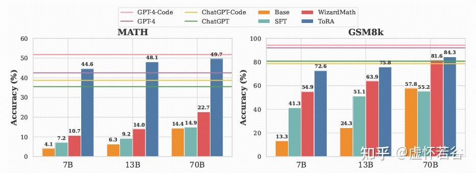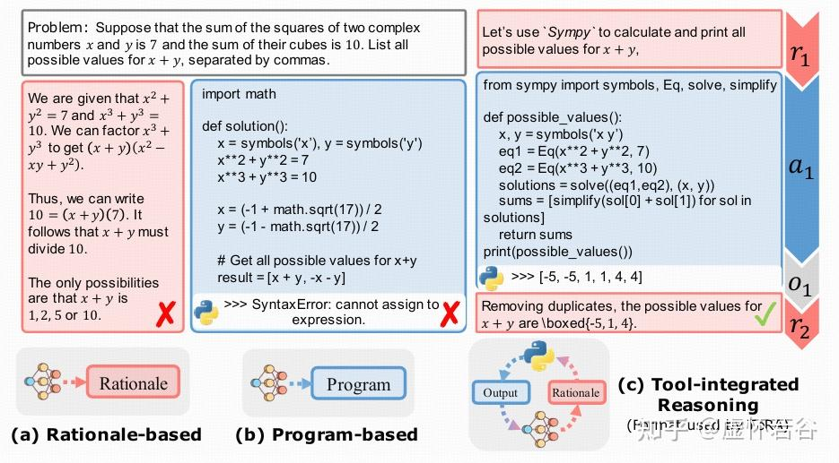

方法：

-   轨迹生成、模仿学习和输出空间整形。在轨迹生成阶段，研究者利用 GPT-4 生成高质量的工具使用轨迹，成功标注了 98.2% 的 GSM8k 问题和 83.1% 的 MATH 问题，形成了包含 16k 个样本的 ToRA-CORPUS 数据集。
-   通过模仿学习最小化负对数似然损失，让模型学习基本的工具使用模式。
-   通过输出空间整形技术，使用教师模型（如 34B 模型）纠正无效轨迹（枚举前缀，teacher重新生成），进一步提升模型的推理多样性和准确性。

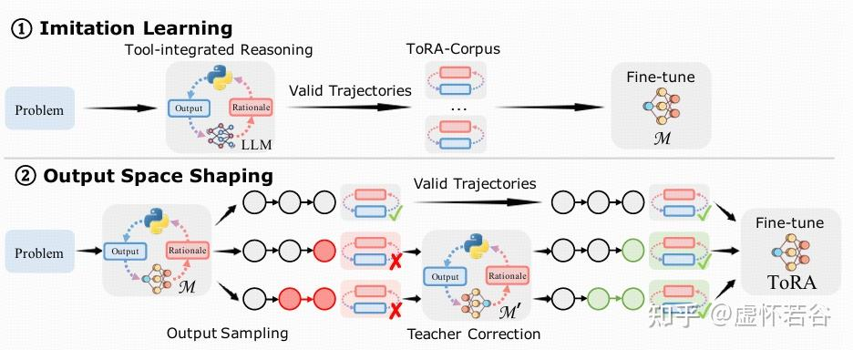

### **START: Self-taught Reasoner with Tools**

目前推理大模型LRM难题

-   幻觉：OpenAI o1、DeepSeek R1 等大推理模型通过**长思维链（Long CoT）** 实现自我修正、多策略探索等类人认知能力，但**完全依赖内部推理**，在复杂计算、符号推理中极易产生幻觉与计算错误；
-   数据：现有TIR 依赖高质量人工标注数据，无法适配长思维链模型的推理范式。
-   长思维链模型无法通过常规提示词自主调用代码工具；如何**零演示数据**激活模型工具潜能，同时融合 Long CoT 与 TIR，成为核心技术瓶颈。

方法核心

| Hint-infer（提示词推理激活）零数据激活工具能力 | Hint-RFT（提示词拒绝采样微调） |
| ----- | ----- |
| 提示词库（Hint-Library）定制领域专属提示词：数学场景聚焦复杂计算、逻辑校验、多方法探索；代码场景聚焦自我调试、测试用例验证；**智能插入策略**在推理转折词（Alternatively/Wait）后、结束符前随机插入提示词，不破坏原生推理逻辑，直接引导模型生成代码并调用解释器；附加价值天然支持测试时序列缩放：增加提示词插入轮次 = 延长模型思考时间，解题准确率线性提升，是轻量化推理增强方案。 | 自生成高质量工具调用数据集，完成模型冷启动：用 QwQ-32B-Preview + Hint-infer 生成推理轨迹；规则化打分、过滤重复轨迹、修正代码格式，构建D_seed种子数据集（10K 数学 + 2K 代码）；微调底座模型得到START-0，让模型习得自主工具调用范式。RFT 自蒸馏增强基于 START-0 进行 16 轮拒绝采样，生成多样化长 TIR 轨迹，构建D_START大规模数据集，二次微调得到最终START 模型，强化工具使用多样性与推理鲁棒性。 |

-   | Hint-infer（提示词推理激活）零数据激活工具能力 | Hint-RFT（提示词拒绝采样微调） |
    | ----- | ----- |
    | 提示词库（Hint-Library）定制领域专属提示词：数学场景聚焦复杂计算、逻辑校验、多方法探索；代码场景聚焦自我调试、测试用例验证；**智能插入策略**在推理转折词（Alternatively/Wait）后、结束符前随机插入提示词，不破坏原生推理逻辑，直接引导模型生成代码并调用解释器；附加价值天然支持测试时序列缩放：增加提示词插入轮次 = 延长模型思考时间，解题准确率线性提升，是轻量化推理增强方案。 | 自生成高质量工具调用数据集，完成模型冷启动：用 QwQ-32B-Preview + Hint-infer 生成推理轨迹；规则化打分、过滤重复轨迹、修正代码格式，构建D_seed种子数据集（10K 数学 + 2K 代码）；微调底座模型得到START-0，让模型习得自主工具调用范式。RFT 自蒸馏增强基于 START-0 进行 16 轮拒绝采样，生成多样化长 TIR 轨迹，构建D_START大规模数据集，二次微调得到最终START 模型，强化工具使用多样性与推理鲁棒性。 |
    
-   \="block" data-draft-type="table" data-size="normal" data-row-style="normal">| Hint-infer（提示词推理激活）零数据激活工具能力 | Hint-RFT（提示词拒绝采样微调） |
    | ----- | ----- |
    | 提示词库（Hint-Library）定制领域专属提示词：数学场景聚焦复杂计算、逻辑校验、多方法探索；代码场景聚焦自我调试、测试用例验证；**智能插入策略**在推理转折词（Alternatively/Wait）后、结束符前随机插入提示词，不破坏原生推理逻辑，直接引导模型生成代码并调用解释器；附加价值天然支持测试时序列缩放：增加提示词插入轮次 = 延长模型思考时间，解题准确率线性提升，是轻量化推理增强方案。 | 自生成高质量工具调用数据集，完成模型冷启动：用 QwQ-32B-Preview + Hint-infer 生成推理轨迹；规则化打分、过滤重复轨迹、修正代码格式，构建D_seed种子数据集（10K 数学 + 2K 代码）；微调底座模型得到START-0，让模型习得自主工具调用范式。RFT 自蒸馏增强基于 START-0 进行 16 轮拒绝采样，生成多样化长 TIR 轨迹，构建D_START大规模数据集，二次微调得到最终START 模型，强化工具使用多样性与推理鲁棒性。 |
    
-   ata-draft-nod**e="block**" data-draft-type="table" data-size="normal" data-row-style="normal">| Hint-infer（提示词推理激活）零数据激活工具能力 | Hint-RFT（提示词拒绝采样微调） |
    | ----- | ----- |
    | 提示词库（Hint-Library）定制领域专属提示词：数学场景聚焦复杂计算、逻辑校验、多方法探索；代码场景聚焦自我调试、测试用例验证；**智能插入策略**在推理转折词（Alternatively/Wait）后、结束符前随机插入提示词，不破坏原生推理逻辑，直接引导模型生成代码并调用解释器；附加价值天然支持测试时序列缩放：增加提示词插入轮次 = 延长模型思考时间，解题准确率线性提升，是轻量化推理增强方案。 | 自生成高质量工具调用数据集，完成模型冷启动：用 QwQ-32B-Preview + Hint-infer 生成推理轨迹；规则化打分、过滤重复轨迹、修正代码格式，构建D_seed种子数据集（10K 数学 + 2K 代码）；微调底座模型得到START-0，让模型习得自主工具调用范式。RFT 自蒸馏增强基于 START-0 进行 16 轮拒绝采样，生成多样化长 TIR 轨迹，构建D_START大规模数据集，二次微调得到最终START 模型，强化工具使用多样性与推理鲁棒性。 |
    

| Hint-infer（提示词推理激活）零数据激活工具能力 | Hint-RFT（提示词拒绝采样微调） |
| ----- | ----- |
| 提示词库（Hint-Library）定制领域专属提示词：数学场景聚焦复杂计算、逻辑校验、多方法探索；代码场景聚焦自我调试、测试用例验证；**智能插入策略**在推理转折词（Alternatively/Wait）后、结束符前随机插入提示词，不破坏原生推理逻辑，直接引导模型生成代码并调用解释器；附加价值天然支持测试时序列缩放：增加提示词插入轮次 = 延长模型思考时间，解题准确率线性提升，是轻量化推理增强方案。 | 自生成高质量工具调用数据集，完成模型冷启动：用 QwQ-32B-Preview + Hint-infer 生成推理轨迹；规则化打分、过滤重复轨迹、修正代码格式，构建D_seed种子数据集（10K 数学 + 2K 代码）；微调底座模型得到START-0，让模型习得自主工具调用范式。RFT 自蒸馏增强基于 START-0 进行 16 轮拒绝采样，生成多样化长 TIR 轨迹，构建D_START大规模数据集，二次微调得到最终START 模型，强化工具使用多样性与推理鲁棒性。 |
  
ft-type="table" data-s**ize="nor**mal" data-row-style="normal">| Hint-infer（提示词推理激活）零数据激活工具能力 | Hint-RFT（提示词拒绝采样微调） |
| ----- | ----- |
| 提示词库（Hint-Library）定制领域专属提示词：数学场景聚焦复杂计算、逻辑校验、多方法探索；代码场景聚焦自我调试、测试用例验证；**智能插入策略**在推理转折词（Alternatively/Wait）后、结束符前随机插入提示词，不破坏原生推理逻辑，直接引导模型生成代码并调用解释器；附加价值天然支持测试时序列缩放：增加提示词插入轮次 = 延长模型思考时间，解题准确率线性提升，是轻量化推理增强方案。 | 自生成高质量工具调用数据集，完成模型冷启动：用 QwQ-32B-Preview + Hint-infer 生成推理轨迹；规则化打分、过滤重复轨迹、修正代码格式，构建D_seed种子数据集（10K 数学 + 2K 代码）；微调底座模型得到START-0，让模型习得自主工具调用范式。RFT 自蒸馏增强基于 START-0 进行 16 轮拒绝采样，生成多样化长 TIR 轨迹，构建D_START大规模数据集，二次微调得到最终START 模型，强化工具使用多样性与推理鲁棒性。 |

  

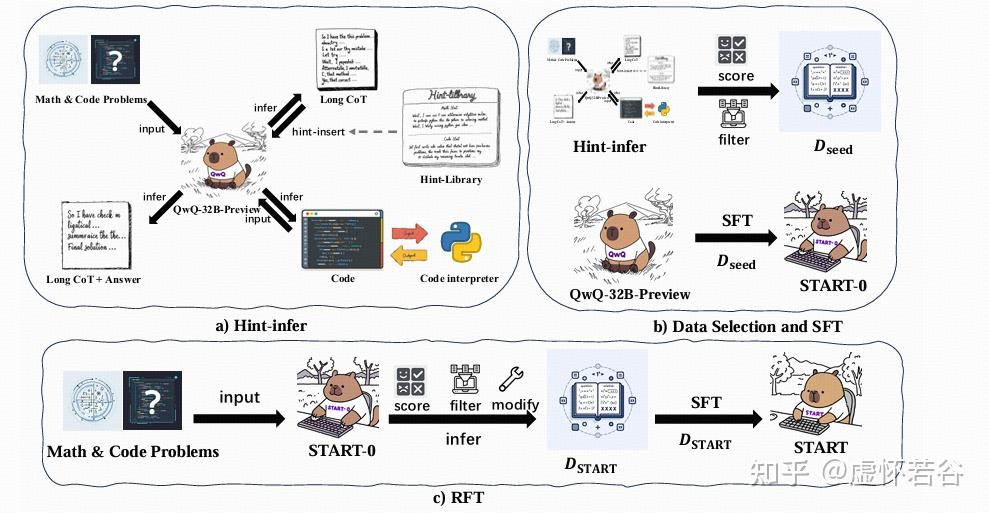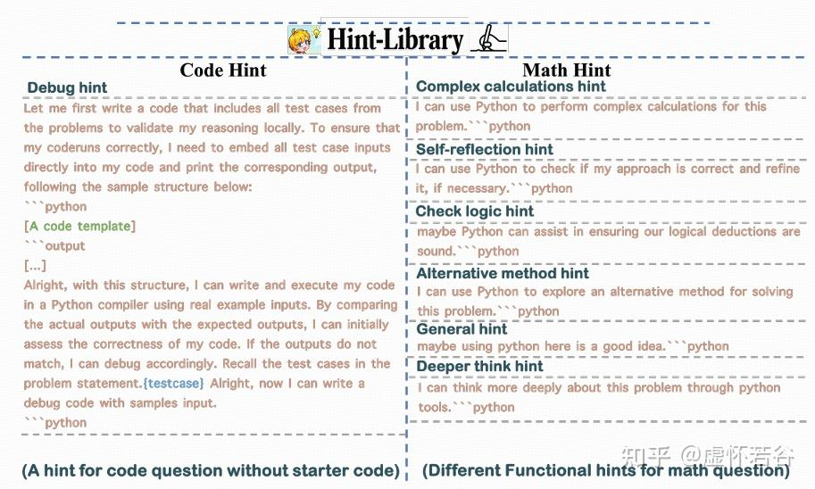

实验比较平庸，相对早期工作，这里不做太多分析。（纯 RFT 微调无工具集成几乎无性能增益，**工具调用能力是 START 性能跃迁的唯一核心原因**；Hint-infer 仅能小幅提升，微调是解锁模型潜能的关键。）

### **TORL:Scaling Tool-Integrated RL**

跟基础的SFT方法对比，效果显著提升。这是早期TIR研究的基本叙事。

TIR：enables models to invoke external tools by writing code, executing it through interpreters, and iteratively generating reasoning informed by code outputs.

（ToRA, MathCoder, and Qwen2.5-Math-Instruct-TIR： via **predetermined patterns** ）

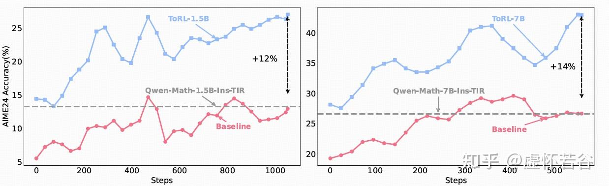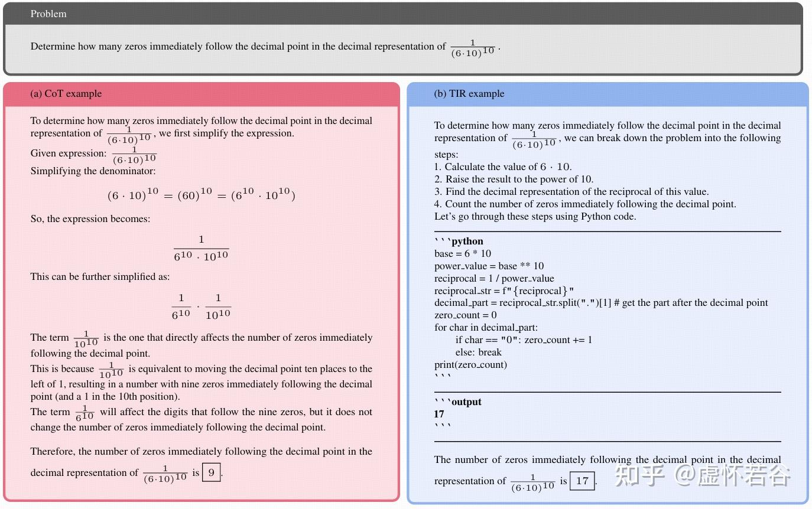

**TORL的3个关键发现**

| Code usage evolution | Self-regulation of ineffective code | Tool call frequency trade-offs |
| ----- | ----- | ----- |
| 随着训练进行，模型生成code解决问题的比例提高 | 模型学会了降低低效code的生成 | tool调用比例增加--reasoning提高--计算性能下降 |
| code的语法正确和可执行性提高 |  |  |

**TORL= TIR + RL**

TIR Rollout Framework如下：

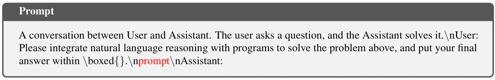

输出会被放到\`\`\`output\\nOBSERVATION\\n\`\`\`\\n 里面

实现细节：

| 设计点 | 内容 |
| ----- | ----- |
| Tool Call Frequency Control. | 又最大调用次数限制 |
| Execution Environment Selection. | 不用qwen-agent的code interpreter；使用Sandbox Fusion（延迟较高） |
| Error Message Processing. | 降低错误text长度，只选择最后一行（NameError: name ’a’ is not defined） |
| Sandbox Output Masking. | 避免模型memorize输出内容；提高模型工具调用能力 |

reward分数设计

| Answer Correctness Reward | Code Executability Reward |
| ----- | ----- |
|  | execution-based-penalty |

实验分析

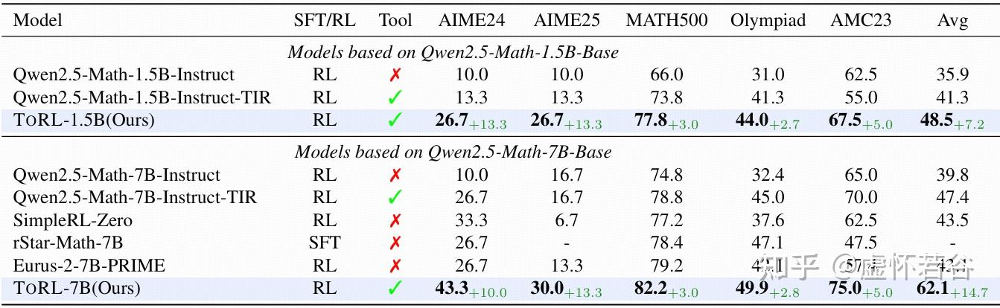

basline是没有tool-call的，这里证明了tool-call有用，且scaling-rl 训练很关键。

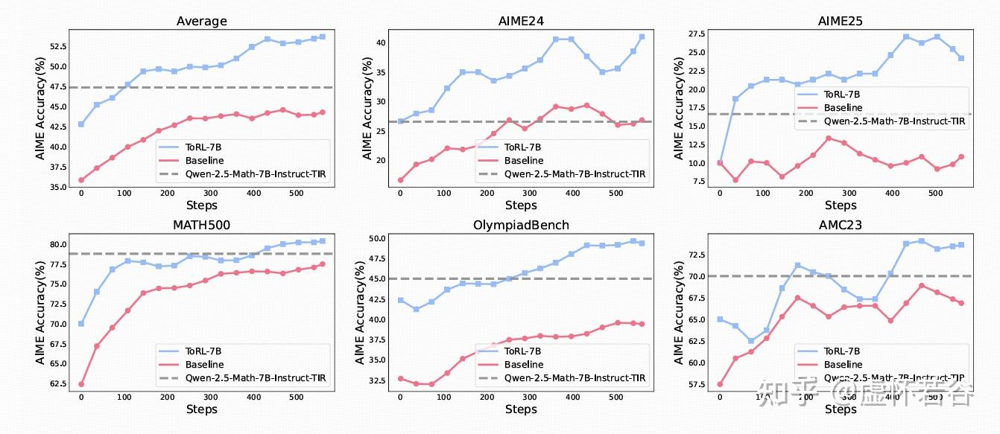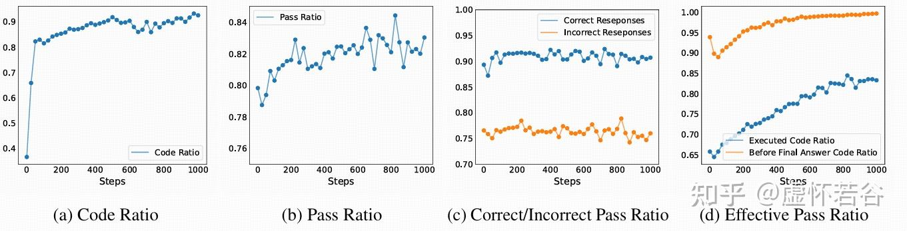

Case展示，模型学会了从error code恢复修改正确code的结果，学会了使用code验证结果。

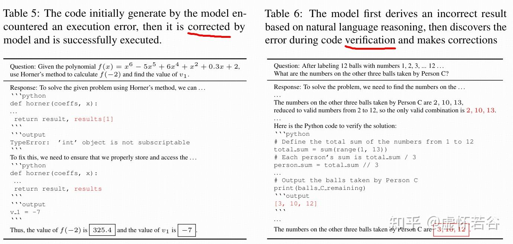

### **ReTool: Reinforcement Learning for Strategic Tool Use in LLMs**

文提出**纯结果驱动的 RL 范式**，让模型自主学习策略性工具调用，无需人工先验即可优化推理 - 工具协同策略。相比非TIR方案效果大幅度提高。

  

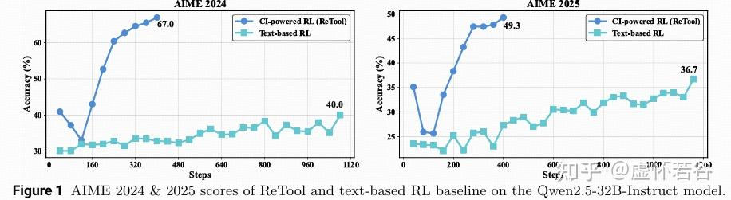

**方法核心**

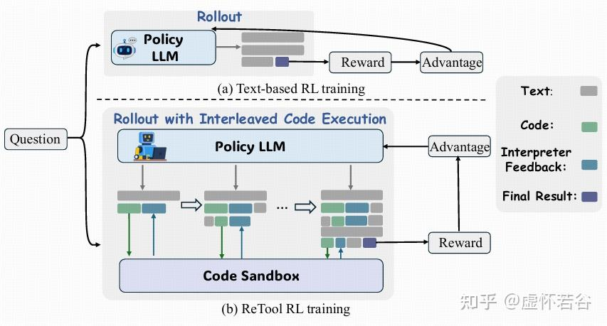

自动化冷启动 SFT（工具能力初始化）

-   **数据构建流水线**：基于开源数学推理数据集，通过**结构化提示模板**自动改写：将纯文本手动计算步骤替换为代码片段 + 解释器执行结果；
-   **双阶段校验**：格式校验保证代码语法合规、触发词统一，答案校验过滤错误样本，最终生成高质量**代码增强推理轨迹数据集**；
-   **训练目标**：让模型习得基础工具调用能力：何时调用代码、如何编写可执行代码、如何解读执行结果。

策略性工具调用强化学习（核心创新）

-   **算法基础**：基于 PPO 算法定制优化，**无 KL 惩罚**，最大化模型探索空间；
-   **极简结果奖励设计**：仅以最终答案正确性作为奖励（正确 + 1，错误 - 1），无代码执行度奖励，规避奖励黑客问题，倒逼模型自主探索最优工具策略；
-   **推理 - 代码动态交织 Rollou：**模型生成文本推理→触发代码块→沙箱异步执行→返回结果 / 报错→模型继续推理，形成闭环轨迹；**解释器反馈掩码**屏蔽外部 token 对损失的干扰，保障训练稳定；

**实验结论**

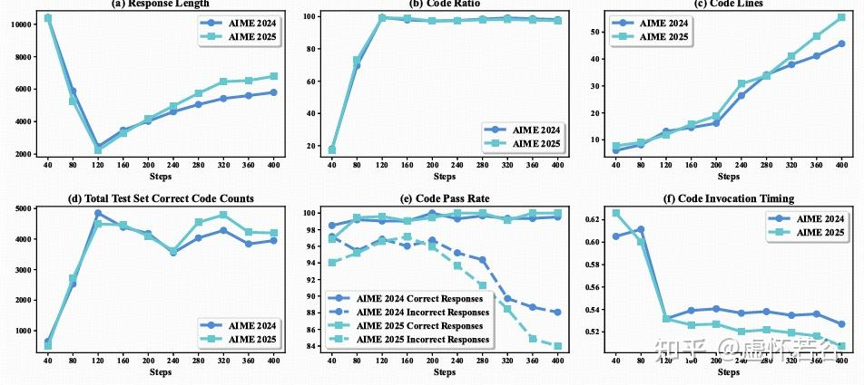| 推理效率大幅提升 | 工具能力全面进化 | 涌现代码自校正能力（Aha Moment） | 工具用途多样化 |
| ----- | ----- | ----- | ----- |
| RL 训练后，模型回复长度缩短40%，用简洁代码替代冗长文本计算，token 效率显著优化； | 代码调用覆盖率升至 98%、代码复杂度提升 5 倍、调用时机提前，模型从被动使用工具变为主动策略性调用； | 无专项训练下，模型可识别代码报错（如未定义函数），自主定位问题并重写可执行代码，具备元认知级别的调试能力； | 从单一计算扩展为计算、验证、枚举、排查多场景应用，泛化能力显著增强。 |

  

### ToolRL: Reward is All Tool Learning Needs

  

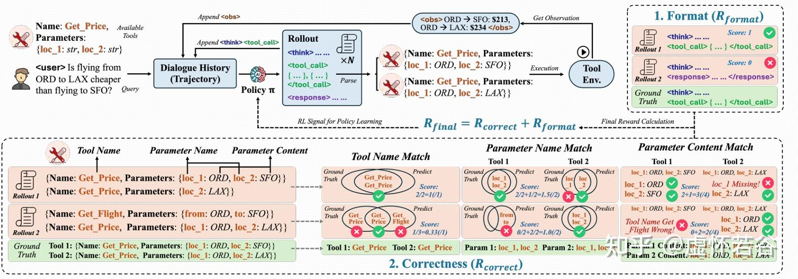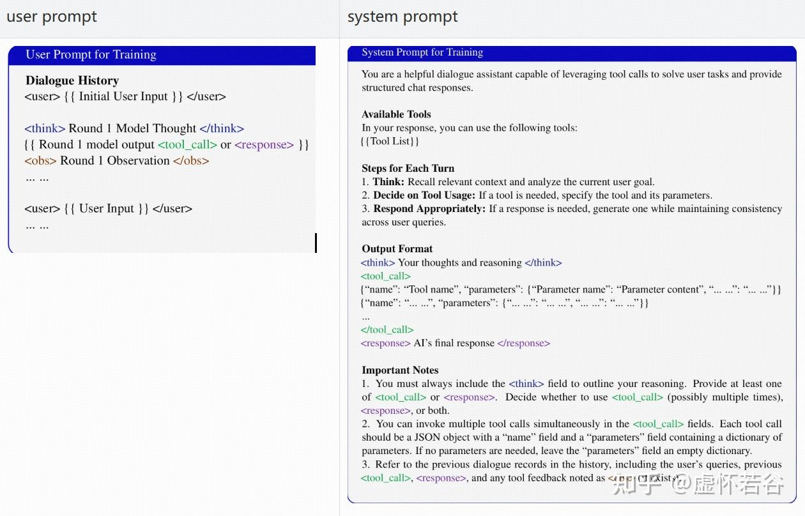

GRPO训练，奖励设计如下

| reward | 方式 | 说明 |
| ----- | ----- | ----- |
| format |  |  |
| name-correct |  | 对于正确性奖励基于更高的权重 |
| parameter-correct |  |
| p-content-correct |  |

长度奖励有害论；reward scale影响论；reward粒度精细更好论。

  

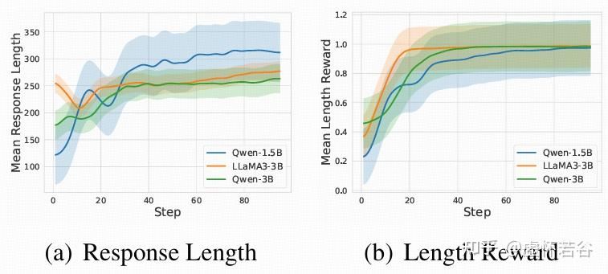

  

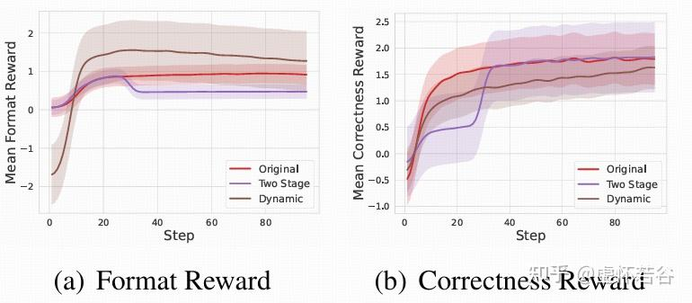

  

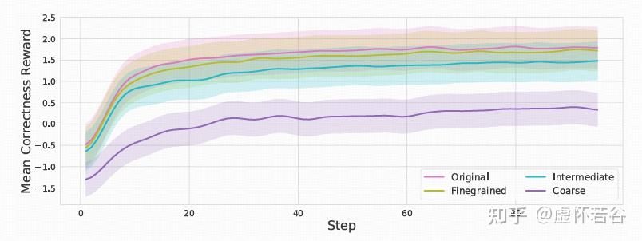

### **OTC: Optimal Tool Calls via Reinforcement Learning**

v2修订论文：Acting Less is Reasoning More! Teaching Model to Act Efficiently

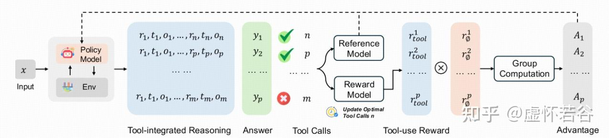| 传统tool-call rl | 本文思路 | 方案 |
| ----- | ----- | ----- |
| 过度工具调用：增加计算 / API 成本、延迟、推理开销认知卸载：模型过度依赖工具、弱化自身推理能力、泛化变差缺乏效率指标：只看 EM（精确匹配），不衡量 “每一次工具调用带来多少正确答案” | 对每个问题 q 和模型 M，存在一个最优工具调用次数 n（最小必要次数）：能得到正确答案的最少工具调用数；目标是让模型学习到用最少 m≈n 的工具调用，得到正确答案。 | 首次提出工具生产力（Tool Productivity, TP） 指标：TP = 正确答案数 / 总工具调用数，同时衡量效果与效率提出OTC-PO 通用框架：设计工具效率感知的奖励，兼容PPO/GRPO，轻量、即插即用实验验证：工具调用最多减少 73.1%，TP 提升229.4%，精度基本持平，大模型效果更显著 |
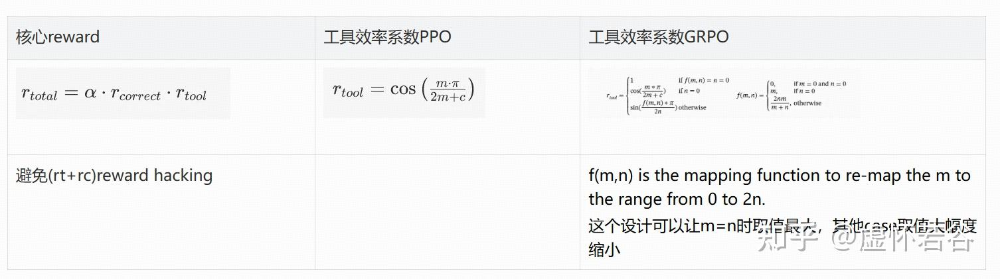

### **RAGEN:Understanding Self-Evolution in LLM Agents via Multi-Turn Reinforcement Learning**

基于StarPO实现StarPO-S：StarPO-S 是 StarPO 的稳定变体，融合了基于方差的轨迹过滤（保留高不确定性prompt）、去除 PPO 目标中的 KL 散度惩罚（鼓励模型探索）、采用非对称裁剪（允许模型从高奖励滚动中更积极学习）等技术，提升训练效果。

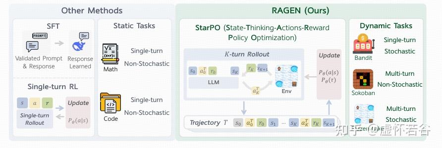

轨迹级的优化策略

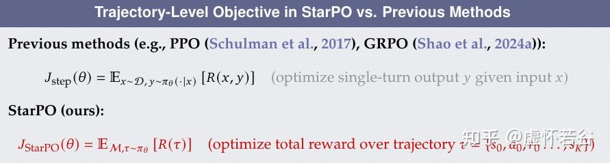| 核心发现 | 描述 |
| ----- | ----- |
| 单轮RL难以直接适用于多轮智能体RLSingle-turn RL may not be directly adapted to Multi-turn agent RL | 在使用StarPO框架对LLM智能体进行多轮RL训练时发现，直接沿用单轮RL方法（如PPO和GRPO），虽在训练初期能带来一定效果提升，但最终会导致模型性能崩溃。例如，在Bandit、Sokoban和Frozen Lake这三个实验环境中，多数StarPO运行实例在早期训练有进展，但随后性能急剧下降。PPO变体虽因有critic，相比GRPO能更长时间维持稳定性，但也无法阻止推理能力的退化，这凸显了多轮智能体RL训练需专门稳定策略的必要性。 |
| 模型崩溃呈现“回声陷阱(Echo Trap)”现象Model collapse in agent RL is reflected as "Echo Trap" over training | 深入分析模型崩溃原因，发现存在“回声陷阱(Echo Trap)”问题。在训练早期，智能体的推理丰富多样，能从不同角度思考问题；但随着训练进行，智能体逐渐依赖固定、重复的推理模式，导致轨迹多样性丧失，长期性能下降。以Bandit任务为例，训练初期智能体对不同选择有多种合理推理，而训练后期则反复选择单一选项，且推理过程简单重复，缺乏实质依据。 |
| 模型崩溃可通过指标提前预判Collapse follows similar dynamics and can be anticipated by indicators | 研究发现，可通过一些指标来预判模型崩溃。奖励标准差和输出熵在模型性能下降前会出现明显变化，可作为早期预警信号。当奖励标准差大幅下降，意味着模型的行为趋于一致，探索性降低；输出熵急剧减少，则表明模型的策略变得过度自信，推理路径变窄。而梯度范数的激增通常标志着模型进入不可逆的崩溃状态，此时模型参数对微小更新反应剧烈，难以恢复稳定。 |
| 过滤低方差轨迹提升训练效果Filtering low-variance trajectories improves stability and efficiency | 为解决多轮RL训练的不稳定性，提出StarPO-S方法，其中基于方差的轨迹过滤是关键改进。实验表明，训练时聚焦高方差prompt，能有效延迟或消除模型崩溃。在PPO运行中，对Frozen Lake任务，若保留75%的高方差轨迹，可将崩溃点从100步推迟到140步；若仅保留50%，则在训练期内可避免崩溃。同时，这种方法还能提高训练效率，如保留25%高方差轨迹时，总更新步数可减少一半，且不影响早期学习效果。 |
| 多因素影响训练轨迹质量Taskdiversity,actionbudget,androlloutfrequencyaffectrolloutquality | 训练轨迹质量对多轮RL训练效果至关重要，而任务多样性、行动预算和滚动频率是影响轨迹质量的关键因素。高任务多样性（即训练时使用多样的初始状态），配合适度的每个prompt响应数（如4个），能使模型接触更多决策场景，提升泛化能力；合适的action budget（如每轮5 - 6个行动），既能为智能体提供规划空间，又能避免因行动过多引入噪声；频繁的rollout更新（如采用Online-1策略，每步更新都使用新rollout的数据），能确保优化目标与当前策略行为一致，提高学习稳定性和效果。 |
| 精细奖励设计对推理至关重要Reasoning fails to emerge without meticulous reward design | 在研究推理在智能体训练中的作用时发现，虽然在单轮任务（如Bandit）中，推理有助于模型泛化，但在多轮任务（如Sokoban和Frozen Lake）中，若奖励信号仅关注最终结果，推理难以持续发展。即便通过结构化prompt引导推理，模型在训练中仍会逐渐减少推理，甚至出现推理与实际行为不匹配的情况。这表明，要使智能体在多轮环境中持续推理，需要设计精细的奖励信号，鼓励可解释的中间推理步骤。 |

### **Nemotron-Research-Tool-N1: Tool-Using Language Models with Reinforced Reasoning**

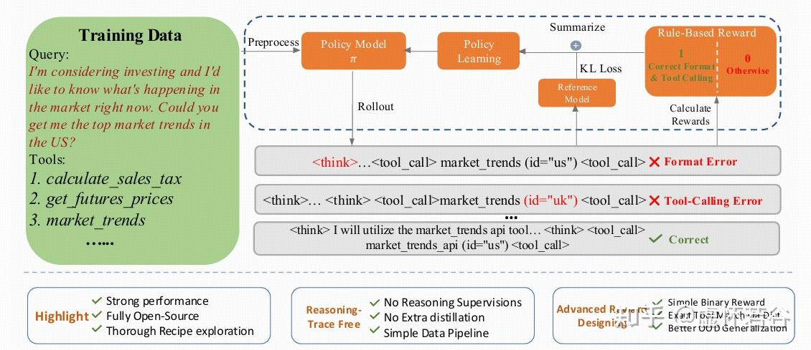

**整体方案和普通的agentic-RL没太大区别，但是有3个核心结论**

-   **纯 RL 最优**：常用 SFT-then-RL 范式并非最优，**纯 RL 无推理蒸馏数据即可超越所有组合方案**。
-   **规模效应**：模型越大，RL 训练增益越显著，**Qwen 基座效果优于 LLaMA 同规模模型**。
-   **奖励有效性**：**二元奖励**优于细粒度奖励，可避免奖励投机；**结构化推理格式**显著提升真实场景（Live）效果。

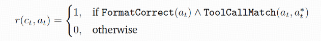

推理模板

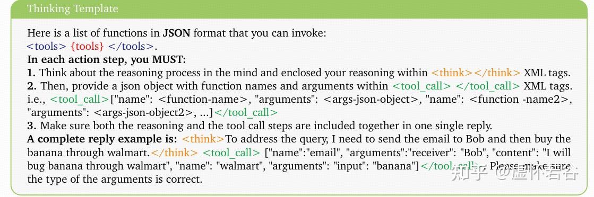

### **Agentic Reasoning and Tool Integration for LLMs via Reinforcement Learning**

  

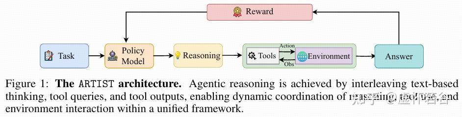

就是普通的agentic rl，根据episode outcome reward进行优化训练，tool输出mask掉。

任务面向

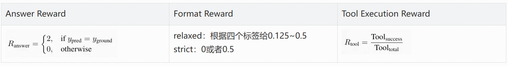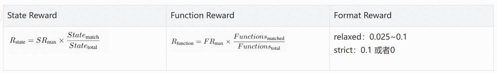

如下迭代算法步骤

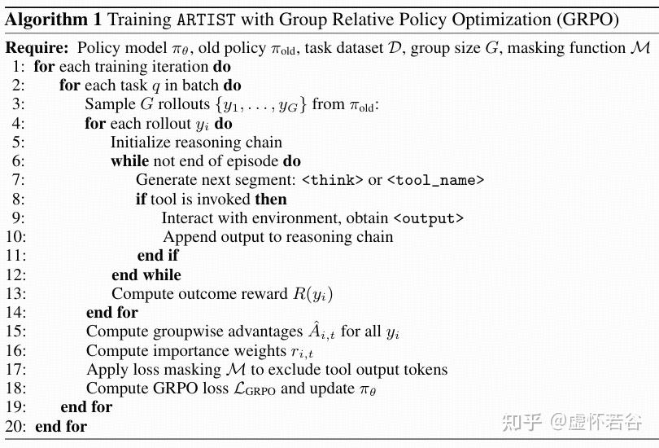

### **ZEROSEARCH: Incentivize the Search Capability of LLMs without Searching**

**真实搜索训练痛点**

-   **文档质量不可控（Uncontrollable Document Quality）**：搜索引擎返回内容噪声大，训练不稳定
-   **API 成本极高(Prohibitively high API costs)**：数十万次检索请求产生高额费用，限制规模化

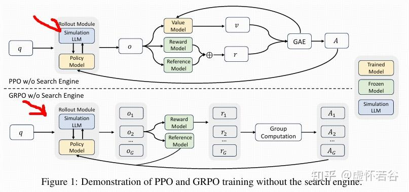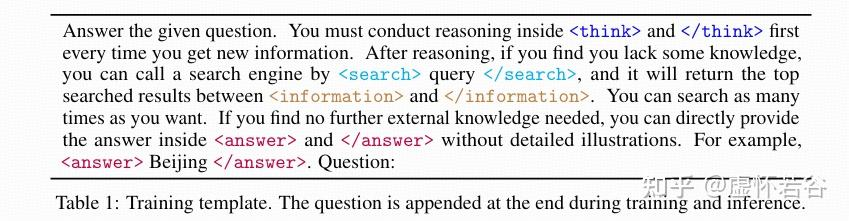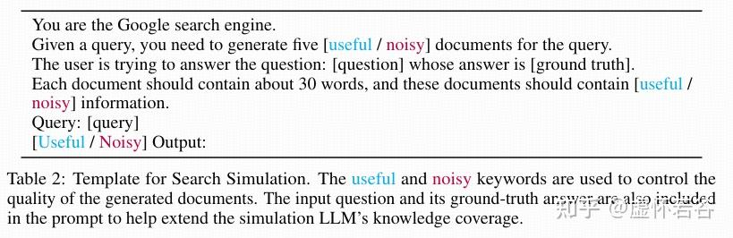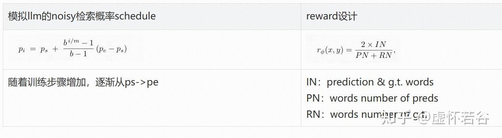

ZEROSEARCH consistently outperforms all baseline methods.

ZEROSEARCH surpasses methods that rely on real search engines.

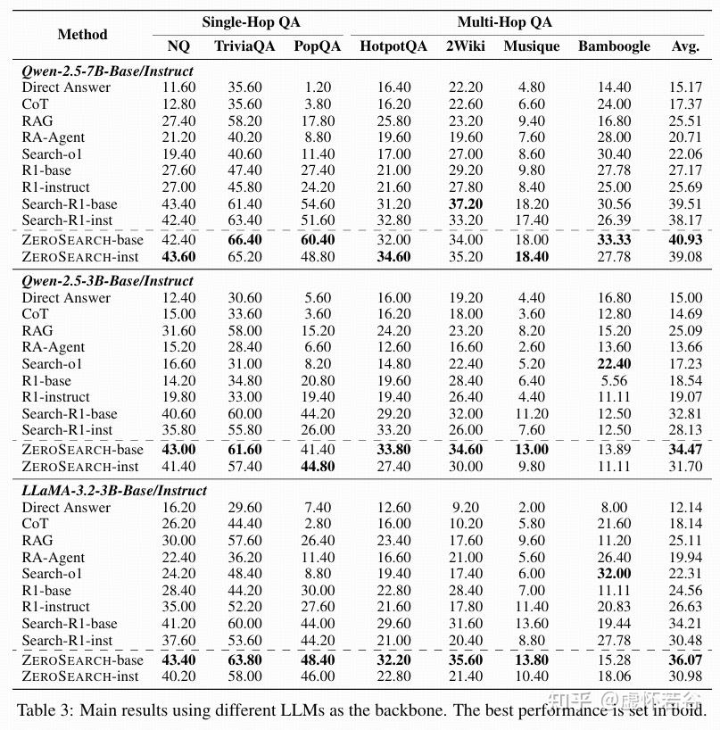

simulator LLM 的影响（SFT simulator很关键）

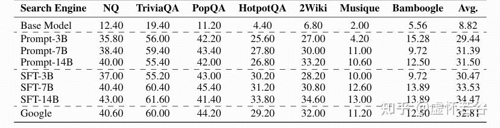

其他消融：

1.  **课程学习**：优于固定随机噪声，平均提升**~2%**
2.  **文档掩码**：关闭后平均下降**~1.5%**，训练波动增大
3.  **RL 算法**：REINFORCE > GRPO > PPO，平均**34.47% > 33.17% > 32.67%**

### **Agent RL Scaling Law: Spontaneous Code Execution for Mathematical Problem Solving**

发现scaling low for Agent RL:

-   **训练步数↑** → **代码执行频率↑**、**回复长度↑**、**最终准确率↑**，三者强正相关。
-   **最大工具调用数 Nmax↑** → 准确率提升（0→4 次增益显著，>4 次边际递减）。
-   **模型规模↑**（1.5B→7B→32B）→ 性能与代码效率同步提升。
-   **算法效率**：Reinforce++ 较 PPO**快约 300 步**收敛。

  

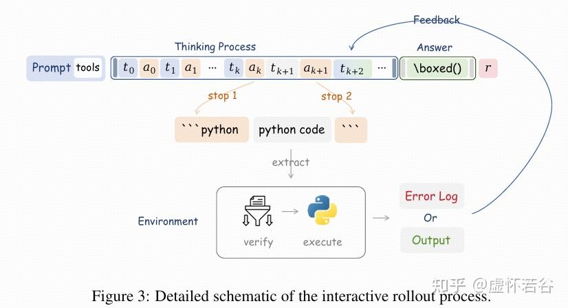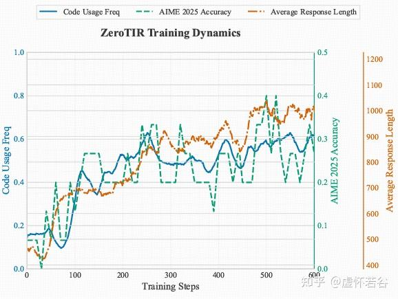

如下时case-study；典型的TIR

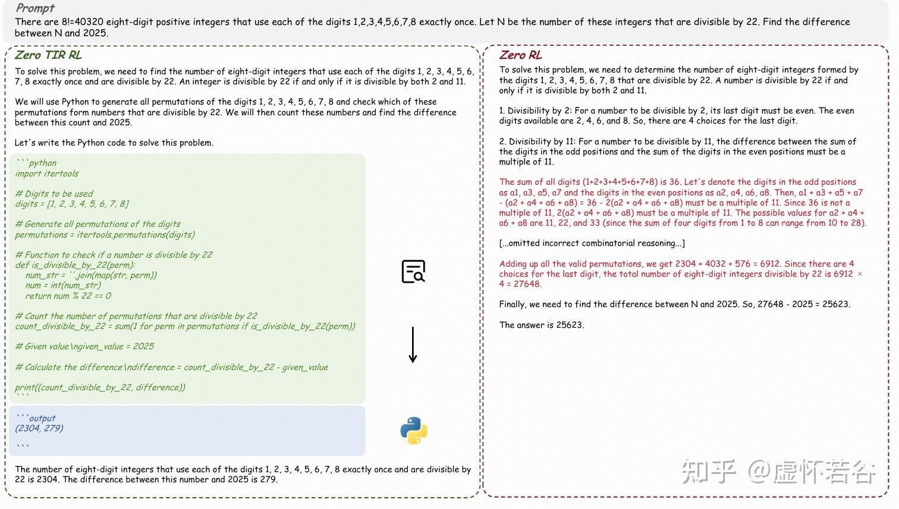

实验结果

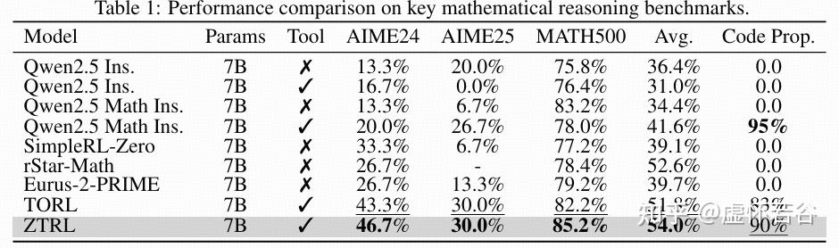

### **OPENTHINKIMG:Learning to Think with Images via Visual Tool Reinforcement Learning**

目前LVLM主要依靠文本COT解决数据问题，跟人类交互式视觉解决方法存在显著差异，本文主要解决视觉工具调用困难问题：

-   **工具接口异构**：同名工具（分割 / 定位）实现逻辑不统一，无标准化框架，复现性差；
-   **轨迹数据成本高**：工具调用训练数据依赖人工模板，规模小、泛化性弱；
-   **SFT 训练局限性**：静态监督微调仅能学习固定工具调用流程，无法动态适配新任务 / 新工具，缺乏探索能力。

方法核心：标准化tool center controller + SFT+V-toolRL

框架分为**工具集成层、分布式推理层、训练学习层**三大模块，支持**统一工具注册、分布式部署、SFT 冷启动 + RL 自适应训练**全流程。

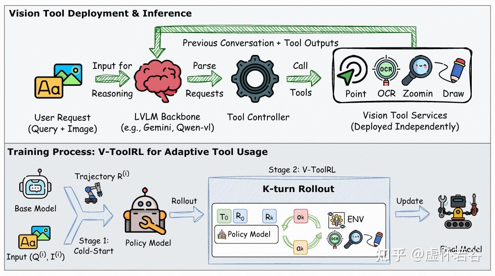

**标准化视觉工具集（10 类核心工具）**

统一输入输出接口，覆盖视觉推理全场景，是模型交互操作的基础;

**工具独立部署 + 中央控制器调度**

-   所有视觉工具以**容器化微服务**独立运行，支持弹性扩容、故障隔离；
-   **Tool Controller** 统一管理工具注册、请求解析、并行执行、结果聚合；
-   迭代式推理：LVLM 生成工具调用请求→控制器执行→结果回灌模型→多轮推理直至输出答案。

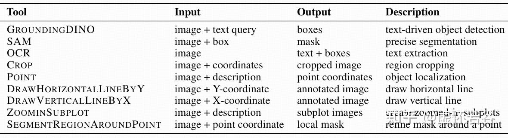

**两阶段训练范式（核心算法 V-TOOLRL）**

摒弃纯 SFT 训练，采用**冷启动 + 强化学习**的自适应训练方案：

**阶段 1：SFT 冷启动**

批量生成高质量工具调用轨迹，监督训练模型基础工具调用能力，优化交叉熵损失，为 RL 提供初始化策略。全自动生成数据流水线如下：

-   **动作规划**：用 GPT-4o 少样本生成工具调用符号化计划，过滤无效步骤；
-   **轨迹补全**：批量调用工具执行计划，自动对齐动作与输出，缓存并行加速；
-   **多级过滤**：JSON 格式校验 + 规则化逻辑校验 + 大模型打分 + 人工抽检，仅保留高质量推理轨迹。  
    个人看法，这个数据集交互密度很低，single-turn的，可能还是比较问题多。

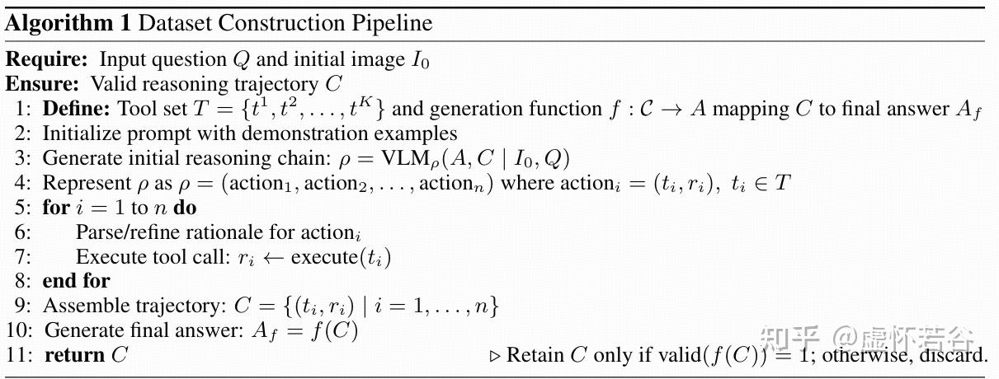

**阶段 2：V-TOOLRL 强化学习**

基于**GRPO（分组近端策略优化）** 适配视觉工具场景，核心设计：

-   K 轮轨迹采样：模型与工具环境交互，生成多组工具调用序列；
-   奖励函数：仅以**答案正确性**为终端奖励（正确 + 1，错误 - 1），避免奖励作弊；
-   自适应策略学习：模型自主探索工具调用时机 / 顺序，无需人工规则，泛化性拉满。

实验效果：

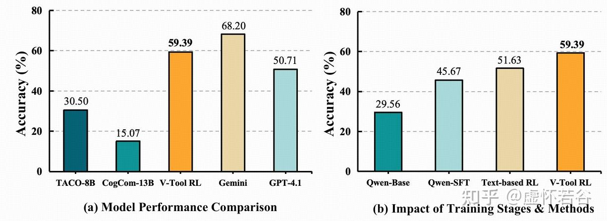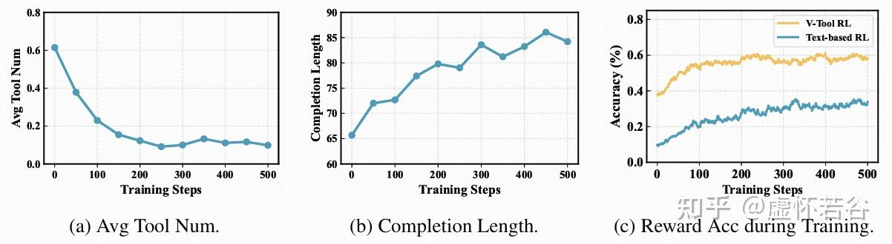

Case Study：主要面向charVQA问题

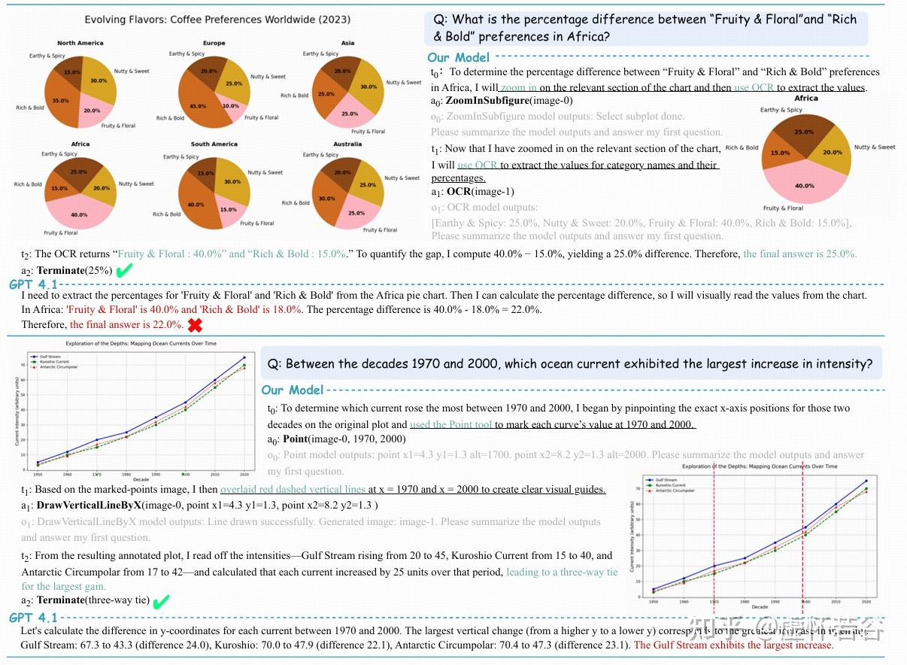

### **Group-in-Group Policy Optimization for LLM Agent Training**

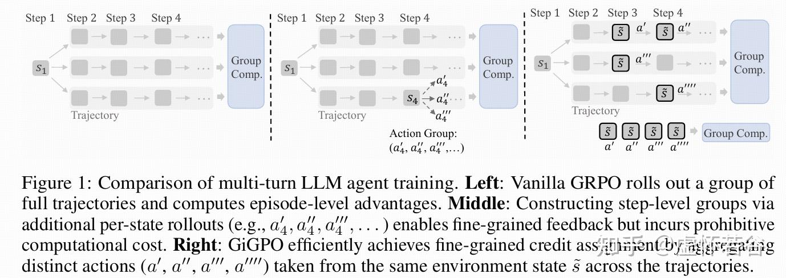

针对每个step进行rollout过于消耗算力；本文基于action进行聚合。保留分组 RL 优势的同时，实现**细粒度步级信用分配**。

-   **Episode 级宏观优势 Aᴱ**：对完整轨迹分组，基于总回报归一化计算，捕捉全局轨迹质量。
-   **Step 级微观优势 Aˢ**：提出**锚点状态分组**，回溯轨迹中重复环境状态，将同状态动作归为一组，基于折扣回报计算局部优势。

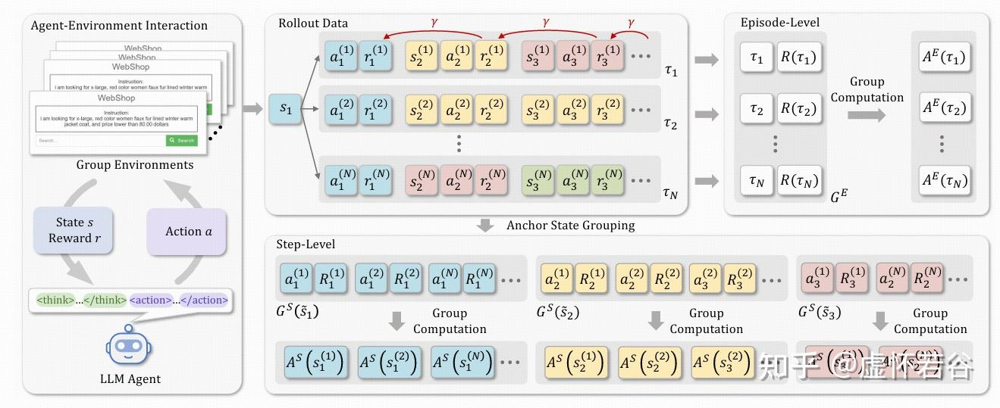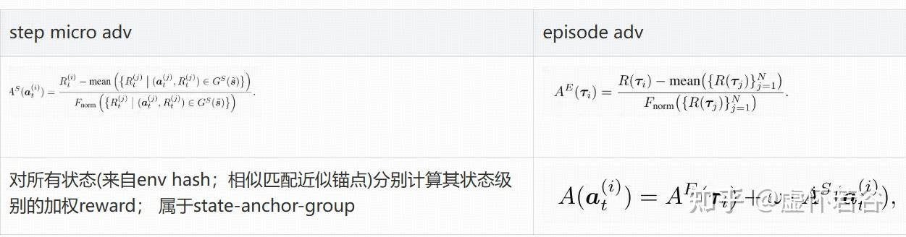

实验结果

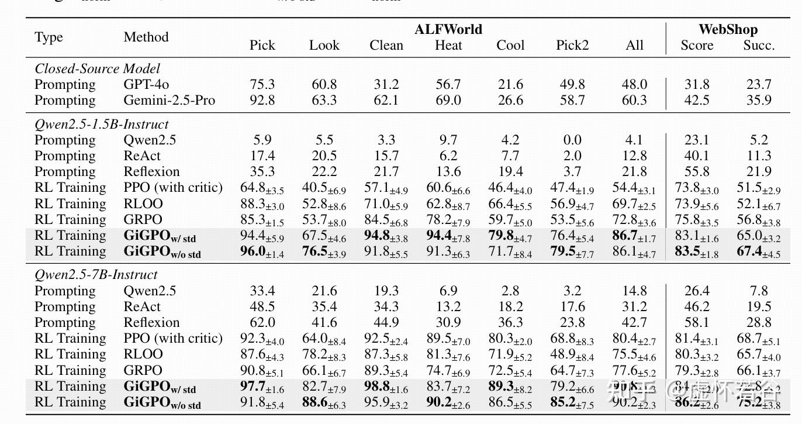

### **SPA-RL: Reinforcing LLM Agents via Stepwise Progress Attribution**

本文针对大模型智能体强化学习中稀疏延迟奖励导致的信用分配难题，提出Stepwise Progress Attribution（SPA） 奖励重分配框架，通过训练进度估计器将最终任务奖励分解为逐步贡献值，并结合环境执行 grounding 信号构造稠密中间奖励，基于 PPO 训练智能体，在WebShop、ALFWorld、VirtualHome三大基准上平均成功率提升 **+2.5%、定位准确率提升+1.9%**，实现长程任务 SOTA 性能。

  

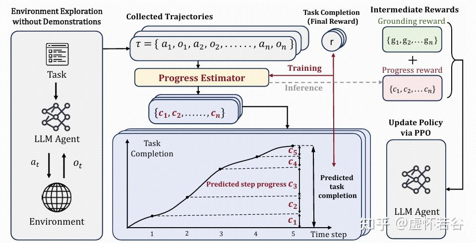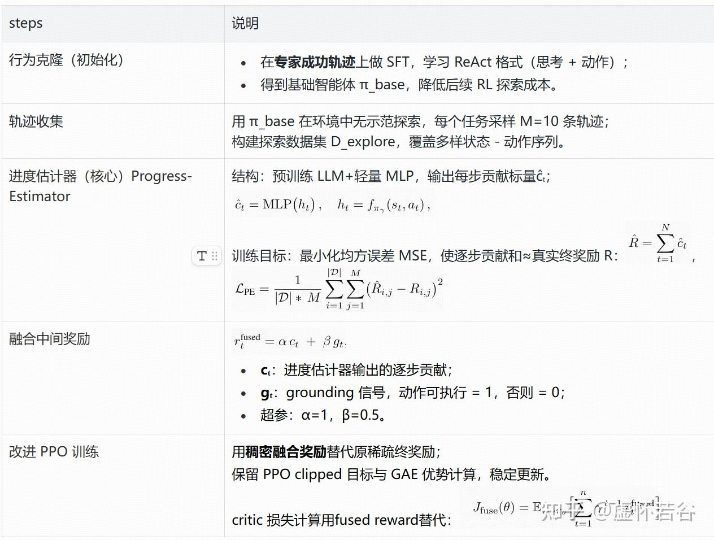

实验结果

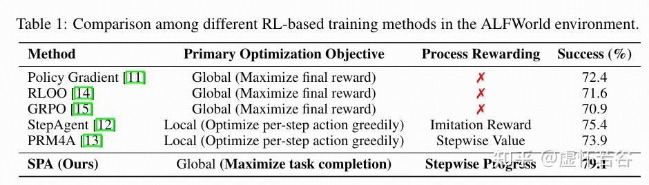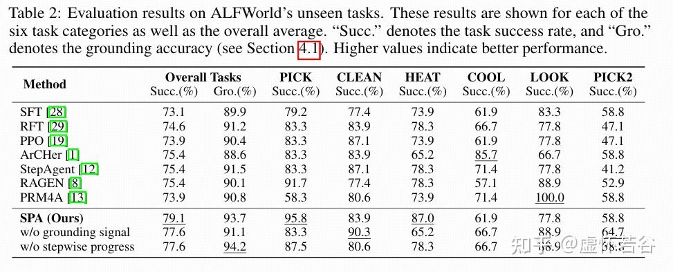

### **ARPO：Agentic Reinforced Policy Optimization**

大模型调用工具后**token 熵值骤增、行为不确定性升高**的问题，设计**基于熵的自适应展开机制**与**优势归因估计**，在**13 个**数学推理、知识推理、深度搜索基准任务上，仅用传统轨迹级 RL 算法**一半工具调用预算**就实现更优性能，显著提升大模型智能体多轮工具交互与长程推理能力.

关键发现：

-   工具调用后**前 10-50 个 token**熵值急剧升高，模型行为不确定性大幅提升；
-   搜索引擎反馈带来的不确定性**高于 Python 代码解释器**；
-   早期推理阶段熵值低于工具调用后的熵值。

方法：

-   初始化：先做 N 条全局轨迹采样，预留 M-N 条预算用于分步采样；
-   熵监控：计算工具调用后 token 熵变化 ΔHₜ，作为分支依据；
-   自适应分支：熵变化超阈值则触发 Z 条局部路径分支，否则继续原轨迹；
-   终止条件：达到采样预算或所有路径完成，计算复杂度从 O (n²) 降至 O (nlogn)~O (n²)。

  

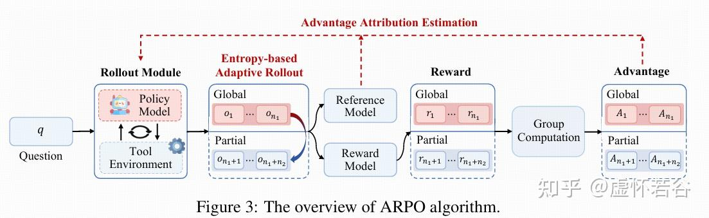

  

核心组件：

-   硬优势：共享 token 分配平均优势，分支 token 分配独立优势；
-   软优势：基于 GRPO，通过重要性采样r\_{i,t}隐式区分共享 / 独立 token，**训练更稳定、奖励更高**，为 ARPO 默认方案。\[实现简单\]

  

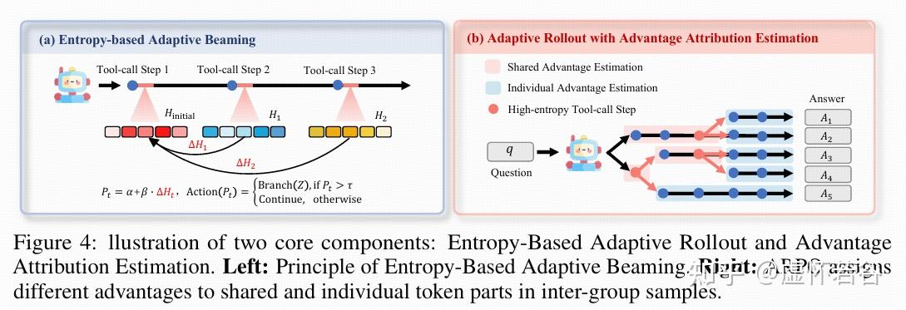

  

  

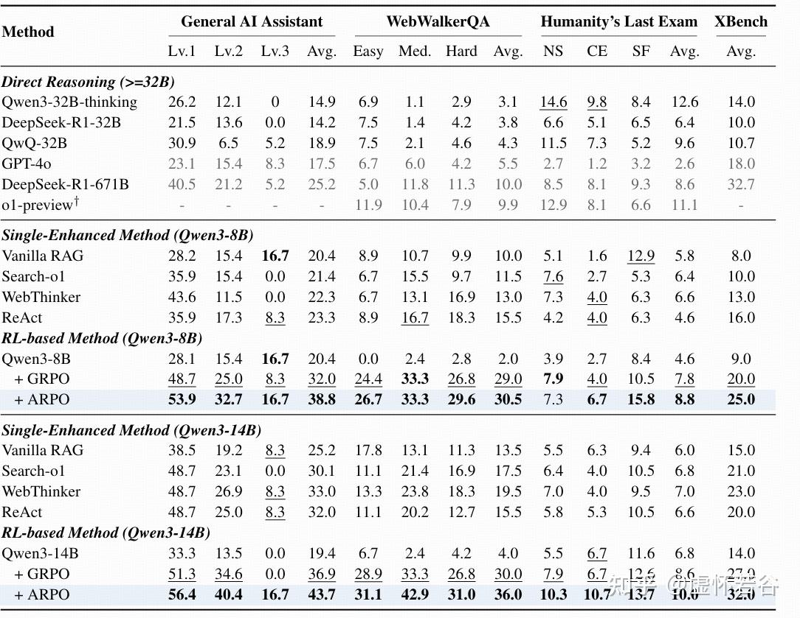

### **SimpleTIR: End-to-End Reinforcement Learning for Multi-Turn Tool-Integrated Reasoning**

本文针对**多轮工具集成推理（TIR）** 强化学习训练中**梯度爆炸、训练不稳定、性能崩溃**的行业痛点，提出**即插即用的轨迹过滤算法 SimpleTIR**，无需监督微调（SFT）冷启动，纯 Zero RL 训练即可稳定训练并刷新数学推理基准 SOTA。

  

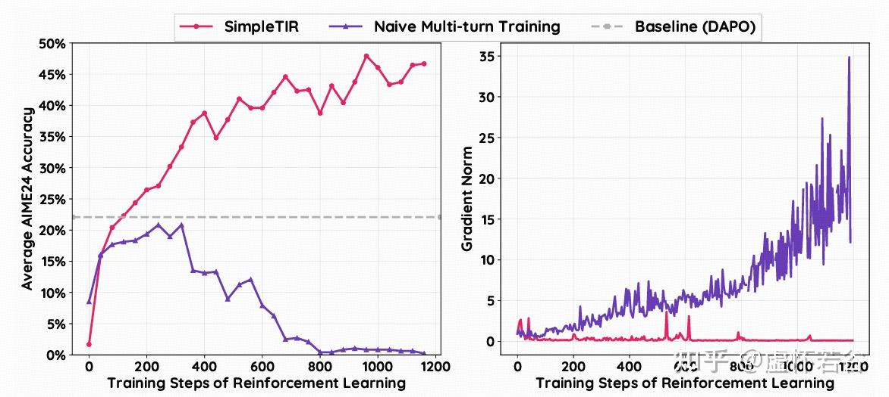

  

multi-turn TIR的严重不稳定问题：

1.  **分布漂移**：外部工具反馈（如代码执行结果）偏离模型预训练分布，诱导模型生成**极低概率 token**；
2.  **梯度爆炸**：低概率 token 会让重要性采样比无限放大，结合多轮反馈循环，梯度范数剧烈飙升，训练崩溃；
3.  **信用分配错位**：稀疏终端奖励无法区分有效推理与无效轮次，惩罚正常步骤，模型退化为单轮推理；
4.  **现有方案缺陷**：SFT 冷启动会限制模型推理多样性，token 概率过滤、梯度裁剪等启发式方法无法解决根本问题。

方法：

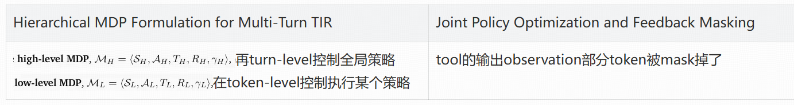

根据如上定义和梯度分析，认为崩溃来源：

-   梯度范数与**token 生成概率负相关**，低概率 token 会直接触发梯度尖峰；
-   多轮反馈会**累积分布漂移**：首轮工具反馈污染后续生成，轮次越靠后 token 概率越低，最终生成无意义内容；
-   定义**无效轮次（Void Turn）**：模型响应既无完整代码块、也无最终答案，是低概率 token 的直接产物，也是训练不稳定的核心标识。

  

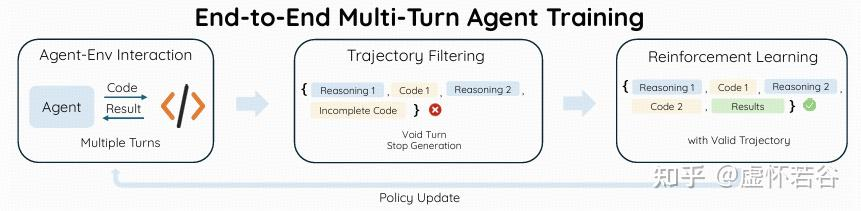

\*\*解决核心就是数据过滤\*\*：

**过滤含无效轮次的完整轨迹**，将其从策略更新中剔除，从源头阻断高幅值有害梯度，同时修正信用分配问题。

-   任意一轮响应无完整代码
-   无最终答案

实验结论：

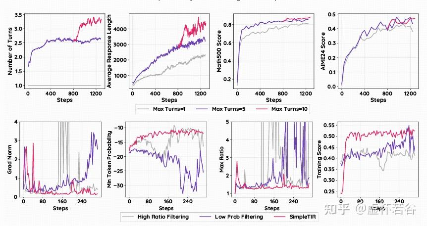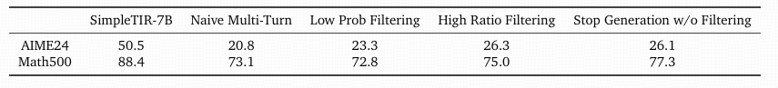

梯度范数全程平稳无尖峰，训练曲线单调上升，支持 5~10 轮多轮交互，轮次越多性能越强。

-   无效轮次过滤是**唯一核心增益**：低概率 token 过滤、高权重比过滤均无法解决梯度爆炸，性能远低于 SimpleTIR；
-   仅终止无效轮次不过滤轨迹：信用分配问题仍存在，性能大幅下降；
-   多轮交互收益：5 轮交互显著优于单轮，10 轮进一步提升复杂任务性能。

推理模式自主涌现

无 SFT 约束下，SimpleTIR 自发涌现三大高阶推理能力，频率远超 SFT /ReTool冷启动模型。

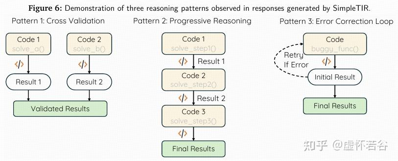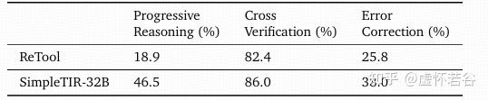

-   **交叉验证**：多组代码互验结果，准确率 86.0%；
-   **渐进式推理**：分步拆解问题，频率 46.5%（SFT 模型仅 18.9%）；
-   **自我纠错**：迭代调试代码错误，频率 38.0%。

### **SkyRL：**SKYRL-AGENT: EFFICIENT RL TRAINING FOR MULTI-TURN LLM AGENT

[SkyRL-v0: Train Real-World Long-Horizon Agents via Reinforcement Learning](https://link.zhihu.com/?target=https%3A//novasky-ai.notion.site/skyrl-v0%231ec8f0016b9d8002b700fd5431e48fc6)

这个是一个开源框架，基于verl和openhands(agent)实现的swe-agent rl训练框架.

**工具中心化 Agent 循环**、**细粒度异步 Pipeline 调度器**、**多后端兼容桥接层**三大核心组件，实现了较传统异步批处理**1.55 倍**的生成速度提升与稳定 90% 的 GPU 利用率；

基于该框架训练的**SA-SWE-32B 软件工程 Agent**，在 SWE-Bench Verified 基准上实现**39.4% Pass@1**的同规模开源模型最优性能，训练成本较同性能的 DeepSWE 模型降低超 2 倍，同时在终端操作、网页浏览、深度研究等跨领域 Agent 任务中展现出优秀的泛化能力，还可无缝兼容 SkyRL-train、VeRL、Tinker 等主流 RL 训练后端，支持深度研究、内存管理、计算机使用等多类 Agent 的快速落地与训练。

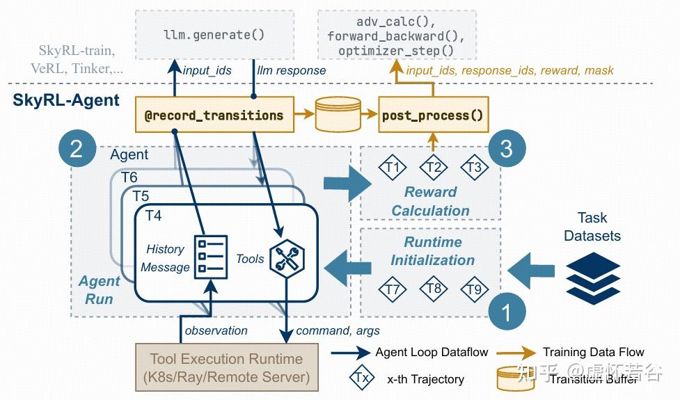

跨后端跨agent的高通用性与扩展性

| 工具中心化 Agent 循环 | 细粒度异构调度器 | 训练后端桥接层 |
| ----- | ----- | ----- |
| 统一的状态管理极简的任务集成内置错误处理机制 | 将每条 Agent 轨迹拆解为运行时初始化、Agent 执行、奖励计算三个独立阶段 | 核心基于Transition-based 的轨迹记录设计:解决推理 - 训练引擎不一致；支持动态上下文修改、多智能体系统等复杂场景，突破了传统 mask-based 方法的场景限制；输出统一的后端无关中间数据格式； |

针对SWE任务地优化方法：

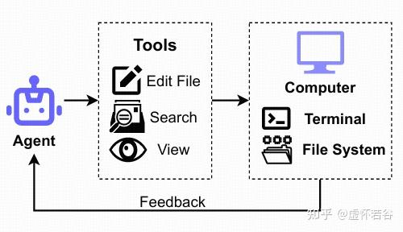| AST-based 结构化搜索工具 | 结构化恢复提示 | 适配的 RL 算法设置 |
| ----- | ----- | ----- |
| 支持模糊匹配与结构模式搜索，在搜索结果中补充上下文提示引导精准查询，解决了 Agent 过度依赖文件查看、上下文浪费的问题，大幅提升 rollout 的 Pass@K 与样本效率。 | 针对 Agent 卡死、重复无效动作、工具调用错误等问题，注入结构化提示词引导 Agent 回归有效轨迹，提升了有效轨迹占比，稳定了 rollout 收集过程。 | 采用纯 on-policy 训练，留一法优势估计，关闭 KL 与熵损失；对超限终止的轨迹做梯度掩码，避免模型学习无效行为。 |

实验效果

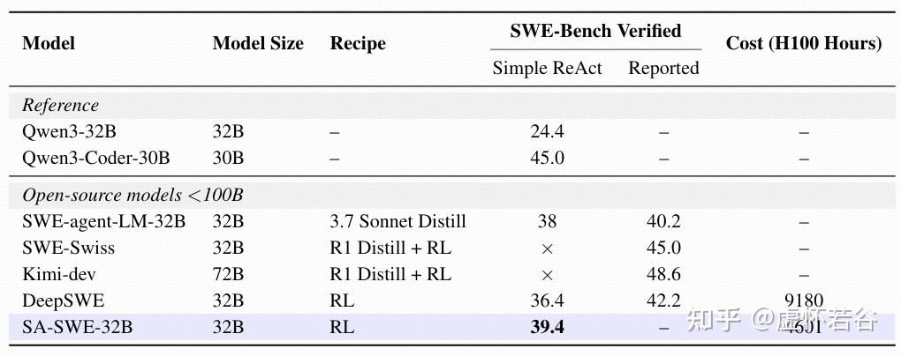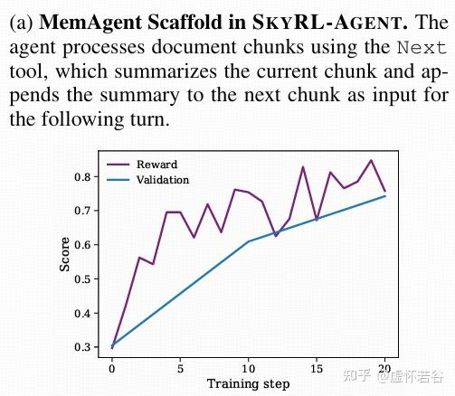

### **ASTER: Agentic Scaling with Tool-integrated Extended Reasoning**

目前TIR容易出现崩塌

-   模型在 RL 训练中无法维持多轮工具调用，退化为**浅层内部推理 + 事后代码验证**，丧失真正的工具驱动规划能力**；**
-   零监督冷启动（ZeroTIR）存在训练不稳定、梯度爆炸、无法习得新能力等问题，传统监督微调（SFT）冷启动则因轨迹交互稀疏引入强归纳偏置，加剧崩塌。
-   之前的retool工作也做了类似的事情，但是由于其交互密度过低，不一定表现很好

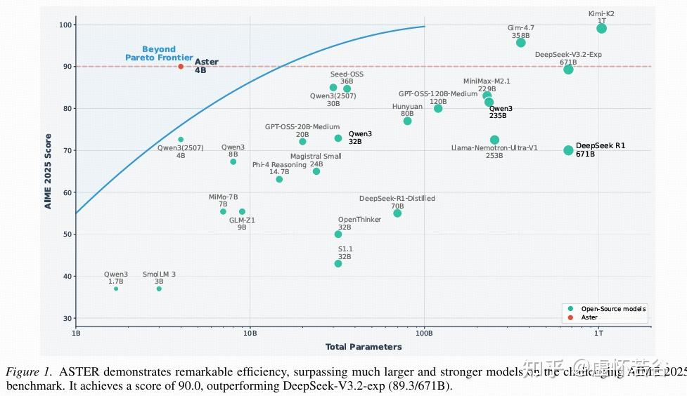

方法：

**高交互密度冷启动 SFT**

摒弃传统稀疏工具调用轨迹，筛选**单轨迹≥9 次工具交互**的 4K 条专家级轨迹构建冷启动数据集（远优于 ReTool、DemyAgent 的 1-2 次调用稀疏轨迹）。该设计构建高熵行为先验，保留模型 RL 阶段的探索能力，避免过早收敛到短视策略。

**多阶段 RL 课程训练**

-   阶段 1：18K 上下文长度，优化基础工具调用效率，过滤冗余调用；
-   阶段 2：扩容至 32K 上下文，聚焦高难度样本，强化长程推理与多轮工具协同；
-   样本筛选：移除训练中全正确的简单样本，集中算力优化难例。

实验核心部分（交互密度scaling）

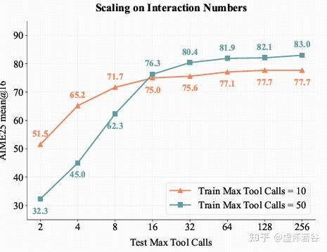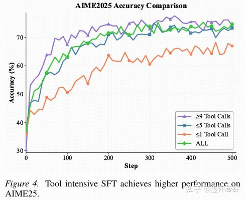| **交互密度决定性能上限**（核心结论） | 小模型碾压大参数量基线 | 训练动态特征 | 规模效率差异 |
| ----- | ----- | ----- | ----- |
| ≥9 次工具调用的 4K 冷启动轨迹，训练熵更高、探索性更强，AIME2025 精度显著优于稀疏轨迹子集，验证高交互密度是规避崩塌的核心。 | ASTER-4B 在 90K 推理预算下，AIME2025 准确率达90.0%，超越 671B 参数量的 DeepSeek-V3.2-Exp；全面领先 235B 的 Qwen3 大模型，实现参数量效率极致突破。 | SFT 后模型精度短期下降，RL 训练中逐步恢复并大幅超越基线；工具调用量先降后升，模型从冗余调用进化为高效、策略性多轮工具协同。 | 1.7B 小模型依赖更多工具调用完成推理，4B 模型可通过更简洁的推理路径、更少的工具调用实现同等性能，参数量提升显著优化工具使用效率。 |

### **WIDESEEK-R1: Exploring Width Scaling for Broad Information Seeking via Multi-Agent Reinforcement Learning**

本文提出**WIDESEEK-R1**，基于**多智能体强化学习（MARL）** 的**主 - 子智能体框架**，探索大模型信息检索的**宽度缩放（Width Scaling）** 能力，通过**主智能体任务分解**与**子智能体并行执行**解决单智能体上下文污染与串行低效问题；构建**20k**大规模广域信息检索任务数据集，以**Qwen3-4B**为基座实现**40.0%的 WideSearch 项目 F1 分数，性能对齐DeepSeek-R1-671B**，且随并行子智能体数量增加**持续增益**，验证宽度缩放的有效性。

wideseek核心架构

-   **主智能体**：仅使用`call_subagent`工具，负责**任务分解**与并行调度，上下文隔离避免污染。
-   **子智能体**：并行执行，配备`search`+`access`工具，独立完成子任务信息检索。
-   **共享基座**：共用 Qwen3-4B，参数同步更新，上下文相互隔离。

目前研究的局限

-   **缩放范式局限：**现有大模型智能体聚焦**深度缩放**（单智能体多轮思考 / 工具调用），在广域多实体信息搜集任务中存在瓶颈。
-   **单智能体缺陷**

-   **上下文污染**：多子任务信息混杂，推理质量下降
-   **串行执行**：独立子任务顺序处理，效率极低

-   **多智能体不足：**依赖人工工作流、轮流交互，无法**并行执行**与**端到端学习**。

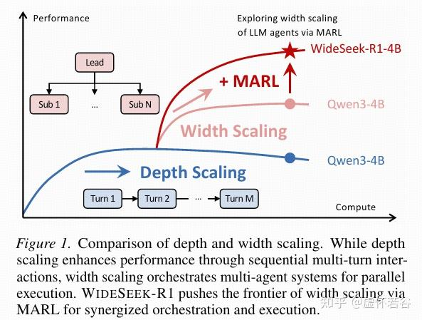

  

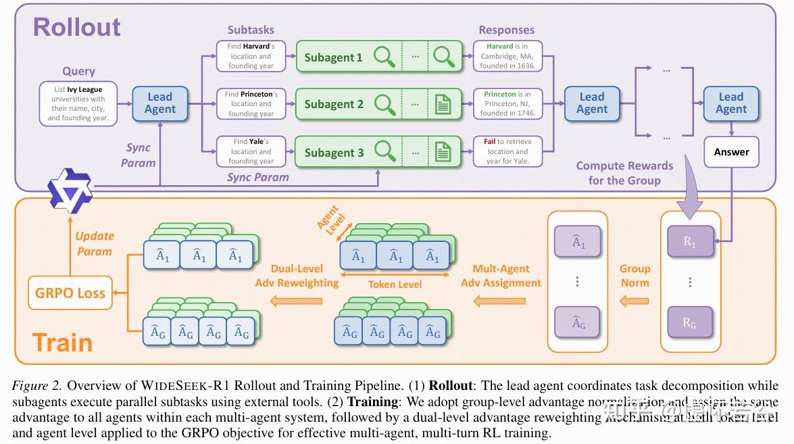

同组所有智能体共享**归一化优势值**，避免复杂信用分配与奖励作弊。其中引入了token/agent-level的优势加权，避免reward-hacking。

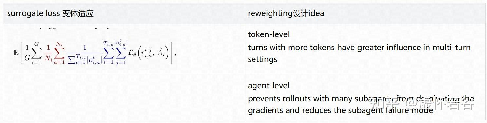

**训练数据集构建方法**

这个数据集 **不是给普通 QA 用的，是专门给「宽度缩放 / 多智能体信息搜集」用的**。

硬性要求

-   **Query 都强制要求表格输出**
-   **Answer 都是结构化、多实体、广覆盖**
-   **Unique Columns 用于行匹配，乱序不影响评分**
-   **全部由自动化流水线生成，无人工标注**

数据形式

-   **所有答案 = Markdown 表格**
-   **所有查询 = 明确要求输出表格**
-   **所有评估 = 基于表格单元格 / 行匹配**
-   **所有任务 = 广域多实体信息搜集 → 必须生成表格**

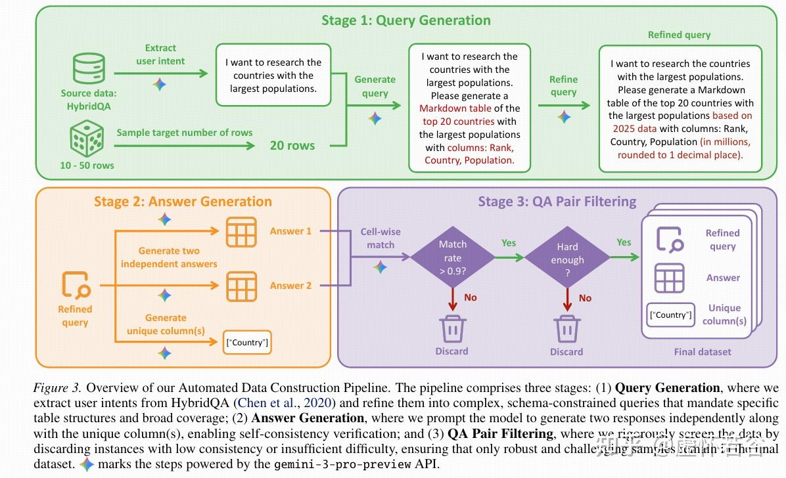

search-wide-scale数据构建目标

-   现有 QA 数据集都是**深度型**（单实体、多跳推理），不适合**宽度型**任务（多实体、表格生成、大范围搜集）。
-   广域搜索数据集规模太小、人工标注太贵，**无法支撑 MARL 训练**。

| Query Generation | Answer Generation | QA Pair Filtering |
| ----- | ----- | ----- |
| 从原始数据中提取用户意图 → 生成约束严格、格式明确、必须生成表格的复杂查询。 | 生成高质量、可验证、结构化的表格答案，并为后续过滤做准备。 | 只保留高一致性、高难度、无幻觉的样本，确保训练数据质量。 |
| 抽取意图从 HybridQA 中提取用户真实信息需求。随机采样表格行数（10~50 行）让任务覆盖不同宽度规模，避免过于简单。生成初始查询要求模型生成带表格结构、固定列、明确范围的查询。精调查询（Refine）强制约束：必须输出 Markdown 表格必须包含 指定列名必须覆盖 广泛实体必须有唯一答案表，避免歧义 | 用 Gemini-3-Pro 生成两个独立答案不使用 GPT / Claude，因为论文实验发现它们在表格生成上更差。要求模型输出 “唯一标识列”（unique column (s)）例如：国家名、公司名、人物名 → 用于后续行匹配、乱序不影响评分。生成标准表格答案严格对齐查询的列、行数、格式。 | 一致性过滤（核心）对阶段 2 生成的两个答案表做单元格级匹配（cell-wise match）阈值 > 0.9 才保留低于阈值 → 丢弃（ Ambiguous / Hallucination ）难度过滤表格行数 < 3 → 丢弃任务太简单 → 无法训练广域搜索能力 |
| 输入种子数据：HybridQA（表格 + 文本混合的 QA 数据集，规模大、领域广）输出标准化、高复杂度、表格型广域查询例：列出全球人口最多的 20 个国家，表格列：排名、国家、人口。 | 生成两个独立答案是为了下一步做一致性自检，过滤幻觉。 | 高质量 20,000 条广域信息搜索任务每条包含：query（表格生成指令）answer（标准表格）unique_columns（唯一标识列） |

-   | Query Generation | Answer Generation | QA Pair Filtering |
    | ----- | ----- | ----- |
    | 从原始数据中提取用户意图 → 生成约束严格、格式明确、必须生成表格的复杂查询。 | 生成高质量、可验证、结构化的表格答案，并为后续过滤做准备。 | 只保留高一致性、高难度、无幻觉的样本，确保训练数据质量。 |
    | 抽取意图从 HybridQA 中提取用户真实信息需求。随机采样表格行数（10~50 行）让任务覆盖不同宽度规模，避免过于简单。生成初始查询要求模型生成带表格结构、固定列、明确范围的查询。精调查询（Refine）强制约束：必须输出 Markdown 表格必须包含 指定列名必须覆盖 广泛实体必须有唯一答案表，避免歧义 | 用 Gemini-3-Pro 生成两个独立答案不使用 GPT / Claude，因为论文实验发现它们在表格生成上更差。要求模型输出 “唯一标识列”（unique column (s)）例如：国家名、公司名、人物名 → 用于后续行匹配、乱序不影响评分。生成标准表格答案严格对齐查询的列、行数、格式。 | 一致性过滤（核心）对阶段 2 生成的两个答案表做单元格级匹配（cell-wise match）阈值 > 0.9 才保留低于阈值 → 丢弃（ Ambiguous / Hallucination ）难度过滤表格行数 < 3 → 丢弃任务太简单 → 无法训练广域搜索能力 |
    | 输入种子数据：HybridQA（表格 + 文本混合的 QA 数据集，规模大、领域广）输出标准化、高复杂度、表格型广域查询例：列出全球人口最多的 20 个国家，表格列：排名、国家、人口。 | 生成两个独立答案是为了下一步做一致性自检，过滤幻觉。 | 高质量 20,000 条广域信息搜索任务每条包含：query（表格生成指令）answer（标准表格）unique_columns（唯一标识列） |
    
-   | Query Generation | Answer Generation | QA Pair Filtering |
    | ----- | ----- | ----- |
    | 从原始数据中提取用户意图 → 生成约束严格、格式明确、必须生成表格的复杂查询。 | 生成高质量、可验证、结构化的表格答案，并为后续过滤做准备。 | 只保留高一致性、高难度、无幻觉的样本，确保训练数据质量。 |
    | 抽取意图从 HybridQA 中提取用户真实信息需求。随机采样表格行数（10~50 行）让任务覆盖不同宽度规模，避免过于简单。生成初始查询要求模型生成带表格结构、固定列、明确范围的查询。精调查询（Refine）强制约束：必须输出 Markdown 表格必须包含 指定列名必须覆盖 广泛实体必须有唯一答案表，避免歧义 | 用 Gemini-3-Pro 生成两个独立答案不使用 GPT / Claude，因为论文实验发现它们在表格生成上更差。要求模型输出 “唯一标识列”（unique column (s)）例如：国家名、公司名、人物名 → 用于后续行匹配、乱序不影响评分。生成标准表格答案严格对齐查询的列、行数、格式。 | 一致性过滤（核心）对阶段 2 生成的两个答案表做单元格级匹配（cell-wise match）阈值 > 0.9 才保留低于阈值 → 丢弃（ Ambiguous / Hallucination ）难度过滤表格行数 < 3 → 丢弃任务太简单 → 无法训练广域搜索能力 |
    | 输入种子数据：HybridQA（表格 + 文本混合的 QA 数据集，规模大、领域广）输出标准化、高复杂度、表格型广域查询例：列出全球人口最多的 20 个国家，表格列：排名、国家、人口。 | 生成两个独立答案是为了下一步做一致性自检，过滤幻觉。 | 高质量 20,000 条广域信息搜索任务每条包含：query（表格生成指令）answer（标准表格）unique_columns（唯一标识列） |
    
-   | Query Generation | Answer Generation | QA Pair Filtering |
    | ----- | ----- | ----- |
    | 从原始数据中提取用户意图 → 生成约束严格、格式明确、必须生成表格的复杂查询。 | 生成高质量、可验证、结构化的表格答案，并为后续过滤做准备。 | 只保留高一致性、高难度、无幻觉的样本，确保训练数据质量。 |
    | 抽取意图从 HybridQA 中提取用户真实信息需求。随机采样表格行数（10~50 行）让任务覆盖不同宽度规模，避免过于简单。生成初始查询要求模型生成带表格结构、固定列、明确范围的查询。精调查询（Refine）强制约束：必须输出 Markdown 表格必须包含 指定列名必须覆盖 广泛实体必须有唯一答案表，避免歧义 | 用 Gemini-3-Pro 生成两个独立答案不使用 GPT / Claude，因为论文实验发现它们在表格生成上更差。要求模型输出 “唯一标识列”（unique column (s)）例如：国家名、公司名、人物名 → 用于后续行匹配、乱序不影响评分。生成标准表格答案严格对齐查询的列、行数、格式。 | 一致性过滤（核心）对阶段 2 生成的两个答案表做单元格级匹配（cell-wise match）阈值 > 0.9 才保留低于阈值 → 丢弃（ Ambiguous / Hallucination ）难度过滤表格行数 < 3 → 丢弃任务太简单 → 无法训练广域搜索能力 |
    | 输入种子数据：HybridQA（表格 + 文本混合的 QA 数据集，规模大、领域广）输出标准化、高复杂度、表格型广域查询例：列出全球人口最多的 20 个国家，表格列：排名、国家、人口。 | 生成两个独立答案是为了下一步做一致性自检，过滤幻觉。 | 高质量 20,000 条广域信息搜索任务每条包含：query（表格生成指令）answer（标准表格）unique_columns（唯一标识列） |
    

实验结果WideSearch

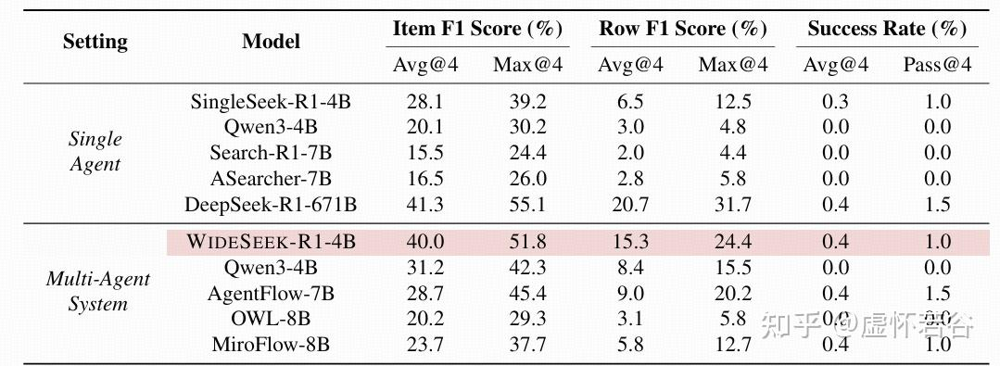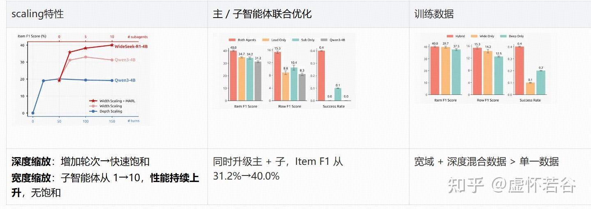

### **Tool-R0: Self-Evolving LLM Agents for Tool-Learning from Zero Data**

**目前agent的RLVR技术严重依赖人工标注的任务数据：**

-   **规模化瓶颈**：人工标注成本高、不可扩展，无法支撑模型持续自进化；
-   **分布偏移**：静态人工数据集与模型在线学习需求不匹配，泛化性差；
-   **能力上限**：模型能力被人类标注水平锁死，无法突破固有认知边界。

**本文提出了Tool-R0：**

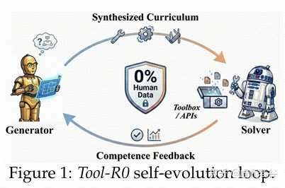

**零数据、自博弈强化学习**的通用工具调用大模型智能体框架，无需任何人工标注数据集，通过**生成器 - 求解器双智能体协同进化**，让基座 LLM 自主演化出复杂工具调用能力；本方案还可以迁移真实世界场景，超越Agent0, Dr.Zero等，具备跨领域通用工具学习能力。

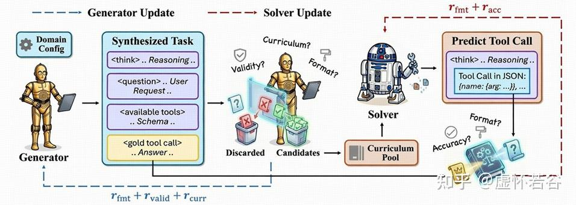

Tool-R0 基于**双智能体协同进化**设计，同一基座 LLM 初始化两个独立角色：**Generator（任务生成器）** 与**Solver（任务求解器）**，形成闭环自进化循环，全程无外部数据输入。

**整体训练流程（K 轮迭代）**

1.  训练 Generator：生成适配 Solver 能力边界的高质量工具调用任务；经**去重、交叉验证、难度分层**，构建**易→难**的渐进式数据集，贴合 Solver 学习曲线，最大化训练效率。
2.  冻结 Generator：批量生成任务，经去重、校验、难度排序构建课程学习数据集；
3.  训练 Solver：在自生成数据集上学习工具调用，能力迭代升级；
4.  循环迭代：Solver 能力反哺 Generator，生成更难的任务，持续进化。

**关键基础：约束化任务生成**

为解决自由生成的**模式崩塌（mode collapse）** 问题，设计轻量化任务规范 `s=(领域、上下文、工具数量、调用步数)`，动态采样注入生成器，保证任务**多样性、可控性、无幻觉**。

**奖励函数设计**

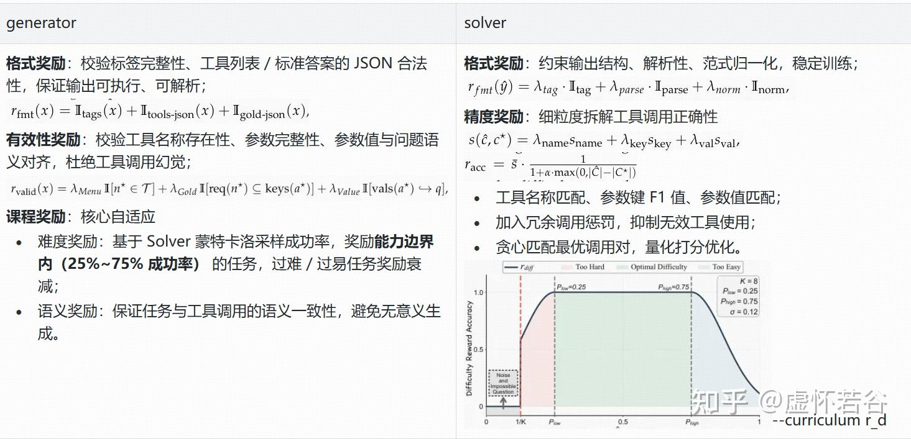

**实验结论**

**核心发现**

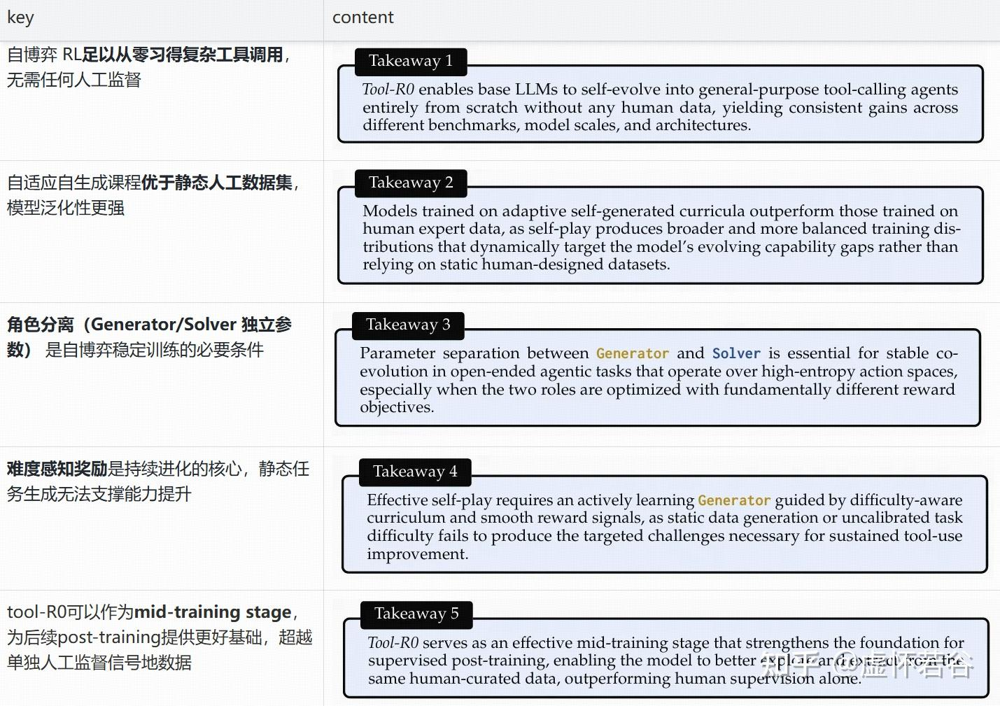

Qwen2.5-1.5B 平均精度提升**22.99 个点**，**相对提升 92.52%**，全基准均大幅超越原生基座；

0.5B 模型经 Tool-R0 训练后，性能超过原生 1.5B 模型；1.5B 模型超越原生 3B 模型，**抹平模型规模差距**；

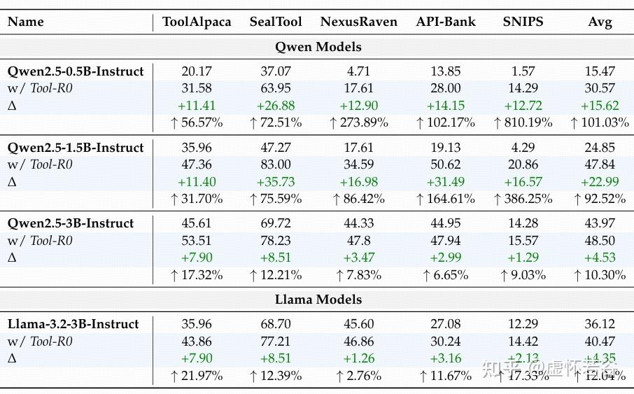

零数据训练的 Tool-R0，性能持平 / 超越基于海量人工数据训练的全监督工具学习基线。

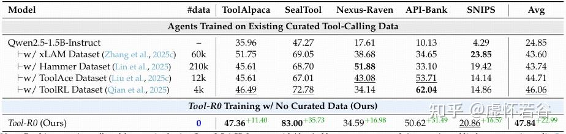

solver与generator不能共享，必须independent；必须对generator进行深度优化。

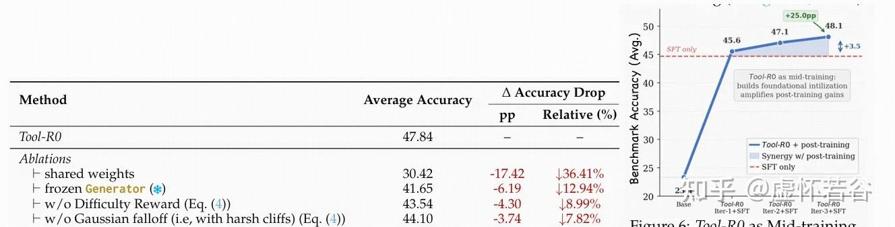

### RAGEN-2 Reasoning Collapse in Agentic RL

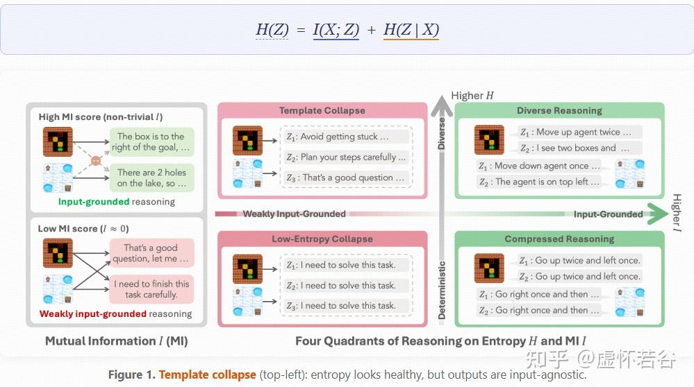

-   现有方法用**熵**监控推理稳定性，但其仅衡量**单输入内多样性**，无法判断推理是否响应不同输入。
-   发现**模板坍塌**新失效模式：模型熵稳定、推理看似多样，但实际使用固定模板、**与输入无关**，且熵与现有指标均无法检测。

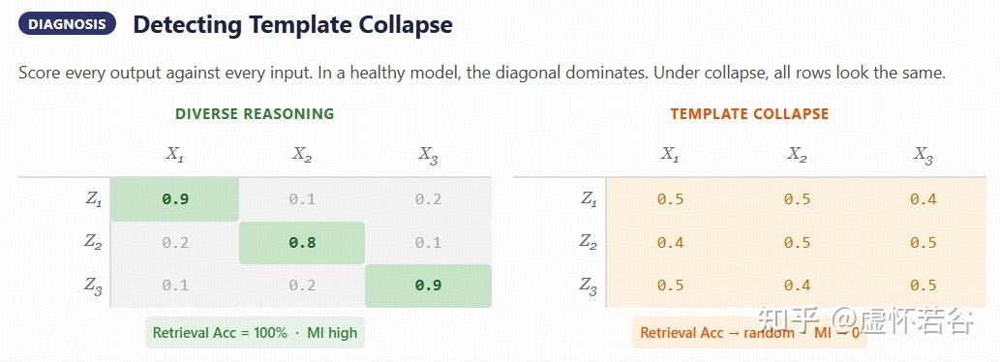

总梯度 = 任务梯度 + 正则化梯度 + 噪声梯度。

任务梯度随**输入内奖励方差**单调递增，正则化梯度对所有输入恒定。

模板坍塌的原因：低奖励方差→**任务梯度极弱**，正则化梯度主导更新；模型被迫生成满足正则约束、但与输入无关的模板化推理。

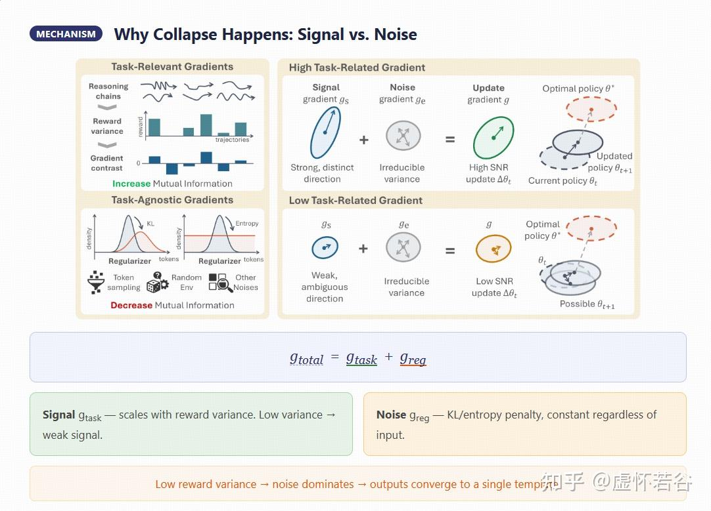

**优化方法：计算reward方差，保留top-p比例样本进行数据更新。top-p时按照方差和计算比例的。**

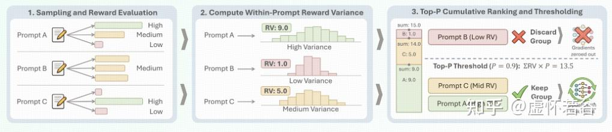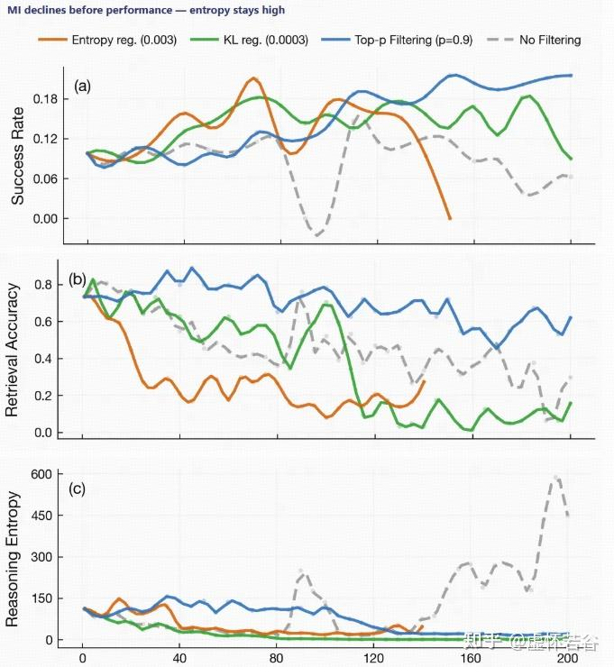

  

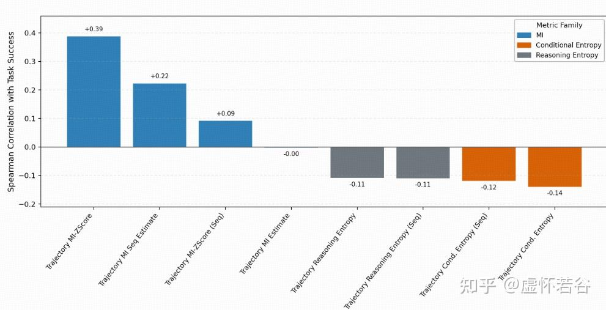

## 结语

本文知识罗列了TIRL技术的发展脉络，这是模型的agentic 能力来源的核，是openclaw等产品能够成功的LLM基础。除了基座团队需要在TIR方向深耕，很多垂域行业其实也需要解决通用LLM的agentic TIR能力迁移不足的问题，这些研究将是非常好的参考。我始终相信，未来的大模型通用的知识和推理不是其发展核心，而和客观世界的交互，与tool的集成推理，才是拓展llm能力的至尊大道。