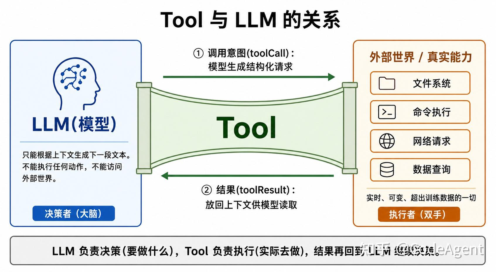
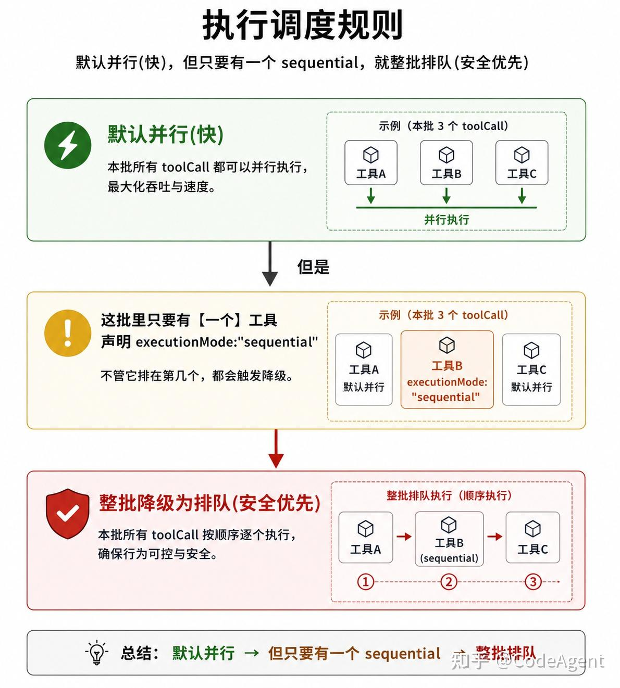
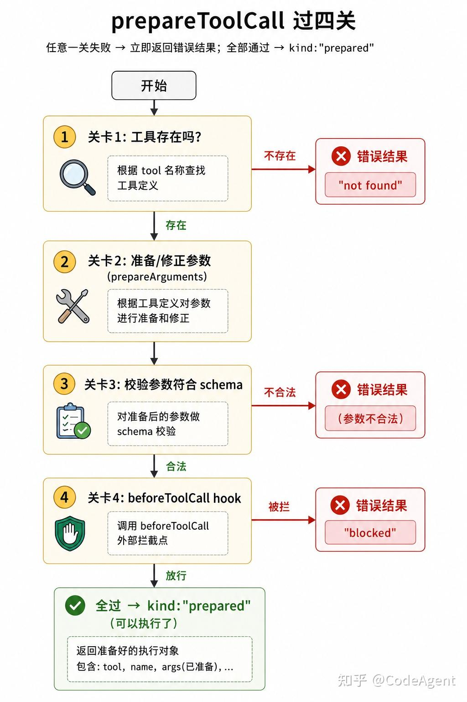
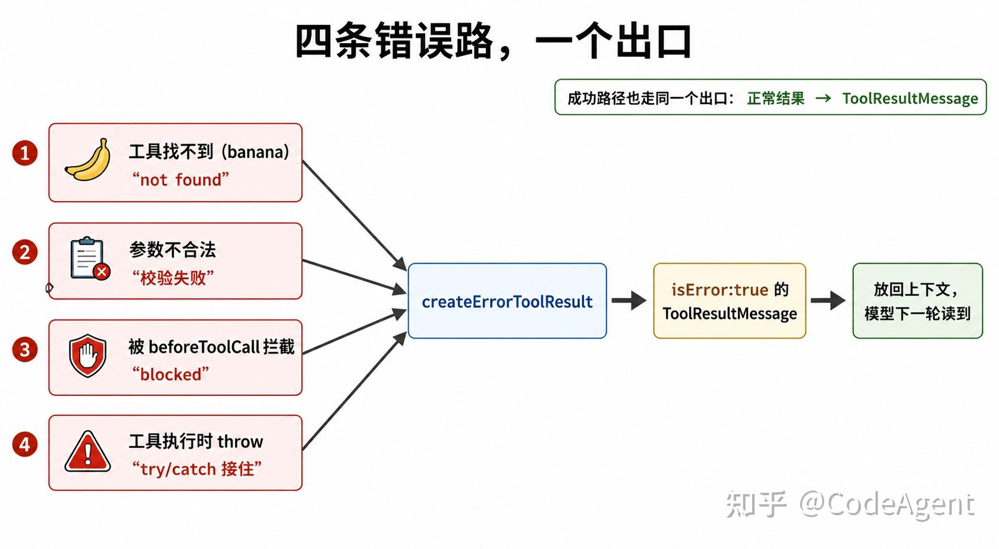
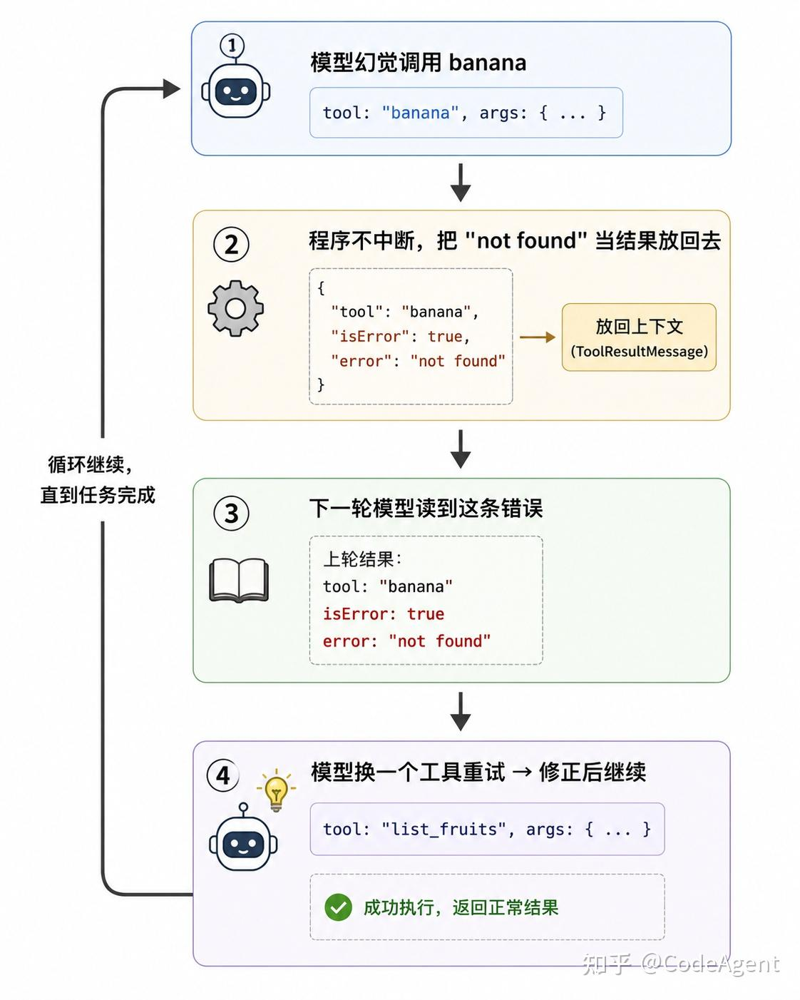
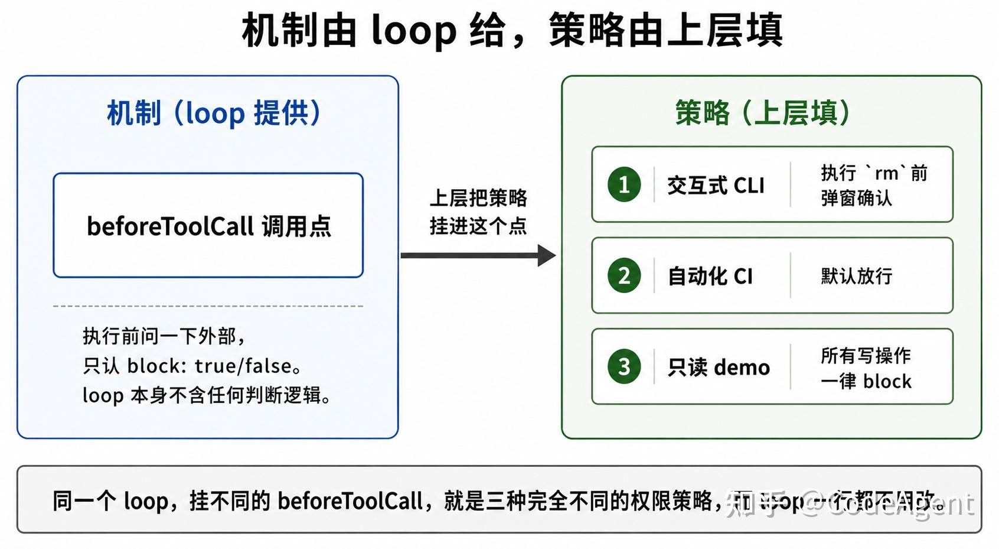
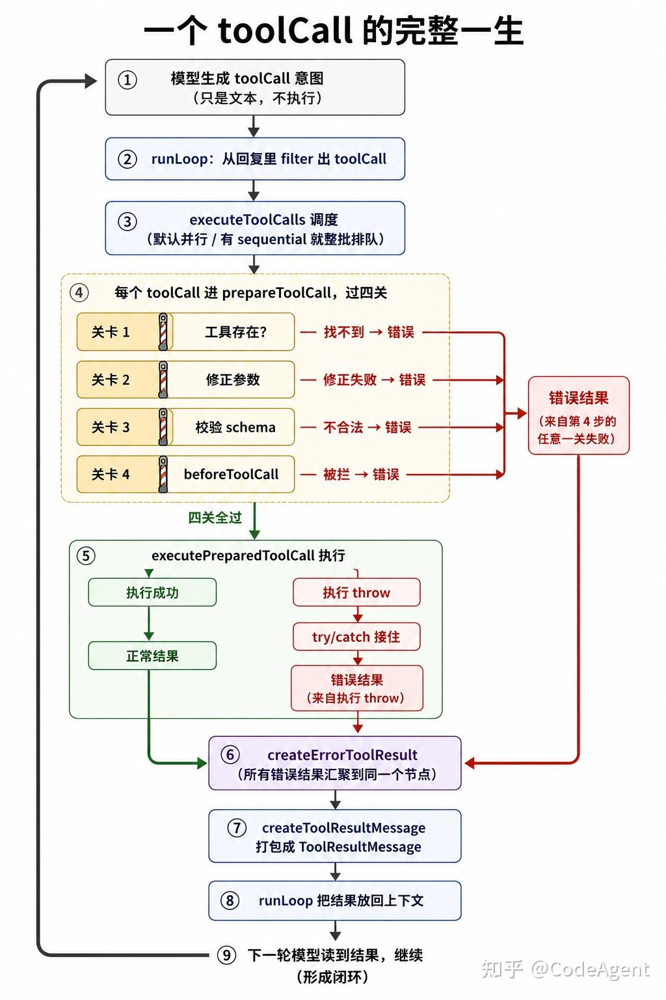

前三篇讲了事件流、agent loop 和 provider

[Pi 系列 01｜用最小例子看 agent runtime 的事件流](https://zhuanlan.zhihu.com/p/2044461174956220544)

[Pi 系列 02｜Agent loop 与 turn：一次 prompt 为什么会拆成 4 趟](https://zhuanlan.zhihu.com/p/2046022975527318664)

[Pi 系列 03｜Provider 抽象与统一事件协议](https://zhuanlan.zhihu.com/p/2047827741639185076)

这篇介绍下 tool 相关的。

## 写在前面

这一篇(上)先回答一个问题：**当模型"调用"一个工具时，从它生成调用意图，到本地真的执行，再到结果回到下一轮上下文，中间发生了什么？** 我们顺着这条执行链走一遍，重点看 pi 怎么处理出错。

> 说明：正文只用函数名定位代码（如 `prepareToolCall`），不写具体行号——行号会随版本变化，函数名更稳定，也方便你自己 grep 查找。

## Tool 是什么：模型够不到的那部分

先看一个现象。在一个基于 pi 的界面里问"今天天气怎么样"，模型可能这样回答：

"我这边不能实时查询天气数据。你可以看手机天气 App 或搜索"北京天气"获取最新情况。"

如下图：


模型为什么查不了？因为它本身只能做一件事：**根据上下文生成下一段文本**。它读不了文件、跑不了命令、访问不了实时数据。天气是实时的、训练数据里没有的，模型够不到，只能让你自己去查。

这正是 tool 要解决的问题。给模型挂一个查天气的工具后，同样的问题会变成：模型生成一个"调用查天气工具"的请求 → 程序替它真的查了天气接口 → 结果放回上下文 → 模型读到结果再回答你。

一句话：**tool 是模型和外部世界之间的桥。** 模型负责决策（要做什么），tool 负责执行（实际去做），结果再回到模型继续决策。



理解了 tool 是什么，下一个问题自然就来了：模型"调用"工具时，到底是谁在执行？

## 先想清楚一件事：模型并不执行工具

当模型"调用" `bash` 工具跑 `ls` 时，下面哪个更接近真相？

-   **A.** 模型自己执行了 `ls`，拿到结果，继续往下说。
-   **B.** 模型只是生成了一段文本("我想用 bash 跑 ls")，程序看到这段文本，**替它**跑了 `ls`，再把结果放回上下文给它读。

答案是 B。

模型只能生成文本，它甚至不能"调用"工具——它只能生成一段 **表示"我想调用工具"的结构化文本**。真正执行的是 harness。

这个区分是整个 tool 系统的前提：因为模型只生成意图、不执行，所以 harness 必须补上"识别意图 → 代为执行 → 把结果放回去"这一整套机制。下面的代码都围绕这件事展开。

## 在源码里，"意图"和"执行"是分开的两步

回到 02 篇看过的主循环 `runLoop`（`agent-loop.ts`）。把和工具相关的几行单独拎出来：

```text
// 模型这一步只负责生成。到这里为止，ls 还没有执行
const message = await streamAssistantResponse(...)

// 程序从模型的回复里识别是否存在工具调用意图
const toolCalls = message.content.filter((c) => c.type === "toolCall");

// 找到了意图，程序代模型执行
if (toolCalls.length > 0) {
  const executedToolBatch = await executeToolCalls(currentContext, message, config, signal, emit);
```

把这三步对应回前面的 B：

| 步骤 | 谁在动 | 做什么 |
| ----- | ----- | ----- |
| 生成 | 模型 | 生成回复（可能含"我想调 bash ls"的意图） |
| 识别 | 程序 | 从回复里 filter 出 toolCall |
| 执行 | 程序 | executeToolCalls 真正执行 |

关键证据是：生成（`streamAssistantResponse`）和执行（`executeToolCalls`）是**两个不同的函数调用**，中间隔着一行 `filter`。如果是 A（模型自己执行），这里不需要 `filter`，也不需要独立的 `executeToolCalls`。正因为是 B，pi 才需要这套"生成 → 识别 → 代为执行 → 放回去"流程。

补充一个边界条件：如果模型生成的回复里**没有** `toolCall`（纯文本回答），也就是 `if (toolCalls.length > 0)` 不会进入，这一轮就是纯文本回复，不执行任何工具。

## 结果去哪了：谁拥有状态，谁负责写

执行完，结果要回到上下文。看 `runLoop` 紧接着的几行：

```js
toolResults.push(...executedToolBatch.messages);   // 收集执行结果
...
for (const result of toolResults) {
  currentContext.messages.push(result);            // 放进"这次要发给模型的上下文"
  newMessages.push(result);                        // 放进"这次 run 新产生的消息(归档)"
}
```

`currentContext.messages.push(result)` 就是"把结果放回去"——下一轮模型调用（又一次 `streamAssistantResponse`）时，这条结果已经在上下文里，模型就能读到 `ls` 的输出。闭环成立：

```text
生成意图 → 识别 → 执行 → 放回上下文 → 下一轮模型读到结果
```

这里有个容易被忽略、但很关键的设计：**为什么"放回上下文"是 `runLoop` 在做，而不是 `executeToolCalls` 内部直接做？**

沿着代码看三步就能说明：

1.  `currentContext` 是 `runLoop` 的对象——它是**作为参数传进** `executeToolCalls` 的，主人是 `runLoop`。
2.  `newMessages`（归档用的数组）**并没有传给** `executeToolCalls`——它在参数列表之外，执行器无法直接访问。
3.  `executeToolCalls` 的职责是"执行"，不是"管状态存到哪几个数组里"。

结论是一条通用原则：**谁拥有状态，谁负责写状态。** `executeToolCalls` 是一个纯粹的执行器，输入 toolCall，输出 result，不修改外部状态。状态（`currentContext`、`newMessages`）始终由 `runLoop` 管理。

这不只是代码整洁问题。正因为执行器不碰外部状态，它才能安全并行执行；否则多个工具并行时会同时写同一个数组，产生竞态。执行器"无法直接写外部状态"是有意的保护。

那个被放回去的 `result` 是什么类型？沿着类型定义看：它被 push 进 `toolResults`，而 `toolResults` 声明为 `ToolResultMessage[]`。所以结果就是 `ToolResultMessage`（定义在 `ai` 包的 `types.ts`）：

```text
interface ToolResultMessage {
  role: "toolResult";         // 它是一条消息，跟 user/assistant 平级
  toolCallId: string;         // 对应哪个 toolCall(配对用的钥匙)
  toolName: string;           // 哪个工具产的
  content: (TextContent | ImageContent)[];  // 给模型读的内容
  isError: boolean;           // 工具成功还是失败
}
```

`toolCallId` 的作用是配对：模型生成 `toolCall` 时给一个 id，结果回来时带同一个 id，模型才能知道"这条结果回应的是哪个请求"。

## 一批工具：默认并行，有 sequential 工具就整批排队

模型可能一次生成多个 toolCall（比如同时 read 三个文件）。`executeToolCalls` 怎么调度？看它的开头：

```text
const hasSequentialToolCall = toolCalls.some(
  (tc) => currentContext.tools?.find((t) => t.name === tc.name)?.executionMode === "sequential",
);
if (config.toolExecution === "sequential" || hasSequentialToolCall) {
  return executeToolCallsSequential(...);   // 排队
}
return executeToolCallsParallel(...);        // 并行
```

读出来的策略是：



注意是 `.some()`——"只要存在一个"。3 个工具里有 1 个是 sequential，`hasSequentialToolCall` 就是 `true`，整批排队。

哪种工具会声明 sequential？通常是**有副作用、并行不安全**的工具，比如写文件——两个写操作同时跑可能互相覆盖。只读工具（read、grep）并行无所谓，写类工具则需要排队。

为什么是"整批"排队，而不是"只让那个 sequential 工具排队、其他照样并行"？因为并行的本质是"同时进行、顺序不保证"。如果只让 write 排队、read 仍并行，write 执行期间 read 仍可能并发运行，冲突风险还在。要保证 write 安全，通常需要整批都顺序执行。这是有意的设计取舍。

这里还有一个健壮性细节。`.find()` 按名字找工具：如果模型生成了一个不存在的工具名（幻觉，比如 `banana`），`.find()` 返回 `undefined`，`undefined?.executionMode` 借助可选链 `?.` 会返回 `undefined`（而不是触发 `undefined.executionMode` 异常），最终这个 tc 在 `.some()` 里算 `false`。

这样，模型的幻觉就不会中断调度逻辑。`banana` 这类调用具体怎么处理，下面会讲到。

## 一个 toolCall 的五步：以排队执行为例

进 `executeToolCallsSequential`。先看结构，它是一个 `for` 循环，循环体里有五个动作：

```text
for (const toolCall of toolCalls) {          // 排队：一个一个来
  emit("tool_execution_start")               // ① 发出"开始执行"事件(给 UI/日志)
  const preparation = await prepareToolCall(...)  // ② 准备(四道关卡，见下)
  if (preparation.kind === "immediate") {    // ③ 准备阶段就出结果了 → 直接用
    finalized = ...
  } else {
    const executed = await executePreparedToolCall(...)   // 真正执行
    finalized = await finalizeExecutedToolCall(...)       // 收尾(跑 afterToolCall hook)
  }
  emit("tool_execution_end")                 // ④ 发出"执行完了"事件
  const toolResultMessage = createToolResultMessage(finalized)  // ⑤ 打包成 ToolResultMessage
}
```

`tool_execution_start` / `tool_execution_end` 这两个事件，02 篇在事件流里见过名字，现在看到它们从哪里发出来了。

`prepareToolCall`（②）是准备阶段，它内部有四道关卡。这是 tool 系统错误处理最集中的地方。

## 四道关卡：错误怎么被统一处理

`prepareToolCall` 按顺序过四关：



### 关卡 1：工具不存在（banana 的处理）

```text
const tool = currentContext.tools?.find((t) => t.name === toolCall.name);
if (!tool) {
  return {
    kind: "immediate",
    result: createErrorToolResult(`Tool ${toolCall.name} not found`),
    isError: true,
  };
}
```

`banana` 会在这里被识别为不存在的工具：`Tool banana not found`。

注意它返回错误的**方式**：`kind: "immediate"` 加 `isError: true`，\*\*没有 `throw`\*\*。也就是把"工具不存在"转换成一条可回传的工具结果。回看上一节执行循环里的第 ③ 步：`if (preparation.kind === "immediate")` 会直接使用这个结果，不再执行工具。这个错误结果会和正常结果走同一条路径：打包成 `ToolResultMessage` → 放回上下文 → 下一轮模型读取。

### 关卡 2-4：修正参数、校验、拦截

```text
try {
  const preparedToolCall = prepareToolCallArguments(tool, toolCall);   // 关卡2: 修正参数
  const validatedArgs = validateToolArguments(tool, preparedToolCall);  // 关卡3: 校验 schema
  if (config.beforeToolCall) {                                          // 关卡4: 执行前的闸
    const beforeResult = await config.beforeToolCall({ ...args: validatedArgs... });
    if (beforeResult?.block) {                                          // 外部说"拦住"
      return { kind: "immediate", result: createErrorToolResult(beforeResult.reason || "..."), isError: true };
    }
  }
  return { kind: "prepared", toolCall, tool, args: validatedArgs };     // 放行
} catch (error) {
  return { kind: "immediate", result: createErrorToolResult(error.message), isError: true };  // 校验失败也变成错误结果
}
```

有个顺序细节值得注意：关卡 4 拿到的是 `validatedArgs`（已经过关卡 3 校验的参数）。也就是说 `beforeToolCall` 看到的是"干净、合法"的参数，它不用操心格式对不对，只需要判断这个动作**该不该做**。校验合法性、判断该不该做，是两件事，拆成两关。

### 错误的汇流

到这里，关卡 1（工具找不到）、关卡 3（参数不合法）、关卡 4（被拦截）这三条错误路径，最后都调用了同一个 `createErrorToolResult`。还差一条错误来源，下面补上。

还有第四条：工具**执行失败**。看 `executePreparedToolCall`——真正调用工具 `execute` 的地方：

```text
try {
  const result = await prepared.tool.execute(...)   // 工具真正执行(可能 throw)
  return { result, isError: false };                // 成功
} catch (error) {                                    // 工具 throw 了，被接住
  return {
    result: createErrorToolResult(error.message),    // 异常 → 错误结果
    isError: true,
  };
}
```

这里的 `createErrorToolResult` 和 banana 那条用的是**同一个**函数。四条错误路最后汇到一个出口：



模型不需要区分"是工具不存在还是工具执行失败"，它只需要读到"这次没成功，原因是 XXX"，然后决定下一步。

## 为什么把错误转成结果throw会终止程序，结果可用于反馈

这是整篇的关键。前面所有错误路径有一个共同选择：**不 `throw`，而是把错误变成结果放回去。** 为什么？

因为很多错误是**模型在决策阶段产生的**（比如生成了不存在的 `banana`）。把错误当结果放回去，模型下一轮读到 `Tool banana not found` 后，仍有机会修正并继续。



如果改成 `throw`：程序会直接终止当前流程，模型没有补救机会。一句话：\*\*`throw` 会终止流程，错误结果是给模型的反馈。\*\* Agent 之所以能在较长操作链里继续推进，是因为可恢复错误会被转成反馈放回去，而不是直接中断。

可以归纳一条原则，写自己的 harness 时会反复用到：

> 凡是模型能补救的错误，都该变成结果放回去，不该 `throw`。`throw` 只留给模型补救不了的（程序本身的 bug、磁盘满了这类）。

这里有个容易误解、但实际是分层处理的细节。`AgentTool.execute` 的类型注释写着"**Throw on failure** instead of encoding errors in content"，即工具内部失败时建议 `throw`。这和前文并不矛盾，它们对应两个层级：

-   **工具作者**：执行失败就直接 `throw`，不用自己包装错误。
-   **agent loop**：在 `executePreparedToolCall` 用 try/catch 接住这个 `throw`，统一转成错误结果。

工具作者负责抛出失败，loop 负责把这些失败统一收敛成"结果"。职责清晰，且避免重复封装。

## 权限拦截：机制由 loop 给，策略由上层填

最后落到 `beforeToolCall`（关卡 4）——它是"执行前的最后一道闸"，也是权限确认（"危险命令执行前问一下用户"）的落点。

它有三个特征：

1.  **可选**。开头一句 `if (config.beforeToolCall)`——没挂这个 hook，整段跳过，默认放行。pi 默认不拦任何工具。
2.  **被拦的结果和 banana 一样**——`kind: "immediate"` + `createErrorToolResult` + `isError: true`，又是一条错误结果。
3.  **它只是个拦截点，本身不含任何判断逻辑**——它只会问"外部：拦不拦？"，认 `block: true/false`。判断逻辑在外部挂进来的函数里。

所以，如果要做"危险命令执行前弹窗问用户'确认吗？'"，这段"弹窗 + 等用户回答 + 返回 block"的代码，应该写在**外部传进来的 `config.beforeToolCall` 函数里**，而不是 loop 内部、也不是工具的 `execute` 里。

这是 pi 权限模型的核心：**loop 只提供"拦截点"这个机制，"拦不拦、怎么拦(包括问用户)"的策略由上层填。**



为什么非要这么分？因为"什么算危险"是应用的事，不是 loop 的事：

-   自动化 CI 里的 agent，可能什么都不问（没人在屏幕前点确认）。
-   交互式 CLI，可能每个写操作都问。
-   只读 demo，可能所有写操作直接 block。

同一个 loop，挂不同的 `beforeToolCall`，就是三种完全不同的权限策略，而 loop 一行都不用改。

这个判断在前几篇也出现过同类模式：`beforeToolCall`（拦不拦）、03 篇的 `streamFn`（用哪个 provider）、02 篇的 `shouldStopAfterTurn`（要不要停），都遵循同一原则：**凡是"不同应用会有不同答案"的决定，都不固化在 loop 里，而是做成 hook 交给上层实现。**

## 小结：一个 toolCall 的一生

把这一篇连起来，一个 toolCall 的完整执行链是：



这一篇有两个要点：

1.  **错误不直接 `throw` 终止，而是转成结果放回模型**。这是 agent 可以自我修正并持续推进的基础。四条错误路径汇到同一个出口，模型仍可继续决策。
2.  **机制和策略分离**——loop 提供拦截点(`beforeToolCall`)，具体拦不拦的策略由上层填。这让同一个 loop 适配只读、交互、自动化等不同的权限场景。