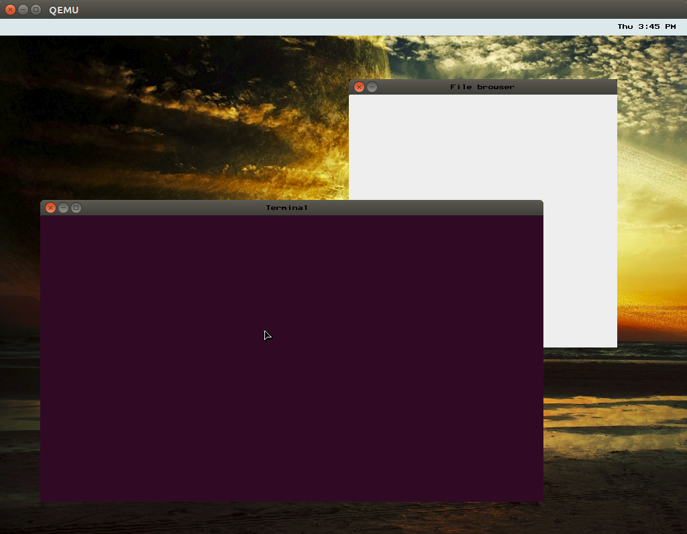

我来骗一下star哈哈

[szhou42/osdev](https://link.zhihu.com/?target=https%3A//github.com/szhou42/osdev)

虚拟内存✔

硬盘驱动，EXT2文件系统，虚拟文件系统✔

简陋的GUI界面✔

多进程(烂尾楼 :) )✔

网络数据收发(只是简单收发raw packets，各种网络协议还在写)✔

  
  

这是我学习过程中用到的主要网站和资料

[BrokenThorn Entertainment](https://link.zhihu.com/?target=http%3A//www.brokenthorn.com/Resources/OSDevIndex.html)

[Global Descriptor Table](https://link.zhihu.com/?target=http%3A//www.osdever.net/bkerndev/Docs/gdt.htm)

[Unofficial Mirror for JamesM's Kernel Development Tutorial Series](https://link.zhihu.com/?target=http%3A//johnvidler.co.uk/mirror/jamesm-kernel-tutorial/)

[Expanded Main Page](https://link.zhihu.com/?target=http%3A//wiki.osdev.org/Main_Page)

[Build software better, together](https://link.zhihu.com/?target=https%3A//github.com/)

:)

楼上大神全是几千字长文看起来有点怕，我简明扼要地说一些写OS的重要心得吧

1 教程上没看懂的代码千万不要照抄，最好在自己理解的基础上重新写一遍。我在看JamesM's Kernel教程的paging部分时就吃了这个亏，全盘抄了他的代码，结果发现他的代码总有神奇的bugs让你的os崩溃。结果我把写了一个半月的代码全部推翻，在完全理解后自己重新写出来的paging代码，不能说完全没bugs吧，至少现在已经四五个月了都没有再因为paging部分的代码而使os崩溃。

2 搭建方便使用的调试器，我个人用的是qemu+gdb配合，源码级调试

3 在os最基础的设施(中断，异常，VGA driver)都实现后，马上写个printf和hexdump函数，因为有一些极端情况，gdb下断点+单步跟踪+观察变量 这种办法会失效 :(。

4 快点写个malloc函数！越快越好！！文件系统，进程管理，GUI这些都需要用到大量的数据结构，而最方便的方法就是用malloc来申请和释放这些结构。

最后，说一下os开发的流程，这只是我个人的路线。

第一步，很多人会想写bootloader，但是我建议先跳过这一步，直接用grub或者qemu的自带bootloader，先跳过这些繁琐的细节，专注于OS内核的开发。

第二步，建立好各种gdt，idt，中断，异常等机制，这样系统出什么错的时候马上就能发现。

第三步，printf函数，这意味着你得先写VGA driver，但两者都不难

第四步，实现虚拟内存和分页机制，在此基础上实现kmalloc函数。

第五步，实现多进程/线程

第六步，写个PCI驱动！PCI是用来访问各种硬件的，例如硬盘，网卡，都得通过PCI来控制，实际上我就是因为想写硬盘驱动，才写的PCI驱动。

第七步，写硬盘驱动，实现EXT2文件系统，实现VFS文件系统。

第八步，GUI，设计一种数据结构存储和显示各种窗口。初步可以用VGA试验一下编写图形操作系统的乐趣，但是要想有高分辨率 真彩色还是得写VESA驱动才能得到。 很多人觉得图形操作系统很酷炫，但这反而是写OS里面最简单，最容易调试的一步(当然了要做VESA驱动还是很麻烦，因为在保护模式下没法用中断调用)。

第九步，实现网卡驱动，实现TCP/IP协议栈！

第十步，发挥你的想象！Network File System maybe？