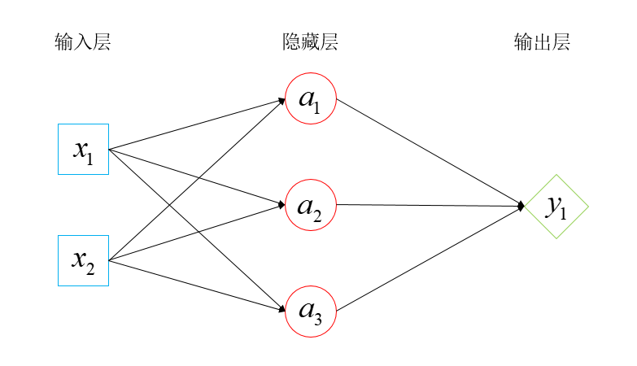

现在无论是计算机专业还是其他的实体行业（机械、制造等等）对于人工智能的需求都还是蛮大的。

所以现在也有很多人想入门人工智能，或者转行人工智能。其实人工智能是一个很大的方向，现在提到的人工智能基本上都默认以深度学习为主导的方法，但其实人工智能和深度学习的关系是：**深度学习是机器学习的一个子集，机器学习是人工智能的一个子集。**

那么现在深度学习这么火，我就简单的从**深度学习**的角度来回答一下这个问题。

其实对于深度学习这个日新月异，每年爆发式更新模型的方向来说，学习路线的最尽头肯定是阅读你这个方向最新的论文，无论是科研人员还是已经走上工作岗位打算转行的打工人。阅读论文的来源一般是各种顶会（CVPR、ECCV、ICCV）、顶刊（TPAMI）。如果你嫌麻烦可以直接去[谷歌](https://www.zhihu.com/search?q=%E8%B0%B7%E6%AD%8C&search_source=Entity&hybrid_search_source=Entity&hybrid_search_extra=%7B%22sourceType%22%3A%22answer%22%2C%22sourceId%22%3A2533269638%7D)学术或者arXiv上搜索你关注的内容，在搜索的时候最好把时间设定在最近几年。

**说完学习路线的尽头，我们来看看入门的一些要求。**

对于入门深学习而言，你是必须掌握Python这门语言的，主要的原因是很多模型开源的代码都是基于Python实现的，而且目前针对深度学习的两个主流框架pytorch和TensorFlow都是支持Python开发的，也就是说深度学习的生态很大一部分是依赖Python的。

所以说学习和掌握Python是入门深度学习必须的步骤，如果你不会也不用担心，入门Python还是非常简单的，目前知乎知学堂推出了一个基于Python的数据开发课程，如果你感兴趣的话可以购买学习一下，现在也不是很贵才一毛钱，以后可能就不好说了，所以直接买就完事了，也算是薅羊毛了。

好，当你掌握了Python，那么下一步就是去学习一些基础的数学知识了，因为如果一点数学知识都不知道的话后面论文中的公式你可能都看不懂，更不用提推导[复现模型](https://www.zhihu.com/search?q=%E5%A4%8D%E7%8E%B0%E6%A8%A1%E5%9E%8B&search_source=Entity&hybrid_search_source=Entity&hybrid_search_extra=%7B%22sourceType%22%3A%22answer%22%2C%22sourceId%22%3A2533269638%7D)了。但你也没必要害怕，主要的就是基本的[线性代数](https://www.zhihu.com/search?q=%E7%BA%BF%E6%80%A7%E4%BB%A3%E6%95%B0&search_source=Entity&hybrid_search_source=Entity&hybrid_search_extra=%7B%22sourceType%22%3A%22answer%22%2C%22sourceId%22%3A2533269638%7D)知识，也就是本科大一下学期学的，以及一些高等数学中的微积分知识。因为深度学习说的通俗一点就是大量的线代中[矩阵运算](https://www.zhihu.com/search?q=%E7%9F%A9%E9%98%B5%E8%BF%90%E7%AE%97&search_source=Entity&hybrid_search_source=Entity&hybrid_search_extra=%7B%22sourceType%22%3A%22answer%22%2C%22sourceId%22%3A2533269638%7D)和微积分中偏微分用于梯度下降。

人类之光

当你掌握Python编程和基本的线代知识以及微积分以后，你现在就可以去看看最基本的深度学习网络模型了。虽然说现在深度学习日新月异，但是目前的很多新模型都是基于这些基础模型上进一步创新和跨领域应用的。这些基本的模型不仅能带你理解深度学习，也能帮你打下坚实的基础，这对于你后面去理解新模型和创新是非常重要的。

下面我就从[计算机视觉](https://www.zhihu.com/search?q=%E8%AE%A1%E7%AE%97%E6%9C%BA%E8%A7%86%E8%A7%89&search_source=Entity&hybrid_search_source=Entity&hybrid_search_extra=%7B%22sourceType%22%3A%22answer%22%2C%22sourceId%22%3A2533269638%7D)（二维图片处理、三维点云数据处理）、自然语言处理列举几个最基本的模型。

深度学习网络基础知识：正向传播、梯度下降、反向传播、常见的几个[LOSS函数](https://www.zhihu.com/search?q=LOSS%E5%87%BD%E6%95%B0&search_source=Entity&hybrid_search_source=Entity&hybrid_search_extra=%7B%22sourceType%22%3A%22answer%22%2C%22sourceId%22%3A2533269638%7D)（损失函数）

开山鼻祖：FCN网络（全连接神经网络）

一个简单的神经网络示意图

**计算机视觉（2D图片任务）：**

1.CNN（这个就不过多介绍了，已经是如雷贯耳了）

2.FCN（[膨胀卷积](https://www.zhihu.com/search?q=%E8%86%A8%E8%83%80%E5%8D%B7%E7%A7%AF&search_source=Entity&hybrid_search_source=Entity&hybrid_search_extra=%7B%22sourceType%22%3A%22answer%22%2C%22sourceId%22%3A2533269638%7D)，是分割任务中祖师爷般的存在）

3.RCNN系列（目标检测任务霸主，现在很多下游任务还是会把faster rcnn当做[骨干网络](https://www.zhihu.com/search?q=%E9%AA%A8%E5%B9%B2%E7%BD%91%E7%BB%9C&search_source=Entity&hybrid_search_source=Entity&hybrid_search_extra=%7B%22sourceType%22%3A%22answer%22%2C%22sourceId%22%3A2533269638%7D)）

**计算机视觉（3D视觉点云或者体素任务）：**

1.PointNet/PointNet++（在三维视觉中基于点数据流派的开山之作）

2.VoteNet（[何凯明](https://www.zhihu.com/search?q=%E4%BD%95%E5%87%AF%E6%98%8E&search_source=Entity&hybrid_search_source=Entity&hybrid_search_extra=%7B%22sourceType%22%3A%22answer%22%2C%22sourceId%22%3A2533269638%7D)在三维目标检测的力作）

**自然语言处理方向：**

1.RNN（这个模型年纪虽然可能比你都大（1982年）但这并不影响他在NLP领域的影响力）

2.LSTM（1997年，是对RNN的一个改进版本）

3.transform（这个不多说，现在真的是transform及其子孙模型大行其道的时代，光在自然语言领域卷还不够，现在都跑到计算机视觉领域来卷了）

当你读完上面论文，你就可以去专门的看你自己方向的论文了，希望我的回答对你有所帮助。

本文作者：数学建模钉子户