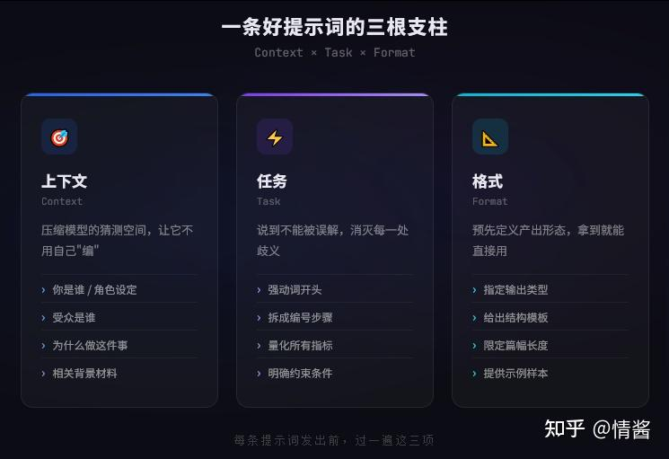
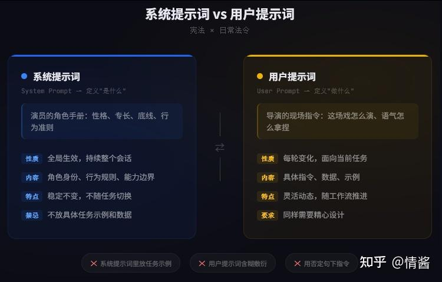

过去半年，我几乎每天都在写提示词。不是随便跟 AI 闲聊那种，是给产品级的工作流设计系统提示词、调试多轮对话、编排多个智能体之间的协作。踩了很多坑，也攒下了一些我认为值得分享的方法论。

今天我想把它们完整地写出来。

这篇文章不是”50 个好用的 prompt 模板”合集。模板脱离了场景就没用，到处都能搜到。我更想讲的是：**一条好的提示词，好在哪里？好的背后有什么可复现的规律？面对一个全新任务，从零开始设计提示词时，你脑子里应该跑什么样的思考流程？**

把这些东西真正内化之后，你不用再背任何模板。你自己就能针对任意场景推导出好的提示词。

* * *

### 一条好的提示词，到底好在哪里

先从最基本的问题说起。

你打开 Claude 或者 Gemini，输入一行字，按下回车，AI 给你一段回复。有时候回复很好，有时候很烂。分界线在哪里？

如果只看表面，区别无非是”准不准”“有没有用”。但再往下追一层，就会碰到大语言模型的运作机制。

模型拿到你的输入后，做的事情是：在训练时见过的数万亿文字的统计模式中，预测”在你这段输入之后，最可能出现的下一段文字是什么”，然后一个词一个词地生成出来。

**你的提示词，就是模型做预测的全部依据。** 它设定了预测路径的起点和方向。写得越精确、信息越丰富、结构越清晰，模型走上高质量路径的概率就越大。写得越模糊，模型就越会滑向最泛化的统计均值，产出一段正确但毫无洞察力的废话。

所以好的提示词，好在它为模型铺了一条精确的预测路径。烂的提示词，是把模型丢在一个没有路标的旷野里，让它随便走。

想明白了这一点，后面所有方法论就都在回答同一个问题：**怎样铺路。**

* * *

### 每条提示词要回答的三件事

不管你是要写邮件、分析代码还是设计架构，不管用的是 GPT 还是 Claude，一条高质量提示词，都在同时交代清楚三件事：

**在什么背景下做（Context）、具体做什么（Task）、产出长什么样（Format）。**

这就是提示词的骨架。



  

**Context：喂足背景，压缩猜测空间**

模型默认对你一无所知。你是谁、在什么行业、面对什么受众、做这件事图什么，它全不知道。每一条信息的缺失，都是模型被迫要自己”猜”的地方。而它猜的方式，就是走向最通用、最没特色的那个方向。

提供上下文就是在压缩模型的猜测空间。你交代的背景越多，它需要自行发挥的余地就越小，输出也就越精准。

要有意识地检查几个维度。你是谁或让 AI 扮演谁：一个”资深安全工程师”和一个”初级开发者”面对同一段代码，分析的视角和深度完全不同。受众是谁：同一份技术方案，写给工程师看和写给不懂技术的高管看，语言和侧重截然不同。为什么要做：目的决定取舍，”总结这份合同”有一百种总结法，”重点识别对我方不利的条款”则把模型的注意力锁定在你真正关心的地方。以及背景材料：项目文档、之前的对话、数据表格，手上有的、跟任务相关的信息都值得喂进去，这是抑制模型”编造”最直接的手段。

举个例子。你要让 AI 写一封内部邮件，通知团队项目延期了。

只写”写一封关于项目延期的邮件”，模型不知道延期什么原因、多严重、收件人是谁、你希望邮件传达什么情绪，它只能输出一封泛泛的模板邮件。

但如果你写：”我是’Tencent XX项目’的负责人，需要给跨职能团队（工程、设计、市场）发一封状态更新邮件。最近遇到了第三方 API 集成的意外问题，发布推迟一周。工程已有替代方案。邮件基调：坦诚但自信。重点：整体进展良好，延期原因用非技术语言解释，替代方案已就位，确认新发布日期。控制在 200 字以内。”

第二版里每一句话都在压缩猜测空间。角色、受众、原因、现状、目的、格式全部到位。模型不需要猜任何东西，只要把这些要素组织成一封得体的邮件。

**Task：把”做什么”说到不能被误解**

这里就一条原则：消除歧义。

用动作明确的动词开头。”分析”“对比”“重构”“提取”“分类”“生成”直接告诉模型要执行什么操作。”帮我看看”“能不能”“关于……的一些想法”这类开头则让模型摸不着你到底想要什么。

复杂任务拆成编号步骤。长段指令混在一起很容易被模型遗漏或搅混。拆成”1. 做什么 2. 做什么 3. 做什么”之后，模型会把它当成执行序列来走，漏掉步骤的概率大幅降低，出了问题也容易定位。

量化一切可以量化的东西。”简短一些”是模糊的，模型不知道你说的简短是 50 字还是 500 字。”150 字以内”是精确的。”几个例子”是模糊的，”三个例子，每个两到三句话”是精确的。每量化一处，就消灭一处歧义。

约束条件也属于任务定义。”只使用 Python 标准库”“预算限制在 500 美元以内”“不要出现技术术语”，这些边界条件能有效防止模型跑偏。

**Format：预先定义产出形态**

这个维度最容易被忽略。AI 回答内容是对的，但格式完全不能直接用，这种情况很常见。你想要表格，它给你一堵文字墙。你想要 JSON，它给你一段带解释的代码块。你想要几个要点，它给你一篇小作文。

解决方式很简单：在提示词里明确说你要什么格式。”以 Markdown 表格呈现”“输出有效 JSON 对象，结构如下……”“编号列表，每条不超过一句话”。

更有效的做法是直接给一个输出示例。你不用解释你要什么格式，展示一个就够了。模型会从示例中学到模式然后复现。这就引出了下一个话题。

* * *

### 当”说”不够时，就”演”给它看

上面讲的三个维度全做到位，大部分日常任务都能得到满意的结果。这种不给任何示例、纯靠描述来指导模型的方式叫做零样本（Zero-Shot）策略。快、省 token、多数时候够用。

但你一定会遇到它不够用的时候。

比如你需要模型把数据提取成一个你们公司特有的 JSON 结构，不管你怎么描述，输出的字段名和嵌套方式总是跟你要的有偏差。比如你做情感分类，类别之间的边界很微妙，”账单投诉”和”功能反馈”之间怎么区分？你越描述边界越模糊。再比如你想让模型用一种很具体的语言风格写作，你心里有感觉但很难用形容词传达。

这时候你需要从”告诉它怎么做”升级为”展示给它看”。这就是少样本（Few-Shot）策略。

大语言模型是超强的模式匹配器。你在提示词里放几个”输入→输出”的示例，并不是在重新训练它，而是在它的短期注意力中创建了一个很强的局部模式。模型会分析示例中输入和输出之间的映射关系，推断出连接两者的规则，然后把这条规则用到新输入上。

你给的示例，就是它在这次任务中最优先参考的标准答案。

**写好示例有几条硬规矩。**

格式严格一致。每个示例的结构、标签、分隔符必须完全相同。模型学的是模式，模式本身不一致，学到的就是混乱。

质量比数量重要。三到五个清晰、准确的示例，远好过十个粗糙的。示例就是标杆，标杆歪了产出必然跟着歪。

示例之间要有多样性。做分类任务的话，每个类别至少给一个示例。做数据提取的话，示例最好涵盖不同的边界情况：有的字段缺失、有的格式不同。模型要从中学到”规则”，而不只是”一种具体情况怎么处理”。

用分隔符把示例和正式任务隔开。`### 示例 1 ###`、`### 正式任务 ###` 这种分隔，或者用 XML 标签包裹，让模型能清楚地分辨”哪些是参考”和”哪些是要做的”。

有一个简单的判断标准：当你发现自己花了很多字描述一个格式或规则，描述得越多反而越绕，那就停下来，给一个示例。一个示例传递的信息量，往往抵得上三段描述。

* * *

### 角色赋予这件事，比你以为的重要得多

“给 AI 一个角色”几乎每篇入门教程都会提。但多数人停留在”加一句’你是一个专家’让回答好一点”的层面，没触及到它真正的作用机制。

角色赋予在做什么？它在操纵模型从训练数据中取样的子空间。

训练数据里包含了各行各业无数人写的文字。一个”首席安全工程师”写的代码审查意见，和一个”计算机科学大一学生”写的代码注释，在词汇、深度、关注点上差异巨大。当你告诉模型”你现在是首席安全工程师”时，你其实是在说：请优先从训练数据中与这个角色对应的文本模式里采样。

这不是在加”风味”，是在切换模型调用的知识子集和质量标准。

有几个实测有效的进阶用法。

**角色越具体、职级越高，效果越好。** “我是一个设计师”激活的知识面太广太浅，从入门级到大师级的文本全被包进来了，取到的是个平均值。”我是一家顶级科技公司的首席产品设计师，设计哲学以迪特·拉姆斯的’设计十诫’为中心，专注于复杂企业级应用的极简交互”，这种定义把取样范围压缩到了一个窄但高质量的区间。你把角色和知名组织、高职级、公认的方法论框架关联起来，等于为模型设了一个质量锚点。

**用第一人称”我是”比第二人称”你是”好。** “你是一个资深后端开发者”被模型当成外部指令。”我是一个资深后端开发者，在 Python 分布式系统领域有十年实战经验”则会被内化为自我认同。后者产出的角色一致性更好，回复也更自然。差异不大，但在大量使用中能感受到。

**要传达一组复杂的性格特质时，用一个原型人物替代。** “在审查代码时我直接、坦率、标准严苛、不容忍低质量设计”这段话既长又可能不完整。”我以林纳斯·托瓦兹审查内核补丁的方式来做代码审查”只有一句话，但模型训练数据里有大量关于这个人做代码审查的素材，一个名字就把行为模式、沟通风格和质量标准打包激活了。费曼、奥格威、乔纳森·艾维，每一个辨识度够高的名字都是一个信息高度浓缩的”角色压缩包”。

角色设定应该放在系统提示词里。这就引出下一个问题。

* * *

### 系统提示词和用户提示词的分工

很多人用 AI 时只有”用户提示词”的概念，就是你在对话里输入的那些文字。但在工程化场景下（通过 API 调用，或者 Claude/ChatGPT 的自定义指令），还有一个”系统提示词”。搞清楚两者的分工，是从”随便用用”到”系统化使用”的跨越。



  

**系统提示词定义”是什么”。** 全局生效，整个对话期间持续起作用。角色身份、行为准则、能力范围、必须遵守的规则，这些不会因具体任务变化的东西放在这里。

**用户提示词定义”做什么”。** 每一轮对话中针对具体任务的即时指令。”分析这段代码”“给这份报告写摘要”“把这个方案改成面向非技术人员的版本”，这些随工作推进不断变化的操作放在这里。

打个比方。系统提示词是演员的角色手册，定义了性格、背景、底线。用户提示词是导演在拍摄现场给的场景指令，告诉他这场戏怎么演、语气怎么拿捏。手册是稳定的，指令是灵活的，但两者必须协调。

几个容易踩的坑。

不要在系统提示词里放具体的任务示例。系统提示词是全局上下文，模型把里面的内容当作”始终有效的指导”。在里面放了一个 JSON 格式示例，模型可能在后续所有任务中都不自觉地往 JSON 格式靠。任务级的示例放在用户提示词里，让它只影响当前这一轮。

不要忽视用户提示词的质量。我见过很多人花大量精力打磨系统提示词，但对话中丢出的指令却是”接着做”“下一步”“改一下”这种几乎没有信息量的话。系统提示词定义了一个好演员，但导演全程含糊照样出不了好作品。

告诉 AI 应该做什么，少用否定句。”不要写没有注释的代码”“不要忽略边界情况”，否定句的问题在于模型处理它们时仍然会激活”没有注释的代码”“忽略边界情况”这些概念。不如换个方向：”每个函数必须包含完整的文档注释”“所有输入必须做边界检查”。

* * *

### 结构化：被低估的高性价比优化手段

如果只能从这篇文章带走一个技术性建议，我建议是这个：**给你的提示词加结构。**

原因很直接。AI 只有你给它的文字。当你的提示词是一大段自然语言混在一起，指令、背景、数据、约束全部融为一体，模型必须先花”精力”去搞清楚”哪部分是什么”，然后才能开始干活。这个解析过程就有出错的可能，尤其当提示词超过几百字时。

加了结构之后，你等于直接标注了”这一块是指令、这一块是数据、这一块是格式要求”，模型可以跳过解析，直接进入执行。

**最实用的结构化工具是 XML 标签。**

为什么？模型训练数据里有大量 HTML 和 XML 内容，它对标签化结构天然亲和。而且标签名本身就携带语义。`<customer_feedback>` 比 `### 文本 ###` 多了一层信息，模型不仅知道这是一段需要区别对待的内容，还知道这是客户反馈，会用相应的方式来处理。

一个例子。

没结构的提示词：

```text
你是一个有经验的全科医生。患者有持续两周的干咳和反复低烧，傍晚加重。基于这些症状列出三个可能的诊断，从最可能到最不可能排列，每个附上简要理由。
```

加了结构的：

```text
<role>有二十年临床经验的全科医生</role>

<symptoms>
持续两周的干咳，反复低烧，傍晚时分加重。
</symptoms>

<task>
列出三个鉴别诊断，按可能性从高到低排列。
每个诊断附一句话理由。
</task>
```

内容一样。但第二版让每个组件的边界和功能一目了然。

**结构化最大的威力在输出侧。**

你可以让模型在回复中也使用特定标签。比如：

```text
先在 <thinking> 标签里写推理过程。
然后在 <answer> 标签里给最终答案。
```

好处有两个。你可以查看 `<thinking>` 里的推理链来定位错误，这是调试能力。下游程序可以直接解析 `<answer>` 的内容做自动化处理，这是工程化能力。有了这两项，AI 就可以嵌入自动化工作流，而不只是一个聊天工具。

* * *

### 让 AI 学会”打草稿”：思维链的原理和用法

前面所有策略都在优化你怎么”告诉” AI 做什么。但有一类问题，不管你怎么告诉它，它都容易出错：需要多步推理的问题。


  

经典例子：球棒和球加起来 1.10 元，球棒比球贵 1.00 元，球多少钱？

不做引导的话，模型几乎总是秒答”0.10 元”。一个很自信的错误答案。

为什么？模型在做”直觉跳跃”。它认出了问题类型（算术题），然后直接预测了最”像是答案”的数字，跳过了代数推导。而这个直觉跳跃恰好跳到了最常见的错误答案上。

**思维链（Chain-of-Thought）策略的思路很简单：别让模型跳，让它走。**

在提示词里加上”请一步一步推导”，强制模型在给最终答案之前先生成中间推理步骤。

为什么有效？这跟模型的生成方式有关。大语言模型逐词生成，每个新词的预测都以前面所有已生成的词为条件。当你强制它先写出”设球的价格为 x”这个中间步骤时，这个步骤就成了它预测下一步”则球棒价格为 x + 1.00”的上下文。然后”x + 1.00”又成了它推导”x + (x + 1.00) = 1.10”的上下文。每一步都在为下一步铺正确的预测条件。

生成中间步骤，等于是在为模型”购买”更多的计算空间。这些额外的 token 不是废话，是引导它走向正确答案的路径节点。

**什么时候用思维链？**

简单的翻译、总结、格式转换不需要。思维链的价值场景是数学和逻辑推理、多步骤分析（SWOT、代码调试、因果推导）、需要权衡利弊的决策、以及有大量约束条件需要遵循的复杂任务。

**思维链的两个增强变体。**

**自一致性（Self-Consistency）。** 用同一个思维链提示词对模型发多次请求（比如五次），每次带一定随机性，得到五条不同的推理路径。然后看五条路径的最终答案，哪个出现最多就采纳哪个。正确答案会收敛，错误答案会分散，多数投票就能过滤噪音。代价是成本翻倍，适合高风险、答案可验证的场景。

**思维树（Tree-of-Thoughts）。** 思维链是一条线走到底。思维树允许模型在每一步生成多个可能的方向，自我评估哪个方向更有前景，选最优的继续深入，走进死胡同还能回溯到前面的分叉点换路走。这给了 AI 前瞻和自纠的能力，适合开放式的战略规划和创意探索。

在实操中可以用”多角色辩论”模拟思维树：设定几个持不同立场的角色，让他们各自阐述、互相质疑、最后综合结论。每个角色是一个思维分支，辩论是评估，综合是决策。

* * *

### 一个反直觉的技巧：先问大问题，再解决小问题

有时候你会碰到一种奇怪的现象：提示词写得越具体、背景信息越详细，模型的回答反而越死板、越缺乏洞察力。

这通常发生在你的问题太窄、太聚焦于细节的时候。模型被你的具体条件”锁死”了，没有空间去调用更高层次的知识和框架。

**后退一步法（Step-Back）** 的做法是分两步。

第一步，不直接问你想问的具体问题，而是先问一个更宏观的问题。比如你想优化一个特定的 SQL 查询，先问”数据库查询性能优化有哪些通用策略和原则？”

第二步，拿到模型生成的原则框架后，把它连同你的具体问题一起喂回去：”基于上面的优化原则，分析我这个具体查询应该如何优化。”

模型先在宏观层面画一张知识地图，然后用这张地图来定位和解决你的具体问题。它能触达的知识广度和分析深度，都会优于直接就事论事。

* * *

### 对话中的几个高级心法

几个不太容易在教程里看到的实践心得。

**执行前先让 AI 复述计划。** 启动复杂任务之前，先让 AI 说一遍它理解的目标、约束、计划步骤。只有复述跟你的预期吻合了才让它动手。这一步能事前暴露大部分误解，远比事后返工高效。

**AI 会匹配你的水平。** 如果你问”怎么让网站快一点？”，AI 给你新手级回答。如果你问”首屏 LCP 超过 3 秒，已排除服务端响应时间问题，怀疑是关键渲染路径上的阻塞资源，建议怎么排查？”，AI 给你专家级回答。它会”估计”你的水平然后匹配输出。尽可能用专业的术语和框架来提问，即使只是半懂，展现出你知道的那一半也比什么都不展现好。

**长对话不如新对话。** 连续二三十轮的对话，上下文里积累了大量过时或无关的历史信息。如果你感觉模型开始”变笨”了，回答越来越偏，大概率是上下文污染。开一个新对话，把必要背景重新喂一遍，效果好得多。

**修改源头，别打补丁。** AI 输出不对时，不要在后续消息里一条条地修正（”不要用 pandas”“加上错误处理”“格式换一下”）。回到最初的提示词，把所有要求一次性写完整，让 AI 从干净的起点重新生成。每条追加修正，都在给对话历史增加噪音。

* * *

### 从单兵作战到团队协作：多智能体编排

最后一个话题偏工程化，但对做 AI 产品的人来说可能是最有价值的部分。

工作流复杂到一定程度，单一 AI 角色就不够了。原因是不同阶段需要的思维模式互相矛盾。创意阶段需要发散，架构阶段需要严谨，测试阶段需要怀疑一切。让同一个角色在这些模式之间来回切换，效果远不如为每个阶段配一个专门的智能体。

做法是：把工作流拆成独立阶段，每个阶段一个专门的 AI 角色（独立系统提示词），上下文严格隔离。产品经理智能体的发散思维不能泄漏到架构师的上下文里，否则会干扰架构师需要的严谨推理。信息在智能体之间的传递应该是结构化的、经过筛选的：只传下游需要的那部分结论，不是上游的全部对话历史。

不同智能体还可以配不同的模型和参数。架构设计用推理能力最强的模型、低 temperature。营销文案用创意能力强的模型、高 temperature。工具选型这件事本身，也是提示词工程的一部分。

* * *

### 写在最后

回过头来看，所有方法论在做同一件事：**降低模型的不确定性。**

上下文降低的是”任务背景”的不确定性。角色设定降低的是”输出标准和视角”的不确定性。任务描述降低的是”做什么”的不确定性。格式指令降低的是”产出形态”的不确定性。示例降低的是”预期模式”的不确定性。结构化降低的是”提示词各部分功能”的不确定性。思维链降低的是”推理过程”的不确定性。

每消除一处不确定性，模型走向高质量输出的概率就高一点。

这也是为什么提示词工程不是一门”学了就会”的死知识，而是一门需要反复练的手艺。每个任务的不确定性分布不一样，你要自己判断：这个任务最大的不确定性在哪里？我该在哪个维度上投入最多精力去消除它？

模型会不断迭代，新能力会不断出现，但”降低不确定性”这个原则不会变。掌握了它，不管以后用什么模型，你都能快速上手。因为你理解的不是某个模型的脾气，而是人和 AI 怎么高效配合这件事的规律。

如果你是独立开发者、创业者、或者任何一个每天都在跟 AI 打交道的人，这套方法论值得反复实践。它不会让你一夜之间变成”提示词大师”，但它给了你一个可靠的思考框架，让你每一次跟 AI 的交互都比上一次好一点。