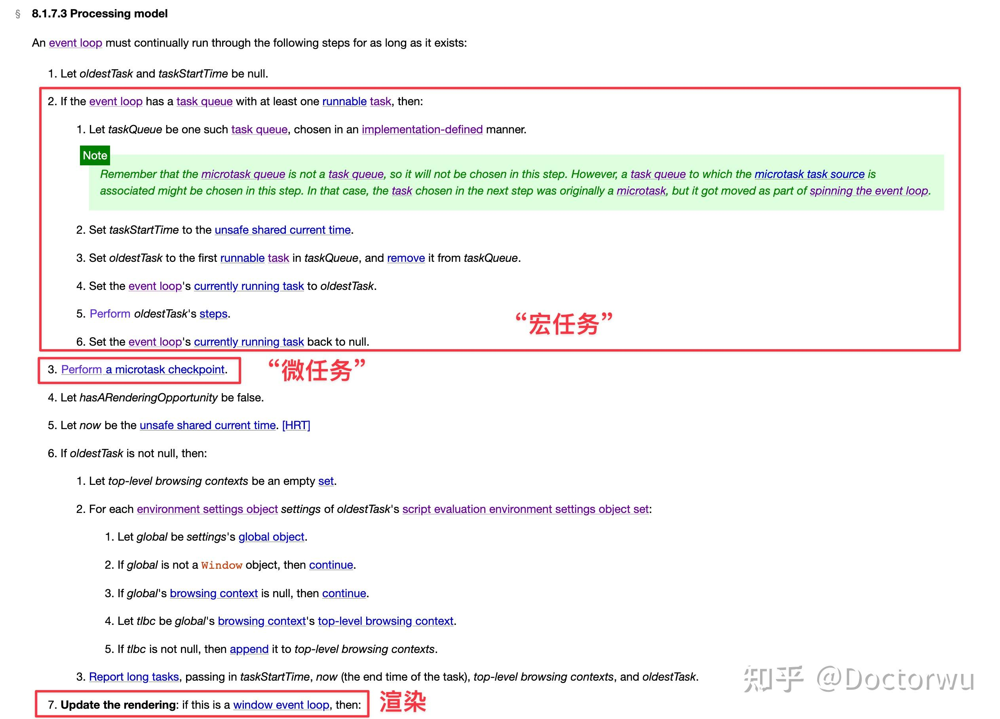

JS 是运行在 Renderer 进程中的 render 线程(也被称之为 Renderer进程的主线程中)的。

当浏览器解析到 JS 代码时会把 JS 的代码丢进 V8 实例中去跑，并且执行 JS 代码的时候是没办法执行渲染的。那么调度这些行为的是谁呢，答案是 Event loop。

> To coordinate events, user interaction, scripts, rendering, networking, and so forth, user agents must use event loops as described in this section. Each [agent](https://link.zhihu.com/?target=https%3A//tc39.es/ecma262/%23sec-agents) has an associated event loop, which is unique to that agent.

[HTML5 规范关于 event loop 的描述](https://link.zhihu.com/?target=https%3A//html.spec.whatwg.org/multipage/webappapis.html%23concept-agent-event-loop%3A~%3Atext%3DTo%2520coordinate%2520events%252C%2520user%2520interaction%252C%2520scripts%252C%2520rendering%252C%2520networking%252C%2520and%2520so%2520forth%252C%2520user%2520agents%2520must%2520use%2520event%2520loops%2520as%2520described%2520in%2520this%2520section.%2520Each%2520agent%2520has%2520an%2520associated%2520event%2520loop%252C%2520which%2520is%2520unique%2520to%2520that%2520agent)

后面出篇文章专门来讲讲 (挖个坑)