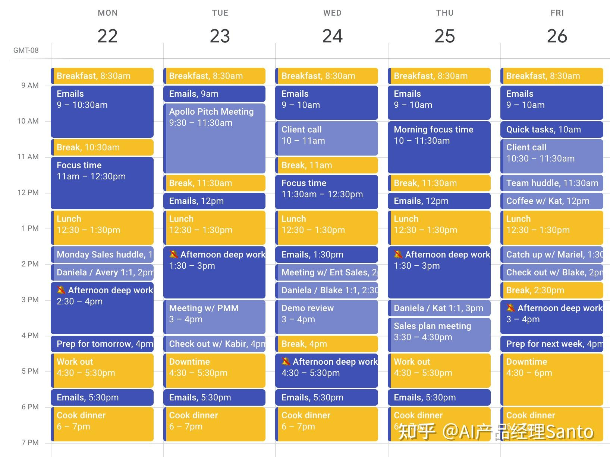
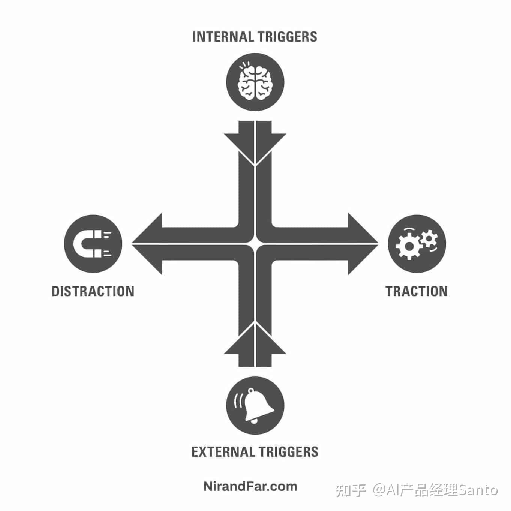

**应用稚晖君的时间管理方法，确实可以帮助你有效的节省时间。**

这里我把之前他直播中，对于时间管理的看法引用到这里。[^1]

提问者——

大家都惊讶于你可以很好的平衡工作和兴趣，请问您是如何进行时间管理的？  

下面是稚晖君的回答——

> “时间管理”这个词有点过分了，其实，也没有什么管理技巧啦。工作效率或者说学习效率，这个东西是相对的。  
> 大家觉得我工作效率、学习效率很高，但是我看一些真正的“神仙”的工作效率，我自己也自叹不如。  
> 比如我偶像**马斯克，人家今天造火箭，明天造卫星，然后还在地球上卖汽车**，卖得还贼好，是吧。那这种人你和他比效率怎么比

前面谦虚的铺垫了下，其实他比较推崇马斯克的时间管理法，后面我也整理了下更为方法论的内容。然后，他提到了自己的一些情况，也确实是这么实践的——

> 所以我觉得这个也看大家自己的情况吧。**在你自己的领域，做你自己擅长的事情**，就会做的非常好。但是你让我换一个领域，我做别的事情，我效率也并不一定有这么高。  
> 然后我自己个人同时做多个事情或多个项目，方法的话，就跟RTOX，抢占式调度有点像。就是**排优先级，先把优先级最高的事情做好**，不管后面的事情。做好之后，你再做第二高优先级的。然后就依次这样去完成。  
> 因为你在做最高优先级事情的时候，你会想到后面还有这么多事情，这么多“锅”没有处理好，你就会有**“Deadline”的紧张感，能促进你的效率**。

  

下面我把稚晖君提到内容的背景梳理出来，**其实所有时间管理的核心是，你需要引入一个重要的元素：时间。**

**任务需要跟时间关联起来。你必须想清楚如何完成一项任务，需要花费多长时间。**

  

**方法一、Time-Blocking：排优先级，先把优先级最高的事情做好**

Time-Blocking（时间保护）是一种**为日程安排里面的任务设定时间的方法**。把每一天分成几个时间块/时间段，然后给每块时间分配任务。可帮助你摆脱困境、停止拖延并继续推进项目。它为需要注意的任务腾出时间和空间。**这是一种将项目时间分解为更小部分的方法**，因此更容易开始并取得稳步进展。

你可以设置带有开始时间和结束时间的时间块**来处理特定活动的优先级**。你可以专注于一个困难的、高收益的项目，比如战略营销计划，或者批处理类似的低级任务，比如回复电子邮件和回电话。如果出现真正的紧急情况和意外延误，你可以移动任务在时间段的优先级。如果您需要更多时间来完成任务，您可以安排新的时间块。

安排时间块不仅仅是制定待办事项清单。它告诉你你将**在什么时候完成一项任务，在什么情况下，在什么情况下，以及多长时间**。它鼓励您采取深思熟虑的行动步骤并阻止干扰和干扰。

埃隆· 马斯克（Elon Musk），比尔·盖茨（Bill Gates）或卡尔·纽波特（Cal Newport），是的

——他们全都是时间保护的使用者。而且他们之所以这么做并不是因为他们喜欢自己做计划，而是为了榨干自己每一天的时间。

[【教程】13.Roam时间管理：时间保护（Time-Blocking）](https://www.zhihu.com/zvideo/1337042647425228800)

  

**方法二、Time-Boxing：“Deadline”的紧张感，能促进你的效率**

  

时间保护是为项目腾出时间。它磨练你的注意力，以满足最高的质量标准。**时间框（Time-Boxing）**限制了你花在一个项目上的时间。它促使您完成符合可接受标准的项目。

**时间框** 帮助你保持在一定时间范围内工作，避免完美主义，并按时完成和交付项目。它对往往需要很长时间才能完成的项目施加了时间限制。它利用了帕金森定律，该定律指出工作会扩展以填补为完成分配的时间。有一个停止工作的截止时间会让你更加注意你带来的价值，而不是你投入的时间。

时间框可以短至 15 分钟到几个月，具体取决于活动或项目。一个项目可能需要一两个步骤，而另一个项目则需要数百个步骤。时间表包含项目里程碑、截止日期和可交付成果。

马斯克推崇的“Time Boxing”工作法，**关注的核心不是什么时刻做这件事，而是做这件事花费的时长**。  
这其实是一种深度工作的理念。大多数人制定工作都是多任务平行切换的。在这个切换过程中，上一个事件可能都没有完全收尾，就要调整进入另一件事的状态，这样切换是有专注力的损耗的。  
  
同时，马斯克深谙 Deadline 才是第一生产力的道理，给每项任务安排足够且最少的时间，这样就**让自己时刻处于 Deadline 临近的影响下，这样效率也最高。**  

  

**方法三、在你自己的领域，做你自己擅长的事情**

其实稚晖君说的最重要的，是在你自己的领域，做你擅长的事情。**我们很多人的问题，在于不知道自己该干什么。**

**如果稚晖君的天才称之为天才，我觉得他清楚自己想做什么，并付出了时间，获取了成果。**

脱离校园进入社会，从20岁到30岁，甚至许多人一辈子也没有解决。只能沉浸在奶头乐的世界里，用最单调的奖励机制刺激自己。

不知道自己干什么，一直处于一种被动模式，由父母、学校、公司、领导、社会来定义自己，是很多痛苦情绪的根源。

定义自己的“Block”，设定你的领域，**这就是最简单有用的“时间管理”。**

  

* * *

我是Santo，会保持分享更多时间管理、知识管理的方法。请关注~

[^1]: 请问您是如何进行时间管理的？ilibili.com/read/cv6408054 出处：bilibili https://www.bilibili.com/video/BV1za4y1Y7wG?spm_id_from=333.999.0.0