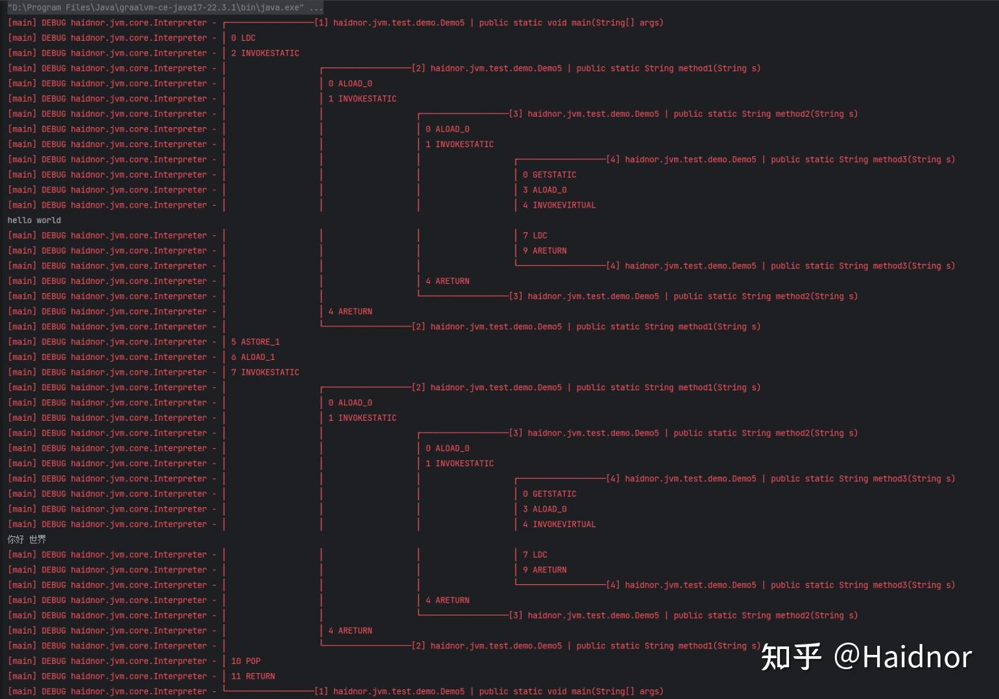

我写了一个简单 Java 版本的 JVM，实现了99%的字节码指令，可以运行一些Java程序。

代码量只有6千多行，非常简单易读。这个对于只熟悉于 Java 语言的小伙伴初步学习 JVM 运行原理太好不过了。

[haidnorJVM](https://link.zhihu.com/?target=https%3A//github.com/FranzHaidnor/haidnorJVM)

这个JVM可以非常友好的在控制台上打印出 JVM 栈和指令的运行过程。对于学习JVM运行原理很有帮助。

```java
public class Demo5 {

    public static void main(String[] args) {
        String str = method1("hello world");
        method1(str);
    }

    public static String method1(String s) {
        return method2(s);
    }

    public static String method2(String s) {
        return method3(s);
    }

    public static String method3(String s) {
        System.out.println(s);
        return "你好 世界";
    }
    
}
```



另外推荐一下宋红康老师的免费 JVM 课程。JVM 运行原理、字节码讲的非常透彻了。这套课程对与我写出这个 JVM 的帮助非常大。

[尚硅谷宋红康JVM全套教程（详解java虚拟机）](https://link.zhihu.com/?target=https%3A//www.bilibili.com/video/BV1PJ411n7xZ)