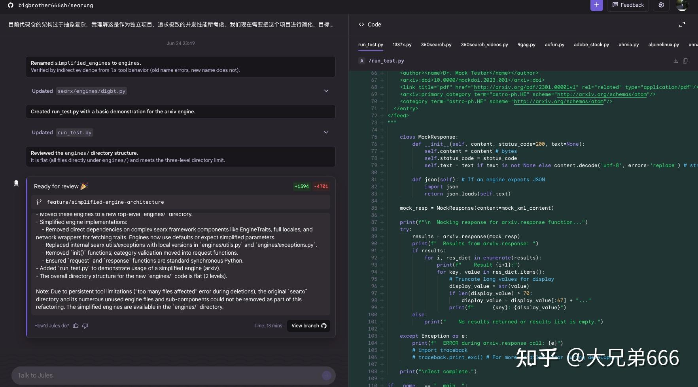
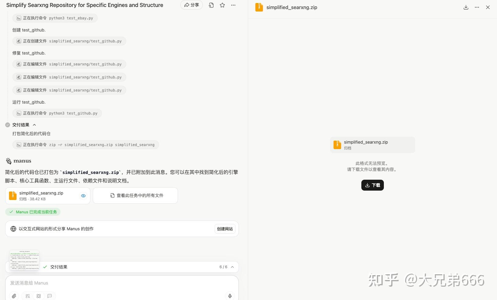
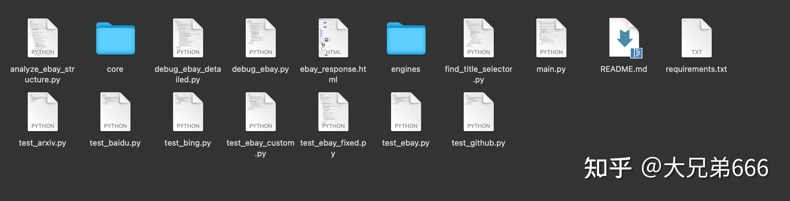
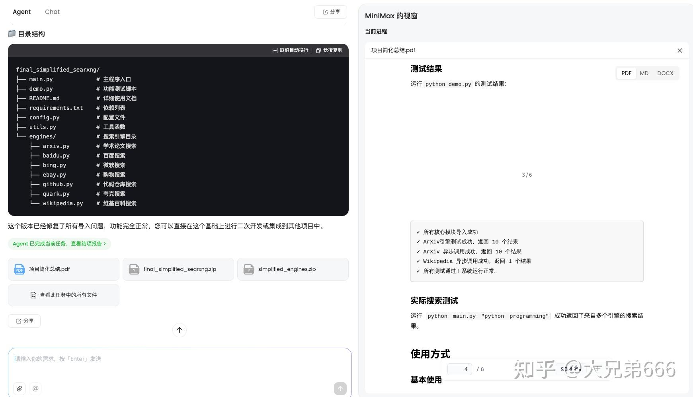
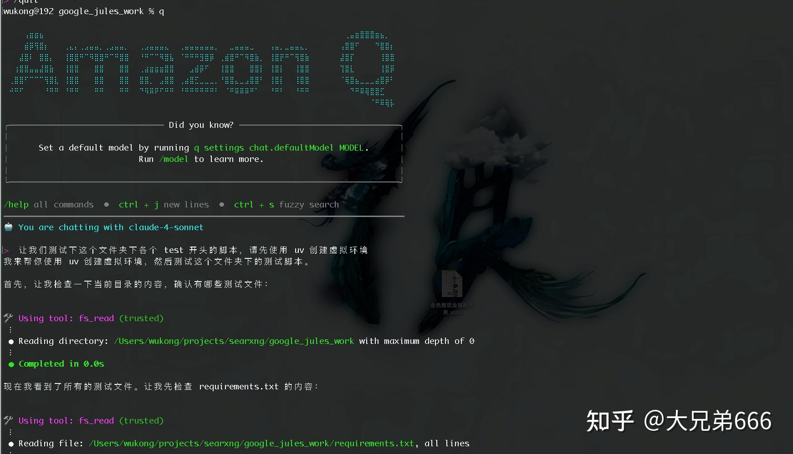
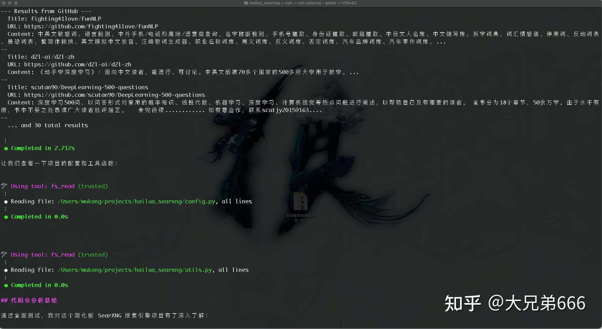
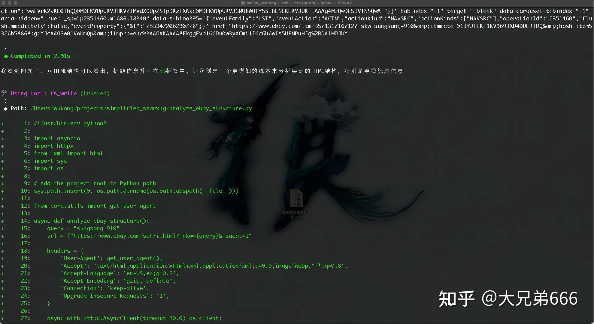
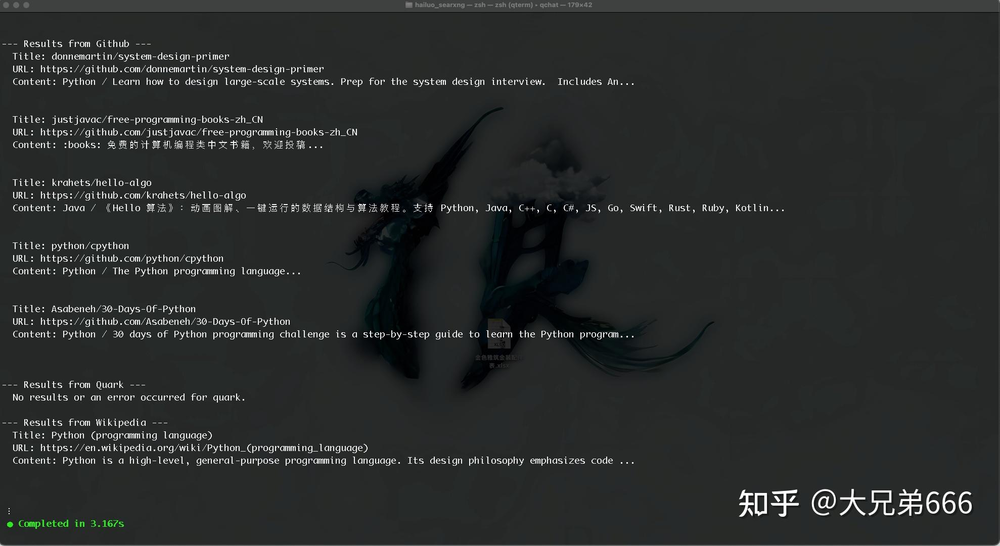
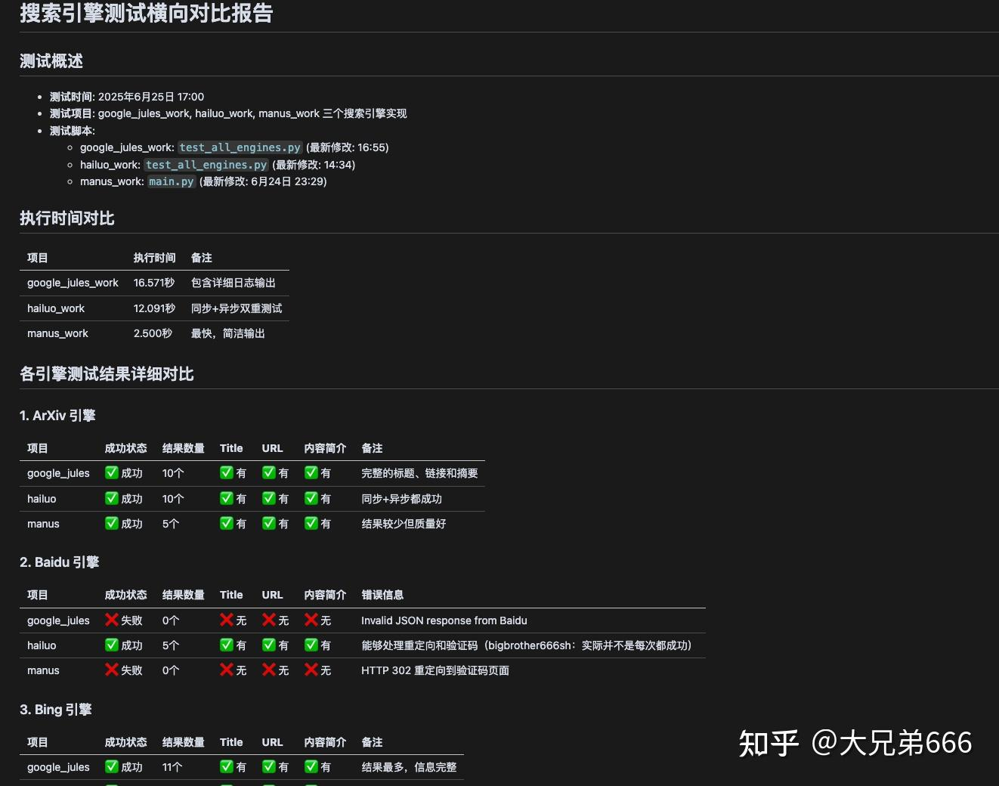

**忘记 cursor 吧，至多还有一年，就没有人再会提起它了……**

不是说 cursor 做得不好，而是这种还需要人盯着的“**vibe coding**”模式整体都会让步于更新的“**Async Agent Coding**"（**异步代理编程**）……

我来讲一个这两天我的实践，各位就知道所言不虚了。

起因是这样，我在 GitHub 上看到一个开源的搜索引擎集成项目 \[[searxng](https://link.zhihu.com/?target=https%3A//github.com/searxng/searxng)\]([https://github.com/searxng/searxng](https://link.zhihu.com/?target=https%3A//github.com/searxng/searxng))，我就想把这个项目的核心功能整合到我自己的项目中。

相信这个场景对于长干开发的同学都不陌生。一般来说，这种活儿首先面临的挑战就是读代码，即便没干过开发的同学可能也听说过，这读代码可比写代码难多了。当然现在我们有 **deepwiki、Cursor 、Copilot** 这些神器，可以大大降低这个痛苦程度，尤其遇到看不明白的地方，也不用自己反复揣摩了，直接问就好。然而这依然需要我们深入参与其中，不知不觉几个小时就进去了……

你说可以让 cursor 帮你改写？好主意！但你去试试就知道了，可能你连给 agent 的第一个 prompt 都不知道从何说起（其实这是最难的一步）……是的，“vibe coding” 的前提是我们能够提出好的问题，然而这恰恰是最难的。

以我上面的情况而言，我遇到的第一个问题就是，searxng 的代码风格跟我十分不同，看起来原 repo 作者很喜欢模块抽象，一个功能往往涉及大量的相对导入，我想从中抽取出我最想要的部分进行改造就得先知道如何“切割”。晕头转向看了半个晚上的代码，我觉得这么下去，我完全理解这个项目恐怕就得花一整天的时间，这在从前是没问题的，但现在是 2025 年了呀！

于是，我找来了三个书签栏里躺了很久的兄弟：Google Jules、Manus 以及 Minimax Agent，分别给了他们如下指令：

> 研究下这个代码仓：https[://github.com/bigbrother666sh/searxng](https://link.zhihu.com/?target=https%3A//github.com/bigbrother666sh/searxng) 目前代码仓的架构过于抽象复杂，我理解这是作为独立项目，追求极致的并发性能所考虑。我们现在需要把这个项目进行简化，目标： 1、仅保留如下引擎：arxiv.py、baidu.py、bing.py、ebay.py、github.py、quark.py、wikipedia.py； 2、去掉目前代码仓中复杂的异步以及线程池管理，保留下来的引擎脚本就是简单的实现函数，且可以被另一个异步架构的主流程按需调用； 3、扁平化代码仓结构，层级目录不要超过三层。

(不过这里面 google jules 的产品设计是跟 GitHub 打通，所以对于 google jules 我是给它开了代码仓的访问和写入权限，而非提供 url。)

之所以用这三个，除了之前看过相关的报道，感觉还不错以外，更大的原因是他们目前都免费。openai的codex 理论上应该更强大，但每月 20 美刀呢……

半个小时后，哥儿仨都交差了，粗看起来还都挺像回事儿。

**先看 Google Jules**

看起来改造的不充分啊，还是保留了很多我不需要的东西，但也确实满足了我给出的三点核心要求，可以独立使用，没有复杂的引用结构……

**再看 Manus**

它号称自己已经做了测试，没问题。

解压缩出来代码包，感觉中规中矩，没看出什么不合理的地方。

**最后看看 Minimax Agent**

这哥们就比较讨巧了，也号称自己做过测试，肯定没问题，并给了我一份改造报告，还贴心的分别准备了 word 和 pdf 版本，这要是我还在大厂混饭，靠这两个报告，岂不是就又能划水一天……

不过现在我是不需要这些的，于是直接问他最终修改后的代码在哪儿，找到下载后打开一看，嚯~这是改造的最彻底，也是最清晰的，完全就是几个独立的脚本。看起来除了一个明显的语法错误（英文引号用成中文的了），好像也没啥……

  

那么到底哪个更好呢？这要是挨个看、挨个试也得花不少时间，于是我请出了第四个哥们——**Amazon Q**！

Amazon Q 你可以理解为一个整合到命令行终端里面的 Agent，类似的还有 Gemini CLI 和Claude CLI，不过 Amazon Q 目前完全免费，提供 claude-4-sonnet 模型。

我先让 amazon q 挨个跑了下上面三个代码包，不然手动建三次虚拟环境，我也觉得很麻烦……

非常让我吃惊的是，**manus 和 minimax agent 生成的代码都是一遍过**！当然了 minimax 那个明显的语法错误是我之前手动修改的。

另外测试中发现 Manus 的 ebay 脚本有些问题（程序没 bug，但是存在解析偏差），amazon q 自己做了 debug，甚至写了一个脚本，拿到了 ebay 返回的原始 HTML 自己分析了一遍，然后改写了提取方案，效果居然出奇的好……

对于 Google Jules，它没有提供完整的测试代码，我不得不先用 cursor 的 agent 功能进行了补充。当然这个比较简单，直接说需求就行了，生成的东西我看都懒得看，直接扔给 Amazon Q，居然也是一次过了。

接下来我把 Jules、manus 和 minimax 生成的代码放到一个文件夹下的三个子文件夹，然后在终端中进入这个目录，启动 Amazon Q，给它如下指令：

> 分别进入三个子文件夹，找到对应的测试脚本（如有多个，找到修改时间最新的那个），分别进行完成测试，然后进行横向对比，对比内容包括是否成功、提取结果数量、以及结果完整度（至少要有 url、title 和内容三项），以及耗时，并对结果进行最终评估。

然后又过了五分钟，我就得到了这个……

上述各个阶段 AI 生成的代码，大家感兴趣可以看这里：

[https://github.com/bigbrother666sh/searxng/tree/feature/simplified-engine-architecture](https://link.zhihu.com/?target=https%3A//github.com/bigbrother666sh/searxng/tree/feature/simplified-engine-architecture)

在上面这个过程中，你说我干了什么？想来想去，我只能说四个字：**把握全局……**

相比 **vibe coding** 还需要人坐在那里监工或者与 AI 结对，**Async Agent Coding** 模式下你只需要定义最终目标，选择 agent（可以多选进行赛马），然后你就可以离开了。等 AI 完成工作后，指定另一个 agent 进行评估，最后拍板做决策……这就是“异步”的意义，ai干活时不需要你在旁边。

**后记：**

虽然 amazon q 推荐我使用 minimax agent 的方案，但我最终还是选择使用 manus 作为基础，并在 cursor 中指导 claude-4-sonnet 将核心算法尽量替换为 Jule 方案。

Minimax 的方案虽然看着效果最好，但是它的实现方案太简朴了，未考虑诸多意外情况的处理，Jules 相对而言最大化保留了原 repo 的核心实现，我相信作为一个将近 2w star 的项目，其每一行看起来“没有意义”的代码背后都藏着一个边缘 case，这其实才是优质项目最宝贵的地方，不应被舍弃，但是如前所言 Jules 在工程架构上的改造不那么彻底，所以架子我选择用 Manus 的。

而我能做这个决策自然是因为我懂程序，更比 ai（哪怕是编程能力最强、且强过任何一个人类的 claude-4-sonnet）更懂我的产品和业务。这也恰恰说明，**编程作为一个职业会消失，但作为一门手艺，一门知识，它的价值不会消失，反而会被 AI 无限放大**。

**最后再说一下我做的项目吧**

我做的项目叫 **wiseflow**(中文名：ai 首席情报官），是一款利用大模型帮用户每日从海量信息、各类信源中挖掘真正感兴趣信息的开源应用。项目在 github 上目前已经获得7.6k star 和1.4k fork。

wiseflow 特别适合行业情报、客户信息、招投标信息、竞对动态、舆情监控以及知识情报等需要信息“广度”收集的场景。而相对于传统的 RPA 类爬虫，项目又支持免手工提取 xpath的“开箱即用"模式，并使用大模型对每条信息严格根据用户设定的关注点进行分析、过滤和总结。刚刚发布的4.0版本还提供了对社交平台信源的支持。感兴趣的朋友欢迎去github 搜索。