非常优秀的一款脚手架，开源免费，算是比较早期的项目了。虽然也被很多人抱怨代码质量一般，但若依确确实实给很多中小公司带来了不少便利，很多公司的项目都是基于若依来开发的。

2年前，我整理了一份常见的Java脚手架项目，其中若依好评度非常高，很多人也是对其抱着感谢的态度。

最重要的是，若依带动了Java脚手架的发展。Gitee 上你就用 RuoYi 为关键词搜索，就能搜到很多基于 RuoYi 的优秀脚手架。

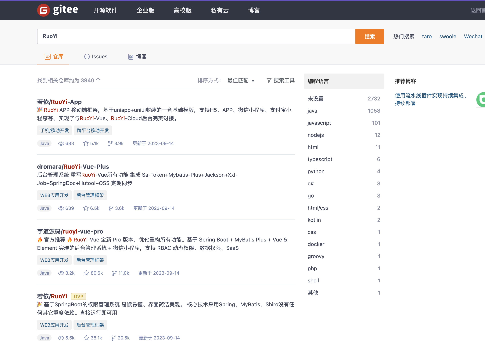

顺带分享一下我之前整理的Java优质脚手架！也可以去我的网站上看：[Java 优质开源实战项目](https://link.zhihu.com/?target=https%3A//javaguide.cn/open-source-project/practical-project.html) 。

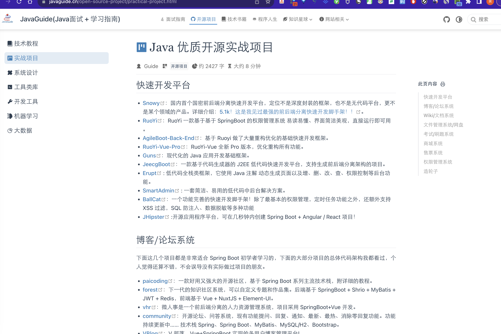

## **BallCat**

**推荐指数** ：⭐⭐⭐⭐

### **简介**

-   一款开箱即用的快速开发脚手架，通过依赖的方式引入所需的模块即可使用。
-   功能全面，包括但不限于定时任务，访问日志，操作日志，异常日志，统一异常处理，XSS 过滤，SQL 防注入，国际化。
-   后端基于Spring Boot + Spring Security + Spring Security OAuth2 + Mybatis Plus + Hutool，前端有 React 和 Vue 两个版本。

**相关地址：**

-   Github 地址：[https://github.com/ballcat-projects/ballcat](https://link.zhihu.com/?target=https%3A//github.com/ballcat-projects/ballcat)
-   Gitee 地址：[https://gitee.com/ballcat-projects/ballcat](https://link.zhihu.com/?target=https%3A//gitee.com/ballcat-projects/ballcat)
-   文档地址：[http://www.ballcat.cn/](https://link.zhihu.com/?target=http%3A//www.ballcat.cn/)

### **推荐理由**

-   项目技术主流
-   功能全面
-   维护频繁
-   功能完全开源

### **适合场景**

适合于单体架构的企业级项目开发场景。

### **效果展示**

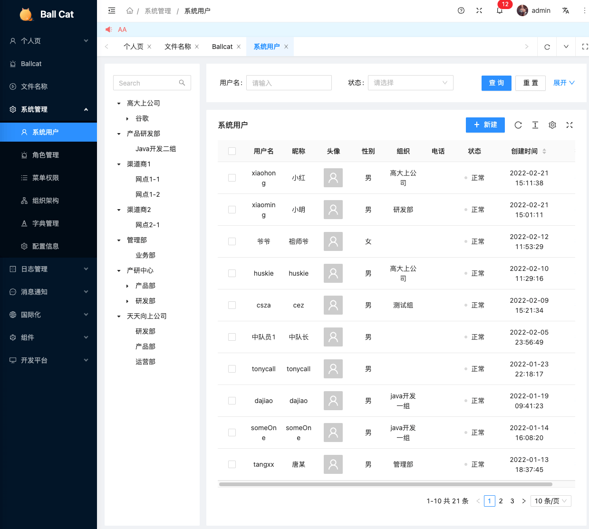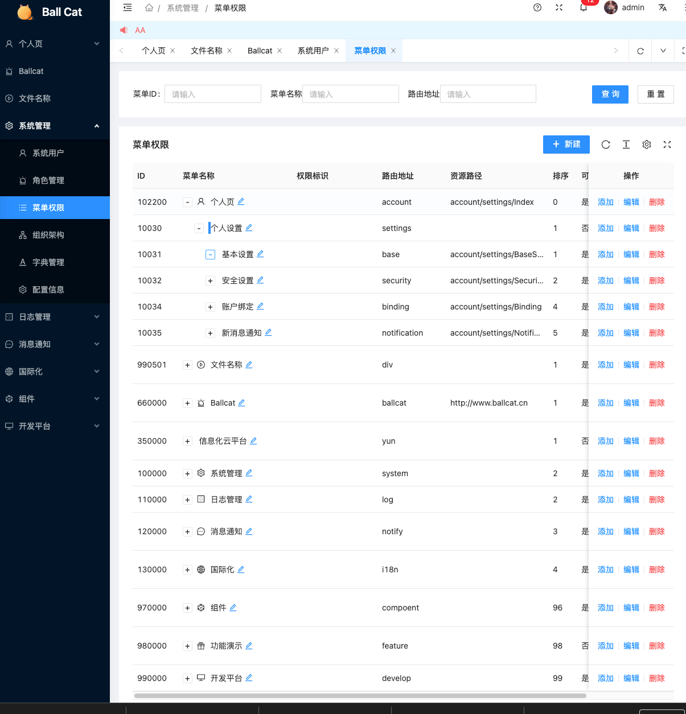

## **Guns**

**推荐指数** ：⭐⭐⭐⭐⭐

### **简介**

我在上大学的时候就了解和接触过了这个项目，当时我还是一个 Spring 入门不太久的小菜鸟。一晃，不经意间已经过去快 4 年了，时间如流水啊！

-   基于 Spring Boot2.0+版本开发，并且支持 Spring Cloud Alibaba 微服务。
-   功能包含系统管理，代码生成，多数据库适配，SSO 单点登录，工作流，短信，邮件发送，OAuth2 登录，任务调度，持续集成，Docker 部署等功能；
-   企业版功能更多，并且提供了完善的开发文档，开发 demo，快速入门。
-   后端基于Spring Boot ++ Mybatis Plus + Hutool，前端基于 Vue + Antd Vue。

**相关地址：**

-   项目地址 ： [https://gitee.com/stylefeng/guns](https://link.zhihu.com/?target=https%3A//gitee.com/stylefeng/guns)
-   项目官网 ：[https://www.stylefeng.cn/](https://link.zhihu.com/?target=https%3A//www.stylefeng.cn/)

另外，这个项目还提供了视频教你如何使用，地址：[https://www.bilibili.com/video/av56718207](https://link.zhihu.com/?target=https%3A//www.bilibili.com/video/av56718207) 。

### **推荐理由**

-   项目技术主流
-   模块化内核，插件式架构，插件之间采用低耦合设计，可灵活装配数十种插件功能
-   支持多数据源
-   社区活跃
-   项目功能完善，满足企业绝大部分场景开发需求，并且额外提供了持续集成，Docker 部署等功能。
-   ......

### **适合场景**

适合企业后台管理网站的快速开发场景，不论是对于单体和微服务都有支持。

### **效果展示**

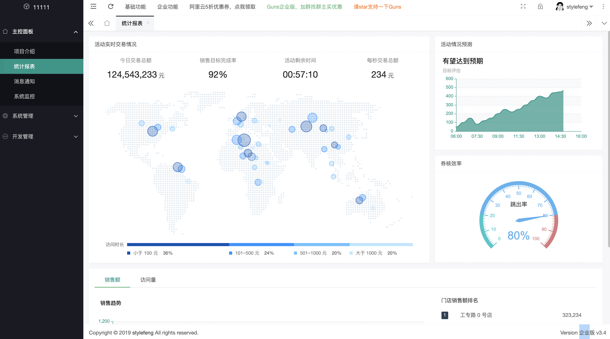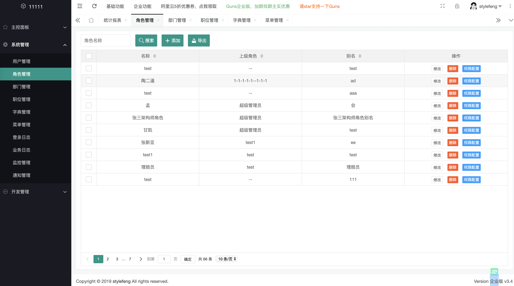

## **pig**

**推荐指数** ：⭐⭐⭐⭐⭐

### **简介**

-   基于 Spring Cloud Hoxton 、Spring Boot 2.2、 OAuth2 的 RBAC 权限管理系统。
-   基于数据驱动视图的理念封装 element-ui，即使没有 vue 的使用经验也能快速上手。
-   提供对常见容器化支持 Docker、Kubernetes、Rancher2 支持。
-   提供 lambda 、stream api 、webflux 的生产实践。

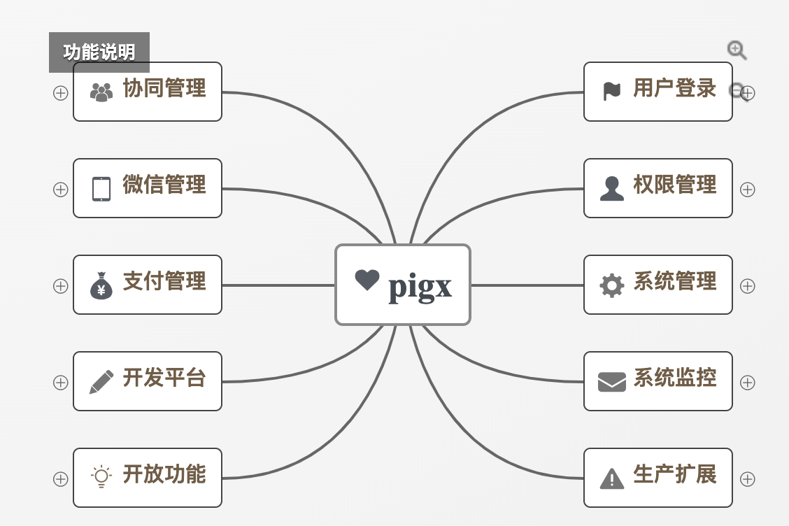

-   项目地址：[https://gitee.com/log4j/pig](https://link.zhihu.com/?target=https%3A//gitee.com/log4j/pig)
-   官网地址： [https://pig4cloud.com/](https://link.zhihu.com/?target=https%3A//pig4cloud.com/)

### **推荐理由**

-   社区活跃；
-   提供了 Spring Cloud Hoxton & Alibaba 的微服务版本；
-   权限管理做得不错！
-   功能完全开源！
-   支持第三方系统比如 guns、renren 接入
-   ......

### **适合场景**

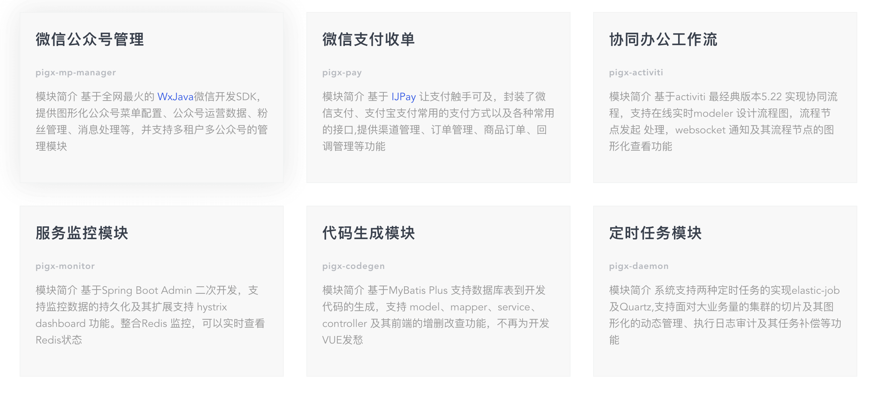

### **效果展示**

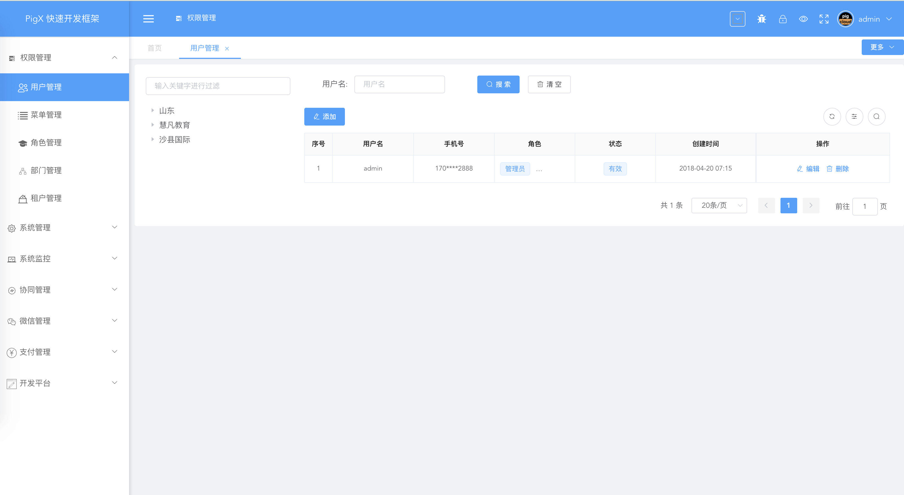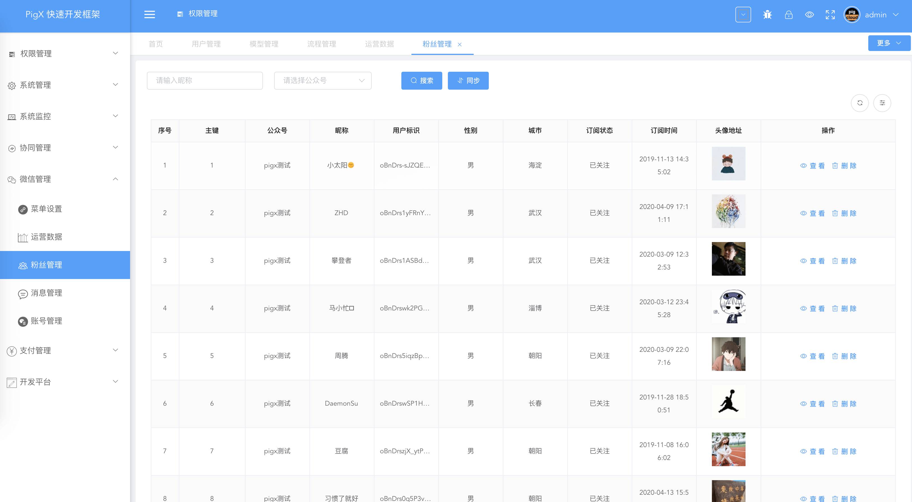

## **RuoYi**

**推荐指数** ：⭐⭐⭐⭐

### **简介**

-   RuoYi 一款基于基于 SpringBoot+Shiro 的权限管理系统易读易懂、界面简洁美观，直接运行即可用 。
-   提供了基于 Spring Cloud & Alibaba 微服务架构的版本

作者是这样介绍这个项目的：

> 一直想做一款后台管理系统，看了很多优秀的开源项目但是发现没有合适的。于是利用空闲休息时间开始自己写了一套后台系统。如此有了若依。她可以用于所有的 Web 应用程序，如网站管理后台，网站会员中心，CMS，CRM，OA。所有前端后台代码封装过后十分精简易上手，出错概率低。同时支持移动客户端访问。系统会陆续更新一些实用功能。  
> 性别男，若依是给还没有出生女儿取的名字（寓意：你若不离不弃，我必生死相依）  

**相关地址：**

-   项目地址 ：[https://gitee.com/y\_project/RuoYi](https://link.zhihu.com/?target=https%3A//gitee.com/y_project/RuoYi)
-   文档地址 ：[http://doc.ruoyi.vip/](https://link.zhihu.com/?target=http%3A//doc.ruoyi.vip/)
-   官网地址：[http://ruoyi.vip/](https://link.zhihu.com/?target=http%3A//ruoyi.vip/)

### **推荐理由**

-   提供了多种版本：单体、前后端分离、微服务（即将开源）
-   提供的功能齐全，覆盖大部分场景需求
-   提供的文档丰富便于上手和学习
-   生态系统丰富提供了多种版本
-   采用主流框架比如 SpringBoot、Shiro、Thymeleaf、Vue、Bootstrap
-   ......

### **适合场景**

适用于所有的 Web 应用程序，如网站管理后台，网站会员中心，CMS，CRM，OA。

### **效果展示**

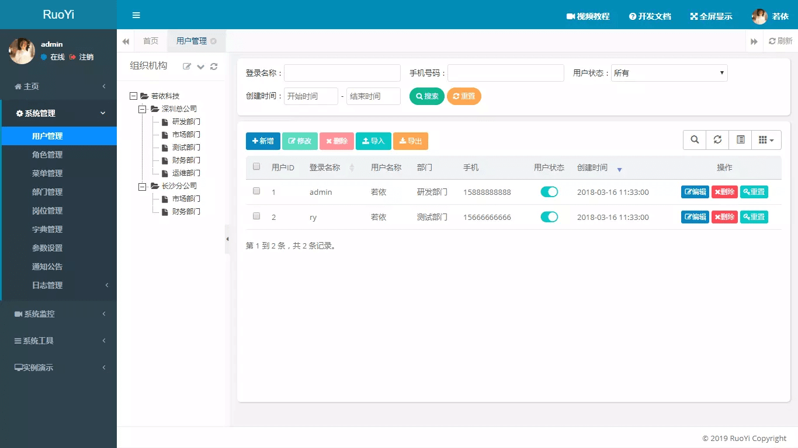

## **JeecgBoot**

**推荐指数** ：⭐⭐⭐

### **简介**

-   JeecgBoot 是一款基于代码生成器的 J2EE 低代码快速开发平台。强大的代码生成器让前后端代码一键生成，无需写任何代码!
-   后端框架为主流的 SpringBoot 2.x，前端为主流的 Ant Design&Vue。另外，还用到了 Mybatis-plus 数据库层面的框架，以及 Shiro 和 JWT 做身份认证和权限管理。

**相关地址：**

-   项目地址：[https://gitee.com/jeecg/jeecg-boot](https://link.zhihu.com/?target=https%3A//gitee.com/jeecg/jeecg-boot)
-   在线演示 ： [http://boot.jeecg.com](https://link.zhihu.com/?target=http%3A//boot.jeecg.com/)
-   技术官网： [http://www.jeecg.com](https://link.zhihu.com/?target=http%3A//www.jeecg.com/)

整个项目的技术架构如下图所示，README 文档已经贴好了，我就直接复制过来了。

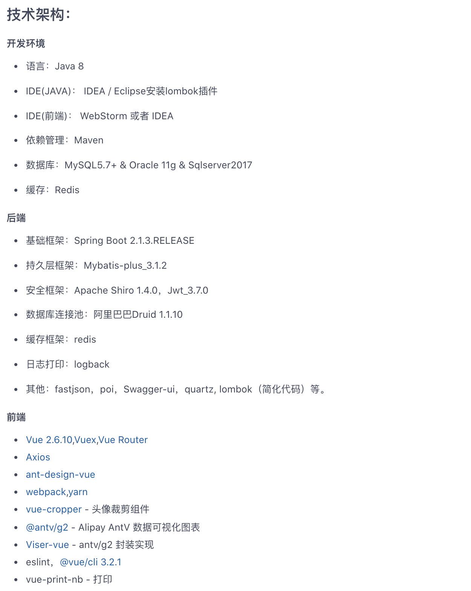

### **推荐理由**

-   采用主流框架，前后端分离，对开发比较友好；
-   用户管理和权限权利模块做的非常好，满足绝大部分人员管理场景的需求。权限控制采用 RBAC（Role-Based Access Control，基于角色的访问控制） ，支持菜单动态路由。
-   提供了 Excel 导入导出、报表工具等必备功能。
-   自带消息中心，支持短信、邮件、微信推送等等。
-   页面校验自动生成(必须输入、数字校验、金额校验、时间空间等);
-   平台 UI 强大，实现了移动自适应，无需再为移动端适配；
-   ......

### **适合场景**

Jeecg-Boot 快速开发平台，可以应用在任何 J2EE 项目的开发中，尤其适合企业信息管理系统（MIS）、内部办公系统（OA）、企业资源计划系统（ERP）、客户关系管理系统（CRM）等，其半智能手工 Merge 的开发方式，可以显著提高开发效率 70%以上，极大降低开发成本。

### **效果展示**

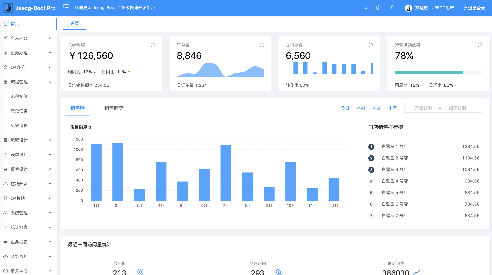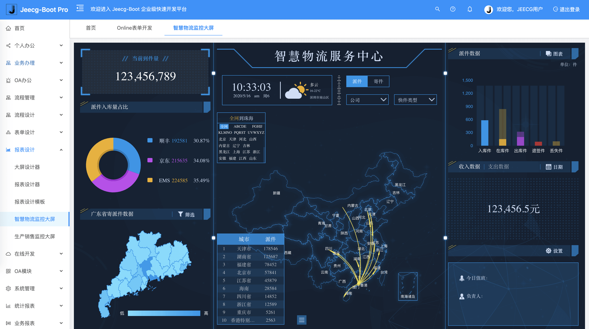

## **eladmin**

**推荐指数** ：⭐⭐⭐⭐⭐

### **简介**

-   一款基于 Spring Boot 2.1.0 、 Jpa、 Spring Security、redis、Vue 的前后端分离的后台管理系统。
-   采用分模块开发开发方式。
-   支持一键生成前后端代码，支持动态路由。

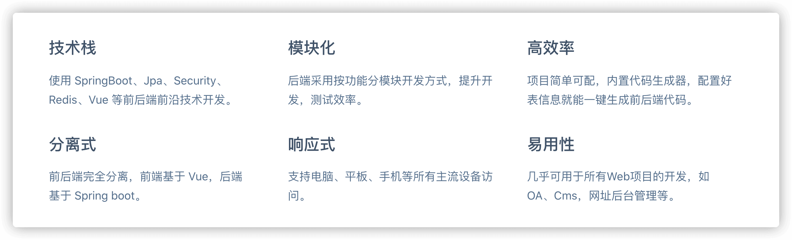

**相关地址** ：

-   Github 地址：[https://github.com/elunez/eladmin](https://link.zhihu.com/?target=https%3A//github.com/elunez/eladmin)
-   官网：[https://docs.auauz.net/](https://link.zhihu.com/?target=https%3A//docs.auauz.net/)
-   文档：[https://docs.auauz.net/guide/](https://link.zhihu.com/?target=https%3A//docs.auauz.net/guide/)

### **推荐理由**

-   项目基本稳定，并且后续作者还会继续优化。
-   完全开源！这个真的要为原作者点个赞，如果大家觉得这个项目有用的话，建议可以稍微捐赠一下原作者支持一下。
-   后端整理代码质量、表设计等各个方面来说都是很不错的。
-   前后端分离，前端使用的是国内常用的 vue 框架，比较容易上手。
-   前端样式美观，是我这篇文章推荐的几个开源项目中前端样式最好看的一个。
-   权限控制采用 RBAC，支持数据字典与数据权限管理。

### **效果展示**

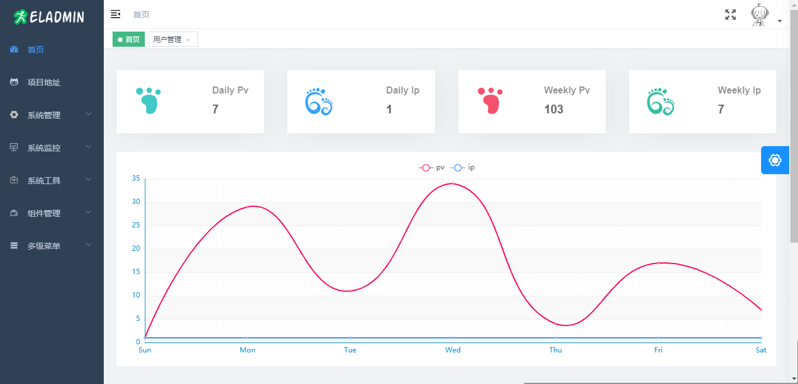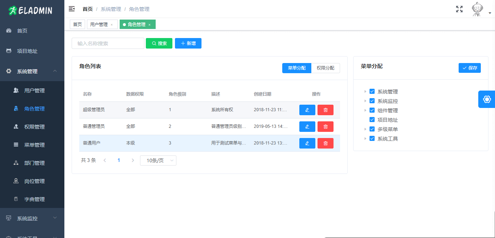

## **renren**

**推荐指数** ：⭐⭐⭐⭐

### **简介**

renren 下面一共开源了两个 Java 项目开发脚手架，分别是:

-   renren-security :采用 Spring、MyBatis、Shiro 框架，开发的一套轻量级权限系统，极低门槛，拿来即用。
-   renren-fast : 一个轻量级的 Java 快速开发平台，能快速开发项目并交付。

renren-security 相比于 renren-fast 在后端功能的区别主要在于：renren-security 提供了权限管理功能，另外还额外提供了数据字典和代码生成器。

**相关地址** ：

-   renren-security ：[https://gitee.com/renrenio/renren-security](https://link.zhihu.com/?target=https%3A//gitee.com/renrenio/renren-security)
-   renren-fast：[https://gitee.com/renrenio/renren-fast](https://link.zhihu.com/?target=https%3A//gitee.com/renrenio/renren-fast)
-   官网：[https://www.renren.io/](https://link.zhihu.com/?target=https%3A//www.renren.io/)

### **推荐理由**

-   被很多企业采用，说明稳定性和社区活跃度不错。
-   微服务版 renren-cloud（这个一般企业也用不上吧！）和 renren-security 需要收费才能正常使用，renren-fast 属于完全免费并且提供了详细的文档，不过，完整文档需要捐赠 80 元才能获取到。

### **效果展示**

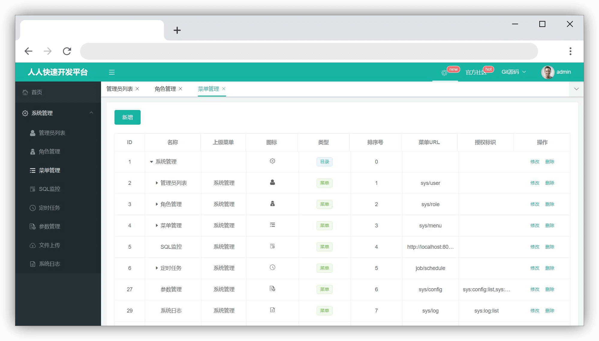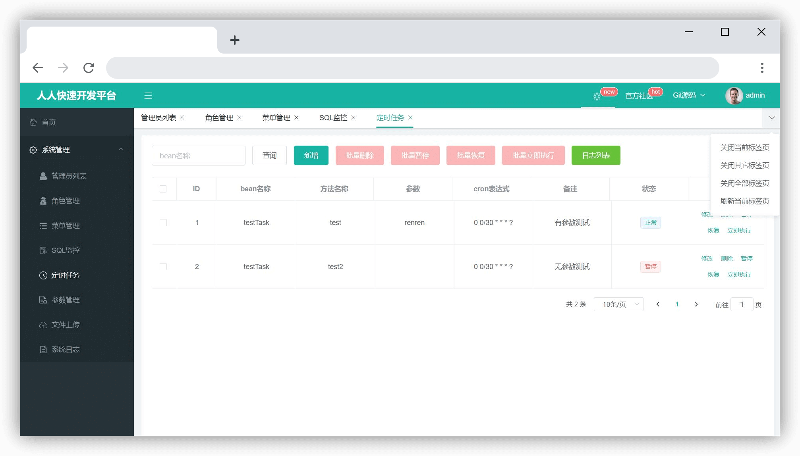

## **SpringBlade**

**推荐指数** ：⭐⭐⭐⭐⭐

### **简介**

-   一个由商业级项目升级优化而来的 SpringCloud 分布式微服务架构、SpringBoot 单体式微服务架构并存的综合型项目。
-   基于 Spring Boot 2 、Spring Cloud Hoxton 、Mybatis 等框架开发。
-   采用 Java8 API 重构了业务代码，完全遵循阿里巴巴编码规范。

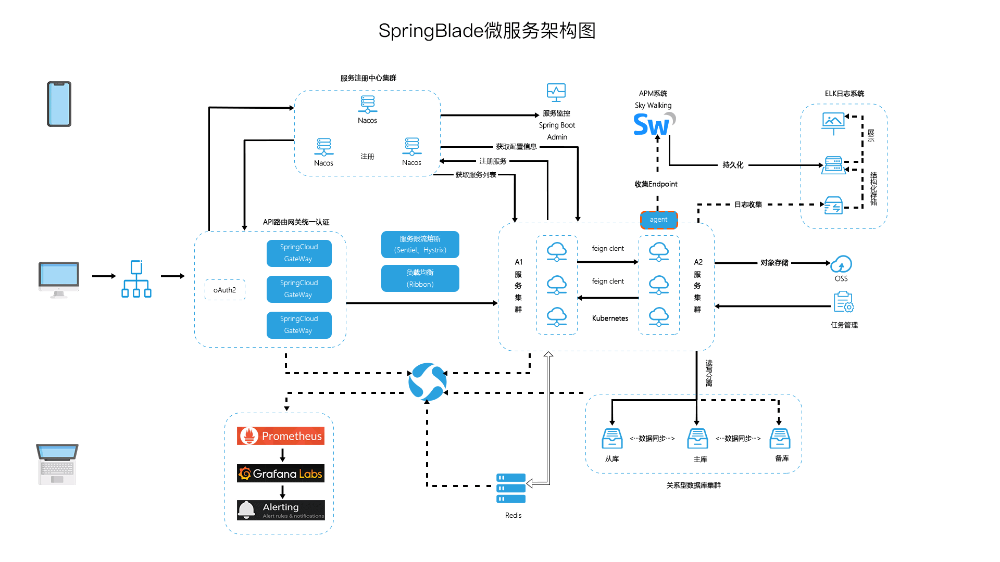

**相关地址** ：

-   后端 Gitee 地址：[https://gitee.com/smallc/SpringBlade](https://link.zhihu.com/?target=https%3A//gitee.com/smallc/SpringBlade)
-   后端 Github 地址：[https://github.com/chillzhuang/SpringBlade](https://link.zhihu.com/?target=https%3A//github.com/chillzhuang/SpringBlade)
-   后端 SpringBoot 版：[https://gitee.com/smallc/SpringBlade/tree/2.0-boot/](https://link.zhihu.com/?target=https%3A//gitee.com/smallc/SpringBlade/tree/2.0-boot/)

### **推荐理由**

-   允许免费用于学习、毕设、公司项目、私活等。 如果商用的话，需要授权，并且功能更加完善。
-   前后端分离，后端采用 SpringCloud 全家桶，单独开源出一个框架：[BladeTool](https://link.zhihu.com/?target=https%3A//github.com/chillzhuang/blade-tool) （感觉很厉害）
-   集成 Sentinel 从流量控制、熔断降级、系统负载等多个维度保护服务的稳定性。
-   借鉴 OAuth2，实现了多终端认证系统，可控制子系统的 token 权限互相隔离。
-   借鉴 Security，封装了 Secure 模块，采用 JWT 做 Token 认证，可拓展集成 Redis 等细颗粒度控制方案。
-   项目分包明确，规范微服务的开发模式，使包与包之间的分工清晰。

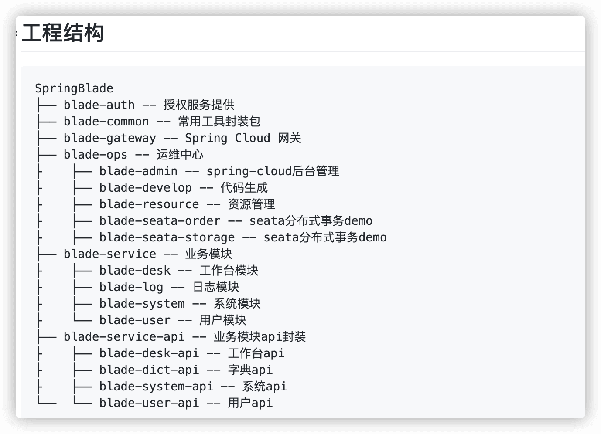

### **效果展示**

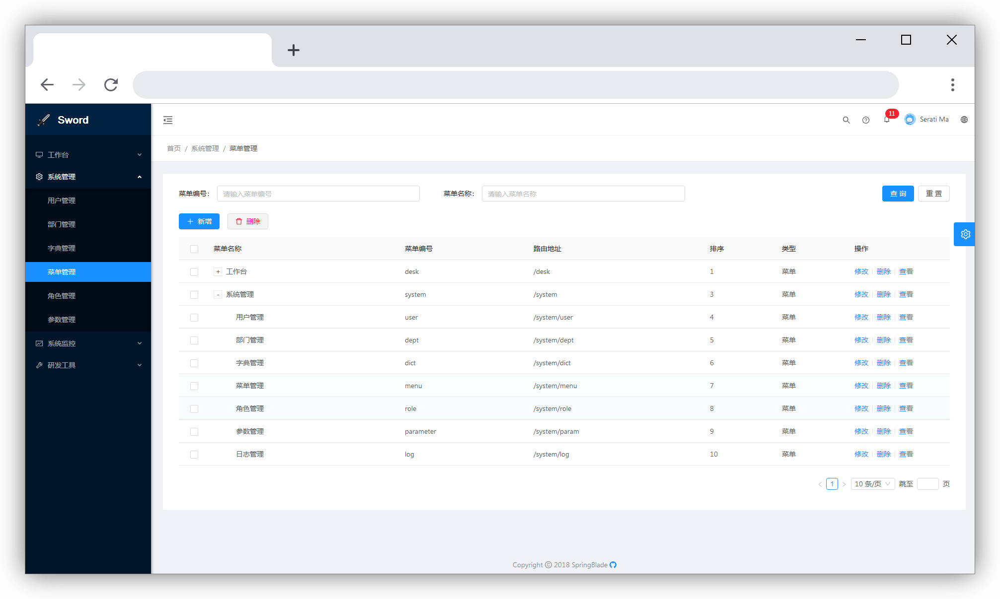