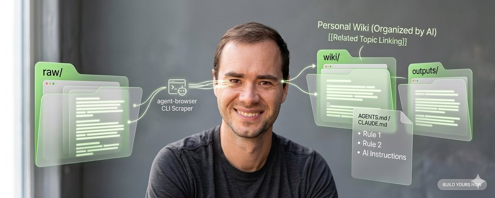
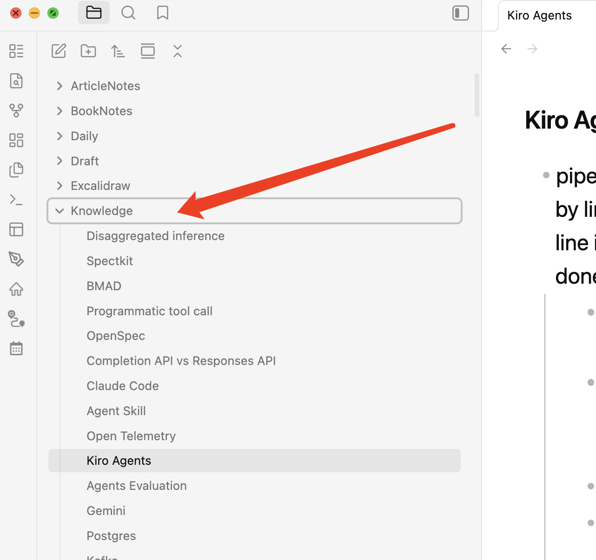
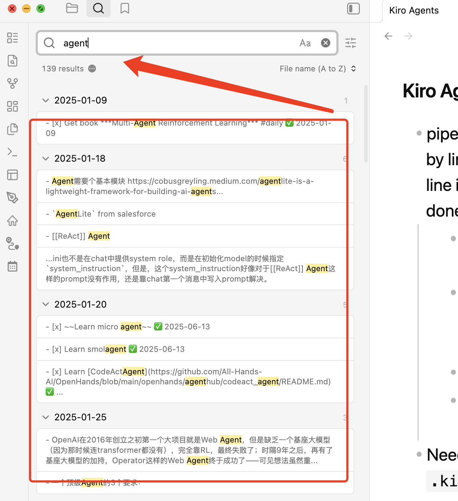
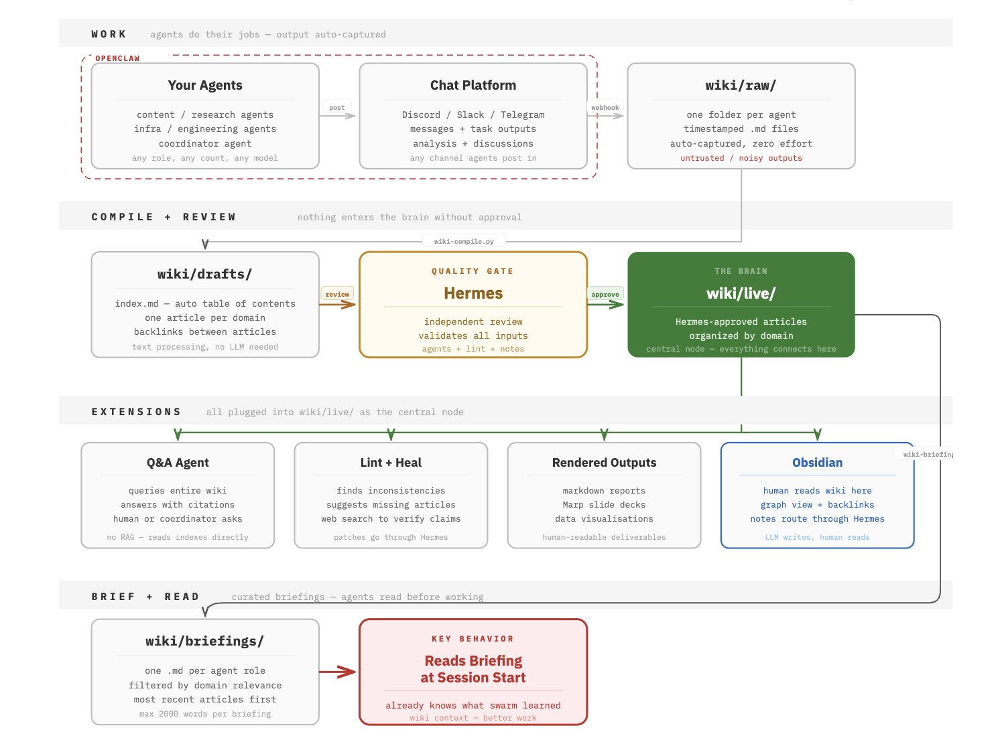
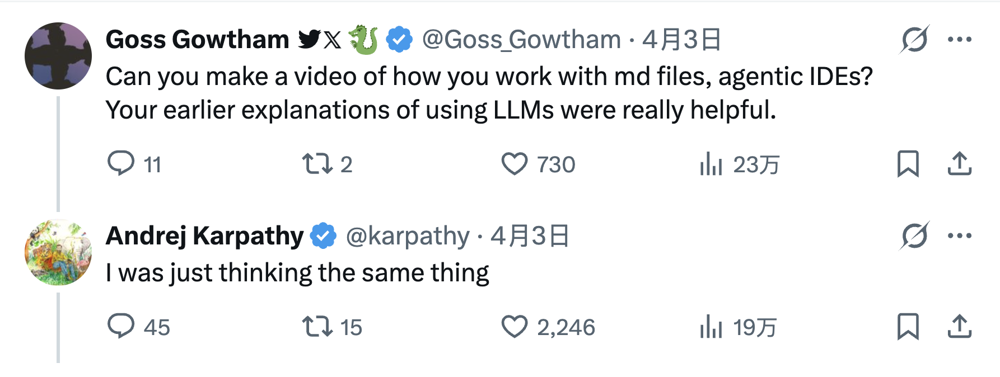

Karpathy发了条长推，说他最近搞了个『LLM Knowledge Base』，用来管理自己的研究资料。

核心思路其实一句话就能讲清楚：**别用向量数据库了，让LLM直接读Markdown文件，而且让LLM自己维护这些文件。**

就这点东西吗？

真的就这些，但是，Devils are in details，细节中挺多可圈可点之处。

* * *

传统知识库管理都用RAG，RAG大家应该都熟——把文档切成碎片，转成向量(embedding)，存进向量数据库，查的时候做相似度搜索，结果用LLM来整合。

这套架构在企业级场景里曾经被吹上了天，但Karpathy觉得，对于个人研究者来说，这玩意儿纯属杀鸡用牛刀。

他的方案分三步走：

**第一步，喂料：** 把论文、代码仓库、网页文章统统扔进一个`raw/`目录（这个目录名不重要，只不过Karpathy用的是raw)，这个过程中保证raw里的文本都是markdown文本，为了达到这个目的，Karpathy用Obsidian的Web Clipper工具把网页下载转成Markdown，连图片都下载本地化存储。

**第二步，编译：** 这是核心，LLM上场了，对raw中的文件进行编译和索引，把第一步获得的markdown编撰成一个结构化的wiki，生成摘要，识别关键概念，撰写百科式词条，当然也要建立反向链接，把相关概念串起来——**这就是人工可以做，但是AI做的更快的苦力活**。

**第三步，体检：** LLM定期对整个wiki做检查，修补前后矛盾的地方，补充缺失的信息，也就是打造一个**会自我修复的活的知识库**。

打个比方，就是Karpathy请了一个AI图书管理员，这个管理员不只负责上架图书，还会自己写新书来解释旧书之间的关系，隔三差五还巡查一遍书架，把放错位置的书归位。

你可能会问——这和我往Obsidian里丢一堆笔记有什么区别？

区别大了。

你看我的Obsidian，最大的目录就是Knowledge，看到什么新知识，我就在Knowledge里建一个markdown文件，现在都积累上千个markdown文件了，但是这些markdown就是一个信息孤岛，如果我主动去编辑，就没有关联。

当我需要获得历史上所有某个主题的知识时，我只能用搜索，但是搜索出来的内容非常多，而且碎片化，我还要动脑子去总结，比如我要搜agent相关知识，得到一大堆笔记，还要我现场去过滤。

总之，Obsidian天生是死的，要人去主动操作才能盘活。

而Karpathy的个人知识库天生是活的，每一次加入新增资料，都会被LLM整合进现有的知识网络，知识在这里是复利增长的。

而且，他选markdown不选向量数据库，有个非常实际的好处，**每一条AI给出的结论都能追溯到具体的`.md`文件**，不像RAG那样，你问AI一个问题，它从黑盒里捞出几个向量碎片拼成答案，你根本不知道它为什么这么说。

Karpathy的方案里，所有证据链都是明文可读的，当然Obsidian创始人Steph Ango对此大加赞赏，可以理解，毕竟Karpathy等于给他们做了广告。

* * *

我个人认为，Karpathy这套用来搞『个人』知识库没问题，但是作为『团体』知识库，行不通。

首先是体量问题，Karpathy自己也承认，这套系统的适用规模是大约100篇文章40万字，超出这个量级，靠`index.md`和grep搜索就开始力不从心了，当然，这些技术问题都不是大问题，利用层级管理，就可以支持更大体量的内容。

相比于体量问题，更大的问题是，**这套方法对使用者的判断力和自律性要求极高**。

Karpathy能玩得转，是因为他是Karpathy啊，他Karpathy什么人，头脑很清楚，知道哪些资料值得喂给LLM，知道LLM编译出来的东西哪些靠谱哪些扯淡，知道什么时候该手动介入纠偏。

但是，如果使用者判断力没那么强，自律性没那么高，以为架起一个系统就无脑接受一切了，肯定要翻车。

你把这套东西交给一个团队试试？

我们都知道，团队会让能力广度增加，但是深度下降。

我最近就接触过一个团队，他们全面拥抱AI Coding之后，连续线上出大bug，解决得也手忙脚乱。

原来，团队感受到AI Coding爽之后，代码和文档几乎全都自动生成，连Code Review都无脑使用AI，一开始效率飞升，皆大欢喜，然后线上出了bug，他们去debug的时候，找到出问题的那一行，却没人能解释当初为啥改这一行，git blame追查到改这一行的那个人，那人对改了这一行毫无印象，因为都是AI改的嘛，无脑信任AI，就是这个结果。

知识库也是一样的道理啊。

一个人用的时候，只要你自律有判断力，你对自己负责，觉得哪部分不对会追问，用的就好。

十个人用的时候呢？一个人往里面喂了一篇有问题的论文，LLM把它编译进了维基，其他九个人基于这条错误信息继续构建，幻觉就这么滚雪球了。

当然，有人在尝试解决这个问题。一个叫jumperz的开发者搞了个Swarm Agent架构，让多个Agent协作来管理知识库。

其中还有一个独立的评审员Hermes，它来做QA，每篇AI生成的Wiki都要过审，合格了才能进入正式知识库，不合格的停留在草稿区自生自灭。

我觉得这个有独立QA的思路很棒，值得仔细探究。

* * *

Karpathy发的这条推下面，很多人都有这样一个问题：**您能不能做一期油管视频来讲讲？**

有意思，Karpathy这个推文是用Markdown+Wiki就能管理知识，而大家的第一反应是——**我还是想看你真人出镜，对着镜头给我讲一遍**。

这就是智人啊，视觉动物。

知识库可以是Markdown的，但人类获取知识的偏好不是阅读，而是看别人讲，难怪知乎玩不过抖音呢:-)

Karpathy用实际行动证明了**LLM可以当图书管理员**，Karpathy的粉丝们用实际回应证明了，**比起去图书馆翻书，大家更想听馆长直接的宣讲**。