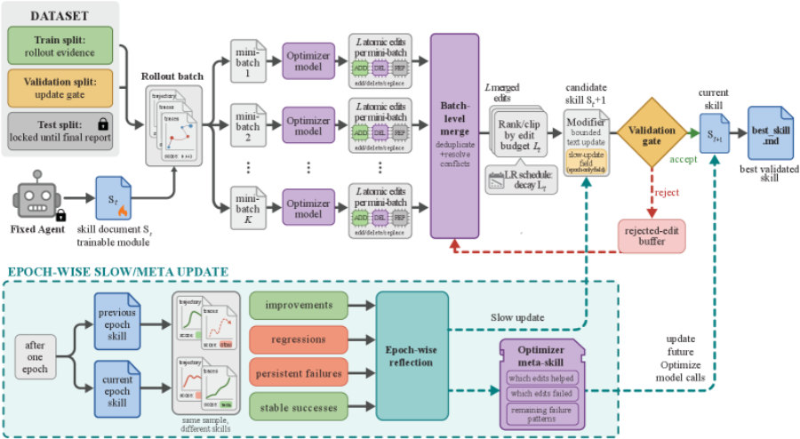
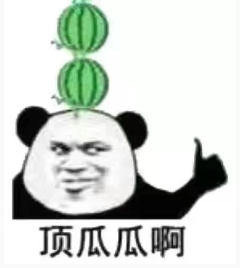
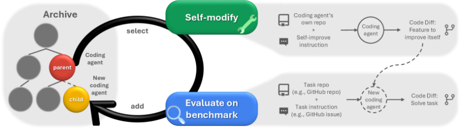
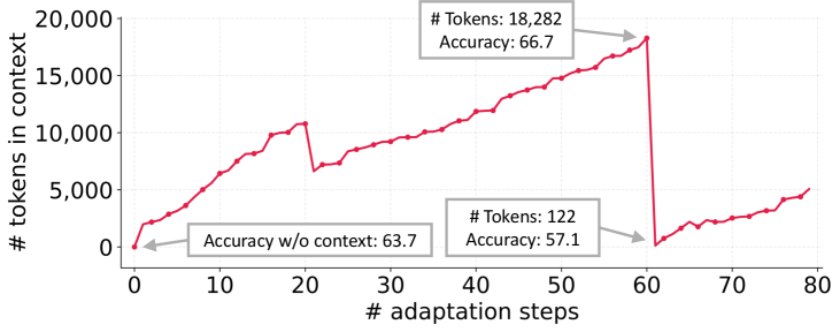
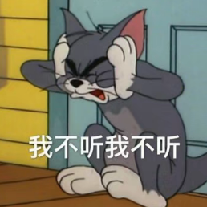
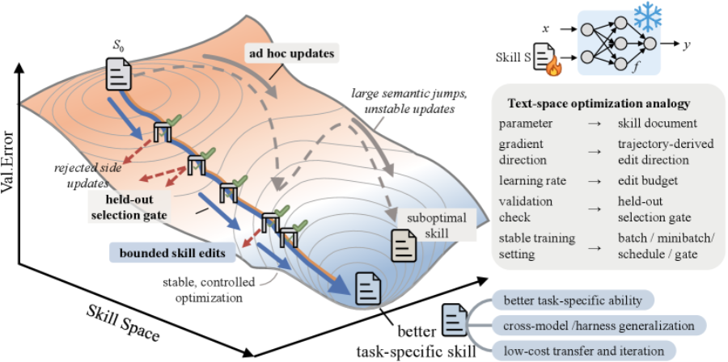
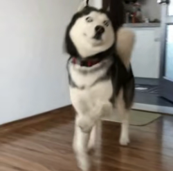

## **一、开局一张成绩单**

2026 年 5 月，微软研究院联合各大高校发了篇论文，叫 SkillOpt。一句话概括：雇一个 GPT 当教练，反复改另一个 GPT 的小抄，改一次考一次，考好了留下，考砸了回滚。

战绩单很吓人：六个 benchmark、七个模型、三个执行环境，52 个评测 case 全部第一或并列第一，GPT-5.5 平均提了 23.5 分。

不是哥们，52 战 52 胜，NBA 全盛时期的王朝球队都打不出这胜率，你一个改 markdown 的循环脚本凭什么。

论文挂出来不到一周，营销号就闻着味来了，《微软 SkillOpt 重写 skills.md，性能暴涨 25%》《像训练神经网络一样训练你的 AI Agent 技能！》，一个比一个亢奋，亢奋得好像实验是他们自己跑的。

这类论文从 2022 年就开始往外蹦了，从 最开始的 prompt 到 agent，在到 memory 以及最近火的 skill、harness 等，刷一篇烦一篇，每一天都有新的概念在实现自动进化，并且 benchmark 透露着一股赢麻了的味道，彻底成功！

## **二、这玩意到底在干嘛**

SkillOpt 的设定是这样的：被优化的 agent 完全冻结，领域知识写在一份外部 skill 文档里；另一个前沿模型当「优化器」，看带分数的执行轨迹(rollout)，对文档提出增、删、改；每个编辑必须在一个 held-out 验证集上提分才能被接受。再配上「textual learning rate，文本学习率」(人话：这一轮允许你改几行字、改砸的记小本本上)，最后产出一份 300 到 2000 token 的 best\_skill.md。

图 1：SkillOpt 官方流水线图(来源：arXiv:2605.23904)。请欣赏：改一份 markdown 文档，需要的全套仪式。

数字确实漂亮：SpreadsheetBench 从 41.8 提到 80.7,OfficeQA 从 33.1 提到 72.1，比 TextGrad、GEPA、EvoSkill 这些每格最强的基线平均还高 5.4 分。

听上去是不是挺像回事的，那继续。

## **三、四年了，剧本都懒得换一个字**

2022 年，APE 说自动生成的指令「超越人类水平」。  

2023 年，OPRO 让 LLM 自己当优化器，优化出来的最强咒语是「Take a deep breath」，后来成了行业段子。

同年 DSPy 说 prompt 应该被「编译」。  

2024 年，TextGrad 发明了「文本梯度」这个词，我寻思你这连个可导的东西都没有，梯度俩字搁这碰瓷呢。  

2025 年，GEPA 的标题直接写「反思式进化超越强化学习」。

然后是 skill 这一波，直接寒武纪大爆发：Trace2Skill、EvoSkill、EvoSkills(没看错，这是两篇不同的论文，名字就差一个 s)、SkillForge、SkillClaw、SKILLFOUNDRY、AutoSkill、SkillRL、SkillX、AutoRefine。  

SkillOpt 自己的相关工作部分，光这串名字就排了两段，看着像同一个 idea 在 arXiv 上反复投胎。

你以为这就完了？

改 prompt 和 skill 只是初级玩法，这股风早就卷到整个 agent 和 harness 层面了。  

ADAS 搞了个 meta-agent，直接写代码发明新 agent;

AFlow用 MCTS(蒙特卡洛树搜索)去搜 multi-agent workflow;

AgentSquare 把 agent 拆成 planning、reasoning、tool use、memory 四个模块，然后搜模块的排列组合；  

Darwin Gödel Machine 更狠，让 agent 自己改自己的代码，名字直接起到哥德尔头上；

后面还排着 GPTSwarm、ScoreFlow、MaAS、AutoMaAS 巴拉巴拉，

从一句 prompt，到一份 skill，到 agent 架构，再到整个执行 harness，现在没有什么是不能被「自动优化」的，除了结果的可信度。

图 3：Darwin Gödel Machine 官方循环图。自己改自己的代码，改完立刻上考场刷分，刷完接着改。

还没完。  

memory 也要自动进化！  

Dynamic Cheatsheet 给模型配了张自我更新的小抄；  

A-Mem用 Zettelkasten 卡片盒笔记法给 agent 管记忆；

斯坦福的 ACE 管这套叫「context 自动工程」，而且顺手把前辈们的通病全招了：迭代重写会把上下文越写越塌(他们起名叫 context collapse)，追求简洁会把领域知识删没(brevity bias)。

意思是，之前那些自进化 context 的论文，进化着进化着把自己进化没了。

工具也要自动造：LATM 让大模型自己造工具给另一个模型用，CREATOR、CRAFT 跟上，Voyager 在 Minecraft 里攒了一整库技能代码。

连奖励都要自动：Self-Rewarding 让模型自己给自己打分，Reflexion、Self-Refine 让模型自己批改自己的作业。

  

考生兼任教练和改卷顾问，就差自己给自己发毕业证了。

  

图 4：ACE 论文实测的 context collapse(来源：arXiv:2510.04618)。自进化的上下文攒到 18,282 token，一次重写直接塌到 122 token，准确率应声跳水。「进化着进化着把自己进化没了」，这是官方图证。

数一遍：prompt、skill、memory、context、工具、workflow、agent 架构、harness、reward，一个 agent 身上每个零件都有专门的论文在「自动优化」。

唯独评测本身，没人优化。

问题来了：每篇都说自己比上一篇提了十几二十分，四年胜率 100%，这些分要都是真的，叠起来现在的 agent 早该无所不能了。

笔者之前在某大厂亲手做过 prompt 自动优化的落地，包括 DSPy、TextGrad 这些当红 paper 都真金白银地跑过。

真正点下「开始优化」之后,验证集上的分确实在涨,曲线好看得能直接截图发周报。  

但这活儿的重心根本不在「优化」上，真正决定成败的,是你的评测集和真实环境之间差多少。

四、从模型底层讲讲，为什么这事注定不靠谱

图 2：论文给 skill 文档画的「优化地形图」。一份 markdown 拥有了自己的损失面，右边还有张文本优化与权重优化的对照表。**学术圈管这叫 analogy，游戏圈管这叫皮肤。**

**第一个问题：你优化出来的多半不是知识，是噪声。**

LLM 本质上是个条件概率机器，你喂它一段上下文，它在权重里算下一个 token 的分布。attention 机制决定了它对上下文里的措辞、顺序、格式都很敏感，学界管这叫 prompt sensitivity：同一个意思换个说法，分数能差十几个点，选择题选项重排一下，答案都能翻车。

自动优化器干的事，就是在这个对措辞极度敏感的曲面上瞎爬。

爬出来的那些「神奇措辞」，跟 adversarial example(对抗样本)是亲戚：蹭的是这个特定权重版本的 attention 怪癖，不是什么可迁移的知识。

所以模型厂一推静默更新，你优化出来的宝贝就归零啦~

《Revisiting OPRO》实测过，换成 Llama-2、Mistral 这种小模型，OPRO 基本不管用。

而 skill 文档里真正有用的部分，从来都是领域事实和操作流程，说白了就是信息。信息谁写都行，懂业务的人写得还更好。

顺便说一句，这个问题到了 agent 和 harness 层面只会更糟。一份 skill 文档才几百 token，ADAS、Darwin Gödel Machine 这些搜的可是整个代码空间，搜索空间指数级膨胀，评测信号还是那几十道题的 0/1 对错。

搜索自由度越大、信号越稀疏，搜出来的东西就越像是给这套题量身定做的，过拟合从风险直接变成保底。

这时候肯定有人要搬 DeepMind 出来：FunSearch 和 AlphaEvolve 不就是靠进化搜索发现了新数学结果、改进了真算法吗？

对，但你看人家的 evaluator 是什么：确定性的代码，一个解好不好，跑一下就知道，免费、精确、想查多少次查多少次。  

agent 这边呢？几十道题的 0/1 信号，外加一个 LLM 当裁判。

写到这，最近有一个赛道很火，Multi Agent IM 产品，如果从隔离下上文、人机协作来说是很有意义的。

但你拉了五个 agent 开会，可它们底下是同一个基座模型，同样的预训练数据，同样的先验知识。这不叫集思广益，这叫一个人开了五个小号跟自己对线，看起来很热闹，但错的地方还是一起错。

三个臭皮匠顶个诸葛亮的前提，是三个臭皮匠的错误互相独立，所以那些「multi-agent debate 提升 X%」的论文，换个角度看大多是在给 self-consistency 多采样几次，然后把采样开销包装成了组织架构。

把这套群聊再接上 LLM 裁判去「自动进化」,等于让五个小号吵架、再让第六个小号评谁吵赢了，整个系统从头到尾只有一个灵魂，却开出了一个董事会的编制。彻底成功！

第二个问题，也是最要命的：模型每变强一次，这条赛道就贬值一次。

回看历史。Chain of Thought 当年是 prompt 技巧之王，后来直接被做进了 reasoning 模型，现在你不让它想它都要想。

「Take a deep breath」对 2023 年的模型管用，对现在的模型就是个段子。  

instruction tuning 和 RLHF 干的事情之一，就是把 prompt sensitivity 当 bug 修。

换句话说，自动优化能折腾的空间，恰好就是当前模型的不足地方。模型一代代变强，能优化的东西也跟着缩水。  

顺带说一个这类论文心照不宣的规律：提分最猛的，永远是裸跑不及格的任务。OfficeQA 裸跑 33 分，说明这任务本来就需要说明书，把说明书塞进上下文涨分，2023 年起每个写 prompt 的人都知道，这算什么科学发现。

五、营销号：学术通胀的二道贩子

然后说说那些号，我是真看烦了。

套路四年没变过：把 abstract 里最大的数字抠出来，限定条件全删掉(特定基准、特定 harness、优化器烧的 API 钱、测试集跟训练同分布)，再配个「颠覆」「必学」「错过拍大腿」的标题。  

这就好比体检报告写血脂正常，营销号标题写《此人已永生》。

而且这事真不能全甩给自媒体，这是条完整的产业链。

论文作者往标题里塞「self-evolving」「executive strategy」的时候，就已经在给营销号备货了；营销号把隐喻当字面意思卖；老板刷到标题，回头质问工程师为什么还在手写 prompt；

工程师解释不清，只能自己掏 API 钱跑一遍，然后发现 overfitting 真好用，利好周报、绩效、年终奖。

一圈下来谁都赢麻了，全部进化！

(本文牢骚纯原创)