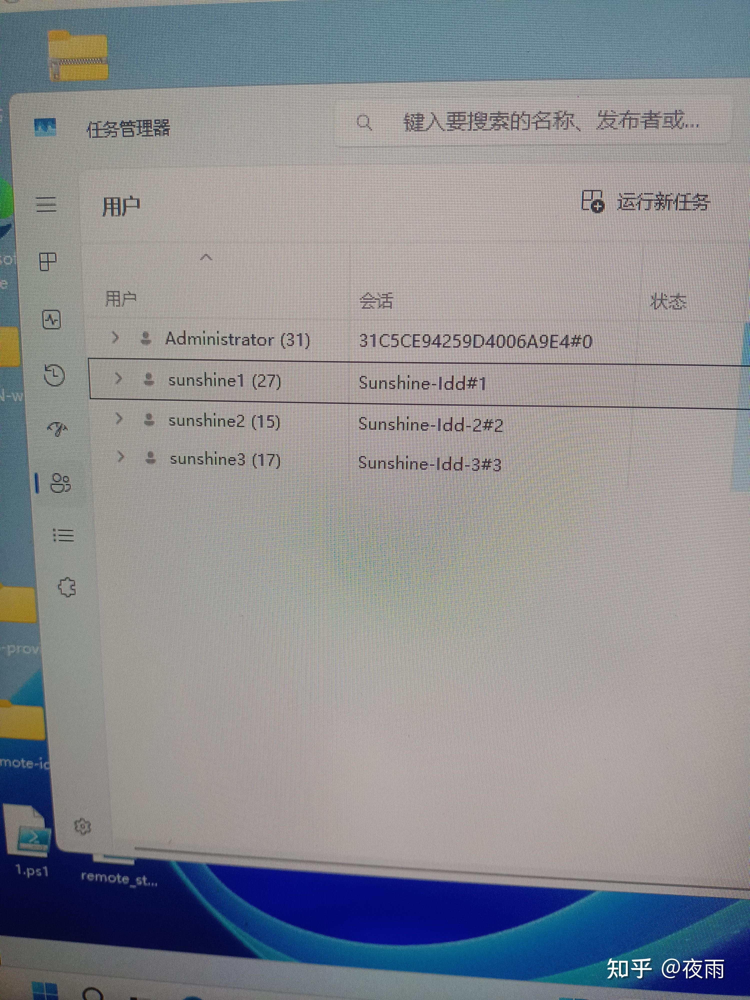
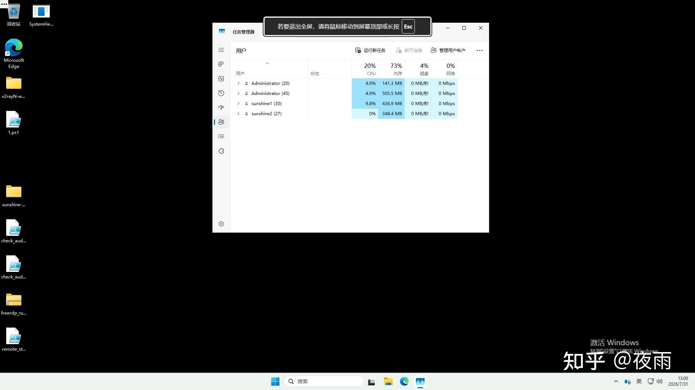
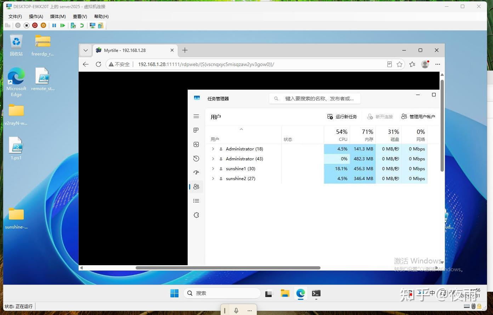

如果你知道以下这些概念↓

> **remoteapp**  
> **内网穿透**  
> **驱动器映射**  
> **60Fps**  
> **RDP多会话**  
> **Iddcx**  
> **阴影模式**  
> **Myrtille**

  

你就明白，除了**不能串流云游戏是短板**，在其他**任何方面**，他的机制是**无敌的**。当然这再补上**Sunshine+Moonlight**就完美了。

* * *

RDP协议**高度绑定**windows系统的**多会话生态**，这是**任何**商业远程**永远也取代不了的**，个人用户当然无感，他的主要支持都在server端，所以拿说RDP不行的我只能说，你可能只用到的他最基本**最基本的那一部分功能**，他的威力你大概率闻所未闻，这段时间我写iddcx就能感觉出来了，微软仅仅是给个人端暴露了一些**基础功能**，他的**全套rdp生态只有在server才能体会到**。**而且server端想要超过2个会话还得购买rdscal授权**，想想吧，**需要付费的**，**什么阿猫阿狗微软都收费吗？**

  

* * *

第一次这么多赞个收藏，更新自用方案~~~~

\-

**一键式开启RDP多用户登录登录，阴影模式，单用户多会话等等(不是所有系统都能用)**

  

[https://github.com/lcxxjmsg-cyber/rdp\_warp\_ps](https://link.zhihu.com/?target=https%3A//github.com/lcxxjmsg-cyber/rdp_warp_ps)

  

* * *

**一键式开启RDP Web(家庭版不支持)**

  

[https://github.com/lcxxjmsg-cyber/AutoMyrtille](https://link.zhihu.com/?target=https%3A//github.com/lcxxjmsg-cyber/AutoMyrtille)

  

* * *

**对你有帮助请帮我点个Star，谢谢～**

> flag：俩项目星标破100开源我的多Sunshine串流项目，正在做结合RDP多会话，目前看来只能支持Server2022 and 2025.主要是系统api接口win10/11不支持。

**啊~~~~~~给我星!!!!!!!!!!!!!!!!!!!!!**

  

[https://github.com/lcxxjmsg-cyber](https://link.zhihu.com/?target=https%3A//github.com/lcxxjmsg-cyber)