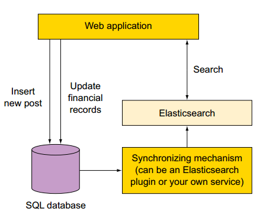
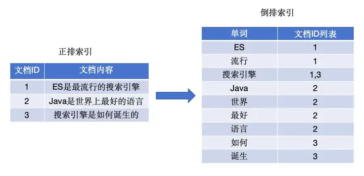
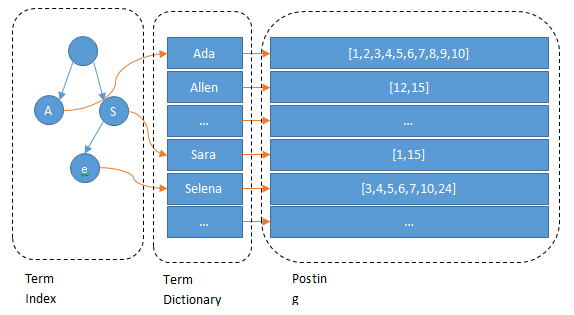
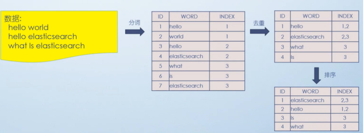
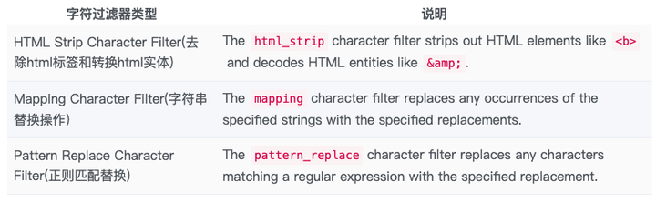
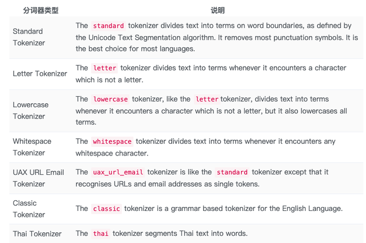
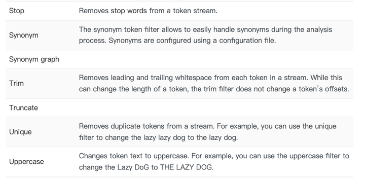
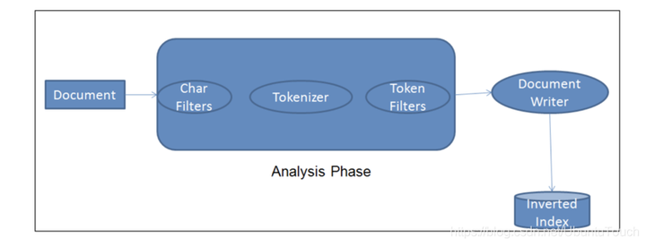
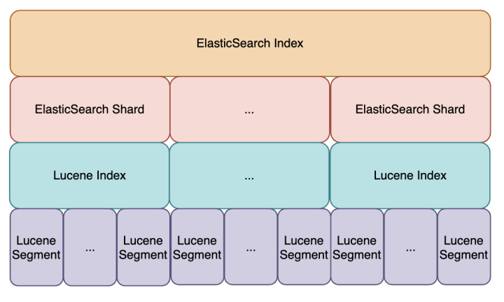
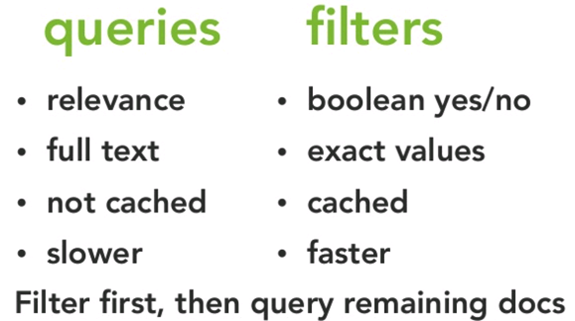

这是我在日常工作中总结出来的十条经验：

（1）每天凌晨的业务低峰期，定时对索引做force\_merge操作，以释放空间；

（2）采取冷热分离机制，热数据存储到SSD，提高检索效率；冷数据定期进行shrink操作，以缩减存储；

（3）仅针对需要分词的字段，合理的设置分词器；

（4）大批量数据初始化写入前，副本数设置为0，写入后恢复副本数；

（5）大批量数据初始化写入前，refresh\_interval设置为-1，禁用刷新机制，写入后恢复刷新间隔；

（6）写入过程中，采取bulk批量写入；

（7）尽量使用自动生成的id；

（8）禁用wildcard；

（9）设置合理的路由机制；

（10）设置合理的translog机制；

  

**从你问的这个问题来看，你对ES的理解还仅限于皮毛啊。看懂了我下面这篇介绍ES知识点的文章，就算是基本入门了，也可以根据业务场景进行合理的[技术选型](https://www.zhihu.com/search?q=%E6%8A%80%E6%9C%AF%E9%80%89%E5%9E%8B&search_source=Entity&hybrid_search_source=Entity&hybrid_search_extra=%7B%22sourceType%22%3A%22answer%22%2C%22sourceId%22%3A3174075151%7D)了。**

  
这应该是一个非常高频的面试问题，至少我在面试的时候经常直接或间接地问到。

**面试场景一：**

我：“请说下你对ES的理解。”

候选人：“ES的性能非常好，我们的订单中心的订单数据就会往ES中同步一份。然后，所有的查询请求都走ES。”

我：“对实时性要求很高的by id查询也走ES吗？”

候选人有些慌：“这个。。。呵呵，我觉得都可以吧。”

我：“为什么ES叫近实时搜索引擎，请问‘近实时’三个字如何体现的？”

候选人：“这个。。。”

  
**面试场景二：**

我：“请说下你对ES的理解。”

候选人口若悬河：“ES是一个基 Lucene的Java开发的搜索引擎，是一个分布式、可扩展、实时的搜索与数据分析引擎，可以解决项目中的多维搜索问题。”

我：“那可以说说，ES不适合做什么吗？”

候选人：“这个。。。”  

**面试场景三：**

我：“刚才你说的，你们系统线上环境的峰值QPS是3000，那如果QPS再增加十倍，你打算如何优化？”

候选人：“现在系统中主要用的MySQL和Redis，如果QPS高了，可以再增加ES。”

我：“为什么用ES就可以顶住更高的QPS，你分析过你系统请求的类型吗？”

候选人：“这个。。。”  

### 热水化

然后我在想，ES对于很多经验尚浅的同学来说，是不是有点儿渣男语录中的“热水化”。

-   肚子疼，多喝热水 ——> QPS高，用ES
-   玩累了，多喝热水 ——> 性能不好，用ES
-   心情不好，多喝热水 ——> 数据量大，用ES
-   感冒了，多喝热水 ——> 懒得分表，用ES

  
其实，摆脱热水化，接近事实真相并不困难。下面我们还是通过现象倒推本质，去深入浅出地理解一下ES。

## 一、应用场景

目前在互联网和电商方向，有很多同学都是用ES为MySQL去补齐短板的。

最最典型的是两个应用场景：**全文检索** 和 **复杂查询**。

尤其是复杂查询，因为MySQL的底层是通过B+ Tree实现的索引，如果把每个搜索项都建上索引，会非常影响MySQL的写入操作的性能。

如果业务主表的数据量过于庞大，MySQL不得已做了分库分表方案的话，那会对MySQL的查询产生进一步的影响。因为查询条件里面如果不将分库分表键带入的话，就只能将MySQL已分的全部库表全部查询一遍，才会获取全部数据结果。

基本上在互联网或电商领域引入ES，80%都是为了解决这种场景的问题。



那么，为什么ES处理这种场景就游刃有余呢？

四个字 —— 倒排索引。

## 二、倒排索引

索引的初衷，是为了从一个海量数据集中快速找出某个字段等于确定值所对应的记录，索引分为正排索引和倒排索引两种。

正排索引，也叫正向索引（Forward Index），是通过文档ID去查找关键词（文档内容）。  
倒排索引，也叫反向索引（Inverted Index），是通过关键词查找文档ID。



如果通过正排索引查找关键词“elasticsearch”时，需要遍历所有文档，查找出这个关键词所在的文档。如果文档数量非常庞大的话，正排索引的弊端就是查询效率太低。

而倒排索引的玩法就完全不一样了，通过倒排索引获得“elasticsearch”对应的文档id列表1，再通过正排索引查询1所对应的文档，这样就可以了。

倒排索引包括两部分：词典（Term Dictionary） + 倒排列表（Posting List）。

单词词典（Term Dictionary）：记录了所有文档的单词与倒排列表的关联关系，单词词典会比较大，一般通过B+树来实现，以满足高性能的插入与查询。



倒排列表（Posting List）：记录了单词对应的文档结合，由倒排索引项组成，包括：

-   文档ID，等同于数据库主键；
-   词频（Term Frequency），该单词在文档中出现的次数，主要是用于打分；
-   位置（Positon），单词在文档中分词的位置，用于语句搜索；
-   偏移（Offset），记录单词的的位置；

默认情况下，ES的JSON文档中的每个字段，都有自己的倒排索引，这也其在复杂查询上优于MySQL的原因。

## 三、分词器

是的，说到倒排索引，就不得不提分词器。因为没有分词器的话，就没有词典，也就构建不了倒排索引了。

分词器的主要工作是，把用户输入的一段文本，按照一定的逻辑，转换成一系列单词。

当然，仅仅这些还不够，因为单词中肯定是有重复的，接下来要做事情就是去重，以及去重之后的排序，这样便于搜索。

整体步骤如下：



分词器一般由三个部分组成：

-   字符过滤器（Character Filters），对原始文本进行处理，最常见的就是第一种 ；



-   分词器（Tokenizer），顾名思义，将原始文本按照特定的规则切分为单词，默认的是Standard Tokenizer；



-   Token过滤器（Token Filter），将切分的单词进行加工，如：大小写转换，去掉停用词，加入同义词，等等。



三者顺序为：



讲完倒排索引和分词，基本上大家对ES的运行机制有了一个宏观的了解，知道它为什么适合于进行全文检索关键字和多维复杂查询的场景了。

## 四、准实时搜索

这块知识点是在面试中高频出现的问题。

随着按段（per-segment）搜索的发展， 一个新的文档从索引到可被搜索的延迟显著降低了。新文档可做到在几分钟之内即可被检索，但这样依然不够快，不能满足于所有场景需求。



磁盘在这里成为了瓶颈。因为，提交（Commiting）一个新的段（Segment）到磁盘，需要一个fsync来确保段被物理性地写入磁盘，这样在断电的时候就不会丢失数据。 但是，如果每次索引一个文档都去执行一次fsync的话，会造成很大的性能问题。

我们需要的是一个更轻量的方式来使一个文档可被搜索，在ES和磁盘之间是文件系统缓存。在内存索引缓冲区中的文档会被写入到一个新的段中，这里新段会被先写入到文件系统缓存（这一步代价会比较低），稍后再被刷新到磁盘（这一步代价比较高）。不过只要文件已经在缓存中， 就可以像其它文件一样被打开和读取了。

我们都知道，ES的底层实现是Lucene。而Lucene允许新段被写入和打开，使其包含的文档在未进行一次完整提交时便对搜索可见。这种方式比进行一次提交代价要小得多，并且在不影响性能的前提下可以被频繁地执行。

通过如上实现方式，可将ES可被检索的时长从分钟级别，优化到了秒级别。

默认情况下，每个分片会每秒自动刷新（refresh）一次。这就是为什么我们说ES是近实时搜索。文档的变化并不是立即对搜索可见，但会在一秒之内变为可见。

refresh的相关API如下：

（1）刷新（Refresh）所有的索引

POST /\_refresh

（2）只刷新（Refresh）blogs索引

POST /blogs/\_refresh

（3）每30秒刷新 my\_index 索引

PUT my\_index/\_settings  
{  
"index" : {  
"refresh\_interval" : "30s"  
}  
}

另外，refresh\_interval 可以在既存索引上进行动态更新。 在生产环境中，当你正在建立一个大的新索引时，可以先关闭自动刷新，待开始使用该索引时，再把它们调回来。

（4）关闭自动刷新 my\_index 索引，当内存缓冲区满了才进行refresh操作

PUT my\_index/\_settings  
{  
"index" : {  
"refresh\_interval" : "-1"  
}  
}

## 五、搜索类型（SearchType）

示例如下：

```text
GET /_search?search_type=query_then_fetch
```

  
共有四种搜索类型，包括：query and fetch、query then fetch（默认）、DFS query and fetch 和 DFS query then fetch。

  

**query and fetch（本地）**

向索引的所有分片（shard）都发出查询请求，各分片返回的时候把元素文档（document）和计算后的排名分值一起返回。

优点：快。  
缺点：排名不准确（每个分片计算后的分值进行排序），同时各个shard返回的结果的数量之和可能是用户要求的size的n倍。（数据量不准确）

  

**query then fetch（默认）（本地）**

先向所有的shard发出请求，各分片只返回文档id(注意，不包括文档document）和排名分值（基于自己分片），然后按照各分片返回的文档的分数进行重新排名，取前size个文档。

根据文档id去相关的shard取document，这种方式返回的document数量与用户要求的大小是相等的。

优点：返回的数据量是准确的。  
缺点：性能一般，并且数据排名不准确。

  

**DFS query and fetch（全局）**

这种方式比第一种方式多了一个DFS步骤，有这一步，可以更精确控制搜索打分和排名。也就是在进行查询之前，先对所有分片发送请求，把所有分片中的词频率和文档频率等打分依据全部汇总到一块，再执行后面的操作。

优点：数据排名准确。  
缺点：性能一般，返回的数据量不准确， 可能返回(N\*分片数量)的数据。

  

**DFS query then fetch（全局）**

比第 2 种方式多了一个 DFS 步骤。也就是在进行查询之前，先对所有分片发送请求，把所有分片中的词频率和文档频率等打分依据全部汇总到一块，再执行后面的操作。

优点：返回的数据量是准确的，数据排名准确。  
缺点：性能最差

  

**DFS是一个什么样的过程?**

多了一个初始化散发(initial scatter)步骤，在进行真正的查询之前，先把各个分片的词频率和文档频率（排名信息）收集一下，然后进行词搜索的时候，各分片依据全局的词频率和文档频率进行搜索和排名。

**检索词的频率**

检索词 honeymoon 在这个文档的 tweet 字段中出现的次数。

**反向文档频率**

检索词 honeymoon 在索引上所有文档的 tweet 字段中出现的次数。

在每一个分片上查询符合要求的数据，并根据全局的 Term 和 Document 的频率信息计算相关性得分构建一个优先级队列存储查询结果（包含分页、排序，等等），把查询结果的metadata返回给查询节点。

注意，真正的文档此时还并没有返回，返回的只是得分数据。  

## 六、query 和 filter

ElasticSearch中的search操作包括两种，查询（query）和过滤（filter）。

从使用场景的角度来看，全文检索以及任何使用相关性评分的场景使用query查询，除此之外的使用filter过滤器进行过滤。

示例如下：

```text
GET /_search
{
  "query": { 
    "bool": { 
      "must": [
        { "match": { "title":   "Search"        }}, 
        { "match": { "content": "Elasticsearch" }}  
      ],
      "filter": [ 
        { "term":  { "status": "published" }}, 
        { "range": { "publish_date": { "gte": "2015-01-01" }}} 
      ]
    }
  }
}
```

  

**query**：

此文档与此查询子句的匹配程度如何？以及query上下文的条件是用来给文档打分的，匹配越好 \_score 越高。

即：全文搜索，评分排序，无法缓存，性能低。  

**filter**：

此文档和查询子句匹配吗？以及filter的条件只产生两种结果：符合与不符合，后者被过滤掉。

即：精确查询，是非过滤，可缓存，性能高。

  

**Query检索细化关注点**

**是否包含，**确定文档是否应该成为结果的一部分。

**相关度得分，**除了确定文档是否匹配外，查询子句还计算了表示文档与其他文档相比匹配程度的\_score。得分越高，相关度越高。更相关的文件，在搜索排名更高。

**典型应用场景：**

（1）全文检索——这种相关性的概念非常适合全文搜索，因为很少有完全正确的答案。

如：文档中存在字段hotel\_name：“上海浦东香格里拉酒店”，实际分词结果为：上海浦，上海，浦东，香格里拉，格里，里拉，酒店。也就是说，搜索以上关键词都能搜到：hotel\_name：“上海浦东香格里拉酒店”的酒店。这些都是“相关”的。

（2）包含单词“run”， 但也匹配"runs", "running", "jog"或者"sprint"。（都是奔跑的意思）

  

**filter过滤细化关注点**  
  
**是否包含，**确定是否包含在检索结果中，回答只有“是”或“否”。  
  
**不涉及评分，**在搜索中没有额外的相关度排名。  
  
**针对结构化数据，**适用于完全精确匹配，范围检索。

**典型应用场景：**

（1）时间戳timestamp 是否在2015至2016年范围内？

（2）状态字段status是否设置为“published”？



**为什么filter比query更快？**

因为，经常使用的过滤器将被ES自动缓存，以提高性能。只确定是否包括结果中，不需要考虑得分。

## 结语

弄懂了上述知识点，对于ES就算是入门了，也可以根据业务场景进行合理的技术选型了。

分享一套我自己逐字写的、深入浅出、细致易懂的高频面试题详解，旨在以**一站式刷题 + 解惑**的方式帮你提升学习效率，需要的请自取。

  

[大厂Java高频面试题详解](https://link.zhihu.com/?target=https%3A//mp.weixin.qq.com/s%3F__biz%3DMzkxMDUxNzM2Nw%3D%3D%26mid%3D2247484894%26idx%3D1%26sn%3D920715e633964de11dfa47bff3b6b12c%26chksm%3Dc12b70c6f65cf9d0feb54b096976ee6b986195fa1584c183a67c327a0fe6df8ecaccb12d51e5%26token%3D1790900296%26lang%3Dzh_CN%23rd)

  

强烈建议近期有求职诉求的Javaer好好看看。