[https://github.com/StevenGerrad/how-tomcat-work-lab](https://link.zhihu.com/?target=https%3A//github.com/StevenGerrad/how-tomcat-work-lab)

-   chapter1: `sample-server`
-   chapter2: `sample-servlet-container`
-   chapter3: `sample-connector`
-   chapter4: `user-default-connector`
-   chapter5: `servlet-container`
-   chapter6: `lifecycle`
-   chapter7: `logger`
-   chapter8: `classloader`
-   chapter9: `session`
-   chapter10: `security`

## 第一章 一个简单的Web服务器

`HttpServer`中，使用ServerSocket模拟服务器（只能解析静态资源文件）

## 第二章 一个简单的Servlet容器

`ServletProcessor`继承javax.servlet.Servlet接口，使用URLClassLoader加载参数指定servlet类

  

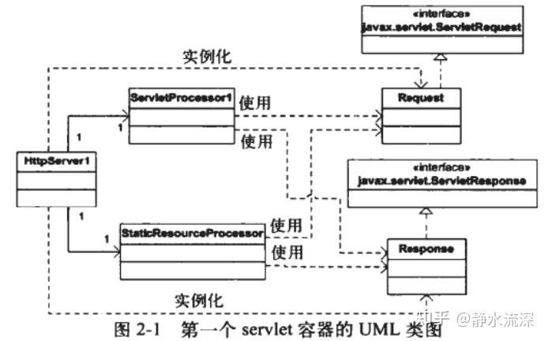

  

-   `HttpServer`实例化`ServerSocket`并监听8080端口
-   `HttpServer`接受请求后

-   实例化`Request`和`Response`。
-   并根据情况实例化`ServerProcessor`或`StaticResourceProcessor`，将`Request`和`Response`作为参数传给它们

## 第三章 连接器

Catalina中有两个主要的模块，连接器（connector）和容器（container）。连接器不需要知道servlet对象的类型，只负责提供HttpServletRequest实例和HttpServletResponse实例。  
本章连接器解析HTTP请求头，使servlet实例获取到请求头、cookie和请求参数/值等信息，从而进行功能增强，可以运行更复杂一点的servlet类。

之后每章的应用程序都会按照模块划分。本章包含三个模块：连接器模块、启动模块和核心模块。

  

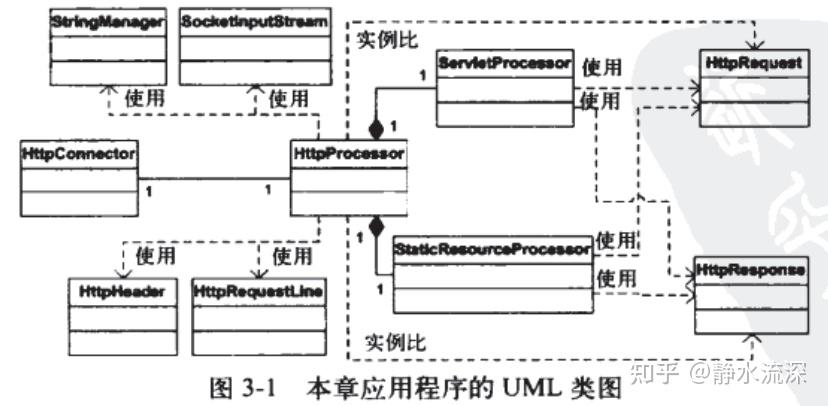

  

-   `Bootstrap`实例化并调用`HttpConnector`，`HttpConnector`继承`Runnable`，每次被调用会为自己创建新的线程并启动
-   `HttpConnector`实例化`ServerSocket`并监听8080端口

-   接受请求后实例化并调用`HttpProcessor`

  
-   `HttpProcessor`实例化`StringManager`以及`SocketInputStream`等专职功能类，从而帮助组装同时实例化出来的`HttpRequest`、`HttpResponse`

-   并根据情况实例化`ServerProcessor`或`StaticResourceProcessor`，将`HttpRequest`和`HttpResponse`作为参数传给它们，其中

-   `<font style="background-color:#8A8F8D;">SocketInputStream</font>`用于解析Http请求头

-   `HttpHeader`辅助`SocketInputStream`进行解析

-   `<font style="background-color:#8A8F8D;">StringManager</font>`用于读取`.properties`配置文件（单例模式）
-   `HttpRequestLine`

（`<font style="background-color:#8A8F8D;">StringManager</font>`等“灰色底”类几乎为Tomcat同名类副本）

上一章的HttpServer是在判断请求类型（Servlet/静态资源）前就对与请求进行了全部解析

-   本章`HttpConnector`不进行请求解析
-   `HttpProcessor`在判断请求类型前只解析servlet用到的参数

-   request.getParameterXxx()等方法在具体的Servlet中才调用

对应下表：

| 具体任务 | 第二章 负责对象 | 第三章 负责对象 |
| ----- | ----- | ----- |
| 等待HTTP请求 | HttpServer类 | HttpConnector实例 |
| 创建Request和Response对象 | HttpServer类 | HttpProcessor实例 |

创建HttpRequest对象（HttpRequestFacade使用了外观设计模式）

  

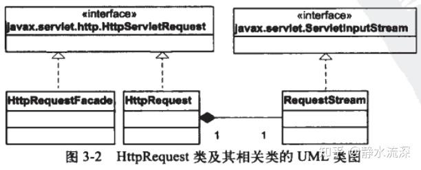

  

在servlet/JSP编程中，参数名jessionid用于携带一个会话标识符。会话标识符通常是作为Cookie嵌入的。

## 第四章 Tomcat的默认连接器

> 本章的“默认连接器”是Tomcat4中的默认连接器。已经被Coyote取代，但仍是一个不错的学习工具。

先上源码

```java
import com.lab.tomcat.core.SimpleContainer;
import org.apache.catalina.connector.http.HttpConnector;

HttpConnector connector = new HttpConnector();
SimpleContainer container = new SimpleContainer();
connector.setContainer(container);
try{
    connector.initialize();
    connector.start();

    // make the application wait until we press any key.
    System.in.read();
}
catch (Exception e){
    e.printStackTrace();
}
```

该模块除了Bootstrap，只自定义了`SimpleContainer`和Servlet，而HttpConnector和HttpProcessor都采用了apache.catalina包。编写SimpleContainer继承`Container`接口，实现`public void invoke(Request request, Response response)`方法从而创建并调用具体Servlet就好。

Tomcat4的默认连接器，相比于第三章简单连接器的优化处：使用了对象池避免频繁创建对象；在很多地方使用字符数组来代替字符串。该连接器实现了HTTP1.1的全部新特性，也可以为使用HTTP1.0和HTTP0.9协议的客户端提供服务。

### 4.1 HTTP 1.1 的新特性

### 4.1.1 持久连接

HTTP1.1前，无论浏览器何时连接到Web服务器，当服务器请求资源返回后，就会断开与浏览器的连接，但是网页上会包含一些自他资源如静态资源、applet等。如果页面和它引用的所有资源文件都使用不同链接进行下载的话，处理过程会很慢。——因而HTTP1.1引入持久连接

HTTP1.1默认使用持久连接，也可以显式使用，方法是请求头信息

```text
connection: keep-alive
```

### 4.1.2 块编码

建立了持久连接后，服务器可以从多个资源发送字节流，而客户端也可以使用该连接发送多个请求。因而发送方必须在每个请求和响应中添加"content-length"头信息，这样接受方才知道如何解释这些字节信息。

但通常发送方并不知道要发送多少字节，如servlet容器可能在接收到一些字节后就开始发送响应信息而非接收完所有信息。因而需要接收方能在不知道发送内容长度的情况下解析。

其实即使没有发出多个请求或多个响应，服务器或客户端也不需要知道有多少字节要发送。在HTTP1.0中服务器可以不写"content-length"头信息，发送完响应信息后，它就直接关闭连接。此时客户端一致读取内容知道读方法返回`-1`。

HTTP1.1使用一个名为`transfer-encoding`的特殊请求头，来指明字节流会分块发送。对每个块，块的长度（十六进制表示）后面会有一个回车/换行符（CR/LF），然后是具体数据，一个事务以一个长度为0的块标记。

eg. 假设用两个块发送下面38个字节内容，其中i的一个块为29个字节，第二个块为9个字节：

```text
I'm as helpess as a kitten up a tree.
```

实际应该发送如下内容

```text
1D\r\n
I'm as helpess as a kitten u
9\r\n
p a tree.
0\r\n
```

其中`0\r\n`表明事务已经完成。

### 4.1.3 状态码100的使用

使用HTTP1.1的客户端可以在向服务器发送请求体前发送如下请求头并等待确认：

```text
Expect: 100-continue
```

当客户端准备发送较长的请求体而不确定服务端是否会接收时，可以发送该头信息避免浪费。若服务器可以接收并处理该请求则发送响应头：

```text
HTTP/1.1 100 Continue
```

### 4.2 Connector 接口

Tomcat连接器必须实现`org.apache.catalina.Connector`接口，接口中最重要的方法是`getContainer()`、`setContainer`、`createRequest()`、`createResponse()`

  

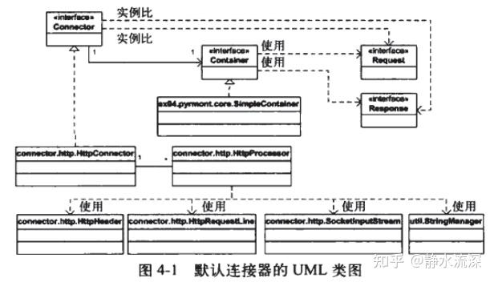

  

连接器与servlet容器是一对一的关系，箭头指向表示的关系是连接器知道要用哪个servlet容器。

com.lab.tomcat.Bootstrap#main

-   org.apache.catalina.connector.http.HttpConnector#initialize （Connector接口限定方法）

-   从工厂中获取自己的持有的ServerSocket

  
-   org.apache.catalina.connector.http.HttpConnector#start（LifeCycle接口限定方法）

-   为自己另创建并启动一个独立线程

-   通过自己的#threadStart()方法与start()方法循环调用配合start布尔值属性实现。

-   依据上下范围参数（minProcessors、maxProcessors）先创建minProcessor个HttpProcessor入栈（**用栈方式管理的HttpProcessor对象池**）

-   org.apache.catalina.connector.http.HttpConnector#newProcessor

-   创建HttpProccessor实例并启动

-   org.apache.catalina.connector.http.HttpProcessor#start

org.apache.catalina.connector.http.HttpConnector#run 提供HTTP请求服务

-   java.net.ServerSocket#accept
-   org.apache.catalina.connector.http.HttpConnector#createProcessor

-   获取或创建一个HttpProcessor，不超过maxProcessors参数

  
-   org.apache.catalina.connector.http.**HttpProcessor#assign(Socket)**

-   （**注意HttpProcessor#assign方法是HttpConnector#run的“连接器线程”调用的**）
-   **使用java.lang.Object#wait()方法阻塞监听this.available布尔属性值**
-   **传入参数socket**
-   **修改this.available属性值**
-   **java.lang.Object#notifyAll**

> 第三章中的HttpProcessor中的processor()方法是同步的，因此在接受下一个HTTP请求前，run()方法会一致等待，直到processor()方法返回

org.apache.catalina.connector.http.HttpProcessor#start

-   为自己另创建并启动一个独立线程

-   （与HttpConnector同理）

org.apache.catalina.connector.http.HttpProcessor#run

-   org.apache.catalina.connector.http.**HttpProcessor#await** 获取套接字对象（与**HttpProcessor#assign**方法配合）

-   **使用java.lang.Object#wait()方法阻塞监听this.available布尔属性值**
-   **修改this.available属性值**
-   **java.lang.Object#notifyAll**
-   **返回socket**（**返回的是局部变量而非成员变量，这样成员变量可以马上再从#assign方法接受下一个Socket对象**）

  
-   org.apache.catalina.connector.http.HttpProcessor#process

-   【略】解析HTTP请求的细节略过

-   org.apache.catalina.connector.http.HttpConnector#recycle

-   重新回到HttpConnector的池子

  

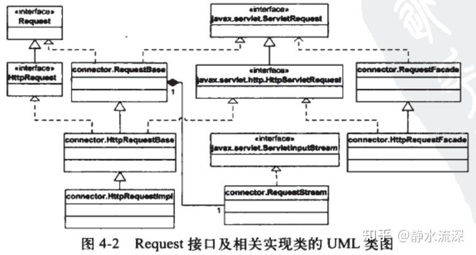

  

  

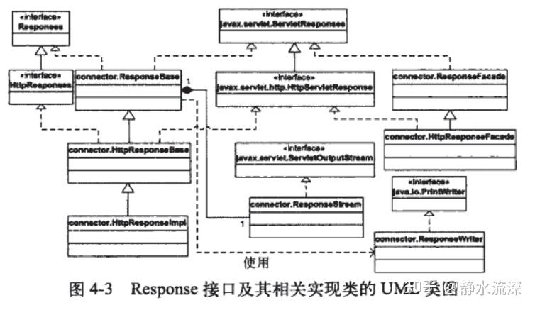

  

> 后面的章节都会使用默认连接器。

## 第五章 servlet容器

### 5.1 Container接口

对于Catalina中的servlet容器，共有四种：

-   Engine：表示**整个Catalina servlet引擎**
-   Host：表示**包含有一个或多个Context容器的虚拟主机**
-   Context：表示**一个Web应用程序**，一个Context可以有多个Wrapper
-   Wrapper：表示**一个独立的servlet**

所有的实现类都继承自抽象类ContainerBase

  

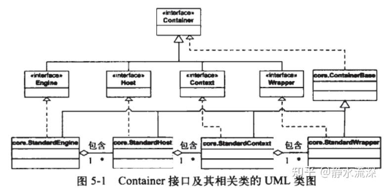

  

一个容器可以有0个或多个低层级的子容器

容器可以包含一些支持的组件，如载入器、记录器、管理器、领域和资源等。

> 所有接口都是`org.apache.catalina`包的一部分

### 5.2 管道任务

-   Pipeline接口：servlet容器通过调用invoke()方法来开始调用管道中的阀和基础阀。
-   Value接口：阀是Value接口的实例
-   ValueContext接口
-   Contained接口：阀可以选择是否实现org.apache.catalina.Contained接口，该接口的实现类可以通过接口中的方法至多与一个servlet容器相关联。

### 5.5 Wrapper应用程序

> 本节应用程序展示如何编写一个最小的servlet容器

  

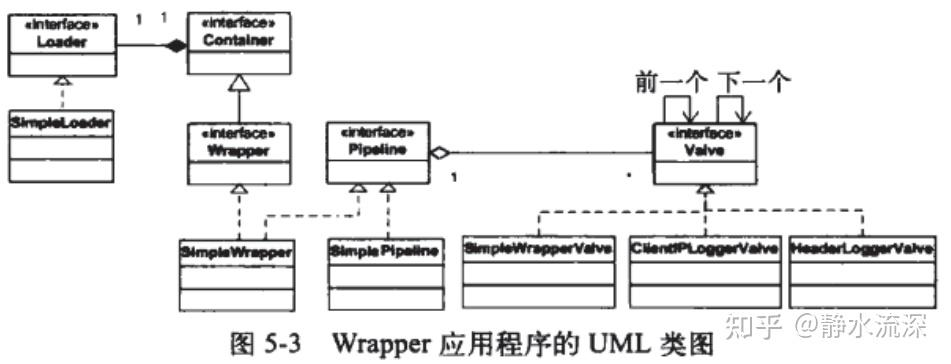

  

com.lab.tomcat.Bootstrap#main

-   实例化`HttpConnector`
-   实例化`SimpleWrapper`

-   实例化`SimplePipeline`
-   实例化`SimpleWrapperValve`，并设为`SimplePipeline`的基础阀

  
-   org.apache.catalina.Wrapper#setServletClass

-   （演示项目，写死要载入的servlet的名称为"ModernServlet"）

-   com.lab.tomcat.core.SimpleWrapper 初始化类加载器
-   org.apache.catalina.connector.http.HttpConnector#setContainer

-   设置`HttpConnector`的container为`SimpleWrapper`

  
-   org.apache.catalina.connector.http.HttpConnector#initialize
-   org.apache.catalina.connector.http.HttpConnector#start

-   ......（参考上一章）

org.apache.catalina.connector.http.HttpProcessor#run

-   org.apache.catalina.connector.http.HttpProcessor#process
-   `**this.connector.getContainer().invoke(this.request, this.response)**`
-   com.lab.tomcat.core.SimpleWrapper#invoke

-   com.lab.tomcat.core.SimplePipeline#invoke（**SimplePipeline继承Pipeline接口**）

-   （`**SimplePipelineValveContext**`**是继承ValveContext接口的内部类**）
-   com.lab.tomcat.core.SimplePipeline.SimplePipelineValveContext#invokeNext

-   根据一个从0累加的索引计算当前应执行的阀

-   如果少于阀的数量`<font style="background-color:#F1A2AB;">valves[subscript].invoke(request,response,this);</font>`
-   ...

  

-   如果等于阀的数量，调用基础阀`basic.invoke(request,response,this);`
-   ...

com.lab.tomcat.valves.ClientIPLoggerValve#invoke(Request, Response, ValveContext)

-   valveContext.invokeNext(request, response);
-   ......具体逻辑

com.lab.tomcat.valves.HeaderLoggerValve#invoke(Request, Response, ValveContext)

-   valveContext.invokeNext(request, response);
-   ......具体逻辑

com.lab.tomcat.core.SimpleWrapperValve#invoke(Request, Response, ValveContext)

-   从自己的属性中获取container（SimpleWrapper）
-   com.lab.tomcat.core.SimpleWrapper#allocate 获取servlet

-   com.lab.tomcat.core.SimpleWrapper#loadServlet

-   com.lab.tomcat.core.SimpleWrapper#getLoader

-   先获取自己的loader，为空则获取parent的loader

  

-   **实例化servlet，调用servlet的初始化方法（注意servlet是在这里实例化的）**

-   javax.servlet.Servlet#service

（也就是说，实际是最先执行基础阀SimpleWrapperValve。）

### 5.6 Context应用程序

当应用程序有多个Wrapper时，需要使用一个映射器，映射器是组件，帮助servlet容器——（本节是Context实例）——选择一个子容器来处理某个指定的请求。

servlet容器可以使用多个映射器来支持不同的协议。在这里，一个映射器支持一个协议。

  

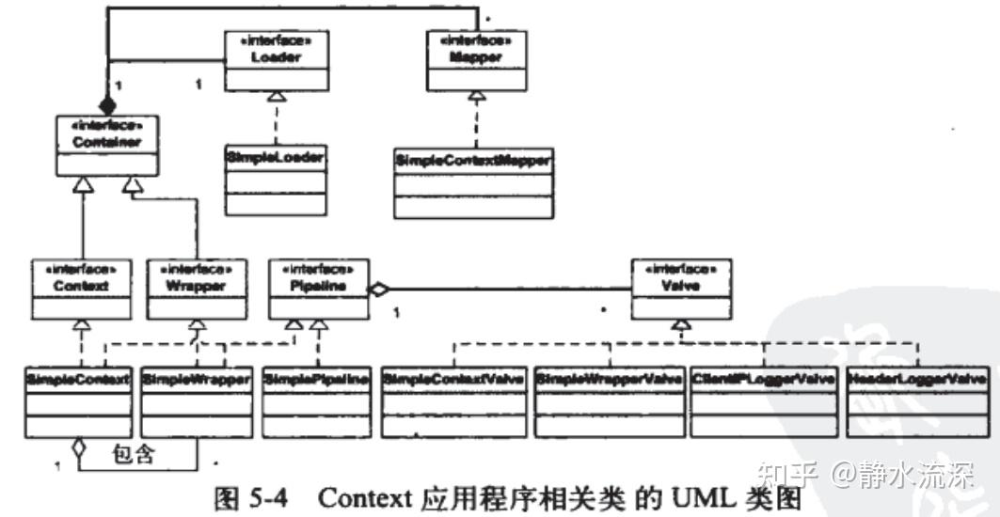

  

本节的Context应用程序使用了与上一节程序相同的载入器Loader和两个阀。但是载入器和阀都是与Context容器（而非Wrapper）相关联的，这样两个Wrapper实例就都可以使用载入器。

```java
public class Bootstrap {
    public static void main(String[] args) {
        HttpConnector connector = new HttpConnector();
        Wrapper wrapper1 = new SimpleWrapper();
        wrapper1.setName("Primitive");
        wrapper1.setServletClass("PrimitiveServlet");
        Wrapper wrapper2 = new SimpleWrapper();
        wrapper2.setName("Modern");
        wrapper2.setServletClass("ModernServlet");

        Context context = new SimpleContext();
        context.addChild(wrapper1);
        context.addChild(wrapper2);

        Valve valve1 = new HeaderLoggerValve();
        Valve valve2 = new ClientIPLoggerValve();

        ((Pipeline) context).addValve(valve1);
        ((Pipeline) context).addValve(valve2);

        Mapper mapper = new SimpleContextMapper();
        mapper.setProtocol("http");
        context.addMapper(mapper);
        Loader loader = new SimpleLoader();
        context.setLoader(loader);
        // context.addServletMapping(pattern, name);
        context.addServletMapping("/Primitive", "Primitive");
        context.addServletMapping("/Modern", "Modern");
        connector.setContainer(context);
        try {
            connector.initialize();
            connector.start();
            // make the application wait until we press a key.
            System.in.read();
        }
        catch (Exception e) {
            e.printStackTrace();
        }
    }
}
```

与上一节类似

org.apache.catalina.connector.http.HttpProcessor#process

-   `this.connector.getContainer().invoke(this.request, this.response);`
-   com.lab.tomcat.core.SimpleContext#invoke 调用pipeline的invoke方法

-   com.lab.tomcat.core.SimpleContextValve#invoke

-   com.lab.tomcat.core.SimpleContextValve#getContainer

-   获取到SimpleContext

  

-   com.lab.tomcat.core.SimpleContext#map

-   com.lab.tomcat.core.SimpleContext#findMapper
-   com.lab.tomcat.core.SimpleContextMapper#map

-   获取servlet名称 com.lab.tomcat.core.SimpleContext#findServletMapping
-   com.lab.tomcat.core.SimpleContext#findChild
-   获取到对应的SimpleWrapper

-   根据获取到的Wrapper调用 com.lab.tomcat.core.SimpleWrapper#invoke

-   临时实例化一个SimplePipelineValveContext调用invokeNext方法

-   com.lab.tomcat.core.SimpleWrapperValve#invoke
-   com.lab.tomcat.core.SimpleWrapperValve#getContainer
-   获取到SimpleWrapper

  

-   com.lab.tomcat.core.SimpleWrapper#allocate
-   com.lab.tomcat.core.SimpleWrapper#loadServlet
-   com.lab.tomcat.core.SimpleWrapper#getLoader 获取Loader
-   获取自己的loader
-   自己没有loader则获取parent的loader

-   使用Loader 载入Servlet实例

  

-   调用Servlet服务 javax.servlet.Servlet#service

-   ......执行其他继承Valve和Contained接口的XxxValue（**这里的阀都与Context容器相关而非与Wrapper相关，这样两个Wrapper实例就可以使用载入器**）

仍是在Wrapper实例中的基础阀负责载入对应servlet类

## 第六章 生命周期

Catalina包含很多组件，Catalina启动时，这些组件也会一起启动，同样关闭时，组件也会随之关闭。例如，当servlet容器关闭时，它必须条用所有已经载入到容器中的servlet类的destroy方法，而Session管理器必须将Session对象保存到辅助存储器中。通过实现`Lifecycle`接口可以达到这一目的。

-   Lifecycle接口：Catalina组件间父子关系的设计使得所有组件都置于其父组件的“监护”之下，由父组件启动/关闭它的子组件。这种单一启动/关闭机制是通过Lifecycle接口实现的。
-   LifecycleEvent类：声明周期事件是LifecycleEvent类的实例。
-   LifecycleListener接口：该接口只有一个#LifecycleEvent()方法，当某个事件监听器监听到相关事件发生时会调用该方法。
-   LifecycleSupport类：实现了Lifecycle接口，并对某个事件注册了监听器的组件必须提供Lifecycle接口中3个与监听器相关的方法的实现。然后，该组件需要将所有注册的事件监听器存储到一个数组、ArrayList或其他类似对象中。Catalina提供了一个工具类——LifecycleSupport来帮助组件管理监听器，并出发相应的生命周期事件。

### 6.5 应用程序

> 本章的应用程序建立于第五章的应用程序基础之上，主要用来说明Lifecycle接口及声明周期相关类的使用方法。

  

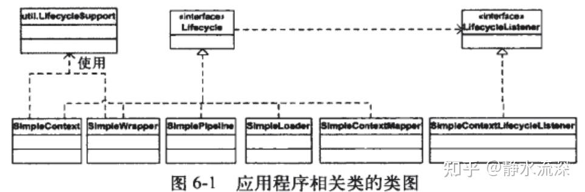

  

### 启动

com.lab.tomcat.core.SimpleContext#startcom.lab.tomcat.core.SimpleContext#start

-   org.apache.catalina.util.LifecycleSupport#fireLifecycleEvent 调用BEFORE\_START\_EVENT事件

-   org.apache.catalina.util.LifecycleSupport#fireLifecycleEvent

-   com.lab.tomcat.core.SimpleContextLifecycleListener#lifecycleEvent

-   自定义实现。判断传入的事件参数执行对应动作

  
-   org.apache.catalina.Lifecycle#start 启动Loader
-   循环调用所有子组件（两个SimpleWrapper）的启动

-   com.lab.tomcat.core.SimpleWrapper#start

-   org.apache.catalina.util.LifecycleSupport#fireLifecycleEvent 调用`BEFORE_START_EVENT`事件

-   ......

-   与Context同理，启动Loader、Pipeline
-   org.apache.catalina.util.LifecycleSupport#fireLifecycleEvent 调用`START_EVENT`事件
-   org.apache.catalina.util.LifecycleSupport#fireLifecycleEvent 调用`AFTER_START_EVENT`事件

  
-   org.apache.catalina.Lifecycle#start 启动pipeline

-   null

### 执行

具体浏览器请求服务流程和之前一样，不同之处在于，自定义servlet继承了HttpServlet

-   ......

-   com.lab.tomcat.core.SimpleWrapperValve#invoke

-   javax.servlet.http.HttpServlet#service(javax.servlet.ServletRequest, javax.servlet.ServletResponse)

-   javax.servlet.http.HttpServlet#service(javax.servlet.http.HttpServletRequest, javax.servlet.http.HttpServletResponse) 判断方法类型（`GET`/`POST`/`HEAD`等），执行具体调用

-   ModernServlet#doGet
-   自定义实现

### 关闭

com.lab.tomcat.core.SimpleContext#stop 理所当然与启动流程类似

-   LifecycleSupport#fireLifecycleEvent 调用`BEFORE_STOP_EVENT`事件
-   LifecycleSupport#fireLifecycleEvent 调用`STOP_EVENT`事件
-   关闭Pipeline
-   关闭子组件

-   com.lab.tomcat.core.SimpleWrapper#stop

-   **调用servlet的destory方法** javax.servlet.Servlet#destroy
-   LifecycleSupport#fireLifecycleEvent 调用`BEFORE_STOP_EVENT`事件
-   LifecycleSupport#fireLifecycleEvent 调用`STOP_EVENT`事件
-   关闭Pipeline
-   关闭Loader
-   LifecycleSupport#fireLifecycleEvent 调用`AFTER_STOP_EVENT`事件

  
-   关闭Loader
-   LifecycleSupport#fireLifecycleEvent 调用`AFTER_STOP_EVENT`事件

## 第七章 日志记录器

  

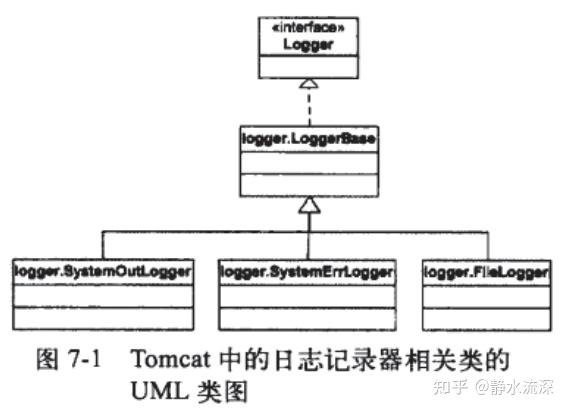

  

在Tomcat5中LoggerBase类会更复杂一些，因为它与创建Mbeans接口的代码进行了整合。

本章只讨论tomcat4中的LoggerBase类。

-   SystemOutLogger类
-   SystemReeLogger类
-   FileLogger类：在tomcat4中，FileLogger类实现Lifecycle接口

本章应用程序与第六章相同，区别在于SimpleContext对象关联了一个FileLogger组件。

```java
...

context.addServletMapping("/Primitive","Primitive");
context.addServletMapping("/Modern", "Modern");

// ---------Add logger--------
System.setProperty("catalina.base", System.getProperty("user.dir"));
FileLogger logger = new FileLogger();
logger.setPrefix("FileLog_");
logger.setSuffix(".txt");
logger.setTimestamp(true);
logger.setDirectory("webroot");
context.setLogger(logger);

connector.setContainer(context);

...
```

所以只有SimpleContext能调用该log

org.apache.catalina.logger.**FileLogger#log**

-   制作时间戳String
-   判断当前的属性`date`是否等于时间戳，不等于则

-   org.apache.catalina.logger.**FileLogger#close**

-   java.io.PrintWriter#flush
-   java.io.PrintWriter#close

  

-   当前属性`date`置为时间戳
-   org.apache.catalina.logger.**FileLogger#open**

-   实例化File对象 java.io.File
-   java.io.File#mkdirs
-   实例化装饰了java.io.FileWriter对象的java.io.PrintWriter对象作为属性

## 第八章 载入器

servlet容器需要一个自定义的载入器，而不能简单地使用系统的类载入器，因为servlet容器不应该完全信任它正在运行的servlet类。如果像前几章一样使用系统类的载入器载入某个servlet类所使用的全部类，那么servlet就能够访问所有的类，包括当前运行的Java虚拟机（JVM）中环境变量CLASSPATH指明的路径下的所有的类和库，非常危险。servlet应该只允许载入WEB-INF/classes目录及其子目录下的类，和从部署的库到WEB-INF/lib目录载入类。这就是为什么servlet容器需要实现一个自定义的载入器。载入器是org.apache.catalina.Loader接口的实例。

Tomcat需要自定义载入器的另一个原因是，为了提供自动重载功能，即当WEB-INF/classes目录或WEB-INF/lib目录下的类发生变化时，Web应用程序会重新载入这些类。在Tomcat载入器实现中，类载入器使用一个额外的线程不断地检查查servlet类和其他类文件的时间戳。支持自动重载需要实现org.apache.catalina.loader.Reloader接口。

本章由两个术语需要注意：

-   仓库（repository）：类载入器会在哪里搜索要载入的类。
-   资源（resource）：一个类载入器中的DirContext对象，其文件根路径指的就是上下文的文件根路径。

### 8.1 Java的类载入器

每次创建Java类的实例时，都必须现将类载入到内存中。Java虚拟机使用类载入器进行，一般会在一些Java核心类库、以及变量CLASSPATH中指明的目录中搜索相关类。

从J2SE1.2开始，JVM使用了三种类载入器：

-   引导类载入器（bootstrap class loader）：用于引导启动Java虚拟机，当调用javax.exe程序时就会启动引导类载入器。其是使用本地代码实现的，用来载入运行JVM所需要的类，以及所有Java的核心类，如java.lang包和[http://java.io](https://link.zhihu.com/?target=http%3A//java.io)包下的类。
-   扩展类载入器（extension class loader）：负责载入标准扩展目录中的类。这样程序员只需要将JAR文件复制到扩展目录中就可以被类载入器搜索到。
-   系统类载入器（system class loader）：是默认的类载入器，会搜索在环境变量CLASSPATH中指明的路径和JVR文件。

JAVA类载入器双亲委派机制......

Java中可以通过继承抽象类java.lang.ClassLoader类编写自己的类载入器。而Tomcat使用自定义类载入器的原因有三条：

-   为了在载入类中指定某些规则
-   为了缓存已经载入的类
-   为了实现类的预载入，方便使用

### 8.2 Loader接口

在载入Web应用程序中需要的servlet类及其相关类时要遵守一些明确的规则。如，应用程序中的servlet只能引用部署在WEB-INF/classes目录及其子目录下的类。但是servlet类不能访问其他路径中的类，即使这些类包含在运行当前Tomcat的JVM的CLASSPATH环境变量中。此外，servlet只能访问WEB-INF/lib目录下的库，其他目录中的类库均不能访问。

Tomcat中的载入器指的是应用程序载入器而不仅仅是类载入器，必须实现org.apache.catalina.Loader接口。

此外，Loader接口还定义了操作仓库集合的方法。Web应用程序中的WEB-INF/classes和WEB-INF/lib目录是作为仓库添加到载入器中的。

Tomcat载入器通常会与一个Context级别的servlet容器相关联。若Context容器中的类被修改了，载入器也可以支持对类的自动重载。

Loader接口使用#modified()方法来支持类的自动重载。但是载入器本身并不能自动重载，相反它会调用Context接口的reload()方法来实现。Context接口的标准实现（StandardContext类）禁用了自动重载，因此要启用需要在server.xml文件中添加一个Context元素（见书P115）。

  

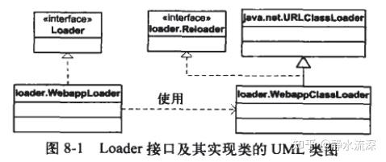

  

-   Reloader接口：为了支持类的自动重载，类载入器需要实现Reloader接口，其中最重要的是#modified()方法

### 8.4 WebappLoader类

当调用WebappLoader类的start()方法时，会完成下面几项工作

-   创建一个类载入器
-   设置仓库
-   设置类路径
-   设置访问权限
-   启动一个新线程来支持自动重载

### 8.5 WebappClassLoader类

WebappClassLoader的设计考虑了优化和安全两方面。例如，它会缓存之前已经载入的类来提升性能。此外，他还会缓存加载失败的类的名字，从而再次受到请求时直接抛出异常。

载入类的流程

-   先检查本地缓存
-   本地缓存没有则检查上一层缓存，即调用java.lang.ClassLoader类的findLoadedClass()方法
-   若两个缓存都没有，使用系统的类载入器加载，防止Web应用程序中的类覆盖J2EE的类
-   若启用了SecurityManager，则检查是否允许载入该类
-   若打开标志位`delegate`，或待载入的类是属于包触发器中的包名，则调用父载入器来载入相关类。若父载入器为null则使用系统的类载入器
-   从当前仓库中载入相关类
-   若当前仓库没有该类，且标志位`delegate`关闭，则使用父类载入器。若父载入器为null则使用系统的类载入器若父载入器为null则使用系统的类载入器
-   若仍未找到需要的类，排除ClassNotFoundException异常

### 本章程序

```java
// System.setProperty("catalina.base",System.getProperty("user.dir"));
System.setProperty("catalina.base", ModulePath.getModulePath(Bootstrap.class));
Connector connector = new HttpConnector();
Wrapper wrapper1 = new SimpleWrapper();
wrapper1.setName("Primitive");
// TODO: 这里要加myApp. 为什么原书没有？
// wrapper1.setServletClass("PrimitiveServlet");
wrapper1.setServletClass("myApp.PrimitiveServlet");
Wrapper wrapper2 = new SimpleWrapper();
wrapper2.setName("Modern");
// wrapper2.setServletClass("ModernServlet");
wrapper2.setServletClass("myApp.ModernServlet");

Context context = new StandardContext();
// Context context = new SimpleContext();
// StandardContext's start method adds a default mapper
context.setPath("/myApp");
context.setDocBase("myApp");
...
```

Bootstrap#main

-   org.apache.catalina.core.StandardContext#start

-   org.apache.catalina.core.StandardContext#setResources

-   org.apache.catalina.core.ContainerBase#setResources

  

-   org.apache.catalina.core.StandardContext#postWorkDirectory
-   org.apache.catalina.core.ContainerBase#start

-   org.apache.catalina.loader.**WebappLoader#start**

-   **创建一个类载入器**`this.classLoader = new **WebappClassLoader**(this.container.getResources());` **默认采用WebappClassLoader**

-   `this.container.getResources()`主要内容即`myApp`

-   **设置仓库** org.apache.catalina.loader.WebappLoader#setRepositories

-   `classesPath = "/WEB-INF/classes";`和`libPath = "/WEB-INF/lib";`是代码里写死的
-   "/WEB-INF/classes" 目录被传入类载入器的`addRepository`方法中
-   "/WEB-INF/lib" 目录被传入类载入器的`setJarPath`方法中

  

-   **设置类路径** org.apache.catalina.loader.WebappLoader#setClassPath

-   在servlet上下文中未Jasper JSP编译器设置一个字符串形式的属性来指明类路径信息

-   **设置访问权限** org.apache.catalina.loader.WebappLoader#setPermissions
-   **开启新线程支持自动重载功能** org.apache.catalina.loader.WebappLoader#threadStart

-   新线程周期性检查每个资源（WEB-INF/classes或WEB-INF/lib目录下）的时间戳，可设置周期间隔
-   org.apache.catalina.loader.WebappLoader#run
-   周期性休眠 org.apache.catalina.loader.WebappLoader#threadSleep
-   调用WebappLoader实例的类载入器的方法检查是否修改 org.apache.catalina.loader.WebappClassLoader#modified
-   若修改了通知关联Context容器才重新载入相关类 org.apache.catalina.loader.WebappLoader#notifyContext
-   实例化 org.apache.catalina.loader.WebappContextNotifier
-   为该notifier创建新线程并启动

  

-   `this.lifecycle.fireLifecycleEvent("start", (Object)null);`

-   org.apache.catalina.util.LifecycleSupport#fireLifecycleEvent

-   com.lab.tomcat.core.SimpleContextConfig#lifecycleEvent
-   `context.setConfigured(true);`

-   org.apache.catalina.core.StandardContext#loadOnStartup

-   com.lab.tomcat.core.SimpleWrapper#load

-   com.lab.tomcat.core.SimpleWrapper#loadServlet

-   com.lab.tomcat.core.SimpleWrapper#getLoader
-   wrapper没有注册loader，使用父组件（StandardContext）的加载器 org.apache.catalina.core.ContainerBase#getLoader

  

-   org.apache.catalina.Loader#getClassLoader 获取ClassLoader
-   org.apache.catalina.loader.**WebappClassLoader#loadClass**(java.lang.String, boolean) **加载**`**myApp.PrimitiveServlet**`
-   **检查本地缓存** org.apache.catalina.loader.WebappClassLoader#findLoadedClass0
-   `this.resourceEntries`没有

-   **检查上一层缓存** java.lang.ClassLoader#findLoadedClass
-   java.lang.ClassLoader#findLoadedClass0
-   没有

  

-   **两个缓存都没有，使用系统的类载入器进行加载** `this.system.loadClass(name);` 可以加载
-   java.lang.ClassLoader#loadClass(java.lang.String)

-   **若启用了securityManager（判断同名属性），则检查是否允许载入该类** java.lang.SecurityManager#checkPackageAccess
-   **若打开标志位**`**delegate**`**，或待载入的类是属于包触发器中的包名，则调用父载入器来载入相关类**
-   若父载入器为null则使用系统的类载入器
-   `this.parent.loadClass(name)`

  

-   **从当前仓库中载入相关类** org.apache.catalina.loader.WebappClassLoader#findClass
-   org.apache.catalina.loader.WebappClassLoader#findClassInternal
-   org.apache.catalina.loader.WebappClassLoader#findResourceInternal
-   ......

-   **若当前仓库没有该类，且标志位**`**delegate**`**关闭，则使用父类载入器**
-   若父载入器为null则使用系统的类载入器
-   `this.parent.loadClass(name)`

  

-   **若仍未找到需要的类，抛出ClassNotFoundException异常**

PS. 经常被调用的`ServletContext servletContext = ((Context)this.container).getServletContext();`，其中获取的就是就是`org.apache.catalina.core.ApplicationContext`。不知道这个和Spring里的是不是一个

## 第九章 Session管理

Catalina通过一个称为Session管理器的组件来管理建立的Session对象，该组件由org.apache.catalina.Manager接口表示。**Session需要且必须与一个Context容器关联。**servlet实例可以通过调用javax.servlet.http.HttpServletRequest接口的getSession()方法来获取一个Session对象。

### 9.1 Session对象

Session接口的标准实现是StandardSession但是为了安全起见不会直接将其实例交给servlet实例使用。而是使用了一个Session接口的外观类，StandardSessionFacade。

  

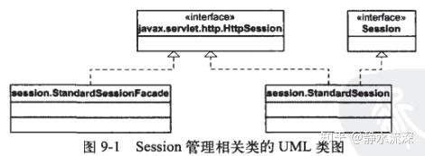

  

-   StandardSession类：StandardSession类的构造函数接受Manager接口的一个实例，迫使一个Session对象必须拥有一个Session管理器实例。

-   getSession()方法会通过传入一个自身实例来创建StandardSessionFacade类的一个实例，并将其返回。
-   若Session管理器的某个Session对象在某个时间长度内都没有被访问的话，会被Session管理器设置为过期，该时间长度由变量maxInactiveInterval的值来指定。将一个Session对象设置为过期是通过调用Session接口的expire()方法完成的。

  
-   StandardSessionFacade类：该类仅仅实现了HttpSession接口。这样，**servlet程序员就不能将HttpSession对象向下转换为StanardSession类型**，也阻止了servlet程序员访问一些敏感方法。

### 9.2 Manager

Session管理器负责管理session对象。Session管理器是org.apache.catalina.Manager接口的实例。

Catalina运行时，StandardManager实例会将Session对象存储在内存中，Catalina关闭时，会将当前内存的所有Session对象存储到一个文件中。再次启动Catalina时，又会将Session重新载入内存。

PersistentManagerBase类会将Session对象存到辅助储存器中。

  

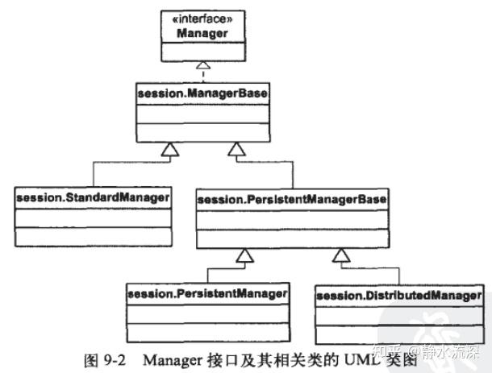

  

-   ManagerBase类：所有Session管理器都会继承此类。

-   每个Session对象都有一个唯一标识符，可以通过ManagerBase类受保护的方法generateSessionId()对象来返回唯一的标识符
-   某个Context容器的Session管理器会管理该Context容器中所有活动的Session对象。

  
-   StandardManager类是Manager接口的标准实现，并实现LifeyCycle接口，这样可以由其关联的Context容器来启动或关闭。

-   其中stop()方法的实现会调用unload()方法。以便将有效的Session对象序列化到一个名为"SESSION.ser"的文件中，而且每个Context容器都会产生这样一个文件。SESSION.ser文件位于环境变量CATALINA\_HOME指定的目录下的work目录中。
-   Session管理器还要负责销毁那些已经失效的Session对象。在Tomcat4的StandardManager类中，这项工作是由一个专门的线程来完成的。

-   PersistentManagerBase类：在持久化Session容器中，Session对象可以备份，也可以换出。备份与普通Session容器同理。当Session对象被换出时，会被移动到存储器中，因为当前活动Session对象数超出了上限值或者这个Session对象闲置了过长时间。——换出是为了节省内存空间。
-   DistributedManager类：用于两个或多个节点的集群环境，一个节点标识部署的一台Tomcat服务器。在集群环境中，每个节点必须使用DistributedManager实例作为其Session管理器，这样才支持复制Session对象。

-   为了实现复制Session对象的目的，当创建或销毁Session对象时，DistributedManager实例会向其他节点发送消息。Catalina使用org.apache.catalina.cluster包内的ClusterSender类向集群中其他节点发送消息，用ClusterReceiver类来接收消息。

### 9.3 存储器

存储器是org.apache.catalina.Store接口的实例，是为Session管理器管理的Session对象提供持久化存储器的一个组件。

  

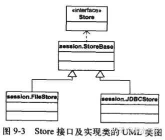

  

-   StoreBase类，在Tomcat4中，StoreBase类使用另一个线程周期性地检查Session对象，从活动的Session集合中移除过期的Session对象。
-   FileStore类：将Session对象存储到某文件中。文件名会使用Session对象的标识符加上一个后缀".session"构成，文件位于临时的工作目录下。
-   JDBCStore类：将Session对象通过JDBC存入数据库中。

### 9.4 应用程序

Bootstrap中本章额外内容在于，使用了一个StandardManager实例，并将其与Context容器相连接

|  |  |
| ----- | ----- |
|  |  |

还是要稍微改一下。

（这里主要只整理本章和Session有关的流程）

com.lab.tomcat.Bootstrap#main

-   org.apache.catalina.core.StandardContext#start

-   ......
-   org.apache.catalina.core.ContainerBase#start

-   ......
-   org.apache.catalina.session.StandardManager#start

-   org.apache.catalina.session.ManagerBase#generateSessionId

-   生成随机数

  

-   org.apache.catalina.session.StandardManager#load

-   获取session存储文件 org.apache.catalina.session.StandardManager#file
-   使用当前关联容器的加载器 this.container.getLoader();
-   使用加载器解析存储文件，解析到当前的StandardManager中

-   org.apache.catalina.session.StandardManager#threadStart

-   （创建新新线程并启动）
-   `<font style="background-color:#BA9BF2;">this.threadDone</font> = false;`
-   ...

org.apache.catalina.session.StandardManager#run

-   监听`<font style="background-color:#BA9BF2;">this.threadDone</font>`属性
-   检查Session是否有效或长时间没有使用org.apache.catalina.session.StandardManager#processExpires

-   org.apache.catalina.session.ManagerBase#findSessions

-   使用synchronized同步，将内存中的session都复制一份

  

-   若长时间没有使用，换出 org.apache.catalina.session.StandardSession#expire

关闭容器时

org.apache.catalina.core.StandardContext#stop

-   org.apache.catalina.session.StandardManager#stop

-   org.apache.catalina.session.StandardManager#threadStop

-   `<font style="background-color:#BA9BF2;">this.threadDone</font> = true;`
-   `this.thread.interrupt();`
-   `this.thread.join();`

调用请求[http://localhost:8080/myApp/Session?value=test](https://link.zhihu.com/?target=http%3A//localhost%3A8080/myApp/Session%3Fvalue%3Dtest)

org.apache.catalina.connector.http.HttpProcessor#run

-   循环监听Socket套接字 org.apache.catalina.connector.http.HttpProcessor#process

-   org.apache.catalina.connector.http.HttpProcessor#parseHeaders

-   ......
-   解析name为`JSESSIONID`的cookie，对应value即为session的ID org.apache.catalina.connector.HttpRequestBase#setRequestedSessionId

  

-   ......
-   `this.connector.getContainer().invoke(this.request, this.response);`

-   ......（参看之前整理）
-   myApp.SessionServlet#doGet

-   org.apache.catalina.connector.HttpRequestFacade#getSession(boolean)

-   `HttpSession session = ((HttpServletRequest)this.request).getSession(create);`
-   org.apache.catalina.connector.HttpRequestBase#getSession(boolean)
-   org.apache.catalina.connector.HttpRequestBase#doGetSession 使用自己的属性`requestedSessionId`来索引session
-   org.apache.catalina.session.ManagerBase#findSession