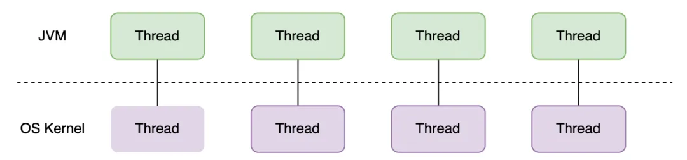
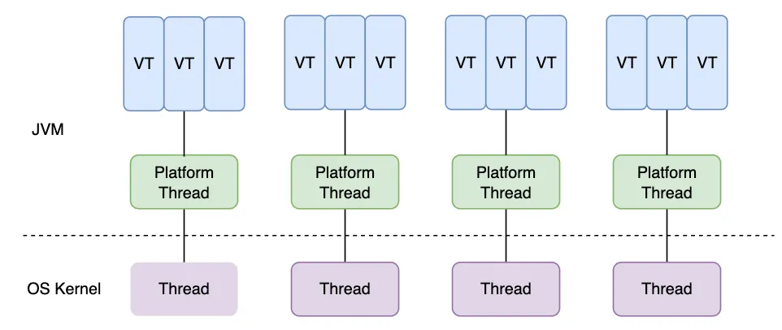
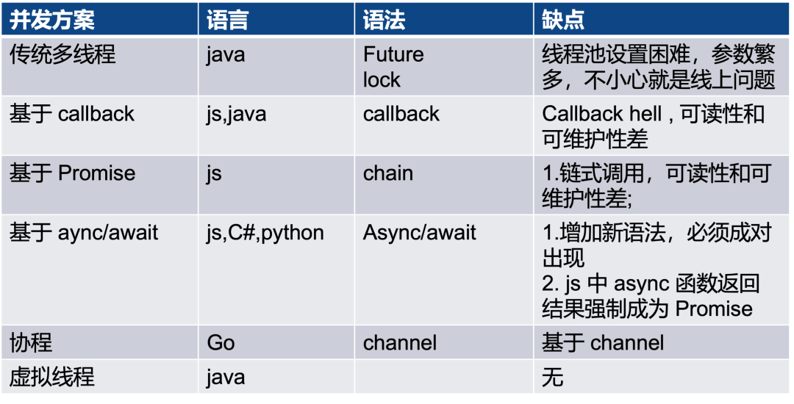
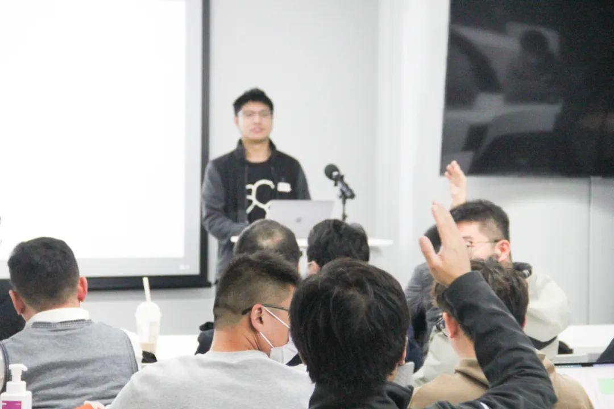
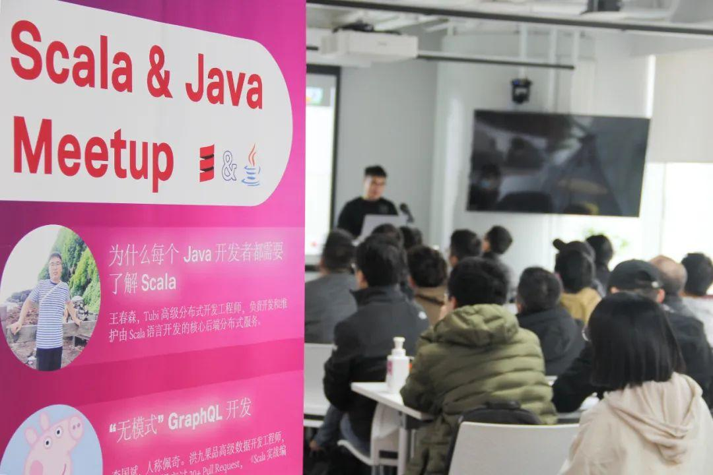

上周六，伴随着北京的第一场雪，Tubi 赞助并主办的 Scala & Java Meetup 在经历了三个多小时的技术激荡后，圆满结束。

恶劣的天气也无法阻挡大家对技术探索与交流的热情，三位来自不同公司的讲师与现场近 40 位开发者和众多在线观众围绕“回头再写 Java 一定会想念 Scala 的那些点”、“Java 与 Scala 在实际生产中的应用”、“Java 新特性虚拟线程将对 Scala 开发带来的影响”展开了热烈的分享与讨论。

本文将与大家一起回顾其中最受关注的话题 —— jdk 并发编程的终极解决方案：虚拟线程，也欢迎观看[直播回放](https://link.zhihu.com/?target=https%3A//www.bilibili.com/video/BV1Ae411Z7vN/%3Fspm_id_from%3D333.999.list.card_archive.click)。

在 Scala 和 Java 交汇的舞台上，我们不仅要探讨 Scala 社区拥抱 Java 最新技术特性的理由，同时也要为 Java 从业者提供 Scala 的便捷性扩展。[第九期 Scala Meetup](https://link.zhihu.com/?target=http%3A//mp.weixin.qq.com/s%3F__biz%3DMzU4NzYxOTkyOQ%3D%3D%26mid%3D2247535555%26idx%3D1%26sn%3Dc398a30b3971ae2300c8cb5e3d58383a%26chksm%3Dfdeb40f5ca9cc9e33ec2cd00ccec2c1b9d83e9f2309e535ac0bd2d9a125eadcbfaa4ad2a1d65%26scene%3D21%23wechat_redirect) 的最后一位分享嘉宾是快手资深开发工程师亢伟楠，他分享了 jdk 并发编程的终极解决方案。

## 话题回顾

### **为何选择虚拟编程？**

在深入讨论虚拟线程之前，我们需要审视当前 Java 线程所面临的一系列问题：

-   **昂贵的线程开销：** 每个线程都需要分配大约 1MB 的内存作为堆栈存储空间，这不仅占用大量内存，同时导致操作系统频繁进行上下文切换。在一个拥有 1500 个线程的场景中，就需要 1.5GB 内存来支持。

-   **同步** **IO** **下的线程池问题：** 在同步 IO 的情况下，线程池存在阻塞排队问题，导致排队延迟。
-   **异步** **IO** **的问题：** 异步 IO 通常依赖于回调，可能引发回调地狱和隐式线程切换等问题。
-   **Kotlin** **协程的传染性：** Kotlin 协程要求标注方法是阻塞还是非阻塞，而这种标注具有传染性，可能导致程序分割为两部分，影响可读性、可维护性和编写难度。

虚拟线程为这些问题提供了一系列解决方案：

-   **高效运行和低内存占用：** 虚拟线程具有快速运行和低内存占用的特点，尤其在阻塞操作上的成本非常低。
-   **同步方式编写异步代码：** 虚拟线程支持以同步方式编写异步代码，由 jdk 负责线程调度和切换，从而提高代码的可维护性。

  

  

同时相较于传统的 Java、JavaScript、C#、Go、Python 等编程模型，虚拟线程在非 CPU 密集型应用方面几乎有着压倒性的优势。

### **虚拟线程的问题**

然而，虚拟线程并非完美的解决方案，它也面临一些问题：

-   **非** **CPU** **密集型应用有效：** 虚拟线程对于非 CPU 密集型应用非常有效，但在 CPU 密集场景下使用可能导致载体线程严重阻塞，从而影响全局虚拟线程吞吐量。
-   **G1** **GC** **的限制：** G1 GC 不支持巨大的栈块对象，当栈块大小达到 G1 GC region 的一半时，最小仅 512kb，可能导致 StackOverflowError。
-   **Pinned Threads 的问题：** 在某些情况下，虚拟线程无法让出载体线程，这种情况被称为 Pinned Threads。这样的行为会对性能产生影响，不过未来可能会移除这个限制。

此外，虚拟线程虽然支持 ThreadLocal，但需要谨慎使用。尽管能轻松创建百万级别的虚拟线程，但如果不注意 ThreadLocal 的使用方式，很容易导致内存占用激增。

### **对于虚拟线程在 Scala 的展望**

在 Scala 中，虚拟线程的引入可能带来一系列潜在的好处：

-   **性能提升：** Scala 自身的性能可能会得到显著提升，特别是在处理非 CPU 密集型任务时。
-   **生态系统的效率提升：** Scala 周边的生态系统，如 Akka、Slick 等，可能会充分利用虚拟线程，以提高效率，更好地满足大规模异步编程的需求。

总的来说，虚拟线程对于 Scala 社区来说是一个令人激动的发展。我们可以期待在未来看到更多有关 Scala 和虚拟线程融合的创新和优化。在 Tubi 的 Scala & Java Meetup 上，这一技术的探索与分享将为整个社区带来更多启发和思考。

—— 以上分享来自现场观众周鹏程

## **热门话题讨论**

**提问：**虚拟线程成熟后会让编程的成本变得很低，由于大家都会写 Java，大家都会自动地用到虚拟线程，对 Akka 响应式编程或 Go 语言会有什么冲击么？

**伟楠：**我想引用 Oracle Java 语言架构师 Brian Goetz 的一句话，他说，如果未来虚拟线程成熟，可能会对目前的响应式编程框架造成威胁。他在[视频](https://link.zhihu.com/?target=https%3A//www.youtube.com/watch%3Fv%3D9si7gK94gLo%26t%3D1156s)中的原文是 I think Project Loom is going to kill Reactive Programming。

对于 Go 这样的语言，在我看来冲击可能不会太大，因为它们的使用场景不同。比如，在常用的云原生场景中，如果需要一个函数能够在云上适配毫秒级的启动能力，Java 在这方面有一些不足，而 Go 作为一门编译型语言，直接发布为二进制代码，在启动速度、执行速度和资源占用上都比 Java 系语言更具优势。通常，Java 系语言需要携带 jdk，首先进行解释执行，然后进行混合编译，这些过程会导致整体启动速度变慢。在这些方面，Java 和响应式编程不是竞争对手。

**启文：**在我看来对 Go 影响不大，我之前也写过 Go，并使用 Go 协程。对于当时刚刚写代码的我来说，这是一个很大的冲击。在 Java 中，需要编写大量的线程和性能池，并调用它们。而在 Go 中，只需要使用 go-function 就可以实现。Go 的核心概念是 Channel，即消息队列，用来分发不同协程之间的消息。我当时觉得这与 Java 中的线程是非常不同的，使用起来真的很方便，速度也很快。

在我之前的公司，我们使用 Java 的响应式框架集成 gRPC，当时我没有找到类似 GRPC+Springboot+Reactive Framework 的官方文档支持，但是自然地支持了 Go 的协程，再加上开源中对协程的友好支持，即使虚拟线程再成熟，对 Go 影响也不会很大；但是对于 Scala 或其他 JVM 语言冲击可能相对更大一些。

**春森：**长期影响难以确定，短期来看，虚拟线程对 Scala 或异步编程可能会起到增强作用。对于 JVM 语言来说，目前的异步框架或者方案始终存在一个无法解决的问题，比如 JDBC 在请求数据库时，我们无法实现真正的异步，因为 JDBC driver 它本身就是阻塞操作。当然，一些框架试图解决这个问题，比如重写 JDBC Driver，但是大部分 JDBC driver 还是同步阻塞的，这就导致我们有时候不得不同时配备计算线程池和 IO 线程池。然而，如果有了虚拟线程，在我认为这一问题有望得到解决。

此外，人们在编程中还会有一些养成习惯，比如一些人习惯使用 actor 模型来构建代码，虚拟线程可以用来替换 actor 的线程池，从而增强 actor 的性能。特别是对于业务代码，用户可能习惯于在现有框架模型下进行开发，比如开发者习惯了 Future 的异步控制逻辑能力，开发者可以决定何时同步执行、何时变为异步或者并行。Java 新特性虚拟线程，可以替换这些编程模型或者框架的底层线程池逻辑，从而使代码性能变得更好。这是我关于虚拟线程对 Scala 异步编程短期影响的一些观点，对于长期影响，我还没有更多的结论。

## 加入 Tubi

Tubi Data Team 目前正在寻找一位大数据平台开发 Lead，他 / 她将领导数据开发团队，创建高质量、可扩展的流数据管道，与所有用户建立联系；将在开放创新的环境中与机器学习团队、产品经理、DevOps 团队和数据科学家合作，推动用户增长；对系统架构设计全面负责，解决性能、可扩展性、可重用性和灵活性等问题；并倡导工程最佳实践，培养与保持团队内的工程师文化；负责技术招聘和指导团队成员的职业发展，建立一支高效的开发团队。

首选编码语言为 Scala、Python 或 Java。[欢迎投递简历！](https://link.zhihu.com/?target=https%3A//boards.greenhouse.io/tubitvchina/jobs/5007360)