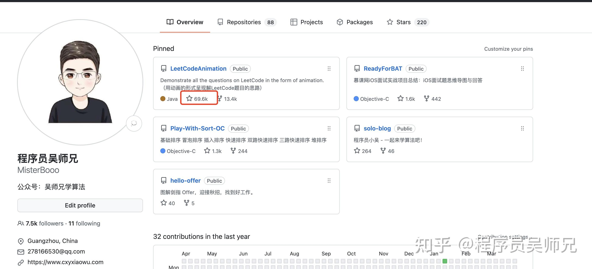
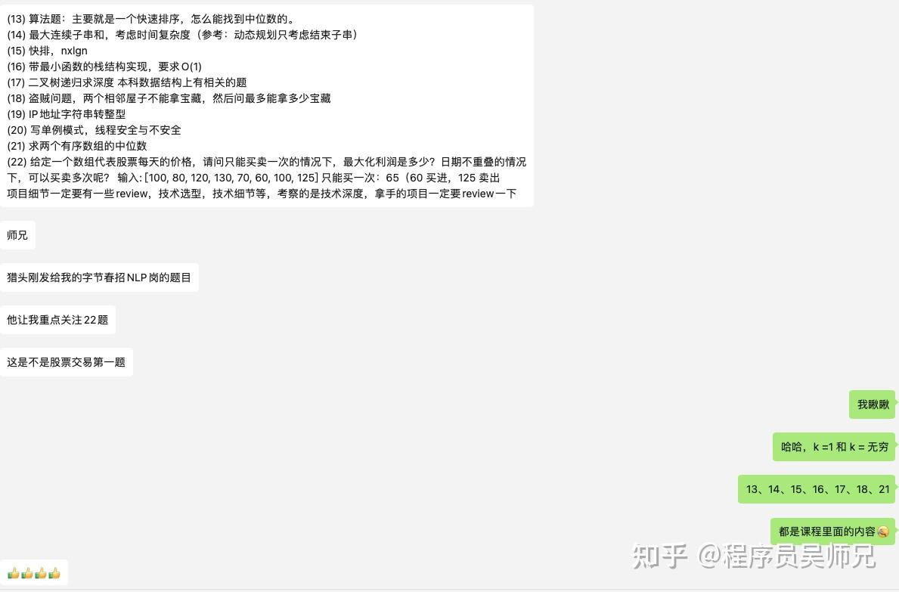
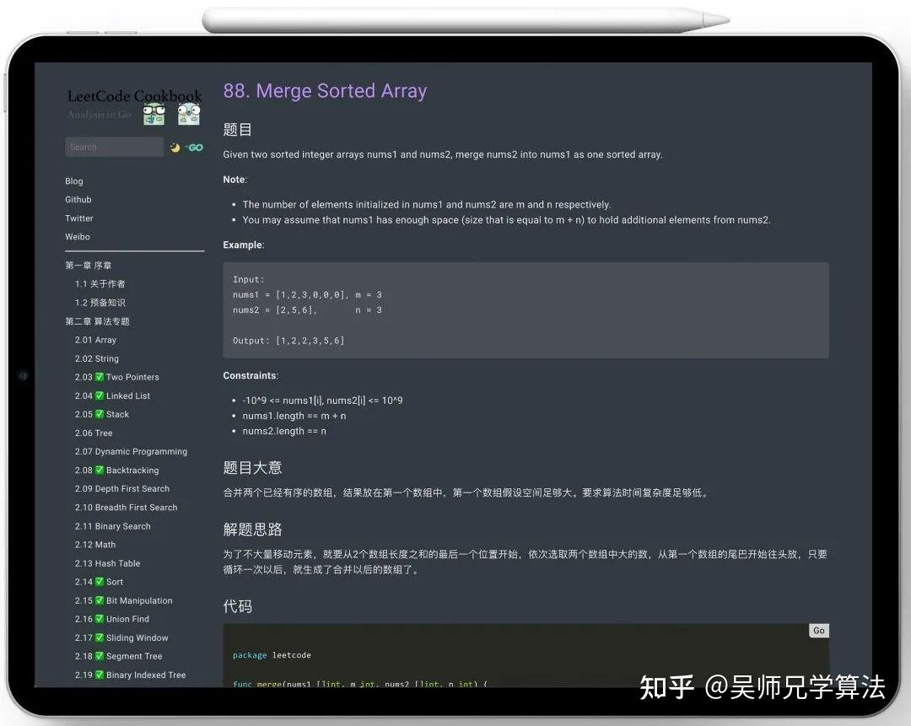
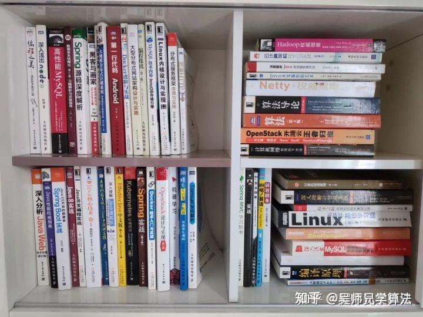

**一年后，2022 年你刷了 365 道题目。**

除非你是刻意的练习，比如集中某个时间段刷同种类型的题目。

题主问这个我估计是想着刷 LeetCode 然后通过算法面试进大厂吧。

**给题主分享一下如何科学的刷 LeetCode。**

为了避免知乎大佬觉得我吹逼，先贴一下自己的 GitHub 地址，**目前 70，000 star，全球排名 51 名。**

[https://github.com/MisterBooo](https://link.zhihu.com/?target=https%3A//github.com/MisterBooo)

算法是一种技能，是可以通过科学合理的方式训练出来的能力。

在想刷题之前，得从心里认识到接受刷题很重要，才能坚持去刷题。

江湖有个传言：**国内刷 LeetCode，最多够你吃 1 年老本；湾区刷 LeetCode ，够你吃 10 年老本了。**

**为什么湾区的刷题性价比这么高呢？**

**你想想，电面考 4 道题，一道题值 5 万！单位是 Dollar ！**

**刷到就是赚到！！**

**想想是不是很刺激，有没有动力开始刷题了！可以提速刷题了！**

就目前互联网的情况来说，无论是面国外大厂还是面国内大厂，如果想换工作都要去刷题，一面二面不丢你几道 Hard 题，都对不住你偷偷摸摸找个会议室假装开会实则面试的鸡贼。

同时，还得认识到一点，**面试能力和你平时的工作能力其实差别挺大的。**

**有些人技术挺厉害的，但没有刷题，一面二面都过不了，**而某些小镇刷题家，还真就靠刷题拿下了 Google、微软、脸书等大厂offer。

国内大厂也有这种趋势，比如字节，一大半都是面试题。

**要不是他提前先看视频刷题，妥妥得凉凉。**

**所以，刷题很重要。**

（PS：感谢大家耐心的阅读，算法是程序员的重中之重，必须攻克，大厂面试必考，顺便送一份阿里大佬刷Leetcode总结的算法笔记，如果你能吃透，那我相信80%的技术面试都会不在话下：

[BAT大佬写的Leetcode刷题笔记，看完秒杀80%的算法题！](https://link.zhihu.com/?target=https%3A//mp.weixin.qq.com/s%3F__biz%3DMzUyNjQxNjYyMg%3D%3D%26mid%3D2247508248%26idx%3D1%26sn%3D5c930d65226dafad77c836b3887031a2%26chksm%3Dfa0dce99cd7a478feb2c39e591058d03d0f12786e1165d06f7a3ac0ace1bc1f1d1b1e3242a43%26token%3D958380826%26lang%3Dzh_CN%23rd)

这本书的目录，非常经典：

**刷题大概可以分为 4 个阶段。**

**1、纯小白，**不知道怎么刷题，对很多概念都很陌生，各种数据结构和知识点几乎完全不懂，打开 LeetCode 第一题，满头问号。

有人相爱、有人夜里开车看海、有人 LeetCode 第一题都做不出来。

2、算法上基本已经入门，Easy 可以做出来，Medium 纠结半天也能有头绪，但基础不牢，比如字符转字符串还得 Google 一下。

3、刷了几百道题后，总结了自己的解题模板，参加周赛有时候甚至可以全部完成。

4、开始以 beat 100% 作为 AC 的目标了。

就目前的算法面试大环境来说，能达到第二阶段，中小公司可以应付过去了，到达第三阶段，字节、腾讯算法面试环节妥妥没问题了。

怎么样到达第三阶段？

给一下我的一些小建议吧。

1、如果目标是国内大厂，那么一定要刷足够的题，不需要把 LeetCode 上 2500 道算法题都刷完，但至少刷 200 道算法高频题，这些高频题我都写了题解同时也录制了视频，

[LeetCode 刷多少题能进大厂面试?](https://link.zhihu.com/?target=https%3A//mp.weixin.qq.com/s/yznC53g46phq3qF7V4-obA)

2、面试前一周以看题为主，因为刷题也刷不了几题，多看看自己总结或者别人总结的模板，比如回溯算法模板，掌握后，几十道回溯题都不在话下。

一些模板：

[回溯，不难！](https://link.zhihu.com/?target=https%3A//mp.weixin.qq.com/s/2CLyNJtTnVQeEsy4fPC3Eg)

3、刷题过程需要注意难度要循序渐进，算法训练是一个系统工程，需要循序渐进，太过于急功近利，反而容易因做不出难题而产生挫败感，带来反效果。

如果你本身有基础，熟练度高，那你刷简单的 LeetCode 应该是几分钟一题，几分钟一题的，花不了你多少时间。

如果你刷简单都花费很长时间，说明熟练度不够，就更应该从简单开始，然后过度到中等，再过度到困难。

并且，目前国内大厂的算法考察，基本不会超过 LeetCode 中等难度，上限难度基本都是 LeetCode 中等题里面的中等难度，所以不要太去纠结难题怪题偏题。

把高频题掌握就行了：[LeetCode 刷多少题能进大厂面试?](https://link.zhihu.com/?target=https%3A//mp.weixin.qq.com/s/yznC53g46phq3qF7V4-obA)

再退一步，如果你觉得 LeetCode 的题目太难，可以先从《剑指 Offer》上的算法题开始学起。

为了帮助大家更好的入门学习算法，经过半年的积累，我给大家**卷**了《剑指 Offer》系列的三十道题目，结合动画的形式录制了视频，相信能帮助你更好的刷题。

领取地址：

[当《剑指 Offer》上的题都变成了动画](https://link.zhihu.com/?target=https%3A//mp.weixin.qq.com/s/sk2kPb1rogmg9SmOfQ1nLw)

4、**按算法分类来选题，比如**一个时间段，只刷链表题，刷得差不多的时候，接下来再刷二叉树的题。

这样做有几个很明显的好处。

一、持续地刷同个类型的题目，可以不断地巩固和加深理解，可以总结出自己的思考路径或者解题模板。

比如链表题目，就会去思考虚拟头节点、双指针、快慢指针。

二、可以更全面地接触这个数据结构，算法的各个变种，这会促使你对这个数据结构，算法的理解更加全面和深刻，学习的效率会更高。

我一直认为读书是世界上性价比最高的成长方式，书很便宜但分量很重，是让我们摆脱平庸走向卓越的方式之一。

对于计算机专业的学生而言，读计算机经典书籍不光能让你快速提升知识和能力，更会让你在校招之际如虎添翼。

**书籍下载：[计算机必看经典书籍（含下载方式）](https://link.zhihu.com/?target=https%3A//mp.weixin.qq.com/s/9q4_tcvd_mcibjlUGH8C8w)**

## 最后，再给大家送上点干货！

下面这是一个**高赞回答合集**，建议大家**点赞&收藏**，Mark住别丢了，**大学期间绝对用得上**。

1、怎么学好数据结构，看下面这个回答，已经获得了 **21000+ 的赞和 50000+的收藏。**

[怎么学好数据结构？2.2 万赞同 · 349 评论回答](https://www.zhihu.com/question/19830721/answer/667233164)

2、如何系统地学习算法，看下面这个回答，已经获得了 **11000+ 的赞和 26000+的收藏。**

[如何系统地学习算法？1.1 万赞同 · 97 评论回答](https://www.zhihu.com/question/20588261/answer/926157817)

3、新手该如何使用 GitHub，看下面这个回答，如果在大学期间就知道使用 GitHub ，那么能力远超同龄人。

[新手该如何使用 GitHub？7704 赞同 · 87 评论回答](https://www.zhihu.com/question/21669554/answer/1230957628)

4、想成为一名优秀的程序员，那么这些程序员平时都喜欢逛的论坛怎么说你也得收藏一些吧。

[程序员们平时都喜欢逛什么论坛呢？4177 赞同 · 119 评论回答](https://www.zhihu.com/question/27145069/answer/1503477887)

5、无论别人怎么说，我都是坚定不移的选择计算机专业。

[为什么有人劝别选计算机专业?3493 赞同 · 319 评论回答](https://www.zhihu.com/question/407082013/answer/1936953434)

6、如何系统地学习 C++ ，这个回答能帮你找到路线。

[如何系统地学习 C++ 语言？2109 赞同 · 19 评论回答](https://www.zhihu.com/question/23447320/answer/1742702508)

7、想要准备 Java 面试，那么这些面试题必须掌握。

[Java 面试都只是背答案吗？884 赞同 · 13 评论回答](https://www.zhihu.com/question/452184164/answer/1923347183)

**赶紧点赞和收藏吧~**