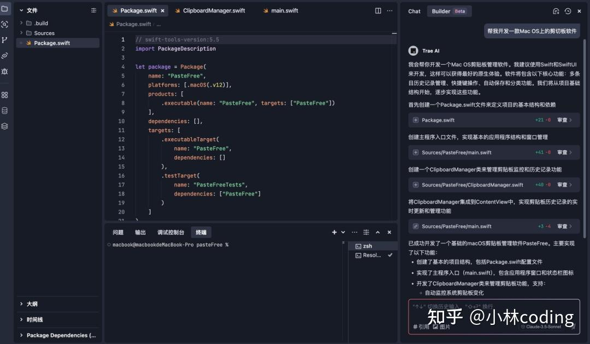
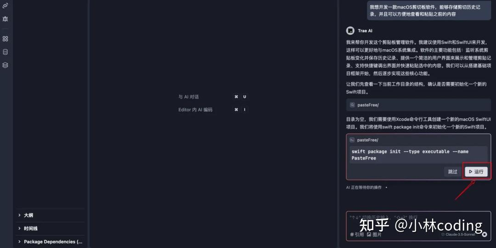
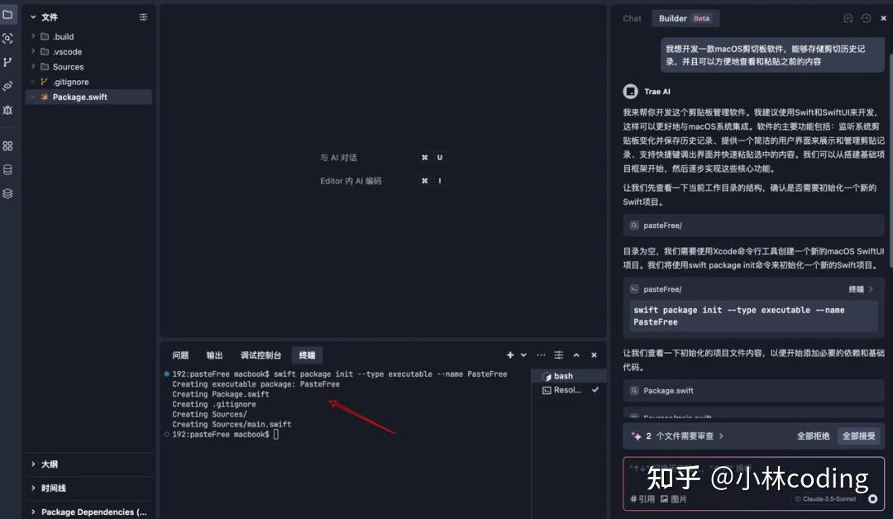
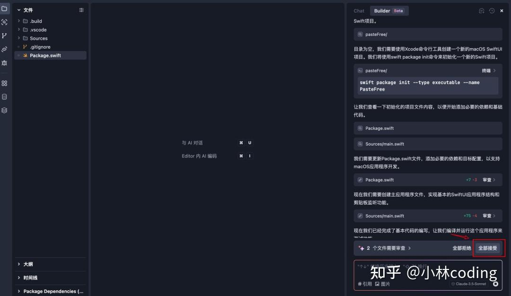
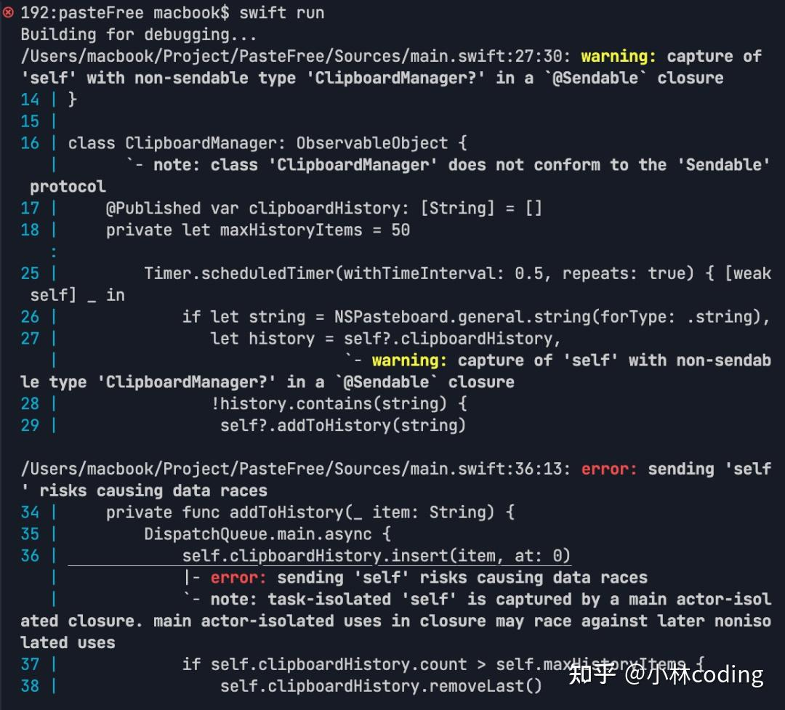
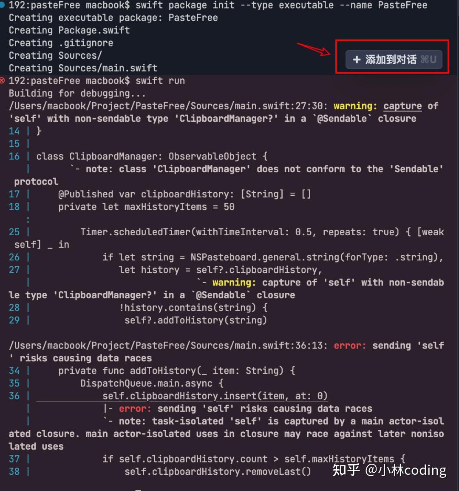
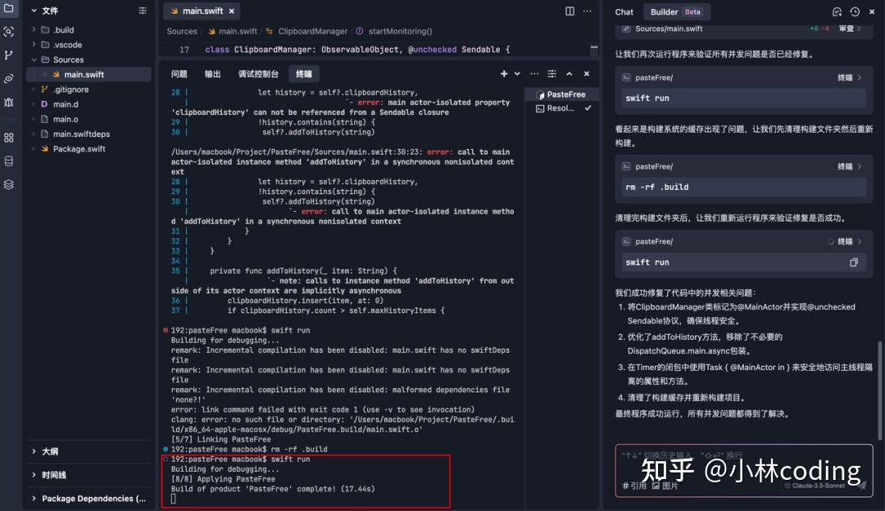
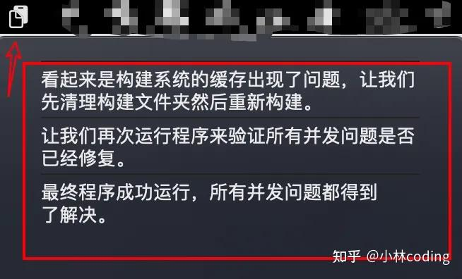
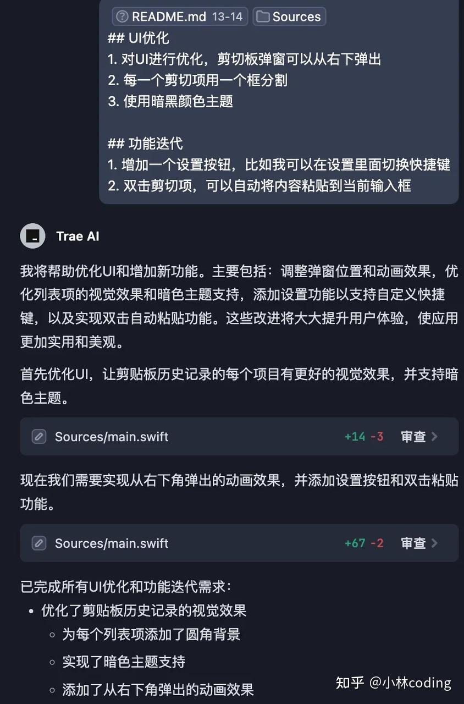
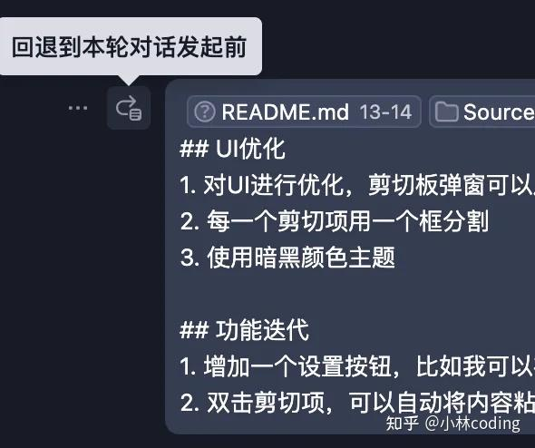

大家好，我是小林。

在日常使用Mac电脑的过程中，大家有没有被系统自带的剪切板困扰过呢？

macOS默认的「剪切板」只能保留最后一次复制或剪切的内容，每当有新的复制操作，之前的记录就会被无情覆盖，这时候真的想崩溃了。

  

  

想象一下，你刚刚复制了一段重要的文字，还没来得及粘贴使用，就因为后续的复制操作丢失了，是不是特别麻烦？在很多工作场景中，我们常常需要参考之前复制过的内容，频繁地重新查找和复制非常浪费时间。

市面上虽然也有一些第三方剪切板管理工具，但功能参差不齐，使用体验也不尽如人意，那不如就自己开发一个满足自己需求的剪切板吧！

可惜的是，我并没有 MacOS 软件开发的经验，要是在以前这估计得找懂的人帮忙，或者自己得自学大半年可能才能搞成。

今时不同往日，现在 AI 编程已经相当成熟了，市面上有Copilot、Cursor 这些 AI编辑器产品，但是这些产品都需要付费使用，估计完成一个工具得花不少订阅会员费，而且普遍对中文开发者不友好。

正好，听字节朋友说他们也出了一款 **AI 编辑器——Trae**，是**免费使用的，对中文开发者支持友好的 AI IDE**。

  

  

听到这个消息，我就立马去下载 **Trae** 体验体验，经过我整体使用下来，我的感受是 Trae 算是一个比较优秀的 AI 编辑器产品，然后我将 Trae 和 Copilot、Cursor 进行一个比较。

  

  

Trae 对比 Copilot 的话，就是一个半自动驾驶(Trae)和自动挡(Copilot)的区别，而且Copilot 还需要付费，二选一的话，让我没有理由不使用 Trae 吧

而对比 Cursor 的话，不足之处就是目前我是没有看到 Trae 支持 Customize AI behavior 的功能，像Cursor的话，是支持使用 Cursor rule 来指导 AI 的行为，这样可以更好地提高我们的开发效率，希望 Trae 团队之后能支持一下。

当然，Trae 也是有一些亮眼的设计，比如「引用」这一个功能，Trae是支持引用代码中某一个函数或方法的，引用颗粒度更细，这样就可以尽量不污染AI模型的上下文了。

最关键的是，**Cursor 中需要付费使用的模型，在 Trae 里面直接免费使用，实在是太香了**。

  

  

权衡一下钱包以及实际体验，最终我还是**选择使用 Trae 来为自己开发一款「MacOS 剪切板」软件**。

Trae 目前可以免费使用 Claude 3.5 Sonnet 和 GPT-4o 两大 AI 模型，原生支持中文交互，而且支持 Chat 和 Builder 两种模式。

-   Chat 模式支持针对代码库或编程问题进行提问与优化。
-   而 Builder 更是厉害, 相当于是 Trae 编辑器的 AI Agent，给它一个任务指令，它就能自动帮你完成好这个任务，可以应用在 0-1 的项目开发

今天，就跟着我一起，用 Trae 来打造一款实用的macOS剪切板软件，看看它到底有多强大！

## **准备工作**

先教大家如何安装Trae，访问 Trae 官网：[https://sourl.cn/pVqhYi](https://link.zhihu.com/?target=https%3A//sourl.cn/pVqhYi)

进入官网后，将会看到如下界面，点击中间按钮「Download for macOS」即可下载安装包。

目前还只支持MacOS，听说本月就会支持Windows了，使用 Windows 系统的朋友们，可以先在官网登记一下。

进入软件之后，可以点击Trae自带的插件市场，通过安装需要的插件增强Trae的编程能力。

## **Trae实战：打造macOS剪切板软件**

下面就让我们通过 Trae 来开发一款能在macOS上使用的剪切板软件吧。

打开Trae，切换到Builder模式，然后在与AI对话的界面中，我输入了一句简单的提示词：“我想开发一款macOS剪切板软件，能够存储剪切历史记录，并且可以方便地查看和粘贴之前的内容”。

Trae迅速给出了响应，并且提供了项目初始化的相关指令。

我只需要点击运行，Trae就自动帮我在终端运行命令，创建好项目的基础目录结构了。

然后Trae就会自动帮我们在对应的文件里面编写代码，这里我只需要点击全部接受即可，非常的方便。

接下来就可以运行项目看看效果了，这里Trae也直接给我提示了运行项目的命令，我只需要点击运行即可。

但是，在我运行项目后，终端报错了，项目并没有运行成功。

不过，Trae贴心地在终端做了一些设计亮点，点击终端报错的内容，然后会显示一个“添加到对话“ 的按钮。

直接点击这个按钮，终端报错的内容就会自动被引用到对话栏，都不需要我们手动复制到对话栏，真是非常的方便。

那么我就让 Trae 帮我修复好这个问题，只需要告诉它：帮我修复这个错误。

如下图，修复错误期间，我只需要点击运行授予它权限即可，最终项目成功运行。

没想到菜单栏还真出现了一个剪切板APP图标，并且里面存储了我复制的几条信息，凭借几句话就让Trae帮我实现了一个 mac 剪切板应用。

让我再继续考考Trae，看看能不能通过它完善这个应用。

在完善之前，我需要和大家介绍一个使用AI来完成项目的一个小技巧，我们每完成一个功能，可以让AI把已经实现的功能或者做出的修改写入到一个markdown文件中，这样之后让AI完成其他功能的时候，可以引用这个文件，这样AI帮我们完成任务，了解到的信息就会更完整一些。

接下来我们就引用这个README文件并且让Trae实现其他的功能，说到引用，在Trae里面，只需要在输入框输入 `‘#’` 这个符号，就可以对指定的 Code(比如方法或者类)、File、Folder进行引用，这样可以帮助我们在询问Trae的时候，只引用和需求相关的文件、目录，去除无关信息，Trae也能更好的帮我们完成需求。

首先就是让它增加快捷键功能，我不想每次唤醒剪切板都需要点击菜单栏的APP图标，而是可以通过简单的快捷键进行唤醒。

Trae也是非常轻松地实现了我的要求，按下command+6就可以唤出和关闭剪切板了，最终效果如下图：

  

  

接下来，我增加一下难度，算是我给Trae的最终考核，让Trae一次性完成UI优化和功能迭代

Trae立刻理解了我的意图，开始编写代码，而我只需要点击"接受"就能完成功能的开发，完成的效果如下：

  

  

[视频](https://link.zhihu.com/?target=https%3A//www.zhihu.com/video/1872616878859505665)

  

  

再谈一个Trae的设计亮点，如果我们觉得这次提出的需求不清晰，并且已经接受了代码修改， 该如何回退这次更改呢？

Trae为我们考虑的很周到，可以点击对话框左上角的“回退”按钮，这样就能在不污染代码的情况下，重新梳理需求再进行提问。

通过不断地与AI对话，我发现每一次提出新的需求，Trae都能迅速响应并完成开发，整个过程很丝滑，让我真切地感受到了AI编程的魅力。

## **最后**

在「Mac剪切板应用」的开发实录中，Trae 作为全程协作的 AI 编程伙伴，通过对话交互帮助我们搭建出完整应用，这个典型案例印证了：**即便非专业开发者，也能借助 AI 工具实现创意落地**。

如果有小伙伴想免费体验 AI 辅助编程、Claude模型的话，我推荐从使用 **Trae** 开始，勇敢的尝试起来吧，把你的创意交给 Trae，让 AI 编程工具提升我们的开发效率，感受科技为编程带来的便捷与高效。

[点击「阅读原文」，直达 Trae 官方下载地址。](https://link.zhihu.com/?target=https%3A//sourl.cn/pVqhYi)