Dubbo你知道吧？

Dubbo启动的时候有个预热的思想你知道吧？

就是这个方法：

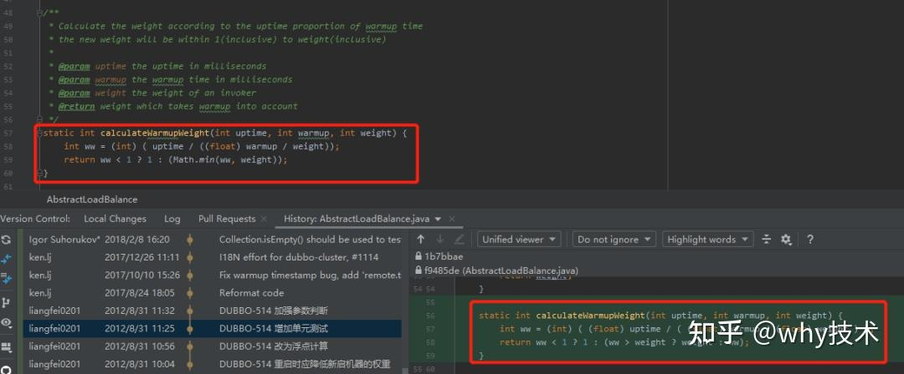

这个方法是 Dubbo 启动的时候，给新机器预热，一点点的给权重。第一分钟给 10% 的流量，第二分钟给 20% 的流量...第十分钟这个时候机器基本上已经经过充分的预热，所以可以给到 100% 的流量。

至于为什么要预热呢，这个就和 JVM 相关了，你如果感兴趣的话，可以去研究一下。

就是这个功能，这一个核心方法，经过 10 多年时间，除了一点微调，其核心算法、核心逻辑没有发生一点变化。

再比如，我给你看看最少活跃数负载均衡策略的实现 LeastActiveLoadBalance.java：


从初始化提交之后，一共就没修改过几次。

你也可以对比一下，初始版本和当前最新的版本，核心算法、核心逻辑基本没有发生变化：

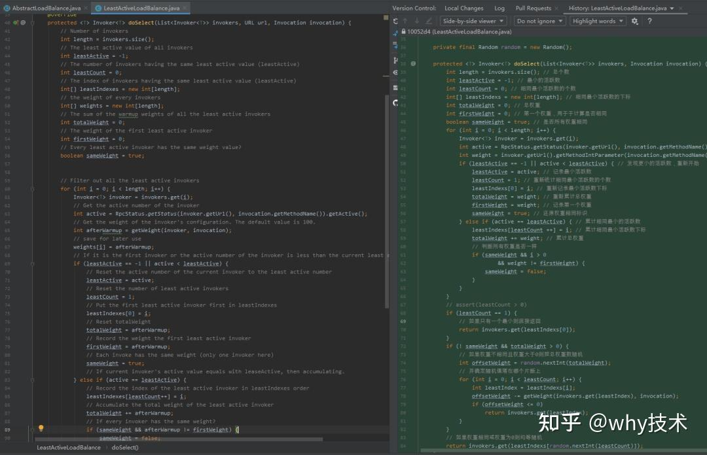

这两个类告诉我一个什么道理？

比起业务代码的增删改查，只有算法，稳定的算法才是更容易在岁月的长河中留下来的，而且历久弥新。

这就是有“技术含量”的代码中的一种。

[算是我看源码时的一个小技巧吧~](https://link.zhihu.com/?target=https%3A//mp.weixin.qq.com/s/sut-IcXvJ8LRbm7RVSGA3Q)

  

\---------------------------2022-08-25更新----------------------

基于这个话题写了个文章，全文如下：

[对于程序员来说，怎样才算是在写有“技术含量”的代码？](https://link.zhihu.com/?target=https%3A//mp.weixin.qq.com/s/dCm5IyyLRbXpJoIne5o-Yg)

你好呀，我是歪歪。

我最近其实在思考一个问题：

> 对于程序员来说，怎样才算是在写有“技术含量”的代码？  

为什么会想起思考这个看起来就很厉（装）害（逼）的问题呢？

因为这就是知乎上的一个问题：

> [https://www.zhihu.com/question/37093538](https://www.zhihu.com/question/37093538)  


第一次看到这个问题的时候，我很快的就划过去了，完全就没有关注这个问题。但是就是看了那么一眼，这个问题就偶尔不经意间在脑海中浮现出来。

然后隔了一段时间，中午刷知乎的时候这个问题又冒出来了。

好巧不巧，也是那天中午，我看到了这样的一个面试题：


看到这个面试题的第一眼，我就想起了 Dubbo 服务中的一个预热功能。

在结合知乎这个问题，我当时就觉得：Dubbo 服务的预热源码在我看来就是一个“有技术含量”的代码呀。

这一块功能编码确实一点也不复杂，主要是能体现出编码的人对于 JVM 和 RPC 方面的“内功”，能够意识到，由于 JVM 的编译特点，再加上 Dubbo 在架构中充当着 RPC 框架的角色，所以为了服务最大程度上的稳定，可以在编码的层面做一定的服务预热。

但是写完相关回答之后，从评论区来看，基本上是清一色的吐槽，说我举得这个例子和问题相悖。

比如我截取点赞最高的两个评论：


看完这些吐槽之后，我觉得这些吐槽是有道理的，我的例子举得确实不好，非常的片面。

为了更好的引出这个话题，我先搬运并扩充一下我当时的回答吧。

顺便也算是回答一下刚刚说的那个面试题。

## **服务预热**

下面这个方法，只有两行，但是这就是 Dubbo 服务预热功能的核心代码：

> org.apache.dubbo.rpc.cluster.loadbalance.AbstractLoadBalance#calculateWarmupWeight  

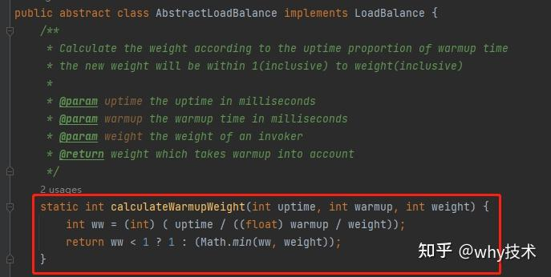

看一下这个方法在框架里面调用的地方：

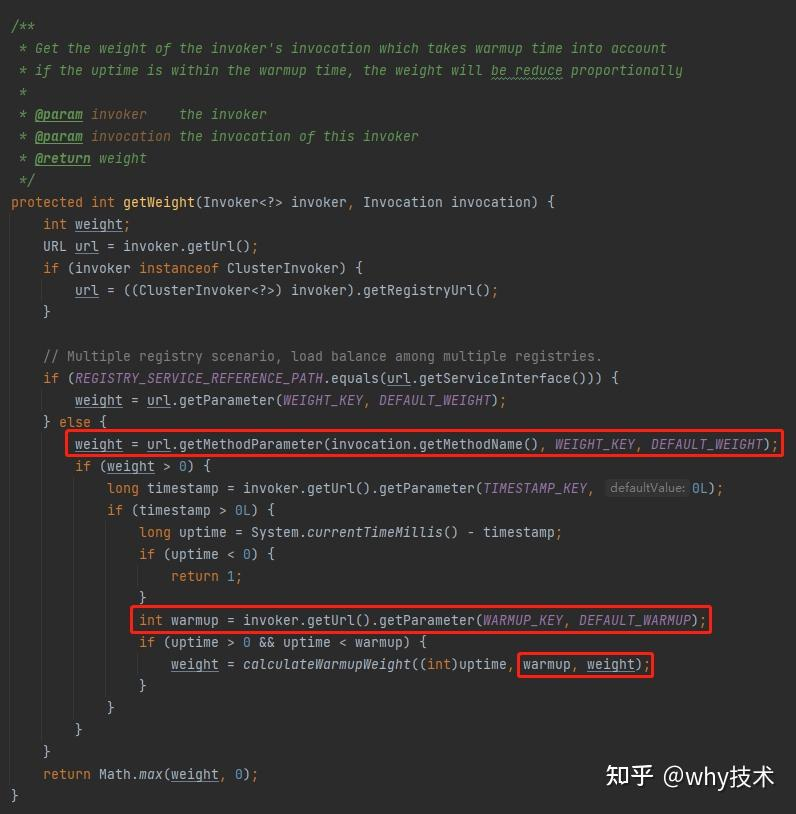

当我们不指定参数的情况下，入参 warmup 和 weight 是有默认值的：

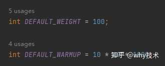

也就是在用默认参数的情况下，上面的方法可以简化为这样：

```text
static int calculateWarmupWeight(int uptime) {
    //int ww = (int) ( uptime / ((float) 10 * 60 * 1000 / 100));
    int ww = (int) ( uptime / 6000 );
    return ww < 1 ? 1 : (Math.min(ww, 100));
}
```

它的入参 uptime 代表服务启动时间，单位是毫秒。返回参数代表当前服务的权重。

基于这个方法，我先给你搞个图。

下面这个图，x 轴是启动时间，单位是秒，y 轴是对应的权重：

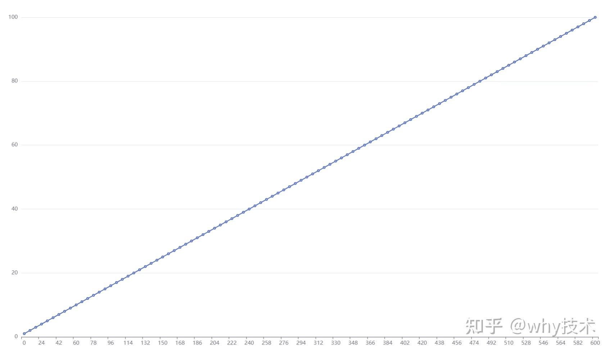

从图上可以看出，从服务启动开始，每隔 6 秒权重就会加一，直到 600 秒，即 10 分钟之后，权重变为 100。

比如当 uptime 为 60 秒时，该方法的返回值为 10。

当 uptime 为 66 秒时，该方法的返回值为 11。

当 uptime 为 120 秒时，该方法的返回值为 20。

以此类推...

600 秒，也就是十分钟以及超过十分钟之后，权重均为 100，代表预热完成。

那么这个权重是干啥用的呢？

这个就得结合着负载均衡来说了。

Dubbo 提供了如下的五种负载均衡策略：

-   Random LoadBalance :「加权随机」策略
-   RoundRobin LoadBalance：「加权轮询」策略
-   LeastActive LoadBalance：「最少活跃调用数」策略
-   ShortestResponse LoadBalance：「最短响应时间」策略
-   ConsistentHash LoadBalance：「一致性 Hash」 策略

除了一致性哈希策略外，其他的四个策略都得用到权重这个参数：

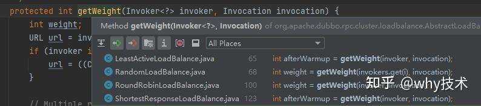

权重，就是用来决定这次请求发送给哪个服务的一个关键因素。

我给你画个示意图：

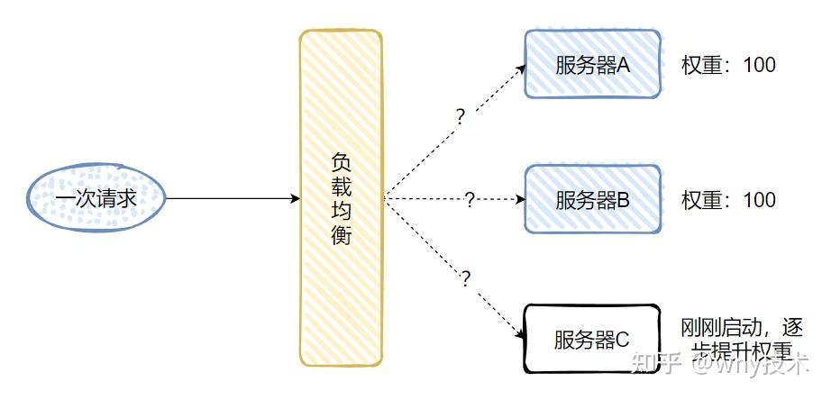

A、B、C 三台服务，A，B 的权重都是 100，C 服务刚刚启动。

作为一个刚刚启动的服务，是不适合接受突发流量的，以为运行在服务器上的代码还没有经过充分的编译，主链接上的代码可能还没有进入编译器的 C2 阶段。

所以按理来说 C 服务需要一个服务预热的过程，也就是刚刚启动的前 10 分钟，应该有逐步接受越来越多的请求这样的一个过程。

比如最简单的加权随机轮询的负载均衡策略中，关键代码是这样的：

> org.apache.dubbo.rpc.cluster.loadbalance.RandomLoadBalance#doSelect  

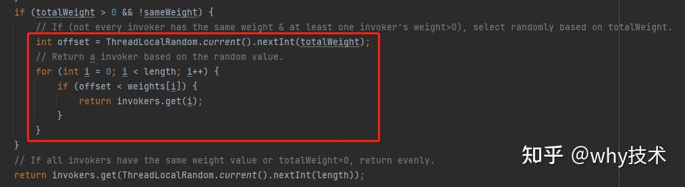

看不明白没关系，我再给你画个图。

在 C 服务启动的第 1 分钟，它的权重是 10：


所以代码中的 totalWeight=210，因此下面这行代码就是随机生成 210 之内的一个数字：

> int offset = ThreadLocalRandom.current().nextInt(totalWeight);  

在示意图中有三个服务器，所以 for 循环中的 lenght=3。

weights\[\] 这个数组是个啥玩意呢？

看一眼代码：

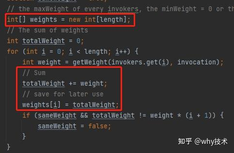

每次循环的时候把每个服务器的权重汇总起来，放到 weights\[\] 里面。

在上面的例子中也就是这样的：

-   weights\[0\]= 100（A服务器的权重）
-   weights\[1\]= 100（A服务器的权重）+100（B服务器的权重）=200
-   weights\[2\]= 100（A服务器的权重）+100（B服务器的权重）+10（C服务器的权重）=210

当随机数 offset 在 0-100 之间，A 服务器处理本次请求。在 100-200 之间 B 服务器处理本次请求。在 200-210 之间 C 服务器处理本次请求：

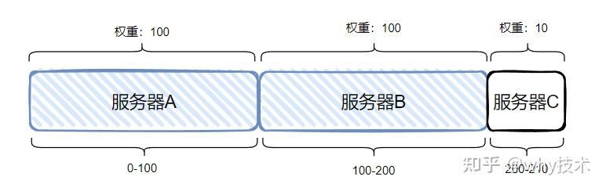

也就是说：C 服务器有一定的概率被选上，来处理这一次请求，但是概率不大。

怎么概率才能大呢？

权重要大。

权重怎么才大呢？

启动时间长了，权重也随之增大了。

比如服务启动 8 分钟之后，就变成这样了，C 服务器被选中的概率就大了很多：

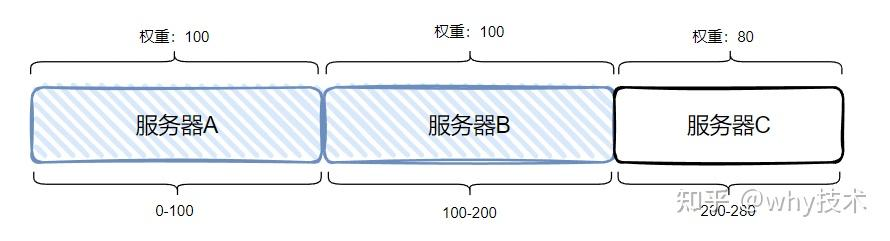

最后到 10 分钟之后，三台服务器的权重一致，承担的流量也就几乎一致了。

C 服务器承担的请求随着服务启动时间越来越多，直到 10 分钟后到达一个峰值，这就算是经历了一个预热的过程。

前面介绍的就是一个预热的手段，而类似于这样的预热思想你在其他的一些网关类的开源项目中也能找到类似的源码。

但是预热不只是有这样的一个实现方式。

比如阿里基于 OpenJDK 搞了一个 Alibaba Dragonwell，其实也就是一个 JDK。

> [https://github.com/alibaba/dragonwell8](https://link.zhihu.com/?target=https%3A//github.com/alibaba/dragonwell8)  

其中之一的特性就是预热：

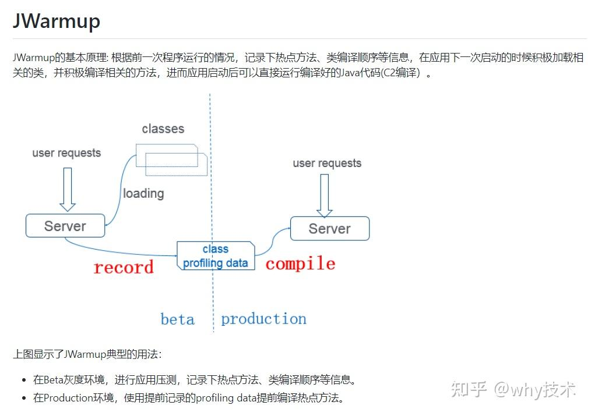

除了预热这个点之外，我还在知乎的回答中提到了最少活跃数负载均衡策略的实现 LeastActiveLoadBalance.java：

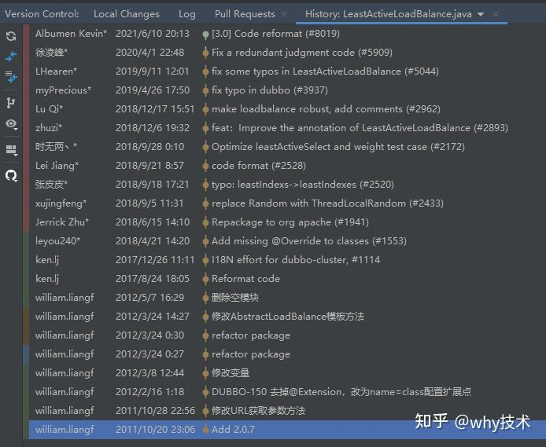

从初始化提交之后，一共就没修改过几次。

你也可以对比一下，初始版本和当前最新的版本，核心算法、核心逻辑基本没有发生变化：


除了这个策略之外，其他的几个策略也是差不多类似的“稳定”。

## **从评论说起**

我在知乎回答这个问题的时候，没有上面这一小节写的那么多，但是核心内容大概就是上面这些。

在回答说提到预热，我是想表达看似不起眼的两行代码，背后还是蕴含了非常多的深层次的原因，我觉得这是有“技术含量”的。

而提到负载均衡策略的实现，多年来都没有怎么变化，我是想表达这些重要的、底层的、基础的代码，写好之后，长年没动，说明最开始写出来的代码是非常稳定的。能写出这样稳定的代码，我觉得这也是有“技术含量”的。

接着带你看看评论区：


评论几乎是清一色的不认可这个回答。但是我前面说了，在回答这个问题的时候，确实觉得我的回答是比较贴近主题的。

但是看了评论之后我想明白了，为什么这是一个不好的答案，正如评论区说的：

> 例子举得不行，只不过是因为要解决的问题一直没有发生改变，所以解决方案也就相对稳定。  

首先这样的代码本来就和绝大部分程序员实际工作中写的代码差距过大，框架的源码值得学习，但是在实际开发中的借鉴意义不大。

而且评论区也提到了，绝大多数程序员根本就没有机会去写这样的比较考验“技术能力”的代码。

这也确实是事实，少部分中间件的开发和绝大部分业务逻辑的开发，是两个思维模式完全不一样的程序员群体。

然后我看了一下这个话题下的高赞回答：

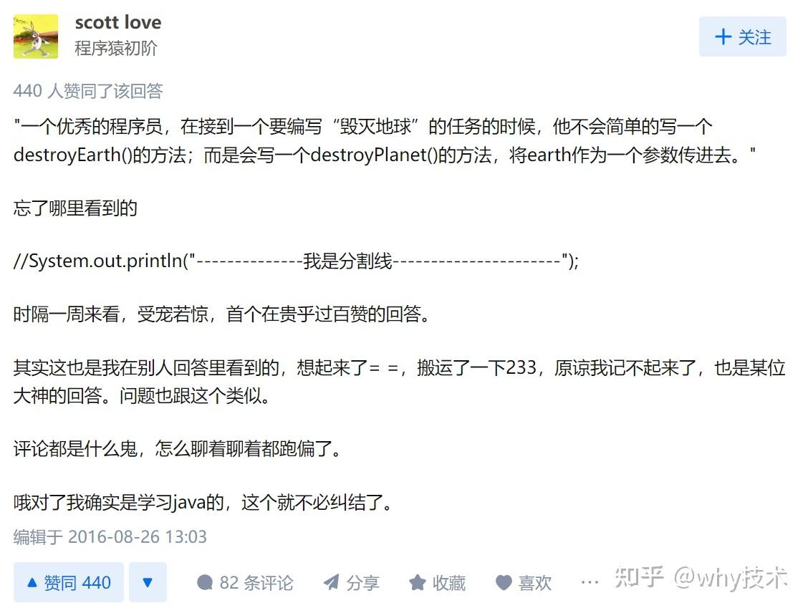

其实高赞回答就这一句话：

> 一个优秀的程序员，在接到一个要编写“毁灭地球”的任务的时候，他不会简单的写一个destroyEarth()的方法；而是会写一个destroyPlanet()的方法，将earth作为一个参数传进去。  

这才是比较贴近我们实际工作的一个例子。

就着这个例子，我换个常规一点的需求来说，比如让你接入一个微信支付的需求：

你可能会这样去定义一个类：

```text
public class WechatPayService {
    
    public void wechatPayment(){
        //微信支付相关逻辑
    }
}
```

当要使用的时候，就把 WechatPayService 注入到需要使用的地方，没有任何毛病。

但是随着而来的一个需求是让你接入支付宝支付。

你当然是自然而然的搞了一个类似的类：

```text
public class AliPayService {
    
    public void aliPayment(){
        //支付宝支付相关逻辑
    }
}
```

但是你写着写着发现：诶，怎么回事，感觉支付宝的这套逻辑和微信的有很多相似之处啊，开发的关键步骤感觉都一模一样？

于是你定义了一个接口，使用策略模式来专门干“支付”相关需求：

```text
public interface IPayService {

    /**
     * 支付抽象接口
     */
    public void pay();
}
```

在我看来，这是一个非常常规的开发方案，我甚至在拿到“微信支付”这个需求的时候，我就轻车熟路的知道应该使用策略模式来做这个需求，为了方便以后的开发。

但是，我这个“轻车熟路”也是有一个熟悉的过程的，我也不是一开始，一入行，一工作就知道应该这样去写的。

我是在工作之后，看了大量的实际项目里面的代码，看到项目在用，觉得这样很实用，项目结构也很清晰，才在其它的类似的需求中，刻意的模仿学习、理解、运用、打磨，慢慢的融入到了自己的编码习惯中去，由于太过熟悉，我渐渐的认为这是没有技术含量的东西。

直到后来，有一次我带着一个实习生做一个项目，项目中有一个排行榜的功能，排行榜需要支持各个维度，前端请求的时候会告诉我当前是需要展示哪个排行榜。

在需求分析、系统设计以及代码落地阶段我都自然而然的想到了前面说到的策略模式。

后来实习的同学看到了这一段逻辑，给我说：这个需求的实现方式真好。如果让我来写，我绝对想不出这样的落地方案。

但是我觉得这就是个常规解决方案而已。

我举这个例子是想表达的意思就是对于“技术含量”这个东西，每个人，每个阶段的理解是截然不同的。

与我而言，站在我现在正在写这篇文章的时间节点上，我觉得有技术含量的代码，就是别人看到后愿意使用，愿意模仿，愿意告诉后面来的人：这个东西真不错，你也可以用一用。

它可以小到一个项目里面的只有寥寥几行的方法类，也可以大到一套行业内问题的完整的技术解决方案。

除了这个例子外，我还想举我刚刚参加工作不久，遇到过的另外一个例子。

需求说来也很简单，就是针对一个表的增删改查操作，也就是我们常常吐槽的没有技术含量的 crud。

但是，我当时看到别人提交的代码时我都震惊了。

比如一个新增操作，所有的逻辑都在一个 controller 里面，没有所谓的 service 层、dao 层，一把梭直接把 mapper 注入到了 controller 里面，在一个方法里面从数据校验到数据库交互全部包圆了。

功能能用吗？

能用。

但是这样代码是有“技术含量”的代码吗？

我觉得可以说是毫无技术含量了，用现在的流行语来说，我甚至觉得这是程序员在“摆烂”。

我要基于对于这一段代码继续开发新功能，我能做什么呢？

我无能为力，原来的代码实在不想去动。

我只能保证在这堆“屎山”上，我新写出来的代码是干净的、清晰的，不继续往里面扔垃圾。

后来我读了一本书，叫做《代码整洁之道》，里面有一个规则叫做“童子军军规”。

军规中有一句话是这样的：让营地比你来时更干净。

类比到代码上其实就是一件很小的事情，比如只是改好一个变量名、拆分一个有点过长的函数、消除一点点重复代码，清理一个嵌套 if 语句...

这是让项目代码随着时间流逝而越变越好的最简单的做法，持续改进也是专业性的内在组成部分。

我觉得我对于这一点“规则”落实的还是挺好的，看到一些不是我写的，但是我觉得可以有更好的写法时，而且改动起来非常简单，不影响核心功能的时候，我会主动去改一下。

我能保证的是，这段代码在经过我之后，我没有让它更加混乱。

把一段混乱的代码，拆分的清晰起来，再后来的人愿意按照你的结构继续往下写，或者继续改进。

你说这是在写“有技术含量”的代码吗？

我觉得不是。

但是，我觉得这应该是在追求写“有技术含量”的代码之前，必须要具备的一个能力。而且是比写出“有技术含量”的代码更加重要的一个基础能力。

## **延伸**

以上就是我个人的一点观点，但是我还想延伸出一些别的东西。

比如在写文章之前，我也在思否网站上提出了这个问题：

> [https://segmentfault.com/q/1010000042111980](https://link.zhihu.com/?target=https%3A//segmentfault.com/q/1010000042111980)  


大家见仁见智，从各个角度给出了不同的回答。

这也再次印证了前面我说的观点：

> 对于“技术含量”这个东西，每个人，每个阶段的理解是截然不同的。  

我把大家给我的回复贴过来，希望能对你也有帮助：

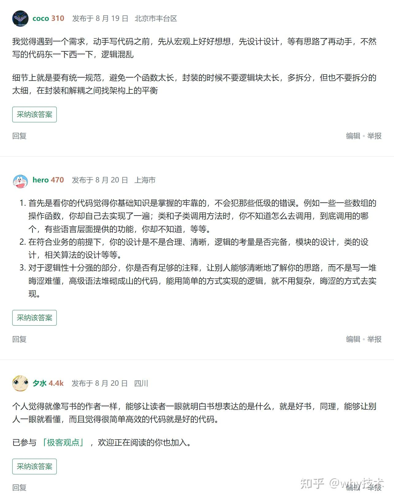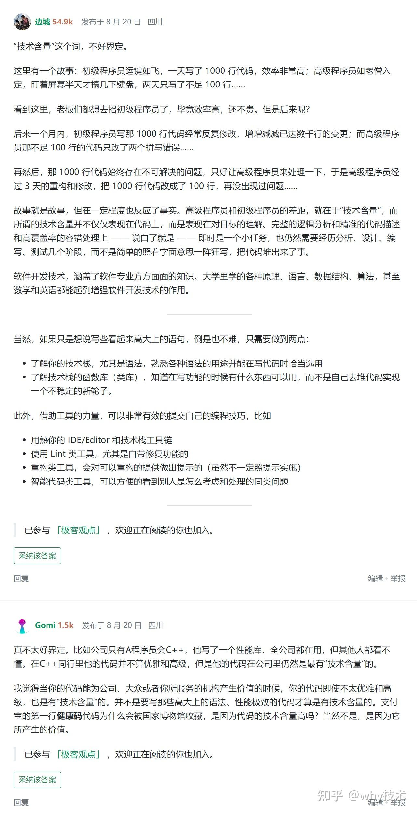

再比如我最近在知乎上看到了这样的一个视频：

> [https://www.zhihu.com/zvideo/1542577108190068737?page=ogv](https://www.zhihu.com/zvideo/1542577108190068737?page=ogv)  


里面的主人公黄玄，说了这样的一段话：


这已经是另外一个维度的程序员，对于“什么是有技术含量的代码”的另外一个维度的解答了。

我远远达不到这个高度，但是我喜欢这个回答：

> 不断的传承下去，成为下一代软件，或者说下一代人类文明的基石。我觉得能够去参与这样的东西，对我来说，可能是程序员的一种浪漫。