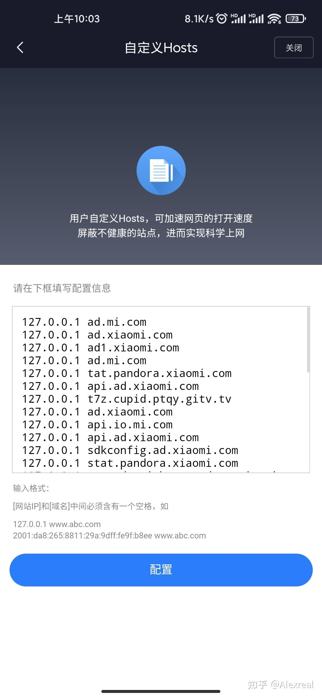
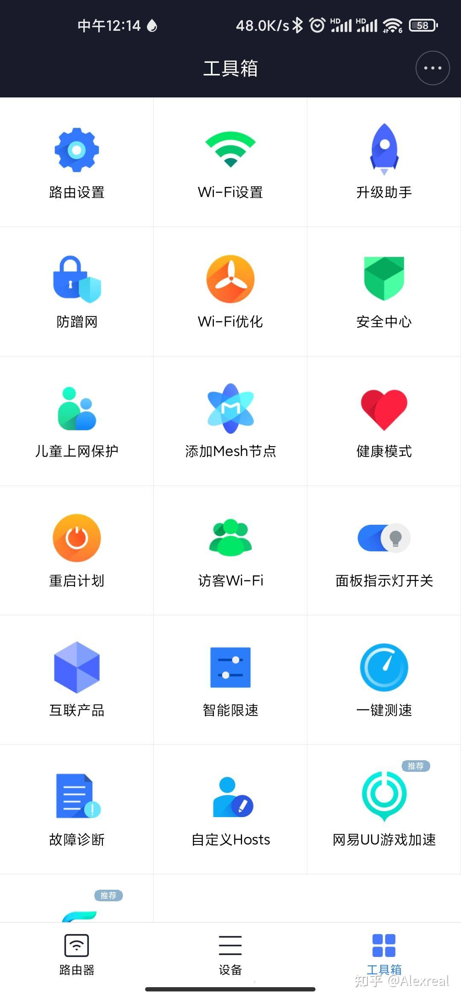
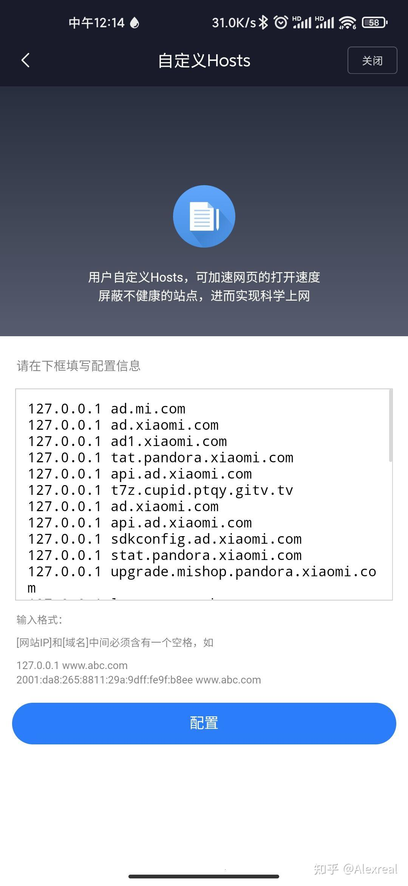

127.0.0.1 [http://ad.mi.com](https://link.zhihu.com/?target=http%3A//ad.mi.com)

127.0.0.1 [http://ad.xiaomi.com](https://link.zhihu.com/?target=http%3A//ad.xiaomi.com)

127.0.0.1 [http://ad1.xiaomi.com](https://link.zhihu.com/?target=http%3A//ad1.xiaomi.com)

127.0.0.1 [http://tat.pandora.xiaomi.com](https://link.zhihu.com/?target=http%3A//tat.pandora.xiaomi.com)

127.0.0.1 [http://api.ad.xiaomi.com](https://link.zhihu.com/?target=http%3A//api.ad.xiaomi.com)

127.0.0.1 [http://t7z.cupid.ptqy.gitv.tv](https://link.zhihu.com/?target=http%3A//t7z.cupid.ptqy.gitv.tv)

127.0.0.1 [http://ad.xiaomi.com](https://link.zhihu.com/?target=http%3A//ad.xiaomi.com)

127.0.0.1 [http://api.ad.xiaomi.com](https://link.zhihu.com/?target=http%3A//api.ad.xiaomi.com)

127.0.0.1 [http://sdkconfig.ad.xiaomi.com](https://link.zhihu.com/?target=http%3A//sdkconfig.ad.xiaomi.com)

127.0.0.1 [http://stat.pandora.xiaomi.com](https://link.zhihu.com/?target=http%3A//stat.pandora.xiaomi.com)

127.0.0.1 [http://upgrade.mishop.pandora.xiaomi.com](https://link.zhihu.com/?target=http%3A//upgrade.mishop.pandora.xiaomi.com)

127.0.0.1 [http://logonext.tv.kuyun.com](https://link.zhihu.com/?target=http%3A//logonext.tv.kuyun.com)

127.0.0.1 [http://config.kuyun.com](https://link.zhihu.com/?target=http%3A//config.kuyun.com)

127.0.0.1 [http://mishop.pandora.xiaomi.com](https://link.zhihu.com/?target=http%3A//mishop.pandora.xiaomi.com)

127.0.0.1 [http://dvb.pandora.xiaomi.com](https://link.zhihu.com/?target=http%3A//dvb.pandora.xiaomi.com)

127.0.0.1 [http://api.ad.xiaomi.com](https://link.zhihu.com/?target=http%3A//api.ad.xiaomi.com)

127.0.0.1 [http://de.pandora.xiaomi.com](https://link.zhihu.com/?target=http%3A//de.pandora.xiaomi.com)

127.0.0.1 [http://data.mistat.xiaomi.com](https://link.zhihu.com/?target=http%3A//data.mistat.xiaomi.com)

127.0.0.1 [http://jellyfish.pandora.xiaomi.com](https://link.zhihu.com/?target=http%3A//jellyfish.pandora.xiaomi.com)

127.0.0.1 [http://gallery.pandora.xiaomi.com](https://link.zhihu.com/?target=http%3A//gallery.pandora.xiaomi.com)

127.0.0.1 [http://bss.pandora.xiaomi.com](https://link.zhihu.com/?target=http%3A//bss.pandora.xiaomi.com)

127.0.0.1 [http://gvod.aiseejapp.atianqi.com](https://link.zhihu.com/?target=http%3A//gvod.aiseejapp.atianqi.com)

127.0.0.1 [http://sdkauth.hpplay.cn](https://link.zhihu.com/?target=http%3A//sdkauth.hpplay.cn)

127.0.0.1 [http://adeng.hpplay.cn](https://link.zhihu.com/?target=http%3A//adeng.hpplay.cn)

127.0.0.1 [http://ad.hpplay.cn](https://link.zhihu.com/?target=http%3A//ad.hpplay.cn)

127.0.0.1 [http://conf.hpplay.cn](https://link.zhihu.com/?target=http%3A//conf.hpplay.cn)

127.0.0.1 [http://fix.hpplay.cn](https://link.zhihu.com/?target=http%3A//fix.hpplay.cn)​

实测有效，最全版本，然后清空缓存

  

注意：127.0.0.1 [http://api.io.mi.com](https://link.zhihu.com/?target=http%3A//api.io.mi.com)

127.0.0.1 [http://device.io.mi.com](https://link.zhihu.com/?target=http%3A//device.io.mi.com)​

  

这两个不能添加，影响米家使用，已经在上面更新删除了这2个

感谢 [@道常在](https://www.zhihu.com/people/77e44cc94e489a20911594e7097948fc) 提供的屏蔽投屏hosts，再添加一下

127.0.0.1 [http://sdkauth.hpplay.cn](https://link.zhihu.com/?target=http%3A//sdkauth.hpplay.cn)

127.0.0.1 [http://adeng.hpplay.cn](https://link.zhihu.com/?target=http%3A//adeng.hpplay.cn)

127.0.0.1 [http://ad.hpplay.cn](https://link.zhihu.com/?target=http%3A//ad.hpplay.cn)

127.0.0.1 [http://conf.hpplay.cn](https://link.zhihu.com/?target=http%3A//conf.hpplay.cn)

127.0.0.1 [http://fix.hpplay.cn](https://link.zhihu.com/?target=http%3A//fix.hpplay.cn)

127.0.0.1 [http://adcdn.hpplay.cn](https://link.zhihu.com/?target=http%3A//adcdn.hpplay.cn)

127.0.0.1 [http://sl.hpplay.cn](https://link.zhihu.com/?target=http%3A//sl.hpplay.cn)

127.0.0.1 [http://rp.hpplay.cn](https://link.zhihu.com/?target=http%3A//rp.hpplay.cn/)

  

  

自己也去论坛找了找投屏广告hosts

127.0.0.1 [http://h5.hpplay.com.cn](https://link.zhihu.com/?target=http%3A//h5.hpplay.com.cn)

127.0.0.1 [http://hpplay.cdn.cibn.cc](https://link.zhihu.com/?target=http%3A//hpplay.cdn.cibn.cc)

127.0.0.1 [http://sdkauth.hpplay.cn](https://link.zhihu.com/?target=http%3A//sdkauth.hpplay.cn)

127.0.0.1 [http://imdns.hpplay.cn](https://link.zhihu.com/?target=http%3A//imdns.hpplay.cn)

127.0.0.1 [http://vipauth.hpplay.cn](https://link.zhihu.com/?target=http%3A//vipauth.hpplay.cn)

127.0.0.1 [http://rp.hpplay.cn](https://link.zhihu.com/?target=http%3A//rp.hpplay.cn)

127.0.0.1 [http://sl.hpplay.cn](https://link.zhihu.com/?target=http%3A//sl.hpplay.cn)

127.0.0.1 [http://519332DA.rtc.youme.im](https://link.zhihu.com/?target=http%3A//519332DA.rtc.youme.im)

127.0.0.1 hotupgrade.hpplay.

127.0.0.1 [http://pin.hpplay.cn](https://link.zhihu.com/?target=http%3A//pin.hpplay.cn)

127.0.0.1 [http://tvapp.hpplay.cn](https://link.zhihu.com/?target=http%3A//tvapp.hpplay.cn)

127.0.0.1 [http://hpplay.cdn.cibn.cc](https://link.zhihu.com/?target=http%3A//hpplay.cdn.cibn.cc)

127.0.0.1 [http://image.hpplay.cn](https://link.zhihu.com/?target=http%3A//image.hpplay.cn)

127.0.0.1 [http://gslb.hpplay.cn](https://link.zhihu.com/?target=http%3A//gslb.hpplay.cn)

127.0.0.1 [http://rp.hpplay.cn](https://link.zhihu.com/?target=http%3A//rp.hpplay.cn)

127.0.0.1 [http://cdn.hpplay.com.cn](https://link.zhihu.com/?target=http%3A//cdn.hpplay.com.cn)

127.0.0.1 [http://h5.hpplay.com.cn](https://link.zhihu.com/?target=http%3A//h5.hpplay.com.cn)

127.0.0.1 [http://adeng.hpplay.cn](https://link.zhihu.com/?target=http%3A//adeng.hpplay.cn)

127.0.0.1 [http://conf.hpplay.cn](https://link.zhihu.com/?target=http%3A//conf.hpplay.cn)

127.0.0.1 [http://adcdn.hpplay.cn](https://link.zhihu.com/?target=http%3A//adcdn.hpplay.cn)

127.0.0.1 [http://g.dtv.cn.miaozhen.com](https://link.zhihu.com/?target=http%3A//g.dtv.cn.miaozhen.com)

127.0.0.1 [http://android.bugly.qq.com](https://link.zhihu.com/?target=http%3A//android.bugly.qq.com)

127.0.0.1 [http://alog.umeng.com](https://link.zhihu.com/?target=http%3A//alog.umeng.com)

127.0.0.1 [http://hotupgrade.hpplay.cn](https://link.zhihu.com/?target=http%3A//hotupgrade.hpplay.cn)

127.0.0.1 [pin.hpplay.cn](https://link.zhihu.com/?target=http%3A//pin.hpplay.cn)

  

使用方法：下载小米WIFIapp

  

