> 本篇介绍如何在SpringBoot项目中使用Activiti7。其他框架实现工作流，可以移步：[SpringBoot+flowable快速实现工作流，超级方便（附源码）](https://link.zhihu.com/?target=http%3A//mp.weixin.qq.com/s%3F__biz%3DMzI4Njc5NjM1NQ%3D%3D%26mid%3D2247527668%26idx%3D1%26sn%3Decc42e86cfe43484ff8c5067b086d950%26chksm%3Debd553d8dca2dace29a794b9be0c53fd426c5fa4033bcff2476e384698b2eaa91d632a1da04a%26scene%3D21%23wechat_redirect)

## **一、依赖**

```xml
<!--添加activiti和SpringBoot整合的依赖
            MyBatis版本会有冲突，所以需要排除,所需数据库的依赖根据需求添加-->
<dependency>
    <groupId>org.activiti</groupId>
    <artifactId>activiti-spring-boot-starter</artifactId>
    <version>7.0.0.SR1</version>
    <exclusions>
        <exclusion>
            <artifactId>commons-io</artifactId>
            <groupId>commons-io</groupId>
        </exclusion>
        <exclusion>
            <artifactId>commons-lang3</artifactId>
            <groupId>org.apache.commons</groupId>
        </exclusion>
        <exclusion>
            <artifactId>mybatis</artifactId>
            <groupId>org.mybatis</groupId>
        </exclusion>
    </exclusions>
</dependency>
<!--activiti可以绘制流程的的依赖-->
<dependency>
    <groupId>org.activiti</groupId>
    <artifactId>activiti-image-generator</artifactId>
    <version>7.0.0.SR1</version>
    <exclusions>
        <exclusion>
            <artifactId>commons-io</artifactId>
            <groupId>commons-io</groupId>
        </exclusion>
    </exclusions>
</dependency>
```

## **二、安装Activiti环境**

在idea插件中安装绘图插件

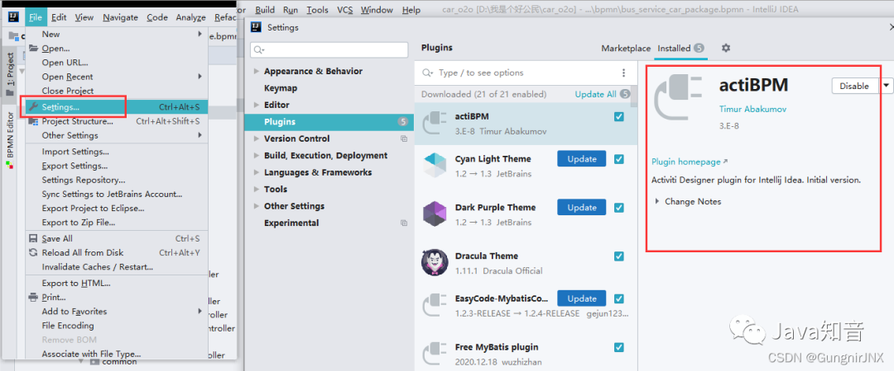

解决中文乱码

-   在IDEA中将`File–>Settings–>Editor–>File Encodings`修改为UTF-8
-   在IDEA的Help–>Edit Custom VM Options中末尾添加`-Dfile.encoding=UTF-8`
-   在IDEA的安装目录的bin目录下将`idea.exe.vmoptions`和`idea64.exe.vmoptions`两个文件末尾添加`-Dfile.encoding=UTF-8`
-   重启idea

## **三、开始使用**

### **1.首先新建一个bpmn文件**

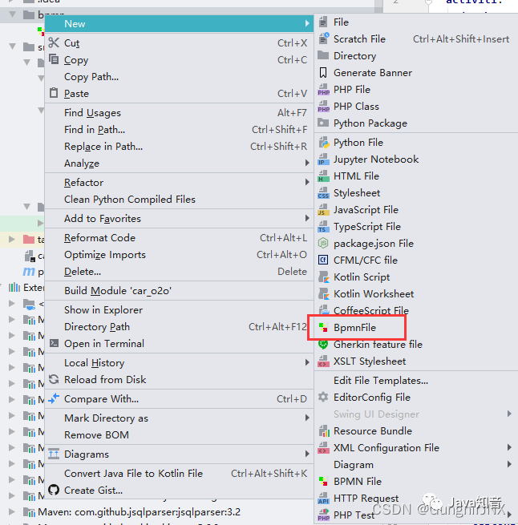

下面画一个基础的流程图举个例子，直接拖控件就好了

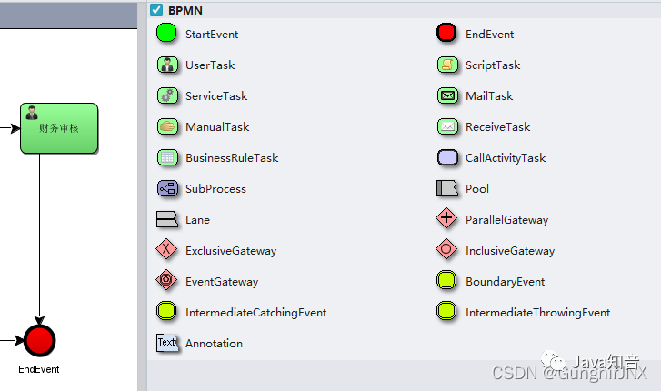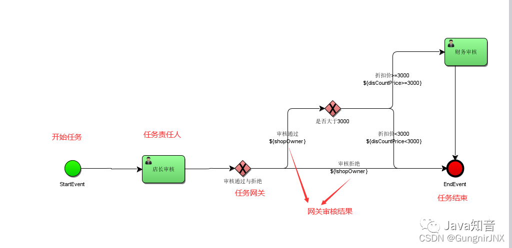

### **2.开始部署流程定义**

```java
import org.activiti.engine.ProcessEngine;
import org.activiti.engine.ProcessEngines;
import org.activiti.engine.RepositoryService;
import org.activiti.engine.repository.Deployment;
import org.junit.Test;


public class ActivitiTest {
    @Test
    public void testDeploy(){
        //创建ProcessEngine对象
        ProcessEngine processEngine = ProcessEngines.getDefaultProcessEngine();
        //获取RepositoryService对象
        RepositoryService repositoryService = processEngine.getRepositoryService();
        //进行部署
        Deployment deployment = repositoryService.createDeployment()
                .addClasspathResource("bpmn/leave.bpmn")
                .addClasspathResource("bpmn/leave.png")
                .name("请假流程")
                .deploy();
        //输出部署的一些信息
        System.out.println("流程部署ID:"+deployment.getId());
        System.out.println("流程部署名称:"+deployment.getName());
    }
}
```

### **3.启动流程示例**

```java
@Test
public void testStartProcess(){
 //创建ProcessEngine对象
 ProcessEngine processEngine = ProcessEngines.getDefaultProcessEngine();
 //获取RuntimeService对象
 RuntimeService runtimeService = processEngine.getRuntimeService();
 //根据流程定义的key启动流程实例,这个key是在定义bpmn的时候设置的
 ProcessInstance instance = runtimeService.
        startProcessInstanceByKey("leaveProcess");
 //获取流程实例的相关信息
 System.out.println("流程定义的id = " + instance.getProcessDefinitionId());
 System.out.println("流程实例的id = " + instance.getId());
}
```

### **4.任务查询**

流程启动后，各个任务的负责人就可以查询自己当前需要处理的任务，查询出来的任务都是该用户的待办任务。

```java
@Test
public void testSelectTodoTaskList(){
    //任务负责人
    String assignee = "李四";
    //创建ProcessEngine对象
    ProcessEngine processEngine = ProcessEngines.getDefaultProcessEngine();
    //获取TaskService
    TaskService taskService = processEngine.getTaskService();
    //获取任务集合
    List<Task> taskList = taskService.createTaskQuery()
            .processDefinitionKey("leaveProcess")
            .taskAssignee(assignee)
            .list();
    //遍历任务列表
    for(Task task:taskList){
        System.out.println("流程定义id = " + task.getProcessDefinitionId());
        System.out.println("流程实例id = " + task.getProcessInstanceId());
        System.out.println("任务id = " + task.getId());
        System.out.println("任务名称 = " + task.getName());
    }
}
```

### **5.任务处理**

```java
@Test
public void testCompleteTask(){
    //任务负责人
    String assignee = "李四";
    //创建ProcessEngine对象
    ProcessEngine processEngine = ProcessEngines.getDefaultProcessEngine();
    //获取TaskService
    TaskService taskService = processEngine.getTaskService();
    //获取任务集合
    List<Task> taskList = taskService.createTaskQuery()
            .processDefinitionKey("leaveProcess")
            .taskAssignee(assignee)
            .list();
    //遍历任务列表
    for(Task task:taskList){
        taskService.complete(task.getId());
    }
}
```

### **6.添加审批意见**

```java
@Test
public void testAddComment(){
    //任务负责人
    String assignee = "王五";
    //创建ProcessEngine对象
    ProcessEngine processEngine = ProcessEngines.getDefaultProcessEngine();
    //获取TaskService
    TaskService taskService = processEngine.getTaskService();
    //获取任务集合
    List<Task> taskList = taskService.createTaskQuery()
            .processDefinitionKey("leaveProcess")
            .taskAssignee(assignee)
            .list();
    //遍历任务列表
    for(Task task:taskList){
        //在任务执行之前任务添加批注信息
        taskService.addComment(task.getId(),task.getProcessInstanceId(),task.getName()+"审批通过");
        taskService.complete(task.getId());
    }
}
```

### **7.查看历史审批**

```java
@Test
public void testSelectHistoryTask(){
    //流程实例ID
    String processInstanceId = "2501";
    //任务审核人
    String taskAssignee = "王五";
    //创建ProcessEngine对象
    ProcessEngine processEngine = ProcessEngines.getDefaultProcessEngine();
    //获取historyService
    HistoryService historyService = processEngine.getHistoryService();
    //获取taskService
    TaskService taskService = processEngine.getTaskService();
    //获取历史审核信息
    List<HistoricActivityInstance> list = historyService
            .createHistoricActivityInstanceQuery()
            .activityType("userTask")//只获取用户任务
            .processInstanceId(processInstanceId)
            .taskAssignee(taskAssignee)
            .finished()
            .list();
    for(HistoricActivityInstance instance:list){
        System.out.println("任务名称:"+instance.getActivityName());
        System.out.println("任务开始时间:"+instance.getStartTime());
        System.out.println("任务结束时间:"+instance.getEndTime());
        System.out.println("任务耗时:"+instance.getDurationInMillis());
        //获取审核批注信息
        List<Comment> taskComments = taskService.getTaskComments(instance.getTaskId());
        if(taskComments.size()>0){
            System.out.println("审批批注:"+taskComments.get(0).getFullMessage());
        }
    }
}
```

## **四、进阶操作**

### **1.流程定义查询**

查询流程相关信息，包含流程定义，流程部署，流程定义版本

```java
@Test
public void testDefinitionQuery(){
    //创建ProcessEngine对象
    ProcessEngine processEngine = ProcessEngines.getDefaultProcessEngine();
    //获取仓库服务
    RepositoryService repositoryService = processEngine.getRepositoryService();
    //获取流程定义集合
    List<ProcessDefinition> processDefinitionList = repositoryService
            .createProcessDefinitionQuery()
            .processDefinitionKey("leaveProcess")
            .list();
    //遍历集合
    for (ProcessDefinition definition:processDefinitionList){
        System.out.println("流程定义ID:"+definition.getId());
        System.out.println("流程定义名称:"+definition.getName());
        System.out.println("流程定义key:"+definition.getKey());
        System.out.println("流程定义版本:"+definition.getVersion());
        System.out.println("流程部署ID:"+definition.getDeploymentId());
        System.out.println("====================");
    }
}
```

### **2.流程资源下载**

现在我们的流程资源文件已经上传到数据库了，如果其他用户想要查看这些资源文件，可以从数据库中把资源文件下载到本地。

```java
@Test
public void testDownloadResource() throws Exception {
    //创建ProcessEngine对象
    ProcessEngine processEngine = ProcessEngines.getDefaultProcessEngine();
    //获取仓库服务
    RepositoryService repositoryService = processEngine.getRepositoryService();
    //获取流程定义集合
    List<ProcessDefinition> list = repositoryService
            .createProcessDefinitionQuery()
            .processDefinitionKey("leaveProcess")
            .orderByProcessDefinitionVersion()//按照版本排序
            .desc()//降序
            .list();
    //获取最新那个
    ProcessDefinition definition =list.get(0);
    //获取部署ID
    String deploymentId = definition.getDeploymentId();
    //获取bpmn的输入流
    InputStream bpmnInput = repositoryService.getResourceAsStream(
                                        deploymentId,
                                        definition.getResourceName());
    //获取png的输入流
    InputStream pngInput = repositoryService.getResourceAsStream(
                                        deploymentId,
                                        definition.getDiagramResourceName());
    //设置bpmn输入
    FileOutputStream bpmnOutPut = new FileOutputStream("D:/leave.bpmn");
    //设置png输入
    FileOutputStream pngOutPut = new FileOutputStream("D:/leave.png");
    IOUtils.copy(bpmnInput,bpmnOutPut);
    IOUtils.copy(pngInput,pngOutPut);
}
```

### **3.流程定义删除**

根据部署Id删除对应的流程定义

```java
@Test
public void testDeleteDeploy(){
    //流程部署Id
    String deploymentId = "10001";
    //创建ProcessEngine对象
    ProcessEngine processEngine = ProcessEngines.getDefaultProcessEngine();
    //获取仓库服务
    RepositoryService repositoryService = processEngine.getRepositoryService();
    //删除流程定义，如果该流程定义已有流程实例启动则删除时出错
    repositoryService.deleteDeployment(deploymentId);
    //设置true 级联删除流程定义，即使该流程有流程实例启动也可以删除，设置为false非级别删除方式，如果流程
    //repositoryService.deleteDeployment(deploymentId,true);
}
```

### **4.流程定义和示例讲解**

简单来说流程定义和流程实例就是类和对象的关系

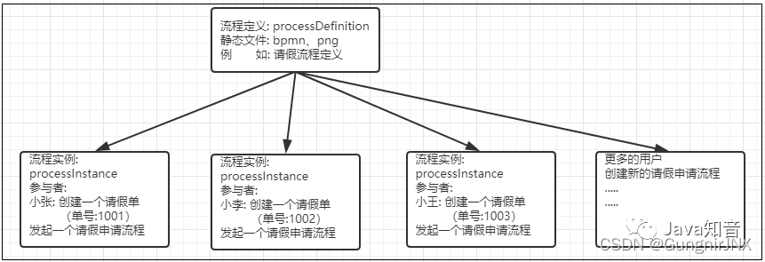

### **5\. BusinessKey（业务标识）**

-   小张要在5.1~5.10这段时间请假,请假理由为:回家相亲.
-   小陈要在5.5~5.15这段时间请假,请假理由为:家里拆迁,回家办手续.

**请问会创建几个流程实例?**

流程发起之后，目前设定的部门审批人都是李四，李四在审批之前需要看到申请人申请的时间和申请的理由，才能决定是否同意.

那么申请人的请假信息【请假时间、请假理由】是如何绑定到流程中的呢?

此时就需要使用到BusinessKey

-   启动流程实例时，指定的businessKey，就会在act\_run\_execution表中存储businessKey。
-   BusinessKey：业务标识，通常为业务表的主键，业务标识和流程实例一一对应。业务标识来源于业务系统。存储业务标识就是根据业务标识来关联查询业务系统的数据。比如：请假流程启动一个流程实例，就可以将请假单的id作为业务标识存储到Activiti中，将来查询Activiti的流程实例信息就可以获取请假单的id从而关联查询业务系统数据库得到请假单信息。

```java
@Test
public void testStartProcess(){
    String businessKey = "8001";
    //创建ProcessEngine对象
    ProcessEngine processEngine = ProcessEngines.getDefaultProcessEngine();
    //获取RuntimeService对象
    RuntimeService runtimeService = processEngine.getRuntimeService();
    //根据流程定义的key启动流程实例,这个key是在定义bpmn的时候设置的
    //在启动流程的时候将业务key加入进去
    ProcessInstance instance = runtimeService
            .startProcessInstanceByKey("leaveProcess",businessKey);
    //获取流程实例的相关信息
    System.out.println("流程定义的id = " + instance.getProcessDefinitionId());
    System.out.println("流程实例的id = " + instance.getId());
}
```

在用户执行任务的时候如何获取BusinessKey并关联对应的业务信息呢?

```java
@Test
public void testGetBusinessKey(){
    //任务负责人
    String assignee = "李四";
    //创建ProcessEngine对象
    ProcessEngine processEngine = ProcessEngines.getDefaultProcessEngine();
    //获取TaskService
    TaskService taskService = processEngine.getTaskService();
    //获取RuntimeService
    RuntimeService runtimeService = processEngine.getRuntimeService();
    //获取任务集合
    List<Task> taskList = taskService.createTaskQuery()
            .processDefinitionKey("leaveProcess")
            .taskAssignee(assignee)
            .list();
    //遍历任务列表
    for(Task task:taskList){
        System.out.println("流程定义id = " + task.getProcessDefinitionId());
        System.out.println("流程实例id = " + task.getProcessInstanceId());
        System.out.println("任务id = " + task.getId());
        System.out.println("任务名称 = " + task.getName());
        //根据任务上的流程实例Id查询出对应的流程实例对象，从流程实例对象中获取BusinessKey
        ProcessInstance instance = runtimeService
                .createProcessInstanceQuery()
                .processInstanceId(task.getProcessInstanceId())
                .singleResult();
        System.out.println("业务key:"+instance.getBusinessKey());
        System.out.println("===================");
    }
}
```

### **6.流程定义/实例的挂起/激活**

**全部流程实例挂起场景:**

1.例如公司制度改变过程中的流程, 总经理更换过程中的流程，有100个人的流程, 70个人已经完成,30个人流程正好在总经理更换中,就需要挂起.

2.比如我们的业务流程为:

> 【开始节点】–>【A节点】–>【B节点】–>【C节点】–>【结束节点】

【C节点】的业务逻辑需要和外部接口交互，刚好外部接口出问题了,如果剩下的流程都走到【C节点】，执行【C节点】的业务逻辑，那都会报错，我们就可以把流程挂起，等待外部接口可用之后再重新激活流程.

3.业务流程发生改变,已经发起的流程实例继续按照旧的流程走,如果新发起的流程就按照新的业务流程走.这时候我们就需要挂起流程定义,但是不挂起流程实例.

-   操作流程定义为挂起状态，该操作定义下面的所有的流程实例将全部暂停。
-   流程定义为挂起状态，该流程定义下将不允许启动新的流程实例，同时该流程定义下的所有流程实例将全部挂起暂停执行

```java
@Test
public void testSuspendAllProcessInstance(){
    //创建ProcessEngine对象
    ProcessEngine processEngine = ProcessEngines.getDefaultProcessEngine();
    //获取RepositoryService
    RepositoryService repositoryService = processEngine.getRepositoryService();
    //获取流程定义对象
    ProcessDefinition processDefinition = repositoryService
            .createProcessDefinitionQuery()
            .processDefinitionKey("leaveProcess")
            .singleResult();
    boolean suspended = processDefinition.isSuspended();
    //输出流程定义状态
    System.out.println("流程定义状态:"+(suspended ?"已挂起":"已激活"));
    String processDefinitionId = processDefinition.getId();
    if(suspended){
        //如果是挂起，可以执行激活操作 ,参数1 ：流程定义id ，参数2：是否激活流程实例，参数3：激活时间
        repositoryService.activateProcessDefinitionById(processDefinitionId,true,null);
        System.out.println("流程ID:"+processDefinitionId+",已激活");
    }else{
        //如果是激活，可以执行挂起操作 ,参数1 ：流程定义id ，参数2：是否暂停流程实例，参数3：激活时间
        repositoryService.suspendProcessDefinitionById(processDefinitionId,true,null);
        System.out.println("流程ID:"+processDefinitionId+",已挂起");
    }
}
```

查询待办任务的状态,如果是【已挂起】,前台则不允许点击【任务处理】按钮

```java
@Test
public void testSuspendStatus(){
    //任务负责人
    String assignee = "李四";
    //创建ProcessEngine对象
    ProcessEngine processEngine = ProcessEngines.getDefaultProcessEngine();
    //获取TaskService
    TaskService taskService = processEngine.getTaskService();
    //获取任务集合
    List<Task> taskList = taskService.createTaskQuery()
            .processDefinitionKey("leaveProcess")
            .taskAssignee(assignee)
            .list();
    //遍历任务列表
    for(Task task:taskList){
        System.out.println("流程定义id = " + task.getProcessDefinitionId());
        System.out.println("流程实例id = " + task.getProcessInstanceId());
        System.out.println("任务id = " + task.getId());
        System.out.println("任务名称 = " + task.getName());
        System.out.println("任务状态:"+(task.isSuspended()?"已挂起":"已激活"));
        System.out.println("===================");
    }
}
```

**单个流程实例挂起场景**

评分流程：可设置多级评分，评分流程会按照从上往下的顺序，依次评分；评分人必须在评分截至时间内完成评分，否则不允许继续评分，流程将会挂起，停止流转；

操作流程实例对象，针对单个流程执行挂起操作，某个流程实例挂起则此流程不再执行，完成该流程实例的当前任务将报异常。推荐：[Java面试题](https://link.zhihu.com/?target=https%3A//mp.weixin.qq.com/s%3F__biz%3DMzIyNDU2ODA4OQ%3D%3D%26mid%3D2247494231%26idx%3D1%26sn%3D287fd16b4657a32ad91e8108bbcbbe44%26scene%3D21%23wechat_redirect)

查询所有的流程实例

```java
@Test
public void testQueryProcessInstance(){
    //创建ProcessEngine对象
    ProcessEngine processEngine = ProcessEngines.getDefaultProcessEngine();
    //获取RepositoryService
    RuntimeService runtimeService = processEngine.getRuntimeService();
    List<ProcessInstance> processInstanceList = runtimeService
            .createProcessInstanceQuery()
            .processDefinitionKey("leaveProcess")
            .list();
    for(ProcessInstance processInstance:processInstanceList){
        System.out.println("流程实例Id:"+processInstance.getId()+",状态:"+(processInstance.isSuspended()?"已挂起":"已激活"));
    }
}
```

挂起某个流程实例

```java
@Test
public void testSuspendSingleProcessInstance(){
    //流程实例Id
    String processInstanceId = "2501";
    //创建ProcessEngine对象
    ProcessEngine processEngine = ProcessEngines.getDefaultProcessEngine();
    //获取RepositoryService
    RuntimeService runtimeService = processEngine.getRuntimeService();
    //根据流程实例Id获取流程实例对象
    ProcessInstance processInstance = runtimeService
            .createProcessInstanceQuery()
            .processInstanceId(processInstanceId)
            .singleResult();
    //状态
    boolean suspended = processInstance.isSuspended();
    System.out.println("流程实例ID:"+processInstanceId+",状态:"+ (suspended?"已挂起":"已激活"));
    if(suspended){
        runtimeService.activateProcessInstanceById(processInstanceId);
        System.out.println("流程实例ID:"+processInstanceId+",状态修改为已激活");
    }else{
        runtimeService.suspendProcessInstanceById(processInstanceId);
        System.out.println("流程实例ID:"+processInstanceId+",状态修改为已挂起");
    }
}
```

### **7.任务分配负责人**

**固定分配**

在进行业务流程建模的时候指定固定的任务负责人。

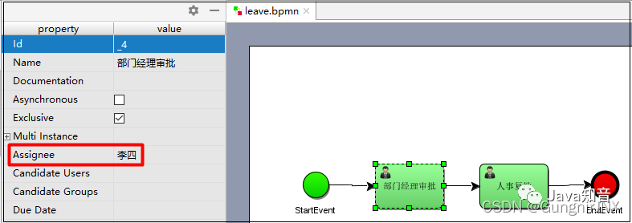

**表达式分配**

Activiti 使用 UEL 表达式， UEL 是 java EE6 规范的一部分， UEL（Unified Expression Language）即 统一表达式语言。

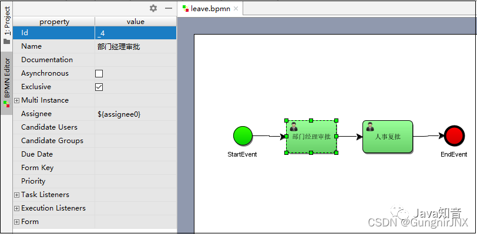

IDEA中的actiBPM插件在修改Assignee存在bug,在界面上修改了,但是实际文件并没有修改.所以我们需要借助编辑工具在xml文件中修改一下Assignee

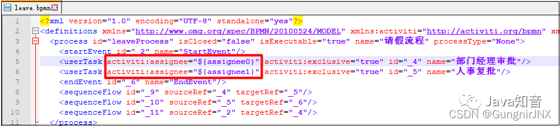

-   修改流程定义之后重新进行部署
-   编写代码配置负责人

```java
@Test
public void testStartProcess(){
    //创建ProcessEngine对象
    ProcessEngine processEngine = ProcessEngines.getDefaultProcessEngine();
    //获取RuntimeService对象
    RuntimeService runtimeService = processEngine.getRuntimeService();
    Map<String,Object> variables  = new HashMap<String, Object>();
    variables.put("assignee0","zhangsan");
    variables.put("assignee1","lisi");
    //根据流程定义的key启动流程实例,这个key是在定义bpmn的时候设置的
    ProcessInstance instance = runtimeService
            .startProcessInstanceByKey("leaveProcess",variables);
    //获取流程实例的相关信息
    System.out.println("流程定义的id = " + instance.getProcessDefinitionId());
    System.out.println("流程实例的id = " + instance.getId());
}
```

**监听器分配**

任务监听器是发生对应的任务相关事件时执行自定义的Java逻辑或表达式。

任务相关事件包括：

-   Event：

-   Create：任务创建后触发。
-   Assignment：任务分配后触发。
-   Delete：任务完成后触发。
-   All：所有事件发生都触发。

1.自定义一个任务监听器类，然后此类必须实现`org.activiti.engine.delegate.TaskListener`接口

```java
import org.activiti.engine.delegate.DelegateTask;
import org.activiti.engine.delegate.TaskListener;


public class AssigneeTaskListener implements TaskListener {
    public void notify(DelegateTask delegateTask) {
        if(delegateTask.getName().equals("部门经理审批")){
            delegateTask.setAssignee("赵六");
        }else if(delegateTask.getName().equals("部门经理审批")){
            delegateTask.setAssignee("孙七");
        }
    }
}
```

2.在bpmn文件中配置监听器

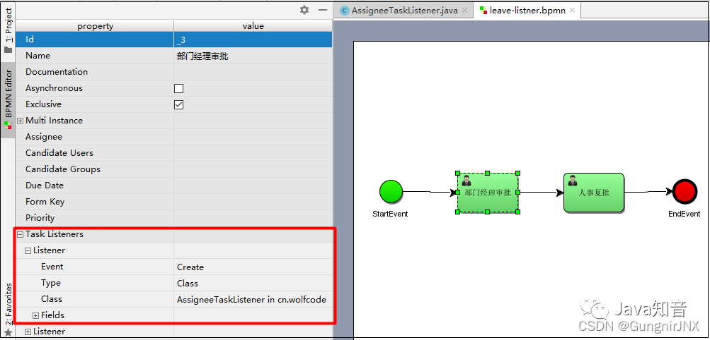

在实际开发中，一般也不使用监听器分配方式，太麻烦了。

### **8.流程变量**

**什么是流程变量？**

流程变量在Activiti中是一个非常重要的角色，流程运转有时需要靠流程变量，业务系统和Activiti结合时少不了流程变量，流程变量就是Activiti在管理工作流时根据管理需要而设置的变量。

比如在请假流程流转时如果请假天数>3天则有总经理审批，否则由人事直接审批，请假天数就可以设置流程变量，在流程流转时使用。

> 注意：虽然流程变量中可以存储业务数据，可以通过Activiti的API查询流程变量从而实现查询业务数据，但是不建议这么使用，因为业务数据查询由业务系统负责，Activiti设置流程变量是为了流程执行需要而创建的。

**流程变量的使用方法**

-   **在属性上使用UEL表达式**

可以在 assignee 处设置 UEL 表达式，表达式的值为任务的负责人，比如： `${assignee}`， assignee 就是一个流程变量名称。

Activiti获取UEL表达式的值，即流程变量assignee的值 ，将assignee的值作为任务的负责人进行任务分配

-   **在连线上使用UEL表达式**

可以在连线上设置UEL表达式，决定流程走向。

比如：`${price<10000}` 。price就是一个流程变量名称，uel表达式结果类型为布尔类型。

如果UEL表达式是true，要决定 流程执行走向。

```java
import org.activiti.engine.*;
import org.activiti.engine.repository.Deployment;
import org.activiti.engine.runtime.ProcessInstance;
import org.activiti.engine.task.Task;
import org.junit.Test;

import java.util.HashMap;
import java.util.List;
import java.util.Map;
public class VariablesTest {

    /**
     * 部署
     */
    @Test
    public void testDeploy(){
        //创建ProcessEngine对象
        ProcessEngine processEngine = ProcessEngines.getDefaultProcessEngine();
        //获取RepositoryService对象
        RepositoryService repositoryService = processEngine.getRepositoryService();
        //进行部署
        Deployment deployment = repositoryService.createDeployment()
                .addClasspathResource("bpmn/leave-variables.bpmn")
                .name("请假流程")
                .deploy();
        //输出部署的一些信息
        System.out.println("流程部署ID:"+deployment.getId());
        System.out.println("流程部署名称:"+deployment.getName());
    }
    @Test
    public void testStartProcess(){
        //创建ProcessEngine对象
        ProcessEngine processEngine = ProcessEngines.getDefaultProcessEngine();
        //获取RuntimeService对象
        RuntimeService runtimeService = processEngine.getRuntimeService();
        Map<String,Object> variables = new HashMap<String,Object>();
        variables.put("day",2);
        //根据流程定义的key启动流程实例,这个key是在定义bpmn的时候设置的
        ProcessInstance instance = runtimeService.startProcessInstanceByKey("leaveVariablesProcess",variables);
        //获取流程实例的相关信息
        System.out.println("流程定义的id = " + instance.getProcessDefinitionId());
        System.out.println("流程实例的id = " + instance.getId());
    }
    @Test
    public void testSelectTodoTaskList(){
        //任务负责人
        String assignee = "李四";
        //创建ProcessEngine对象
        ProcessEngine processEngine = ProcessEngines.getDefaultProcessEngine();
        //获取TaskService
        TaskService taskService = processEngine.getTaskService();
        //获取任务集合
        List<Task> taskList = taskService.createTaskQuery()
                .processDefinitionKey("leaveVariablesProcess")
                .taskAssignee(assignee)
                .list();
        //遍历任务列表
        for(Task task:taskList){
            System.out.println("流程定义id = " + task.getProcessDefinitionId());
            System.out.println("流程实例id = " + task.getProcessInstanceId());
            System.out.println("任务id = " + task.getId());
            System.out.println("任务名称 = " + task.getName());
        }
    }
    @Test
    public void testCompleteTask(){
        //任务负责人
        String assignee = "李四";
        //创建ProcessEngine对象
        ProcessEngine processEngine = ProcessEngines.getDefaultProcessEngine();
        //获取TaskService
        TaskService taskService = processEngine.getTaskService();
        //获取任务集合
        List<Task> taskList = taskService.createTaskQuery()
                .processDefinitionKey("leaveVariablesProcess")
                .taskAssignee(assignee)
                .list();
        //遍历任务列表
        for(Task task:taskList){
            taskService.complete(task.getId());
        }
    }
}
```

### **9.任务候选人**

在流程定义中在任务结点的 assignee 固定设置任务负责人，在流程定义时将参与者固定设置在.bpmn 文件中，如果临时任务负责人变更则需要修改流程定义，系统可扩展性差。推荐：[Java面试题](https://link.zhihu.com/?target=https%3A//mp.weixin.qq.com/s%3F__biz%3DMzIyNDU2ODA4OQ%3D%3D%26mid%3D2247494231%26idx%3D1%26sn%3D287fd16b4657a32ad91e8108bbcbbe44%26scene%3D21%23wechat_redirect)

针对这种情况可以给任务设置多个候选人，可以从候选人中选择参与者来完成任务。

**设置任务候选人**

在流程图中任务节点的配置中设置 `candidate-users`(候选人)，多个候选人之间用逗号分开。

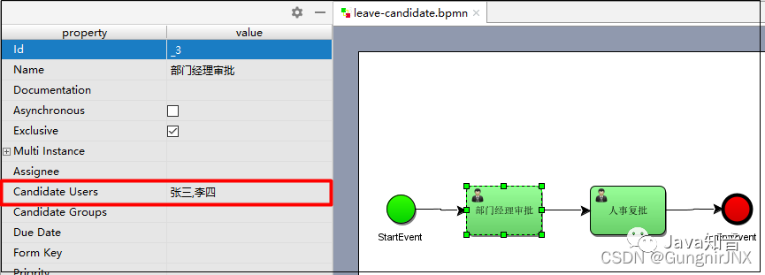

查看bpmn文件


我们可以看到部门经理的审核人已经设置为 lisi,wangwu 这样的一组候选人，可以使用`activiti:candiateUsers=”用户 1,用户 2,用户 3”`的这种方式来实现设置一组候选人

**部署&启动流程**

```java
package cn.wolfcode.demo;

import org.activiti.engine.*;
import org.activiti.engine.repository.Deployment;
import org.activiti.engine.runtime.ProcessInstance;
import org.activiti.engine.task.Task;
import org.junit.Test;

import java.util.HashMap;
import java.util.List;
import java.util.Map;

/**
 * Created by wolfcode
 */
public class CandidateTest {
    /**
     * 部署
     */
    @Test
    public void testDeploy(){
        //创建ProcessEngine对象
        ProcessEngine processEngine = ProcessEngines.getDefaultProcessEngine();
        //获取RepositoryService对象
        RepositoryService repositoryService = processEngine.getRepositoryService();
        //进行部署
        Deployment deployment = repositoryService.createDeployment()
                .addClasspathResource("bpmn/leave-candidate.bpmn")
                .name("请假流程-候选人")
                .deploy();
        //输出部署的一些信息
        System.out.println("流程部署ID:"+deployment.getId());
        System.out.println("流程部署名称:"+deployment.getName());
    }
    //启动流程
    @Test
    public void testStartProcess(){
        //创建ProcessEngine对象
        ProcessEngine processEngine = ProcessEngines.getDefaultProcessEngine();
        //获取RuntimeService对象
        RuntimeService runtimeService = processEngine.getRuntimeService();
        //根据流程定义的key启动流程实例,这个key是在定义bpmn的时候设置的
        ProcessInstance instance = runtimeService.startProcessInstanceByKey("leaveCandidateProcess");
        //获取流程实例的相关信息
        System.out.println("流程定义的id = " + instance.getProcessDefinitionId());
        System.out.println("流程实例的id = " + instance.getId());
    }
}
```

**查询候选人任务**

```java
//查询候选任务
@Test
public void testSelectCandidateTaskList(){
    //任务负责人
    String candidateUser = "李四";
    //创建ProcessEngine对象
    ProcessEngine processEngine = ProcessEngines.getDefaultProcessEngine();
    //获取TaskService
    TaskService taskService = processEngine.getTaskService();
    //获取任务集合
    List<Task> taskList = taskService.createTaskQuery()
            .processDefinitionKey("leaveCandidateProcess")
            .taskCandidateUser(candidateUser)
            .list();
    //遍历任务列表
    for(Task task:taskList){
        System.out.println("流程定义id = " + task.getProcessDefinitionId());
        System.out.println("流程实例id = " + task.getProcessInstanceId());
        System.out.println("任务id = " + task.getId());
        System.out.println("任务名称 = " + task.getName());
    }
}
```

**领取候选人任务**

```java
@Test
public void testClaimTask(){
    //任务ID
    String taskId = "2505";
    String assignee = "张三";
    //创建ProcessEngine对象
    ProcessEngine processEngine = ProcessEngines.getDefaultProcessEngine();
    //获取TaskService
    TaskService taskService = processEngine.getTaskService();
    //领取任务
    taskService.claim(taskId,assignee);
}
```

**完成任务**

如果候选任务没有进行领取就直接完成的话，那么在历史记录中就不会记录是哪个用户执行了这个任务.

所以对于这种候选人的任务，我们需要先领取再完成.

```java
//执行任务
@Test
public void testCompleteTask(){
    //任务ID
    String taskId = "2505";
    //创建ProcessEngine对象
    ProcessEngine processEngine = ProcessEngines.getDefaultProcessEngine();
    //获取TaskService
    TaskService taskService = processEngine.getTaskService();
    taskService.complete(taskId);
}
```

### **10.网关**

**排他网关**

排他网关(ExclusiveGateway)（异或网关或基于数据的排他网关），用来在流程中实现决策。当流程执行到这个网关的时候，所有分支都会判断条件是否为true，如果为true则执行该分支。

> 注意：  
> 排他网关只会选择一个为true的分支执行（即使有两个分支条件都为true，排他网关也只会选择一条分支去执行,选择序号小的路径执行）。

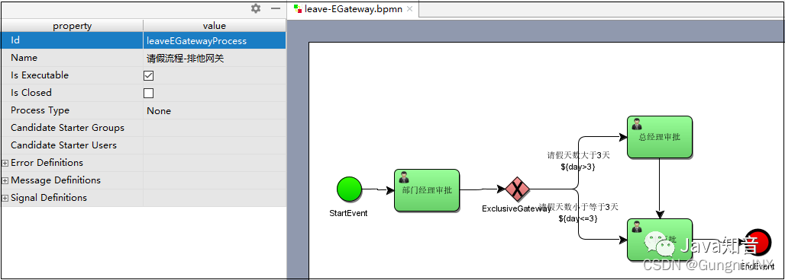

本次画BPMN文件的时候将部门经理的assignee设置为李四，总经理审批的assignee设置为王五，总经理审批的assignee设置为王五，人事复批存档设置为赵六。

```java
import org.activiti.engine.*;
import org.activiti.engine.repository.Deployment;
import org.activiti.engine.runtime.ProcessInstance;
import org.activiti.engine.task.Task;
import org.junit.After;
import org.junit.Test;

import java.util.HashMap;
import java.util.List;
import java.util.Map;


public class EGatewayTest {

    /**
     * 部署
     */
    @Test
    public void testDeploy(){
        //创建ProcessEngine对象
        ProcessEngine processEngine = ProcessEngines.getDefaultProcessEngine();
        //获取RepositoryService对象
        RepositoryService repositoryService = processEngine.getRepositoryService();
        //进行部署
        Deployment deployment = repositoryService.createDeployment()
                .addClasspathResource("bpmn/leave-EGateway.bpmn")
                .name("请假流程-排他网关")
                .deploy();
        //输出部署的一些信息
        System.out.println("流程部署ID:"+deployment.getId());
        System.out.println("流程部署名称:"+deployment.getName());
    }
    @Test
    public void testStartProcess(){
        //创建ProcessEngine对象
        ProcessEngine processEngine = ProcessEngines.getDefaultProcessEngine();
        //获取RuntimeService对象
        RuntimeService runtimeService = processEngine.getRuntimeService();
        Map<String,Object> variables = new HashMap<String,Object>();
        variables.put("day",0);
        //根据流程定义的key启动流程实例,这个key是在定义bpmn的时候设置的
        ProcessInstance instance = runtimeService.startProcessInstanceByKey("leaveEGatewayProcess",variables);
        //获取流程实例的相关信息
        System.out.println("流程定义的id = " + instance.getProcessDefinitionId());
        System.out.println("流程实例的id = " + instance.getId());
    }

    @Test
    public void testCompleteTask(){
        //任务负责人
        String assignee = "张三";
        //创建ProcessEngine对象
        ProcessEngine processEngine = ProcessEngines.getDefaultProcessEngine();
        //获取TaskService
        TaskService taskService = processEngine.getTaskService();
        //获取任务集合
        List<Task> taskList = taskService.createTaskQuery()
                .processDefinitionKey("leaveEGatewayProcess")
                .taskAssignee(assignee)
                .list();
        //遍历任务列表
        for(Task task:taskList){
            taskService.complete(task.getId());
        }
    }
}
```

**并行网关**

并行网关(InclusiveGateway)允许将流程分成多条分支，也可以把多条分支汇聚到一起，并行网关的功能是基于进入和外出的顺序流的。

注意：

> 并行网关不会解析条件。即使顺序流中定义了条件，也会被忽略

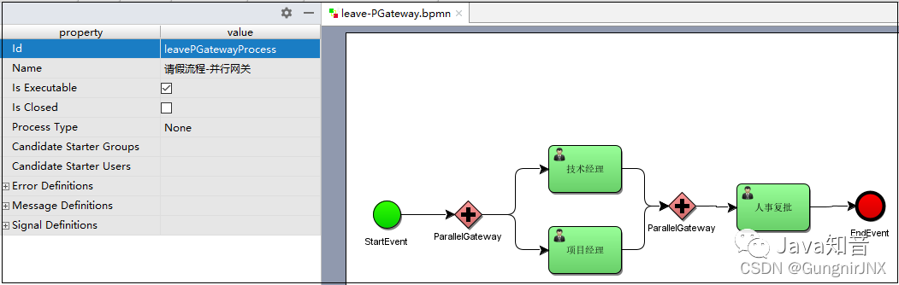

本次画BPMN文件的时候将技术经理的assignee设置为李四，项目经理审批的assignee设置为王五，人事复批的assignee设置为王五

```java
import org.activiti.engine.*;
import org.activiti.engine.repository.Deployment;
import org.activiti.engine.runtime.ProcessInstance;
import org.activiti.engine.task.Task;
import org.junit.Test;

import java.util.HashMap;
import java.util.List;
import java.util.Map;


public class PGatewayTest {
    /**
     * 部署
     */
    @Test
    public void testDeploy(){
        //创建ProcessEngine对象
        ProcessEngine processEngine = ProcessEngines.getDefaultProcessEngine();
        //获取RepositoryService对象
        RepositoryService repositoryService = processEngine.getRepositoryService();
        //进行部署
        Deployment deployment = repositoryService.createDeployment()
                .addClasspathResource("bpmn/leave-PGateway.bpmn")
                .name("请假流程-并行网关")
                .deploy();
        //输出部署的一些信息
        System.out.println("流程部署ID:"+deployment.getId());
        System.out.println("流程部署名称:"+deployment.getName());
    }
    @Test
    public void testStartProcess(){
        //创建ProcessEngine对象
        ProcessEngine processEngine = ProcessEngines.getDefaultProcessEngine();
        //获取RuntimeService对象
        RuntimeService runtimeService = processEngine.getRuntimeService();
        Map<String,Object> variables = new HashMap<String,Object>();
        //根据流程定义的key启动流程实例,这个key是在定义bpmn的时候设置的
        ProcessInstance instance = runtimeService.startProcessInstanceByKey("leavePGatewayProcess");
        //获取流程实例的相关信息
        System.out.println("流程定义的id = " + instance.getProcessDefinitionId());
        System.out.println("流程实例的id = " + instance.getId());
    }
 //完成任务
    @Test
    public void testCompleteTask(){
        //任务负责人
        String assignee = "张三";
        //创建ProcessEngine对象
        ProcessEngine processEngine = ProcessEngines.getDefaultProcessEngine();
        //获取TaskService
        TaskService taskService = processEngine.getTaskService();
        //获取任务集合
        List<Task> taskList = taskService.createTaskQuery()
                .processDefinitionKey("leavePGatewayProcess")
                .taskAssignee(assignee)
                .list();
        //遍历任务列表
        for(Task task:taskList){
            taskService.complete(task.getId());
        }
    }
}
```

**包含网关**

包含网关可以看做是排他网关和并行网关的结合体。推荐：[Java面试题](https://link.zhihu.com/?target=https%3A//mp.weixin.qq.com/s%3F__biz%3DMzIyNDU2ODA4OQ%3D%3D%26mid%3D2247494231%26idx%3D1%26sn%3D287fd16b4657a32ad91e8108bbcbbe44%26scene%3D21%23wechat_redirect)

需求:出差申请大于3天需要由项目经理审批，小于3等于天由技术经理审批，出差申请必须经过人事助理审批。

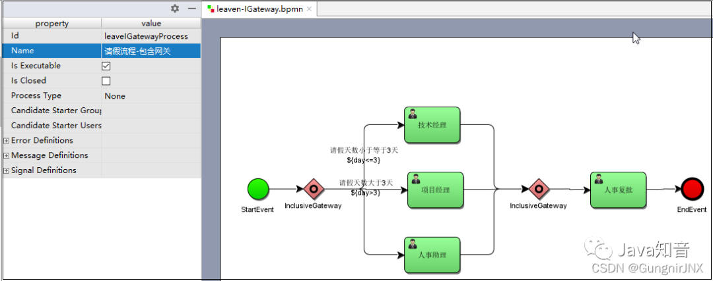

本次画BPMN文件的时候将技术经理的assignee设置为张三，项目经理的assignee设置为李四，人事助理的assignee设置为王五，人事复批存档设置为赵六。

```java
import org.activiti.engine.*;
import org.activiti.engine.repository.Deployment;
import org.activiti.engine.runtime.ProcessInstance;
import org.activiti.engine.task.Task;
import org.junit.Test;

import java.util.HashMap;
import java.util.List;
import java.util.Map;


public class IGatewayTest {

    /**
     * 部署
     */
    @Test
    public void testDeploy(){
        //创建ProcessEngine对象
        ProcessEngine processEngine = ProcessEngines.getDefaultProcessEngine();
        //获取RepositoryService对象
        RepositoryService repositoryService = processEngine.getRepositoryService();
        //进行部署
        Deployment deployment = repositoryService.createDeployment()
                .addClasspathResource("bpmn/leave-IGateway.bpmn")
                .name("请假流程-包含网关")
                .deploy();
        //输出部署的一些信息
        System.out.println("流程部署ID:"+deployment.getId());
        System.out.println("流程部署名称:"+deployment.getName());
    }
    @Test
    public void testStartProcess(){
        //创建ProcessEngine对象
        ProcessEngine processEngine = ProcessEngines.getDefaultProcessEngine();
        //获取RuntimeService对象
        RuntimeService runtimeService = processEngine.getRuntimeService();
        Map<String,Object> variables = new HashMap<String,Object>();
        variables.put("day",5);
        //根据流程定义的key启动流程实例,这个key是在定义bpmn的时候设置的
        ProcessInstance instance = runtimeService.startProcessInstanceByKey("leaveIGatewayProcess",variables);
        //获取流程实例的相关信息
        System.out.println("流程定义的id = " + instance.getProcessDefinitionId());
        System.out.println("流程实例的id = " + instance.getId());
    }
 //完成任务
    @Test
    public void testCompleteTask(){
        //任务负责人
        String assignee = "王五";
        //创建ProcessEngine对象
        ProcessEngine processEngine = ProcessEngines.getDefaultProcessEngine();
        //获取TaskService
        TaskService taskService = processEngine.getTaskService();
        //获取任务集合
        List<Task> taskList = taskService.createTaskQuery()
                .processDefinitionKey("leaveIGatewayProcess")
                .taskAssignee(assignee)
                .list();
        //遍历任务列表
        for(Task task:taskList){
            taskService.complete(task.getId());
        }
    }
}
```

## **五、方法总结**

Service总览

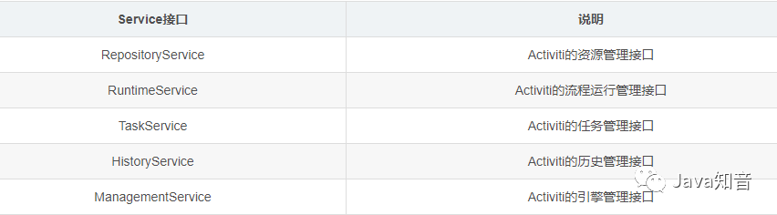

-   **RepositoryService**，是Activiti的资源管理接口，提供了管理和控制流程发布包和流程定义的操作。使用工作流建模工具设计的业务流程图需要使用此Service将流程定义文件的内容部署到计算机中。
-   **RuntimeService**，是Activiti的流程运行管理接口，可以从这个接口中获取很多关于流程执行相关的信息。
-   **TaskService**，是Activiti的任务管理接口，可以从这个接口中获取任务的信息。
-   **HistoryService**，是Activiti的历史管理类，可以查询历史信息，执行流程时，引擎会包含很多数据（根据配置），比如流程实例启动时间，任务的参与者，完成任务的时间，每个流程实例的执行路径，等等。
-   **ManagementService**，是Activiti的引擎管理接口，提供了对Activiti流程引擎的管理和维护功能，这些功能不在工作流驱动的应用程序中使用，主要用于Activiti系统的日常维护。

1.进行部署

```text
repositoryService.createDeployment()//创建部署对象
.addClasspathResource(“bpmn/leaveProcessIGateway.bpmn”)//需要部署什么资源文件
.deploy();//进行部署
```

2.启动流程

```text
runtimeService.startProcessInstanceByKey(“leaveProcessIGateway”,params);
```

3.查询待办任务

```text
taskService.createTaskQuery().list();
```

4.执行任务

```text
taskService.complete(taskId);
```

5.认领任务

```text
taskService.claim(taskId,userId);
```

6.添加批注

```text
taskService.addComment(taskId,processInstanceId,“允许休假”);
```

7.挂起流程定义

```text
repositoryService.suspendProcessDefinitionByKey(“leaveProcess”,true,null);
```

8.激活流程定义

```text
repositoryService.activateProcessDefinitionByKey(“leaveProcess”,true,null);
```

9.挂起流程实例

```text
runtimeService.suspendProcessInstanceById(instanceId);
```

10.激活流程实例

```text
runtimeService.activateProcessInstanceById(instanceId);
```

11.获取资源的文件流

```text
repositoryService.getResourceAsStream();
```

12.删除流程定义

```text
repositoryService.deleteDeployment(deploymentId,true);
```

13.查询流程定义

```text
repositoryService.createProcessDefinitionQuery().list();
```

14.查询流程实例

```text
runtimeService.createProcessInstanceQuery().list()
```

15.查询历史的实例

```text
historyService.createHistoricTaskInstanceQuery().list()
```

> 来源：[如何在springboot项目中使用Activiti7工作流\_](https://link.zhihu.com/?target=http%3A//blog.csdn.net/qq_35032539/article/details/123167349)

## Java面试题

[Java面试题](https://link.zhihu.com/?target=https%3A//www.bmabk.com/index.php/post/special/mst)[优秀的简历模板300套](https://link.zhihu.com/?target=https%3A//www.bmabk.com/index.php/post/27773.html)