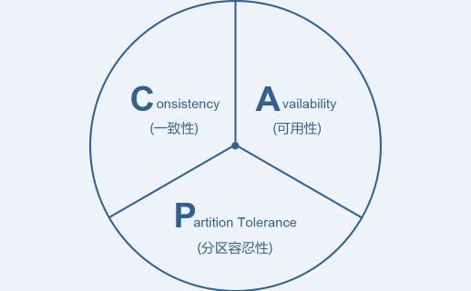
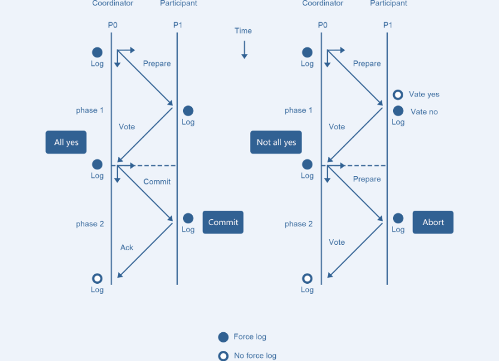
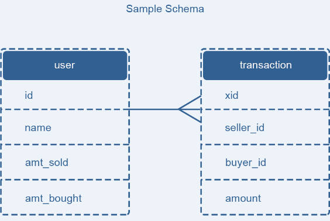
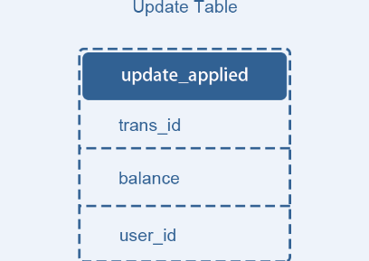
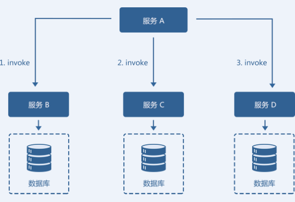

关于分布式事务，工程领域主要讨论的是强一致性和最终一致性的解决方案。典型方案包括：

1.  两阶段提交（2PC, Two-phase Commit）方案
2.  eBay 事件队列方案
3.  TCC 补偿模式
4.  缓存数据最终一致性

## **一、一致性理论**

分布式事务的目的是保障分库数据一致性，而跨库事务会遇到各种不可控制的问题，如个别节点永久性宕机，像单机事务一样的ACID是无法奢望的。另外，业界著名的CAP理论也告诉我们，对分布式系统，需要将数据一致性和系统可用性、分区容忍性放在天平上一起考虑。

两阶段提交协议（简称2PC）是实现分布式事务较为经典的方案，但2PC 的可扩展性很差，在分布式架构下应用代价较大，eBay 架构师Dan Pritchett 提出了BASE 理论，用于解决大规模分布式系统下的数据一致性问题。BASE 理论告诉我们：可以通过放弃系统在每个时刻的强一致性来换取系统的可扩展性。

### **1、CAP理论**

在分布式系统中，一致性（Consistency）、可用性（Availability）和分区容忍性（Partition Tolerance）3 个要素最多只能同时满足两个，不可兼得。其中，分区容忍性又是不可或缺的。

-   一致性：分布式环境下多个节点的数据是否强一致。
-   可用性：分布式服务能一直保证可用状态。当用户发出一个请求后，服务能在有限时间内返回结果。
-   分区容忍性：特指对网络分区的容忍性。

举例：Cassandra、Dynamo 等，默认优先选择AP，弱化C；HBase、MongoDB 等，默认优先选择CP，弱化A。

### **2、BASE 理论**

核心思想：

-   **基本可用（Basically**  
    **Available）**：指分布式系统在出现故障时，允许损失部分的可用性来保证核心可用。
-   **软状态（Soft**  
    **State）**：指允许分布式系统存在中间状态，该中间状态不会影响到系统的整体可用性。
-   **最终一致性（Eventual**  
    **Consistency）**：指分布式系统中的所有副本数据经过一定时间后，最终能够达到一致的状态。

## **二、一致性模型**

数据的一致性模型可以分成以下 3 类：

1.  **强一致性**：数据更新成功后，任意时刻所有副本中的数据都是一致的，一般采用同步的方式实现。
2.  **弱一致性**：数据更新成功后，系统不承诺立即可以读到最新写入的值，也不承诺具体多久之后可以读到。
3.  **最终一致性**：弱一致性的一种形式，数据更新成功后，系统不承诺立即可以返回最新写入的值，但是保证最终会返回上一次更新操作的值。

分布式系统数据一致性模型可以通过Quorum NRW算法分析。

不少朋友向我们反馈处理企业数据一致性时成本过高、事务执行状态不透明，如果您也遇到同样的情况，欢迎了解网易数帆【分布式事务GTXS】，限时领取定制化企业方案，帮您解决数据一致性处理难题：

[https://xg.zhihu.com/plugin/db84483f1f7f2966b6bc4b5893db3d67?BIZ=ECOMMERCE](https://xg.zhihu.com/plugin/db84483f1f7f2966b6bc4b5893db3d67?BIZ=ECOMMERCE)

## **三、分布式事务解决方案**

### **1、2PC方案——强一致性**

2PC的核心原理是通过提交分阶段和记日志的方式，记录下事务提交所处的阶段状态，在组件宕机重启后，可通过日志恢复事务提交的阶段状态，并在这个状态节点重试，如Coordinator重启后，通过日志可以确定提交处于Prepare还是PrepareAll状态，若是前者，说明有节点可能没有Prepare成功，或所有节点Prepare成功但还没有下发Commit，状态恢复后给所有节点下发RollBack；若是PrepareAll状态，需要给所有节点下发Commit，数据库节点需要保证Commit幂等。

2PC方案的问题：

1.  同步阻塞。
2.  数据不一致。
3.  单点问题。

升级的3PC方案旨在解决这些问题，主要有两个改进：

1.  增加超时机制。
2.  两阶段之间插入准备阶段。

但三阶段提交也存在一些缺陷，要彻底从协议层面避免数据不一致，可以采用[Paxos](https://link.zhihu.com/?target=https%3A//en.wikipedia.org/wiki/Paxos_%28computer_science%29)或者[Raft 算法](https://link.zhihu.com/?target=https%3A//raft.github.io/)。

### **2、eBay 事件队列方案——最终一致性**

eBay 的架构师Dan Pritchett，曾在一篇解释BASE 原理的论文《[Base：An Acid Alternative](https://link.zhihu.com/?target=http%3A//queue.acm.org/detail.cfm%3Fid%3D1394128)》中提到一个eBay 分布式系统一致性问题的解决方案。它的核心思想是将需要分布式处理的任务通过消息或者日志的方式来异步执行，消息或日志可以存到本地文件、数据库或消息队列，再通过业务规则进行失败重试，它要求各服务的接口是幂等的。

描述的场景为，有用户表user 和交易表transaction，用户表存储用户信息、总销售额和总购买额，交易表存储每一笔交易的流水号、买家信息、卖家信息和交易金额。如果产生了一笔交易，需要在交易表增加记录，同时还要修改用户表的金额。

论文中提出的解决方法是将更新交易表记录和用户表更新消息放在一个本地事务来完成，为了避免重复消费用户表更新消息带来的问题，增加一个操作记录表updates\_applied来记录已经完成的交易相关的信息。

这个方案的核心在于第二阶段的重试和幂等执行。失败后重试，这是一种补偿机制，它是能保证系统最终一致的关键流程。

### **3、TCC （Try-Confirm-Cancel）补偿模式——最终一致性**

某业务模型如图，由服务 A、服务B、服务C、服务D 共同组成的一个微服务架构系统。服务A 需要依次调用服务B、服务C 和服务D 共同完成一个操作。当服务A 调用服务D 失败时，若要保证整个系统数据的一致性，就要对服务B 和服务C 的invoke 操作进行回滚，执行反向的revert 操作。回滚成功后，整个微服务系统是数据一致的。

实现关键要素：

1.  服务调用链必须被记录下来。
2.  每个服务提供者都需要提供一组业务逻辑相反的操作，互为补偿，同时回滚操作要保证幂等。
3.  必须按失败原因执行不同的回滚策略。

### **4、缓存数据最终一致性**

在我们的业务系统中，缓存（Redis 或者Memcached）通常被用在数据库前面，作为数据读取的缓冲，使得I/O 操作不至于直接落在数据库上。以商品详情页为例，假如卖家修改了商品信息，并写回到数据库，但是这时候用户从商品详情页看到的信息还是从缓存中拿到的过时数据，这就出现了缓存系统和数据库系统中的数据不一致的现象。

要解决该场景下缓存和数据库数据不一致的问题我们有以下两种解决方案：

1.  为缓存数据设置过期时间。当缓存中数据过期后，业务系统会从数据库中获取数据，并将新值放入缓存。这个过期时间就是系统可以达到最终一致的容忍时间。
2.  更新数据库数据后同时清除缓存数据。数据库数据更新后，同步删除缓存中数据，使得下次对商品详情的获取直接从数据库中获取，并同步到缓存。

> 网易数帆分布式事务，高性能、高可靠、低成本，保障数据一致性，目前已成熟运用于金融、能源等行业。欢迎体验，一起保卫企业数据安全~

[https://xg.zhihu.com/plugin/db84483f1f7f2966b6bc4b5893db3d67?BIZ=ECOMMERCE](https://xg.zhihu.com/plugin/db84483f1f7f2966b6bc4b5893db3d67?BIZ=ECOMMERCE)

## **四、选择建议**

最后，面临数据一致性问题的时候，主要从业务需求的角度出发，确定我们对于3 种一致性模型的接受程度，再通过具体场景来决定解决方案。

从应用角度看，分布式事务的现实场景常常无法规避，在有能力给出其他解决方案前，2PC也是一个不错的选择。对购物转账等电商和金融业务，中间件层的2PC最大问题在于业务不可见，一旦出现不可抗力或意想不到的一致性破坏，如数据节点永久性宕机，业务难以根据2PC的日志进行补偿。金融场景下，数据一致性是命根，业务需要对数据有百分之百的掌控力，建议使用TCC这类分布式事务模型，或基于消息队列的柔性事务框架，这两种方案都在业务层实现，业务开发者具有足够掌控力，可以结合SOA框架来架构，包括Dubbo、Spring Cloud等（题主的标签写了Dubbo）。

  

**关于我们**：

网易数帆[产品限时开放试用中，立即0成本体验！](https://link.zhihu.com/?target=https%3A//sf.163.com/productGather%3Ftag%3Dszyxzu_SELF_INFO_m_zhihu_all)

我们帮助[各行业客户数字化转型升级，成功实现业务增长](https://link.zhihu.com/?target=https%3A//sf.163.com/customer%3Ftag%3Dszyxzu_SELF_INFO_m_zhihu_KHal)。点击查看部分案例，解锁企业专属转型新思路：

[中国工商银行 X 网易数帆](https://link.zhihu.com/?target=https%3A//sf.163.com/customer/icbc%3Ftag%3Dszyxzu_SELF_INFO_m_zhihu_ICBC)[中国南方电网 X 网易数帆](https://link.zhihu.com/?target=https%3A//sf.163.com/customer/nfdw%3Ftag%3Dszyxzu_SELF_INFO_m_zhihu_CSG)[浙江电信 X 网易数帆](https://link.zhihu.com/?target=https%3A//sf.163.com/customer/zjdx%3Ftag%3Dszyxzu_SELF_INFO_m_zhihu_Telecom)