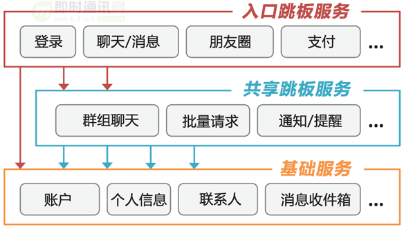
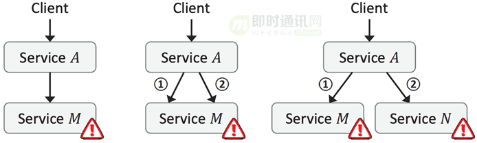
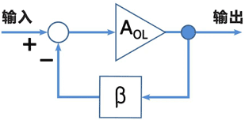
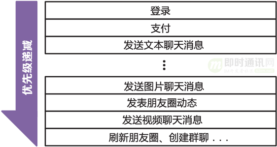
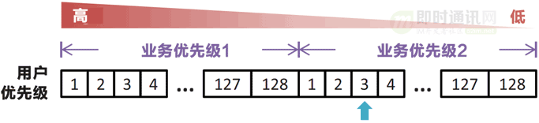
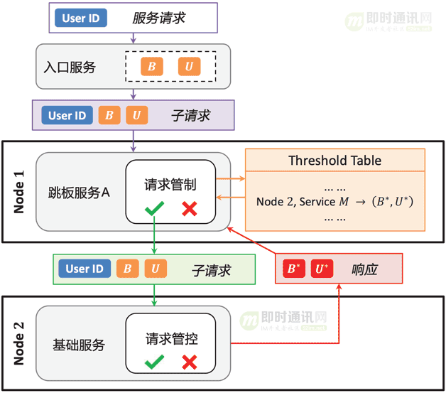
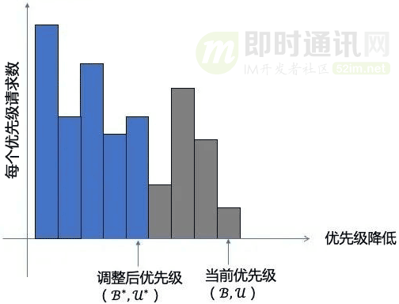
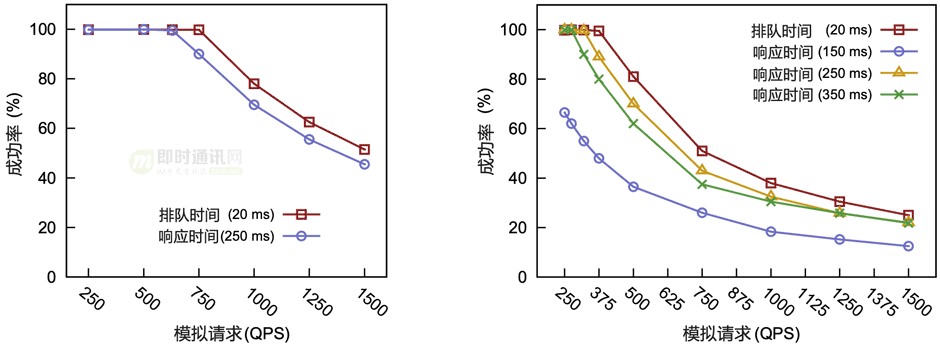
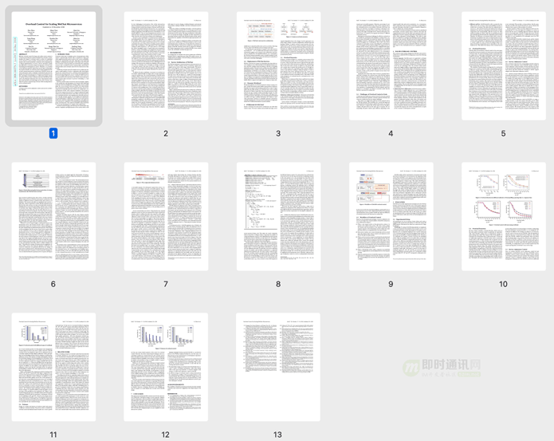

本文引用了文章“月活 12.8 亿的微信是如何防止崩溃的？”和论文“Overload Control for Scaling WeChat Microservices”的内容，有大量改动、优化和修订。

## **1、引言**

微信是一款国民级的即时通讯IM应用，月活用户早就超过10亿，而且经常过年过节会遇到聊天消息量暴增的情况，服务是很容易出现过载的，但事实是**微信的后台服务一直比较稳定，那么他们是怎么做到的呢？**

本文以微信发表的论文《[Overload Control for Scaling Wechat Microservices](https://link.zhihu.com/?target=http%3A//www.52im.net/thread-3930-1-1.html%252316)》 为基础（论文PDF原文下载见[文末附件](https://link.zhihu.com/?target=http%3A//www.52im.net/thread-3930-1-1.html%252316)），**分享了微信基于大规模微服务架构的后台过载管控和保护策略，以及微信根据IM业务特点的一些独特的架构设计做法**，其中很多方法很有借鉴意义，值得一读。

## **2、微信所面临的并发压力**

截止论文《[Overload Control for Scaling Wechat Microservices](https://link.zhihu.com/?target=http%3A//www.52im.net/thread-3930-1-1.html%252316)》发表前，微信后端有超过3000多个服务（包括即时聊天、社交关系、移动支付和第三方授权等），占用20000多台机器（随着微信的广泛普及，这些数字仍在不断增加）。

面向前端请求的入口服务每天需要处理10亿到100亿级别的请求，而每个这样的请求还会触发更多内部的关联服务，从整体来看，微信后端需要每秒处理数亿个请求。

随着微信的不断发展，这些服务子系统一直在快速进行更新迭代。以2018 年的3月到5月为例，在短短的两个月时间里，微信的各服务子系统平均每天发生近千次的变更，运维压力可想而之。

**另外：**微信每天请求量的分布很不平均，高峰期请求量能达到平时的3倍。而在特殊日子里（比如过年的时候），高峰期的流量能飙升到平时的10倍。有时朋友圈里有什么刷屏的活动，流量肯定也会突增。由此可见，微信后端系统的并发压力相当之大。

**而且：**微信后端的这些服务所处的环境也是不断变化的，包括硬件故障、代码bug、系统变更等，都会导致服务可承受的容量动态变化。

## **3、微信的后端服务架构**

微信后端采用的也是微服务架构。说是微服务，其实我理解就是采用统一的 RPC 框架搭建的一个个独立的服务，服务之间互相调用，实现各种各样的功能，这也是现代服务的基本架构。毕竟谁也不希望看到我朋友圈崩了，导致跟我聊天也不行了，这也是微信的典型好处。

**微信后端的微服务架构一般分为3层：**

**如上图所示，这3层服务分别是：**

-   *1）*“入口跳板”服务（接收外部请求的前端服务）；
-   *2）*“共享跳板”服务（中间层协调服务）；
-   *3）*“基础服务”（不再向其他服务发出请求的服务，也就是充当请求的接收器）。

微信后端的大多数服务属于“共享跳板”服务，“入口跳板”服务比如登录、发送聊天消息、支付服务等。“基础服务”也就是日常最好理解的这些信息数据接口类，比如账户数据、个人信息、好友/联系人信息等。

按照微信后端服务的请求量（每日在十亿到百亿之间），入口协议触发对“共享跳板”服务和“基础服务”更多的请求，核心服务每秒要处理上亿次的请求，也就是显而易见的了。

## **4、什么是过载保护**

***1）什么是服务过载?***

服务过载就是服务的请求量超过服务所能承受的最大值，从而导致服务器负载过高，响应延迟加大。

用户侧表现就是无法加载或者加载缓慢，这会引起用户进一步的重试，服务一直在处理过去的无效请求，导致有效请求跌 0，甚至导致整个系统产生雪崩。

***2）为什么会发生服务过载？***

互联网天生就会有突发流量、秒杀、抢购、突发大事件、节日甚至恶意攻击等，都会造成服务承受平时数倍的压力，比如微博经常出现某明星官宣结婚或者离婚导致服务器崩溃的场景，这就是服务过载。

***3）过载保护的好处***

过载保护主要是为了提升用户体验，保障服务质量，在发生突发流量时仍然能够提供一部分服务能力，而不是整个系统瘫痪。

系统瘫痪就意味着用户流失、口碑变差、夫妻吵架，甚至威胁生命安全（假如腾讯文档崩溃，这个文档正好用于救灾）。

而微信团队在面对这种量级的高并发请求挑战，做法是精细化的服务过载控制。我们继续往下学习。

## **5、微信面临的过载控制技术挑战**

过载控制对于大规模在线应用程序来说至关重要，这些应用程序需要在不可预测的负载激增的情况下实现 24×7 服务可用性。

传统的过载控制机制是为具有少量服务组件、相对狭窄的“前门”和普通依赖关系的系统而设计的。

而微信这种现代即时通讯im应用的全时在线服务特性，在架构和依赖性方面正变得越来越复杂，远远超出了传统过载控制的设计目标。

**这些技术痛点包括：**

-   *1）*由于发送到微信后端的服务请求没有单一的入口点，因此传统的全局入口点（网关）集中负载监控方法并不适用；
-   *2）*特定请求的服务调用图可能依赖于特定于请求的数据和服务参数，即使对于相同类型的请求也是如此（因此，当特定服务出现过载时，很难确定应该限制哪些类型的请求以缓解这种情况）；
-   *3）*过多的请求中止浪费了计算资源，并由于高延迟而影响了用户体验；
-   *4）*由于服务的调用链极其复杂，而且在不断演化，导致有效的跨服务协调的维护成本和系统开销过高。

由于一个服务可能会向它所依赖的服务发出多个请求，并且还可能向多个后端服务发出请求，因此我们必须特别注意过载控制。我们使用一个专门的术语，叫作“后续过载”，用于描述调用多个过载服务或多次调用单个过载服务的情况。

“后续过载”给有效的过载控制带来了挑战。当服务过载时随机执行减载可以让系统维持饱和的吞吐量，但后续过载可能会超预期大大降低系统吞吐量 …

**即：**在大规模微服务场景下，过载会变得比较复杂，如果是单体服务，一个事件只用一个请求，但微服务下，一个事件可能要请求很多的服务，任何一个服务过载失败，就会造成其他的请求都是无效的。如下图所示。

**比如：**在一个转账服务下，需要查询分别两者的卡号， 再查询 A 时成功了，但查询 B 失败，对于查卡号这个事件就算失败了。比如查询成功率只有 50%， 那对于查询两者卡号这个成功率只有 50% \* 50% = 25% 了， 一个事件调用的服务次数越多，那成功率就会越低。

## **6、微信的过载控制机制**

微信的微服务过载控制机制叫“DAGOR”（因为微信把它的服务间关系模型叫“directed acyclic graph ”，简称DAG）。

显然这种微服务底层的机制必须是和具体的业务实现无关的。DAGOR还必须是去中心化的，否则的话在微信这么大且分布不均的流量下，过载控制很难做到实时和准确。同时也无法适应微服务快速的功能迭代发布（平均每天要发生近1000次的微服务上下线）。

此外，DAGOR还需要解决一个问题：服务调用链很长，如果底层服务因为过载保护丢弃了请求，上层服务耗费的资源全浪费了，而且很影响用户体验（想想进度条走到99%告诉你失败了）。所以过载控制机制在各服务之间必须有协同作用，有时候需要考虑整个调用链的情况。

首先我们来看怎么检测到服务过载。

## **7、微信如何判断过载**

通常判断过载可以使用吞吐量、延迟、CPU 使用率、丢包率、待处理请求数、请求处理事件等等。

微信使用在请求在队列中的平均等待时间作为判断标准。平均等待时间就是从请求到达，到开始处理的时间。

**为啥不使用响应时间？**因为响应时间是跟服务相关的，很多微服务是链式调用，响应时间是不可控的，也是无法标准化的，很难作为一个统一的判断依据。

那为什么也不使用 CPU 负载作为判断标准呢？ 因为 CPU 负载高不代表服务过载，因为一个服务请求处理及时，CPU 处于高位反而是比较良好的表现。实际上 CPU 负载高，监控服务是会告警出来，但是并不会直接进入过载处理流程。

> 腾讯微服务默认的超时时间是 500ms，通过计算每秒或每 2000 个请求的平均等待时间是否超过 20ms，判断是否过载，这个 20ms 是根据微信后台 5 年摸索出来的门槛值。

**采用平均等待时间还有一个好处是：**独立于服务，可以应用于任何场景，而不用关联于业务，可以直接在框架上进行改造。

当平均等待时间大于 20ms 时，以一定的降速因子过滤调部分请求，如果判断平均等待时间小于 20ms，则以一定的速率提升通过率，一般采用快降慢升的策略，防止大的服务波动，整个策略相当于一个负反馈电路。

## **8、微信的过载控制策略**

微信后台一旦检测到服务过载，就需要按照一定的过载保户策略对请求进行过滤控制，来决定哪些请求能被过载服务处理，哪些是需要丢弃的。

前面我们分析过，对于链式调用的微服务场景，随机丢弃请求会导致整体服务的成功率很低。所以请求是按照优先级进行控制的，优先级低的请求会优先丢弃。

那么**从哪些维度来进行优化级的分级呢？**

### **8.1 基于业务的优先级控制**

**对于微信来说，不同的业务场景优先级是不同的， 比如：**

-   *1）*登录场景是最重要的业务（不能登录一切都白瞎）；
-   *2）*支付消息比普通im聊天消息优先级高（因为用户对金钱是更敏感的）；
-   *3）*普通消息又比朋友圈消息优先级高（必竟微信的本质还是im聊天）。

所以在微信内是天然存在业务优先级的。

**微信的做法是，预先定义好所有业务的优先级并保存在一个Hash Table里：**

没有定义的业务，默认是最低优先级。

业务优先级在各个业务的入口服务（Entry Services）中找到请求元信息里。由于一个请求成功与否依赖其下游服务所有的后续请求，所以下游服务的所有后续请求也会带上相同的业务优先级。当服务过载时，会处理优先级更高的请求，丢弃优先级低的请求。

**然而，只用业务优先级决定是否丢弃请求，容易造成系统颠簸，比如：**

-   *1）*支付请求突然上涨导致过载，消息请求被丢弃；
-   *2）*丢弃消息请求后，系统负载降低了，又开始处理消息请求；
-   *3）*然而，处理消息请求又导致服务过载，又会在下一个窗口抛弃消息请求。

这样反复调整服务请求管制，整体体验非常不好。所以微信需要更精细化的服务请求管制。

> PS：微信尝试过提供API让服务提供方自己修改业务优先级，后来在实践中发现这种做法在不同的团队中极难管理，且对于过载控制容易出错，最终放弃了。

### **8.2 基于用户的优先级控制**

**很明显，正如上节内容所述，只基于业务优先级的控制是不够的：**

-   *1）*首先不可能因为负载高，丢弃或允许通过一整个业务的请求，因为每个业务的请求量很大，那一定会造成负载的大幅波动；
-   *2）*另外如果在业务中随机丢弃请求，在过载情况下还是会导致整体成功率很低。

为了解决这个问题，微信引入用户优先级。

**微信在每个业务优先级内按用户ID计算出的128个优先级：**

首先用户优先级也不应该相同，对于普通人来说通过 hash 用户唯一 ID计算用户优先级（这个hash函数每小时变一次，让所有用户都有机会在相对较长的时间内享受到高优先级，保证“公平”）。跟业务优先级一样，单个用户的访问链条上的优先级总是一致的。

**这里有个疑问：**为啥不采用会话 ID 计算优先级呢？

> 从理论上来说采用会话 ID 和用户 ID 效果是一样的，但是采用会话 ID 在用户重新登录时刷新，这个时候可能用户的优先级可能变了。在过载的情况下，他可能因为提高了优先级就恢复了。 这样用户会养成坏习惯，在服务有问题时就会重新登录，这样无疑进一步加剧了服务的过载情况。

于是，因为引入了用户优先级，那就和业务优先级组成了一个二维控制平面。根据负载情况，决定这台服务器的准入优先级(B,U)，当过来的请求业务优先级大于 B，或者业务优先级等于 B，但用户优先级高于 U 时，则通过，否则决绝。

**下图就是这个“优先级(B,U)”控制逻辑（我们会在后面再具体讨论）：**

### **8.3 自适应优先级调整**

在大规模微服务场景下，服务器的负载变化是非常频繁的。所以服务器的准入优先级是需要动态变化的，微信分了几十个业务优先级，每个业务优先级下有 128 个用户优先级，所以总的优先级是几千个。

**如何根据负载情况调整优先级呢？**

**最简单的方式是从右到左遍历：**每调整一次判断下负载情况。这个时间复杂度是 O(n), 就算使用二分法，时间复杂度也为 O(logn)，在数千个优先级下，可能需要数十次调整才能确定一个合适的优先级，每次调整好再统计优先级，可能几十秒都过去了，这个方法无疑是非常低效的。

**微信提出了一种基于直方图统计的方法快速调整准入优先级：**服务器上维护者目前准入优先级下，过去一个周期的（1s 或 2000 次请求）每个优先级的请求量。当过载时，通过消减下一个周期的请求量来减轻负载。假设上一个周期所有优先级的通过的请求总和是 N，下一个周期的请求量要减少 N\*a，怎么去减少呢？每提升一个优先级就减少一定的请求量，一直提升到 减少的数目大于目标量，恢复负载使用相反的方法，只不是系数为 b ，比 a 小，也是为了快降慢升。根据经验值 a 为 5%，b 为 1%。

为了进一步减轻过载机器的压力，能不能在下游过载的情况下不把请求发到下游呢？否则下游还是要接受请求、解包、丢弃请求，白白的浪费带宽，也加重了下游的负载。

**为了实现这个能力：**在每次请求下游服务时，下游把当前服务的准入优先级返回给上游，上游维护下游服务的准入优先级，如果发现请求优先级达不到下游服务的准入门槛，直接丢弃，而不再请求下游，进一步减轻下游的压力。

## **9、实验数据**

微信的这套服务过载控制策略（即DAGOR）在微信的生产环境已经运作多年，这是对它的设计可行性的最好证明。

但并没有为学术论文提供必要的图表，所以微信同时进行了一组模拟实验。

下面的图表突出显示了基于排队时间而非响应时间的过载控制的好处。在发生后续过载的情况下，这些好处最为明显（图右）。

## **10、小结一下**

**微信的整个过载控制逻辑流程如下图所示：**

**针对上面这张图，我们来解读一下：**

-   *1）*当用户从微信发起请求，请求被路由到接入层服务，分配统一的业务和用户优先级，所有到下游的字请求都继承相同的优先级；
-   *2）*根据业务逻辑调用 1 个或多个下游服务，当服务收到请求，首先根据自身服务准入优先级判断请求是接受还是丢弃（服务本身根据负载情况周期性的调整准入优先级）；
-   *3）*当服务需要再向下游发起请求时，判断本地记录的下游服务准入优先级（如果小于则丢弃，如果没有记录或优先级大于记录则向下游发起请求）；
-   *4）*下游服务返回上游服务需要的信息，并且在信息中携带自身准入优先级；
-   *5）*上游接受到返回后解析信息，并更新本地记录的下游服务准入优先级。

**微信的整个过载控制策略有以下三个特点：**

-   *1）*业务无关的：使用请求等待时间而不是响应时间，制定用户和业务优先级，这些都与业务本身无关；
-   *2）*高效且公平： 请求链条的优先级是一致的，并且会定时改变 hash 函数调整用户优先级，过载情况下，不会总是影响固定的用户；
-   *3）*独立控制和联合控制结合：准入优先级取决于独立的服务，但又可以联合下游服务的情况，优化服务过载时的表现。

## **11、写在最后**

微信团队的分享只提到过载控制，但我相信服务调用方应该还有一些其他机制，能够解决不是因为下游服务过载，而是因为网络抖动导致的请求超时问题。

微信的这套微服务过载控制机制（即DAGOR）提供的服务无关、去中心化、高效和公平等特性很好地在微信后端跑了很多年。

**最后，微信团队还分享了他们设计和运维DAGOR宝贵经验：**

-   *1）*大规模微服务架构中的过载控制必须在每个服务中实现分散和自治；
-   *2）*过载控制应该要考虑到各种反馈机制（例如 DAGOR 的协作准入控制），而不是仅仅依赖于开环启发式；
-   *3）*应该通过分析实际工作负载来了解过载控制设计。

## **12、参考资料**

\[1\] [Overload Control for Scaling WeChat Microservices](https://link.zhihu.com/?target=http%3A//www.52im.net/thread-3930-1-1.html%252316)

\[2\] [罗神解读“Overload Control for Scaling WeChat Microservices”](http://zhuanlan.zhihu.com/p/84415217)

\[3\] [2W台服务器、每秒数亿请求，微信如何不“失控”？](https://link.zhihu.com/?target=http%3A//baijiahao.baidu.com/s%253Fid%253D1617827040372564403%2526wfr%253Dspider%2526for%253Dpc)

\[4\] [DAGOR：微信微服务过载控制系统](https://link.zhihu.com/?target=http%3A//www.infoq.cn/article/bavev%252Ab7gth123tlwydr)

\[5\] [月活 12.8 亿的微信是如何防止崩溃的？](https://link.zhihu.com/?target=http%3A//mp.weixin.qq.com/s/xmQCKVkqhhTKd1k6GmkZfA)

\[6\] [微信朋友圈千亿访问量背后的技术挑战和实践总结](https://link.zhihu.com/?target=https%3A//www.52im.net/thread-1569-1-1.html)

\[7\] [QQ 18年：解密8亿月活的QQ后台服务接口隔离技术](https://link.zhihu.com/?target=https%3A//www.52im.net/thread-1093-1-1.html)

\[8\] [微信后台基于时间序的海量数据冷热分级架构设计实践](https://link.zhihu.com/?target=https%3A//www.52im.net/thread-895-1-1.html)

\[9\] [架构之道：3个程序员成就微信朋友圈日均10亿发布量\[有视频\]](https://link.zhihu.com/?target=https%3A//www.52im.net/thread-177-1-1.html)》

\[10\] [快速裂变：见证微信强大后台架构从0到1的演进历程（一）](https://link.zhihu.com/?target=https%3A//www.52im.net/thread-168-1-1.html)

\[11\] [一份微信后台技术架构的总结性笔记](https://link.zhihu.com/?target=https%3A//www.52im.net/thread-179-1-1.html)》

## **13、论文原文**

**论文PDF请下载此附件：**

（因无法上传附件，请从此链接：[http://www.52im.net/thread-3930-1-1.html](https://link.zhihu.com/?target=https%3A//www.52im.net/thread-3930-1-1.html)文末的“参考资料”附件中下载）

**论文PDF全部内容概览：**

（本文已同步发布于：[http://www.52im.net/thread-3930-1-1.html](https://link.zhihu.com/?target=https%3A//www.52im.net/thread-3930-1-1.html)）