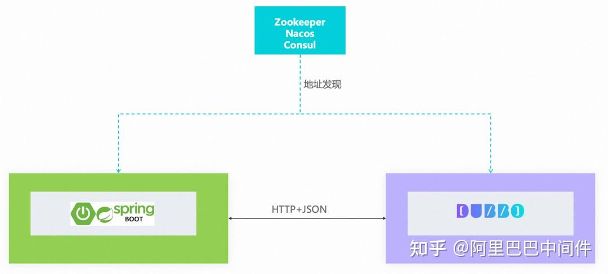
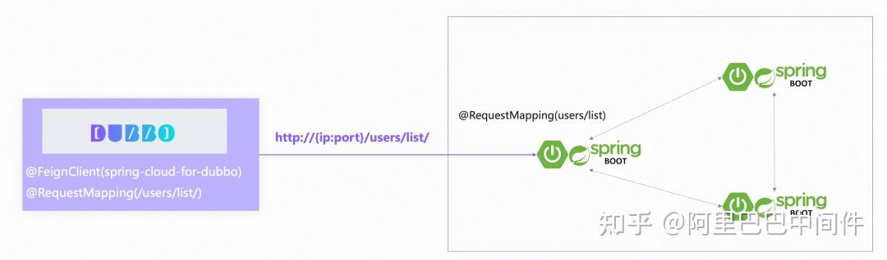
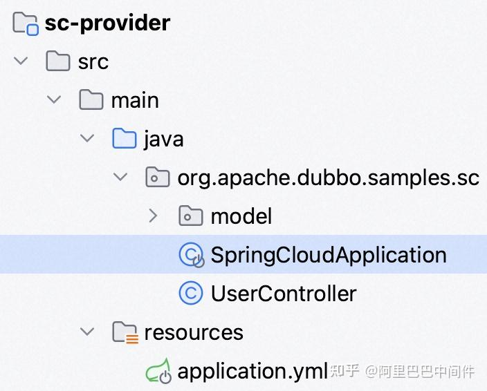
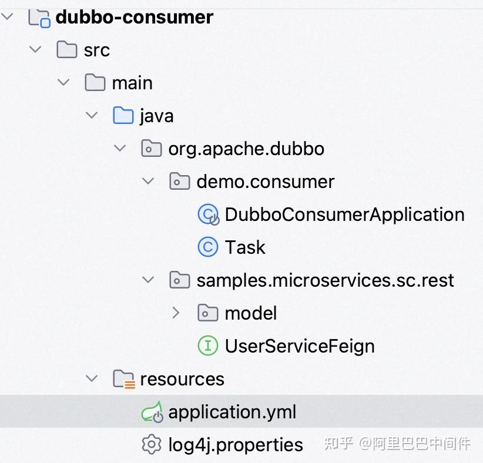
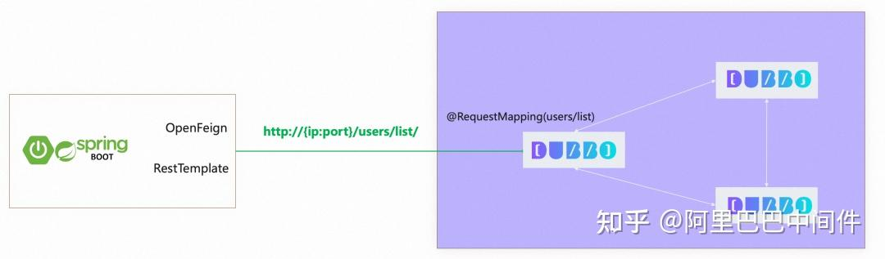
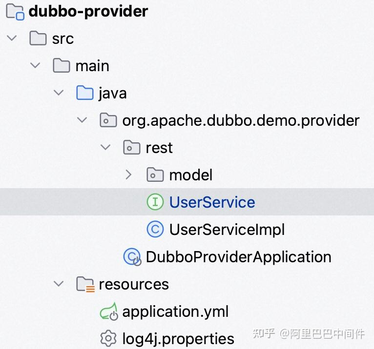
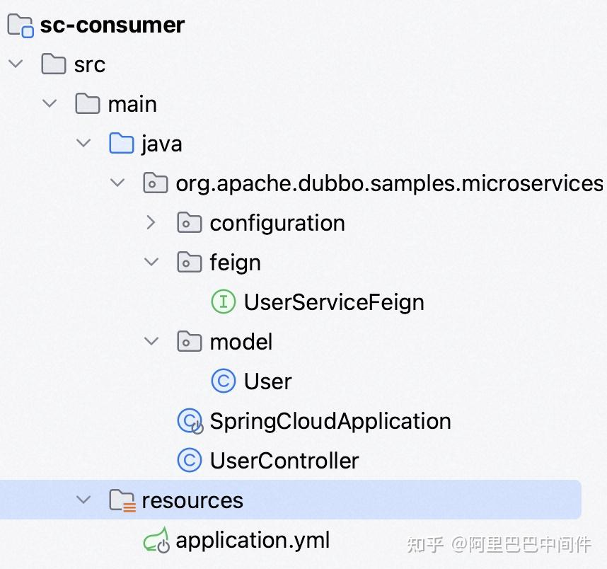
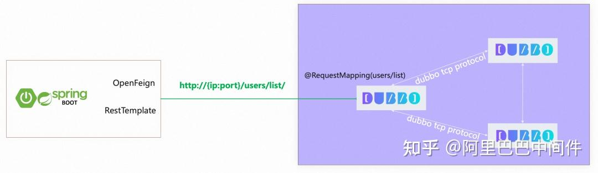

*作者：孙彩荣*

  

很遗憾，这不是一篇关于中间件理论或原理讲解的文章，没有高深晦涩的工作原理分析，文后也没有令人惊叹的工程数字统计。**本文以实际项目和代码为示例，一步一步演示如何以最低成本实现 Apache Dubbo 体系与 Spring Cloud 体系的互通，进而实现不同微服务体系的混合部署、迁移等，帮助您解决实际架构及业务问题。**

  

## 背景与目标

  

如果你在微服务开发过程中正面临以下一些业务场景需要解决，那么这篇文章可以帮到您：

  

-   您已经有一套基于 Dubbo 构建的微服务应用，这时你需要将部分服务通过 REST HTTP 的形式（非接口、方法模式）发布出去，供一些标准的 HTTP 端调用（如 Spring Cloud 客户端），整个过程最好是不用改代码，直接为写好的 Dubbo 服务加一些配置、注解就能实现。
-   您已经有一套基于 Spring Cloud 构建的微服务体系，而后又构建了一套 Dubbo 体系的微服务，你想两套体系共存，因此现在两边都需要调用到对方发布的服务。也就是 Dubbo 应用作为消费方要调用到 Spring Cloud 发布的 HTTP 接口，Dubbo 应用作为提供方还能发布 HTTP 接口给 Spring Cloud 调用。
-   出于一些历史原因，你正规划从一个微服务体系迁移到另外一个微服务体系，前提条件是要保证中间过程的平滑迁移。

  

  



  

  

对于以上几个场景，我们都可以借助 Dubbo3 内置的 REST 编程范式支持实现，这让 Dubbo 既可以作为消费方调用 HTTP 接口的服务，又可以作为提供方对外发布 REST 风格的 HTTP 服务，同时整个编码过程支持业界常用的 REST 编程范式（如 JAX-RS、Spring MVC 等），因此可以做到基本不改动任何代码的情况下实现 Dubbo 与 Spring Cloud 体系的互相调用。

  

-   关于这一部分更多的设计与理论阐述请参见这里的博客文章**\[1\]**
-   关于 Dubbo REST 的更多配置方式请参见 rest 使用参考手册**\[2\]**

  

## 示例一：Dubbo 调用 Spring Cloud

  

在已经有一套 Spring Cloud 微服务体系的情况下，演示如何使用 Dubbo 调用 Spring Cloud 服务（包含自动的地址发现与协议传输）。在注册中心方面，本示例使用 Nacos 作为注册中心，对于 Zookeeper、Consul 等两种体系都支持的注册中心同样适用。

  

  



  

  

设想你已经有一套 Spring Cloud 的微服务体系，现在我们将引入 Dubbo 框架，让 Dubbo 应用能够正常的调用到 Spring Cloud 发布的服务。本示例完整源码请参见 samples/dubbo-call-sc**\[3\]**。

  

## 启动 Spring Cloud Server

  

示例中 Spring Cloud 应用的结构如下：

  

  



  

  

应用配置文件如下：

  

```text
server:
  port: 8099
spring:
  application:
    name: spring-cloud-provider-for-dubbo
  cloud:
    nacos:
      serverAddr: 127.0.0.1:8848 #注册中心
```

  

以下是一个非常简单的 Controller 定义，发布了一个 /users/list/的 http 端点。

  

```text
@RestController
@RequestMapping("/users")
public class UserController {
    @GetMapping("/list")
    public List<User> getUser() {
        return Collections.singletonList(new User(1L, "spring cloud server"));
    }
}
```

  

启动 SpringCloudApplication，通过 cURL 或浏览器访问 http://localhost:8099/users/list 可以测试应用启动成功。

  

## 使用 Dubbo Client 调用服务

  

Dubbo client 也是一个标准的 Dubbo 应用，项目基本结构如下：

  

  



  

  

其中，一个比较关键的是如下接口定义（正常情况下，以下接口可以直接从原有的 Spring Cloud client 应用中原样拷贝过来即可，无需做任何修改）。

  

> 如果之前没有基于 OpenFeign 的 Spring Cloud 消费端应用，那么就需要自行定义一个接口，此时不一定要使用 OpenFeign 注解，使用 Spring MVC 标准注解即可。

  

通过 DubboReference 注解将 UserServiceFeign 接口注册为 Dubbo 服务。

  

```text
@DubboReference
private UserServiceFeign userService;
```

  

接下来，我们就可以用 Dubbo 标准的方式对服务发起调用了。

  

```text
List<User> users = userService.users();
```

  

通过 DubboConsumerApplication 启动 Dubbo 应用，验证可以成功调用到 Spring Cloud 服务。

  

## 示例二：Spring Cloud 调用 Dubbo

  

在接下来的示例中，我们将展示如何将 Dubbo server 发布的服务开放给 Spring Cloud client 调用。

  

  



  

  

示例的相关源码在 samples/sc-call-dubbo**\[4\]**

  

## 启动 Dubbo Server

  

Dubbo server 应用的代码结构非常简单，是一个典型的 Dubbo 应用。

  

  



  

  

相比于普通的 Dubbo 服务定义，我们要在接口上加上如下标准 Spring MVC 注解：

  

```text
@RestController
@RequestMapping("/users")
public interface UserService {
    @GetMapping(value = "/list")
    List<User> getUsers();
}
```

  

除了以上注解之外，其他服务发布等流程都一致，使用 DubboService 注解发布服务即可：

  

```text
@DubboService
public class UserServiceImpl implements UserService {
    @Override
    public List<User> getUsers() {
        return Collections.singletonList(new User(1L, "Dubbo provider!"));
    }
}
```

  

在服务配置上，特别注意我们需要将服务的协议配置为 rest protocol: rest，地址发现模式使用 register-mode: instance：

  

```text
dubbo:
  registry:
    address: nacos://127.0.0.1:8848
    register-mode: instance
  protocol:
    name: rest
    port: 8090
```

  

启动 Dubbo 应用，此时访问以下地址可以验证服务运行正常：http://localhost:8090/users/list

  

## 使用 Spring Cloud 调用 Dubbo

  

使用 OpenFeign 开发一个标准的 Spring Cloud 应用，即可调用以上发布的 Dubbo 服务，项目代码结构如下：

  

  



  

  

其中，我们定义了一个 OpenFeign 接口，用于调用上面发布的 Dubbo rest 服务。

  

```text
@FeignClient(name = "dubbo-provider-for-spring-cloud")
public interface UserServiceFeign {
    @RequestMapping(value = "/users/list", method = RequestMethod.GET)
    List<User> getUsers();
}
```

  

定义以下 controller 作为 OpenFeign 和 RestTemplate 测试入口：

  

```text
public class UserController {

    private final RestTemplate restTemplate;
    private final UserServiceFeign userServiceFeign;

    public UserController(RestTemplate restTemplate,
                          UserServiceFeign userServiceFeign) {
        this.restTemplate = restTemplate;
        this.userServiceFeign = userServiceFeign;
    }

    @RequestMapping("/rest/test1")
    public String doRestAliveUsingEurekaAndRibbon() {
        String url = "http://dubbo-provider-for-spring-cloud/users/list";
        System.out.println("url: " + url);
        return restTemplate.getForObject(url, String.class);
    }

    @RequestMapping("/rest/test2")
    public List<User> doRestAliveUsingFeign() {
        return userServiceFeign.getUsers();
    }
}
```

  

根据以上 Controller 定义，我们可以分别访问以下地址进行验证：

-   **OpenFeign 方式：**http://localhost:8099/dubbo/rest/test1
-   **RestTemplage 方式：**http://localhost:8099/dubbo/rest/test2

  

## 为 Dubbo Server 发布更多的服务

  

我们可以利用 Dubbo 的多协议发布机制，为一些服务配置多协议发布。接下来，我们就为上面提到的 Dubbo server 服务增加 dubbo tcp 协议发布，从而达到以下部署效果，让这个 Dubbo 应用同时服务 Dubbo 微服务体系和 Spring Cloud 微服务体系。

  

  



  

  

为了实现这个效果，我们只需要在配置中增加多协议配置即可：

  

```text
dubbo:
  protocols:
    - id: rest
      name: rest
      port: 8090
    - id: dubbo
      name: dubbo
      port: 20880
```

  

同时，服务注解中也配置为多协议发布：

  

```text
@DubboService(protocol="rest,dubbo")
public class UserServiceImpl implements UserService {}
```

  

这样，我们就成功的将 UserService 服务以 dubbo 和 rest 两种协议发布了出去（多端口多协议的方式），dubbo 协议为 Dubbo 体系服务，rest 协议为 Spring Cloud 体系服务。

  

> **注意：**Dubbo 为多协议发布提供了单端口、多端口两种方式，这样的灵活性对于不同部署环境下的服务会有比较大的帮助。在确定您需要的多协议发布方式前，请提仔细阅读以下多协议配置**\[5\]**文档。

  

## 总结

  

基于 Dubbo 的 rest 编程范式、多协议发布等特性，可以帮助你轻松的实现 Dubbo 服务的 http 协议发布，让后端服务基于 RPC 高效通信的同时，能够更容易的与 http 服务体系打通，本示例通过 Dubbo 与 Spring Cloud 两套体系的共存、互通示例非常清晰的演示了编码过程。

  

此部分内容的正式版本将在 Dubbo 3.3.0 版本正式发布，同时还包含 Triple 协议的重磅升级，敬请期待！

  

**相关链接：**

\[1\] 博客文章

*[https://cn.dubbo.apache.org/zh-cn/blog/2023/01/05/dubbo-%e8%bf%9e%e6%8e%a5%e5%bc%82%e6%9e%84%e5%be%ae%e6%9c%8d%e5%8a%a1%e4%bd%93%e7%b3%bb-%e5%a4%9a%e5%8d%8f%e8%ae%ae%e5%a4%9a%e6%b3%a8%e5%86%8c%e4%b8%ad%e5%bf%83/](https://link.zhihu.com/?target=https%3A//cn.dubbo.apache.org/zh-cn/blog/2023/01/05/dubbo-%2525e8%2525bf%25259e%2525e6%25258e%2525a5%2525e5%2525bc%252582%2525e6%25259e%252584%2525e5%2525be%2525ae%2525e6%25259c%25258d%2525e5%25258a%2525a1%2525e4%2525bd%252593%2525e7%2525b3%2525bb-%2525e5%2525a4%25259a%2525e5%25258d%25258f%2525e8%2525ae%2525ae%2525e5%2525a4%25259a%2525e6%2525b3%2525a8%2525e5%252586%25258c%2525e4%2525b8%2525ad%2525e5%2525bf%252583/%3Fspm%3Da2c6h.13046898.publish-article.3.4b036ffaacZswB)*

\[2\] rest 使用参考手册

*[https://cn.dubbo.apache.org/zh-cn/overview/reference/proposals/protocol-http/](https://link.zhihu.com/?target=https%3A//cn.dubbo.apache.org/zh-cn/overview/reference/proposals/protocol-http/%3Fspm%3Da2c6h.13046898.publish-article.4.4b036ffaacZswB)*

\[3\] samples/dubbo-call-sc

*[https://github.com/apache/dubbo-samples/tree/master/2-advanced/dubbo-samples-springcloud/dubbo-call-sc](https://link.zhihu.com/?target=https%3A//github.com/apache/dubbo-samples/tree/master/2-advanced/dubbo-samples-springcloud/dubbo-call-sc%3Fspm%3Da2c6h.13046898.publish-article.5.4b036ffaacZswB)*

\[4\] samples/sc-call-dubbo

*[https://github.com/apache/dubbo-samples/tree/master/2-advanced/dubbo-samples-springcloud/sc-call-dubbo](https://link.zhihu.com/?target=https%3A//github.com/apache/dubbo-samples/tree/master/2-advanced/dubbo-samples-springcloud/sc-call-dubbo%3Fspm%3Da2c6h.13046898.publish-article.6.4b036ffaacZswB)*

\[5\] 多协议配置

*[https://cn.dubbo.apache.org/zh-cn/overview/mannual/java-sdk/advanced-features-and-usage/service/multi-protocols/](https://link.zhihu.com/?target=https%3A//cn.dubbo.apache.org/zh-cn/overview/mannual/java-sdk/advanced-features-and-usage/service/multi-protocols/%3Fspm%3Da2c6h.13046898.publish-article.7.4b036ffaacZswB)*