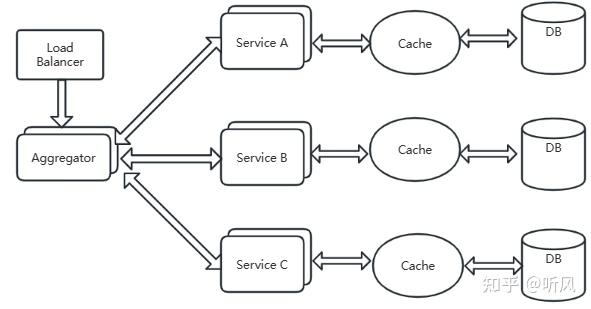
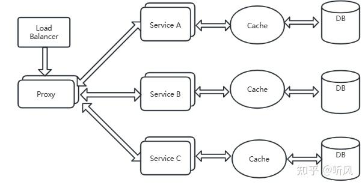
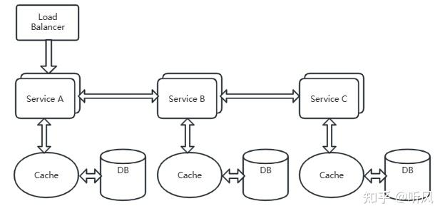
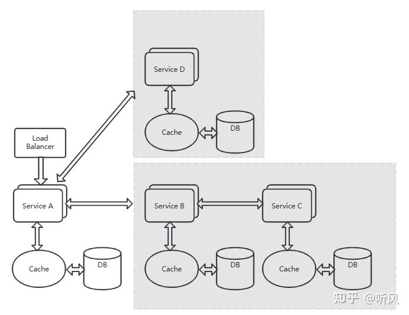
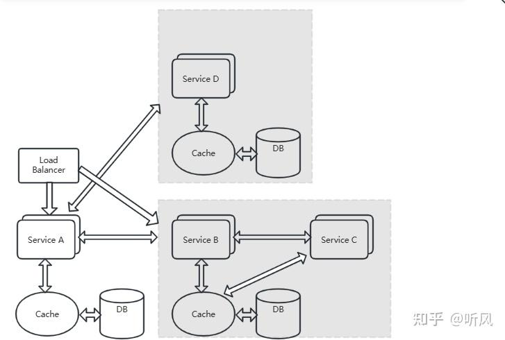
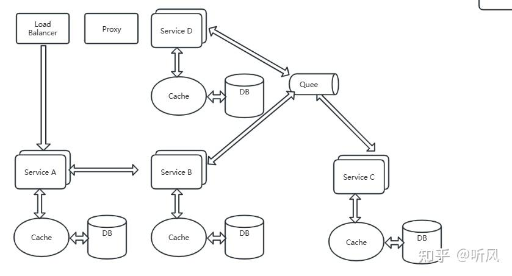

**1.1聚合器微服务设计模式**

这是 一种最常见也最简单的设计模式，效果如图所示

聚合器调用多个服务实现应用程序所需的功能。它可以是 个简单的 eb 页面， 将检索到的数据进行处理并展示，也可以是一个更高层次的组合微服务，对检索到的数据增加业务逻辑后进 步发布成一个新的微服务，这符合 DRY 原则 。另外，每个服务都有自己 缓存和数据库。如果聚合器是一个组合服务，那么它也有自己的缓存和数据库。

### **1.2代理微服务设计模式**

这是聚合模式的 一个个变种，如图所示：

在这种情况下 客户端并不聚合数据，但会根据业务需求的差别调用不 同的微服务。代理 可以仅仅委派请求，也可以进行数据转换工作 每个微服务都有自己独立的缓存和数据库系统， 彼此独立。

### **1.3链式微服务设计模式**

这种模式在接收到请求后会产生 一个经过合井的响应，如图所示：

在这种情况下，服务 接收到请求后会与服务 进行通信，类似地，服务会同服务进行通信所有服务都使用同步消息传递。在整个链式调用完成之前，客户端会 直阻塞 因此，服务调用链不直过长，以免客户端长时间等待。

### **1.4分支微服务设计模式**

这种模式是聚合器模式的扩展，允许同时调用两个微服务链，如图所示：

每个调用链分别调用自己的服务。当某个调用出现问题时，相互之间不会造成影响

### **1.5数据共享微服务设计模式**

自治是微服务的设计原则之一，也就是说微服务是全枝式服务 但在重构现有的“单体应用（ monolithic application ）＂时， SQL 数据库反规范化可能会导致数据重复和不一致。 因此，在单体应用到微服务架构的过渡阶段，可以使用这种设计模式，如图所示:

在这种情况下，部分微服务可能会共享缓存和数据库存储。不过，这只有在两个服务之存在强稠合关系时才可以。对于基于微服务的新建应用程序而言，这是一 种反模式。

### **1.6异步消息传递微服务设计模式**

虽然 REST 设计模式非常流行，但它是同步的，会造成阻塞。因此部分基于微服务的架构可能会选择使用消息队列代替阻ST 请求／响应，如图所示：

各个服务之间通过异步的消息队列进行交互，当服务出现问题时，不会造成阻塞，队列会 帮助缓存消息，直到消费服务开始工作。