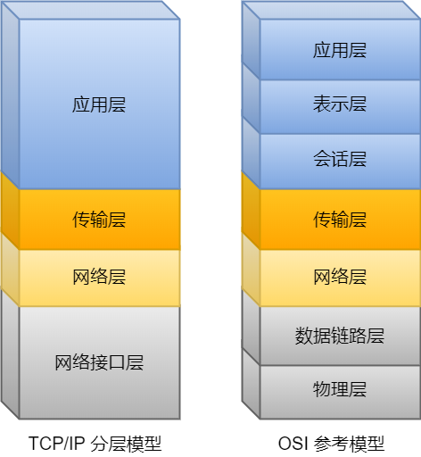
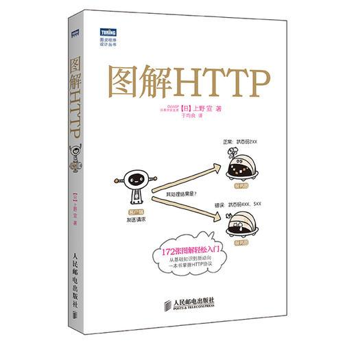
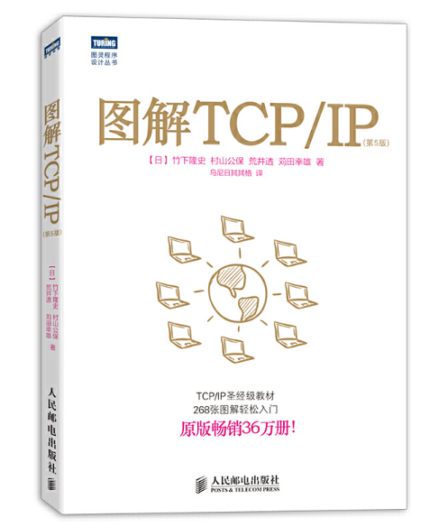
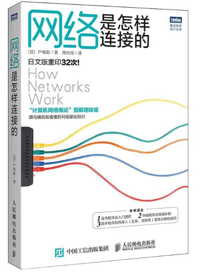
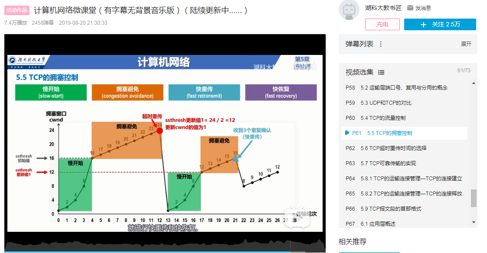
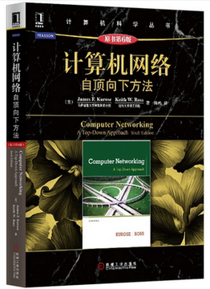
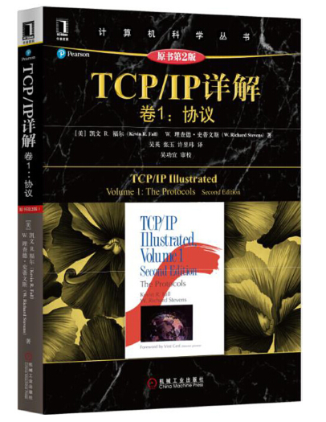
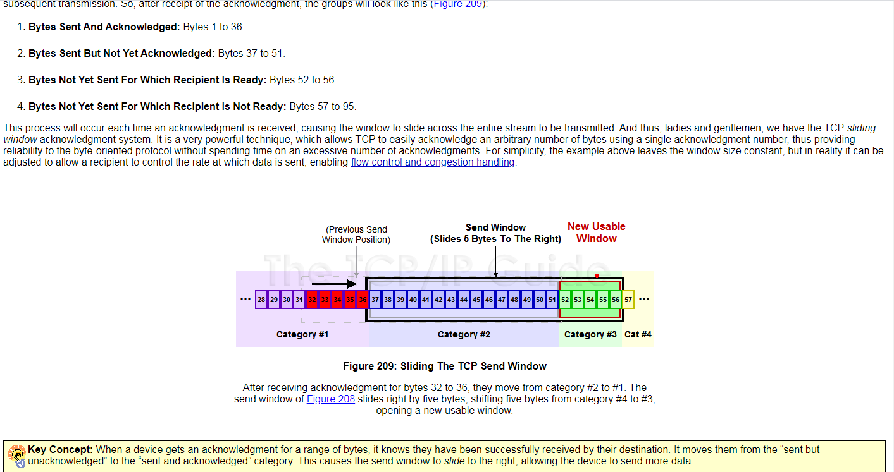
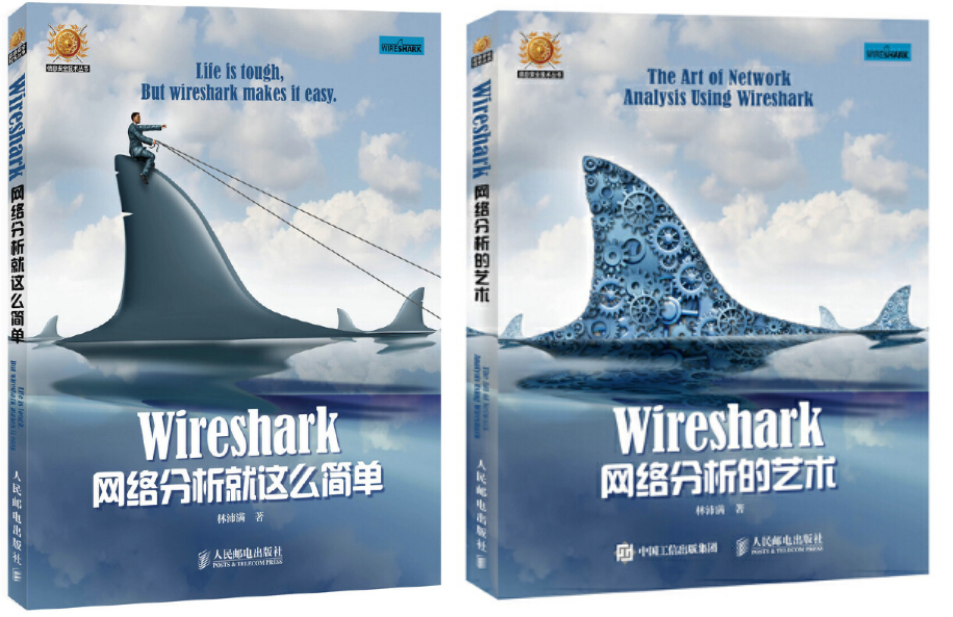
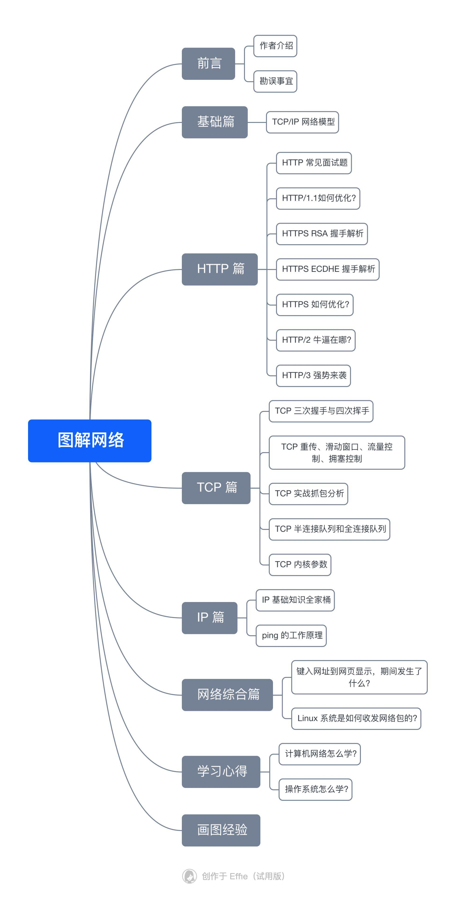

[计算机网络](https://www.zhihu.com/search?q=%E8%AE%A1%E7%AE%97%E6%9C%BA%E7%BD%91%E7%BB%9C&search_source=Entity&hybrid_search_source=Entity&hybrid_search_extra=%7B%22sourceType%22%3A%22answer%22%2C%22sourceId%22%3A1517809406%7D)我啃了非常的多书，也看了很多的资料，今天就跟大家掏心掏肺的分享下！

计算机网络相比操作系统好学非常多，因为计算机网络不抽象，你要想知道网络中的细节，你都可以通过抓包来分析，而且不管是手机、个人电脑和服务器，它们所使用的计算网络协议是一致的。

也就是说，计算机网络不会因为设备的不同而不同，大家都遵循这一套「规则」来相互通信，这套规则就是 TCP/IP 网络模型。

TCP/IP 网络参考模型共有 `4` 层，其中需要我们熟练掌握的是应用层、传输层和网络层，至于网络接口层（数据链路层和[物理层](https://www.zhihu.com/search?q=%E7%89%A9%E7%90%86%E5%B1%82&search_source=Entity&hybrid_search_source=Entity&hybrid_search_extra=%7B%22sourceType%22%3A%22answer%22%2C%22sourceId%22%3A1517809406%7D)）我们只需要做简单的了解就可以了。

对于应用层，当然重点要熟悉最常见的 [HTTP 和 HTTPS](https://link.zhihu.com/?target=https%3A//mp.weixin.qq.com/s/bUy220-ect00N4gnO0697A)，传输层 TCP 和 UDP 都要熟悉，[网络层](https://www.zhihu.com/search?q=%E7%BD%91%E7%BB%9C%E5%B1%82&search_source=Entity&hybrid_search_source=Entity&hybrid_search_extra=%7B%22sourceType%22%3A%22answer%22%2C%22sourceId%22%3A1517809406%7D)要熟悉 [IPv4](https://link.zhihu.com/?target=https%3A//mp.weixin.qq.com/s/bUy220-ect00N4gnO0697A)，IPv6 可以做简单点了解。

我觉得学习一个东西，就从我们常见的事情开始着手。

比如， ping 命令可以说在我们判断网络环境的时候，最常使用的了，你可以先把你电脑 ping 你舍友或同事的电脑的过程中发生的事情都搞明白，这样就基本知道一个数据包是怎么转发的了，于是你就知道了网络层、数据链路层和物理层之间是如何工作，如何相互配合的了。

搞明白了 [ping 过程](https://link.zhihu.com/?target=https%3A//mp.weixin.qq.com/s/leE2DgDOl5z90hG2gG1Urw)，我相信你学起 HTTP 请求过程的时候，会很快就能掌握了，因为网络层以下的工作方式，你在学习 ping 的时候就已经明白了，这时就只需要认真掌握传输层中的 TCP 和应用层中的 HTTP 协议，就能搞明白[访问网页的整个过程](https://link.zhihu.com/?target=https%3A//mp.weixin.qq.com/s/iSZp41SRmh5b2bXIvzemIw)了，这也是面试常见的题目了，毕竟它能考察你网络知识的全面性。

重中之重的知识就是 TCP 了，TCP 不管是[建立连接、断开连接](https://link.zhihu.com/?target=https%3A//mp.weixin.qq.com/s/tH8RFmjrveOmgLvk9hmrkw)的过程，还是数据传输的过程，都不能放过，针对数据可靠传输的特性，又可以拆解为[超时重新、流量控制、滑动窗口、拥塞控制](https://link.zhihu.com/?target=https%3A//mp.weixin.qq.com/s/Tc09ovdNacOtnMOMeRc_uA)等等知识点，学完这些只能算对 TCP 有个「**感性**」的认识，另外我们还得知道 Linux 提供的 [TCP 内核的参数](https://link.zhihu.com/?target=https%3A//mp.weixin.qq.com/s/fjnChU3MKNc_x-Wk7evLhg)的作用，这样才能从容地应对工作中遇到的问题。

接下来，推荐我看过并觉得不错的计算机网络相关的书籍和视频。

### **入门系列**

此系列针对没有任何计算机基础的朋友，如果已经对计算机轻车熟路的大佬，也不要忽略，不妨看看我推荐的正确吗。

如果你要入门 HTTP，首先最好书籍就是《**[图解 HTTP](https://www.zhihu.com/search?q=%E5%9B%BE%E8%A7%A3+HTTP&search_source=Entity&hybrid_search_source=Entity&hybrid_search_extra=%7B%22sourceType%22%3A%22answer%22%2C%22sourceId%22%3A1517809406%7D)**》了，作者真的做到完完全全的「图解」，小林的图解功夫还是从这里偷学到不少，书籍不厚，相信优秀的你，几天就可以看完了。

如果要入门 TCP/IP 网络模型，我推荐的是《**[图解 TCP/IP](https://www.zhihu.com/search?q=%E5%9B%BE%E8%A7%A3+TCP%2FIP&search_source=Entity&hybrid_search_source=Entity&hybrid_search_extra=%7B%22sourceType%22%3A%22answer%22%2C%22sourceId%22%3A1517809406%7D)**》，这本书也是以大量的图文来介绍了 TCP/IP 网络模式的每一层，但是这个书籍的顺序不是从「应用层 —> 物理层」，而是从「物理层 -> 应用层」顺序开始讲的，这一点我觉得不太好，这样一上来就把最枯燥的部分讲了，很容易就被劝退了，所以我建议先跳过前面几个章节，先看网络层和传输层的章节，然后再回头看前面的这几个章节。

另外，你想了解网络是怎么传输，那我推荐《**[网络是怎样连接的](https://www.zhihu.com/search?q=%E7%BD%91%E7%BB%9C%E6%98%AF%E6%80%8E%E6%A0%B7%E8%BF%9E%E6%8E%A5%E7%9A%84&search_source=Entity&hybrid_search_source=Entity&hybrid_search_extra=%7B%22sourceType%22%3A%22answer%22%2C%22sourceId%22%3A1517809406%7D)**》，这本书相对比较全面的把访问一个网页的发生的过程讲解了一遍，其中关于电信等运营商是怎么传输的，这部分你可以跳过，当然你感兴趣也可以看，只是我觉得没必要看。

如果你觉得书籍过于枯燥，你可以结合 B 站《**计算机网络微课堂**》视频一起学习，这个视频是[湖南科技大学](https://www.zhihu.com/search?q=%E6%B9%96%E5%8D%97%E7%A7%91%E6%8A%80%E5%A4%A7%E5%AD%A6&search_source=Entity&hybrid_search_source=Entity&hybrid_search_extra=%7B%22sourceType%22%3A%22answer%22%2C%22sourceId%22%3A1517809406%7D)老师制作的，PPT 的动图是我见过做的最用心的了，一看就懂的佳作。

> B 站视频地址：[https://www.bilibili.com/video/BV1c4411d7jb?p=1](https://link.zhihu.com/?target=https%3A//www.bilibili.com/video/BV1c4411d7jb%3Fp%3D1)

### **深入学习系列**

看完入门系列，相信你对计算机网络已经有个大体的认识了，接下来我们也不能放慢脚步，快马加鞭，借此机会继续深入学习，因为隐藏在背后的细节还是很多的。

对于 TCP/IP 网络模型深入学习的话，推荐《**[计算机网络 - 自顶向下方法](https://www.zhihu.com/search?q=%E8%AE%A1%E7%AE%97%E6%9C%BA%E7%BD%91%E7%BB%9C+-+%E8%87%AA%E9%A1%B6%E5%90%91%E4%B8%8B%E6%96%B9%E6%B3%95&search_source=Entity&hybrid_search_source=Entity&hybrid_search_extra=%7B%22sourceType%22%3A%22answer%22%2C%22sourceId%22%3A1517809406%7D)**》，这本书是从我们最熟悉 HTTP 开始说起，一层一层的说到最后物理层的，有种挖地洞的感觉，这样的内容编排顺序相对是比较合理的。

但如果要深入 TCP，前面的这些书还远远不够，赋有计算机网络圣经的之说的《**TCP/IP 详解 卷一：协议**》这本书，是进一步深入学习的好资料，这本书的作者用各种实验的方式来细说各种协议，但不得不说，这本书真的很枯燥，当时我也啃的很难受，但是它质量是真的很高，这本书我只看了 TCP 部分，其他部分你可以选择性看，但是你一定要过几遍这本书的 TCP 部分，涵盖的内容非常全且细。

要说我看过最好的 TCP 资料，那必定是《**The TCP/IP GUIDE**》这本书了，目前只有英文版本的，而且有个专门的网址可以白嫖看这本书的内容，图片都是彩色，看起来很舒服很鲜明，小林之前写的 TCP 文章不少案例和图片都是参考这里的，这本书精华部分就是把 TCP 滑动窗口和流量控制说的超级明白，很可惜拥塞控制部分说的不多。

> 白嫖站点：[http://www.tcpipguide.com/free/t\_TCPSlidingWindowAcknowledgmentSystemForDataTranspo-6.htm](https://link.zhihu.com/?target=http%3A//www.tcpipguide.com/free/t_TCPSlidingWindowAcknowledgmentSystemForDataTranspo-6.htm)

当然，计算机网络最牛逼的资料，那必定 **RFC 文档**，它可以称为计算机网络世界的「法规」，也是最新、最权威和最正确的地方了，困惑大家的 TCP 为什么三次握手和四次挥手，其实在 RFC 文档几句话就说明白了。

> TCP 协议的 RFC 文档：[https://datatracker.ietf.org/doc/rfc1644/](https://link.zhihu.com/?target=https%3A//datatracker.ietf.org/doc/rfc1644/)

### **实战系列**

在学习书籍资料的时候，不管是 TCP、UDP、ICMP、DNS、HTTP、HTTPS 等协议，最好都可以亲手尝试抓数据报，接着可以用 [Wireshark 工具](https://link.zhihu.com/?target=https%3A//mp.weixin.qq.com/s/bHZ2_hgNQTKFZpWMCfUH9A)看每一个数据报文的信息，这样你会觉得计算机网络没有想象中那么抽象了，因为它们被你「抓」出来了，并毫无保留地显现在你面前了，于是你就可以肆无忌惮地「扒开」它们，看清它们每一个头信息。

那在这里，我也给你推荐 2 本关于 Wireshark 网络分析的书，这两本书都是同一个作者，书中的案例都是源于作者工作中的实际的案例，作者的文笔相当有趣，看起来堪比小说一样爽，相信你不用一个星期 2 本都能看完了。

## 学习笔记

**我写了近 15W 字 + 450张 的**[「图解网络」PDF](https://link.zhihu.com/?target=https%3A//mp.weixin.qq.com/s%3F__biz%3DMzUxODAzNDg4NQ%3D%3D%26mid%3D100006645%26idx%3D1%26sn%3D8a27340e2f3eb5916c93f010da2c8957%26chksm%3D798e5e5f4ef9d74965fc3c1533039e92775277a0e8e4fbe756bf0992777f393c0bdf72361013%23rd)**，全网阅读超 10W+，收获了非常多读者的认可和喜爱，也成功助力很多读者在秋招和春招中拿到腾讯、字节、阿里等一线的 offer。**

很多读者夸我比他们的大学老师讲的很好，大学的计算机网络他们没听懂，看我文章反而学懂了计算机网络，面试的时候还说的非常流畅，我想是因为的把抽象的计算机网络知识，用**图**的方式表达了出来，这样学起来会很形象，不至于学的云里雾里的。

小林的[图解网络 PDF](https://link.zhihu.com/?target=https%3A//mp.weixin.qq.com/s%3F__biz%3DMzUxODAzNDg4NQ%3D%3D%26mid%3D100006645%26idx%3D1%26sn%3D8a27340e2f3eb5916c93f010da2c8957%26chksm%3D798e5e5f4ef9d74965fc3c1533039e92775277a0e8e4fbe756bf0992777f393c0bdf72361013%23rd) 目录如下：

这份图解网络 PDF 是小林花了很多的精力整理出来的，内容涵盖计算机网络的常见面试题，比如 HTTP、TCP、UDP、IP 等等，这份 PDF 共「450 页 + 15W字 + 450 张图」，大家可以通过下方的链接获取：

[突击大厂面试，图解网络开放下载！](https://link.zhihu.com/?target=https%3A//mp.weixin.qq.com/s%3F__biz%3DMzUxODAzNDg4NQ%3D%3D%26mid%3D100006645%26idx%3D1%26sn%3D8a27340e2f3eb5916c93f010da2c8957%26chksm%3D798e5e5f4ef9d74965fc3c1533039e92775277a0e8e4fbe756bf0992777f393c0bdf72361013%23rd)