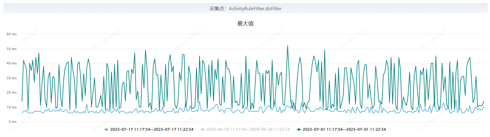
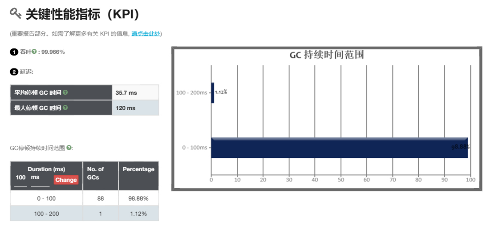
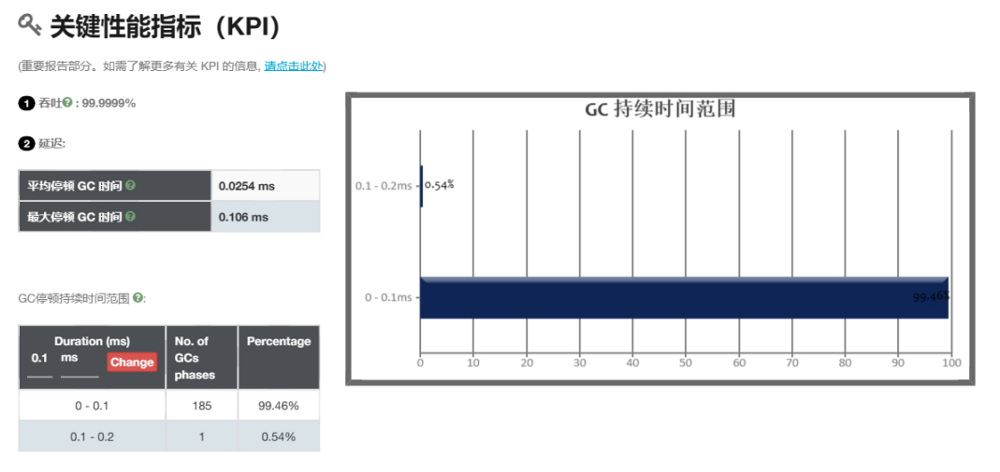
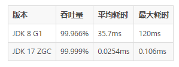
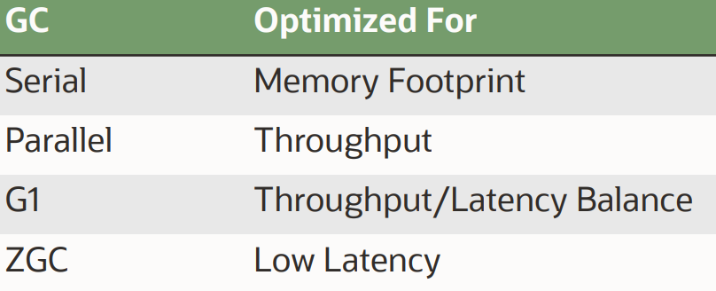
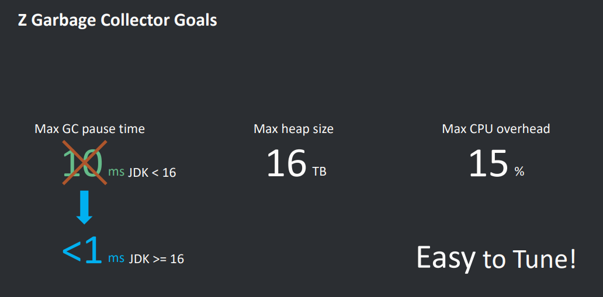
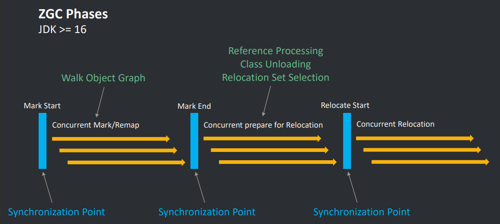

自 2014 年发布以来， JDK 8 一直都是相当热门的 JDK 版本。其原因就是对底层数据结构、JVM 性能以及开发体验做了重大升级，得到了开发人员的认可。但距离 JDK 8 发布已经过去了 9 年，那么这 9 年的时间，JDK 做了哪些升级？是否有新的重大特性值得我们尝试？能否解决一些我们现在苦恼的问题？带着这份疑问，我们进行了 JDK 版本的调研与尝试。

## 新特性一览

现如今的 JDK 发布节奏变快，每次新出一个版本，我们就会感叹一下：我还在用 JDK 8，现在都 JDK 9、10、11 …… 21 了？然后就会瞅瞅又多了哪些新特性。有一些新特性很香，但考虑一番还是决定放弃升级。主要原因除了新增特性对我们来说改变不大以外，最重要的就是 JDK 9 带来的模块化（JEP 200），导致我们升级十分困难。

模块化的本意是将 JDK 划分为一组模块，这些模块可以在编译时、构建时和运行时组合成各种配置，主要目标是使实现更容易扩展到小型设备，提高安全性和可维护性，并提高应用程序性能。但付出的代价非常大，最直观的影响就是，一些 JDK 内部类不能访问了。

但是除此之外，并没有太多阻塞升级的问题，后续版本都是一些很香的特性：

-   G1 （JEP 248、JEP 307、JEP 344、JEP 345、JEP 346），提供一个支持指定暂停时间、NUMA 感知内存分配的高性能垃圾回收器
-   ZGC （JEP 333、JEP 376、JEP 377），一个支持 NUMA，暂停时间不应超过 1ms 的垃圾回收器
-   并发 API 更新（JEP 266），提供 publish-subscribe 框架，支持响应式流发布 - 订阅框架的接口，以及 CompletableFuture 的进一步完善
-   集合工厂方法（JEP 269），类似 Guava，支持快速创建有初始元素的集合
-   新版 HTTP 客户端（JEP 321），一个现代化、支持异步、WebSocket、响应式流的 JDK 内置 API
-   空指针 NPE 直接给出异常方法位置（JEP 358），以前只给代码行数，不告诉哪个方法，一行多个方法的写法一但出现空指针，全靠程序员上下文分析推理
-   instanceof 的模式匹配（JEP 394），判断类型后再也不用强转了
-   数据记录类（JEP 395），一个标准的值聚合类，帮助程序员专注于对不可变数据进行建模，实现数据驱动
-   Switch 表达式语法改进（JEP 361），改变 Switch 又臭又长，易于出错的现状
-   文本块（JEP 378），支持二维文本块，而不是像现在一样通过 + 号自行拼接
-   密封类（JEP 409），提供一种限制进行扩展的语法，超类应该可以被广泛访问（因为它代表了用户的重要抽象），但不能广泛扩展（因为它的子类应该仅限于作者已知的子类）
-   以及一些未提到的底层数据结构优化，JVM 性能提升……

这么多的优点，恰好能解决我们当前遇到的一些问题，因此我们决定进行 JDK 升级。

## 升级

### 升级应用评估

首先自然是要考虑要将哪些应用进行升级。我们根据以下条件进行应用筛选：

1.  第一，也是最重要的一点，此系统可以通过升级，解决现有问题与瓶颈
2.  第二，有完备的机制能够进行快速回归与验证，如完备的单元测试，自动化测试覆盖能力，便捷的生产压测能力等，底层的升级一定要做好完备的验证
3.  第三，技术债务一定要少，不至于在升级过程中遇到一些必须解决的技术债，给升级增加难度
4.  第四，负责升级的人对这个系统都很了解，除核心业务逻辑外，还能够了解引入了哪些中间件与依赖，使用了中间件的哪些功能，中间件升级后，大量不兼容的改动是否对现有系统造成影响

最终我们选取了一个结算页、收银台展示无券支付营销的应用进行升级。此应用特点如下：

-   作为核心链路的应用之一，接口响应时间要求很高，GC 是其耗时抖动的瓶颈之一
-   业务正在进行快速迭代发展，随着降本增效策略的落地，营销策略进一步精细化，营销种类、数量、范围进一步增加，给系统性能带来更大的挑战
-   日常流量不低，整点存在突发流量，并且需要承接大促流量
-   核心链路覆盖了单元测试，测试环境具备自动化回归能力，预发、生产支持常态化压测与生产流量回放
-   非 Web 应用，仅使用各个中间件的基础功能，升级出现不兼容的问题小
-   维护了 3 年，经历过多次重构，历史问题较少，几乎没有技术债务

针对以上特点，此应用很适合进行 JDK 17 升级。此应用基于 JDK 8，SpringBoot 2.0.8，除常见外部基础组件外，还使用以下公司内部中间件：UMP、SGM、DUCC、CDS、JMQ、JSF、R2M。

### 升级效果

可以先看下我们升级后压测的效果：

纯计算代码不再受 GC 影响



  

升级前



升级后



升级后吞吐量几乎不受影响（甚至提升 **0.01%**），GC 平均耗时下降 **1405 倍**，GC 最大耗时下降 **1132 倍**

### 升级步骤

### 升级 JDK 编译版本

首先自然是修改 maven 中指定的 JDK 版本，可以先升级到 JDK 11，同时修改 maven 编译插件

```text
<java.version>11</java.version>
<maven-compiler-plugin.version>3.8.1</maven-compiler-plugin.version>  
<maven-source-plugin.version>3.2.1</maven-source-plugin.version>  
<maven-javadoc-plugin.version>3.3.2</maven-javadoc-plugin.version>  
<maven-surefire-plugin.version>2.22.2</maven-surefire-plugin.version>

<plugin>  
    <groupId>org.apache.maven.plugins</groupId>  
    <artifactId>maven-compiler-plugin</artifactId>  
    <version>${maven-compiler-plugin.version}</version>  
    <configuration>        
        <release>${java.version}</release>  
        <encoding>${project.build.sourceEncoding}</encoding>  
    </configuration>
</plugin>
```

### 引入缺少的依赖

然后就可以进行本地编译了，此时会暴露一些很简单的问题，比如找不到包、类等等。原因就是 JDK 11 移除了 Java EE and CORBA 的模块，需要手动引入。

```text
<!-- JAVAX -->  
<dependency>  
    <groupId>javax.annotation</groupId>  
    <artifactId>javax.annotation-api</artifactId>  
    <version>1.3.1</version>  
</dependency>  
<dependency>  
    <groupId>javax.xml.bind</groupId>  
    <artifactId>jaxb-api</artifactId>  
    <version>2.3.0</version>  
</dependency>  
<dependency>  
    <groupId>com.sun.xml.bind</groupId>  
    <artifactId>jaxb-impl</artifactId>  
    <version>2.3.0</version>  
</dependency>  
<dependency>  
    <groupId>com.sun.xml.bind</groupId>  
    <artifactId>jaxb-core</artifactId>  
    <version>2.3.0</version>  
</dependency>  
<dependency>  
    <groupId>javax.activation</groupId>  
    <artifactId>activation</artifactId>  
    <version>1.0.2</version>  
</dependency>
```

### 升级外部中间件

解决了编译找不到类的问题，接下来就该升级依赖的外部中间件了。对于我们的应用来说，也就是升级 SpringBoot 的版本。支持 JDK 17 的版本是 Spring 5.3，对应 SpringBoot 2.5。

在这里我建议升级至 SpringBoot 2.7，从 2.5 升级至 2.7 几乎没有需要改动的地方，同时高版本的 SprngBoot 所约定的依赖，对 JDK 17 的支持也更好。

建议进行大版本逐个升级，比如我们从 2.0 升级至 2.1。每升一个版本，就要仔细观察依赖版本的变化，掌握每个依赖升级的情况。SpringBoot 的升级其实意味着把所有开源组件约定版本进行大版本升级，接口弃用，破坏性兼容更新较多，需要一一鉴别。

下面以升级 Spring Boot 2.1 为例，说明我们升级的步骤：

1.  首先阅读 Spring Boot 2.1 做了哪些和我们有关的配置改动
2.  禁用了同 Bean 覆盖，开启需要指定 spring.main.allow-bean-definition-overriding 为 true
3.  然后阅读 Spring Boot 2.1 升级了哪些我们用到的依赖

\-Spring 升级至 5.1

\--首先阅读 Spring 5.1 做了哪些和我们有关的配置改动：无影响

\--然后阅读 Spring 5.1 升级了哪些我们用到的依赖

ASM 7.0：同理，阅读升级影响（这种底层依赖的底层依赖，如果仅 ASM 在使用，则无需关心）

CGLIB 3.2：同理，阅读升级影响（这种底层依赖的底层依赖，如果仅 ASM 在使用，则无需关心）

\--最后阅读 Spring 5.1 弃用了哪些和我们有关的配置与依赖：无影响

\-Lombok 升级至 1.18

阅读改动影响，1.18 Lombok 默认情况下将不再生成私有无参构造函数。可以通过在 lombok.config 配置文件中设置 lombok.noArgsConstructor.extraPrivate=true 来启用它

\-Hibernate 升级至 5.3：阅读改动影响，对我们项目无影响

\-JUnit 升级至 5.2：阅读改动影响，需要 Surefire 插件升级至 2.21.0 及以上

4\. 最后阅读 Spring Boot 2.1 弃用了哪些和我们有关的配置与依赖

至此，Spring Boot 2.1 升级完毕。接下来分析一次依赖树变化，和升级前的依赖树进行比较，查看依赖变化范围是否全部已知可控。完成后进行 Spring Boot 2.2 的升级。

以下为我们需要注意的升级事项，仅供参考：

-   可以先升级到 JDK 11，一边启动一边验证。但不要在 JDK 11 使用 ZGC，ZGC 的堆预留与可用堆的比例太大，有时会导致 OOM
-   代码中存在同 Bean，启动时 Springboot 2.0 会自动进行覆盖，高版本开启覆盖，需要指定 spring.main.allow-bean-definition-overriding 为 true
-   Spring Boot 2.2 默认的单元测试 Junit 升级至 5，Junit 4 的单元测试建议进行升级，改动不大
-   Spring Boot 2.4 不再支持 Junit 4 的单元测试，如果需要可以手动引入 Vintage 引擎
-   Spring Boot 2.4 配置文件处理逻辑变更，注意阅读更新日志
-   Spring Boot 2.6 默认禁用 Bean 循环依赖，可以通过将 spring.main.allow-circular-references 设置为 true 开启
-   Spring Boot 2.7 自动配置注册文件变更，spring.factories 中的内容需要移动至 META-INF/spring/org.springframework.boot.autoconfigure.AutoConfiguration.imports 文件下
-   spring-boot-properties-migrator 可以识别弃用的属性，可以考虑使用
-   Spring Framework 5.2 需要 Jackson 2.9.7+，注意阅读更新日志
-   Spring Framework 5.2 注解检索算法重构，所有自定义注释都必须使用 @Retention(RetentionPolicy.RUNTIME) 进行注释，以便 Spring 能够找到它们
-   Spring Framework 5.3 修改了很多东西，但都与我们的应用无关，请关注更新日志
-   ASM 仅单元测试 Mock 在使用，无需特殊关注，做好 JUnit 升级兼容即可
-   CGLIB 大版本升级以兼容字节码版本为主，关注好变更日志即可
-   Lombok 即使是小版本升级，也会有破坏性更新，需要仔细阅读每个版本的更新日志，建议少用 Lombok
-   Hibernate 没有太大的破坏性更新，关注好变更日志即可
-   JUnit 升级主要关注大版本变更，如 4 升 5，小版本没有特别大的破坏性更新，并且是单元测试使用的依赖，可以放心升级或者不升级
-   Jackson 2.11，对 java.util.Date 和 java.util.Calendar 默认格式进行了更改，注意查看更新日志进行兼容
-   注意字节码增强相关依赖的升级
-   注意本地缓存升级
-   注意 Netty 升级，关注更新日志

### 升级内部中间件

内部中间件升级较为简单，主要是关注 JMQ、JSF 版本。其中 JSF 依赖的 Netty 和 Javassist 等都需要升级，Netty 版本较低会有内存泄漏问题。

### 我们使用的依赖版本

给大家参考下我们升级后的依赖版本

```text
<properties>  
    <!-- 基础组件版本 Start -->    
    <java.version>17</java.version>  
    <project.build.sourceEncoding>UTF-8</project.build.sourceEncoding>  
    <maven-compiler-plugin.version>3.11.0</maven-compiler-plugin.version>  
    <maven-surefire-plugin.version>2.22.2</maven-surefire-plugin.version>  
    <jacoco-maven-plugin-version>0.8.10</jacoco-maven-plugin-version>  
    <maven-assembly-plugin-version>2.4.1</maven-assembly-plugin-version>  
    <maven-dependency-plugin-version>3.1.0</maven-dependency-plugin-version>  
    <profiles.dir>src/main/profiles</profiles.dir>  
    <springboot-version>2.7.13</springboot-version>  
    <log4j2.version>2.18.0-jdsec.rc2</log4j2.version>  
    <hibernate-validator.version>5.2.4.Final</hibernate-validator.version>  
    <collections-version>3.2.2</collections-version>  
    <collections4.version>4.4</collections4.version>  
    <netty.old.version>3.9.0.Final</netty.old.version>  
    <netty.version>4.1.36.Final</netty.version>  
    <javassist-version>3.29.2-GA</javassist-version>  
    <guava.version>23.0</guava.version>  
    <mysql-connector-java.version>5.1.29</mysql-connector-java.version>  
    <jmh-version>1.36</jmh-version>  
    <caffeine-version>3.1.6</caffeine-version>  
    <fastjson-version>1.2.83-jdsec.rc1</fastjson-version>  
    <fastjson2-version>2.0.35</fastjson2-version>  
    <roaringBitmap.version>0.9.44</roaringBitmap.version>  
    <disruptor.version>3.4.4</disruptor.version>  
    <jaxb-impl.version>2.3.8</jaxb-impl.version>  
    <jaxb-core.version>2.3.0.1</jaxb-core.version>  
    <activation.version>1.1.1</activation.version>  
    <!-- 基础组件版本 End -->  

    <!-- 京东中间件版本 Start -->    
    <ump-version>20221231.1</ump-version>  
    <ducc.version>1.0.20</ducc.version>  
    <jdcds-driver-alg-version>2.21.1</jdcds-driver-alg-version>  
    <jdcds-driver-version>3.8.3</jdcds-driver-version>  
    <jmq.version>2.3.3-RC2</jmq.version>  
    <jsf.version>1.7.6-HOTFIX-T2</jsf.version>  
    <r2m.version>3.3.4</r2m.version>  
    <!-- 京东中间件版本 End -->  
    </properties>
```

### JVM 启动参数升级

远程 DEBUG 参数有所变化：

```text
JAVA_DEBUG_OPTS=" -agentlib:jdwp=transport=dt_socket,server=y,suspend=n,address=*:8000 "
```

打印 GC 日志参数的变化，我们在预发环境开启了日志进行观察：

```text
JAVA_GC_LOG_OPTS=" -Xlog:gc*:file=/export/logs/gc.log:time,tid,tags:filecount=10:filesize=10m "
```

使用了 ZGC 的部分 JVM 参数：

```text
JAVA_MEM_OPTS=" -server -Xmx12g -Xms12g -XX:MaxMetaspaceSize=256m -XX:MetaspaceSize=256m -XX:MaxDirectMemorySize=2048m -XX:+UseZGC -XX:ZAllocationSpikeTolerance=3 -XX:ParallelGCThreads=8 -XX:CICompilerCount=3 -XX:-RestrictContended -XX:+AlwaysPreTouch -XX:+ExplicitGCInvokesConcurrent -XX:+HeapDumpOnOutOfMemoryError -XX:HeapDumpPath=/export/logs "
```

内部依赖需要访问 JDK 模块，如 UMP、JSF、虫洞、MyBatis、DUCC、R2M、SGM：

```text
if [[ "$JAVA_VERSION" -ge 11 ]]; then  
  SGM_OPTS="${SGM_OPTS} --add-opens jdk.management/com.sun.management.internal=ALL-UNNAMED --add-opens java.management/sun.management=ALL-UNNAMED --add-opens java.management/java.lang.management=ALL-UNNAMED "  UMP_OPT=" --add-opens java.base/sun.net.util=ALL-UNNAMED " 
  JSF_OPTS=" --add-opens java.base/sun.util.calendar=ALL-UNNAMED --add-opens java.base/java.util=ALL-UNNAMED --add-opens java.base/java.math=ALL-UNNAMED"  
  WORMHOLE_OPT=" --add-opens java.base/sun.security.action=ALL-UNNAMED "  
  MB_OPTS=" --add-opens java.base/java.lang=ALL-UNNAMED "  
  DUC_OPT=" --add-opens java.base/java.net=ALL-UNNAMED "  
  R2M_OPT=" --add-opens java.base/java.time=ALL-UNNAMED "  
fi
```

启动后完整的启动参数如下：

```text
-javaagent:/export/package/sgm-probe-java/sgm-probe-5.9.5-product/sgm-agent-5.9.5.jar -Dsgm.server.address=http://sgm.jdfin.local -Dsgm.app.name=market-reduction-center -Dsgm.agent.sink.http.connection.requestTimeout=2000 -Dsgm.agent.sink.http.connection.connectTimeout=2000 -Dsgm.agent.sink.http.minAlive=1 -Dsgm.agent.virgo.address=10.24.216.198:8999,10.223.182.52:8999,10.25.217.95:8999 -Dsgm.agent.zone=m6 -Dsgm.agent.group=m6-discount -Dsgm.agent.tenant=jdjr -Dsgm.deployment.platform=jdt-jdos --add-opens=jdk.management/com.sun.management.internal=ALL-UNNAMED --add-opens=java.management/sun.management=ALL-UNNAMED --add-opens=java.management/java.lang.management=ALL-UNNAMED -DJDOS_DATACENTER=JXQ -Ddeploy.app.name=jdos_kj_market-reduction-center -Ddeploy.app.id=30005051 -Ddeploy.instance.id=0 -Ddeploy.instance.name=server -Djava.awt.headless=true -Djava.net.preferIPv4Stack=true -Djava.util.Arrays.useLegacyMergeSort=true -Dog4j2.contextSelector=org.apache.logging.log4j.core.async.AsyncLoggerContextSelector -Dlog4j2.AsyncQueueFullPolicy=Discard -Xmx12g -Xms12g -XX:MaxMetaspaceSize=256m -XX:MetaspaceSize=256m -XX:MaxDirectMemorySize=2048m -XX:+UseZGC -XX:ZAllocationSpikeTolerance=3 -XX:ParallelGCThreads=8 -XX:CICompilerCount=3 -XX:-RestrictContended -XX:+AlwaysPreTouch -XX:+ExplicitGCInvokesConcurrent -XX:+HeapDumpOnOutOfMemoryError -XX:HeapDumpPath=/export/logs --add-opens=java.base/sun.net.util=ALL-UNNAMED --add-opens=java.base/sun.util.calendar=ALL-UNNAMED --add-opens=java.base/java.util=ALL-UNNAMED --add-opens=java.base/java.math=ALL-UNNAMED --add-opens=java.base/sun.security.action=ALL-UNNAMED --add-opens=java.base/java.lang=ALL-UNNAMED --add-opens=java.base/java.net=ALL-UNNAMED --add-opens=java.base/java.time=ALL-UNNAMED -Dloader.path=/export/package/jdos_kj_market-reduction-center/conf
```

### 系统验证

系统可以成功启动后，就可以进行功能验证。有几个验证重点与方法：

-   首先可以通过单元测试快速进行系统全面回归，避免出现 JDK API、中间件 API 变更导致的业务异常
-   部署到测试环境，验证各个中间件是否正常，如 DUCC 开关下发，MQ 收发，JSF 接口调用等等，系统中所有用到的中间件都需要一一验证
-   然后可以开始进行核心业务的验证，这时候可以利用测试同学的测试自动化能力加人工补充场景，快速进行核心业务回归。其中研发需要观察系统被调用时的所有异常日志，包括警告，明确每条日志产生的原因
-   验证完成后，可以部署到联调环境，利用外部同事联调时的请求进一步进行验证
-   充分在测试环境观察后，部署至预发环境，利用外部同事联调时的请求进一步进行验证，并进行常态化压测，验证优化效果与瓶颈
-   经过预发长时间验证，没有问题后，部署一台生产，通过回放生产流量进一步进行验证
-   回放流量无异常后，开始承接生产流量，按接口开量，进行若干周的观察
-   逐步切量，直到全量上线

## GC 调优

### ZGC 介绍



如图所示，ZGC 的定位是一个最大暂停时间小于 1ms，且能够处理大小从 8MB 到 16TB 的堆，并且易于调优的垃圾回收器。ZGC 只有三个 STW 阶段，具体流程网上有大量类似文章，这里不做详细介绍。

### 优化方向

目前我们的应用日常使用 G1 约 30ms 的 GC 停顿时间，不到 1 分钟就会触发一次，大促时频率更高，暂停时间更长，导致接口性能波动较大。随着业务发展，为了优化系统我们大量应用了本地缓存，导致存活对象较多。ZGC 暂停时间不随堆、活动集或根集大小而增加，且极低的 GC 时间正是我们需要的特性，因此决定使用 ZGC。

ZGC 作为一个现代化 GC，没有必要做过多的优化，默认配置已经可以解决 99.9% 的场景。但是我们的应用会承接大促流量，根据观察，瞬时流量激增时 GC 时机较晚，因此应对突发流量是我们 ZGC 调优的一个目标，其他属性不做任何调整。

### 优化措施

ZGC 的一个优化措施就是足够大的堆，一般来说，给 ZGC 的内存越多越好，但我们也没必要浪费，通过压测观察 GC 日志，取得一个合适的值即可。我们只要保证：

1.  堆可以容纳应用程序产生的实时垃圾
2.  堆中有足够的空间，以便在 GC 运行时，为新的垃圾分配提供空间

因此，我们将机器升级成 8C 16G 配置，观察 GC 日志根据应用情况调整内存占用配置，最终设定为 -Xmx12g -Xms12g -XX:MaxMetaspaceSize=256m -XX:MetaspaceSize=256m -XX:MaxDirectMemorySize=2048m，提升 ZGC 的效果。

剩下的其他优化措施则视情况而定，可以调整触发 GC 的时机，也可以改为基于固定时间间隔触发 GC。

我们略微提升了触发时机，-XX:ZAllocationSpikeTolerance=3（默认为 2）应对突发流量。

CICompilerCount ParallelGCThreads 一个是提升 JIT 编译速度，一个是垃圾收集器并行阶段使用的线程数，根据实际情况略微增加，牺牲一点点 CPU 使用率，提升下效率。

另外还可以开启 Large Pages 进一步提升性能。这一步我们没有做，因为现在部署方式为一台物理机 Docker 混部署。开启需要修改内核，影响宿主机的其他镜像。

## 总结

至此，调优完成，目前我们已在线上跑了一个多月，每周都有三次常态化压测，一切正常。

以上升级心得分享给大家，希望对各位有所帮助。

> 作者：京东科技 张天赐  
> 来源：京东云开发者社区