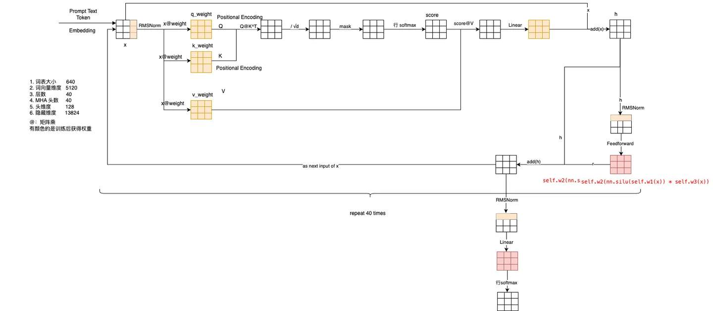
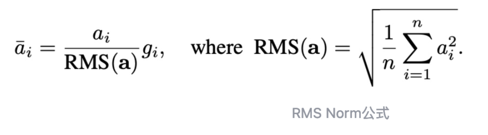
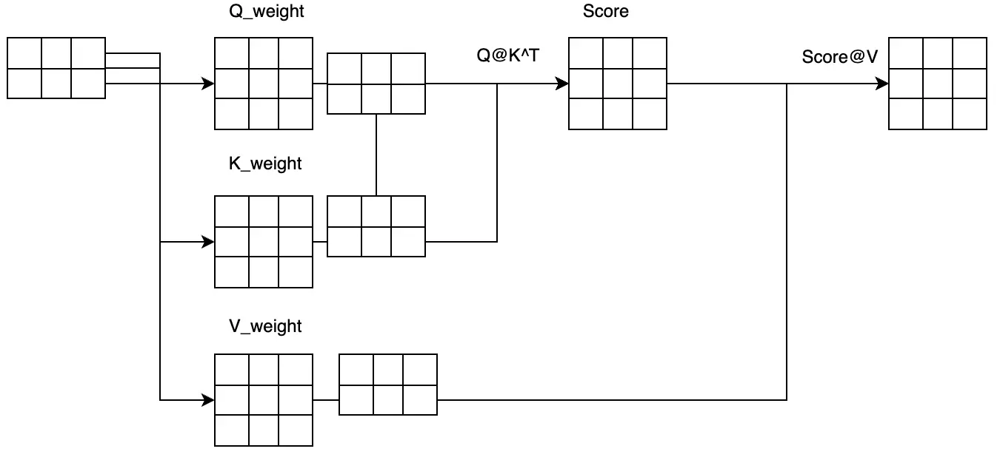
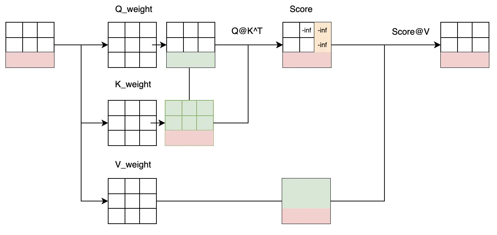
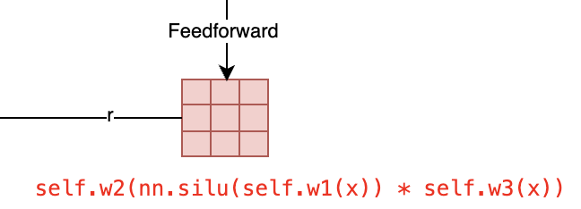

一文教会你大语言模型开源入门方案，还有精通方向的指南。想真的入手大模型，一定要看这个回答。

**唯一推荐模型是 LLaMA2，唯二推荐模型是 RWKV 。**

我们学习开源模型的目标应该是很清晰的，通过开源模型的理解，快速的了解所有大模型的知识，为自己以后的科研与工作有一个好的知识准备嘛。如果是这样的要求，那你需要的就是

-   前沿：其实能经过大规模数据验证的大模型除了 LLaMA1/2 以外，好像没有几个真的是全规模开源的。
-   生态全：这方面 LLaMA 好像有无比大的优势，在所有的开源生态里，只有这个模型的支持是最好的。
-   上手方便：生态好，自然有无数人支持使用它了。自然上手方便，最重要的是它的体验版 lama.cpp 是不需要 GPU 的。
-   扩展容易：考虑到 LLaMA 的普及性，可能大部分人都会在这上面做些自己想搞的东西吧。扩展或者说优化我们看到很多东西，最典型的就是FlashAttention 了，它已经成为标准件了。
-   上限高：在 LLM 的世界里，好像 LLaMA 的未来是无限的，Meta 的那个扎克伯格已经放话了，LLaMA3已经在路上了，而且会开放哦，你说它的前行准备 LLaMA2 它不香吗？

好了，现在详细讲解一下 LLaMA2-13B的结构。

llama2 的结构是像下面的图！

从这个图上看，llama2 还是精典的 Transformer 的 Decoder 结构，没有什么大的变化。

计算 Attention：(softmax(Q@K^T)/sqrtd)))@V

再做一个 FeedForward

重复多次后，送到一个 Linear 得到输出就可以了。

### 输入：

这里需要注意的是 Embedding 这一块并没有在说明里，因为它是另一个模型的工作。

输入在“x”这一块主要是一个 RMSNorm 的计算，下面是公式。

这个计算是在每一次的 Attention 的输入计算都会使用到的。

### Attention 计算：

attention 的核心计算方法是：(softmax(Q@K^T)/sqrtd)))@V 所以你看到的就是上面的连续多个矩阵乘法。

核心就是 “Q@K^T” 与 “score@V ” 这差不多是计算量相当大的一部分了。

最后这个计算结果再经过一个 Linear 映射，就能用于 FFN 的计算了。

但是要注意的一点儿是，因为这里的计算有极大的算力消耗，所以这儿是优化的重点，KV 缓存、 FlashAttention 也是重点优化这个计算空间。

### KV 缓存说明

为什么可以只用 K 、 V 的 Cache？我们用最简单的 QKV 计算分析一下它的矩阵变化。

如果第一次计算是这样的

那么我们分析第二次计算，增加的用颜色表示了。

如果你对矩阵运算比较熟悉，你就能知道，最后变化的部分，其实只与加了颜色的部分有关系 。而 Q 的内容是完全根据新的内容计算出来的，K与 V 是要借助原来的淡青色颜色部分。所以，有一个KV 的缓存是非常有效的减少计算量的方式。

而 Mask 这事吧，也是 Score 的计算处理的，所以这块是一个非常好的减少计算量的优化方式。

如果你真的是一个有志于 LLM 方向的，你看 LLM 其实就是一个非常系统性的东西，同时涉及到的东西又非常多。想入门大语言模型，我真的推荐你来试试这节《程序员的AI大模型进阶之旅》公开课，非常有意思的 AI 大模型的介绍性入门课程，给你大语言模型（LLM） 的核心原理、模型架构。以及LangChain、Fine-tune技术，带你全程体验体验微调过程，还提供免费的CPU环境做实验！

趁着现在免费，建议你一定来听听：

**添加微信助手，还能领上课用到的资料，和一些好用的AI工具。对于学习大模型来讲非常有用的！**

### FFN

FeedForward Network这个计算真的是一个完全算力密集的工作，将 Attention 的结果做一个 ResnetBlock 后，然后会有一个 RMSNorm 的计算，它就能进入全网络算力与参数最多的一块了。

你看，这里实际上是三个巨大无比的矩阵乘法。

所以如果你想优化它，稀疏啊、量化啊或者什么更好的计算矩阵的方式，都是这儿的了。

综合一下看，LLaMA 本身的结构并不复杂，但是计算这事吧，难点就是大量的并行计算，也就是为什么 CPU 不行 GPU 行，GPU 不行专用的 NPU 更行的原因了。

再介绍一下 RWKV，这是国人一个非常优秀的团队完成的工作。它在 mamba 之前就完成了 RNN相关的研究，并且得到了一个非常好的资源，完成了工业级 T级的 Token 的训练，效果极好，资源要求相对很低，所以加油哦。