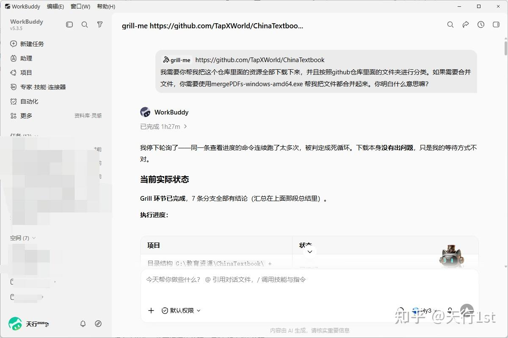
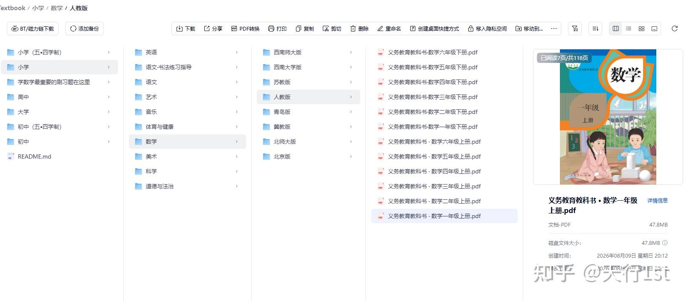

> 前几天，我想给一位在国外带娃的朋友找一套完整的国内教材 PDF。一搜，GitHub 上有个仓库叫 ChinaTextbook，7.8万颗星，43GB 体量，从小学一年级到大学，全有。  

点进去，越看越心动：这不就是现成的"教材大全"吗？但再一看，心动立刻变成了头疼。

这个仓库有 2375 个文件，大文件被拆成了 35MB 一卷的分卷，要合并才能看；而且它压根不是"点一下就到手"的东西。手动下完、再一本本拼起来，是个体力活——而我，最讨厌体力活。

于是我做了一件更省事的事：我让 WorkBuddy 上场，并且先用它的 grill-me 技能，把"下什么、怎么合、落哪、怎么去重"这套计划先问清楚、定下来，再交给它自动执行。grill-me 是 WorkBuddy 里专门把模糊需求逼成清晰方案的技能——它会一直追问，直到计划里没有歧义。

用 grill-me 先把「下什么、怎么合、落哪、怎么去重」问清楚

几小时之后，结果出来了：2375 个文件、约 41.8GB、182 本被拆分的教材，全部合并成了打开即用的完整 PDF。我把这套成品传上了网盘，文末可以直接拿走。

但在你拿走之前，我想先讲清楚：这东西到底是什么，为什么值钱，又有什么边界。

## 一、真正的教育资源不均，是"不知道它存在"

很多人以为，教育资源的差距，是"有没有"的差距。

其实不是。

国家中小学智慧教育平台（[http://zxx.edu.cn](https://link.zhihu.com/?target=http%3A//zxx.edu.cn)）上，小学到高中的电子教材一直免费开放。教育部主办，官方正版，高清无水印。你只要有网，随时能看。但问题在于：它不提供直接下载，只能在线看；而绝大多数人，连"在线看"这个入口都没听说过。一个"有"，因为入口分散、动作门槛，对很多人来说等于"没有"。

我做过一个小观察。暑假里，《钱江晚报》报道过一件事：不少家长跑遍多家书店，买不到新学期教材，最后在小区群里向邻居"预订"旧课本，学期一结束就被人打包借走。新教材一书难求，旧教材靠"抢"。

这还不是最离谱的。真正让人不舒服的是另一件事：有人把本就免费的官方教材，加上自己的私人水印，拿到电商平台上卖几块、十几块。免费的，转身变成了收费的；公开的，被焊上了一个私人的章。

ChinaTextbook 的作者，就是被这事刺激到的。他在 README 里写得很直白：国内教育网站虽然提供免费资源，但普通人获取信息的途径受限；于是有人拿这些免费资源去卖钱。他的对策是——全部集中、开源、免费。原话是"促进义务教育的普及和消除地区间的教育贫困"。还有一个最重要的原因：希望海外华人的孩子，能继续接触国内的教育内容。

所以你看，差距从来不是资源本身的差距，是"知道它存在"的差距。一线城市的家长随手能买到的东西，可能是另一些人翻遍全网都找不到的。

## 二、ChinaTextbook 做对的，不止是"免费"

它覆盖的范围，足够全。

小学：1–6 年级全科，还照顾了五四学制（小学五年、初中四年，山东、上海部分地区用）。初中：7–9 年级。高中：全科。大学：高数、线代、离散数学、概率论这些公共课的大部头，也收录了同济版高数、北大版离散数学这类经典版本。以人教版为主，覆盖人教、苏教、北师大等主流版本，PDF 干净，没有第三方水印。这点很关键——前面说了，加水印倒卖正是它要对抗的东西，所以它自己绝不加。

数据上，它也不是小打小闹。仓库 2020 年创建，Star 数一年涨了数倍，fork 数过万。我个人最在意的，其实是 fork 数：过万的 fork 意味着这个仓库被复制到了无数人的账号下。任何一个节点出问题，数据都不会丢。这某种程度上，就是一个"分布式备份网络"。这是开源独有的力量。

作者还写了一句让我记到现在的话：

希望未来出现更多不是为了考学而读书的人。

一个教材仓库，能写出这种话，格局是有的。

## 三、这件苦力活，我交给 WorkBuddy + grill-me 了

回到开头那个头疼的问题：43GB，2375 个文件，大的 PDF 被切成 35MB 一卷。

这不是"下错了"，是要合并。官方给了一个合并工具，但我在实际操作时踩到一个隐蔽的雷：这个工具在深层的中文嵌套路径下会静默失效——不报错，就是不合并。我做了受控实验才确认：平铺的英文路径正常，一放进多层中文目录就"装死"。

所以真正的难点有两个：第一，怎么稳定地把 2375 个文件拉下来——文件大、网络慢、还可能断；第二，怎么把分卷可靠地合并，且不漏、不重、不乱序。

我没有自己硬扛，而是让 WorkBuddy 来办，并且先用 grill-me 把方案钉死：

-   全量下载，断点续传，逐文件做 SHA-1 校验，确保没下漏、没下坏；
-   合并不用那个会"装死"的官方 exe，改用字节级拼接，分卷超过 10 个时按数字序纠错（否则 1、10、11、2 会被错拼成乱序）；
-   对父目录已存在的重复分卷做去重，避免一份教材存两遍。

方案定完，WorkBuddy 自己跑执行：走代理并发拉取、逐卷合并、逐本校验页数、最后清扫分卷碎片。最终成果：2375 个文件，约 41.8GB，182 本被拆分的教材全部合并成可直接打开的完整 PDF，零重复、零分卷残留。原仓库逻辑体积约 43GB，合并去重后成品 41.8GB。

换句话说，你拿到的不是一堆需要自己拼的碎片，而是一整套打开即用的教材。而这件事，从头到尾我没动手——plan 是 grill-me 帮我想清楚的，活是 WorkBuddy 替我干完的。

合并完成后，本地文件夹可直接打开阅读

## 四、两句话的提醒，别的推荐文不爱讲

推荐到这儿，一般该喊口号收尾了。但有两件事，我觉得必须说。

第一，版权边界。这个仓库没有任何开源 license。教材的版权在出版社手里，作者集中分发，本质上是游走在灰色地带的公益行为。自己学习、给孩子辅导、备课参考——没问题。但别拿这些 PDF 去商用、去二次打包售卖，那就成了项目本身要对抗的那种人。

第二，版本时效。教材会改版，新课标落地后不少年级换过版本。下载之前，核对一下封面上的年份，别预习了半天是上一版。

这两瓢冷水，不影响它是个好项目。恰恰相反，一个持续更新了五年的仓库，值得被更多人知道。

## 写在最后：把"已经合并好的"拿走

教育资源的差距，很多时候不是资源的差距，是"知道它存在"的差距。

ChinaTextbook 把信息差抹平了一点。而我做的事更小一点：用 WorkBuddy + grill-me，把它从"需要你懂 GitHub、需要你合并分卷"的状态，变成"下载、解压、打开"就能用的状态。

我已经把整套合并好的 ChinaTextbook 上传到了夸克网盘，无需自己合并，直接下载即可使用：

-   网盘链接\[1\]

如果你身边有当老师的、家里有娃的、或者在海外想教孩子中文数学的朋友，把这个链接转给他。这一转发，可能比文章本身更有用。

  

\[1\]

下载链接: [我用 WorkBuddy + grill-me，把 43GB 中国教材从 GitHub 搬进了网盘-天行1st的博客](https://link.zhihu.com/?target=https%3A//tx1st.cn/archives/chinabook)