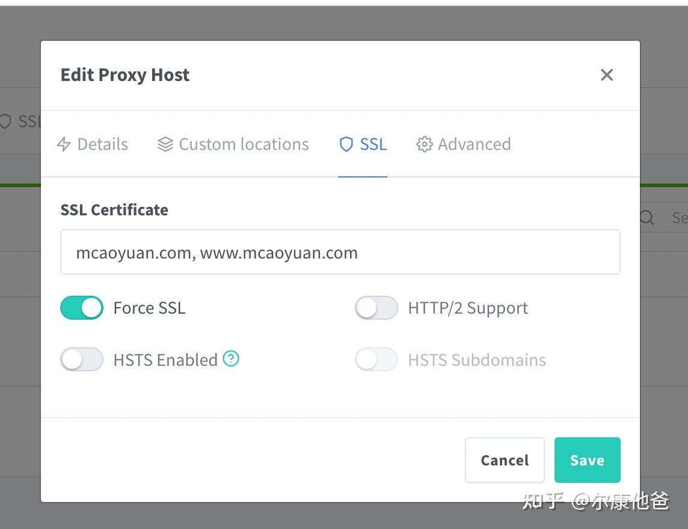

开吧，很简单也不花钱的。

首先你的反向代理一般都是nginx吧，建议直接安一个 Nginx Proxy Manager

然后一键打开ssl就可以了，他会自动申请免费的ssl证书 开启https

  

  

我用很久了 很稳定，而且过期了会自动申请新的

[https://www.mcaoyuan.com/](https://link.zhihu.com/?target=https%3A//www.mcaoyuan.com/)