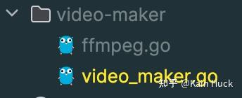
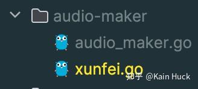

疫情那段时间的B站，每次打开B站时都会刷到一位名叫“卧龙寺”的UP主发的视频，其以惊人的频率发布视频，几乎每个人都会刷到卧龙寺的视频，由此大家也称B站为卧龙寺APP；很显然这个卧龙寺不是一个真人UP而是一个无情的搬运机器人，这篇文章将教你如何用golang实现一个类似卧龙寺的账号。

文章中的所有代码我放在了这里

[https://github.com/kainhuck/video-delivery](https://link.zhihu.com/?target=https%3A//github.com/kainhuck/video-delivery)

注：文章中的代码并不全面以仓库中的代码为准

## 1\. FBI Warning!

-   该项目仅供学习娱乐
-   B站正在严厉打击机器人营销号，大家适可而止，过火容易被封号

## 2\. 设计我们的项目架构

整个流程无非是**爬虫**爬取内容，而后上传B站，这两大步，这里我们来挑战一下更有难度的搬运，比起卧龙寺的视频搬运，我接下来要介绍的是文章的搬运，具体流程为：1. 爬取文字内容；2. 文字转语音；3. 语音和图片合成视频；4. 视频上传B站。由此可知我们的项目将主要分成四大部分：

-   第一层：爬虫获取内容
-   第二层：文字转语音
-   第三层：合成视频
-   第四层：上传B站

接下来我将**从底往上**一层层的实现。在此之前先初始化一个新的工作目录。

## 3\. 实现视频上传B站

我们选用别人分装好的B站API SDK来实现这一功能，这里我们选用的库为：

-   [GitHub - kainhuck/bilibili-go: 简单好用的 bilibili golang sdk 支持视频分P投稿](https://link.zhihu.com/?target=https%3A//github.com/kainhuck/bilibili-go)

具体实现如下:

1.  我们先在工作目录下创建一个新目录：**deliverer**
2.  然后分别新建两个新文件：**bilibili.go，deliverer.go**


而后在deliverer.go中定义我们投放视频的接口（这么做是为了后续拓展其他渠道比如抖音）

```go
package deliverer

/*
	deliverer
	视频投放
*/

type Deliverer interface {
	// Delivery 视频投放
	Delivery(videoFile string, cover string, title string, desc string, custom ...interface{}) error
}
```

然后在bilibili.go中实现这个接口用以投放视频到B站

```go
package deliverer

import (
	bilibili_go "github.com/kainhuck/bilibili-go"
	"log"
)

type Bilibili struct {
	client *bilibili_go.Client
	path   string
}

func NewBilibili(path string) Deliverer {
	client := bilibili_go.NewClient(bilibili_go.WithAuthStorage(bilibili_go.NewFileAuthStorage("bilibili.hyk.json")))
	client.LoginWithQrCode()

	return &Bilibili{
		client: client,
		path:   path,
	}
}

func (b *Bilibili) Delivery(videoFile string, cover string, title string, desc string, custom ...interface{}) error {
	if err := b.client.RefreshAuthInfo(); err != nil {
		return err
	}

	// 1. 上传视频
	video, err := b.client.UploadVideoFromDisk(videoFile)
	if err != nil {
		return err
	}
	log.Println("视频上传成功")

	// 2. 上传封面
	cover_, err := b.client.UploadCoverFromDisk(cover)
	if err != nil {
		return err
	}
	log.Println("封面上传成功")

	copyright := 1
	source := ""
	if len(custom) > 0 {
		copyright = 2
		source = custom[0].(string)
	}

	// 3. 投稿
	result, err := b.client.SubmitVideo(&bilibili_go.SubmitRequest{
		Cover:     cover_.Url,
		Title:     title,
		Copyright: copyright,
		Source:    source,
		TID:       37, // 分区ID
		Tag:       "下饭视频,摸鱼音频,蹲坑视频", // 视频标逗号分割
		Desc:      desc,
		Recreate:  -1,
		Videos: []*bilibili_go.SubmitVideo{
			video,
		},
		NoReprint: 1,
		WebOS:     2,
	})
	if err != nil {
		return err
	}
	log.Printf("投稿成功 ️AV号: %v, BV号: %v\n", result.Aid, result.Bvid)

	return nil
}
```

到这里我们就完成了B站上传部分，如果配合一个爬取视频的爬虫即可工作，但是我们这篇文章是想搬运文字内容，所以继续看下面的操作。

## 4\. 实现合成视频

我们采用ffmpeg来实现图片和音频的合成（当然你也可以使用视频和音频合成，只是参数不同罢了），所以我们需要提前在我们的电脑上安装ffmpeg，这一过程不详细介绍了，可以自行谷歌或者问一问chatgpt。

*注意这里的图片长宽必须是偶数否则会合成失败！！！*

具体实现如下:

1.  我们先在工作目录下创建一个新目录：**video-maker**
2.  然后分别新建两个新文件：**ffmpeg.go，video\_maker.go**



而后在video\_maker.go中定义我们合成视频的接口（这么做是为了后续拓展其他合成视频的方法）

```go
package video_maker

/*
	ffmpeg
	语音图片合成视频
*/

type VideoMaker interface {
	// MergeImageAudio 将图片，音频合成视频
	MergeImageAudio(imageFile, audioFile string) (videoFile string, err error)
}
```

而后在ffmpeg.go中实现上面的接口用于将图片和音频合成视频

```go
package video_maker

import (
	"fmt"
	"os"
	"os/exec"
	"path/filepath"
	"strings"
	"video-delivery/utils"
)

type Ffmpeg struct {
	path string
}

func (f *Ffmpeg) MergeImageAudio(imageFile, audioFile string) (videoFile string, err error) {
	videoFile = filepath.Join(f.path, "video", utils.TrimFilename(audioFile)+".mp4")

	if utils.ExistFile(videoFile) {
		fmt.Printf("视频文件：%v，已经存在\n", videoFile)
		return videoFile, nil
	}

	duration, err := getMediaDuration(audioFile)
	if err != nil {
		return "", err
	}

	cmd := exec.Command("ffmpeg", "-loop", "1", "-i", imageFile, "-i", audioFile, "-c:v", "libx264", "-t", fmt.Sprintf("%.2f", duration), "-pix_fmt", "yuv420p", videoFile)
	cmd.Stderr = os.Stderr

	if err := cmd.Run(); err != nil {
		_ = os.RemoveAll(videoFile)
		return "", err
	}

	return videoFile, nil
}

// 获取媒体文件的时长（以秒为单位）
func getMediaDuration(filename string) (float64, error) {
	cmd := exec.Command("ffprobe", "-v", "error", "-show_entries", "format=duration", "-of", "default=noprint_wrappers=1:nokey=1", filename)
	output, err := cmd.Output()
	if err != nil {
		return 0, err
	}

	durationStr := strings.TrimSpace(string(output))
	duration := 0.0
	fmt.Sscanf(durationStr, "%f", &duration)

	return duration, nil
}
```

至此我们已经可以合成视频了，那么接下来我们来完成第二层：文字转语音

## 5\. 实现文字转语音

文字转语音的方案很多，本文使用的是讯飞的长文本语音合成服务（免费10w字），需提前开通，地址：[https://console.xfyun.cn/services/long\_text](https://link.zhihu.com/?target=https%3A//console.xfyun.cn/services/long_text)；然后获取三个关键参数：appid，apisecret，apikey；并将其配置成环境变量：XUNFEI\_APPID，XUNFEI\_APIKSECRET，XUNFEI\_APIKEY。

具体实现如下：

1.  我们先在工作目录下创建一个新目录：**audio-maker**
2.  然后分别新建两个新文件：**xunfei.go，audio\_maker.go**



而后在audio\_maker.go中定义我们文字转语音的接口（这么做是为了后续拓展其他方案）

```go
package audio_maker

/*
	tts
	文本转语音
*/

type AudioMaker interface {
	// CovertTextToAudio 文字转语音
	CovertTextToAudio(textFile string) (audioFile string, err error)
}
```

而后在xunfei.go中实现上面的接口用于将文字转语音

```go
package audio_maker

import (
	"bytes"
	"crypto/hmac"
	"crypto/sha256"
	"encoding/base64"
	"encoding/json"
	"fmt"
	"io"
	"net/http"
	"net/url"
	"os"
	"path/filepath"
	"time"
	"video-delivery/utils"
)

type Xunfei struct {
	path      string
	appId     string
	apiSecret string
	apiKey    string
}

func NewXunfei(path string, appId string, apiSecret string, apiKey string) AudioMaker {
	return &Xunfei{
		path:      path,
		appId:     appId,
		apiSecret: apiSecret,
		apiKey:    apiKey,
	}
}

func (x *Xunfei) CovertTextToAudio(textFile string) (audioFile string, err error) {
	audioFile = filepath.Join(x.path, "audio", utils.TrimFilename(textFile)+".mp3")

	if utils.ExistFile(audioFile) {
		fmt.Printf("音频: %v 已经存在\n", audioFile)
		return audioFile, nil
	}

	content, err := os.ReadFile(textFile)
	if err != nil {
		return "", err
	}

	taskId, err := x.createJobZh(X4LingxiaoqiAssist, string(content))
	if err != nil {
		return "", err
	}

	uri, err := x.getJobResultUrl(taskId)
	if err != nil {
		return "", err
	}

	if err := saveFileFromUrl(uri, audioFile); err != nil {
		return "", err
	}

	return audioFile, nil
}

// 接口签名
func (x *Xunfei) signUri(uri string) string {
	u, _ := url.Parse(uri)
	gmt := time.FixedZone("GMT", 0)
	timeFormat := time.Now().In(gmt).Format(time.RFC1123)

	signatureOrigin := "host: api-dx.xf-yun.com\n"
	signatureOrigin += "date: " + timeFormat + "\n"
	signatureOrigin += "POST " + u.Path + " HTTP/1.1"
	signature := hmacSha256Base64(signatureOrigin, x.apiSecret)
	authorizationOrigin := fmt.Sprintf(`api_key="%s", algorithm="hmac-sha256", headers="host date request-line", signature="%s"`, x.apiKey, signature)
	authorization := base64.StdEncoding.EncodeToString([]byte(authorizationOrigin))

	return fmt.Sprintf("%s?host=api-dx.xf-yun.com&date=%s&authorization=%s", uri, url.QueryEscape(timeFormat), authorization)
}

func hmacSha256Base64(signatureOrigin, apiSecret string) string {
	apiSecretBytes := []byte(apiSecret)
	signatureOriginBytes := []byte(signatureOrigin)

	// Create an HMAC-SHA256 hasher
	hmacSha256 := hmac.New(sha256.New, apiSecretBytes)

	// Write the signature origin bytes to the hasher
	hmacSha256.Write(signatureOriginBytes)

	// Calculate the HMAC-SHA256 digest
	signatureSha := hmacSha256.Sum(nil)

	// Encode the digest as base64 and convert it to a string
	encodedSignature := base64.StdEncoding.EncodeToString(signatureSha)

	return encodedSignature
}

type VCN string

const (
	X4Pengfei          VCN = "x4_pengfei"           // 男声 较年轻
	X4Yeting           VCN = "x4_yeting"            // 女声 较年轻
	X4Qianxue          VCN = "x4_qianxue"           // 女声 较成熟
	X4Guanshan         VCN = "x4_guanshan"          // 男声 较成熟
	X4LingxiaoqiAssist VCN = "x4_lingxiaoqi_assist" // 女声 较年轻
)

type Header struct {
	AppID  string `json:"app_id"`
	TaskID string `json:"task_id,omitempty"`
}

type Audio struct {
	Encoding   string `json:"encoding"`
	SampleRate int    `json:"sample_rate"`
}

type Pybuf struct {
	Encoding string `json:"encoding"`
	Compress string `json:"compress"`
	Format   string `json:"format"`
}

type Dts struct {
	Vcn      VCN    `json:"vcn"`
	Language string `json:"language"`
	Speed    int    `json:"speed"`
	Volume   int    `json:"volume"`
	Pitch    int    `json:"pitch"`
	Rhy      int    `json:"rhy"`
	Audio    *Audio `json:"audio"`
	Pybuf    *Pybuf `json:"pybuf"`
}

type Parameter struct {
	Dts *Dts `json:"dts"`
}

type Text struct {
	Encoding string `json:"encoding"`
	Compress string `json:"compress"`
	Format   string `json:"format"`
	Text     string `json:"text"`
}

type Payload struct {
	Text *Text `json:"text"`
}

type CreateJobReq struct {
	Header    *Header    `json:"header"`
	Parameter *Parameter `json:"parameter"`
	Payload   *Payload   `json:"payload"`
}

type QueryJobReq struct {
	Header *Header `json:"header"`
}

type Response struct {
	Header struct {
		Code       int    `json:"code"`
		Message    string `json:"message"`
		Sid        string `json:"sid"`
		TaskId     string `json:"task_id"`
		TaskStatus string `json:"task_status"` // 1-任务创建成功 2-任务派发失败 4-结果处理中 5-结果处理完成（包含成功/失败）
	} `json:"header"`
	Payload struct {
		Audio struct {
			Audio      string `json:"audio"`
			BitDepth   string `json:"bit_depth"`
			Channels   string `json:"channels"`
			Encoding   string `json:"encoding"`
			SampleRate string `json:"sample_rate"`
		} `json:"audio"`
		Pybuf struct {
			Encoding string `json:"encoding"`
			Text     string `json:"text"`
		} `json:"pybuf"`
	} `json:"payload"`
}

const (
	CreateJobUrl = "https://api-dx.xf-yun.com/v1/private/dts_create"
	QueryJobUrl  = "https://api-dx.xf-yun.com/v1/private/dts_query"
)

func (x *Xunfei) createJob(req *CreateJobReq) (*Response, error) {
	bts, _ := json.Marshal(req)

	request, err := http.NewRequest(http.MethodPost, x.signUri(CreateJobUrl), bytes.NewBuffer(bts))
	if err != nil {
		return nil, err
	}
	request.Header.Set("Content-Type", "application/json")
	resp, err := http.DefaultClient.Do(request)
	if err != nil {
		return nil, err
	}
	defer resp.Body.Close()

	bts, err = io.ReadAll(resp.Body)
	if err != nil {
		return nil, err
	}

	var result Response
	err = json.Unmarshal(bts, &result)

	return &result, err
}

func (x *Xunfei) createJobZh(vcn VCN, text string) (string, error) {
	result, err := x.createJob(&CreateJobReq{
		Header: &Header{AppID: x.appId},
		Parameter: &Parameter{Dts: &Dts{
			Vcn:      vcn,
			Language: "zh",
			Speed:    50,
			Volume:   50,
			Pitch:    50,
			Rhy:      1,
			Audio: &Audio{
				Encoding:   "lame",
				SampleRate: 16000,
			},
			Pybuf: &Pybuf{
				Encoding: "utf8",
				Compress: "raw",
				Format:   "plain",
			},
		}},
		Payload: &Payload{Text: &Text{
			Encoding: "utf8",
			Compress: "raw",
			Format:   "plain",
			Text:     base64.StdEncoding.EncodeToString([]byte(text)),
		}},
	})

	if err != nil {
		return "", err
	}
	if result.Header.Code != 0 {
		return "", fmt.Errorf(result.Header.Message)
	}

	return result.Header.TaskId, nil
}

func (x *Xunfei) queryJob(req *QueryJobReq) (*Response, error) {
	bts, _ := json.Marshal(req)

	request, err := http.NewRequest(http.MethodPost, x.signUri(QueryJobUrl), bytes.NewBuffer(bts))
	if err != nil {
		return nil, err
	}
	request.Header.Set("Content-Type", "application/json")
	resp, err := http.DefaultClient.Do(request)
	if err != nil {
		return nil, err
	}
	defer resp.Body.Close()

	bts, err = io.ReadAll(resp.Body)
	if err != nil {
		return nil, err
	}

	var result Response
	err = json.Unmarshal(bts, &result)

	return &result, err
}

func (x *Xunfei) getJobResultUrl(taskId string) (string, error) {
	for {
		result, err := x.queryJob(&QueryJobReq{Header: &Header{
			AppID:  x.appId,
			TaskID: taskId,
		}})
		if err != nil {
			return "", err
		}

		if result.Header.Code != 0 {
			return "", fmt.Errorf(result.Header.Message)
		}

		if result.Header.TaskStatus == "2" {
			return "", fmt.Errorf("任务派发失败")
		}

		if result.Header.TaskStatus == "5" {
			uri, err := base64.StdEncoding.DecodeString(result.Payload.Audio.Audio)
			if err != nil {
				return "", err
			}
			return string(uri), nil
		}

		time.Sleep(1 * time.Second)
	}
}

func saveFileFromUrl(uri, filename string) error {
	resp, err := http.Get(uri)
	if err != nil {
		return err
	}
	defer resp.Body.Close()

	f, err := os.Create(filename)
	if err != nil {
		return err
	}
	defer f.Close()

	_, err = io.Copy(f, resp.Body)

	return err
}
```

至此我们的后期工作均已完成，只剩第一步的爬虫

## 6\. 实现内容爬虫

为什么我会把这一步放最后实现呢，因为这一步太开放了，每个用户可以根据自己的需求来实现自己的爬虫，你甚至可以直接爬取视频来跳过第二三步来直接投放视频（比如配合youtube-dl来实现油管视频搬运）。在这里我将演示对凤凰网的爬虫demo：[测试文章](https://link.zhihu.com/?target=https%3A//ishare.ifeng.com/c/s/v002hnzwsL7vczhgOo--OnY9PgcOhHcDJzn4R3Xrc6TtG7DM__)

具体实现如下：

1.  我们先在工作目录下创建一个新目录：clamber
2.  然后分别新建两个新文件：**clamber.go，ifeng.com.go**


而后在clamber.go中定义我们的爬虫接口（这么做是为了后续拓展其他方案）

```go
package clamber

/*
	clamber
	从指定网址爬取文章和封面存储到data/article和data/image
*/

type Clamber interface {
	Crawl(uri string) (title string, articleFile string, imageFile string, err error)
}
```

而后在ifeng.com.go中实现上面的接口用于爬取文章内容

```go
package clamber

import (
	"github.com/PuerkitoBio/goquery"
	"io"
	"net/http"
	"os"
	"path/filepath"
	"strings"
)

type Ifeng struct {
	path string
}

func NewIfeng(path string) Clamber {
	return &Ifeng{path: path}
}

func (i Ifeng) Crawl(uri string) (title string, articleFile string, imageFile string, err error) {
	resp, err := http.Get(uri)
	if err != nil {
		return "", "", "", err
	}
	defer resp.Body.Close()

	doc, err := goquery.NewDocumentFromReader(resp.Body)
	if err != nil {
		return "", "", "", err
	}

	articleContent := make([]string, 0)

	doc.Find("#articleBox p").Each(func(i int, selection *goquery.Selection) {
		articleContent = append(articleContent, selection.Text())
	})

	img := ""
	doc.Find("div#articleBox>img").Each(func(i int, selection *goquery.Selection) {
		img, _ = selection.Attr("src")
	})

	doc.Find("h2[class^=index_title_]").Each(func(index int, selection *goquery.Selection) {
		title = selection.Text()
	})

	articleFile = filepath.Join(i.path, "article", title) + ".txt"

	// 保存文本
	article, err := os.Create(articleFile)
	if err != nil {
		return "", "", "", err
	}
	if _, err := article.WriteString(strings.Join(articleContent, "\n")); err != nil {
		return "", "", "", err
	}

	// 保存图片
	if !strings.HasPrefix(img, "http") {
		img = "https:" + img
	}
	resp, err = http.Get(img)
	if err != nil {
		return "", "", "", err
	}
	defer resp.Body.Close()
	imageFile = filepath.Join(i.path, "image", title) + ".jpg"

	image, err := os.Create(imageFile)
	if err != nil {
		return "", "", "", err
	}
	_, err = io.Copy(image, resp.Body)
	if err != nil {
		return "", "", "", err
	}

	return title, articleFile, imageFile, nil
}
```

至此我们完成我们项目的整体开发

## 7\. 结尾

我们在main.go中来运行试试看吧

```go
package main

import (
	"fmt"
	"log"
	"os"
	audio_maker "video-delivery/audio-maker"
	"video-delivery/clamber"
	"video-delivery/deliverer"
	video_maker "video-delivery/video-maker"
)

func main() {
	base := "data"
	source := "https://ishare.ifeng.com/c/s/v002hnzwsL7vczhgOo--OnY9PgcOhHcDJzn4R3Xrc6TtG7DM__"

	// 1. 抓取图片
	fmt.Println("开始内容爬取")
	clamber := clamber.NewIfeng(base)
	title, articleFile, imageFile, err := clamber.Crawl(source)
	if err != nil {
		log.Fatal(err)
	}
	fmt.Printf("内容爬取完成，标题：%v，文章: %v, 图片: %v\n", title, articleFile, imageFile)

	// 2. 文字转语音
	fmt.Println("开始文字转语音")
	audioMaker := audio_maker.NewXunfei(base, os.Getenv("XUNFEI_APPID"), os.Getenv("XUNFEI_APISECRET"), os.Getenv("XUNFEI_APIKEY"))
	audioFile, err := audioMaker.CovertTextToAudio(articleFile)
	if err != nil {
		log.Fatal(err)
	}
	fmt.Printf("文字转语音完成，语音: %v\n", audioFile)

	// 3. 合成视频
	imageFile = "data/image/img.png"
	fmt.Println("开始合成视频")
	videoMaker := video_maker.NewVideoMaker(base)
	videoFile, err := videoMaker.MergeImageAudio(imageFile, audioFile)
	if err != nil {
		log.Fatal(err)
	}
	fmt.Printf("合成视频完成，视频: %v\n", videoFile)

	// 4. 投放视频
	fmt.Println("开始视频投放")
	deliverer := deliverer.NewBilibili(base)
	if err := deliverer.Delivery(videoFile, imageFile, title, "-", source); err != nil {
		log.Fatal(err)
	}
	fmt.Println("视频投放成功")
}
```