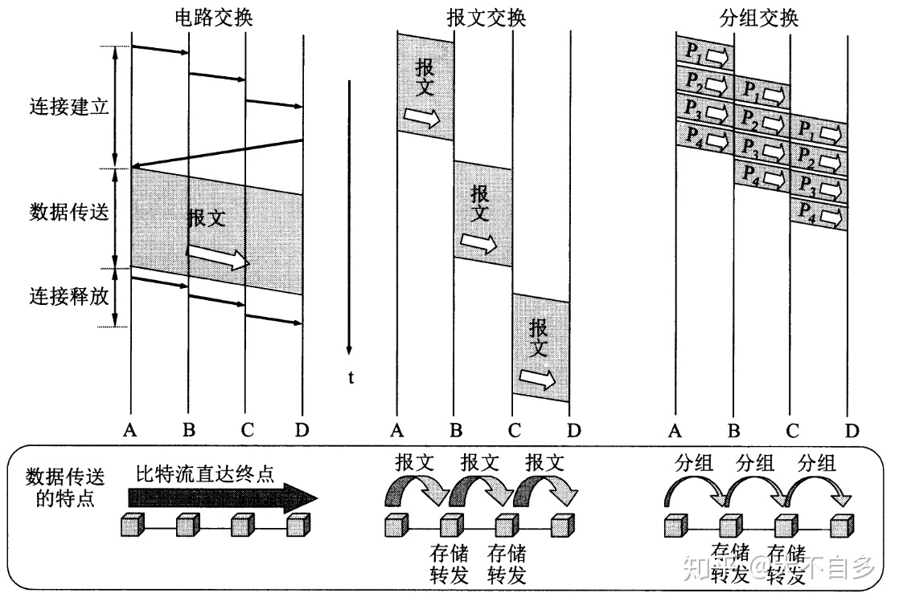
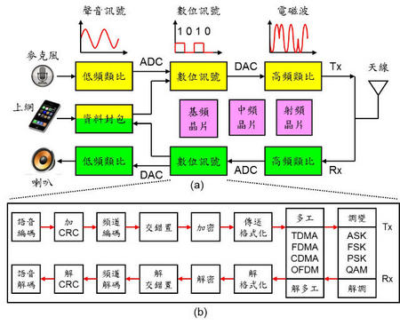
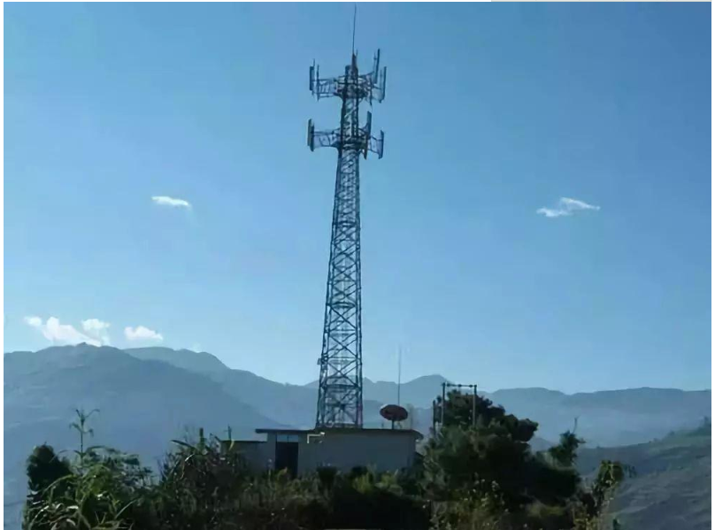
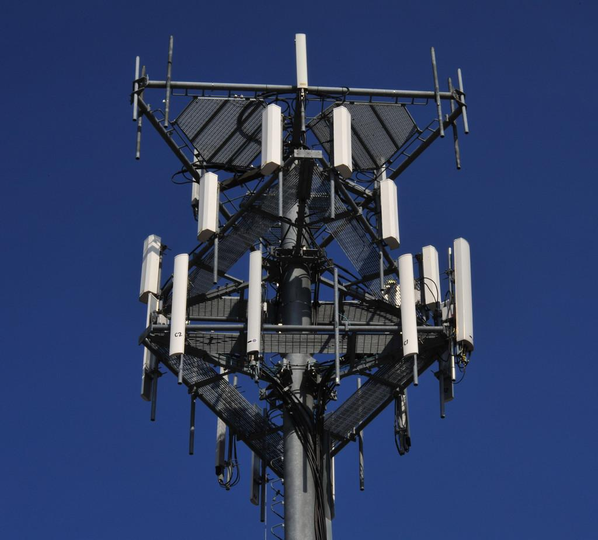
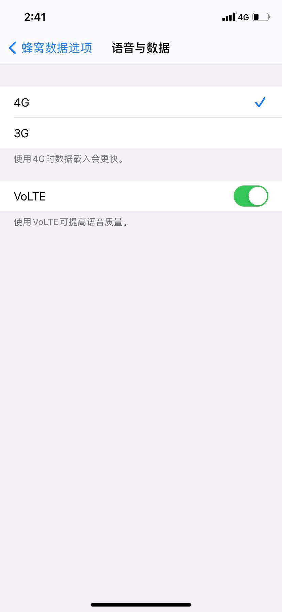

-   **首先介绍他们的相同的地方。**

无论是打电话、发短信还是上网，通信的大致设备过程是一样的，为：**手机——基站——核心网**——基站——手机。

虽然信息都“走”的一样的设备，但是不同的业务由不同的“分管部门”负责。原因是技术原理是不同的，他们不能走同一套设备。

-   **现在介绍他们的不同**

1.  **通信原理不同，源于他们的业务本质的不同。**

（1）打电话属于语音业务；该业务可以有一定程度的失真但实时性要求非常高；【打电话一定是实时的，要不然双方打电话可费老劲了】

（2）上网流量属于数据业务；该业务的特点是对时延没有严格的要求，但需要进行无差错的传输。【网页刷出来可以慢一些，但是不能乱码，要不然看个啥？】

**2\. 业务本质的不同决定了采用的技术是不同的。**

打电话——电路交换；上网流量——分组交换。两个技术的示意图，如下图所示

电路交换的特点：先建立连接，然后语音数据进行实时传送，传送完成后，就断开连接。【打电话的过程晓得伐？】

分组交换的特点：面向无连接的存储转发技术。先把整个数据划分为几个小段，在每一段数据之前都添加选址和校验功能的头部字段，再通过网络进行一段段的转发至目标地址。

分组交换比电路交换的电路利用率高，但是时延较大。

**3\. 在手机、核心网里面，不同的业务是怎么顺利完成的呢？**

**手机中：**

  

打电话：a. 我们对着麦克风讲话，这时形成的是语音模拟信号；b. 通过 ADC(数模转换器)将语音信号改变成数字信号；c. 然后通过基带芯片，将数字信号进行编码....等一系列操作后；d. 再通过中频芯片，将信号形成高频模拟信号；e. 最终通过射频芯片、天线，将高频电信号发射出去。

上网：因为上网的数据都是数字信号，因此不需要通过模数转换阶段。余下过程与打电话过程类似。

**基站：**信号从手机发出后，将会被附近的基站所接收。我理解的基站的作用类同于动物的触角或者是人类的手脚。基站用来接收手机的无线信号，类似于手或者触角触碰到外界的事物。

是不是以为高高的铁塔就是基站？

其实，是铁塔上面挂的白白的盒子才是基站！

这些“白白的盒子”用来接收无线射频信号。在基站信号塔下面或者附近还有一个房子，这个房子里面放的是基站控制器。

**基站控制器**主要负责的是无线资源的管理。一方面，通过lu接口与核心网相连；另一方面，负责管理和控制基站，负责手机与基站以何种方式(协议)进行连接。具有承上启下的关键地位。

也就是说在基站阶段，打电话和流量上网并没什么区别。

**核心网：PS域和CS域**

核心网类同于人类的大脑，“懂思考”，核心网用来处理所有核心的业务。

简单来说，一般情况下，语音业务和数据业务是分管于不同的域，语音业务对应的是电路域(Circuit Switched Domain)，数据业务对应的是分组域(Packet Switched Domain)。

在2G时代，核心网主要是电路域，因此那个时候手机几乎只用来打电话；而到了3G时代，除了电路域有了很大的提升外，分组域也有了巨大的发展，因此手机除了打电话之外，还可以上网聊天，看视频等。

而到了4G时代，电路域几乎没有什么变化，而分组域却急剧发展，因此手机内的终端业务极大的丰富起来，短视频、语音视频聊天等流量业务充斥着人们的生活。

在IP时代到来的情况下，电路域的作用逐渐弱化，科学家们一直想完成基于IP的语音业务实现。

手机中“设置”中的“蜂窝网络”指的就是移动通信。“蜂窝数据选项”包括两部分“数据”和“语音”，意思就是流量上网和打电话。

从上图可以看出，**数据**分为两个选项：3G和4G。上网的时候你可以选择3G或者4G网，当然4G网会更快一些，出现上网卡顿的现象概率小，同时使用的流量也就会多，产生的资费也随之增加。

**语音**只有一个VoLTE选项开关。打开状态时，打电话走的是4G网络中的语音功能；而关闭状态时，则是走的2G/3G核心网电路域网络，此时打电话的时候，是不能接收流量消息的（这就是为什么有些手机，在打电话的时候不能接收微信消息的原因）。但是如果电话走的是VoLTE，那么电话和上网则是同时可以进行的。