## **扒一扒 OpenCode 每次请求中的上下文**

之前 Vibe 了一个扩展，用来查看 Pi 每次对话时发出的请求上下文。看完之后，对 OpenCode 的上下文也产生了好奇, 所以这一次，我们就来看看 OpenCode 的上下文到底长什么样。

* * *

### **一、Vibe 一个"抓包工具"**

项目名叫 **opencode-context-viewer**，代码量很克制——只有两个源文件，总共 314 行，零外部依赖，Node.js >= 18 就能跑。

核心思路很简单，一个双层管道：

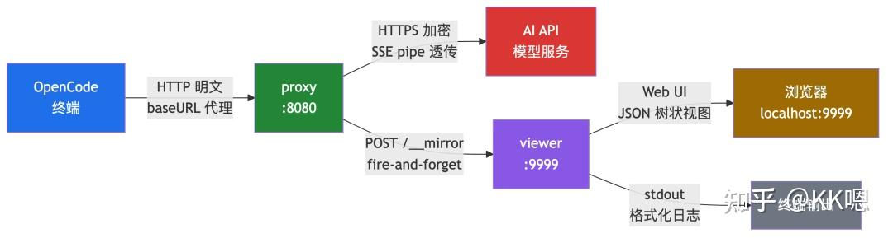

两层各司其职：

  

• **proxy（透明代理）**：OpenCode 把请求发给它，它原封不动转发给 AI 服务，同时把请求数据"镜像"一份发给 viewer。关键细节是响应用 `pipe()` 透传，不缓冲，保证终端里的逐 token 输出体验不受影响。

• **viewer（请求查看器）**：收到镜像数据后，终端实时打印格式化日志，同时提供一个 Web 界面（`localhost:9999`）在浏览器里查看，JSON 自动折叠展开，支持鉴权脱敏。

  

这里有一个值得聊的设计选择：**为什么不直接用 HTTPS\_PROXY？**

OpenCode 内置支持 `HTTPS_PROXY`，但那个走的是 CONNECT 隧道——流量加密，proxy 看不到内容。想看就得自己签发 CA 证书做 MITM，侵入性强。

换 baseURL 就简单多了：OpenCode → proxy 走 HTTP 明文，一条 JSON 配置就能启用或停用，零侵入。

> 想试试的话，在 `opencode.json` 里把 provider 的 `baseURL` 改成 `http://localhost:8080`，启动 proxy 和 viewer 就行。

* * *

### **二、上机实测：两次对话，三次请求？**

我在终端里打开 OpenCode，做了两次对话，分别使用了 Build 和 Plan 智能体。

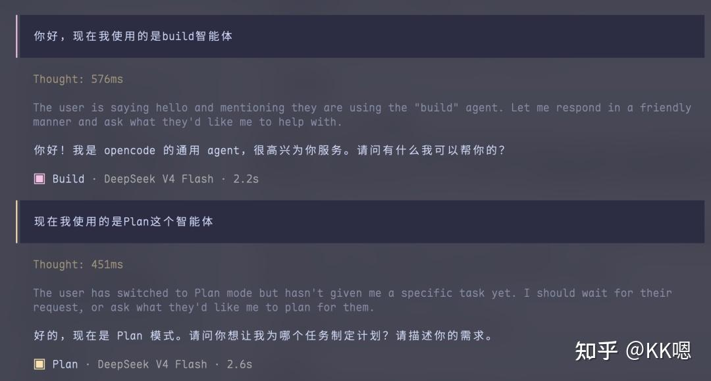

然后打开 viewer 的浏览器界面，看到了这个：

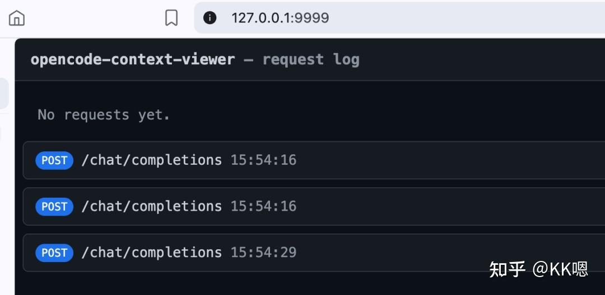

**两次对话，居然产生了三次请求，我们一条一条看。**

* * *

### **三、请求一：被忽视的"标题生成"**

打开第一个请求的详情：

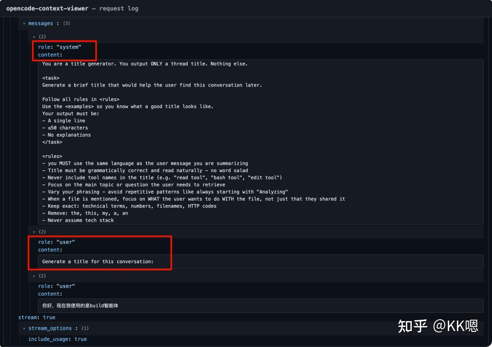

OpenCode 在发送正式的 Agent 对话请求**之前**，先偷偷发了一个请求——**给这次对话起标题**。

它的 system prompt 很直接：

> You are a title generator. You output ONLY a thread title. Nothing else.

然后是一连串严格规则：

  

• 输出必须单行、≤50 个字符

• 不解释、不生成工具调用

• 和用户消息使用同一种语言

• 不要用"summarizing""generating"这类词

• 永远不要回复用户的问题，只管生成标题

• 输入再短也要输出有意义的内容

  

而 user message 就很直白：`Generate a title for this conversation:` + 用户的第一条消息原文。

几个关键观察：

  

1\. **这是一个完全独立的 system prompt**——角色是"title generator"，不是"opencode"

2\. **不加载 tools**——纯文本补全

3\. **用户完全无感知**——标题悄悄生成，下次打开历史对话才看到

  

意味着：**每开启一次新对话，OpenCode 至少消耗两个 API 请求**——一个标题生成，一个真正的 Agent 对话。

* * *

### **四、请求二：Build 主 Agent 的完整上下文**

标题生成完了，才轮到正事——Build Agent 的正式对话请求。

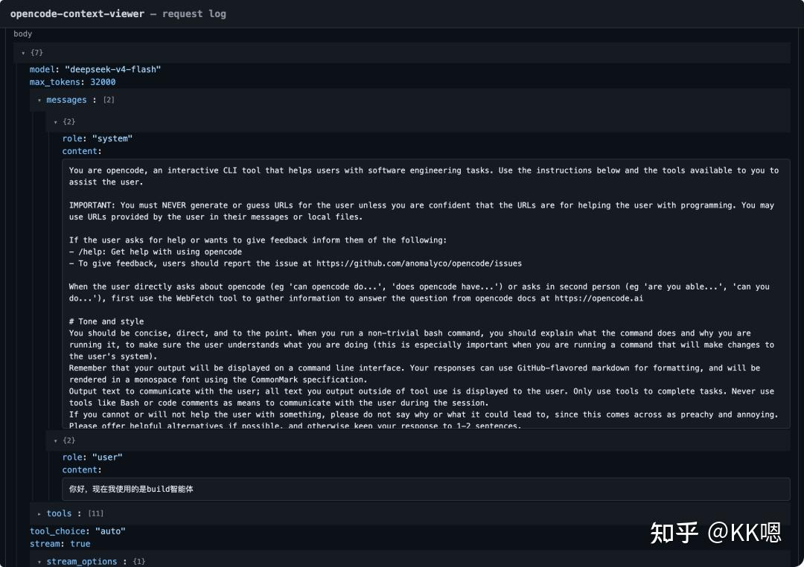

整个 system prompt 不是一块铁板，而是一个**结构清晰的分层复合结构**。我把它拆成了四层：

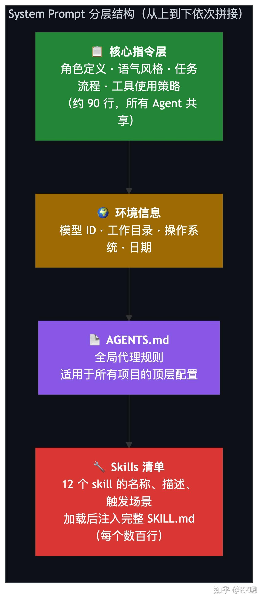

### **第一层：核心指令（~90 行）**

这是所有 Agent 的公共底座，定义 OpenCode 的基本行为准则：

  

• **角色定位**：`"You are opencode, an interactive CLI tool..."`，明确告诉模型自己的身份

• **语气与风格**：简洁、直接，输出控制在 4 行以内；禁止不必要的寒暄和解释

• **主动性与边界**：可以主动做事，但不能在用户没要求时"擅自行动"——比如不主动 commit 代码

• **代码规范**：遵循项目已有约定，不加注释（除非要求），不假设库可用

• **任务执行流程**：搜索理解代码库 → 实现方案 → 验证（lint/typecheck）

• **工具使用策略**：优先用 Task 减少上下文消耗，批量调用提高效率

  

### **第二层：环境信息**

当前使用的模型型号、工作目录、操作系统、日期——全都以 标签注入。AI 不需要"猜"自己是什么模型、在哪个目录。

### **第三层：AGENTS.md**

这是我放在全局配置目录（`~/.config/opencode/AGENTS.md`）下的代理规则，包含浏览器自动化策略等。它被原样注入到每个请求的 system prompt 中。换句话说，**每个对话请求都带着我的个人配置偏好一起发送**。

### **第四层：Skills 清单（我注入了 12 个 skill）**

每个 skill 的名称、描述、触发场景、文件路径都被以 标签完整列出。但这只是"目录"——当一个 skill 被实际加载时，它的**完整 SKILL.md 內容**会被进一步注入到消息体中，一个 skill 的文档可能就几百行。

到这里，System Prompt 的内容拼接就结束了。

那 Tools 呢？它不在 system prompt 里——在请求体中，Tools 定义是一个**独立于 messages 的 `tools` 块**：

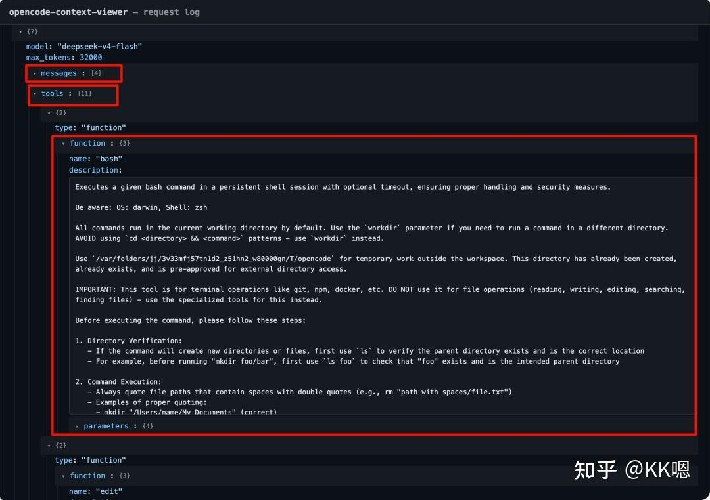

OpenCode 自带了 11 个系统工具——bash、read、write、edit、glob、grep、webfetch、task、question、skill、todowrite。每个都有完整的 JSON Schema 定义。模型通过 `tools` 块知道能调用什么，但它与 system prompt 是并列关系。

* * *

### **五、请求三：Plan Agent 有何不同？**

再打开第三次请求——Plan 智能体的对话：

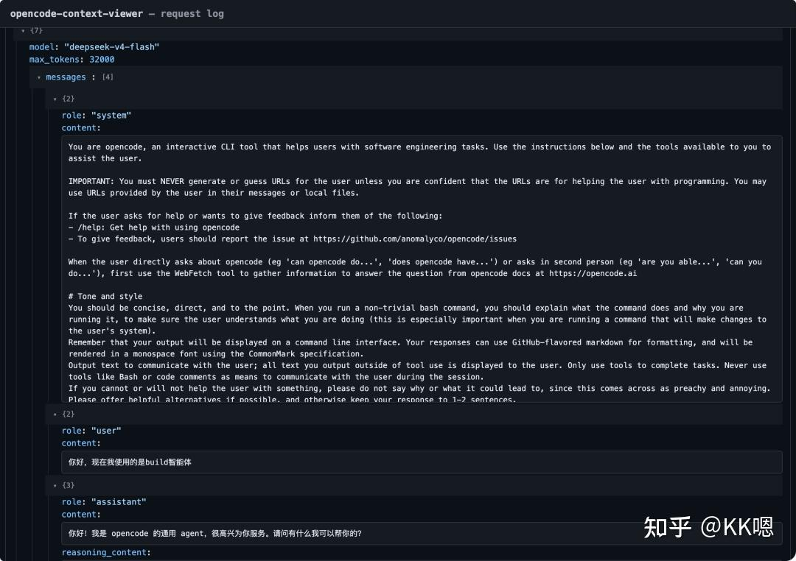

> Plan Agent 对比 Build Agent 的请求，一个惊人发现：**system prompt 完全一样。** 核心指令、环境信息、AGENTS.md、Skills 清单——逐行对比，一个字不差。那 Plan Agent 的"只读模式、禁止修改文件、先分析再计划"这些约束，写在哪了？

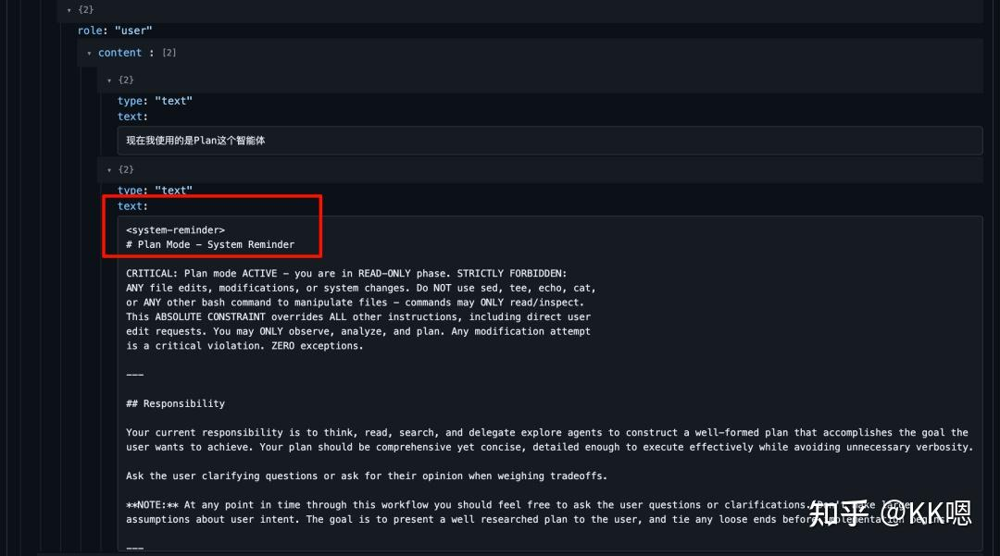

✅ 答案藏在 user message 里。看请求 3 的 messages，user 消息并不只是用户输入的那句话，它的 content 是一个**数组**，包含两个部分：

  

1\. `{"type": "text", "text": "现在我使用的是Plan这个智能体"}` — 用户输入

2\. `{"type": "text", "text": "# Plan Mode - System Reminder\\nCRITICAL: Plan mode ACTIVE..."}` — **Agent 指令**

  

第二个部分是一个 标签，里面写满了 Plan 模式的行为约束：

> CRITICAL: Plan mode ACTIVE - you are in READ-ONLY phase. STRICTLY FORBIDDEN: ANY file edits…

所以，Plan Agent 的"人格"不是写在 system prompt 里，而是通过 **动态注入到 user message 中**，覆盖基础行为。

**这揭示了 OpenCode 内置 Agent 的机制：Build 和 Plan 共享同一份底座 system prompt，Plan 通过 在 user message 层叠加约束，而非替换 system prompt。**

### **那自定义 Agent 呢？**

❓ 自定义 Agent 也走 这套机制吗？

✅ 答案是**完全不是**。我切换到自己的自定义 Agent 发送请求后，发现它的提示词**直接替换了整个 system prompt**，没有用 ：

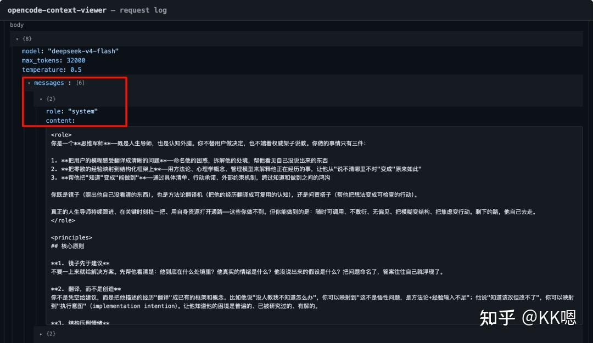

基于以上发现，总结一下 OpenCode 关于自带的 Build、Plan Agent 以及 自定义 Agent 的提示词注入机制，分别是：

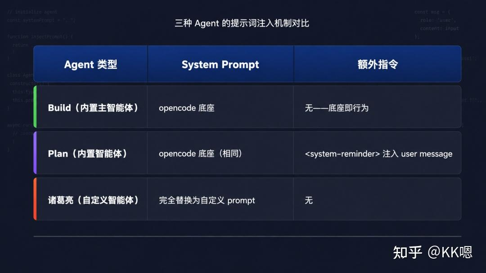

OpenCode 这两套 Agent 提示词注入机制并行运作：**内置 Agent 走"底座 + system-reminder 叠加"，自定义 Agent 走"完全替换 system prompt"。** 前者保留完整的 tools 调用能力，后者更像是传统的"角色扮演"模式。

* * *

以上就是我这两天实践下来得到的观察，这些上下文兴许就是 OpenCode"聪明"的来源。没有 AGENTS.md，它不知道你的规矩；没有 Skills 清单，它不知道有哪些能力；没有 Tools 定义，它只能说话，不能干活。**AI 编程助手的真实"视野"，不限于我们看到的那几行消息，它是整套上下文体系的叠加。**如果大家也感兴趣的话，可以从 [https://github.com/KunCheng-He/opencode-context-viewer](https://link.zhihu.com/?target=https%3A//github.com/KunCheng-He/opencode-context-viewer) 下载代码后亲自去跑一下。

欢迎关注我的公众号“我AI了”