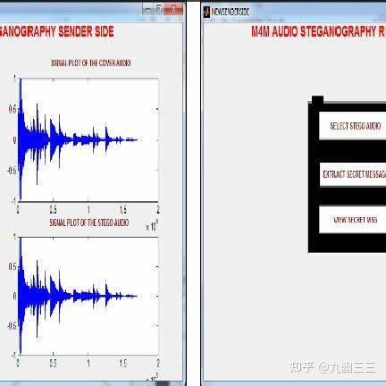
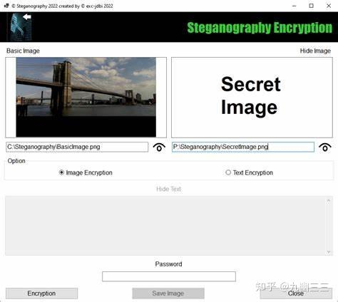
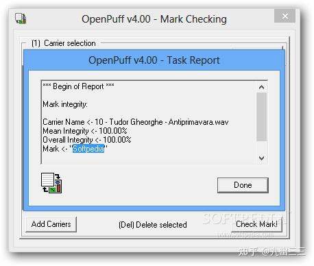

以前还专门回答类似问题。

说句实话，某音还没真测试过。不过，有很多老外在YouTube测试过，上传隐写视频把YouTube当网盘玩的。

那什么是隐写呢？

> **隐写技术**（Steganography）是一种将信息隐藏在其他载体（如图片、音频、视频、文本等）中的技术，目的是在不引起他人注意的情况下秘密传递信息。与加密技术不同，隐写技术并不直接改变信息的内容，而是通过隐藏信息的存在来实现保密。

**基本原理**

> 在图片中，可以通过微调像素的颜色值来隐藏信息。  
> 在音频中，可以通过调整声音的频率或振幅来嵌入数据。  
> 在文本中，可以通过调整字体、空格或标点符号来隐藏信息。  
> 在视频中，利用视频帧之间的冗余性，将信息嵌入到视频帧中，通过调整视频的亮度、对比度或颜色来隐藏数据。

现在github已经有很多开源项目在这么玩了，而且都基本上非常稳健（robust）！

### **SteganographierGUI**

> **功能**：这是一个开源工具，支持将文件或文件夹隐写到 MP4/MKV 视频文件中，并可以从视频中提取隐写的文件。隐写后的视频可以正常上传到 YouTube，且隐写数据在视频被压缩后仍可通过特定方法提取。  
> **特点**：  
> 支持密码保护，确保隐写文件的安全性。  
> 隐写后的视频文件可以通过修改后缀名（如改为 `.zip`）直接解压，无需依赖特定工具。  
> 即使视频被压缩或转码，隐写的文件仍可通过特定方法提取。  
> **使用方法**：  
> 通过 GUI 或 CLI 选择输入文件和输出视频文件。  
> 设置密码和输出格式（MP4 或 MKV）。  
> 隐写后的视频文件可以正常上传到 YouTube，且隐写数据在视频被压缩后仍可被还原。

### **Robust Generative Video Steganography (RoGVS)**

> **功能**：这是一个基于深度学习的视频隐写项目，通过在视频编辑过程中嵌入语义特征来隐藏数据。该方法在视频被压缩或转码后仍能保持较高的鲁棒性，适合上传到 YouTube 等平台。  
> **特点**：  
> 使用语义特征嵌入数据，避免传统隐写方法在视频压缩后数据丢失的问题。  
> 支持高容量隐写，且隐写数据在视频被压缩后仍可被准确提取。  
> 适用于面部视频数据集，但可以扩展到其他类型的视频。  
> **使用方法**：  
>   
> 使用 RoGVS 网络将数据嵌入到视频的语义特征中。  
> 生成隐写视频后，可以正常上传到 YouTube。  
> 提取数据时，使用 RoGVS 的解码模块从视频中恢复隐藏的信息。

### **OpenPuff**

> **功能**：这是一个多功能的隐写工具，支持将数据隐写到视频、音频和图像中。隐写后的视频可以上传到 YouTube，且隐写数据在视频被压缩后仍可被提取。  
> **特点**：  
> 支持多种文件格式的隐写，包括 MP4、AVI 等。  
> 提供密码保护和加密功能，确保隐写数据的安全性。  
> 隐写后的视频可以正常播放，且隐写数据在视频被压缩后仍可被提取。  
> **使用方法**：  
> 选择视频文件作为载体，并设置隐写数据。  
> 生成隐写视频后，可以上传到 YouTube。  
> 提取数据时，使用 OpenPuff 的解码功能从视频中恢复隐藏的信息。

### **Video Steganography with LSB**

> **功能**：这是一个基于 LSB（最低有效位）替换的视频隐写项目，支持将数据嵌入到视频帧的像素值中。虽然 LSB 方法在视频压缩后可能丢失数据，但可以通过优化算法提高鲁棒性。  
> **特点**：  
> 使用 LSB 替换技术将数据嵌入到视频帧的像素值中。  
> 支持无损视频格式（如 AVI），以减少数据丢失的风险。  
> 隐写后的视频可以上传到 YouTube，但需要确保视频压缩率较低。  
> **使用方法**：  
> 使用 LSB 替换算法将数据嵌入到视频帧中。  
> 生成隐写视频后，可以上传到 YouTube。  
> 提取数据时，使用 LSB 解码算法从视频中恢复隐藏的信息。

### **H.264 Video Steganography**

> **功能**：这是一个专注于 H.264 视频编码的隐写项目，支持将数据嵌入到视频的运动矢量或 DCT 系数中。该方法在视频被压缩后仍能保持较高的鲁棒性。  
> **特点**：  
> 使用 H.264 视频编码的运动矢量或 DCT 系数嵌入数据。  
> 支持高容量隐写，且隐写数据在视频被压缩后仍可被提取。  
> 适用于上传到 YouTube 等平台。  
> **使用方法**：  
> 使用 H.264 隐写算法将数据嵌入到视频的运动矢量或 DCT 系数中。  
> 生成隐写视频后，可以上传到 YouTube。  
> 提取数据时，使用 H.264 解码算法从视频中恢复隐藏的信息。

学废了么？就是去撸某音了，然后做一个解析列表。批量定制，带宽刚刚的！