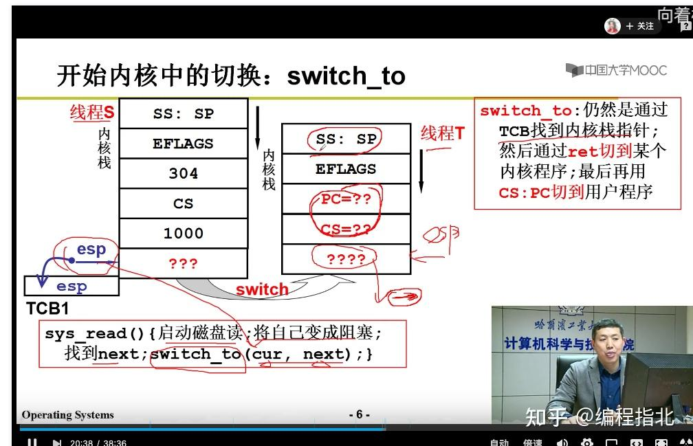
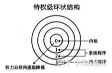

**只要你做过 MIT6.828 或者类似的 Mini os 就知道。**

一般现代CPU都有几种不同的指令执行级别。

在高执行级别下，代码可以执行特权指令，访问任意的物理地址，这种CPU执行级别就对应着内核态。

而在相应的低级别执行状态下，代码的掌控范围会受到限制。只能在对应级别允许的范围内活动。

**内核态和用户态本质是CPU支持的，而不是操作系统做的限制，比如：**

> inter的CPU将等级分为四个级别：Ring0、Ring1、Ring2、Ring3。Windows只是用其中的两个级别Ring0和Ring3，Ring0只给操作系统使用，Ring3谁都能用。如果普通应用程序企图执行Ring0指令，则windows会显示“非法指令”错误信息。

当程序中有系统调用语句，程序执行到系统调用时，首先使用类似`int 80H`的软中断指令，保存现场，去的系统调用号，在内核态执行，然后恢复现场，每个进程都会有两个栈，一个内核态栈和一个用户态栈。

**对于内核态和用户态栈切换感兴趣可以去看下哈工大李治军老师的课程：**

[操作系统（哈工大李治军老师）32讲（全）超清\_哔哩哔哩 (゜-゜)つロ 干杯~-bilibili](https://link.zhihu.com/?target=https%3A//www.bilibili.com/video/BV1d4411v7u7%3Fp%3D11)

要说清楚内核态和用户态，不得不提下实模式和保护模式。

操作系统最初就是以实模式运行的，实模式是什么？

对于早期CPU来说，实模式其实就是 8086CPU 的工作环境、工作方式、工作状态，这是一整套的内容，并不是单指某一方面的设置。

实模式被保护模式淘汰的原因，最主要是安全隐患。

**在实模式下，用户程序和操作系统可以说是同一特权的程序，因为实模式下没有特权级，它处处和操 作系统平起平坐，所以可以执行一些具有破坏性的指令。**

程序可以随意修改自己的段基址，这样便在 1~但的内存空间内不受阻拦，可以随意访问任意物理内存， 包括访问操作系统所在的内存数据。这就给程序员开放了无限的自由，程序员访问内存可以说是指哪打哪。

由于完全没有保护性可言，用户程序甚至可以覆盖操作系统在内存中的映像，整个计算机世界的和平 全靠程序员的心情。

所谓保护模式下的“保护飞主要体现在特权级上，以后随着后面工作的展开，会越来越多地和它们 打交道 。

保护模式的安全性也体现了“特权”：为了维护计算机世界的“和平飞避免潜在的危险，对于那些不 受控的程序，剥夺它们的部分能力，使它们没有杀伤力，让它们只能老老实实地运行 。

**给不同的操作给与不同的“权限”**。Linux操作系统就将权限等级分为了2个等级，分别就是内核态和用户态：

计算机世界其实可以分为两部分，访问者和受访者 。 访问者是动态的，具有能动性，它主动去访 问各种资源。 受访者是静态的，它就是被访问的资源，只能干坐着等待访问者光顾 。 访问者的特权级可以 变，受访者的特权不能变。

Intel发明了ring0-ring3这些访问控制级别来保护硬件资源，ring0的就是我们所说的内核级别,要想使用硬件资源就必须获取相应的权限（设置PSW寄存器，这个操作只能由操作系统设置）。操作系统对内核级别的指令进行封装，统一管理硬件资源，然后向用户程序提供系统服务，用户程序进行系统调用后，操作系统执行一系列的检查验证，确保这次调用是安全的，再进行相应的资源访问操作。**内核态能有效保护硬件资源的安全。**

**本质上就是特权指令的执行权，操作系统会设置状态寄存器，来控制权限，用户态没有，而内核态有执行特殊命令的权限。**

**也推荐大家去看下《操作系统真象还原》，里面对于内核态、用户态、保护模式、实模式这些概念都讲得比较清晰。**

**这些书大家可以在这里获取，对于学习计算机的同学帮助非常大，且十分系统**：

书单：[计算机必看经典书单（含下载方式）](https://link.zhihu.com/?target=http%3A//mp.weixin.qq.com/s%3F__biz%3DMzg4NjUxMzg5MA%3D%3D%26mid%3D100000686%26idx%3D1%26sn%3Daaf4a33db6e08f9be085c0c57f14fb3a%26chksm%3D4f99ca2378ee43350e13cba18595a432a0e87ddc2a8aa8457eed8d1712fb45deb1295546d834%23rd)