*虽然现在Java开发是web的天下，但是如果你想利用Java开发一款桌面应用或者移动端软件可不可以呢？*

**答案是肯定的**

**JavaFX** 是一个开源的下一代客户端应用平台，适用于基于Java构建的桌面、移动端和嵌入式系统。

**JavaFX官方网站【[https://openjfx.cn/](https://link.zhihu.com/?target=https%3A//openjfx.cn/)】**

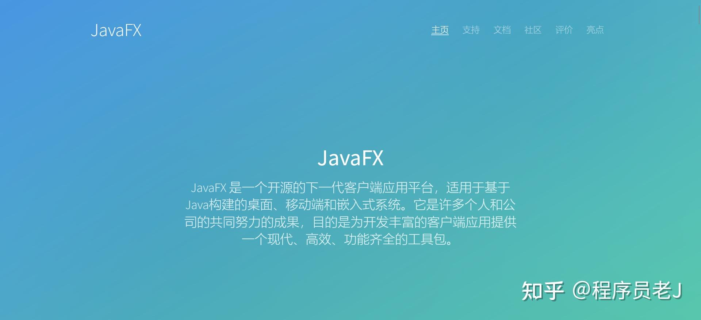

*那有的小伙伴要问了，我只会Java编程但是不会做UI设计可以吗？*

**没问题！拖拽总会吧。**

JavaFX官网往下拉，我们会发现一款名为**Scene Builder**的软件。

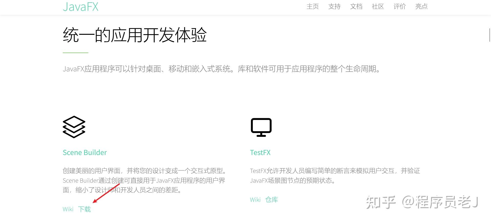

这个软件的作用就是将我们拖拽产生的界面UI生成对应的**前端代码。**这样一来，后台逻辑我们可以利用Java来写，前台页面可以利用Scene Builder自动生成，问题解决，接下来是开发一个桌面应用的教程。  

**下载Scene Builder**  

Scene Builder软件是免安装的，下载完成解压即可，目录结构如下。

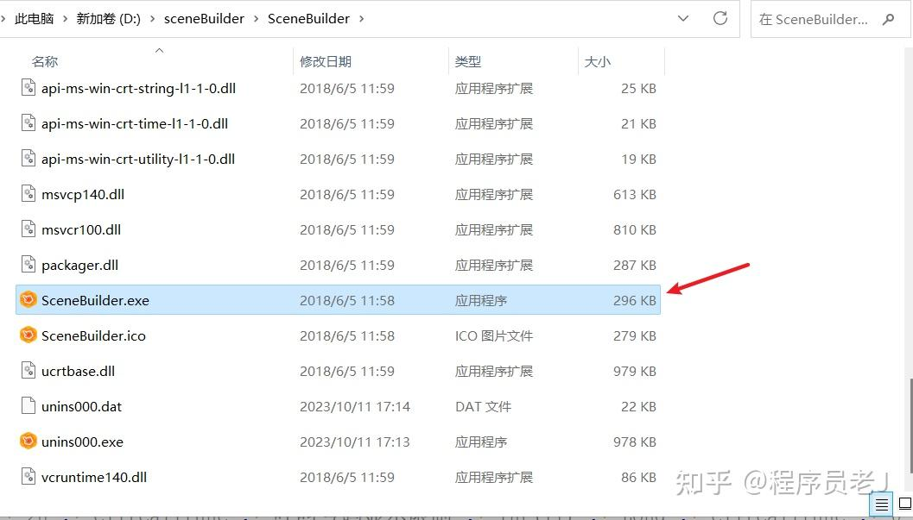

**集成IDEA**  

根据上面的描述知道Scene Builder只是生成页面的工具，我们实际的开发还是在IDE里面进行的（这里我选择IDEA作为开发工具）  

首先创建一个Maven项目

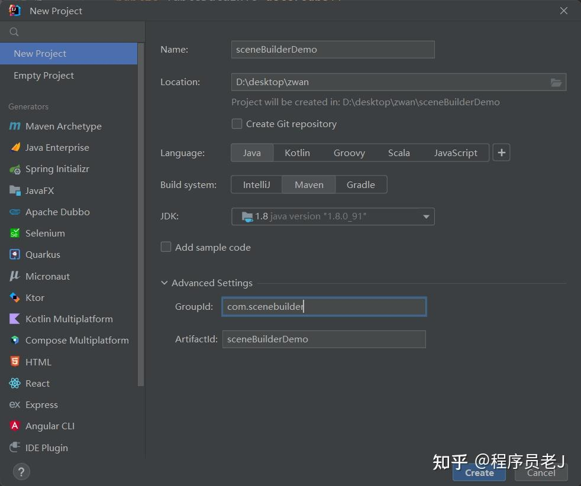

然后点击File—>点击settings—>Languages&Frameworks—>JavaFX在Path to SceneBuilder 中填入我们上一步下载好的**SceneBuilder.exe**文件的路径。

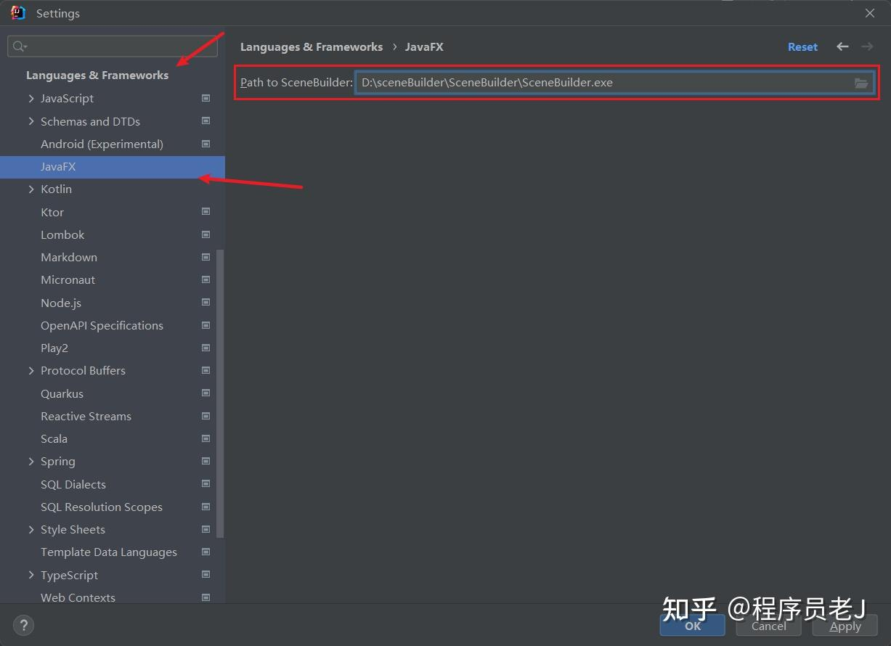

**创建第一款应用**

在这之前先解释两个概念。

**什么是fxml文件？**  
FXML是一种以XML的格式表示JavaFX界面对象的文件,FXML文件中的每一个元素可以映射到JavaFX中的一个类,每个FXML元素的属性或者其子元素都可以映射为该对应JavaFXML类的属性的文件，可以理解为界面的代码表现形式。

  
**什么是Controller类文件？**  
用来绑定这个fxml文件用的，用于控制这个界面的一些操作，实现一些功能，这和我们开发web项目的时候的controller含义基本相同。

弄明白之后我们创建第一个界面（即FXML文件）

点击新建一个FXML file——test.fxml

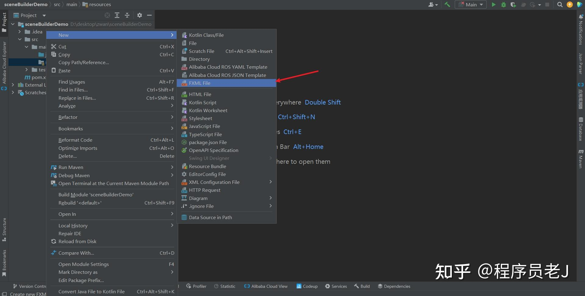

创建完成之后我们会发现一个**fx:controller**属性，这里填入对应的controller类——TestController。

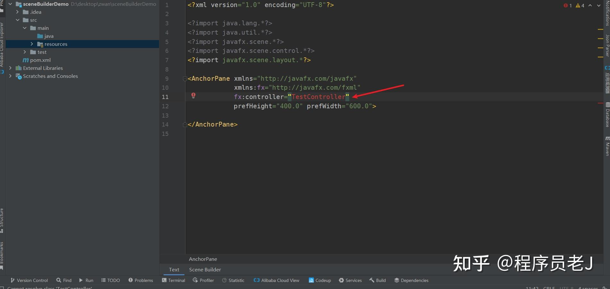

然后右键点击test.fxml，点击**Open In SceneBuilder**，test.fxml就会在SceneBuilder中打开了。

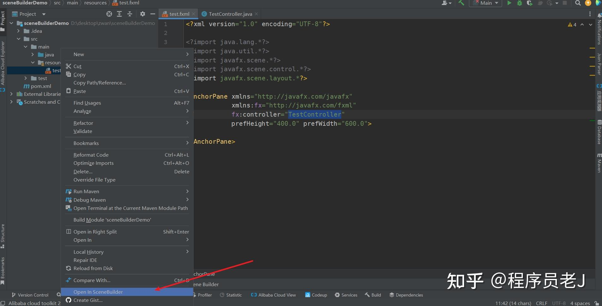

下图是SceneBuilder功能区的介绍。

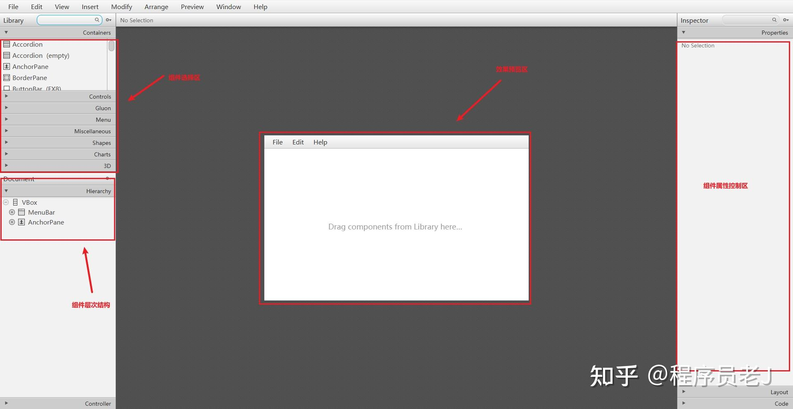

这里用一个按钮来举例，我从左侧的组件选择去拖拽一个button元素到页面中命名为【登录】并且绑定一个点击事件【login】

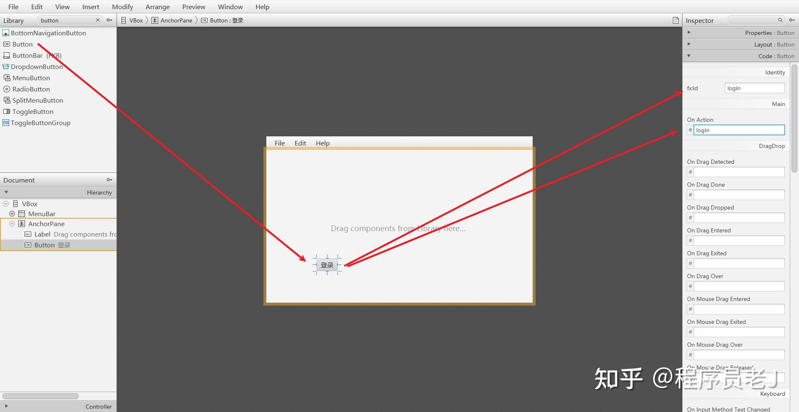

接下来我们只需要点击**file->save或者Crtl+S**保存就会发现最新拖拽的按钮已经转换为代码形式了！

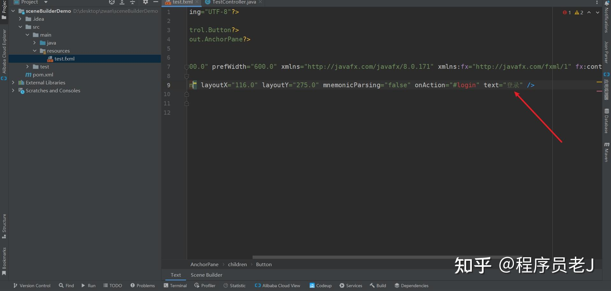

那么对应的controller文件怎么写呢，SceneBuilder的开发者索性就好人做到底，controller代码也帮我们生成好了！

点击view->Show Sample Controller Skeleton就可以复制对应的controller代码了。

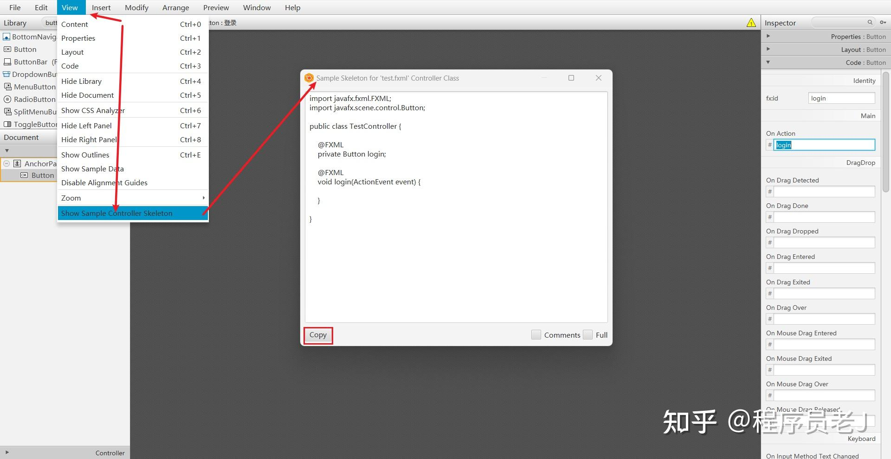

我们将复制好的controller代码粘贴到IDEA的TestController文件中，只需要关注具体的处理逻辑就可以了。比如说这里我在按钮点击之后打印【触发登录点击事件!】

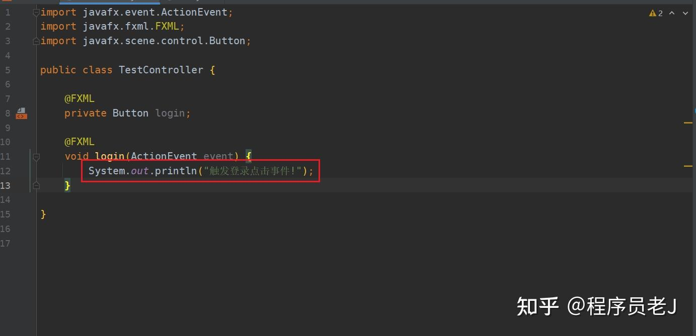

**运行我们的程序**

上述两个文件弄好了之后，我们只需要创建一个入口类，就能运行起我们的程序了。  
首先再创建一个**Main**类，然后把下面的代码复制进去（至于为什么可先不管，文章后面会说明原理）然后点击运行就可以了。

```text
import javafx.application.Application;
import javafx.fxml.FXMLLoader;
import javafx.scene.Parent;
import javafx.scene.Scene;
import javafx.stage.Stage;

import java.util.Objects;


public class Main extends Application {

    @Override
    public void start(Stage primaryStage) throws Exception{
        Parent root = FXMLLoader.load(Objects.requireNonNull(getClass().getClassLoader().getResource("test.fxml")));
        primaryStage.setTitle("test");
        primaryStage.setScene(new Scene(root, 1300, 1000));
        primaryStage.show();
    }
    public static void main(String[] args) {
        launch(args);
    }
}
```

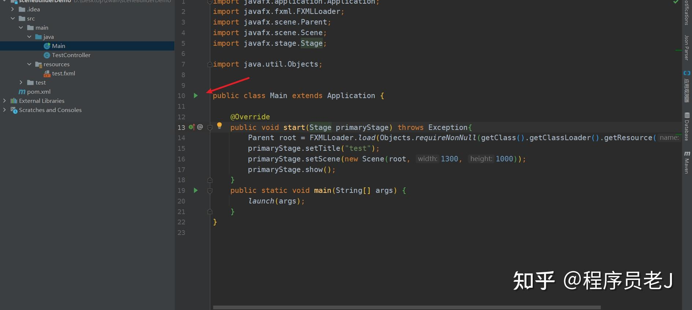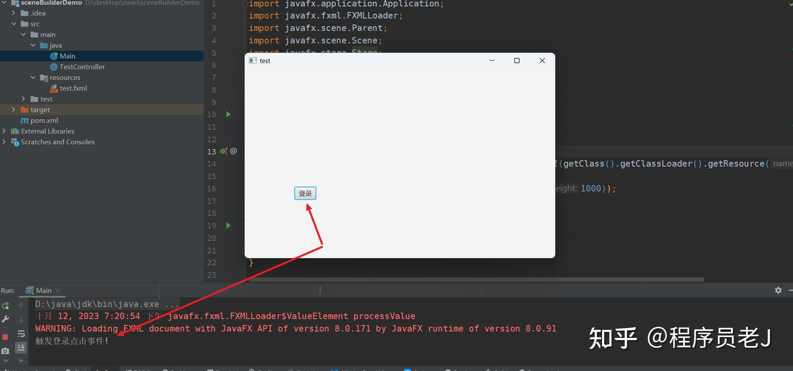

可以根据自己的功能需求在click方法中修改你点击按钮可以实现的功能~

**拓展**

之前我们创建的那个Controller类通常需要实现Initializable接口，并重写里面的initialize方法。用于在界面初始化的时候，初始化一些比如数据库数据表之类的东西  
执行程序的顺序是**init()->start()->stop()**，我们入口类Main就是继承了Application抽象类，并重写了它的start()方法，而Controller类则可以重写init()方法，来做一些初始化相关的工作。  
  
拿上面的按钮例子来解释一下标签中的属性是干嘛的吧~

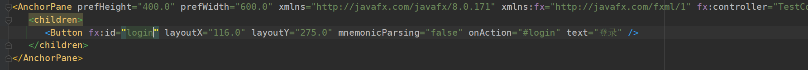

> fx:id 指的就是这个控件的id值，为的是在Controller类中控制这个控件  
> onAction 指的是点击这个按钮就能实现什么功能  
> text 指的就是这个按钮的文本

以上就是利用JavaFX做一个小的界面的例子，如果有感兴趣的小伙伴可以加入更多的组件和更复杂的逻辑。

**文章首次发布于：**

[教你用Java开发一款桌面应用](https://link.zhihu.com/?target=https%3A//mp.weixin.qq.com/s%3F__biz%3DMzkwMzUyNzg5Ng%3D%3D%26mid%3D2247484208%26idx%3D1%26sn%3D425652c293725d873dcea88d8f97efad%26chksm%3Dc095af87f7e22691938c2b330d1aacdab93ddf387a3f99a9c17d537569cb094241bca4be9fe0%26token%3D114376696%26lang%3Dzh_CN%23rd)