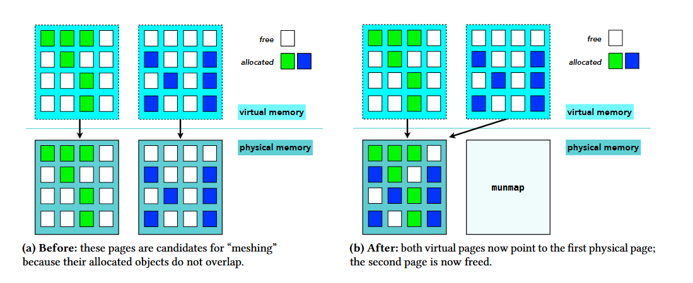

首先你要明白垃圾回收语言性能不比手动管理系差，甚至在各种需要操作大量指针的程序更好。

这是因为两点。

**gc语言申请释放内存的速度远高于malloc/free**

内存申请是这样的，gc只需要bump allocate，free list要考虑得就多了。各种各样的allocator（比如最经典的free list），在malloc的时候，需要搜索一个数据结构来寻找足够大的空间。这期间，搜索需要耗时，并且这个数据结构往往没有好cache locality，导致在memory latency越来越重要的今天成为越来越严重的瓶颈。同时，不止free list没locality，返回的指针也没locality - 你连续malloc很可能得不到连续的地址。这时候如果你访问这些结果，你需要进行多次cache fetch而不是一次。

作为对比，mark copy/mark compact的gc的allocator只是一个int，代表当时内存消耗量，每次malloc只是单纯的把size加上去，然后返回上一个消耗量，转为指针则可。

而另一方面，这份极简实现导致这两无法实现free，只能通过gc一次回收大量资源，通过batching降低内存管理消耗。

**rc的时间消耗远高于tracing的性能消耗**

rc需要你每次使用对象的时候检查ref count并且对此进行增减。如果你在写多线程程序，ref count甚至需要同步，耗费额外的性能。作为对比，如果是mark copy gc，并且堆大小为live memory \* 2的话，每次mark copy需要操作LiveMemory多的对象，然后释放HeapSize - LiveMemory = LiveMemory多的内存 - 换句话说，只需要一次copy则可完全回收（可以看到，越大的heapsize需要做的gc越小，但是吃的内存越多。如何在时空之间取舍呢？可以看[Optimal Heap Limit for Reducing Browser Memory Use](https://www.zhihu.com/question/559160156/answer/2722391734)）。这点跟传统智慧（GC慢，RC快），是完全反过来的。道理很明显 - 如果RC真更快，为什么JVM不用RC管理内存，外搭环检测器呢（python就这样做的，然后python性能有目共睹）？事实上，Steve Blackburn就做过一个测量GC vs RC的工作，[Myths and Realities: The Performance Impact of Garbage Collection](https://link.zhihu.com/?target=https%3A//www2.cs.arizona.edu/~collberg/Teaching/553/2011/Resources/gc-blackburn.pdf)。这个工作的测量结果是，GC往往会带来10%左右的开销，但是RC的开销是30%~50%。

**那问题来了，既然GC比malloc/free也比RC优秀，为什么Java没C++快？**

这是计算机领域的一个巨大归因谬误。我们先来看看这段代码：

```java
import java.util.*;
record Point(int x, int y) {}
//...
int SumX(List<Point> points) {
    int sum = 0;
    for (Point p : points) {
        sum += p.x();
    }
    return sum;
}
```

这段Java代码运行的时候计算机在具体执行什么操作？

首先，Point被boxed了。boxing导致你可以快速把一个对象到处传（只需要复制指针而无需复制具体对象），但是会造成每次引用Boxed具体内容都需要fetch远处的memory。在函数式语言中这个问题更糟糕：这时候，数据往往被储存于各种各样的链表中，而遍历就除了unbox外还需要爬链表的指针，于是一次循环需要两次memory fetch。

C++里面呢？同样的任务，会被存在vector<pair<int, int>>内。主流计算机的cache line是64byte，也就可以存4个这样的对象，于是四次循环一次memory fetch。同时，在性能关键的情况下，这列表可以用pair<vector<int>,vector<int>>保存，俗称的struct of array over array of struct[^1] 。然后，由于sum of X只需要触碰X，所以是八次循环一次memory fetch，对比着函数式编程的方案，有着16倍的memory fetch开销 - 一个数量差！现实中，情况往往没这么极端，但是一个小倍数依然是很大的差距。

**同时，C++也并不用RC**

我们观察上述代码的C++形式：

```cpp
struct Point {
    int x;
    int y;
};

int SumX(const std::vector<Point>& points) {
    int sum = 0; 
    for (const Point& p : points) {
        sum += p.x;
    }
    return sum;
}
```

可以注意到，

-   vector手动管理了内部Point的内存，而不是RC
-   传入SumX的是一个引用，而不是RC
-   iterate用的又是一个引用，而不是RC

也就是说，大部分C++代码的内存管理并不是RC，而是stl容器手动管理，以及利用程序结构LIFO特性传引用。这导致尽管RC有很高的overhead，但是只要你用得不多，还是可以的。

当然，反过来说，用得多的情况，比如编译器（指针满天飞），GC语言可以取得比没GC语言更好的性能（因为他们需要很多RC）

题目中的程序描述（频繁malloc/free小对象，同时面条代码翻译表明大概用上了RC），正是GC语言的最优发挥场所，打不过也不奇怪。

如果要优化性能，可以试试看用arena管理内存。如果生命周期不确定并且一定要及时释放，那真要考虑自己实现一个简单的mark copy GC了，可以试试看[Cheney's algorithm](https://link.zhihu.com/?target=https%3A//en.wikipedia.org/wiki/Cheney%2527s_algorithm)。（当然，也可以更简单的换回Java）。

**如果真要在无GC语言里面解决内存碎片，怎么办？**

[Mesh: Compacting Memory Management for C/C++ Applications](https://link.zhihu.com/?target=https%3A//arxiv.org/abs/1902.04738)就是一个带有反碎片化功能的malloc/free allocator。听上去很矛盾 - 你既然不知道指针都在那，你怎么可以通过move来compact呢？

因为allocator底层还有东西。你allocate到的内存地址并不是‘真正的地址’，底下还有TLB把这些虚拟地址变成物理地址。那我们考虑两个页面，其中被用到的地址互不相交，这时候我们可以用一个物理页来表示这两个虚拟页，从而消除碎片化。



十分神奇的是，直觉告诉我，这样‘刚刚好’的页面不好找，但是他们用组合数学证明了这样的页面配对有很多，而且找起来很快！

[^1]: 细心的朋友可以发现，这其实是在进行matrix transpose 